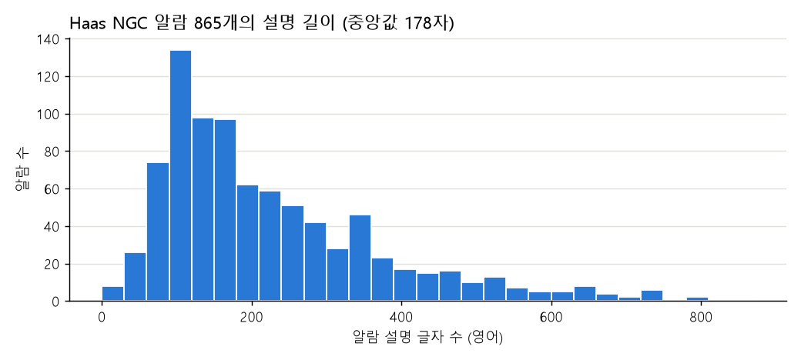
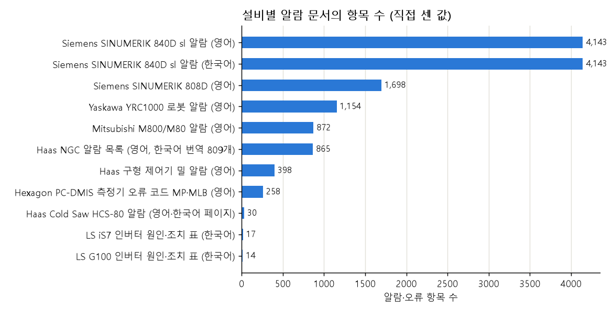
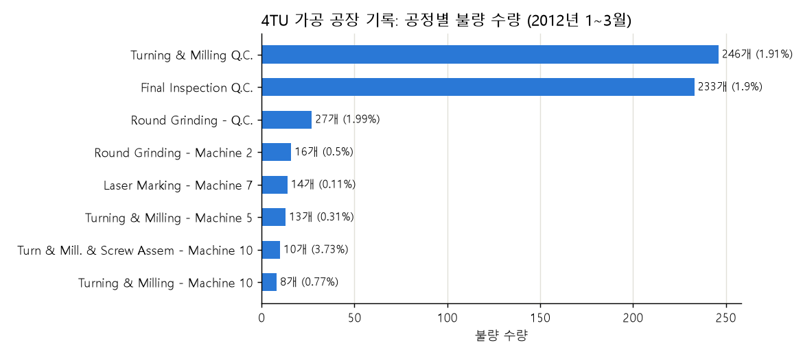
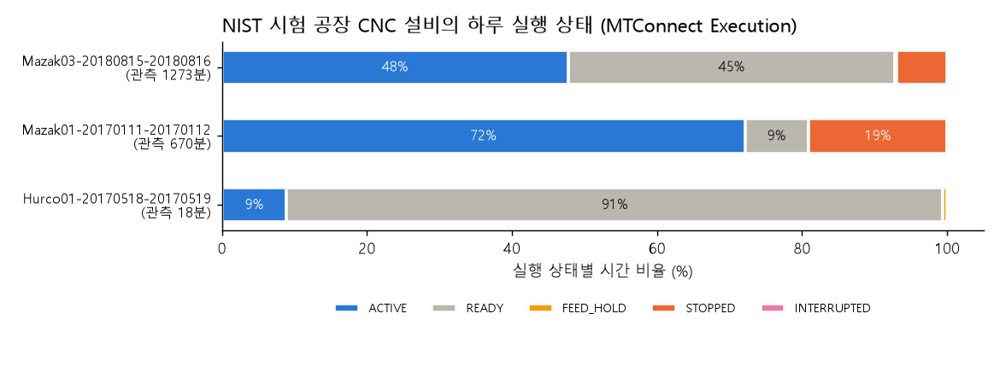

# 자동차 부품 절삭가공 라인(Haas VF-2) 자료 탐색 보고서

> 목적: 팀원이 Gemini로 정리한 주제가 「제조 운영 관리 플랫폼」 프로젝트에 맞는지 판단
> 주제: 자동차 파워트레인 부품용 알루미늄 브래킷 절삭가공 라인, 핵심 설비 Haas VF-2 (3축 수직 머시닝센터)
> 작성일: 2026-10-01
> 팀원 자료: [Gemini 공유 링크](https://gemini.google.com/share/eeb3ec734479) (글자만 뽑은 사본: `gemini/teammate_gemini_share_text.txt`)
> 코드: `analysis/00_extract_text.py` → `01_verify_gemini_claims.py` → `02_documents_eda.py` → `03_real_data_eda.py`
> 결과 파일: `analysis/outputs/` (JSON, CSV, PNG)
> 문서와 데이터: `docs/` (PDF 81개, 12,502쪽 + 웹 문서 사본), `data/`
>
> 이 보고서의 숫자는 **위 코드로 직접 세었거나 문서를 직접 열어 확인한 것**이다. 조사 과정에서 한 번 확인했지만 다시 세지 않은 것은 "조사 때 확인", 확인하지 못한 것은 "확인 못 함"으로 적었다.

---

## 0. 결론 먼저

| 질문 | 답 | 근거 |
|---|---|---|
| 팀원 자료는 무엇을 정했나? | 설비(Haas VF-2), 공정 5단계, 기능 5개, 알람 3종, 안전 수칙, 뼈대 문서 8종의 초안 | 1장 |
| 팀원 자료를 그대로 써도 되나? | **뼈대는 쓸 수 있고, 숫자와 출처는 고쳐야 한다.** 33개 주장 중 맞음 8, 일부 맞음 12, 틀림 6, 근거 없음 7 | 2장 |
| 알람 3종(135, 179, 992)은 실제인가? | 이름은 실제다. 그러나 **135와 179는 구형 제어기 알람이고 새 VF-2에는 없다.** 임계값(135 ℃, 2.5 bar, 60 A)은 어느 문서에도 없다 | 2.1 |
| 고장 매뉴얼은 충분한가? | **매우 충분하다.** 공식 알람 목록 865개(한국어 번역 809개), 고장 대응 안내, 정비 일정 58항목, 한국어 조작 매뉴얼 498쪽 | 3장 |
| 안전 수칙은 실제 문서가 있나? | 있다. 법 조항과 잠금·표지 절차는 실제다. 다만 **팀원 자료가 든 KOSHA 지침 이름 2개는 존재하지 않는다** | 4장 |
| 품질 검사 기준은? | 공정능력 지수, 일반 공차 같은 **규칙**은 실제 문서가 있다. 브래킷의 **개별 수치**(위치도 0.02 등)는 근거가 없다 | 5장 |
| 공정 흐름도는? | 자동차 브래킷 가공의 공개 공정 흐름도는 찾지 못했다. 실제 가공 작업 순서 자료는 미국 NIST 것(자동차 부품 아님)뿐이다 | 5.4 |
| 실제 데이터는 있나? | 상태·알람·작업지시·품질이 한 번에 든 데이터는 없다. 세 조각으로 나뉘어 있다 | 7장 |
| 프로젝트에 맞나? | **적합하다.** 지금까지 본 후보 중 고장 알람 문서와 한국어 문서가 가장 강하다. 공정 흐름과 부품 품질 수치는 가상으로 정해야 한다 | 10장 |

---

## 1. 팀원 자료 요약

### 1.1 무엇을 정했나

| 항목 | 팀원 자료의 내용 |
|---|---|
| 산업환경 | 자동차 파워트레인 부품용 알루미늄(AL6061) 브래킷 정밀 절삭가공 라인 |
| 핵심 설비 | Haas VF-2 3축 수직 머시닝센터 (OP-30) |
| 공정 5단계 | OP-10 절단(Haas Cold Saw 80) → OP-20 황삭 밀링 → OP-30 정밀 가공(VF-2) → OP-40 디버링·세척 → OP-50 3차원 측정(Zeiss Bridge-684) |
| 기능 범위 | 정비 3개(매뉴얼 챗봇, 알람 지침 카드, 작업지시서 초안) + 생산 2개(가동 현황 화면, 교대 보고서). 나머지 6개는 제외 |
| 알람 예시 | 135 X축 모터 과열, 179 변속기 오일 압력 저하, 992 앰프 과전류 (각각 임계값과 심각도 포함) |
| 안전 | 산업안전보건기준 규칙 제92조, KOSHA 지침, 잠금·표지 6단계, 보호구 |
| 뼈대 문서 | 기능 정의서, 공정 흐름, 코드 정의, 지표 정의, DB 설계, 품질 기준, 권한, 연계 규격 (DB 설계와 JSON 규격은 예시 코드 포함) |
| 그 밖 | 화면 4종의 예시 코드, 3분 시연 순서 |

### 1.2 자료의 성격

- Gemini의 조사 기능이 만든 글이다. 출처는 "Notebook source 14: Haas VF-Series Service Manual"처럼 이름만 적혀 있고 링크가 없다.
- "8개 문서 전 항목이 100% 충족(PASS)"이라는 검증표가 있지만, 이것도 Gemini가 스스로 쓴 것이다.
- DB 설계와 JSON 규격은 팀이 직접 만드는 "더미" 항목이라 사실 검증 대상이 아니다. 실행해 보지는 않았다.

---

## 2. 팀원 자료 검증

판정은 네 가지다. **맞음**(문서에 그대로 있음), **일부 맞음**(일부만 문서와 같음), **틀림**(문서와 다름), **근거 없음**(어느 문서에도 없음).

### 2.1 Haas 설비 관련

| # | 팀원 자료의 주장 | 판정 | 실제 문서 내용 | 근거 |
|---|---|---|---|---|
| H1 | 알람 135 = X-AXIS MOTOR OVERHEAT | 일부 맞음 | 구형 제어기의 알람이다. 새 제어기(NGC) 알람 865개에는 135번이 없다. NGC의 모터 과열은 254 SPINDLE MOTOR OVERHEAT 등으로 번호가 다르다 | 공식 알람 목록, 2001년 매뉴얼 60쪽 |
| H2 | 135의 조건: 135 ℃ 초과 | **틀림** | "온도 센서가 150 ℉(65 ℃)를 넘었다"고 적혀 있다. 135는 알람 번호이지 온도가 아니다. "135 ℃"는 Haas 문서 어디에도 없다 | 2011년 전기 매뉴얼 145쪽 |
| H3 | 알람 179 = LOW PRESSURE TRANS OIL | 일부 맞음 | 구형 제어기 알람이다. 지금 밀 목록에서는 이름이 LOW GEARBOX OIL PRESSURE로 바뀌었다. NGC에는 179번이 없고 2011·2012번이 기어박스 오일 알람이다. **표준 VF-2는 직결 구동이라 기어박스가 없다** (옵션) | 공식 알람 목록, VF-2 사양 페이지 |
| H4 | 179의 조건: 2.5 bar 미만 5초 | 근거 없음 | 압력 값도 시간도 없다. "오일이 적거나 압력이 낮다"가 전부다 | 같은 문서 |
| H5 | 알람 992 = AMPLIFIER OVER CURRENT | 맞음 | NGC와 구형 제어기 모두에 있다 | 공식 알람 목록 |
| H6 | 992의 조건: 60 A 초과 또는 권선 지락 | **틀림** | 전류 값이 없다. 60 A는 앰프의 크기 종류(30/45/60/90 A)다. 지락은 별도 알람 645 AMPLIFIER GROUND FAULT다 | 서보 앰프 고장 대응 안내 |
| H7 | 심각도(Critical/High)와 정지 동작 | 근거 없음 | Haas 알람 목록에는 심각도 항목이 없다 | 공식 알람 목록 |
| H8 | 인용문 "Measure the resistance from the pins labeled A, B and C…" | 일부 맞음 | 문장은 실제 Haas 글이다. 그러나 출처가 "서비스 매뉴얼 6장 142쪽"이 아니라 **웹의 고장 대응 안내**이고, 쪽수가 없는 문서다 | 웹 문서 4편 |
| H9 | 매뉴얼이 6개 장(안전, 사양, 조작, 예방 정비, 기계·전기, 고장·알람)으로 구성 | **틀림** | 조작 매뉴얼은 10개 장이고 알람 장과 정비 장이 없다. Haas는 "2011년 이후 기계는 서비스 매뉴얼을 만들지 않았고 웹에 있다"고 밝힌다 | 조작 매뉴얼 2025년판(588쪽) |
| H10 | 전원 차단 후 5분 대기 (320 V 콘덴서 방전) | 일부 맞음 | "**고전압 표시등이 꺼진 뒤** 최소 5분"이다. 전원을 끈 시점부터가 아니다. 2005년 매뉴얼에는 "약 10분"으로 적혀 있다 | 고장 대응 안내의 전기 안전 문단 |
| H11 | OP-10 설비 "Haas Cold Saw 80 (HCS-80)" | 맞음 | 실제 제품이다. 2026년 7월자 매뉴얼이 Haas 사이트에 있고 한국어 페이지도 있다 | HCS 매뉴얼 웹 문서 |
| H12 | 공압 공급 0.6 MPa | 일부 맞음 | 사양 페이지의 값은 필요 100 psi(6.9 bar), 최소 80 psi(5.5 bar)다. 0.6 MPa와 다르다 | VF-2 사양 페이지 |
| H13 | Haas는 매뉴얼과 알람 코드를 공개한다 | 맞음 | 3장 참고 | — |

### 2.2 안전 관련

| # | 팀원 자료의 주장 | 판정 | 실제 문서 내용 | 근거 |
|---|---|---|---|---|
| S1 | 산업안전보건기준 규칙 제92조가 정비 시 운전 정지를 요구 | 맞음 | 조 제목과 내용이 그대로다. 다만 2항은 "잠금장치를 하고 열쇠를 별도 관리하거나 표지판을 설치"로, 잠금과 표지 중 하나를 요구한다 | 법령 원문 |
| S2 | "KOSHA GUIDE 기계·기구 정비보수 작업의 안전작업지침", "공작기계 정비 안전작업지침 및 LOTO 작업 가이드" | **틀림** | 이런 이름의 지침은 없다. 실제 지침은 **KOSHA GUIDE B-M-25-2026 「에너지 차단장치의 잠금·표지에 관한 기술지원규정」**(19쪽)이다. 머시닝센터나 밀링용 KOSHA GUIDE는 없다 | KOSHA 문서 36개 |
| S3 | 잠금·표지 6단계 순서 | 일부 맞음 | 순서는 실제 지침과 같다(4.2 참고). 다만 "사전 공지"는 번호 붙은 단계가 아니고, 작업 후 **해제 절차 3단계**가 빠져 있다 | B-M-25-2026 10~11쪽 |
| S4 | 면장갑 금지, NBR 코팅 장갑 또는 맨손 | 일부 맞음 | 면장갑 금지는 KOSHA 안전 자료에 있다. 법 제95조는 "손에 밀착이 잘되는 가죽 장갑 등"이라고 한다. "NBR"은 어느 문서에도 없다 | 법령 원문, 밀링 안전 자료 |
| S5 | 방유 안전화, 보안경, 귀마개 필수 | 일부 맞음 | 보안경과 안전화는 근거가 있다. "방유"는 어느 문서에도 없다. 청력 보호구는 소음 작업(85 dB 이상)일 때 지급한다 | 법령 제32조, 제516조 (조사 때 확인) |
| S6 | "한국산업안전보건공단 인증" 보호구 | **틀림** | 법의 이름은 "안전인증"이고 고용노동부장관이 실시한다. 공단은 위탁 기관이다 | 산업안전보건법 제84조 (조사 때 확인) |
| S7 | 자물쇠 열쇠는 작업자가 휴대 | 일부 맞음 | 법은 "열쇠를 별도 관리"라고 한다. 머시닝센터 안전 자료에는 "Key를 분리하여 작업자가 직접 소지"가 있다 | 법령 원문, 안전 자료 (조사 때 확인) |

### 2.3 공정·품질 수치

| # | 팀원 자료의 수치 | 판정 | 실제 문서 내용 | 근거 |
|---|---|---|---|---|
| Q1 | 절단 길이 150.0 ± 0.5 mm | 맞음 | 일반 공차 중급(120~400 mm)이 ±0.5다. 톱 절단 전용 기준은 아니다 | 일반 공차표 2종 |
| Q2 | 황삭 후 거칠기 Ra ≤ 6.3 µm | 맞음 | 밀링의 보통 범위가 Ra 3.2~25다 | 가공법별 거칠기 표 (그림, 조사 때 확인) |
| Q3 | 두께 ± 0.1 mm | 일부 맞음 | 6~30 mm 구간에서 정밀급이 ±0.1, 중급이 ±0.2다 | 일반 공차표 |
| Q4 | 베어링 구멍 Ø45.000 ± 0.015 mm | 근거 없음 | 표준 등급에 없는 값이다. 30~50 mm 구멍은 H7이 +0.025/0, JS7이 ±0.012다. 실제 도면은 "Ø45 H7"처럼 적는다 | 구멍 공차표 (직접 봄) |
| Q5 | 위치도 0.02 mm | 근거 없음 | 실제 도면 자료(NIST)는 0.25를 쓴다 | NIST 검사 결과 (조사 때 확인) |
| Q6 | 평면도 0.020 mm 이하 | 근거 없음 | 일반 공차(100~300 mm)는 0.2다. NIST 자료는 0.05다 | 일반 공차표 (조사 때 확인) |
| Q7 | Cpk ≥ 1.33 | 일부 맞음 | 1.33은 양산 중 유지 기준이다. 특별 특성의 승인 단계는 1.67이다 (5.1 참고) | Ford, Cummins, Danfoss 문서 |
| Q8 | 잔류 유분 0.1 mg/cm² 미만 | 근거 없음 | 실제 청정도 규격은 기름 막이 아니라 **입자** 기준이다 | 청정도 규격 2종 (조사 때 확인) |

### 2.4 지표 계산식

| # | 팀원 자료의 식 | 판정 | 실제 문서 내용 |
|---|---|---|---|
| K1 | 가동률 = APT ÷ PBT | 맞음 | NIST 논문 식 10과 같다 |
| K2 | MTBF = ΣTBF ÷ FE = APT ÷ FE | 일부 맞음 | 앞 식은 맞다. 뒤 식은 다르다. 논문은 MTBF = 평균 운전 시간 + 평균 지연 시간 + 평균 준비 시간(식 33)으로, 운전 시간만 쓰는 지표(MOTBF)와 구분한다 |
| K3 | MTTR = ΣTTR ÷ FE | 맞음 | 식 31과 같다 |

### 2.5 그 밖

| # | 주장 | 판정 | 내용 |
|---|---|---|---|
| O1 | OP-50 설비 "Zeiss Bridge-684" | 근거 없음 | 검색에서 이런 제품명이 나오지 않았다. Zeiss 사이트를 직접 열어 보지는 못했다 |
| O2 | 문서 출처 표기 ("Chapter 6", "p.142") | **틀림** | H8, H9 참고. 실제 문서 구조와 맞지 않는다 |

### 2.6 판정 요약

| 판정 | 개수 | 항목 |
|---|---|---|
| 맞음 | 8 | H5, H11, H13, S1, Q1, Q2, K1, K3 |
| 일부 맞음 | 12 | H1, H3, H8, H10, H12, S3, S4, S5, S7, Q3, Q7, K2 |
| 틀림 | 6 | H2, H6, H9, S2, S6, O2 |
| 근거 없음 | 7 | H4, H7, Q4, Q5, Q6, Q8, O1 |

**가장 중요한 문제는 H1~H3이다.** 팀원 자료의 시연 시나리오는 "VF-2에서 알람 135가 뜨고 모터 온도가 138.4 ℃"인데, 새 VF-2에는 알람 135가 없고 실제 기준 온도는 65 ℃다. 시나리오를 실제 알람으로 바꿔야 한다(10.4 참고).

---

## 3. 실제 문서: Haas (핵심 설비)

### 3.1 확보한 문서

| 문서 | 분량 | 언어 | 내용 | 파일 |
|---|---|---|---|---|
| 공식 알람 목록 | 1,564개 | 영어 + 한국어 | 번호, 이름, 설명. Haas 사이트의 목록 파일(2025-01-30 사본)을 표로 바꾼 것 | `docs/haas/haas_alarm_list_20250130_en_ko.csv` |
| 밀 조작 매뉴얼 (NGC, 2025년판) | 588쪽 | 영어 | 안전, 조작, 프로그래밍, G·M 코드, 설정 | `docs/haas/en_mill_ngc_operators_manual_2025.pdf` |
| 밀 조작 매뉴얼 (NGC, 2020년) | 498쪽 | **한국어** | 위와 같은 10개 장 | `docs/haas/ko_96-KO8210_Mill.pdf` |
| 밀 조작 매뉴얼 (구형 제어기, 2015년) | 402쪽 | **한국어** | 유지보수 장 포함 | `docs/haas/ko_mill_operators_manual_2015.pdf` |
| 전기 서비스 매뉴얼 (2011년) | 375쪽 | 영어 | 구형 제어기 알람(141~194쪽), 파라미터 | `docs/haas/en_electrical_service_manual_2011.pdf` |
| 기계 서비스 매뉴얼 (2011년) | 720쪽 | 영어 | 부품별 정비 절차 | `docs/haas/en_mechanical_service_manual_2011.pdf` |
| 밀 서비스 매뉴얼 (2005년) | 435쪽 | 영어 | 고장 진단, 알람, 정비 | `docs/haas/en_mill_service_manual_2005.pdf` |
| 고장 대응 안내 (웹) | 12편 | 영어 | 증상(알람) / 가능한 원인 / 조치 표 | `docs/haas/web_snapshots/tsg_*.txt` |
| 정비 일정 (웹) | 58항목 | 영어 | 부품별 점검 주기 | `howto_vmc_maintenance_schedule.txt` |
| 설비 데이터 수집 안내 (웹) | 1편 | 영어 | 상태 데이터를 꺼내는 3가지 방법 | `man_ngc_machine_data_collection.txt` |
| VF-2 사양 (웹) | 1편 | 영어 | 이송 거리, 주축, 공구 교환기, 공기 | `vf-2.txt` |
| 톱 기계 HCS-80 매뉴얼 (웹) | 7개 장 | 영어 + 한국어 | 알람 30개 | `haas_hcs_*.html` |

- 2001년 서비스 매뉴얼(451쪽, 알람 446개)은 `8_Haas_VF-1_milling/docs/`에 이미 있다.
- Haas 사이트의 일반 페이지는 자동 접속을 막는다. 웹 문서는 인터넷 보관소(Wayback Machine)에 저장된 공식 페이지 사본이다. PDF는 Haas 사이트에서 직접 받았다.

### 3.2 알람 목록 분석



| 항목 | 새 제어기 (NGC) | 구형 밀 | 구형 선반 |
|---|---|---|---|
| 알람 수 | **865** | 398 | 301 |
| 축 번호가 붙은 알람 (예: 4.992) | 129 | 0 | 0 |
| 설명 길이 중앙값 | 178자 | 149자 | 151자 |
| 설명이 60자 미만 | 34개 | 51개 | 33개 |
| 조치 단어(check, replace 등)가 있는 알람 | 543개 (63%) | 260개 (65%) | 151개 (50%) |
| 한국어 번역이 있는 알람 | **809개 (94%)** | 398개 | 301개 |

| NGC 번호대 | 알람 수 |
|---|---|
| 0~999 | 378 |
| 1000~1999 | 14 |
| 2000~2999 | 64 |
| 4000~4999 | 24 |
| 8000~8999 | 9 |
| 9000~9999 | 344 |
| 20000~20999 | 32 |

- 2001년 매뉴얼의 알람(446개 중 조치 단어 104개)보다 설명이 훨씬 자세하다.
- 알람 992의 한국어 설명 예: "증폭기가 모터에 지나친 전류가 흐르는지를 감지했습니다. … 공구를 확인하십시오. 속도와 이송을 확인하십시오."
- 목록에는 심각도 항목이 없다. 심각도는 팀이 직접 정해야 한다.

### 3.3 고장 대응 안내의 구조

저장한 12편은 모두 같은 틀이다: 소개 → 전기 안전 → **증상 표(알람 번호와 이름 / 가능한 원인 / 조치)** → 원인별 상세 절차 → 전기 도면.

| 안내 문서 | "조치" 표 머리글 수 | 언급된 알람 번호 수 | 전기 안전 문단 |
|---|---|---|---|
| 서보 앰프 (NGC) | 7 | 6 | 있음 |
| 축 서보 모터와 케이블 (NGC) | 4 | 16 | 있음 |
| 축 서보 모터와 케이블 (구형 2종) | 6, 6 | 9, 3 | 있음 |
| 회생 벡터 드라이브 (NGC) | 3 | 14 | 있음 |
| 320 V 전원 장치 (NGC) | 4 | 5 | 있음 |
| 밀 주축 | 11 | 2 | 없음 |
| 우산형 공구 교환기 | 9 | 12 | 없음 |
| 측면 장착 공구 교환기 | 14 | 4 | 없음 |
| 축 윤활유 | 1 | 2 | 없음 |
| 표준 절삭유 (NGC) | 1 | 3 | 없음 |
| 압력 게이지 | 3 | 0 | 없음 |

- 이 문서들이 "알람 대응 지침 카드"의 가장 좋은 재료다. 알람 목록은 설명이 한두 문장이지만, 안내 문서에는 점검 순서와 측정 방법이 있다.
- 인터넷 보관소 목록에는 이런 안내가 154편 있다 (조사 때 확인, 열어 본 것은 12편).
- 전기 안전 문단 원문: "주 차단기를 OFF로 한다. 제어반 안에서 작업하기 전에 320 V 전원 장치/벡터 드라이브의 고전압 표시등이 **최소 5분 동안 꺼져 있어야 한다**."

### 3.4 정비 일정

| 주기 | 항목 수 |
|---|---|
| 매일 | 2 |
| 매주 | 9 |
| 매월 | 14 |
| 분기 | 1 |
| 6개월 | 18 |
| 매년 | 7 |
| 2년 / 4년 | 2 / 1 |
| 필요할 때 / 게이지 확인 | 3 / 1 |
| **합계** | **58** |

예: "도어 인터록 작동 점검 — 매일", "주축 공기 압력 조절기 점검 — 매주", "벡터 드라이브 환기구·필터 청소 — 매월". 예방 정비 일정 화면의 근거로 쓸 수 있다.

### 3.5 설비에서 상태 데이터를 꺼내는 방법 (공식 문서)

| 방법 | 내용 |
|---|---|
| MTConnect | 제어기에 내장. 고정 포트 8082. 요청은 probe / current / sample 세 가지 |
| Q 명령 | 네트워크로 `?Q500` 같은 명령을 보내면 응답. 14종. 예: Q500 = 프로그램 이름, 상태(IDLE/BUSY), 부품 수 |
| 상태 릴레이 | 가공 중, 이송 정지, 정지 등 신호 |

운영 관리 플랫폼의 "연계 규격"(뼈대 문서 8번)을 실제 방식에 맞춰 쓸 수 있다. 실제 Haas 제어기가 내보내는 항목은 7.4에 정리했다.

### 3.6 제어기 세대 문제

| 구분 | 구형 제어기 (CHC) | 새 제어기 (NGC) |
|---|---|---|
| 시기 | 이전 기계 | 현재 판매 기계 (NGC 한국어 매뉴얼 첫 판이 2016년 4월) |
| 알람 문서 | 서비스 매뉴얼 PDF (2001, 2005, 2011년판) | 웹 알람 목록 + 고장 대응 안내 |
| X축 모터 과열 | 135 | 없음 |
| 변속기 오일 | 179 | 2011, 2012 (기어박스 옵션 기계만) |
| 앰프 과전류 | 992 (2011년판부터) | 992, 축 번호가 붙은 형태(예: 4.992) |

팀은 **가상 공장의 VF-2가 어느 제어기인지 먼저 정해야 한다.** 새 기계로 설정하면 NGC 알람 목록(한국어 번역 포함)을 쓰는 것이 맞다.

---

## 4. 실제 문서: 안전 (법령과 KOSHA)

### 4.1 확보한 문서

KOSHA 포털에서 직접 받은 PDF 36개(496쪽)와 법령 원문이다.

| 구분 | 문서 | 분량 | 쓰임 |
|---|---|---|---|
| 법령 | 산업안전보건기준에 관한 규칙 (제92조, 제95조, 제32조 등) | 원문 글 | 운전 정지, 장갑, 보호구의 법적 근거 |
| 잠금·표지 | **KOSHA GUIDE B-M-25-2026** 에너지 차단장치의 잠금·표지 | 19쪽 | 지침 카드와 작업지시서의 안전 절차 |
| 잠금·표지 (폐지) | KOSHA GUIDE E-91-2016 | 15쪽 | 위 지침의 이전 판 |
| 공작기계 | M-1-2013 CNC 선반, M-96 선반, M-98 드릴기, M-99 보링기 | 13~26쪽 | 방호 조치 |
| 절삭유 | M-21-2012 금속 절삭유 사용, A-53-2018 금속가공유 측정 | 10, 14쪽 | 절삭유 취급 |
| 톱 | M-9-2023 금속 가공용 수동 둥근톱 | 11쪽 | OP-10 |
| 압축 공기 | G-17-2017 압축공기의 안전한 사용 | 15쪽 | 청소 작업 |
| 보호구 | A-G-12-2026 개인보호구, H-42 장갑, H-160 청력보호구 | 12~25쪽 | 보호구 |
| 알루미늄 분진 | P-68-2012, P-128-2012 | 14, 12쪽 | 알루미늄 가공 특유의 위험 |
| 위험성 평가 | C-C-67-2026 작업위험성평가, M-123-2012 | 45, 23쪽 | 작업 전 평가 |
| 안전 자료(OPS) | 머시닝센터 안전작업, 밀링기계 작업안전(근로자용·관리자용), 공작기계 사망사고 속보, 금속 절삭유 등 13종 | 1~4쪽 | 설비별 안전 수칙, 점검표 |

- **머시닝센터나 밀링을 다루는 KOSHA GUIDE는 없다.** 짧은 안전 자료(OPS)만 있다.
- 글자 추출이 안 되는 PDF가 5개 있다(그림으로 된 문서). 잠금·표지 절차를 그림으로 설명한 "LOTO 작업절차 바로알기"가 여기에 들어 있어, 쓰려면 글자 인식(OCR)이 필요하다.

### 4.2 실제 잠금·표지 절차 (B-M-25-2026 원문 제목)

| 단계 | 실행 (6장) | 팀원 자료와 비교 |
|---|---|---|
| 6.1 | 기기 등의 운전정지 준비 | 팀원 자료는 "사전 작업 공지"로 적음. 실제로는 에너지의 종류와 크기를 아는 단계 |
| 6.2 | 기기 등의 운전정지 | 같음 |
| 6.3 | 기기 등의 차단 | 같음 |
| 6.4 | 잠금장치 또는 표지의 설치 | 같음 |
| 6.5 | 저장 또는 축적된 에너지의 관리 | 같음 (잔류 에너지 방출) |
| 6.6 | 차단 확인 | 같음. "무전압"이라는 말은 지침에 없음 |
| 7.1~7.3 | (해제) 기기 등의 점검 → 작업자 확인 → 잠금장치·표지의 제거 | **팀원 자료에 없음** |

- 작업자에게 알리는 것은 5.9항에 있고, "에너지 관리장치를 사용하기 전과 철거한 후"에 알리라고 한다.
- 5.2항: 잠금이 물리적으로 불가능한 경우에만 표지만 쓸 수 있다 (조사 때 확인).

### 4.3 장갑과 보호구

| 항목 | 실제 문구 |
|---|---|
| 장갑 (법 제95조) | "날·공작물 또는 축이 회전하는 기계를 취급하는 경우 … 손에 밀착이 잘되는 가죽 장갑 등과 같이 손이 말려 들어갈 위험이 없는 장갑을 사용" |
| 면장갑 (안전 자료) | 밀링기계 안전점검표: "작업 중에 말릴 위험이 큰 면장갑 착용 금지" (조사 때 확인) |
| 절삭유 (M-21-2012) | 절삭유를 털어낼 때 압축 공기를 쓰지 않는다 (조사 때 확인) |

### 4.4 이용 조건

- KOSHA GUIDE PDF에는 이용 조건 표시가 없다.
- 안전 자료(OPS)는 공공누리 2유형(출처 표시, 상업 이용 금지) 또는 4유형(변경 금지 포함)이다 (조사 때 확인). 4유형은 내용을 고쳐 쓰면 안 되므로, 원문을 그대로 인용하는 방식으로 써야 한다.

---

## 5. 실제 문서: 공정과 품질

### 5.1 품질 규칙 (자동차 업계 문서)

| 문서 | 확인한 내용 |
|---|---|
| Ford 고객 요구사항 (2026-06, 44쪽) | 35쪽: 양산 중 공정능력 "Ppk > 1.33" 유지 |
| Ford 승인 절차 세부 (2026-06, 31쪽) | 17쪽: 승인 단계 공정능력 "Ppk ≥ 1.67" |
| Cummins 협력사 안내서 (37쪽) | 17쪽: 승인 시 Ppk 1.67 이상, 양산 중 1.33 이상 |
| Danfoss 협력사 품질 매뉴얼 (44쪽) | 17쪽: Cpk(단기) 1.67, Ppk(장기) 1.33 |
| 측정 시스템 기준 (위 문서들) | 측정 오차 10% 미만 합격, 10~30% 조건부, 30% 초과 불합격 (조사 때 확인) |

- 팀원 자료의 "Cpk ≥ 1.33"은 양산 중 기준으로는 맞다. 특별 특성(안전·기능에 중요한 치수)의 승인 기준은 1.67이다.
- 현대·기아의 협력사 품질 매뉴얼은 공개된 것을 찾지 못했다.

### 5.2 치수·거칠기 표 (한국어)

| 자료 | 내용 | 주의 |
|---|---|---|
| MISUMI 기술 자료 "가공 치수의 보통 허용차" | 일반 공차 등급별 값 | 일본 규격(JIS)의 발췌본. 규격 원문 아님 |
| MISUMI "상용하는 끼워맞춤 치수 공차(홀)" | 구멍 공차표. 30~50 mm: H6 +16/0, H7 +25/0, H8 +39/0, JS7 ±12 (µm) | 표가 그림이다. 직접 보고 읽었다 |
| MISUMI "각종 가공법에 의한 조도의 범위" | 가공법별 거칠기 범위 | 그림 |
| EnerSys 일반 공차 문서 (6쪽) | ISO 2768 기반 값. 120~400 mm: 정밀 ±0.20, 중급 ±0.50 | 영어. 재현 자료 |

ISO 2768, KS 규격 원문은 유료이거나 열람만 가능해서 확보하지 못했다.

### 5.3 불량 유형과 원인

| 자료 | 내용 | 상태 |
|---|---|---|
| YG-1 탭 가공 문제 해결 안내 (1쪽) | 문제(나사 과대·과소, 파손, 칩 막힘 등)별 원인과 해결 | 저장함 |
| Sandvik Coromant 밀링·보링 문제 해결 (웹) | 진동, 버, 표면 불량, 공구 마모별 원인과 해결 | 저장 못 함 (자동 접속 차단). 내용은 요약 도구로만 봄 |
| 불량 사유 코드 목록 | — | 찾지 못함. 직접 설계해야 함 |

팀원 자료는 "불량 원인 안내" 기능을 뺐다. 공구 회사의 문제 해결 안내를 쓰면 가공 불량(버, 떨림, 나사 불량)에 한해서는 근거 있는 답이 가능하다.

### 5.4 공정 흐름

| 자료 | 내용 | 한계 |
|---|---|---|
| NIST 시험 공장 기술 자료 묶음 | 실제 가공 부품 3종의 작업 순서(가공 프로그램 5개), 준비 작업표, 검사 결과(합격 852, 불합격 3) | 자동차 부품이 아님. 재질 확인 못 함 (조사 때 확인) |
| 협력사 승인 절차 매뉴얼 (Enerpac 등) | 공정 흐름도·관리계획서에 **무엇을 적어야 하는지** | 작성 예시는 없음 |

**자동차 알루미늄 브래킷의 실제 공정 흐름도, 관리계획서 예시는 공개된 것을 찾지 못했다.** 팀원 자료의 OP-10~OP-50은 일반적인 가공 순서로는 타당하지만 근거 문서가 없으므로, "팀이 정한 가상 공정"이라고 밝혀야 한다.

---

## 6. 실제 문서: 라인의 다른 설비



| 공정 | 팀원 자료의 설비 | 실제 문서 | 항목 수 (직접 셈) | 언어 |
|---|---|---|---|---|
| OP-10 절단 | Haas Cold Saw 80 | Haas HCS-80 매뉴얼 6장 | 알람 30개 (코드와 문구만, 원인·조치 없음) | 영어, 한국어 |
| OP-20 황삭 밀링 | 제조사 미정 | Siemens SINUMERIK 840D sl 알람 매뉴얼 | **4,143개** (설명, 반응, 해결책) | **한국어** (1,478쪽), 영어 |
| | | Mitsubishi M800/M80 알람 매뉴얼 | 872개 | 영어 |
| OP-30 정밀 가공 | Haas VF-2 | 3장 참고 | 865개 | 영어, 한국어 |
| OP-40 디버링·세척 | 초음파 세척기, 텀블러 | 탁상용 초음파 세척기 매뉴얼 1개뿐 | 문제 9개 (조사 때 확인) | 영어 |
| OP-50 측정 | Zeiss Bridge-684 | Hexagon PC-DMIS 오류 코드 (다른 회사) | 258개 (코드와 문구) | 영어 |
| 공통: 로봇 | — | Yaskawa YRC1000 알람 매뉴얼 | 1,154개 (원인, 조치) | 영어 |
| 공통: 인버터 | — | LS G100, iS7 고장 대응 매뉴얼 | 원인·조치 표 14개, 17개 | **한국어** |

- OP-20의 제어기를 Siemens로 설정하면 한국어 알람 매뉴얼 4,143개를 쓸 수 있다. 이번 조사에서 가장 큰 한국어 알람 문서다.
- OP-40(세척·디버링)은 쓸 만한 문서가 없다. 이 공정은 화면에만 두고 알람 기능에서는 빼는 편이 낫다.
- OP-50은 Zeiss 문서를 찾지 못했다. 설비 이름을 Hexagon 계열로 바꾸거나 일반 이름("3차원 측정기")으로 두어야 한다.
- FANUC, 국내 공작기계 회사(DN솔루션즈, 현대위아, 화천)의 알람 매뉴얼은 공개된 것을 찾지 못했다.

---

## 7. 실제 데이터

### 7.1 무엇이 있나

| 데이터 | 성격 | 내용 | 쓸 곳 |
|---|---|---|---|
| NIST 시험 공장 설비 기록 | 시험 공장 (실제 CNC 설비) | 설비 8대, 2016~2020년, 하루 1파일 약 8,300개. 실행 상태, 모드, 알람 문구, 부품 수 | 상태·알람 기록의 모양 참고 |
| 4TU 생산 기록 | 가공 공장의 생산 보고 기록 (익명) | 작업지시 225건, 4,543행, 2012년 1~3월. 공정, 설비, 수량, 불량 | 작업지시·품질 기록의 모양 참고 |
| Haas NGC 데이터 항목 표본 | 출처 불분명 (시연용 제어기로 보임) | Haas 제어기가 내보내는 항목 목록 | 가상 데이터의 항목 이름 |
| Haas VF-1 공구 수명 데이터 | 실험 (실제 Haas 기계) | `8_Haas_VF-1_milling/`에 있음. 968 사이클 | 공구 교체 예측 (이미 분석함) |
| PIADE 포장기계 기록 | 실제 공장 (포장, 가공 아님) | 5대, 2년, 상태·알람 | 정지 통계의 현실적인 모양 |
| KAMP "CNC 머신" 데이터 | **주의 필요** | 로그인 필요. 공개된 사본은 미국 미시간대 실험 데이터를 고친 것으로 보임 | 쓰지 않는 편이 안전 |

상태, 알람, 작업지시, 품질이 한 번에 들어 있는 가공 라인 데이터는 찾지 못했다. Haas VF-2의 실제 운영 기록도 없다.

### 7.2 4TU 생산 기록 분석



| 항목 | 값 |
|---|---|
| 행 / 열 | 4,543 / 14 |
| 작업지시 / 공정 종류 / 설비 / 작업자 / 부품 종류 | 225 / 55 / 26 / 49 / 43 |
| 기간 | 2012-01-02 ~ 2012-03-31 |
| 완료 수량 / 불량 수량 | 92,519 / 593 (불량률 0.64%) |
| 불량이 있는 작업지시 | 225건 중 122건 |
| 재작업 표시 | 32행 |
| 작업지시 1건의 기록 수 (중앙값) | 14 |
| 작업지시 1건의 공정 수 (중앙값) | 6 |
| 기록 1건의 시간 (중앙값) | 1.68시간 |
| 작업지시 수량 (중앙값) | 36개 |
| 보고 유형 | D 3,785 / S 705 / B 53 (뜻은 파일에 없음) |

- 불량은 **검사 공정에서 기록된다.** 선삭·밀링 검사에서 246개(1.91%), 최종 검사에서 233개(1.9%)로, 이 둘이 전체 불량의 81%다.
- 공정 순서 예: 밀링 → 선삭·밀링 검사 → 래핑 → 연삭 → 포장 → 최종 검사. 팀원 자료의 "가공 → 세척 → 측정"과 같은 구조다.
- 가상 작업지시를 만들 때 참고할 수 있다: 수량은 수십 개 단위, 공정은 6개 안팎, 불량률은 1% 미만.

### 7.3 NIST 설비 상태 기록 분석



| 설비·날짜 | 관측 시간 | 가공 중 (ACTIVE) | 대기 (READY) | 정지 (STOPPED) | 경고 / 고장 |
|---|---|---|---|---|---|
| Mazak01, 2017-01-11 | 670분 | 72% | 9% | 19% | 10 / 0 |
| Mazak03, 2018-08-15 | 1,273분 | 48% | 45% | 7% | 9 / 6 |
| Hurco01, 2017-05-18 | 18분 | 9% | 91% | — | 0 / 0 |

- 하루 동안 실행 상태가 약 100번 바뀐다 (Mazak 두 날 모두).
- 실제 알람은 대부분 **조작·프로그램 관련 경고**다: "MEMORY PROTECT", "ILLEGAL FORMAT", "NOT AUTO MODE", "MAINTENANCE CHECK WARNING". 모터 과열 같은 설비 고장은 이 표본에 없다.
- 대부분의 날은 파일이 몇 KB로 설비가 꺼져 있거나 쉬는 날이다 (조사 때 확인).
- 가상 데이터를 만들 때의 교훈: 고장 알람만 넣으면 비현실적이다. 가벼운 조작 경고가 훨씬 많아야 한다.

### 7.4 Haas 제어기가 내보내는 항목

| 표본 | 항목 수 | 이벤트 | 수치 | 상태 조건 |
|---|---|---|---|---|
| VF-6 (소프트웨어 1101) | 202 | 193 | 8 | 1 |
| VF-6 (소프트웨어 1133) | 259 | 245 | 13 | 1 |

- 이벤트 종류: 가용 여부, 실행 상태, 제어 모드, 비상 정지, 프로그램, 이송 속도 조절, 작업 좌표, 메시지 등.
- 상태 조건은 "SYSTEM" 하나뿐이다. 알람 상세는 메시지 형태로 나온다.
- 표본의 현재 값 예: 실행 상태 STOPPED, 제어 모드 MANUAL_DATA_INPUT, 비상 정지 ARMED.
- 이 표본은 개인 저장소에 있고 출처 설명이 없다. 항목 이름을 참고하는 용도로만 쓴다.

---

## 8. 뼈대 문서 8종의 충족 여부

팀이 정한 문서 순위 기준이다. 괄호 번호는 팀이 직접 만들어도 되는 문서다.

| 순위 | 문서 | 팀원 자료 | 실제 문서로 뒷받침되는가 | 판단 |
|---|---|---|---|---|
| (1) | 업무 범위·기능 정의서 | 있음 (기능 5개) | 직접 설계 항목 | 그대로 써도 됨 |
| 2 | 공정 흐름도·라우팅 | 있음 (OP-10~50) | 자동차 브래킷의 공개 자료 없음. NIST 자료와 4TU 기록으로 구조만 확인 | **가상 공정으로 표시** |
| 3 | 코드 정의서 | 있음 (상태 5, 정지 사유 13, 알람 3) | 알람: Haas 865개. 상태: MTConnect, Haas 항목. 정지 사유: IPC-CFX 참고. 작업지시 상태: OPC UA 작업 상태 6종 | 알람 3종을 실제 번호로 교체 |
| 4 | KPI 정의서 | 있음 | NIST 논문. MTBF 식 한 곳 수정 필요 | 거의 그대로 |
| (5) | DB 설계 | 있음 (예시 코드) | 직접 설계 항목 | 실행해 보고 쓸 것 |
| 6 | 품질 검사 기준서 | 있음 (5항목) | 규칙은 문서 있음. 개별 수치는 근거 없음 | **수치를 표준 등급으로 고치거나 가상값으로 표시** |
| (7) | 역할·권한 정의서 | 있음 | 직접 설계 항목 | 그대로 써도 됨 |
| (8) | 연계 규격 | 있음 (JSON 예시) | Haas의 실제 방식(MTConnect, Q 명령) 문서 있음 | 실제 방식에 맞춰 보완 가능 |

---

## 9. 기능별 구현 가능성

| # | 기능 | 재료 | 가능성 | 비고 |
|---|---|---|---|---|
| 1 | 고장 대응 매뉴얼 챗봇 | Haas 알람 목록, 고장 대응 안내, 조작 매뉴얼(한국어 포함), 서비스 매뉴얼 | **높음** | 영어 문서가 중심. 알람 목록은 한국어 번역 있음 |
| 2 | 알람 대응 지침 카드 | 알람 목록(원인) + 고장 대응 안내(점검 순서) + B-M-25-2026(안전 절차) | **높음** | 안내 문서가 있는 알람부터 시작 |
| 3 | 정비 작업지시서 초안 | 2번 결과 + 잠금·표지 절차 | 높음 | 해제 절차 3단계도 넣을 것 |
| 4 | 정비 이력 기록·검색 | 가상 이력 | 보통 | 공개 데이터 없음 |
| 5 | 가동 현황·정지 분석 화면 | 가상 상태 기록 (NIST 기록의 모양 참고) | 높음 | 지표 식은 NIST 논문 |
| 6 | 데이터 질문 챗봇 | 가상 기록 | 보통 | 팀원 자료는 제외로 결정 |
| 7 | 교대·일일 보고서 | 5번 계산 결과 | 높음 | — |
| 8 | 생산 작업지시 현황 | 가상 작업지시 (4TU 기록의 모양 참고) | 높음 | — |
| 9 | 불량 기록·집계 | 가상 검사 기록 + 공차표 | 보통 | 합격 기준은 가상 도면값 |
| 10 | 불량 원인 안내 | 공구 회사 문제 해결 안내 | 낮음~보통 | 가공 불량에 한해 가능. 문서 추가 확보 필요 |
| 11 | 예비 부품 재고 | 가상 재고 + 정비 일정 58항목 | 보통 | Haas 부품 번호 문서는 확인 못 함 |
| 12 | 예방 정비 일정 | Haas 정비 일정 58항목 | **높음** | 팀원 자료에 없는 기능. 실제 문서가 있어 추가하기 쉬움 |

---

## 10. 종합 판단

### 10.1 프로젝트 목표별 적합성

| 목표 | 적합성 | 이유 |
|---|---|---|
| 구체적인 제조 매뉴얼이 있는 환경 | **높음** | 조작 매뉴얼, 서비스 매뉴얼, 고장 대응 안내, 정비 일정이 모두 공식 문서로 있음 |
| 고장 알람 기능 | **높음** | 알람 865개 + 원인·조치 안내. 한국어 번역 809개 |
| 제조 측면 | 높음 | 실제 CNC 가공 설비 |
| 운영 관리 문서 (공정 흐름, 품질 기준) | 보통 | 규칙은 문서가 있고, 부품 고유 내용은 가상으로 정해야 함 |
| 한국어 문서 | **높음** | Haas 한국어 매뉴얼, KOSHA 문서, Siemens·LS 한국어 매뉴얼 |

### 10.2 지금까지 본 후보와 비교

| 후보 | 공정 흐름 | 코드 정의 | 품질 기준 | 고장 알람 | 한국어 |
|---|---|---|---|---|---|
| 열간압연 | 있음 | 일부 | 있음 | 부품 수준 (약 180개) | 없음 |
| 음료캔 제조 | 있음 | 좋음 | 좋음 | 부품 수준 (약 180개) | 없음 |
| 로봇 아크 용접 셀 | 보통 | 좋음 | 있음 | 매우 좋음 (3,950개) | 있음 |
| **절삭가공 라인 (이번 주제)** | 보통 (가상) | 좋음 | 일부 (규칙만) | **매우 좋음 (865개 + 안내 문서)** | **있음** |

이전 조사에서 "CNC 가공"은 공정 흐름과 품질 기준 문서를 확인하지 못한 상태였다. 이번에 품질 규칙 문서와 한국어 문서를 확보해서 평가가 올라갔다.

### 10.3 장점과 약점

| 장점 | 약점 |
|---|---|
| 설비 수준의 공식 알람 문서가 있고 한국어 번역까지 있다 | 자동차 브래킷의 실제 공정 흐름도, 관리계획서가 없다 |
| 알람 → 원인 → 점검 순서 → 안전 절차가 모두 실제 문서로 이어진다 | 부품 품질 수치는 근거가 없어 가상으로 정해야 한다 |
| 정비 일정 58항목으로 예방 정비 기능을 근거 있게 만들 수 있다 | Haas 웹 문서는 자동 접속이 막혀 있어 보관소 사본을 써야 한다 |
| 설비 데이터 수집 방식(MTConnect)이 공식 문서로 있어 연계 규격이 현실적이다 | 세척·디버링, 측정기(Zeiss)는 문서가 없다 |
| 실제 Haas 기계 데이터(VF-1 공구 수명)를 이미 분석해 두었다 | 실제 운영 데이터(상태·알람·작업지시가 함께 있는 것)가 없다 |

### 10.4 팀원 자료에서 고쳐야 할 것

| # | 고칠 것 | 방법 |
|---|---|---|
| 1 | 알람 135, 179 | 가상 VF-2를 새 제어기(NGC)로 정하고, 실제 NGC 알람으로 바꾼다. 예: 992 앰프 과전류, 991 앰프 과열, 108 축 서보 과부하, 254 주축 모터 과열, 120 공기 압력·유량 부족, 803 습동면 윤활유 부족 |
| 2 | 알람 임계값 (135 ℃, 2.5 bar, 60 A) | 지운다. 알람 설명은 Haas 문구를 그대로 쓴다. 가상 센서 값이 필요하면 "가상"이라고 표시한다 |
| 3 | 시연 시나리오의 "모터 온도 138.4 ℃" | 실제 알람에 맞게 바꾼다 (예: 992 발생 → 공구와 절삭 조건 확인 → 서보 앰프 안내의 점검 순서) |
| 4 | 문서 출처 ("서비스 매뉴얼 6장 142쪽") | 실제 문서 이름으로 바꾼다: "Servo Amplifier – Troubleshooting Guide – NGC" 등 |
| 5 | KOSHA 지침 이름 | "KOSHA GUIDE B-M-25-2026 에너지 차단장치의 잠금·표지에 관한 기술지원규정"으로 바꾼다 |
| 6 | 잠금·표지 절차 | 해제 절차 3단계(점검 → 작업자 확인 → 제거)를 추가한다 |
| 7 | 보호구 문구 ("NBR", "방유", "KOSHA 인증") | 법령과 안전 자료의 문구로 바꾼다 |
| 8 | 5분 대기 | "고전압 표시등이 꺼진 뒤 최소 5분"으로 바꾼다 |
| 9 | 품질 수치 | Ø45 ± 0.015 → "Ø45 H7 (+0.025/0)". 나머지는 "가상 도면값"으로 표시. Cpk는 1.33(양산)과 1.67(특별 특성 승인)을 구분 |
| 10 | 잔류 유분 기준 | 지우거나 "가상 기준"으로 표시 |
| 11 | MTBF 식 | "APT ÷ FE" 부분을 지운다 |
| 12 | 측정기 이름 "Zeiss Bridge-684" | 일반 이름으로 바꾼다 |

### 10.5 내세울 수 있는 범위

| 내세울 수 있는 것 | 내세우면 안 되는 것 |
|---|---|
| "Haas 공식 알람 목록과 고장 대응 안내에 근거한 정비 지원" | "알람 135가 135 ℃에서 발생" 같은 지어낸 임계값 |
| "KOSHA 잠금·표지 지침(B-M-25-2026)과 법 제92조에 근거한 안전 절차" | 존재하지 않는 KOSHA 지침 이름 |
| "실제 설비 데이터 수집 방식(MTConnect)에 맞춘 연계 규격" | "실제 자동차 부품 공장의 공정과 품질 기준" |
| "운영 데이터는 가상이며, 실제 공개 기록의 모양을 참고해 만들었다" | "Haas VF-2 실제 운영 데이터 사용" |

### 10.6 결정 전에 확인할 것

1. **제어기 세대:** 가상 VF-2를 새 제어기(NGC)로 할지 정한다. 권장은 NGC다.
2. **OP-20 설비:** Siemens 제어기로 설정해 한국어 알람 매뉴얼(4,143개)을 쓸지 정한다.
3. **문서 이용 조건:** Haas, Siemens 문서는 모두 저작권이 있다. 팀 내부 시연용으로만 쓰고 저장소에 올리지 않는다.
4. **한국어 검색 시험:** 한국어 질문으로 영어 고장 대응 안내를 잘 찾아오는지 만들어서 시험한다. 아직 시험하지 않았다.

---

## 부록 A. 폴더 구성

| 경로 | 내용 | 크기 |
|---|---|---|
| `gemini/` | 팀원 자료의 글자 사본 | 0.1 MB |
| `docs/haas/` | Haas 매뉴얼 6개, 알람 목록, 웹 문서 사본 | 304 MB |
| `docs/kosha/` | KOSHA 문서 36개, 법령 원문 | 38 MB |
| `docs/quality/` | 품질 규칙 문서, 공차표, NIST 자료 | 32 MB |
| `docs/line/` | 다른 설비의 알람 매뉴얼 | 123 MB |
| `data/` | 4TU 생산 기록, NIST 설비 기록 표본, Haas 항목 표본 등 | 62 MB |
| `analysis/` | 분석 코드, 글자 추출본, 결과 | 26 MB |

## 부록 B. 재현 방법

```bash
cd 11_/analysis
pip install pypdf cryptography polars matplotlib
python 00_extract_text.py          # PDF 글자 추출. 처음에는 수십 분 걸림
python 01_verify_gemini_claims.py  # 주장별 근거 → outputs/claim_evidence.json
python 02_documents_eda.py         # 문서 통계 → outputs/documents_summary.json, 그림 2장
python 03_real_data_eda.py         # 실제 데이터 → outputs/real_data_summary.json, 그림 2장
```

`01_verify_gemini_claims.py`는 `8_Haas_VF-1_milling/docs/haas_alarms_2001_extracted.csv`도 읽는다.

## 부록 C. 확인하지 못한 것

| 항목 | 내용 |
|---|---|
| Haas 사이트 현재 페이지 | 자동 접속이 막혀 있어 보관소 사본(2024~2026년)으로 확인했다. 알람 목록은 2025-01-30 사본이다 |
| 고장 대응 안내 154편 중 142편 | 목록만 확인했다 |
| Haas 부품 번호·예비 부품 문서 | 찾아보지 않았다 |
| Zeiss 측정기 문서 | 사이트를 직접 열지 못했다 |
| 현대·기아 협력사 품질 문서, 국내 자동차 부품 공정 자료 | 공개된 것을 찾지 못했다 |
| NCS 학습모듈, KS 규격 원문 | 접근하지 못했다 |
| Sandvik 문제 해결 안내 | 저장하지 못했다 |
| NIST 시험 공장 사이트 | 접속되지 않았다. 같은 자료가 GitHub에 있다 |
| KAMP CNC 데이터 원본 | 로그인이 필요해 받지 못했다 |
| 팀원 자료의 DB 설계·JSON 규격 | 실행해 보지 않았다 |

## 부록 D. 주요 출처

| 자료 | 주소 |
|---|---|
| Haas 밀 조작 매뉴얼 (영어, 2025) | https://www.haascnc.com/content/dam/haascnc/en/service/manual/operator/english---mill-ngc---operator's-manual---2025.pdf |
| Haas 밀 조작 매뉴얼 (한국어) | https://www.haascnc.com/content/dam/haascnc/additional-languages/ko_kr/service/manual/operator/96-KO8210_Mill.pdf |
| Haas 서비스 매뉴얼 (2011, 2005) | https://www.haascnc.com/content/dam/haascnc/en/service/manual/service/ |
| Haas 알람 목록 (보관소 사본으로 확인) | https://www.haascnc.com/bin/haascnc/alarm/list.json |
| Haas 고장 대응 안내 (보관소 사본으로 확인) | https://www.haascnc.com/service/troubleshooting-and-how-to/troubleshooting/ |
| KOSHA 지침·자료 | https://portal.kosha.or.kr |
| 산업안전보건기준에 관한 규칙 | https://www.law.go.kr |
| Siemens 840D sl 알람 매뉴얼 (한국어) | https://cache.industry.siemens.com/dl/files/811/109760811/att_962526/v1/840Dsl_alarms_diagnostics_man_0818_ko-KR.pdf |
| LS ELECTRIC 매뉴얼 | https://sol.ls-electric.com |
| Yaskawa YRC1000 알람 매뉴얼 | https://www.motoman.com/getmedia/641FD883-77C4-4D1D-AC85-855F58DE796E/178644-1CD |
| Ford 고객 요구사항 | https://www.iatfglobaloversight.org |
| MISUMI 기술 자료 (한국어) | https://kr.misumi-ec.com/tech-info/categories/technical_data/td01/a0194.html |
| NIST 시험 공장 자료 | https://github.com/usnistgov/smstestbed |
| 4TU 생산 기록 | https://doi.org/10.4121/uuid:68726926-5ac5-4fab-b873-ee76ea412399 |
