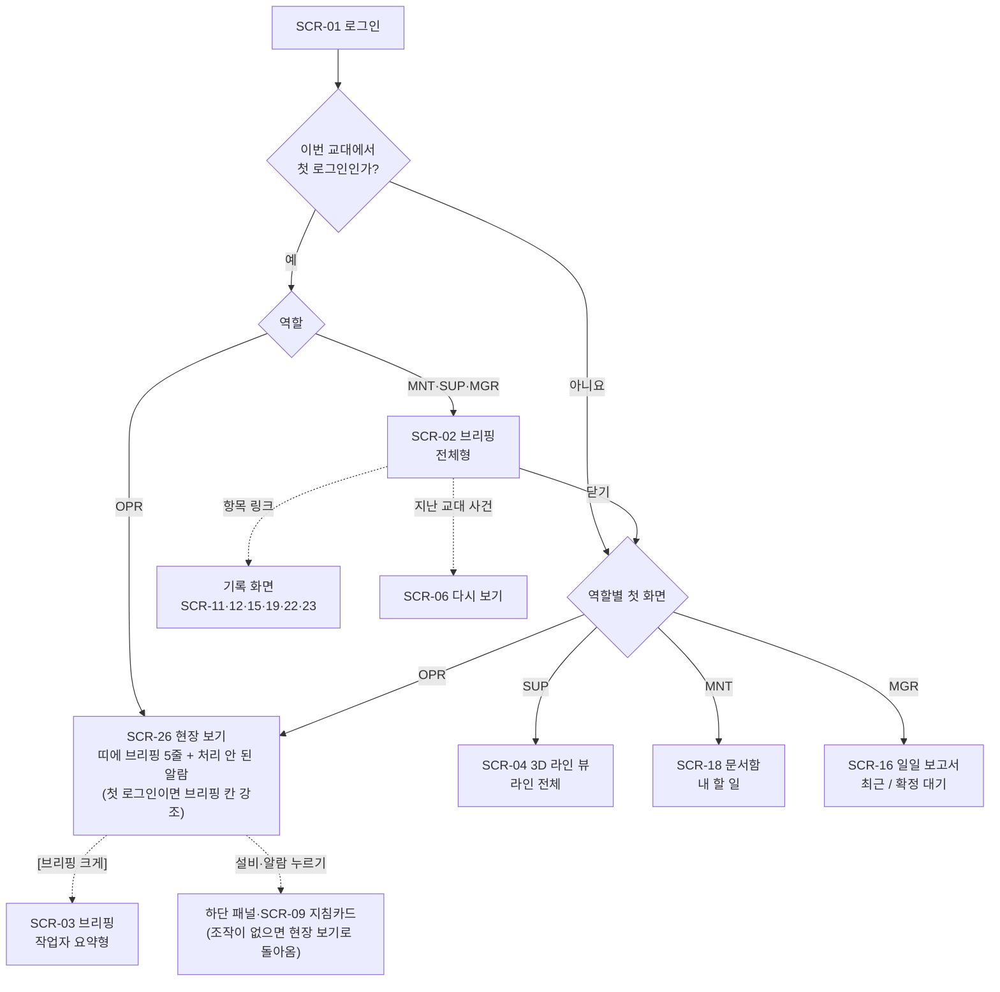
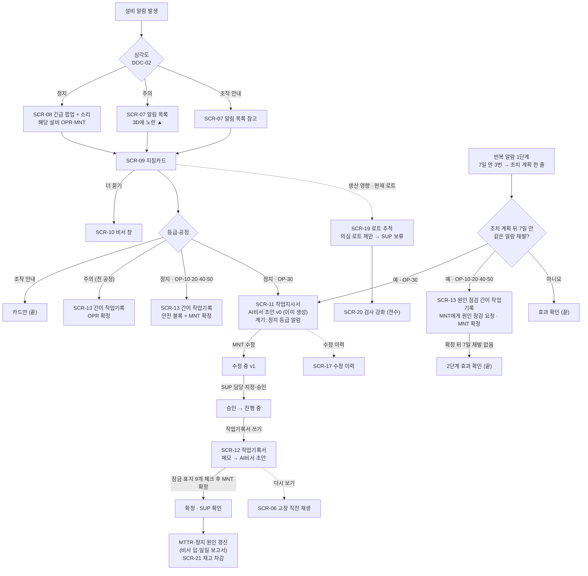
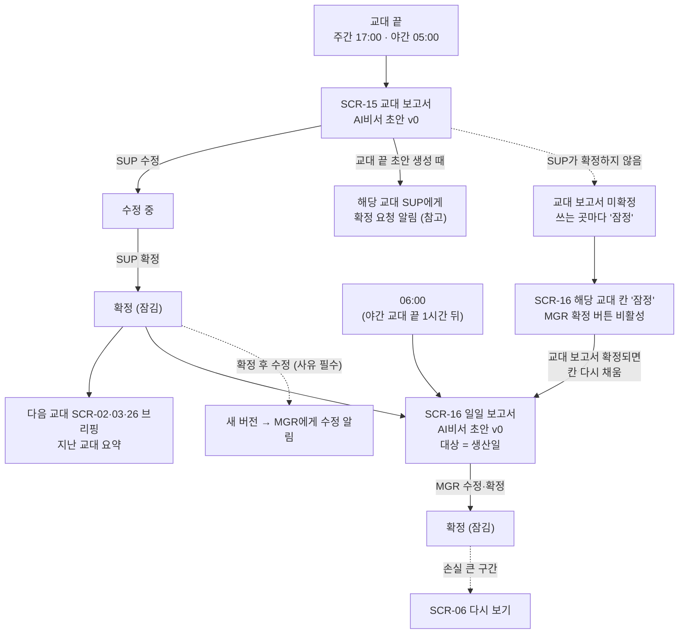

# AI 운영 비서 기반 자동차 부품 절삭가공 라인 운영 관리 플랫폼 — UI 설계서

| 항목 | 내용 |
|---|---|
| 문서명 | UI 설계서 |
| 문서 버전 | **최종본** (2026-10-07, 2026-10-06 문서 검토 회의 + 2026-10-07 팀 UI 검토 반영) |
| 날짜 | 처음 작성 2026-10-05 / 최종본 2026-10-07 |
| 상태 | **최종본 — 장치 크기(인치)·설치 거리·LLM 모델 등은 [선택 필요: 기술 회의]로 남음 (10장)** |
| 근거 문서 | [요구사항정의서_최종본.md](요구사항정의서_최종본.md) (요구사항 ID 298개), [기획서_최종본.md](기획서_최종본.md) 3.2~3.3·4장·5장·6.1~6.2·9장·13장·15장·19장, [가상데이터설계서_최종본.md](가상데이터설계서_최종본.md) 15장, [논리ERD_최종본.md](논리ERD_최종본.md), [가상사내문서/](가상사내문서/) DOC-01~07 (Rev.1, DOC-01·DOC-07은 Rev.2)·용어집(Rev.3), [00_용어집.md](가상사내문서/00_용어집.md), `docs/production/화면_예시/` (HMI 지침·화면 예시), 2026-10-07 자료조사 5개 (`docs/line/3D_설비규격/3D_설비규격_조사.md`, `docs/background/데이터보관/데이터보관기간_조사.md`, `docs/quality/CMM_자동입력/CMM_자동입력_조사.md`, `docs/production/운영기준_근거/병목조치_반복알람_우선순위_조사.md`, `docs/production/운영기준_근거/완제품_재고담당_현장화면_조사.md`) |
| 다음 문서 | API 명세서, 테스트 계획·요구사항 추적표 (기획서 18장) |
| 기술 | **비서 LLM은 로컬 LLM으로 확정** (2026-10-06 회의). 그 밖의 기술(화면 프레임워크, 3D 도구, LLM 모델·사양·실행 도구)은 **[선택 필요: 기술 회의]** — 화면 프레임워크 이름은 쓰지 않는다. 3D는 기획서 6.2의 팀원 시안(단순한 도형, 호버 기능 제거) 수준으로 적되, 크기는 실제 치수로 그린다 (SCR-04) |

> 이 문서는 요구사항 정의서의 요구사항을 **화면 하나하나의 요소**에 붙인 것이다. 화면 요소마다 요구사항 ID를 적는다. 요구사항 정의서가 "UI 설계에서 정한다"고 넘긴 [선택 필요] 9개는 9장에서 근거와 함께 정했다. 근거 문서가 없는 것은 **[제안]** 으로 정하고 이유를 적었다. **2026-10-06 문서 검토 회의 결정(D-01~D-19)** 중 화면에 닿는 것은 **9.4**에 모으고 해당 화면을 고쳤다. **2026-10-07 팀 UI 검토** 의논사항 20개는 **9.5**에 모으고 해당 화면을 고쳤다.

**표시 규칙:** **[실제]** 공개 문서·데이터 그대로 / **[가상]** 팀이 정한 값 / **[참고]** 다른 회사·산업 값의 모양만 빌림 / **[제안]** 팀 확정 전 제안 / **[선택 필요]** 아직 정하지 않음 (뒤에 정할 곳을 적음).

**와이어프레임 안의 숫자**는 기획서 15장·DOC-07 계산 예에 나온 **가상 예시 값**이다 (예: 지난 교대 84개, VF2-01 정지 48분 → 약 7개 손실). 화면의 실제 숫자는 프로그램이 DOC-07 식으로 계산한다. **시연 장면(7장)과 그 장면을 그린 와이어프레임(SCR-02·04·05·06·07·14·15·16·19·21·26 등)의 숫자는 예시 값 — 가상 데이터 생성 뒤 맞춤**이다 — 사건 순서·시각만 고정하고, 숫자는 생성 데이터 값으로 바꾼다 (가상데이터설계서 9장 "시연 데이터 조건").

---

## 목차

1. [목적과 범위](#1-목적과-범위)
2. [공통 규칙](#2-공통-규칙)
3. [화면 목록](#3-화면-목록)
4. [화면 흐름도](#4-화면-흐름도)
5. [화면별 상세](#5-화면별-상세)
6. [공통 부품](#6-공통-부품)
7. [시연 시나리오 화면 순서표](#7-시연-시나리오-화면-순서표)
8. [요구사항 ↔ 화면 추적표](#8-요구사항--화면-추적표)
9. [UI 설계로 넘어온 [선택 필요] 결정표](#9-ui-설계로-넘어온-선택-필요-결정표)
10. [남은 [선택 필요: 기술 회의]](#10-남은-선택-필요-기술-회의)
11. [개정 기록](#11-개정-기록)

---

## 1. 목적과 범위

### 1.1 목적

| 항목 | 내용 |
|---|---|
| 왜 만드나 | 프론트엔드 담당이 화면을 만들고, 백엔드·AI 비서 담당이 "어느 화면에 무엇이 나오는지"를 같은 그림으로 보게 한다 (기획서 18장 2·4·5번 작업의 바탕) |
| 누가 보나 | 팀 5명 (특히 프론트엔드 1, 백엔드·DB 1, AI 비서 2), 심사위원 |
| 무엇을 담나 | 공통 규칙(2장), 화면 목록(3장), 화면 흐름(4장), 화면별 와이어프레임·영역·상태·권한(5장), 공통 부품(6장), 시연 순서(7장), 추적표(8장), 결정표(9장) |
| 기준 | 요구사항 ID는 [요구사항정의서_최종본.md](요구사항정의서_최종본.md) 4장 규칙 그대로 쓴다. 화면 ID는 `SCR-두 자리`로 새로 붙인다. 한 번 붙인 화면 ID는 바꾸지 않는다 (최종본에서 SCR-26을 뒤에 붙임) |

### 1.2 포함하는 것

| 영역 | 화면 | 근거 |
|---|---|---|
| 공통 | 로그인, 화면 틀(상단 바·메뉴·비서 창·범례), 알림 목록·긴급 알림 팝업 | 요구사항 3장·NFR-USE·NFR-SEC |
| 현장 | **현장 보기**(SCR-26, 현장 큰 모니터용 OPR 첫 화면: 3D 라인 뷰 + 브리핑 5줄 + 처리 안 된 알람) | FR-PRD-01-28, NFR-USE-09 |
| 생산 | 3D 라인 뷰(실제 크기 공장·설비 3D 전경 + 하단 패널 + 지표·실적 패널 + 작업지시 진행 표), 2D 배치도, 다시 보기, 정지 사유 입력·확정, 교대 보고서, 일일 보고서, 로트 추적(출하까지) | PRD-01~06, FR-PRD-01-27 |
| 정비 | 지침카드, 작업지시서, 작업기록서, 간이 작업기록, 예방 정비 일정, 공구 수명 | MNT-02~05, ML-01 |
| AI 비서 | 교대 시작 브리핑(전체형·작업자 요약형), 비서 창(질문 답변), 수정 이력, 문서함 | AST-01~03, MNT-01 |
| 품질·재고 | 검사 기록·불량 집계(CMM 결과 자동 입력·확인), 재고(완제품·출하 등록 포함) | QLT-01, INV-01 |
| 관리 | 사내 문서 보기(출처 팝업 창·용어집·개정 승인), 설정(관리자) | FR-MNT-01-09, FR-AST-03-09, NFR-SEC-04 |

### 1.3 하지 않는 것

| 하지 않는 것 | 이유 | 근거 |
|---|---|---|
| 호버에만 기대는 정보 | 현장 터치 화면·큰 모니터에는 호버가 없다. 모든 정보는 **눌러서(터치는 탭)** 하단 패널·상세 화면·요약 카드로 볼 수 있다. 3D 설비에는 마우스를 올려도 아무것도 뜨지 않는다 (2026-10-06 회의 D-01). 출처 글씨의 호버 요약 카드(2.7)는 마우스용 편의이고, 터치에서는 탭으로 같은 카드를 연다 | FR-PRD-01-13, NFR-USE-04, 기획서 8.1 |
| 설비 조작 버튼 (켜기·끄기·설정 바꾸기), 원격 조종 | 모니터링형까지만 만든다. 어느 화면에도 설비로 명령을 보내는 버튼이 없다 (원격 조종 안 넣음은 2026-10-06 회의에서도 그대로 — D-19) | FR-AST-COM-11, NFR-SAFE-01, 기획서 6.2 |
| "만약 ~했다면" 시뮬레이션 입력 | 다시 보기는 지난 기록 재생만 한다 | FR-PRD-06-08 |
| 사실적인 3D 모델 | 상자·원기둥 같은 단순한 도형만 쓴다. **크기는 실제 치수**지만 질감·세부 모델링은 하지 않는다 (D-02) | FR-PRD-01-01, FR-PRD-01-27 |
| 자유 SQL 질문 창, 자동 처리·되돌리기 버튼 | 정해진 조회 도구만 쓰고, 수정 이력으로 대신한다 | FR-AST-COM-12·14, 기획서 8.1 |
| 구매·발주 버튼, 주문 접수·ERP 연동 | 재고는 수량·사용·부족 알림, 완제품은 합격 입고·출하 기록까지 | FR-INV-01-10 |
| 비서가 승인·보류·확정하는 버튼 | "사람만" 등급의 일은 비서가 하지 않는다. 비서 창에서 요청해도 해당 화면으로 안내만 한다 | FR-AST-COM-10, NFR-SAFE-04 |
| 원문 출처 표시·원문 열기 | 비서 답·지침카드·문서 초안·화면 어디에도 Haas·Siemens 매뉴얼 같은 **원문 출처를 쓰지 않고, 원문을 열지 않는다.** 출처는 사내 문서 이름 + 문서 번호 + §절만 (2.7) | 2026-10-06 회의 D-03·D-04, CLAUDE.md 원문 저작권 규칙, NFR-COPY-01·02 |
| 현장 보기에서 긴 글 입력 | 작업기록서·긴 메모 같은 입력은 현장 큰 모니터가 아니라 다른 화면·장치에서 한다 (SCR-26) | [참고: NUREG-0700 Rev.3 11.3.2.3.6-1 "터치 화면은 가끔 고르는 일에 맞다"] |
| 화면 기술(프레임워크·차트 라이브러리) 결정 | 팀원이 진행하며 고르고 기술 회의에서 정한다 [선택 필요: 기술 회의]. 2026-10-06 회의는 비서 LLM을 로컬 LLM으로만 확정했다 | 기획서 18장 1번, 9.4 D-18 |

### 1.4 화면을 쓰는 장치

| 장치 | 누가 | 이 문서의 가정 | 구분 |
|---|---|---|---|
| **현장 큰 모니터** (라인 옆, 현장 보기 SCR-26) | OPR (SUP도 지나가며 봄) | **평소에는 보기만** 한다. 필요하면 손가락(터치) 또는 마우스로 누른다. 누르는 곳은 터치 크기(2.4). 호버 없음 | 2026-10-06 회의 결정 (D-15). 근거 [참고: 완제품_재고담당_현장화면_조사 3장] |
| OP-50 태블릿 (측정실) | OPR (측정 담당) | 로트 바코드 확인, M6 게이지·외관 결과 버튼 (SCR-20). 손가락으로 누른다 | [제안: CMM_자동입력_조사 5.1] |
| 사무실 PC (마우스) | MNT, SUP, MGR (OPR도 지침카드·간이 작업기록 등 다른 메뉴로 씀) | 같은 화면을 마우스로 누른다. 3D 설비에는 호버 반응이 없고, 출처 글씨에만 호버 요약 카드가 있다 (2.7) | [제안] |
| 모니터 크기(인치)·해상도·설치 거리·설치 높이 | — | 정하지 않았다. 글자 높이는 보는 거리로 계산하는 **식**만 정했다 (2.4, NFR-USE-09) | [선택 필요: 기술 회의] |

---

## 2. 공통 규칙

### 2.1 화면 틀 (모든 화면 공통)

```text
┌──────────────────────────────────────────────────────────────────────────────────
│ [1][≡ 메뉴]  [2] 화면 이름      [3] 주간 08:00~17:00 · 10:42     [4] 반장(SUP) 김○○
│              [5] [🔔 미처리 3]  [6] [비서]   [7] [화면 설정]   (시연 모드) [8] [역할 바꿔 보기]
├──────────────────────────────────────────────────────────────────────────────────
│ [9] 알림 띠 (긴급 알림·폭주·연결 끊김이 있을 때만 나타남)
├──────────────────────────────────────────────────────────────────────────────────
│
│ [10] 본문 — 화면마다 다름 (5장)
│                                                 ┊ [11] 비서 창 (SCR-10)
│                                                 ┊      [비서]를 누르면 오른쪽에 열림
│                                                 ┊      닫아도 대화는 남음
│
├──────────────────────────────────────────────────────────────────────────────────
│ [12] 범례  가공 │ 대기 │ 🔧준비 │ ▨정비 │ ⚠고장 │ ⛔막힘 │ ▲주의 알람 │ 재공 주황 │ 병목
│            알림: ⚠긴급 │ ▲주의 │ ⓘ참고
└──────────────────────────────────────────────────────────────────────────────────
```

| 번호 | 요소 | 내용·데이터 | 동작 | 요구사항 ID |
|---|---|---|---|---|
| 1 | 메뉴 버튼 | 역할별 메뉴 (2.2) | 누르면 왼쪽 메뉴가 열림 | NFR-USE-08, NFR-SEC-03 |
| 2 | 화면 이름 | "3D 라인 뷰" 등 메뉴 이름 그대로 | — | FR-PRD-01-01 |
| 3 | 교대·시각 | 지금 교대(주간 08:00~17:00 / 야간 20:00~05:00, DOC-07 4.1), 지금 시각. 시연 모드면 "시간 ×60" 같은 배속 표시 | — | NFR-DATA-10 |
| 4 | 사용자·역할 | 이름 + 역할 한국어 이름 + 코드 | 누르면 로그아웃 | NFR-SEC-01 |
| 5 | 알림 종 | 처리 안 된 알림 수 (긴급이 있으면 ⚠ 함께) | 누르면 알림 목록(SCR-07) | FR-AST-02-02, FR-AST-02-13 |
| 6 | 비서 버튼 | — | 누르면 비서 창(SCR-10)이 오른쪽에 열림 | FR-MNT-01-01, FR-PRD-01-25 |
| 7 | 화면 설정 | 3D 빛 효과 끄기, 소리 켜기·끄기(긴급 알림 소리는 끌 수 없음 [제안]) | 사용자마다 저장 | NFR-PERF-04 |
| 8 | 역할 바꿔 보기 | **시연 모드에서만** 보임. OPR·MNT·SUP·MGR 화면을 바꿔 가며 보여 준다 [제안] | 바꾸면 그 역할의 첫 화면으로 | NFR-DATA-10, NFR-DATA-12 |
| 9 | 알림 띠 | 긴급 알림, 알림 폭주, 연결 끊김, 다시 보기 중 표시 (2.6) | 누르면 해당 화면 | FR-AST-02-12, FR-PRD-06-01 |
| 10 | 본문 | 화면마다 다름 | — | — |
| 11 | 비서 창 | 질문 답변·차트 설명 | SCR-10 | FR-MNT-01-01 |
| 12 | 범례 | 상태 6개 + 주의 알람 ▲ + 재공 주황 + 병목 + 알림 중요도 3개. **모든 화면 아래에 항상** 보이고 접을 수 없다 | — | FR-PRD-01-24, NFR-USE-03 |
| 13 | (뺌) 가상 표시 | 2026-10-07 UI 검토에서 화면 구석의 "가상 운영 데이터" 글자를 **뺐다**. 가상 데이터라는 것은 기록의 가상 표시(NFR-DATA-08)와 시연 안내로 밝히고, 비서 답 속 가상 값에는 "가상"을 붙인다 (SCR-10 [3a]). 번호는 비워 둔다 | — | NFR-USE-06, NFR-DATA-08 |

- 왼쪽 메뉴는 평소 접혀 있고, 3D 라인 뷰의 본문을 가리지 않는다 [제안].
- 비서 창은 본문 위에 겹치지 않고 본문 폭을 줄여 오른쪽에 붙는다. 3D 라인 뷰에서 비서 창을 열어도 처음 각도(공장 전체)에서 6대가 한 화면에 보여야 한다 (FR-PRD-01-02) [제안].
- 현장 보기(SCR-26)도 이 틀을 쓴다. 다만 본문 오른쪽에 비서 창 대신 **좁은 띠**(브리핑 5줄 + 처리 안 된 알람)가 늘 붙고, 범례는 그대로 아래에 있다.
- 근거 [참고]: 화면 계층(전체 개요 Level 1 → 영역 Level 2 → 상세)은 고성능 HMI 지침의 구성이다 — "Hierarchy begins with a Level 1 Process Area Overview" (`docs/production/화면_예시/HMI_설계지침/ISA_blog_the_high_performance_HMI.txt`). 이 문서에서 Level 1 = 3D 라인 뷰(SCR-04)와 현장 보기(SCR-26), Level 2 = 하단 패널·지침카드, 상세 = 문서 화면이다. Level 1 개요 화면은 "a good use of a large-format wall screen" [참고: 같은 ISA 글 — 완제품_재고담당_현장화면_조사 3.2].

### 2.2 내비게이션 메뉴 (역할별)

○ = 메뉴에 보임, 보기 = 메뉴에 보이지만 읽기만, — = 메뉴에 없음 (화면 주소로 들어와도 서버가 막음, NFR-SEC-05).

**MGR 전체 조회 (2026-10-06 회의 D-11):** MGR은 **모든 기능·문서를 볼 수 있다.** 작성·수정·확정·승인 권한은 바꾸지 않는다. 그래서 아래 표의 MGR 칸에는 "—"가 없다.

| 메뉴 | 화면 | OPR | MNT | SUP | MGR | 근거 |
|---|---|---|---|---|---|---|
| 홈 (역할별 첫 화면) | 9장 결정 9, 9.4 D-15 | ○ (= **SCR-26 현장 보기**) | ○ | ○ | ○ | NFR-USE-08 |
| 현장 보기 | SCR-26 | ○ | ○ | ○ | 보기 | FR-PRD-01-28 (OPR 첫 화면). 다른 역할은 메뉴로 열 수 있음 [제안] |
| 교대 시작 브리핑 | SCR-02 / SCR-03 | 요약형(SCR-03) | ○ | ○ | ○ | 기획서 13.2 "브리핑 받기" |
| 3D 라인 뷰 | SCR-04 (2D: SCR-05) | ○ | ○ | ○ | ○ | 기획서 13.2 |
| 다시 보기 | SCR-06 | ○ | ○ | ○ | ○ | 기획서 13.2 (전원 ○, 요구사항 3.4 각주) |
| 알림 | SCR-07 | ○ | ○ | ○ | ○ (모든 알림 보기) | 기획서 3.3 AST-02 전원, D-11 |
| 문서함 | SCR-18 | 보기 (일일 보고서 탭 없음) | ○ | ○ | ○ | 기획서 13.1 |
| 정지 사유 | SCR-14 | 입력 | 입력 | **확정** | 보기 | 기획서 13.2 |
| 로트 추적 | SCR-19 | 보기 | 보기 [제안] | ○ | ○ | 기획서 3.3, 13.2 (MNT 보기는 9.2 #2) |
| 검사 기록 | SCR-20 | 측정 확인·게이지·외관 입력 | — | ○ | 보기 | 요구사항 FR-QLT-01-01·20, 3.4 |
| 재고 | SCR-21 | 보기 + 공구 사용 | 정비 소모품 입고·실사 + 사용 | 공구·원자재·완제품 입고·실사 + **출하 등록** | 보기 + **안전 재고 설정** | 기획서 13.2, D-13·D-14 (FR-INV-01-13) |
| 공구 수명 | SCR-22 | ○ | ○ | 보기 | 보기 | 기획서 3.3, 13.2 |
| 예방 정비 | SCR-23 | — | ○ | 보기 | 보기 | 기획서 13.2 |
| 사내 문서 | SCR-24 | 보기 | 보기 | 보기 | 보기 + **개정 승인** | 기획서 13.1 |
| 설정 | SCR-25 | — | — | — | ○ | 기획서 13.2, NFR-SEC-04 |

- 지침카드(SCR-09), 작업지시서(SCR-11), 작업기록서(SCR-12), 간이 작업기록(SCR-13), 교대·일일 보고서(SCR-15·16), 수정 이력(SCR-17)은 메뉴가 아니라 **알림·하단 패널·문서함·링크**로 들어간다. MGR은 이 화면들도 모두 볼 수 있다 (D-11).
- OPR도 PC에서는 현장 보기 말고 다른 메뉴(지침카드, 간이 작업기록, 공구 수명 등)로 갈 수 있다 (D-15).

### 2.3 상태 색 규칙 C (기획서 6.2 표 그대로)

**상태 색 규칙 (절충안 C, 2026-10-05 결정)** — 정상은 차분하게, 이상만 강한 색 + 아이콘·글자

| 상태 | 표시 | 뜻 |
|---|---|---|
| RUN 가공 중 | 진한 회색 + 옅은 초록 테두리 + "가공" | 정상 |
| IDLE 대기 | 밝은 회색 + "대기" | 정상 (앞 공정 대기, 로트 없음) |
| SETUP 준비 | 회색 + 🔧 + "준비" | 정상 (로트 교체, 공구 교체, 초품 검사) |
| MAINT 계획 정비 | 회색 빗금 + "정비" | 정상 (예방 정비) |
| **DOWN 고장 정지** | **빨강 + ⚠ + "고장"** | 이상 |
| **BLOCKED 막힘** | **주황 + ⛔ + "막힘"** | 이상 (뒤 재공이 한도에 참) |
| 주의 등급 알람 | 설비 위에 노란 ▲ (상태 색은 그대로) | 주의 |
| 재공 20개 초과 / 병목 | 재공 숫자 주황 / 병목 공정 주황 테두리 + "병목" | 흐름 이상 |

출처: 기획서 6.2, DOC-07 2.2. 요구사항 FR-PRD-01-04·05·07·08, NFR-USE-01.

**이 문서가 덧붙인 규칙**

| # | 규칙 | 근거 | 요구사항 ID |
|---|---|---|---|
| 1 | **색만으로 구분하지 않는다.** 모든 상태는 색 + 아이콘·모양(빗금·테두리) + 글자를 함께 쓴다. 흑백으로 바꿔도 글자로 6개 상태를 읽을 수 있다 | [참고] "color alone is not used as the sole discriminator of an important status condition", "Alarm conditions should be shown by a redundantly coded (shape, color, text) element" (ISA 블로그, `HMI_설계지침/ISA_blog_the_high_performance_HMI.txt`). Ignition 지침 "Accommodating Color Blind Viewers", "use of descriptive text with color" | NFR-USE-02 |
| 2 | **빨강·주황·노랑은 이상에만 쓴다.** 버튼·제목·그래프 선 같은 장식에 쓰지 않는다 | [참고] "The same colors designated for alarms must not also be used for other trivial purposes" (같은 ISA 글) | NFR-USE-01 |
| 3 | **범례는 모든 화면 아래에 항상** 있다 (2.1 [12]). 접거나 끌 수 없다 | 기획서 6.2. [참고] MachineMetrics 화면 예시도 같은 회사 그림 안에서 파랑의 뜻이 달라 범례 고정이 필요 (`화면_예시/_출처목록_20261005.md`) | FR-PRD-01-24, NFR-USE-03 |
| 4 | 알림 중요도는 상태 색과 같은 뜻으로 맞춘다: **긴급 = 빨강 + ⚠ + "긴급"**, **주의 = 노랑 + ▲ + "주의"**, **참고 = 회색 + ⓘ + "참고"** [제안] | 긴급 = 정지 등급 알람 = DOWN(빨강 ⚠), 주의 등급 알람 = 노란 ▲ (기획서 4.3·6.2). 같은 모양을 같은 뜻으로 써서 배울 것을 줄인다 | FR-AST-02-01, NFR-USE-02 |
| 5 | 정상 값은 꾸미지 않는다. 지표 카드의 주의 표시는 **기준을 넘었을 때만** 노란 ▲ + "주의" 글자를 붙인다 | [참고] "Bright colors are used to draw attention to abnormal situations, not show normal ones" (ISA 글) | FR-PRD-01-23 |
| 6 | 정비 중(MAINT)과 고장(DOWN)을 헷갈리지 않게, 빗금은 MAINT에만 쓴다 | [참고] Ignition 지침 "dark gray to signify a 'scheduled' state" — 계획된 상태를 회색 계열로 | FR-MNT-04-07 |
| 7 | 바탕은 밝은 회색 계열, 글자는 진한 회색. 색 값(코드)은 기술 회의 뒤 스타일 가이드에서 정한다 | [참고] "A gray background and muted colors minimize screen glare" (ISA 글), Emerson 백서 5쪽 "HMI 설계 철학 문서(색·선·글자 크기 규칙)" | NFR-USE-01, [선택 필요: 기술 회의] |

### 2.4 글자 크기·버튼 크기

2026-10-06 회의 뒤 자료조사로 글자 높이 **계산식**과 누르는 곳의 **크기 기준**을 찾았다 (`docs/production/운영기준_근거/완제품_재고담당_현장화면_조사.md` 3.4 표 F·3.5 표 G). 모니터 크기와 보는 거리가 아직 없으므로 **식과 기준**을 정하고, 픽셀 숫자는 장치를 정한 뒤 계산·확인한다.

| 항목 | 규칙 | 구분 | 요구사항 ID |
|---|---|---|---|
| 글자 단계 | 3단계만 쓴다: **큰 숫자**(실적/목표, 상태 글자 "고장"·"막힘", 지침카드·팝업 알람 번호) > **본문**(표·문장, 현장 보기 띠 5줄) > **보조**(출처·시각·[가상] 꼬리표) | [제안] — 단계를 줄이면 화면마다 크기가 흔들리지 않는다 (Emerson 백서 5쪽 "글자 크기 규칙을 문서로"는 [참고]) | NFR-USE-04 |
| 상태 글자 | 3D 전경 위의 "가공·대기·준비·정비·고장·막힘"은 **큰 숫자 단계**로, 처음 각도(공장 전체)로 봤을 때 6대 모두 읽을 수 있어야 한다 | [제안] | FR-PRD-01-02, FR-PRD-01-04 |
| 글자 높이 계산식 | **H = 6.283 × D × MA ÷ 21600** (D = 보는 거리, MA = 글자가 눈에 만드는 각도(분), H·D 같은 단위). 최소 16분 → **H = D × 0.00465**, 읽기 좋은 20~22분 → **H = D × 0.0058~0.0064**, 글줄 최대 24분. 예: 3 m → 최소 14.0 mm, 20분 17.5 mm, 22분 19.2 mm | [실제: NUREG-0700 Rev.3 1.3.1-4, PDF 65쪽] | NFR-USE-09, NFR-USE-04 |
| 단계별 기준 거리 (현장 보기) | 큰 숫자 = 이 화면을 보는 **가장 먼 작업 자리** 거리로 20~22분 이상 / 본문 = 같은 거리로 16분 이상(가능하면 20분) / 보조 = 화면 앞(터치하는 거리)으로 16분 이상 | [제안: 조사 3.4] — 멀리서 "변화를 알아채고 무엇인지 읽어야" 하는 것만 크게 [참고: NUREG 12.1.1.3.1-1] | NFR-USE-09 |
| 픽셀로 바꾸기 | ① 한 픽셀 크기(mm) = 화면 가로 길이 ÷ 가로 픽셀 수(배율을 쓰면 곱함) ② 글자 높이(픽셀) = H ÷ 한 픽셀 크기 ③ 글꼴 크기와 실제 글자 높이는 다르므로 화면에 띄워 **자로 잰다** ④ 가장 먼 자리에서 팀원이 읽어 본다. 모니터 크기·설치 거리·숫자 결과는 정하지 않음 | 방법 [제안: 조사 3.4] / 값 [선택 필요: 기술 회의] | NFR-USE-09 |
| 누르는 곳 크기 | 버튼·공정 블록·체크칸·알림 카드·3D 설비는 손가락으로 누를 수 있어야 한다. **최소 44 × 44 CSS 픽셀과 실제 가로·세로 10 mm 이상을 둘 다** 지킨다 (큰 모니터는 화면 배율에 따라 CSS 픽셀의 실제 크기가 달라져서 mm 조건이 필요). 권장은 약 22 mm까지 (더 키워도 이득 없음), 최대 40 mm | 44 CSS px [실제: W3C WCAG 2.2 성공 기준 2.5.5] / 10 mm·22 mm·40 mm [참고: NUREG-0700 Rev.3 11.3.2.3.6-2]. **두 원문 모두 저장소에 아직 없다** (조사 파일 출처 목록에 URL) | NFR-USE-04, NFR-USE-09 |
| 장갑 | 현장 작업자가 장갑을 끼고 누를 때 위 크기로 충분한지는 실제 장치에서 시험한다 (장갑과 안 맞는 터치 방식도 있다 [참고: NUREG 표 11.7]) | [선택 필요: 기술 회의 — 장치를 정한 뒤 실제 장치로 시험] | NFR-USE-04 |
| 버튼 사이 간격 | 누르는 곳 사이 **3~6 mm**. 확정·승인·보류처럼 되돌리기 어려운 버튼은 [취소]·[저장] 버튼과 붙여 두지 않는다 | 3~6 mm [참고: NUREG 11.3.2.3.6-2] / 떨어뜨리기 [제안] — 잘못 누르기 방지 | NFR-REL-02, NFR-USE-04 |
| 눌림 표시 | 누르면 바로 눌렸다는 표시(테두리·색 바뀜 + 글자)를 준다 | [참고: NUREG 11.3.2.3.6-6] | NFR-USE-04 |
| 설치 높이 | 큰 모니터를 높이 달면 터치가 어렵다. 화면 모서리까지 팔을 다 뻗지 않고 닿게. "벽 높이 보기용 + 손 높이 조작용"으로 나눌지는 장치 회의에서 | [참고: NUREG 11.3.2.3.6-10] / [선택 필요: 기술 회의] | NFR-USE-04 |
| 되돌리기 어려운 버튼 | **확정·승인·보류·해제·폐기 승인·개정 승인·출하 확정**은 누르면 확인 상자("확정하면 잠깁니다. 고치려면 사유가 필요합니다")가 한 번 더 뜬다 | [제안] — 확정 후 수정은 새 버전 + 사유가 필요하므로(FR-AST-03-06) 실수 확정을 줄인다. 중요한 일은 확인 동작 한 번 더 [참고: NUREG 11.3.2.3.6-8] | FR-AST-03-05, NFR-REL-02, NFR-REL-03 |
| 끌기 동작 | 다시 보기 시간 막대, **3D 전경의 보는 각도 돌리기**(D-01)에 쓴다. 3D에서는 짧게 누르기 = 설비 고르기, 누른 채 움직이기 = 각도 돌리기로 나눈다 [제안]. 바닥 아래로는 돌아가지 않는다 [제안] | 2026-10-06 회의 결정 (9.1 결정 1을 바꿈 → 9.4) | FR-PRD-01-02, FR-PRD-01-13 |

### 2.5 알림 표시 방식 (긴급·주의·참고, 묶기·폭주)

알릴지 말지와 중요도는 **규칙**이 정한다 (FR-AST-02-14). 화면은 아래처럼 보여 준다.

| 중요도 | 언제 (기획서 4.3, DOC-07 10장) | 화면 표시 | 소리 | 받는 사람 | 요구사항 ID |
|---|---|---|---|---|---|
| **긴급** ⚠ | 정지 등급 알람 | **팝업(SCR-08)** + 알림 띠(2.1 [9]) + 알림 목록 | 남 | 해당 설비 OPR·MNT에게 팝업. 다른 역할은 알림 목록·알림 띠에만 | FR-AST-02-01, FR-AST-02-02 |
| **주의** ▲ | 주의 등급 알람, 반복 알람(1단계), **반복 알람 2단계(지난 조치 효과 없음)**, **원인 점검 요청(다른 공정)**, 병목 발생·이동, 재공 20개 초과, 목표 미달 위험, 로트 납기 지연 위험, 재고 부족, 기한 넘긴 예방 정비, 공구 수명 90%, 승인 대기 2시간, 관리도 이상, **CMM 판정 불일치**, **CMM 결과 파일 오류·결과 미수신** [제안: 주의] | 알림 목록 + 브리핑에 포함 + 해당 화면 표시(3D의 ▲, 지표 카드의 ▲) | 없음 | 알림 종류마다 정한 역할 (SCR-07 표) | FR-AST-02-03~10·18·19, FR-QLT-01-16~18은 SCR-07 표 |
| **참고** ⓘ | 조작 안내 알람, 예방 정비 기한 하루 전, 승인 대기 30분, 문서 수정 알림, 교대 보고서 확정 요청 | 알림 목록, 브리핑·보고서 | 없음 | 해당 역할 | FR-AST-02-08, FR-AST-02-10, FR-AST-02-17, FR-AST-03-07 |

**묶기·폭주**

| 경우 | 기준 | 화면 | 요구사항 ID |
|---|---|---|---|
| 짧은 반복 묶기 | 같은 설비·같은 알람이 **1분 안에 3번 이상** | 알림 카드 1장 + "×3 (1분 안)" 꼬리표. 누르면 각 시각이 펼쳐진다 | FR-AST-02-11 |
| 알림 폭주 | 10분에 **10건 넘음** → 폭주, 10분에 **5건 아래** → 풀림 | 알림 띠에 "▲ 알림 폭주 — 최근 10분 N건" + 알림 목록 맨 위에 묶음 카드 1장. 풀리면 띠가 사라지고 카드가 따로 펼쳐진다 | FR-AST-02-12 |
| 폭주 중 긴급 [제안] | — | 묶음 카드 안에서도 **긴급 건수와 가장 최근 긴급 1건은 늘 보이게** 한다. 소리는 묶음당 1번만 난다 | FR-AST-02-02, FR-AST-02-12 |
| 오래된 알림 | **24시간 넘게** 처리 안 된 주의 알림 | 알림 카드에 "24시간 넘음" 꼬리표, 브리핑(SCR-02)에서는 **보고 순위 0-1** (잠금·표지 바로 다음) | FR-AST-01-06 |

- 폭주 중 긴급을 따로 보이는 까닭 [제안]: 폭주를 묶는 목적은 "알림이 너무 많아 아무도 안 봄"을 막는 것이고(기획서 16장 위험 4), 정지 등급 알람이 묶음에 묻히면 안전 대응이 늦어진다. 기준 숫자(10건·5건)는 그대로 둔다.
- 비서가 꺼져 있어도 알림은 같은 조건에서 뜬다. 문장만 **기본 문구**(예: "VF2-01 알람 992 (정지)")로 나온다 (FR-AST-02-14).

**반복 알람 두 단계** (2026-10-06 회의 D-09, 기준표: 반복알람 조사 3.2, 사내 문서 DOC-07 §10.4·DOC-03 §1.4)

| 단계 | 언제 (규칙이 정함) | 알림 카드에 붙는 것 | 사람이 할 일 | 처리 | 요구사항 ID |
|---|---|---|---|---|---|
| 1단계 | 같은 설비·같은 알람이 **7일 안에 3번 이상** [가상] | ▲ "반복 알람" + 지난 조치(작업기록서·간이 작업기록 번호) + **관련 사내 문서 근거**(예: 고장 대응 매뉴얼 DOC-03 §2.11) + 관련 예방 정비 기한 | MNT·SUP가 **조치 계획 한 줄** 작성 | 조치 계획 한 줄 저장 | FR-AST-02-03, FR-AST-02-13 |
| 2단계 | 조치 계획을 저장한 뒤 **7일 안에** 같은 설비·같은 알람이 **다시 1번이라도** 남 [가상: 1단계와 같은 7일 창]. 조치 작업이 진행 중(작업지시서·작업기록서 미확정)일 때 난 알람은 세지 않는다. 1분 묶기(FR-AST-02-11)를 먼저 적용한 뒤 센다 | ▲ "**지난 조치 효과 없음**" + 1단계 조치 계획과 그 뒤 발생 기록 + 같은 알람의 발생·조치 이력. **OP-30**: 원인 점검 **작업지시서 AI비서 초안** 링크 (SCR-11, 계기 "반복 알람 2단계"). **다른 공정**(OP-10·20·40·50): 작업지시서를 만들지 않고 고장 대응 매뉴얼 DOC-03 §3 간이 대응 근거 + **MNT에게 원인 점검 요청** | OP-30: MNT 수정, SUP 승인 (작업지시서 흐름) / 다른 공정: MNT가 원인 점검 결과를 간이 작업기록으로 남김 (SCR-13) | 원인 점검 작업기록서(OP-30) 또는 원인 점검 간이 작업기록(다른 공정) **확정 때 자동**. 그 뒤 **7일 안에 재발이 없으면 "효과 확인"** 으로 닫는다. 또 재발하면 다시 2단계 (앞의 원인 점검 결과를 함께 붙임) | FR-AST-02-18, FR-MNT-03-01 |

- 원인 점검 **작업지시서 AI비서 초안은 OP-30만** 만든다 (DOC-03 §2의 원인·점검 순서가 있는 범위). OP-30 **정지 등급 알람이 동시에 2단계**이면 작업지시서는 **1개**만 만들고, 계기 칸에 두 계기(정지 등급 알람 + 반복 알람 2단계)를 함께 적고 원인 점검 순서를 덧붙인다 [가상] (SCR-11).

**병목 알림의 조치 줄** (D-10): 병목 발생·이동 알림에는 사내 문서 **DOC-07 §7.5 병목 원인별 조치**에서 그 원인(①~④·고장)의 조치 줄을 관련 정보로 붙인다 (예: ② OP-30 1대만 가동 → "끝나는 시각 안내 · 앞 공정 투입 조절 검토 · 다음부터 예방 정비를 교대 사이로 옮길지 검토"). 조치는 SUP 등 사람이 고르고, 비서는 제안만 한다. 안전·검사 기준을 줄이는 조치는 제안하지 않는다 (FR-AST-02-19, FR-AST-COM-10).

**보고 순위 — "전부 보고"** (D-07, 기준표: 반복알람·우선순위 조사 4.3, 사내 문서 DOC-07 §10.5)

비서가 몇 개만 골라 보고하지 않는다. **프로그램이 정해진 목록·기준으로 문제를 전부 모으고 정해진 순서로 정렬**하고, 비서는 그 순서대로 문장만 쓴다 (비서가 순서를 바꾸거나 빼지 않는다). 쓰는 곳: 교대 시작 브리핑 "먼저 챙길 일"(SCR-02·03·26), 교대 보고서 인계 사항(SCR-15), 일일 보고서 "오늘의 문제"(SCR-16), 알림 목록의 [보고 순위 순] 보기(SCR-07).

| 순위 | 이름 | 들어가는 것 | 같은 순위 안 정렬 | 접기 |
|---|---|---|---|---|
| **0** | 안전 | 잠금·표지 중인 설비 | 잠금 시작 이른 순 | **접지 않음**. 없으면 "잠금·표지 중인 설비 없음" |
| 0-1 | 오래 방치 | 24시간 넘게 처리 안 된 주의 알림 | 처리 안 된 시간 긴 순 | 접지 않음 |
| **1** | 긴급 (정지) | 처리 안 된 정지 등급 알람, 지금 DOWN인 설비 | 지금 멈춘 것 먼저 → 정지 시간 긴 순 → 같으면 병목 공정(OP-30) 먼저 | 접지 않음 |
| **2** | 생산 위험 | 목표 미달 위험, 병목 발생·이동(재공 20개 초과 포함), 로트 납기 지연 위험 | 목표 미달(부족 수량 큰 순) → 병목(속도 손실 큰 순) → 납기(이른 순) | 자세한 내용만 접음 |
| **3** | 주의 | ① 반복 알람 2단계 → 1단계 ② 처리 안 된 주의 등급 알람 ③ 품질(관리도 이상, 보류·강화 로트, 의심 로트 제안, CMM 판정 불일치·결과 파일 오류·결과 미수신 [제안]) ④ 공구 수명 90% 이상, 예방 정비 기한 넘김, 재고 부족 ⑤ 승인 대기 2시간 이상 | 묶음은 왼쪽 번호 순. 묶음 안: 반복 = 발생 횟수 많은 순 / 공구 = 사용률 높은 순 / 정비 = 넘긴 일수 많은 순 / 재고 = (재고 ÷ 안전 재고) 작은 순 / 승인 = 대기 긴 순 | 자세한 내용만 접음 |
| **4** | 참고 | 조작 안내 알람, 예방 정비 하루 전, 승인 대기 30분, 교대 보고서 확정 요청, 문서 수정 알림 | 발생 시각 이른 순 | 자세한 내용은 기본으로 접음 |

| 화면 규칙 | 내용 |
|---|---|
| 전체 건수 | 머리에 **"전체 N건 (안전 a · 긴급 b · 생산 c · 주의 d · 참고 e)"** 를 늘 보인다 ("생산" = 순위 2 생산 위험) (0-1 오래 방치는 주의 알림이라 "주의"에 센다). **묶인 줄은 1건으로 센다** (N = 화면 줄 수). 개수를 잘라서 보여 주지 않는다 ("외 N건"으로 숨기지 않음). **예외는 현장 보기 알람 띠(SCR-26 [4]) 하나**: 띠가 좁아 넘치면 마지막 줄을 "외 N건"으로 줄이고, 머리의 N은 전체 수이며 누르면 전부 펼친다 (2026-10-06 회의, FR-PRD-01-28) |
| 한 줄은 늘 보임 | 항목마다 **한 줄은 항상** 보인다. 접을 수 있는 것은 그 항목의 자세한 줄(지난 조치, 근거, 이력)뿐이다. 0·0-1·1 순위는 자세한 줄도 접지 않는다 |
| 빈 순위 | 건수가 0인 순위도 이름과 **"-"** 를 보인다. 순위 0(안전)만 "잠금·표지 중인 설비 없음" 문장을 그대로 쓴다 (안전 확인 문구, DOC-05 §2.3) — 2026-10-07 UI 검토 |
| 같은 원인 한 줄 | 같은 설비·같은 원인은 한 줄로 묶어 **높은 순위 쪽**에 둔다 (예: 2075 반복 알람 + 축 윤활유 재고 부족). 묶인 줄에 "(N건 묶음)"을 붙인다. **묶인 줄은 전체 N건에 1건으로 세고**, 순위별 건수도 묶인 줄이 놓인 순위에서 센다 (FR-AST-COM-21 "모은 수(묶은 뒤) = 화면 줄 수") |
| 동점 | 정렬이 같으면 발생 시각 이른 순 |
| 긴급 팝업과 다름 | 긴급 팝업(SCR-08)의 "외 긴급 N건"은 보고 목록이 아니라 **팝업을 1개만 띄우는 표시**라 이 표의 "자르지 않음" 규칙과 별개다. 그 긴급 알람들은 알림 목록·현장 보기 띠에 전부 있다 |
| 1분 목표 | 브리핑은 1분이 목표다. **1분에 맞추려고 항목을 빼지 않는다.** 넘으면 2~4 순위의 자세한 줄을 접는다 (NFR-USE-07) |

요구사항 ID: FR-AST-COM-21, FR-AST-01-04, FR-AST-01-06, FR-PRD-02-08, FR-PRD-04-08, NFR-USE-07.

### 2.6 AI비서 초안 표시와 확정 버튼

| 규칙 | 화면 | 요구사항 ID |
|---|---|---|
| 비서가 만든 문서(작업지시서, 작업기록서, 교대 보고서, 일일 보고서, 정지 사유 추천)는 맨 위에 **"AI비서 초안 v0" 띠**를 단다. 상자 테두리는 점선이다 (6.4 부품) | 모든 문서 화면 | FR-AST-COM-07 |
| 비서가 쓴 칸 옆에 **[AI]** 꼬리표, 사람이 고친 칸 옆에 **[수정: 이름 · 시각]** 꼬리표. 간이 작업기록(SCR-13)·예방 정비 실시 기록(SCR-23)은 AI비서 초안이 없어 [수정] 꼬리표만 쓴다 | SCR-11·12·13·14·15·16·23 | FR-AST-03-03 |
| 프로그램이 넣은 숫자 칸은 꼬리표 없이 보통 글자. 비서 문장 속 숫자도 프로그램 값이다 | 같은 곳 | FR-AST-COM-05 |
| 문서 상태 띠: `AI비서 초안(v0) → 수정 중(v1, v2 …) → 확정(잠김)` (작업지시서는 `→ 승인 → 진행 중 → 완료 / 취소`) | 문서 화면 위쪽 | FR-AST-03-05, FR-MNT-03-02 |
| **확정 버튼은 확정 권한이 있는 역할에만** 보인다. 권한은 있지만 조건이 안 맞으면 버튼은 보이되 **비활성 + 이유 글자** (예: "잠금·표지 체크 9개 중 7개 완료") | 2.9 | FR-PRD-02-11, FR-MNT-05-05 |
| 확정되면 🔒 + "확정 · 이름 · 시각"이 띠에 남고 입력 칸이 잠긴다. [확정 후 수정]은 **그 문서의 확정 권한자에게만** 보이고, 누르면 **사유 칸**이 먼저 나온다. 사유가 비면 [저장]이 비활성. 저장하면 새 버전이 바로 확정본(🔒)이 되고 **다시 확정하지 않는다** [제안]. 작업기록서는 SUP 확인 뒤 고치면 확인 표시가 풀린다 | 문서 화면 | FR-AST-03-06, NFR-REL-02 |
| 확정 전 문서는 다른 화면의 집계에 "확정본"으로 쓰지 않는다. 쓸 때는 "잠정" 꼬리표를 붙인다 | SCR-02, SCR-16, SCR-04 | FR-AST-COM-08 |
| 브리핑·지침카드의 비서 문장은 문서가 아니므로 "AI비서 초안" 띠 대신 **"비서 정리"** 꼬리표를 쓴다 (확정 버튼 없음) | SCR-02·03·09·26 | FR-AST-01-01, FR-AST-COM-09 |
| 생성 시각: 교대 보고서 = 교대 끝 **17:00(주간)·05:00(야간)**, 일일 보고서 = **06:00** (야간 교대 끝 1시간 뒤 [가상], D-08). 정비 작업지시서 = 계기(정지 등급 알람 / 반복 알람 2단계)가 생긴 때 | SCR-11·15·16 | FR-PRD-02-01, FR-PRD-04-01, FR-MNT-03-01 |

### 2.7 출처 표시 방식

**2026-10-06 회의 결정 (D-03·D-04):** 비서 답, 지침카드 칸, 문서 초안, 화면 어디에도 **원문 출처를 표시하지 않는다.** 출처는 **사내 문서 이름 + 문서 번호 + §절**만 쓴다. 쪽 번호(예: "DOC-01:7p")는 쓰지 않는다 (사내 문서는 쪽이 없는 md 문서). 이유: 회의 결정 + 원문 저작권(원문을 화면에 노출·제공하지 않음, CLAUDE.md 규칙).

| 대상 | 형식 | 누르면 | 요구사항 ID |
|---|---|---|---|
| 사내 문서 근거 | `고장 대응 매뉴얼 DOC-03 §2.1` (보조 글자, 칸 바로 아래 — 지침카드·작업지시서는 아래 줄). 용어집은 `용어집 §5` | 아래 "출처 눌러 보기" 표 | FR-MNT-01-07, FR-MNT-01-09, FR-AST-COM-02, FR-AST-COM-04 |
| 지침카드·작업지시서 (2026-10-07 UI 검토) | 칸마다 붙이지 않고 화면 **맨 아래 [출처 더보기] 토글**에 칸별로 모은다 (기본 접힘, 누르면 펼침). 안전 고정 서식 블록 끝의 출처는 블록 글자의 일부라 그대로 둔다 (6.5) | 펼친 뒤 출처 글씨는 아래 "출처 눌러 보기" 표와 같음 | FR-MNT-02-12, FR-MNT-03-05, FR-AST-COM-02 |
| 운영 기록 근거 | 기록 번호 꼬리표 `MR-0912` `MW-0901` `PO-2609-041` `LOT-2609-041-1` `SHP-2609-001` | 그 기록 화면 | FR-AST-01-05, FR-AST-COM-02 |
| 고정 서식 | 블록 끝 `출처: DOC-05 안전 작업 기준서 Rev.1 §2·§4·§5` | 아래 "출처 눌러 보기" 표 | FR-MNT-03-07 |
| 값의 성격 | 값 옆 꼬리표 **[가상]** · **[참고]** · **[실제]** (예: 공구 수명 한도 "400구멍 [참고]", 센서 정상 범위 "[참고]", 설비 크기 "[실제]") | 누르면 근거 한 줄 | NFR-USE-06, NFR-DATA-09, FR-ML-01-02 |
| 추정치 | 숫자 뒤에 **"(추정)"** 글자 (예: "약 7개 손실(추정)") | — | FR-AST-COM-19, FR-PRD-01-16 |
| 출처 없는 문서 답 | 화면에 내보내지 않는다 (SCR-10 상태 표) | — | FR-AST-COM-02 |

**출처 눌러 보기** (D-04)

| 입력 | 동작 | 요구사항 ID |
|---|---|---|
| 출처 글씨에 **마우스 올리기** | **작은 요약 카드**: 문서 이름, 문서 번호·개정, 절 제목, 그 절 앞부분 2~3줄 | FR-MNT-01-09 |
| 출처 글씨 **클릭** | 해당 사내 문서가 **팝업 창**(SCR-24)으로 열리고 그 절로 이동·강조. 원래 화면은 뒤에 그대로 있다 | FR-MNT-01-09 |
| **터치 화면** | 탭 = 요약 카드, 카드의 **[문서 열기]** = 팝업 창. 호버에만 기대는 정보가 없다 | NFR-USE-04 |

```text
  출처 고장 대응 매뉴얼 DOC-03 §2.1   ← 마우스를 올리면(터치는 탭)
  ┌──────────────────────────────────────────────────────┐
  │ 고장 대응 매뉴얼 · DOC-03 · Rev.1                     │
  │ §2.1 알람 992 — 전류가 높은 증폭기                     │
  │ 서보 앰프가 모터에 너무 큰 전류가 흐르는 것을 감지.   │
  │ 앞에 붙은 축 번호가 어느 축 앰프인지 알려 준다. …      │
  │ (그 절 앞부분 2~3줄)                     [문서 열기]   │
  └──────────────────────────────────────────────────────┘
       클릭(또는 [문서 열기]) → SCR-24 팝업 창, §2.1 강조
```

- "원문 열기는 팀 내부 시연에서만"이라는 v1 규칙은 **없앴다** (D-04). 어느 화면에도 [원문 열기] 버튼이 없다.
- 사내 문서 **본문 안**의 [실제]/[참고] 출처와 원문 대응표는 사내 문서에 그대로 있다 (사람이 근거를 추적하는 용도). 비서는 이것을 인용하지 않는다. 요약 카드는 절 본문 앞부분의 **글만** 보이고, 본문 안의 출처 꼬리표([실제: …])와 원문 대응표는 카드에 넣지 않는다 [제안]. 팝업 창(SCR-24)은 사내 문서 본문을 그대로 보인다.
- 검색용 문서 조각에도 원문 출처를 넣지 않는다 (문서 번호·개정·절만). 사내 문서의 "원문 대응표" 절은 검색 조각에서 뺀다 [제안] (FR-MNT-01-10).

### 2.8 빈 상태·오류·로딩

| 상황 | 화면 표시 | 요구사항 ID |
|---|---|---|
| 목록이 비었음 (인계 사항·브리핑 칸) | 칸을 지우지 않는다. 보고 순위 목록(2.5)의 빈 순위는 **"-"**, 그 밖의 칸은 **"없음"** 이라고 쓴다 (2026-10-07 UI 검토) | FR-PRD-02-08, FR-AST-01-02 |
| 계산할 수 없음 | MTTR·MTBF 고장 0건 → **"—"**. Cpk 측정값 50개 미만 → **"계산 중 (n/50)"** | FR-PRD-01-22, FR-QLT-01-08 |
| 과거 기록 없음 | 지침카드 지난 기록 → **"기록 없음"** | FR-MNT-02-10 |
| 문서에 없는 질문 | 비서 답 → **"문서에 없음"** + 찾아본 문서 범위 (DOC-01~07·용어집) | FR-MNT-01-06, FR-AST-COM-03 |
| 권장 기능을 줄였을 때 | 그 기능을 재료로 쓰는 칸은 "없음 (기능 제외)"으로 둔다 (예: 브리핑의 공구 수명 칸) | 요구사항 9.2 |
| 불러오는 중 | 칸 모양을 회색 막대로 먼저 그리고 "불러오는 중". 3D가 오래 걸리면 2D 배치도 버튼을 크게 보인다 | NFR-REL-04 |
| 3D를 그릴 수 없음 | 자동으로 **2D 배치도(SCR-05)** 로 바꾸고 알림 띠에 "3D를 열 수 없어 2D로 보여 줍니다" | NFR-REL-04, FR-PRD-01-10 |
| 서버 연결 끊김 | 알림 띠 "연결 끊김 — 마지막 갱신 10:42". 화면 숫자는 그대로 두되 회색 글자로 바꾸고, 확정·승인 버튼은 비활성 | NFR-PERF-02 [선택 필요: 기술 회의 — 다시 연결 방식] |
| 비서 응답 없음 | 비서 창 "비서가 응답하지 않습니다. 화면의 숫자·문서는 그대로 쓸 수 있습니다". 알림·지침카드는 기본 문구와 DOC-03 점검 순서 표로 대신 보인다 | FR-AST-02-14, FR-AST-COM-15 |
| 비서 문장 숫자가 표와 다름 | 처리 방법(다시 쓰기 / 문장 막기)은 [선택 필요: AI 비서 설계]. 화면은 두 경우 모두 그릴 수 있게 "비서 문장 확인 중" 자리와 "문장 없음 — 아래 표를 보세요" 자리를 둔다 | FR-PRD-02-10, NFR-AIQ-04 |
| 비서 출력 형식이 틀림 | 비서 출력은 정해진 JSON 칸으로 받는다. 형식이 틀리면 프로그램이 받지 않고 다시 요청하거나 **기본 문구**를 쓴다 [제안]. 화면은 "비서 응답 없음"과 같은 대신 보기(기본 문구·프로그램 목록)를 보인다. 로컬 LLM은 형식을 틀릴 수 있다 (형식 강제 기능이 있는 실행 도구 고르기는 [선택 필요: 기술 회의]) | NFR-AIQ-09, FR-AST-02-14 |
| 권한 없음 | 메뉴·버튼을 숨긴다. 주소로 직접 들어오면 "이 화면을 볼 권한이 없습니다 (역할: 작업자)" | NFR-SEC-02, NFR-SEC-03, NFR-SEC-05 |

### 2.9 권한별 숨김 / 비활성

| 경우 | 처리 | 예 | 요구사항 ID |
|---|---|---|---|
| 그 역할에 **권한이 없는** 메뉴·버튼 | **숨긴다** (요구사항 수용 기준이 "버튼이 없다"로 적혀 있음) | OPR 화면에 [확정]\(교대 보고서), [보류]\(로트), [승인]\(작업지시서)이 없다 | FR-PRD-01-19, FR-PRD-02-11, FR-MNT-03-14, FR-PRD-05-06, FR-PRD-04-09 |
| 권한은 있지만 **조건이 안 맞음** | 보이되 **비활성 + 이유 글자** | SUP [승인] — "담당자를 먼저 지정하세요" / MNT [확정] — "잠금·표지 체크 9개 중 7개" / MGR [확정]\(일일 보고서) — "교대 보고서 1개 미확정" | FR-MNT-03-14, FR-MNT-05-05, FR-PRD-04-01 |
| **아무도 지울 수 없는** 칸 | 편집 칸이 아니라 🔒 고정 블록으로 그린다. 삭제 버튼 자체가 없다 | 안전 블록 (6.5) | FR-MNT-03-07, NFR-SAFE-02 |
| **MGR 전체 조회** (D-11) | MGR은 모든 화면·문서를 **보기**로 연다 (메뉴·문서함 탭·알림 모두). 작성·수정·확정·승인 버튼은 원래 권한대로만 보인다. 5장 화면별 "권한"에 MGR이 빠져 있어도 이 규칙으로 보기는 된다 | MGR이 지침카드·작업기록서·간이 작업기록·공구 수명·모든 알림을 봄. [확정]\(교대 보고서)·[승인]\(작업지시서)은 MGR에게 없음 (대리 승인은 원래대로) | NFR-SEC-02, NFR-SEC-03 |
| **재고 품목별 관리 역할** (D-13) | [입고 등록]·[실사·조정]은 그 품목의 관리 역할에게만 보인다: 정비 소모품 = MNT, 절삭 공구·원자재·완제품 = SUP. [출하 등록]은 SUP만 | MNT 화면에 공구·원자재 [입고 등록] 없음 | FR-INV-01-13, FR-INV-01-04, FR-INV-01-08, FR-INV-01-12 |
| 서버 확인 | 숨김·비활성은 화면 편의일 뿐이다. 서버도 같은 권한표로 거부한다 | 요청을 직접 보내도 거부 | NFR-SEC-05 |

---

## 3. 화면 목록

| 화면 ID | 화면명 | 주 사용자 | 기능 ID | 요구사항 ID (대표) | 진입 경로 |
|---|---|---|---|---|---|
| SCR-01 | 로그인 | 전원 | — (공통) | NFR-SEC-01, NFR-SEC-07, NFR-USE-08 | 첫 접속 |
| SCR-02 | 교대 시작 브리핑 (전체형) | SUP (조회 MNT·MGR) | AST-01 | FR-AST-01-01~06, FR-AST-COM-21, NFR-USE-07 | 교대 시작 뒤 첫 로그인 때 자동, 메뉴 "교대 시작 브리핑" |
| SCR-03 | 교대 시작 브리핑 (작업자 요약형) | OPR (조회 MGR) | AST-01 | FR-AST-01-07, FR-AST-COM-21 | 메뉴, 현장 보기(SCR-26) 띠의 [브리핑 크게]. 같은 5줄이 SCR-26 띠에 늘 있다 |
| SCR-04 | 3D 라인 뷰 (실제 크기 3D 전경 + 하단 패널 + 생산 패널) | SUP (조회 전원) | PRD-01, PRD-03 | FR-PRD-01-01~13·15·16·20·21·23~27, FR-PRD-03-01~04 (14·17·22는 SCR-10으로) | SUP 홈, 메뉴 "3D 라인 뷰" |
| SCR-05 | 2D 배치도 (3D 라인 뷰의 2D 전환) | 전원 | PRD-01 | FR-PRD-01-10, FR-PRD-01-27, NFR-REL-04 | SCR-04·SCR-26 [2D 배치도로], 3D 실패 때 자동 |
| SCR-06 | 다시 보기 | MNT (조회 전원) | PRD-06 | FR-PRD-06-01~09, FR-MNT-05-14 | 메뉴, 작업기록서·브리핑·일일 보고서의 [다시 보기] |
| SCR-07 | 알림 목록 | 전원 (MGR은 모든 알림) | AST-02, AST-03 | FR-AST-02-01~19, FR-AST-03-07 | 상단 바 🔔, 메뉴 "알림" |
| SCR-08 | 긴급 알림 팝업 | 해당 설비 OPR·MNT | AST-02 | FR-AST-02-01·02, NFR-USE-09 | 정지 등급 알람 발생 때 자동 (현장 보기에서는 화면 대부분을 덮는 크기) |
| SCR-09 | 지침카드 | OPR (조회 MNT·SUP·MGR) | MNT-02 | FR-MNT-02-01~14 | 팝업 [지침카드 열기], 알림 카드, 하단 패널 "현재 알람", 현장 보기 띠의 알람 |
| SCR-10 | 비서 창 (질문 답변) | 전원 | MNT-01, AST-COM | FR-MNT-01-01~12, FR-AST-COM-01~20, NFR-AIQ-09 | 상단 바 [비서], 지침카드 [더 묻기] |
| SCR-11 | 정비 작업지시서 | MNT 작성 / SUP 승인 (조회 MGR·OPR) | MNT-03 | FR-MNT-03-01~14, FR-AST-02-18 | 지침카드 [작업지시서 보기], 알림(승인 대기, 반복 알람 2단계), 문서함 |
| SCR-12 | 작업기록서 | MNT (조회 SUP·MGR) | MNT-05 | FR-MNT-05-01~12·14 | 작업지시서 [작업기록서 쓰기], 문서함 |
| SCR-13 | 간이 작업기록 | OPR (주의 등급) / MNT (다른 공정 정지 등급, 다른 공정 원인 점검) | MNT-05 | FR-MNT-05-13·15, FR-AST-02-18 | 지침카드 [간이 작업기록 쓰기], 알림(원인 점검 요청), 문서함 |
| SCR-14 | 정지 사유 입력·확정 (**필요 여부 판단 중**) | OPR·MNT 입력 / SUP 확정 | PRD-01 | FR-PRD-01-18·19 | 하단 패널 "사유 미입력 N건", 메뉴 "정지 사유" |
| SCR-15 | 교대 보고서 | SUP (조회 MNT·MGR·OPR) | PRD-02 | FR-PRD-02-01~12, FR-AST-COM-21 | 교대 끝(17:00·05:00) 알림, 문서함, 브리핑 출처 |
| SCR-16 | 일일 보고서 (**제작 보류**) | MGR (조회 SUP·MNT) | PRD-04 | FR-PRD-04-01~10, FR-AST-COM-21, FR-INV-01-11 | MGR 홈, 문서함 (06:00에 생성) |
| SCR-17 | 수정 이력 | 전원 (OPR은 자기 문서만) | AST-03 | FR-AST-03-01~09 | 모든 문서 화면의 [수정 이력] |
| SCR-18 | 문서함 | MNT (전원) | AST-03, MNT-03, MNT-05, PRD-02, PRD-04 | FR-MNT-05-11·12, FR-AST-03-01 | MNT 홈, 메뉴 "문서함" |
| SCR-19 | 로트 추적 (원자재 → 생산 → 검사 → 출하) | SUP (조회 MGR·OPR·MNT) | PRD-05 | FR-PRD-05-01~11, FR-INV-01-12 | 메뉴, 하단 패널 "현재 로트", 지침카드 생산 영향 [로트 추적], 출하 기록 |
| SCR-20 | 검사 기록·불량 집계 (CMM 자동 입력) | SUP (측정 확인·게이지·외관 OPR, 조회 MGR) | QLT-01 | FR-QLT-01-01~22 | 메뉴, 로트 추적 [검사 기록], CMM 알림 |
| SCR-21 | 재고 (완제품·출하 등록 포함) | 품목별 관리 역할 — MNT 정비 소모품 / SUP 공구·원자재·완제품·출하 / MGR 안전 재고 (조회 전원) | INV-01 | FR-INV-01-01~13 | 메뉴, 재고 부족 알림 |
| SCR-22 | 공구 수명 | OPR (조회 MNT·SUP·MGR) | ML-01 | FR-ML-01-01~08 | 메뉴, 하단 패널 "공구 수명", 공구 수명 알림 |
| SCR-23 | 예방 정비 일정 | MNT (조회 SUP·MGR) | MNT-04 | FR-MNT-04-01~10 | 메뉴, 예방 정비 기한 알림 |
| SCR-24 | 사내 문서 보기 (팝업 창) | 전원 (개정 승인 MGR) | MNT-01, AST-03 | FR-MNT-01-09·10, FR-AST-03-09, NFR-COPY-02·03 | 출처 글씨 클릭·요약 카드 [문서 열기] (팝업 창), 메뉴 "사내 문서" |
| SCR-25 | 설정 (관리자) | MGR | AST-02, INV-01 (공통) | FR-AST-02-16, FR-INV-01-06, NFR-SEC-04 | MGR 메뉴 "설정" |
| **SCR-26** | **현장 보기** (현장 큰 모니터, 3D 라인 뷰 + 옆 띠) | **OPR** (조회 전원) | PRD-01, AST-01, AST-02 | FR-PRD-01-28, NFR-USE-09, FR-PRD-01-27, FR-AST-01-07 | **OPR 홈**(로그인 뒤 첫 화면), 메뉴 "현장 보기" |

**화면 26개** (최종본에서 SCR-26 추가). 2026-10-07 UI 검토로 **SCR-16은 제작 보류**(메인 대시보드 결과를 보고 정함), **SCR-14는 필요 여부 판단 중**이다 (9.5). 화면 ID는 그대로 둔다. 기능 17개가 모두 한 화면 이상에 있다 (PRD-03은 SCR-04 안의 작은 표, FR-PRD-03-02).

---

## 4. 화면 흐름도

### 4.1 로그인과 역할별 첫 화면



- **2026-10-07 UI 검토:** SCR-16 일일 보고서는 **제작 보류**다 (9.5 #20). 만들지 않기로 하면 MGR의 첫 화면은 SCR-04 3D 라인 뷰로 한다 [제안]. 모니터링용 계정의 첫 화면도 그때 정한다 [선택 필요: 팀].
- **2026-10-06 회의로 바뀐 점 (D-15):** OPR의 첫 화면은 SCR-04가 아니라 **SCR-26 현장 보기**다. OPR은 첫 로그인 때 SCR-03을 따로 열지 않는다 — 같은 5줄이 SCR-26 띠에 교대 내내 있다. SCR-03은 메뉴나 띠의 [브리핑 크게]로 연다 (NFR-USE-08, FR-PRD-01-28).
- 현장 보기에서 누군가 설비·알람을 눌러 상세를 열어도, 일정 시간 아무 조작이 없으면 현장 보기로 **돌아온다**. 시간 숫자는 [선택 필요: 기술 회의 — 실제 장치에서 시험] [참고: NUREG-0700 Rev.3 6.1.1-4·6.1.1-5].

### 4.2 알람 → 지침카드 → 작업지시서 → 작업기록서



- 반복 알람 2단계(D-09)에서 OP-30이면 같은 SCR-11에 **계기 "반복 알람 2단계"** 로 원인 점검 작업지시서 AI비서 초안이 생긴다 (작업 순서는 DOC-03 해당 절의 보전 줄). 다른 공정은 작업지시서를 만들지 않는 기존 범위(DOC-02 §2)를 지키고 SCR-13 원인 점검 간이 작업기록으로 남긴다 (DOC-03 §1.4). 처리 조건은 2.5 "반복 알람 두 단계" 표.

### 4.3 교대 보고서 → 일일 보고서 → 다음 교대 브리핑



- **2026-10-06 회의 결정 (D-08):** 일일 보고서 AI비서 초안은 **06:00** [가상]에 만든다. 야간 반장이 05:00 교대 보고서를 확정할 1시간을 두고, 05:00~08:00은 교대 사이 라인 정지라 08:00 주간 시작·브리핑 전에 충분하다. 대상 = **생산일**(D일 08:00 주간 ~ D+1일 05:00 야간), 보고서 날짜 = 주간이 시작한 날, 생성 = D+1일 06:00 [가상: 완제품_재고담당_현장화면_조사 4.3 H2·H3].
- **확정 요청과 잠정 (2026-10-07 최종 검토):** 교대가 끝나 교대 보고서 AI비서 초안이 생길 때(주간 17:00, 야간 05:00) 그 교대 반장(SUP)에게 "교대 보고서 확정 요청"(참고) 알림이 간다. 확정하면 자동 처리. 확정 전에는 그 교대 값을 쓰는 모든 곳(다음 교대 브리핑의 지난 교대, 야간 이월, 일일 보고서 칸)이 원기록 집계 + **"잠정"** 으로 보이고, 확정되면 다시 계산한다. 일일 보고서를 만들지 않아도(제작 보류) 이 규칙은 그대로다 (FR-AST-02-17).
- 06:00까지 확정 안 된 교대 칸은 기존대로 "잠정" + MGR [확정] 비활성 (확정 요청은 교대 끝에 이미 가 있음).
- 06:00 뒤에 바뀌는 것(예: 야간 끝 로트가 08:00 뒤 측정·판정되어 합격 → 완제품 입고)은 **다음 생산일 보고서**에 들어간다. 그 로트는 일일 보고서 로트 칸에 "판정 대기"로 적힌다 [제안: 조사 4.3 H6].
- 야간 반장의 05:00~06:00 확정 시간은 실제로 1시간 연장 근무가 된다. 근무 계획에 넣을지는 [선택 필요: 팀 — 근무 계획] (조사 4.3 H7).


---

## 5. 화면별 상세

화면마다 ① 와이어프레임 ② 영역 표 ③ 상태별 표시 ④ 권한을 적는다. 와이어프레임의 `[번호]`는 영역 표의 번호다. 상단 바·범례는 2.1 화면 틀과 같아서 대부분 줄였다. `○○`는 가상 데이터에서 계산될 자리다 (근거 있는 예시 값이 없는 곳).

### SCR-01 로그인

```text
┌──────────────────────────────────────────────────────────────
│  AI 운영 비서 · BRK-A100 절삭가공 라인
│
│  [1] 사용자 고르기
│      ( ) 김○○  현장 작업자 OPR · 주간 · OP-30
│      ( ) 이○○  보전 담당자 MNT
│      ( ) 박○○  라인 반장 SUP · 주간
│      ( ) 최○○  공장 관리자 MGR
│  [2] 비밀번호 [__________]        (로그인 방식은 기술 회의 뒤)
│
│  [3] [로그인]
│
│  [4] 시연 모드 ● 켜짐 (시간 ×60)   ← 시연 모드일 때만 보임
└──────────────────────────────────────────────────────────────
```

| 번호 | 요소 | 내용·데이터 | 동작 | 요구사항 ID |
|---|---|---|---|---|
| 1 | 사용자 목록 | 가상 사용자 12명 (OPR 6, MNT 3, SUP 2, MGR 1)과 역할·교대·담당 공정 | 하나를 고름 | NFR-SEC-01 |
| 2 | 로그인 칸 | 비밀번호 또는 다른 방식 | — | NFR-SEC-07 [선택 필요: 기술 회의] |
| 3 | 로그인 버튼 | — | 이번 교대 첫 로그인이면 브리핑(MNT·SUP·MGR = SCR-02, OPR = SCR-26 현장 보기의 브리핑 띠), 아니면 역할별 첫 화면 (4.1) | NFR-USE-08, FR-AST-01-01 |
| 4 | 시연 모드 표시 | 실시간 모드·배속 (평소 1초 = 1분, 1막 정비 구간 1초 = 3분) | 시연 모드에서만 보임 | NFR-DATA-10 |

| 상태 | 표시 |
|---|---|
| 정상 | 위 그림 |
| 경고 (로그인 실패) | "로그인하지 못했습니다" 한 줄. 몇 번 틀렸는지 등은 기술 회의 뒤 |
| 데이터 없음 | 사용자 목록이 비면 "가상 사용자 데이터가 없습니다 (생성기 확인)" |

권한: 누구나 볼 수 있다. 로그인 뒤 역할이 모든 화면의 권한을 정한다 (NFR-SEC-02, NFR-SEC-03).

---

### SCR-02 교대 시작 브리핑 (전체형)

주 사용자 SUP, 조회 MNT·MGR. **문서가 아니라 화면**이다 (확정·저장 없음, 수정 이력 대상 아님).

**2026-10-06 회의로 바뀐 점 (D-07):** "가장 먼저 챙길 3가지"를 없애고 **"먼저 챙길 일 (전체 N건)"** 으로 바꿨다. 프로그램이 문제를 **전부** 모아 2.5 보고 순위대로 정렬하고, 비서는 그 순서대로 문장만 쓴다.

**2026-10-07 UI 검토로 바뀐 점:** ① 머리의 "1분 목표" 표시를 뺐다 (1분 목표 규칙 NFR-USE-07은 그대로) ② [1]의 빈 순위는 "없음" 대신 **"-"** ③ [2] 지난 교대는 3줄: 첫 줄 **양품·손실**, 둘째 줄 자세한 설명, 셋째 줄 나머지 ④ [3] 이번 교대도 3줄: 첫 줄 **총 N개 (목표 90 + 이월 N)**, 둘째 줄 자세한 설명, 셋째 줄 나머지 ⑤ [4] 모은 입력은 화면을 만들어 보고 넣을지 정한다 [선택 필요: 팀]. 총 목표(목표 + 이월)는 목표를 보이는 모든 화면(SCR-03·04·05·15·26)에 같게 쓴다. 이월은 **같은 생산일의 주간 → 야간에만**: 야간 이월 = max(0, 90 − 그날 주간 실적). 주간은 늘 이월 0. 하루 목표는 180 고정이고, 야간이 못 채운 수량은 다음 날로 넘기지 않고 **그날 하루 부족**(180 − 하루 실적)으로 남는다 (DOC-07 §4.1).

```text
┌──────────────────────────────────────────────────────────────────────────────────
│ [≡] 교대 시작 브리핑 — 10월 1일 주간 (08:00~17:00)                      [닫기 → 홈]
├──────────────────────────────────────────────────────────────────────────────────
│ [1] 먼저 챙길 일 — 전체 2건 (안전 0 · 긴급 0 · 생산 0 · 주의 2 · 참고 0)
│     비서 정리 · 순서는 프로그램 규칙 (2.5 보고 순위)
│  0   안전       🔒 잠금·표지 중인 설비 없음
│  0-1 오래 방치  ▲ VF2-02 알람 2075 축 윤활유 저장소 비워짐 · 33시간 처리 안 됨       [열기]
│                 (3건 묶음) 반복 알람 이번 주 3번째 · 축 윤활유 재고 부족
│                 ▾ 지난 조치 [MR-0912] [MR-0918] · 근거 고장 대응 매뉴얼 DOC-03 §2.11
│  1   긴급       -
│  2   생산 위험  -
│  3   주의       ▲ T05 공구 수명 92% (사용률) — 교체 준비                       [공구 수명]
│  4   참고       -
├──────────────────────────────────────────────────────────────────────────────────
│ [2] 지난 교대 (9월 30일 야간)                                 출처 [교대 보고서 9/30 야간]
│     양품 84개 · 손실 약 7개 (추정)
│     VF2-01 정지 2회 48분 → 약 7개 손실 · 야간 부족분은 이월하지 않음 (9/30 하루 부족으로 남음)
│     불량 1개 · [다시 보기: VF2-01 정지 구간]
├──────────────────────────────────────────────────────────────────────────────────
│ [3] 이번 교대
│     총 90개 (목표 90 + 이월 0)
│     작업지시 [PO-2609-041] [PO-2609-042] [PO-2609-043] (이번 교대 로트 3개)
│     예방 정비 2건 · 08:35 VF2-02 예방 정비 90분                     [예방 정비]
├──────────────────────────────────────────────────────────────────────────────────
│ [4] 모은 입력 (종류별 건수) — 넣을지는 화면을 만들어 보고 정함 [선택 필요: 팀]
│     잠금·표지 0 · 미해결 알람 1 · 반복 알람 1 (2단계 0) · 예방 정비 기한 2 · 공구 수명 90% 이상 1
│     재고 부족 1 · 승인 대기 문서 0 · 진행 중 로트 ○ · 진행 중 작업지시 3 · 이번 교대 총 목표 90
└──────────────────────────────────────────────────────────────────────────────────
```

- [1]의 "전체 2건"은 묶은 뒤 줄 수다 (2.5). 0-1 줄은 알람 2075 + 반복 알람 + 축 윤활유 재고 부족 3건을 한 줄로 묶은 것이라 1건으로 세고, 주의 알림이라 "주의"에 센다. T05와 합쳐 주의 2.
- [2]·[3]의 숫자: 지난 교대는 9/30 **야간**이라 부족분을 넘기지 않는다 → 10/1 주간 총 90개 (이월 0). 야간 브리핑이면 그날 주간 실적으로 이월을 계산한다 (예: 주간 양품 87 → 야간 총 93개(90 + 이월 3) → 야간 양품 86이면 하루 173 / 180, 그날 7개 부족 (다음 날 주간은 다시 90)). 손실 약 7개는 고장 손실 + 속도 손실의 합(추정)이다 (예시에서는 VF2-01 고장 손실만 있음).

| 번호 | 요소 | 내용·데이터 | 동작 | 요구사항 ID |
|---|---|---|---|---|
| 1 | 먼저 챙길 일 (전체 N건) | 프로그램이 모은 문제 **전부**를 2.5 보고 순위(0 안전 → 0-1 오래 방치 → 1 긴급 → 2 생산 위험 → 3 주의 → 4 참고)대로. 머리에 "전체 N건 + 순위별 건수"(묶은 뒤 줄 수). 빈 순위도 이름과 **"-"** (순위 0만 "잠금·표지 중인 설비 없음"). 같은 설비·같은 원인은 한 줄로 묶어 높은 순위 쪽에 두고 1건으로 센다. 항목마다 한 줄은 늘 보이고 자세한 줄(▾ 지난 조치·근거)만 접는다. 0·0-1·1 순위는 접지 않는다. 반복 알람에는 지난 작업기록서 번호와 DOC-03 근거, 2단계면 "지난 조치 효과 없음" | 꼬리표 → 그 기록 화면, 출처 → 요약 카드·팝업 (2.7) | FR-AST-01-04, FR-AST-01-05, FR-AST-01-06, FR-AST-COM-21, FR-AST-02-03, FR-AST-02-18, FR-ML-01-04, FR-AST-COM-05, FR-PRD-02-09 |
| 2 | 지난 교대 | **3줄** (2026-10-07 UI 검토): ① 첫 줄 = **양품 N개 · 손실 N개(추정)** ② 둘째 줄 = 자세한 설명 (정지·손실 원인, 목표와의 차이·이월) ③ 셋째 줄 = 나머지 (불량, [다시 보기]). 양품 = 교대 실적(OP-50을 마친 불량 아닌 수량, GQ + RQ — DOC-07 §4.3). 손실 = 고장 손실 + 속도 손실 합(추정, 나눈 값은 교대 보고서). 지난 교대 보고서 확정본 값, 미확정이면 "잠정" | 출처 → SCR-15, [다시 보기] → SCR-06 그 시각 | FR-AST-01-03, FR-AST-01-05, FR-PRD-06-07, FR-AST-COM-08, FR-AST-COM-19 |
| 3 | 이번 교대 | **3줄** (2026-10-07 UI 검토): ① 첫 줄 = **총 N개 (목표 90 + 이월 N)** ② 둘째 줄 = 자세한 설명 (진행 중 작업지시·로트) ③ 셋째 줄 = 나머지 (예방 정비 일정). 이월은 **같은 생산일의 주간 → 야간에만**: 야간 이월 = max(0, 90 − 그날 주간 실적). 주간은 늘 이월 0. 하루 목표는 180 고정이고, 야간이 못 채운 수량은 다음 날로 넘기지 않고 **그날 하루 부족**(180 − 하루 실적)으로 남는다 (DOC-07 §4.1) | 꼬리표 → SCR-19·23 | FR-AST-01-03, FR-MNT-04-01, FR-PRD-01-15 |
| 4 | 모은 입력 | 입력 종류(지난 교대 보고서, 오늘 총 목표, 진행 중 로트·작업지시, 잠금·표지, 미해결 알람, 반복 알람 1·2단계, 예방 정비 기한, 공구 수명 90% 이상, 재고 부족, 승인 대기 문서 + 반복알람 조사 4.2의 빠진 종류)별 건수 한 줄. 0이어도 적는다. **화면에 넣을지는 화면을 만들어 보고 정한다** [선택 필요: 팀] (2026-10-07 UI 검토). 넣지 않아도 프로그램은 입력을 그대로 모은다 (FR-AST-01-02) | — | FR-AST-01-02 |
| — | 출처 칸 | 각 줄 끝의 기록 번호 꼬리표와 사내 문서 출처(문서 이름·번호·§절)가 출처 칸이다 | — | FR-AST-01-03, FR-AST-COM-02 |
| — | 1분 목표 | 기본 보기를 소리 내어 읽어 1분이 **목표**다. **1분에 맞추려고 항목을 빼지 않는다.** 넘으면 2~4 순위의 자세한 줄을 접는다 (재는 법: 9장 결정 8, 9.4). **화면에 "1분 목표" 표시는 두지 않는다** (2026-10-07 UI 검토) | — | NFR-USE-07 |

| 상태 | 표시 |
|---|---|
| 정상 | 위 그림. 교대 시작 시각 뒤 첫 로그인 때 자동으로 열린다 |
| 경고 | 0·0-1·1 순위에 항목이 있으면 그 줄이 맨 위에 펼쳐져 있다. 지난 교대 보고서가 확정 전이면 [2] 제목 옆에 "잠정 (교대 보고서 미확정)" (이월도 잠정 값으로 계산) |
| 데이터 없음 | 칸은 남기고 빈 순위는 "-" (예: "1 긴급 -"). 권장 기능을 줄였으면 "공구 수명: 없음 (기능 제외)". 그날 주간 기록이 없으면 야간 이월 0 |
| 비서 응답 없음 | [1]을 문장 대신 **프로그램 목록 전부**(같은 순위·같은 순서, 기본 문구)로 보인다 [제안] |

권한: SUP·MNT·MGR 전체형. OPR은 SCR-03 (FR-AST-01-07). 수정·확정 버튼 없음 (FR-AST-01-01).

---

### SCR-03 교대 시작 브리핑 (작업자 요약형)

주 사용자 OPR. 범위는 9장 결정 3. **같은 5줄이 현장 보기(SCR-26) 옆 띠에 교대 내내 늘 보인다** (D-15). 이 화면은 PC나 띠의 [브리핑 크게]로 따로 열 때 쓴다.

```text
┌──────────────────────────────────────────────────────────────────────────
│ [≡] 교대 시작 브리핑 — 10월 1일 주간 · 내 공정 OP-30         [닫기 → 현장 보기]
├──────────────────────────────────────────────────────────────────────────
│ [1] 🔒 잠금·표지 중인 설비   없음
│ [2] 지난 교대  양품 84개
│ [3] 내 공정 알람 (처리 안 됨) — 전체 1건
│     ▲ VF2-02 알람 2075 축 윤활유 저장소 비워짐 · 24시간 넘음   [지침카드]
│ [4] 공구 교체   T05 공구 수명 92% (사용률) — 교체 준비     [공구 수명]
│ [5] 이번 교대   총 90개 · 08:35 VF2-02 예방 정비 90분 (그동안 VF2-02 정지)
└──────────────────────────────────────────────────────────────────────────
```

| 번호 | 요소 | 내용·데이터 | 동작 | 요구사항 ID |
|---|---|---|---|---|
| 1 | 잠금·표지 중인 설비 | 교대가 바뀔 때 잠금 중인 설비 (DOC-05 §2.3 "잠금 중인 설비를 맨 위에", 보고 순위 0). 없으면 "없음" | — | FR-AST-01-07, FR-PRD-02-09 |
| 2 | 지난 교대 한 줄 | **양품 N개**만 (교대 실적 = GQ + RQ, DOC-07 §4.3). 목표·손실은 보이지 않는다 (2026-10-07 UI 검토) | — | FR-AST-01-07 |
| 3 | 내 공정 알람 | 담당 공정 설비의 처리 안 된 긴급·주의 알람 **전부**. 머리에 "전체 N건". 순서는 2.5 보고 순위와 같게: 24시간 넘은 것(0-1) → 긴급(1) → 주의(3). 개수를 잘라 보이지 않는다 | → SCR-09 | FR-AST-01-07, FR-AST-01-06, FR-AST-COM-21 |
| 4 | 공구 교체 | 담당 공정의 공구 수명 90% 이상 전부 (OP-30 담당만) | → SCR-22 | FR-AST-01-07, FR-AST-02-09, FR-ML-01-04 |
| 5 | 이번 교대 | **총 N개** (총 목표 = 목표 90 + 이월. 나눈 값은 SCR-02 [3]), 담당 공정 설비의 예방 정비 시각 (2026-10-07 UI 검토) | — | FR-AST-01-07, FR-PRD-01-15 |

| 상태 | 표시 |
|---|---|
| 정상 | 위 그림. SCR-02보다 짧다 |
| 경고 | [1]에 설비가 있으면 🔒 + 설비 이름 + "잠금 중 — 전원을 넣지 마세요" 고정 문구 [제안] |
| 데이터 없음 | 줄마다 "없음" |

권한: OPR (MGR 보기 — D-11, 공정을 골라 봄 [제안]). 승인 대기 문서·재고 부족·반복 알람의 지난 조치·손실 수량은 **보이지 않는다** (9장 결정 3). 수정 버튼 없음.

---

### SCR-04 3D 라인 뷰

주 사용자 SUP, 조회 전원. 화면 위쪽 = **3D 라인 전경**, 아래쪽 = **2D 정보 패널** (기획서 6.2). 3D는 팀원 시안(단순한 도형)을 바탕으로 **호버 기능을 빼고** 색 규칙 C로 바꾼다. AI는 이 화면에서 쓰지 않는다 (비서 창 차트 설명만).

**2026-10-06 회의로 바뀐 점:** ① 설비 6대·주요 부품과 **공장 전체**(바닥·벽 윤곽·통로·재공 자리·측정실 둘레)를 **실제 치수**로 그린다. 여전히 상자·원기둥 같은 단순 도형의 조합이다 (D-02, FR-PRD-01-27). ② **처음 각도 = 공장 전체가 보이는 각도.** ③ 끌어서 보는 각도를 돌리고, 스크롤로 확대·축소하고, 설비를 클릭하면 그 설비로 확대된다. 호버에는 아무것도 뜨지 않는다 (D-01). 치수·좌표는 `docs/line/3D_설비규격/3D_설비규격_조사.md` 2장·7장 그대로 쓴다.

**2026-10-07 UI 검토로 바뀐 점:** ① [처음] 버튼을 뺐다 — 공장 전체로 돌아가기는 시점 버튼 **[전체]** 가 맡는다 ② 하단 패널에서 **센서 추세·설비 사양**(크기 꼬리표)을 뺐다 → 비서 창 질문으로 (SCR-10 [6]) ③ 생산 패널을 하단 패널 **왼쪽**에 붙였다 ④ 목표 대비 실적 = **"지금 N / 총 목표 N개"** (총 목표 = 목표 90 + 이월) + 그 아래 **시간대별 실적 그래프**(총 목표선·예측 점선 — 2026-10-07 최종 검토에서 다시 넣음) ⑤ 지표 카드 = **OEE를 맨 앞**, 가동률·성능·양품률은 괄호 안. 카드는 처음에 **라인 OEE**(OP-30 2대 합), 설비를 클릭하면 그 설비 OEE (2026-10-07 최종 검토). **MTTR·MTBF는 카드에서 뺐다** (비서 질문으로) ⑥ 손실은 고장 손실 + 속도 손실을 **합한 숫자 하나** ⑦ 정지 원인 순위를 뺐다. 하단 패널이 복잡해 보이면 설비를 클릭했을 때 뜨는 **팝업**으로 만든다 [선택 필요: 화면 구현 뒤 팀].

**① 3D 전경 + 아래 패널 (시연 약 1:03 장면, 10:00: VF2-02 예방 정비 중, 재공 30개, OP-20 막힘)**

```text
┌────────────────────────────────────────────────────────────────────────────────────
│ [≡] 3D 라인 뷰       주간 08:00~17:00 · 10:00       반장(SUP) 박○○   [🔔 2]  [비서]
├────────────────────────────────────────────────────────────────────────────────────
│ [1] 3D 라인 전경 (처음 각도 = 공장 전체)  [2] [2D 배치도로]  [3] 시점 [전체][OP-30][위] [+][−]
│     조작: 설비 클릭(탭) = 그 설비로 확대 · 스크롤(두 손가락) = 확대·축소 · 끌기 = 각도 돌리기 · 호버 = 반응 없음
│  ┌ 공장 29 × 7 m · 천장 4 m (벽 윤곽) ─────────────────────────────────────────────────┐
│  │ [봉재 랙]                                                         [온도 맞춤 선반]  │
│  │ [투입 대] ┌────────┐ ┌────────┐  ┌────────┐ ┌────────┐  ┌────────┐  ┌────────┐     │
│  │           │ SAW-01 │ │ MIL-01 │  │ VF2-01 │ │ VF2-02 │  │ WSH-01 │  │ CMM-01 │     │
│  │           │  가공  │ │ ⛔막힘 │  │  가공  │ │  정비  │  │  대기  │  │  가공  │     │
│  │           └────────┘ └────────┘  └────────┘ └////////┘  └────────┘  └────────┘     │
│  │             OP-10      OP-20      [5] ━━━ OP-30 병목 ━━━    OP-40       OP-50      │
│  │ ─ ─ ─ ─ ─ ─ ─ ─ ─ ─ ─ ─ 설비 앞 작업 띠 ─ ─ ─ ─ ─ ─ ─ ─ ─ ─ ─ ─ ─ ─ ─ ─ ─ ─ ─ ─ ─ │
│  │      [4] WIP-1  6   WIP-2  30(주황)           WIP-3 12     WIP-4  3    [완성품 자리] │
│  │ ═══════════════════════════ 주 통로 (바닥 표시) ═══════════════════════════════════ │
│  └ ◁ 비상구                                                                반입문 ▷ ┘
│      RUN = 진한 회색 + 옅은 초록 테두리 · MAINT = 회색 빗금 · 숫자는 재공 자리의 재공 수
├─ 생산 패널 [7]~[11] (왼쪽, ② 그림) ──────┬─ [6] 하단 패널 — VF2-01 (OP-30) (오른쪽) ────────────
│ [7] 22 / 90개 + 실적 그래프 ▲              │ 상태          가공 (RUN) · 16분째
│ [8] OEE(라인) ○○% (가동률 · …)            │ 현재 로트     [LOT-2609-041-1] (PO-2609-041)
│ [9] 손실 약 ○개 (추정)                     │ 이번 교대 실적/목표 OP-30 공정 ○○ / 90 (2대 합, 총 목표)
│ [11] 작업지시 진행 (작은 표)               │ 현재 알람     없음
│                                            │ 오늘 정지     ○○분 · 약 ○개 손실(추정)
│                                            │ 정지 사유 미입력  0건  [정지 사유]
│                                            │ ── OP-30만 ──
│                                            │ 공구 수명 (사용률)  T05 M6 탭 92% ▲ · 엔드밀 ○○% · 드릴 ○○%  [공구 수명]
│                                            │ 진행 중 작업지시서  없음
└────────────────────────────────────────────┴───────────────────────────────────────────────────────
   설비를 클릭하면 그 설비로 확대 + 오른쪽 하단 패널이 그 설비로 바뀜 (복잡해 보이면 팝업 [선택 필요])
```

**② 생산 패널 (하단 패널 왼쪽, 스크롤 없이 보이는 것이 목표 [제안])**

```text
├─ [7] 목표 대비 실적 (라인 · 이번 교대) ─────────────────
│  지금 22 / 총 목표 90개   (목표 90 + 이월 0 — 주간)
│  총 목표 90 ┄┄┄┄┄┄┄┄┄┄┄┄┄┄┄┄┄┄┄┄┄┄┄┄┄┄┄
│  실적  ▁▂▃▃▃ ┈┈┈┈┈┈┈┈┈┈┈┈ 예측 73개 ▲   (시간대별 실적 그래프)
│  ▲ 목표 미달 위험 · "이 속도면 목표보다 17개 부족" (추정)
│     ← 예시 값 — 가상 데이터 생성 뒤 맞춤 (계산 방법: 22 + 0.14 × 남은 360분 ≈ 73 < 81)
├─ [8] 지표 카드 (처음 = 라인 · OP-30 2대 · 이번 교대) ──
│  OEE ○○%  (가동률 ○○% · 성능 ○○% · 양품률 ○○%)
│  VF2-01을 누르면 → OEE ○○% (가동률 · 성능 · 양품률)   ← 교대 전체 계산 예는 DOC-07 6.2 (65.6%)
├─ [9] 손실 (이번 교대) ──────────────────────────────────
│  손실 약 ○개 (추정)
├─ [11] 작업지시 진행 (작은 표) ──────────────────────────
│  작업지시    목표 완료 불량 로트  공정  납기  상태
│  PO-2609-041  36  ○○  ○  -1,-2 OP-30 ○/○ 생산 중
│  PO-2609-042  ○○  ○○  ○  -1   OP-10 ○/○ ▲지연 위험
└────────────────────────────────────────────────────────
   ([10] 정지 원인 순위는 2026-10-07 UI 검토에서 뺐다. 번호는 비워 둔다)
```

| 번호 | 요소 | 내용·데이터 | 동작 | 요구사항 ID |
|---|---|---|---|---|
| 1 | 3D 라인 전경 | 6대 설비(SAW-01, MIL-01, VF2-01, VF2-02, WSH-01, CMM-01)와 주요 부품을 **실제 치수**의 상자·원기둥 조합으로, OP-10 → 50 순서(서 → 동)로. 공장 바닥·벽 윤곽·주 통로·설비 앞 작업 띠·재공 자리(WIP-1~4)·봉재 랙·투입 대·온도 맞춤 선반·완성품 자리·반입문·비상구를 함께 그린다 (아래 "실제 크기 배치" 표). 3D 위에는 **상태 표시·재공 수·병목 표시만** 둔다 | 설비를 **클릭(터치는 탭)** 하면 카메라가 그 설비 앞으로 이동해 확대하고(목표점 = 설비 가운데, 높이 ÷ 2), 하단 패널이 그 설비로 바뀐다. **호버에는 아무것도 뜨지 않는다** | FR-PRD-01-01, FR-PRD-01-02, FR-PRD-01-11, FR-PRD-01-13, FR-PRD-01-27, NFR-USE-04 |
| 1a | 상태 표시 | 6개 상태를 색 규칙 C(2.3)대로: 색 + 아이콘·빗금 + 글자. 한 설비는 한 시점에 한 상태 | — | FR-PRD-01-03, FR-PRD-01-04, NFR-USE-01, NFR-USE-02, NFR-DATA-11 |
| 1b | 주의 알람 ▲ | 주의 등급 알람이 떠 있으면 설비 위에 노란 ▲. **상태 색은 그대로** (짧게 멈췄으면 "대기" + ▲) | ▲를 누르면 지침카드(SCR-09) | FR-PRD-01-05 |
| 1c | 처음 각도 | 화면을 처음 열면 **공장 전체(29 × 7 m)가 한 화면에 들어오는 각도**. 처음 각도에서 6대의 상태 글자를 모두 읽을 수 있어야 한다 (2.4) | 시점 **[전체]** 로 언제든 돌아옴 ([처음] 버튼은 2026-10-07 UI 검토에서 뺌) | FR-PRD-01-02, FR-PRD-01-27 |
| 2 | 2D 전환 버튼 | 버튼 하나로 SCR-05 | 누르면 바로 바뀜, 다시 누르면 3D | FR-PRD-01-10, NFR-REL-04 |
| 3 | 조작·시점 버튼 | **조작 (D-01):** 끌기(터치는 한 손가락 끌기) = 보는 각도 이동(궤도 회전), 바닥 아래로는 못 감 [제안] / 스크롤(터치는 두 손가락 벌리기·모으기) = 확대·축소, 최대 축소는 공장 전체가 화면에 들어오는 거리 [제안] / 설비 클릭 = 그 설비로 확대. **버튼:** 시점 3개(전체 / OP-30 가까이 / 위에서)는 **바로 가기로 남긴다** — **[전체] = 처음 각도(공장 전체)**. [+][−]는 휠·두 손가락이 없을 때. [처음] 버튼은 [전체]와 같은 일을 해서 **뺐다** (2026-10-07 UI 검토) | 누르면 정해진 시점으로 | FR-PRD-01-02, NFR-PERF-04, NFR-USE-04 |
| 4 | 재공 수 | 재공 자리 4곳 WIP-1~4(10→20, 20→30, 30→40, 40→50, 설비 사이 간격 앞) 위에 숫자. **20개 초과면 숫자 주황**, OP-30→40은 경고 없음. 측정 전 온도 맞춤 중인 부품은 40→50에 세지 않음 (온도 맞춤 선반 SOAK-01에 따로) | 숫자를 누르면 최근 재공 추세(하단 패널) | FR-PRD-01-06, FR-PRD-01-07 |
| 5 | 병목 표시 | 병목 공정에 주황 테두리 + "병목" 글자. 판단은 프로그램(DOC-07 7.3). 병목이 바뀌면 표시가 옮겨 간다 | "병목"을 누르면 원인 번호(①~④ 또는 고장)·시작 시각 | FR-PRD-01-08, FR-PRD-01-09 |
| 6 | 하단 패널 | **모든 공정:** 상태(지속 시간), 이번 교대 실적/목표, 현재 로트, 현재 알람, 오늘 정지 시간·손실 수량(추정). **OP-30만:** 공구 수명, 진행 중 작업지시서. **센서 추세·설비 사양은 뺐다** → 비서 창 질문 (SCR-10 [6], 2026-10-07 UI 검토). 생산 패널([7]~[11]) **오른쪽**에 붙는다. 복잡해 보이면 설비를 클릭했을 때 뜨는 **팝업**으로 만든다 [선택 필요: 화면 구현 뒤 팀]. 처음 열면 SUP는 병목 공정, OPR은 담당 공정 [제안] | 로트 → SCR-19, 알람 → SCR-09, 공구 → SCR-22, 작업지시서 → SCR-11, [정지 사유] → SCR-14 (SCR-14를 두기로 하면) | FR-PRD-01-12, FR-PRD-01-16, FR-AST-COM-19 |
| 6a | 실적/목표 | 공정 단위로 보인다 (OP-30은 2대 합). 목표는 **총 목표**(교대 목표 90 + 이월. 이월은 야간만, DOC-07 §4.1. 설비별 목표는 따로 만들지 않음) [제안] | — | FR-PRD-01-12, FR-PRD-01-15 |
| 6b | (뺌) 센서 추세 | 2026-10-07 UI 검토에서 하단 패널에서 뺐다. 주축 부하·주축 모터 온도·공기 압력은 **비서 창 질문**으로 본다 (SCR-10 [6]. 정상 범위 [참고]만 말하고 알람 기준값은 말하지 않는 규칙, psi(bar) 표기는 그대로). 번호는 비워 둔다 | — | FR-PRD-01-14 |
| 6c | 공구 수명 | "공구 수명 N%" = 사용률. 90% 이상이면 ▲ | → SCR-22 | FR-ML-01-03, FR-AST-02-09 |
| 7 | 목표 대비 실적 | **"지금 N / 총 목표 N개"** 한 줄 (총 목표 = 교대 목표 90 + 이월. 이월은 같은 날 주간 → 야간만, DOC-07 §4.1·8장) + 예측 한 줄. 예측 = 현재 실적 + 최근 1시간 속도 × 남은 시간 (시작 1시간 안은 평균 속도). "이 속도면 목표보다 N개 부족"(추정). 예측이 **총 목표의 90% 미만**이면 ▲ 주의 (이월 0이면 81개, 야간 총 목표 93이면 83.7개 미만). 그 아래 **시간대별 실적 그래프**(총 목표선 · 실적 곡선 · 예측 점선)를 둔다 (UI 검토에서 뺐다가 2026-10-07 최종 검토에서 다시 넣음) | 곡선을 누르면 그 시각 값, 숫자를 누르면 계산 근거 | FR-PRD-01-15, FR-AST-02-04, FR-AST-COM-05, FR-AST-COM-19 |
| 8 | 지표 카드 | **OEE를 맨 앞**에 크게, 가동률 A·성능 E·양품률 QBR은 **괄호 안**. 카드는 **처음에 라인 OEE**(OP-30 2대 합, DOC-07 6.2)를 보이고, 설비를 클릭하면 **그 설비의 OEE**로 바뀌고, 시점 **[전체]** 를 누르거나 설비가 없는 빈 곳을 누르면 **다시 라인 OEE**로 돌아온다 (예: VF2-01 "OEE 65.6% (가동률 70.0% · 성능 95.8% · 양품률 97.8%)") (2026-10-07 최종 검토). **MTTR·MTBF는 카드에서 뺐다** — 비서 창 질문(SCR-10 [6]). 기준을 넘으면 ▲ "주의": 가동률 60% 미만(OP-30 설비별)·OEE 59% 미만(OP-30 설비별과 라인 OEE). **병목 아닌 공정에는 가동률·OEE 주의 없음** | 카드를 누르면 계산식과 값 (DOC-07 6.2) | FR-PRD-01-20, FR-PRD-01-21, FR-PRD-01-23, NFR-DATA-06 |
| 8a | 지표 갱신 | 작업기록서가 확정되면 MTTR·정지 원인이 다시 계산된다 (MTTR은 카드에 없으므로 비서 답·일일 보고서 정비 칸 값이 바뀐다). 바뀐 카드(가동률·OEE)는 잠깐 테두리 강조 [제안] | — | FR-PRD-01-26, FR-MNT-05-10 |
| 9 | 손실 | **손실 = 고장 손실 + 속도 손실**을 합친 숫자 하나 "손실 약 N개 (추정)". 고장인지 속도인지 **나누지 않는다** (2026-10-07 UI 검토). 나눈 값은 교대 보고서 [4] 필수 정지·[5] 병목, 일일 보고서 [3]에 있다 | 누르면 계산 근거(정지 시간 ÷ 기준 사이클, 병목 구간) | FR-PRD-01-16, FR-AST-COM-19 |
| 10 | (뺌) 정지 원인 순위 | 2026-10-07 UI 검토에서 뺐다. 정지 원인·시간은 교대 보고서 [4] 필수 정지 칸(정지 시간 긴 순)과 비서 질문으로 본다. 번호는 비워 둔다 | — | FR-PRD-01-17 |
| 11 | 작업지시 진행 표 | 생산 작업지시별 목표·완료·불량 수량, 나뉜 로트, 현재 공정, 납기, 지연 여부("지연" / "▲ 지연 위험", 9장 결정 6), 상태(대기 → 생산 중 → 완료 / 취소). 취소된 작업지시는 이미 투입한 로트만 보인다 (로트 수량 합 ≤ 작업지시 수량). **별도 화면이 아니라 이 화면 안의 작은 표** | 작업지시 → 로트 목록, 로트 → SCR-19 | FR-PRD-03-01, FR-PRD-03-02, FR-PRD-03-03, FR-PRD-03-04 |
| — | 범례 | 화면 아래 항상 (2.1 [12]) | — | FR-PRD-01-24, NFR-USE-03 |
| — | 차트 설명 | 비서 창에서 "이 화면 설명해 줘" → 이 화면의 프로그램 숫자로 답 | SCR-10 | FR-PRD-01-25 |

**실제 크기 배치** (FR-PRD-01-27, 출처: `3D_설비규격_조사.md` 2장·7장 — 값은 그대로 옮김. 3D를 그리는 기준이고, 화면에는 크기 꼬리표를 두지 않는다 — 설비 사양(모델·크기·근거)은 비서 질문으로, 2026-10-07 UI 검토)

| 항목 | 값 | 구분 |
|---|---|---|
| 좌표 | 원점 = 공장 안쪽 남서쪽 바닥 모서리, X = 동쪽(공정 흐름 OP-10 → 50), Y = 북쪽, Z = 위, 단위 mm. 설비 좌표 = 바닥 사각형 가운데 (cx, cy) + 크기. **설비 정면은 모두 통로(−Y) 쪽** | [가상] |
| 공장 | **29,000 × 7,000 mm, 천장 4,000 mm** | [가상] |
| 간격 | 설비 사이 1,000 / 주 통로 폭 2,000 / 설비 앞 작업 띠 1,000 / 재공 띠 800 mm | [가상] (근거: Haas VF-2 둘레 여유 914 mm [실제], 일본 노동안전위생규칙 제543조 80 cm [참고], KOSHA A-G-17-2026 [참고]) |
| SAW-01 (OP-10) | Haas HCS-80, 2,300 × 2,260 × 2,210 mm | [실제] |
| MIL-01 (OP-20) | 3축 머시닝센터 [가상], 크기 2,757 × 1,864 × 2,935 mm | [참고: DMG MORI CMX 600 V 크기만 빌림] |
| VF2-01·02 (OP-30) | Haas VF-2, 3,147 × 2,249 × 2,724 mm (운전 상태) | [실제] |
| WSH-01 (OP-40) | 구역 3,000 × 1,500 mm — 진동 바렐(KVF3급) + 작업대 + 초음파 세척기(CPX8800H-E급) + 헹굼조 | 기기 크기 [참고], 작업대·헹굼조·구역 [가상] |
| CMM-01 (OP-50) | Hexagon TIGO SF 05.06.05, 1,110 × 1,266 × 2,414 mm + 터치스크린 | [참고] |
| 배치 물체 | 봉재 랙 RACK-01, 투입 대 INF-01, 재공 자리 WIP-1~4 (재공 상자 VDA R-KLT 6429 [참고]), 온도 맞춤 선반 SOAK-01, 완성품 자리 FG-01, 주 통로 AISLE-1, 반입문 DOOR-1, 비상구 EXIT-1 | 자리 [가상] |
| 3D 엔진 좌표 | 엔진마다 위쪽 축이 다르다 (예: Y가 위인 엔진이면 엔진(x, y, z) = (X, Z, −Y)) | [선택 필요: 기술 회의] |
| 남은 점 | 천장 크레인 없음 가정. 비상구 조항(산업안전보건기준 규칙 제17조) 적용 대상인지는 판단하지 않음. 확인 못 한 값은 조사 8장 (예: HCS-80 투입 대 크기, MIL-01 외형의 칩 컨베이어 포함 여부) | — |

| 상태 | 표시 |
|---|---|
| 정상 | 6대 모두 회색 계열 + 글자. 재공 숫자 기본색. 병목 표시는 기준 병목 OP-30 |
| 경고 | DOWN 빨강 ⚠ "고장", BLOCKED 주황 ⛔ "막힘", 주의 알람 노란 ▲, 재공 주황, 병목 주황 테두리, 지표 카드 ▲ "주의". 긴급 알람이면 알림 띠 + 팝업(SCR-08, 해당 설비 OPR·MNT) |
| 데이터 없음 | 설비 상태 기록이 없으면 그 설비를 테두리만 그리고 "기록 없음". 그날 주간 기록이 없으면 야간 이월 0 (MTTR·MTBF "—"와 "센서 기록 없음 (OP-30만 기록)"은 비서 답에서, SCR-10 [6]) |
| 3D 실패·느림 | 2D 배치도(SCR-05)로 자동 전환 + 알림 띠. 빛 효과는 [화면 설정]에서 끈다 |

권한: 보기는 전원 (기획서 13.2). 이 화면에는 **설비 조작 버튼이 없다** (FR-AST-COM-11, NFR-SAFE-01). 정지 사유 확정은 SCR-14에서 SUP만. OPR의 첫 화면은 이 화면을 크게 쓴 **SCR-26 현장 보기**다.

---

### SCR-05 2D 배치도

3D 라인 뷰의 2D 전환. 3D가 느리거나 안 뜰 때, 현장 큰 모니터(SCR-26)에서도 쓴다 (기획서 6.2). **하단 패널·생산 패널([6]~[11])은 SCR-04와 같다** (2026-10-07 UI 검토 내용 — 생산 패널은 하단 패널 왼쪽, 센서 추세·설비 사양·정지 원인 순위 없음, 복잡하면 팝업 — 도 그대로 같게 적용). 2D 배치도도 3D와 **같은 실제 배치**(위에서 본 모양: 일자 라인, 설비 앞 재공 자리, 남쪽 주 통로)로 그린다. 블록 크기·위치는 3D와 같은 좌표(SCR-04 "실제 크기 배치")의 비율을 따른다 [제안].

```text
┌────────────────────────────────────────────────────────────────────────────────────
│ [≡] 3D 라인 뷰 · 2D 배치도        주간 · 10:00                           [1] [3D로]
├────────────────────────────────────────────────────────────────────────────────────
│ [2] ┌ 공장 (위에서 본 모양) ──────────────────────────────────────────────────────────┐
│     │ [봉재 랙]                                                    [온도 맞춤 선반 ○개] [3]
│     │ [투입 대]┌ OP-10 ─┐ ┌ OP-20 ─┐ ┏ OP-30 ━━━━━━━━━━━━━━━━┓ ┌ OP-40 ─┐ ┌ OP-50 ─┐   │
│     │          │ SAW-01 │ │ MIL-01 │ ┃ VF2-01     VF2-02     ┃ │ WSH-01 │ │ CMM-01 │   │
│     │          │  가공  │ │ ⛔막힘 │ ┃  가공      정비////   ┃ │  대기  │ │  가공  │   │
│     │          └────────┘ └────────┘ ┗━━━━━━━━ 병목 ━━━━━━━━┛ └────────┘ └────────┘   │
│     │             WIP-1 6   WIP-2 30(주황)          WIP-3 12  WIP-4 3     [완성품 자리] │
│     │ ══════════════════════════════ 주 통로 ═══════════════════════════════════════ │
│     └────────────────────────────────────────────────────────────────────────────────┘
├─ (SCR-04와 같음: 왼쪽 생산 패널 [7]~[11] │ 오른쪽 하단 패널 [6]) ────────────────────────────
│ 범례 …
```

| 번호 | 요소 | 내용·데이터 | 동작 | 요구사항 ID |
|---|---|---|---|---|
| 1 | 3D로 버튼 | — | 누르면 SCR-04 | FR-PRD-01-10 |
| 2 | 2D 공정 블록 | 3D와 **같은** 상태(색 규칙 C)·재공·병목·주의 ▲. 3D와 같은 실제 배치(재공 자리 WIP-1~4, 통로, 완성품 자리 포함) [제안]. 블록을 누르면 하단 패널이 바뀐다 | 누르기 | FR-PRD-01-10, FR-PRD-01-04, FR-PRD-01-05, FR-PRD-01-06, FR-PRD-01-07, FR-PRD-01-08, FR-PRD-01-13, FR-PRD-01-27 |
| 3 | 온도 맞춤 선반 | 측정 전 온도 맞춤 중인 부품 수 (재공에 세지 않음을 보이려고 따로 표시) [제안] | — | FR-PRD-01-06 |

| 상태 | 표시 |
|---|---|
| 정상 / 경고 / 데이터 없음 | SCR-04와 같다 |
| 자동 전환으로 열림 | 알림 띠 "3D를 열 수 없어 2D로 보여 줍니다" |

권한: 전원 보기.

---

### SCR-06 다시 보기

주 사용자 MNT, 조회 전원 (기획서 13.2). 지난 시간대를 3D 라인 뷰에서 블랙박스 영상처럼 재생한다. **새 데이터 없음** — 이미 있는 기록을 시각 순서로 다시 그린다.

```text
┌────────────────────────────────────────────────────────────────────────────────────
│ [≡] 다시 보기                                                    [1] [실시간으로 돌아가기]
├────────────────────────────────────────────────────────────────────────────────────
│ [2] ◀ 다시 보기 중 · 10월 1일 10:20:12 (실시간 아님) ▶            ← 알림 띠, 늘 보임
├────────────────────────────────────────────────────────────────────────────────────
│ [3] 3D 라인 전경 (SCR-04와 같은 그림) — VF2-01 ⚠고장 직전
│
├─ [4] 시간 막대 ──────────────────────────────────────────────────────────────────────
│   10:02          10:12             10:20  10:21               10:32
│   ├───────────────┼──────────────────●──────┼───────────────────┤
│   ◆병목 OP-30 (08:50부터, 정비 끝 10:05)   ▲108 ▲994 ⚠992
│ [5] 속도 [×1] [×20] [×60]    [6] [⏮ 10초 전] [▶ 재생] [⏸]
├─ [7] 하단 패널 (같은 시각) ─────────────────────────────────────────────────────────
│   VF2-01 축 부하 (1초 간격 구간) ▁▁▂▂▃▅▇█   주축 부하 ▁▂▂▃   재공 20→30: 29   알람 994
└────────────────────────────────────────────────────────────────────────────────────
```

| 번호 | 요소 | 내용·데이터 | 동작 | 요구사항 ID |
|---|---|---|---|---|
| 1 | 실시간으로 돌아가기 | — | SCR-04 | FR-PRD-06-01 |
| 2 | 다시 보기 표시 띠 | "다시 보기 중 · 시각 (실시간 아님)". 지금 상태와 헷갈리지 않게 늘 보인다 [제안] | — | FR-PRD-06-01 |
| 3 | 3D 전경 | 고른 시각의 상태 색·재공·병목을 그때 기록대로. 실제 크기 공장·조작(끌기·스크롤·클릭 확대)은 SCR-04와 같다 | 설비 클릭 → 그 설비로 확대 + [7] 바뀜 | FR-PRD-06-01, FR-PRD-06-05 |
| 4 | 시간 막대 | 끌어서 이동. 알람(▲·⚠)·병목 시작(◆) 지점 표시 | 끌기, 표시 누르기 → 그 시각으로 | FR-PRD-06-03, FR-PRD-06-04 |
| 5 | 재생 속도 | ×1 · ×20 · ×60 (요구사항 12장 #6: 9장 값) | 누르기 | FR-PRD-06-03, NFR-PERF-07 |
| 6 | 재생 단추 | 10초 전으로, 재생, 멈춤 | — | FR-PRD-06-09 |
| 7 | 하단 패널 | 센서 그래프·재공·알람이 **같은 시각**으로 움직인다. 센서는 평소 1분 평균, 알람·병목 전후 30분은 1초 | — | FR-PRD-06-02, FR-PRD-06-06, NFR-PERF-03 |
| — | 들어오는 곳 | 작업기록서 [다시 보기]\(고장 직전), 브리핑(지난 교대 사건), 일일 보고서(손실 큰 구간) → 그 시각에서 재생 시작 | — | FR-PRD-06-07, FR-MNT-05-14 |
| — | 하지 않는 것 | 조건 바꾸기 입력 없음 | — | FR-PRD-06-08 |

| 상태 | 표시 |
|---|---|
| 정상 | 위 그림 |
| 경고 | 그때 기록의 경고(빨강·주황·▲)를 그대로 그린다 (지금 경고가 아님을 [2] 띠로 구분) |
| 데이터 없음 | 기록 없는 시각 → "이 시각의 기록이 없습니다". 기능을 줄였을 때(9.2 순서 4)는 **S1 충돌 장면만** 고를 수 있고 나머지는 "없음 (기능 축소)" |

권한: 전원 보기. 편집 버튼 없음.

---

### SCR-07 알림 목록

주 사용자 전원. 알릴지 말지는 규칙, 비서는 문장과 "관련 정보 한 줄"만.

```text
┌────────────────────────────────────────────────────────────────────────────────────
│ [≡] 알림                                                       반장(SUP) 박○○
├────────────────────────────────────────────────────────────────────────────────────
│ [1] [처리 안 됨 ●] [전체]   중요도 [⚠긴급][▲주의][ⓘ참고]   설비 [전체 ▼]   종류 [전체 ▼]
│     정렬 [최근 순 ●] [보고 순위 순]  (긴급은 늘 맨 위, 9.2 #3)        처리 안 됨 전체 ○건 (순위별 건수)
├────────────────────────────────────────────────────────────────────────────────────
│ [2] ▲ 알림 폭주 — 최근 10분 12건 (긴급 1건 포함)                       [펼치기]
│     ⚠ 긴급 · VF2-01 알람 992 전류가 높은 증폭기 · 10:20
├────────────────────────────────────────────────────────────────────────────────────
│ [3] ⚠ 긴급 · 10:20 · VF2-01 · 알람 992 (정지)                              처리 안 됨
│     "VF2-01에서 992 알람. 충돌 의심입니다." — 관련: 바로 앞 108·994 (1분 안)
│     [지침카드] [작업지시서 MW-0○○○]                [4] 처리: 작업기록서 확정 때 자동
├────────────────────────────────────────────────────────────────────────────────────
│     ▲ 주의 · 10:35 · 라인 · 목표 미달 위험                                  처리 안 됨
│     "이 속도면 교대 목표보다 12개 부족합니다 (추정)." — 관련: VF2-01 정지 중
│     [3D 라인 뷰]                                                    [4] [처리]
├────────────────────────────────────────────────────────────────────────────────────
│     ▲ 주의 · 08:50 · 라인 · 병목 발생 OP-30 (② 1대만 가동)                   처리 안 됨
│     "OP-30 처리 능력 절반, 정비가 끝나는 10:05까지 약 13개 부족 예상 (추정)."
│     조치 제안: 끝나는 시각 안내 · 앞 공정 투입 조절 검토 · 예방 정비를 교대 사이로 옮길지 검토
│     출처 설비 데이터·지표 정의서 DOC-07 §7.5                        [3D 라인 뷰]  [4] [처리]
├────────────────────────────────────────────────────────────────────────────────────
│     ▲ 주의 · 9/29 23:12 · VF2-02 · 반복 알람 2075 (7일 안 3번째) ×1     24시간 넘음
│     관련: 지난 조치 [MR-0912] [MR-0918] · 근거 고장 대응 매뉴얼 DOC-03 §2.11
│                                                      [4] [처리] (조치 계획 한 줄 필수)
├────────────────────────────────────────────────────────────────────────────────────
│     ▲ 주의 · 9/14 · VF2-02 · 반복 알람 2단계 108 — 지난 조치 효과 없음        처리 안 됨
│     관련: 1단계 9/8~9/10 3번 → 조치 계획 한 줄 → 9/14 재발 · 발생·조치 이력 ○건
│     근거 고장 대응 매뉴얼 DOC-03 §1.4 · §2.6    [원인 점검 작업지시서 MW-0○○○ (AI비서 초안)]
│                                       [4] 처리: 원인 점검 작업기록서 확정 때 자동
├────────────────────────────────────────────────────────────────────────────────────
│     ⓘ 참고 · 11:33 · 작업지시서 MW-0○○○ 수정됨 (v1)                      읽음
└────────────────────────────────────────────────────────────────────────────────────
```

| 번호 | 요소 | 내용·데이터 | 동작 | 요구사항 ID |
|---|---|---|---|---|
| 1 | 거르기·정렬 | 처리 안 됨 / 전체, 중요도, 설비, 종류. 정렬: 최근 순 / **보고 순위 순**(2.5 순위 0 → 4). 머리에 "전체 N건 (순위별 건수)" | 누르기 | FR-AST-02-13, FR-AST-COM-21 |
| 2 | 폭주 묶음 카드 | 10분 10건 넘으면 1장으로 묶고, 5건 아래로 내려가면 푼다. 긴급 건수와 최근 긴급 1건은 늘 보임 [제안]. 폭주 묶음 카드는 "전체 N건"에 **1건**으로 세고(N = 화면 줄 수), 카드에 묶인 건수(×N)를 보인다 | [펼치기] | FR-AST-02-12 |
| 3 | 알림 카드 | 중요도 아이콘·글자, 시각, 설비, 종류, 비서 문장(비서가 꺼지면 기본 문구), 관련 정보 한 줄, 이동 버튼. 짧은 반복은 "×3 (1분 안)". 반복 알람은 **관련 사내 문서 근거**(DOC-03 해당 절), 병목 알림은 **DOC-07 §7.5 조치 줄** (2.5) | 버튼 → 해당 화면, 출처 → 요약 카드·팝업 (2.7) | FR-AST-02-01, FR-AST-02-11, FR-AST-02-14, FR-AST-02-19, FR-AST-COM-15 |
| 4 | 처리 표시 | 처리 여부·처리 시각·처리한 사람. **누가 처리하나**는 아래 표 (9장 결정 4). [읽음]은 처리가 아니다 | [처리] / 자동 | FR-AST-02-13, NFR-REL-03 |

**알림 종류별 받는 사람과 처리** (조건은 DOC-07 10장, 받는 사람은 요구사항 "사용자" 칸, 보고 순위는 2.5)

| 알림 종류 | 중요도 | 보고 순위 | 받는 사람 | "처리"가 되는 때 | 요구사항 ID |
|---|---|---|---|---|---|
| 알람 발생 — 정지 | 긴급 | 1 | 해당 설비 OPR·MNT (팝업), SUP·MGR (목록) | OP-30: 작업기록서 확정 / 다른 공정: 간이 작업기록 확정 — **자동** | FR-AST-02-01, FR-AST-02-02 |
| 알람 발생 — 주의 | 주의 | 3 (24시간 넘으면 0-1) | 해당 설비 OPR, MNT, SUP | 간이 작업기록 확정 — **자동** | FR-AST-02-01 |
| 알람 발생 — 조작 안내 | 참고 | 4 | 해당 설비 OPR | 받은 OPR 또는 SUP가 [처리] | FR-AST-02-01 |
| 반복 알람 1단계 (7일 안 3번 이상) | 주의 | 3 | MNT, SUP | MNT 또는 SUP가 [처리] + 조치 계획 한 줄 (필수). 카드에 DOC-03 해당 절 근거 | FR-AST-02-03 |
| **반복 알람 2단계** (조치 계획 뒤 7일 안 재발) | 주의 | 3 (주의 맨 앞) | MNT, SUP | OP-30: 원인 점검 작업기록서 확정 / 다른 공정: 원인 점검 간이 작업기록 확정 — **자동**. 확정 뒤 7일 재발 없으면 "효과 확인" | FR-AST-02-18 |
| **원인 점검 요청** (다른 공정 2단계) | 주의 | 3 | MNT (SUP 목록) | 원인 점검 간이 작업기록 확정 — **자동** (2단계 알림과 함께 처리) | FR-AST-02-18 |
| 목표 미달 위험 (예측 < 총 목표의 90%: 이월 0이면 81개, 야간 총 목표 93이면 83.7개) | 주의 | 2 | SUP | SUP가 [처리] (메모 선택). 예측이 다시 기준 이상이 되어도 자동 처리하지 않는다 | FR-AST-02-04 |
| 병목 발생·이동 / 재공 20개 초과 | 주의 | 2 | SUP | SUP가 [처리]. 카드에 DOC-07 §7.5 해당 원인 조치 줄 | FR-AST-02-05, FR-AST-02-19 |
| 로트 납기 지연 위험 | 주의 | 2 | SUP | SUP가 [처리] | FR-AST-02-06 |
| 재고 부족 (재고 ≤ 안전 재고) | 주의 | 3 | **그 품목의 관리 역할 + MGR** (정비 소모품 = MNT, 공구·원자재 = SUP). 완제품은 부족 알림 없음 | 입고 등록으로 재고가 안전 재고를 넘으면 **자동**, 또는 MGR이 [처리] | FR-AST-02-07, FR-INV-01-07, FR-INV-01-13 |
| 예방 정비 기한 (하루 전 / 넘김) | 참고 / 주의 | 4 / 3 | MNT | 실시 기록 저장 — **자동** | FR-AST-02-08, FR-MNT-04-04 |
| 공구 수명 90% | 주의 | 3 | OPR, MNT | 공구 교체 기록 — **자동** | FR-AST-02-09 |
| 승인 대기 (30분 / 2시간) | 참고 / 주의 | 4 / 3 | SUP | 승인 또는 취소 — **자동** | FR-AST-02-10 |
| 관리도 이상 (3σ 밖) | 주의 | 3 | SUP | 다음 부품 측정 기록 저장 — **자동** | FR-QLT-01-10 |
| CMM 판정 불일치 (측정기 판정 ≠ 플랫폼 판정) | 주의 | 3 [제안] | SUP | SUP가 기록을 확인("반장 확인") — **자동** | FR-QLT-01-16 |
| CMM 결과 파일 오류 (양식 오류·항목 빠짐) | 주의 [제안] | 3 [제안] | OP-50 OPR, SUP (처리 책임 SUP) | 그 부품 기록이 저장되면(다시 출력해 읽힘 또는 수동 입력, 반장 확인) — **자동** | FR-QLT-01-17 |
| CMM 결과 미수신 (정한 시간 안에 결과 파일이 안 옴, 시간 [선택 필요: 기술 회의]) | 주의 [제안] | 3 [제안] | OP-50 OPR, SUP (처리 책임 SUP) | 결과 파일이 들어오거나 수동 입력(반장 확인) — **자동** | FR-QLT-01-18 |
| 문서 수정 (작업지시서 → 담당 보전원, 보고서 → 관리자, 사내 문서 개정 → 관련 역할 전체) | 참고 | 4 | 해당 사람 | 받은 사람이 열면 처리 | FR-AST-03-07 |
| 교대 보고서 확정 요청 (교대 끝 17:00·05:00, 초안이 생길 때) | 참고 | 4 | 해당 교대 SUP | 교대 보고서 확정 — **자동** | FR-AST-02-17, FR-PRD-02-01 |

| 상태 | 표시 |
|---|---|
| 정상 | 처리 안 된 알림이 위, 시각 최근 순. [보고 순위 순]을 고르면 2.5 순위대로 |
| 경고 | 폭주 묶음 카드 맨 위. 24시간 넘은 주의 알림에 "24시간 넘음" 꼬리표 |
| 데이터 없음 | "처리 안 된 알림이 없습니다" |

권한: 자기 역할이 받는 알림이 기본으로 보인다. **MGR은 모든 알림을 볼 수 있다** (D-11). [처리] 버튼은 위 표 "처리" 칸에 적힌 사람에게만 보인다 (받는 사람이 아니어도 처리 칸에 있으면 보임, 예: 조작 안내 = SUP, 재고 부족 = MGR). 비서는 알림을 처리하지 않는다 (FR-AST-COM-10). 알림 **규칙**을 바꾸는 화면은 MGR의 SCR-25에만 있다 (FR-AST-02-16).

---

### SCR-08 긴급 알림 팝업

정지 등급 알람이 뜨면 **해당 설비의 OPR·MNT 화면**에 팝업과 소리가 난다. 주의·참고는 팝업이 없다. **2026-10-07 UI 검토:** "바로 앞"(연쇄 알람) 줄을 뺐고 (연쇄 알람은 지침카드 [4]에서 봄), 현장 보기 큰 팝업의 라인 그림은 넣어 보고 별로면 뺀다.

```text
        ┌──────────────────────────────────────────────────────────┐
        │ [1] ⚠ 긴급 · 정지 등급 알람                    🔊 소리 남 │
        │                                                          │
        │ [2] VF2-01 (OP-30)                                       │
        │     992  전류가 높은 증폭기(AMPLIFIER OVER CURRENT)        │
        │ [4] 보전 담당자 호출                                       │
        │                                                          │
        │ [5] [지침카드 열기]                 [6] [확인 (소리 끄기)] │
        └──────────────────────────────────────────────────────────┘
```

| 번호 | 요소 | 내용·데이터 | 동작 | 요구사항 ID |
|---|---|---|---|---|
| 1 | 긴급 머리 | 빨강 + ⚠ + "긴급" 글자, 소리 | — | FR-AST-02-01, FR-AST-02-02, NFR-USE-02 |
| 2 | 알람 | 설비, 번호, 한국어 이름(영문 이름) 원문 그대로 | — | FR-MNT-02-03, FR-AST-COM-16 |
| 3 | (뺌) 연쇄 알람 | 2026-10-07 UI 검토에서 팝업의 "바로 앞" 줄을 뺐다 (작은 팝업·큰 팝업 모두). 연쇄 알람은 지침카드 [4]에서 본다. 번호는 비워 둔다 | — | — |
| 4 | 누가 | DOC-02 "누가" 칸 | — | FR-MNT-02-06 |
| 5 | 지침카드 열기 | — | SCR-09 | FR-MNT-02-01 |
| 6 | 확인 | 소리를 끄고 팝업을 닫는다. **처리 표시는 아니다** | 닫기 | FR-AST-02-13 |
| 7 | 현장 보기 크기 | 현장 보기(SCR-26)에서는 팝업이 **화면 대부분을 덮을 만큼 크게** 뜬다 (아래 그림). 글자는 큰 숫자 단계(2.4 식), 버튼은 터치 크기(44 CSS px + 10 mm). **설비 위치를 알 수 있는 표시**(팝업 안 작은 라인 그림에서 그 설비만 빨강 ⚠)를 **넣어 보고, 별로면 뺀다** [선택 필요: 화면 구현 뒤 팀] (2026-10-07 UI 검토) | — | FR-PRD-01-28, NFR-USE-09, NFR-USE-04 |

**현장 보기(SCR-26)에서의 크기** (D-15. 근거 [참고]: Toyota 안돈, HSE CHIS6 "very obvious display of the specific alarm", NUREG-0700 6.1.2-4 — 조사 3.3 E5)

```text
┌────────────────────────────────────────────────────────────────────────────────────
│                                                                         🔊 소리 남
│   ⚠ 긴급 · 정지 등급 알람
│
│   VF2-01 (OP-30)   992
│   전류가 높은 증폭기(AMPLIFIER OVER CURRENT)              ← 큰 숫자 단계
│   보전 담당자 호출                                          ← 본문 단계
│
│   [라인 그림]  SAW ▢  MIL ▢  [VF2-01 ⚠]  VF2-02 ▢  WSH ▢  CMM ▢     ← 설비 위치 (넣어 보고 별로면 뺌)
│
│   [ 지침카드 열기 ]                              [ 확인 (소리 끄기) ]   ← 터치 크기
└────────────────────────────────────────────────────────────────────────────────────
  (화면 대부분을 덮음. 옆 띠의 알람 목록은 팝업 뒤에 그대로)
```

| 상태 | 표시 |
|---|---|
| 정상 | 위 그림 (PC 화면은 작은 팝업, 현장 보기는 큰 팝업) |
| 경고 (폭주 중) | 팝업은 1개만 띄우고 "외 긴급 N건"을 붙인다. 소리는 1번 [제안]. 현장 보기에서도 같다 |
| 데이터 없음 | 알람 코드집에 없는 번호 → "알람 코드집에 없는 알람입니다 (번호 ○○○)" + 보전 담당자 호출 |

권한: 팝업은 해당 설비 OPR·MNT에게만 (FR-AST-02-02). 현장 큰 모니터는 그 라인 OPR의 화면이므로 큰 팝업이 뜬다. 시연 모드에서는 [역할 바꿔 보기]로 OPR 화면(SCR-26)을 보여 준다.

---

### SCR-09 지침카드

주 사용자 OPR, 조회 MNT·SUP·MGR. 화면 표시이며 확정하지 않는다. 알람 번호로 알람 코드집을 **규칙으로** 조회한다 (검색 아님).

**2026-10-07 UI 검토:** 칸마다 붙어 있던 출처를 카드 **맨 아래 [출처 더보기] 토글**로 모았다 (기본 접힘, [10]). 안전 칸의 고정 서식 블록 끝 출처는 블록 글자 그대로 둔다 (6.5).

**① 정지 등급 (OP-30, 시연 1:20 · 992)**

```text
┌────────────────────────────────────────────────────────────────────────────────────
│ [≡] 지침카드 · VF2-01 (OP-30) · 10:20 발생
├────────────────────────────────────────────────────────────────────────────────────
│ [1] 알람  992   전류가 높은 증폭기(AMPLIFIER OVER CURRENT)
│ [2] 심각도  ⚠ 정지                [3] 누가  보전 담당자 호출
│ [4] 연쇄 알람  108 → 994 → 992   "과부하 알람 뒤에 과전류 알람이 오면 충돌 신호"
├─ [5] 먼저 할 일 (비서 정리 · 점검 순서에서 3~5줄) ──────────────────────
│     1. 축을 움직이지 말고 알람 이력을 본다 (앞에 108·994가 있으면 충돌 신호)
│     2. 도어 밖에서 공구·고정구·공작물이 외함과 부딪혔는지 본다
│     3. 외함·주축·공구·고정구에 손상이 있는지 본다
│     4. 공구 상태와 프로그램의 속도·이송을 확인하고 보전 담당자를 부른다
├─ [6] 안전 ─────────────────────────────────────────────────────────────────────────
│     🔒 (6.5 고정 서식 블록 — 잠금·표지 6+3단계, 고전압 대기, 보호구 — 그대로)
├─ [7] 생산 영향 ──────────────────────────────────────────────────────────────────
│     현재 로트 [LOT-2609-041-1] · 정지 ○○분째 · 약 ○개 손실(추정)
│     의심 로트 제안 있음 → [로트 추적]
├─ [8] 지난 기록 ─────────────────────────────────────────────────────────────────
│     "이번 주 2번째, 지난번 원인: ○○" [MR-0○○○]   (없으면 "기록 없음")
├────────────────────────────────────────────────────────────────────────────────────
│ [9] [더 묻기]   [작업지시서 보기 — AI비서 초안 MW-0○○○ 이미 만들어짐]
├────────────────────────────────────────────────────────────────────────────────────
│ [10] ▸ 출처 더보기   (기본 접힘 · 누르면 아래처럼 펼침)
│      알람 — 알람 코드집 DOC-02 §4.1 · 심각도 — DOC-02 §2 · 누가 — DOC-02 §3
│      연쇄 알람·먼저 할 일 — 고장 대응 매뉴얼 DOC-03 §2.1   (출처 글씨: 올리면 요약 카드 · 클릭하면 팝업 창)
└────────────────────────────────────────────────────────────────────────────────────
```

**② 주의 등급 (2075) — 바뀌는 곳만**

```text
│ [2] 심각도  ▲ 주의                 [3] 누가  작업자 조치 가능
├─ [6] 안전 ─────────────────────────────────────────────────────────────────────────
│     🔒 짧은 작업 판단 (DOC-05 §2.4 해당 줄 그대로 · AI 작성 아님)
│     축 윤활유 저장소 보충 (알람 2075) — 보충용 2점 잠금 (E1 + P1)
│     VF2-0x-E1·P1 자물쇠 + 표지 → 압력 해제 링 당김 → 공압 게이지 0 확인 → …
│ [9] [더 묻기]   [간이 작업기록 쓰기]
│ [10] ▸ 출처 더보기 — 펼치면 … · 안전 — 안전 작업 기준서 DOC-05 Rev.1 §2.4
```

**③ 조작 안내 (314) — 바뀌는 곳만**: [2] "ⓘ 조작 안내", [6] "이 알람은 안전 작업 기준서 적용 대상이 아닙니다 (DOC-05 §1)", [9] [더 묻기]만.

**④ 다른 공정 정지 등급 (예: MIL-01 25050)**: [6]에 6.5 고정 서식 블록(고전압 줄 대신 "§3 저장 에너지 확인"), [9] [간이 작업기록 쓰기 — 보전 담당자 확정] (작업지시서 버튼 없음).

| 번호 | 요소 | 내용·데이터 | 동작 | 요구사항 ID |
|---|---|---|---|---|
| — | 자동 표시 | 알람이 뜨면 카드가 자동으로 뜬다. OP-30 알람 15개, 다른 공정 8개, 조작 안내 알람 | — | FR-MNT-02-01, FR-MNT-02-02, NFR-PERF-01 |
| 1 | 알람 칸 | 번호, 한국어 이름, 영문 이름 — 원문 그대로 (출처는 맨 아래 [10]) | — | FR-MNT-02-03, FR-MNT-02-12, FR-AST-COM-16, NFR-DATA-07 |
| 2 | 심각도 칸 | 정지 / 주의 / 조작 안내 (색 + 아이콘 + 글자) | — | FR-MNT-02-04, FR-MNT-02-12 |
| 3 | 누가 칸 | 작업자 조치 가능 / 보전 담당자 호출 (DOC-02 "누가") | — | FR-MNT-02-06 |
| 4 | 연쇄 알람 | 문서에 적힌 순서와 맞을 때만 문장 + DOC-03 출처 | — | FR-MNT-02-14 |
| 5 | 먼저 할 일 | 비서가 DOC-03 해당 절에서 3~5줄 요약. 줄마다 DOC-03에 근거 (출처는 맨 아래 [10]) | — | FR-MNT-02-05, FR-MNT-02-12, FR-AST-COM-02, FR-AST-COM-04, FR-AST-COM-17 |
| 6 | 안전 칸 | 정지 등급: DOC-05 §7 블록 **그대로**(6.5). 주의 보충 알람: DOC-05 §2.4 해당 줄 그대로. 비서 문장 안에 잠금 단계를 다시 쓰지 않는다 | 누를 곳 없음 (읽기 전용) | FR-MNT-02-07, FR-MNT-02-08, FR-MNT-02-12, FR-AST-COM-13, NFR-SAFE-02, NFR-SAFE-05 |
| 7 | 생산 영향 | 현재 로트, 정지 시간, 손실 수량(추정). 의심 로트 제안이 있으면 링크 | 로트 → SCR-19 | FR-MNT-02-09, FR-PRD-05-05, FR-AST-COM-19 |
| 8 | 지난 기록 | 같은 알람의 과거 기록 한 줄 또는 "기록 없음" | 기록 번호 → SCR-12 | FR-MNT-02-10 |
| 9 | 버튼 | [더 묻기] → SCR-10 (이 알람이 질문에 미리 들어감). [작업지시서 보기] → SCR-11 (OP-30 정지만). [간이 작업기록 쓰기] → SCR-13 (주의, 다른 공정) | 누르기 | FR-MNT-02-11, FR-MNT-02-13 |
| 10 | 출처 더보기 | 칸별 사내 문서 출처(알람·심각도·누가·연쇄 알람·먼저 할 일·안전)를 카드 **맨 아래 한곳에** 모은 토글 (2026-10-07 UI 검토). 기본은 접힘, 누르면 펼침. 형식은 2.7 그대로(문서 이름·번호·§절, 원문 출처 없음). 6.5 고정 서식 블록 끝의 출처는 블록 글자의 일부라 그대로 둔다 | 펼치기 / 출처 글씨 → 요약 카드·SCR-24 팝업 창 (2.7) | FR-MNT-02-12, FR-AST-COM-02, FR-MNT-01-09 |

| 상태 | 표시 |
|---|---|
| 정상 | 위 그림 (등급별 ①~④) |
| 경고 | 정지 등급이면 카드 머리 빨강 ⚠. 같은 알람 반복이면 [8]에 "이번 주 N번째" 강조. 반복 알람 1단계·2단계에 걸려 있으면 [8]에 "반복 알람 1단계 — 조치 계획 있음" / "2단계 — 지난 조치 효과 없음, 원인 점검 중"을 붙인다 (2.5) |
| 데이터 없음 | 지난 기록 "기록 없음". 코드집에 없는 알람 → [1]만 보이고 "알람 코드집에 없음 — 보전 담당자 호출" |
| 비서 응답 없음 | [5]를 요약 대신 DOC-03 점검 순서 표의 작업자(★) 줄을 그대로 보인다 [제안]. 안전 칸은 비서와 상관없이 늘 붙는다 |

권한: 전원 보기 (기획서 13.1 지침카드 "보기", MGR 포함 — D-11). 고칠 수 있는 칸이 없다.

---

### SCR-10 비서 창 (질문 답변)

주 사용자 전원. 모든 화면 오른쪽에 열리는 창. 문서 질문은 **사내 문서 세트 DOC-01~07 + 00_용어집만** 검색하고 (원문은 검색하지 않음, D-05), 운영 질문은 정해진 조회 도구만 쓴다. **2026-10-07 UI 검토:** 3D 라인 뷰에서 뺀 **MTTR·MTBF, 센서 추세, 설비 사양**은 이 창에서 묻는다 ([6]). 비서는 **로컬 LLM**으로 돌고 운영 데이터·사내 문서를 외부 서비스로 보내지 않는다 (D-18, NFR-SEC-08 — 화면에 따로 보이는 것은 없음).

```text
┊ [≡] 비서                                             [닫기]
┊ [1] 지금 화면: 지침카드 · VF2-01 알람 992
┊ [2] 예시  [이 화면 설명해 줘] [992 뜨면 뭐부터 봐?] [어제 야간 VF2-01 몇 번 멈췄어?]
┊ ──────────────────────────────────────────────────────
┊  나: 모터 케이블 저항은 어떻게 재?
┊ [3] 비서:
┊   답   잠금·표지와 고전압 대기를 한 뒤, 축 파워 케이블을 앰프와 모터
┊        양쪽에서 분리하고 선과 선 사이, 선과 접지 사이 저항을 잽니다.
┊        정상은 개방(open)입니다. …
┊   출처 고장 대응 매뉴얼 DOC-03 §2.1   (올리면 요약 카드 · 클릭하면 팝업 창)
┊   관련 이 알람은 이번 주 2번째입니다. [MR-0○○○]
┊ ──────────────────────────────────────────────────────
┊  나: 쿨런트가 뭐야?
┊ [3'] 비서:
┊   답   "쿨런트"는 이 공장의 표준어로 **절삭유**라고 부릅니다.
┊   출처 용어집 §5
┊ ──────────────────────────────────────────────────────
┊  나: 작업지시서 승인해 줘
┊ [4] 비서: 승인은 반장이 작업지시서 화면에서 합니다. [작업지시서 MW-0○○○ 열기]
┊ ──────────────────────────────────────────────────────
┊  나: VF2-01 MTTR 얼마야? 주축 부하는 괜찮아?
┊ [6] 비서:
┊   답   VF2-01 MTTR(30일) ○○분, MTBF(30일) ○○시간 (정지 등급 고장 ○건 기준).
┊        최근 60분 주축 부하 최소 ○○ · 평균 ○○ · 최대 ○○ % — 정상 범위 0~185 % [참고] 안.
┊   출처 [MR-0○○○] · 설비 데이터·지표 정의서 DOC-07 §3·§6.2
┊ ──────────────────────────────────────────────────────
┊ [5] [질문을 입력하세요 ____________________________]  [보내기]
```

| 번호 | 요소 | 내용·데이터 | 동작 | 요구사항 ID |
|---|---|---|---|---|
| 1 | 지금 화면 | 비서 창을 연 화면과 고른 설비·알람 (질문의 배경으로 씀) | — | FR-PRD-01-25 |
| 2 | 예시 질문 | 화면마다 다른 예시 버튼 | 누르면 질문 입력 | FR-MNT-01-01 |
| 3 | 답 상자 | **답 + 출처 + 관련 정보** 세 부분. 알람 번호가 있으면 코드집 정확 일치 항목이 첫 근거. 운영 질문은 조회 도구 값 + 기록 번호. 섞인 질문은 둘 다 | 출처는 "사내 문서 이름 + 문서 번호 + §절" (원문 출처 없음). 마우스 올리기 = 요약 카드, 클릭 = SCR-24 팝업 창 그 절 강조, 터치 = 탭 → 카드 [문서 열기] (2.7) | FR-MNT-01-01, FR-MNT-01-02, FR-MNT-01-03, FR-MNT-01-04, FR-MNT-01-05, FR-MNT-01-07, FR-MNT-01-08, FR-MNT-01-09, FR-AST-COM-01, FR-AST-COM-02, FR-AST-COM-04, FR-AST-COM-14, NFR-COPY-02 |
| 3' | 용어 질문 | 용어집도 검색 대상. 답의 출처는 "용어집 §절" (예: "쿨런트가 뭐야?" → 용어집 §5 근거로 "절삭유") | 출처 → 요약 카드·팝업 | FR-AST-COM-04, FR-MNT-01-03, FR-AST-COM-17 |
| 3a | 문장 규칙 | 원문 뜻 그대로(알람 이름·숫자), 용어집 표준어, psi(bar), 추정 표시, 가상 값 "가상" | — | FR-AST-COM-06, FR-AST-COM-16, FR-AST-COM-17, FR-AST-COM-18, FR-AST-COM-19, NFR-USE-05, NFR-USE-06 |
| 4 | 사람만 하는 일 안내 | 승인·보류·확정·지정 요청에는 상태를 바꾸지 않고 해당 화면 링크만 | 링크 → 해당 화면 | FR-AST-COM-10, NFR-SAFE-04 |
| 5 | 질문 입력 | 한국어 문장. SQL 입력 칸 없음 | [보내기] | FR-MNT-01-01, FR-AST-COM-14 |
| 6 | 3D 라인 뷰에서 옮겨 온 질문 (2026-10-07 UI 검토) | **MTTR·MTBF(30일)**, **센서 추세**(OP-30 주축 부하·주축 모터 온도·공기 압력, 최근 60분 최소·평균·최대 + 정상 범위 [참고], 알람 기준값은 말하지 않음, 압력은 psi(bar)), **설비 사양**(모델·크기와 그 구분 [실제]/[참고]/[가상] — DOC-01 §2.4·DOC-07 §2.1), **정지 원인 순위**(오늘 정지 원인 시간 긴 순 + 손실 수량(추정)). 정해진 조회 도구 값으로만 답하고 기록 번호·사내 문서 출처를 붙인다. 고장 0건이면 MTTR "—", 30일 MTTR 120분 초과면 ▲ 주의를 함께 말한다. 센서 기록이 없으면 "센서 기록 없음 (OP-30만 기록)". 추세 그림을 답 상자에 함께 그릴지는 [선택 필요: 화면 구현 뒤 팀] | — | FR-PRD-01-14, FR-PRD-01-17, FR-PRD-01-20, FR-PRD-01-22, FR-PRD-01-23, NFR-DATA-09 |

| 상태 | 표시 |
|---|---|
| 정상 | 위 그림 |
| 경고 — 문서에 없음 | 답 "문서에 없음 (찾아본 곳: DOC-01~07·용어집)". 찾은 조각 밖의 내용·지어낸 숫자 없음 (예: "254는 몇 ℃에서 떠?" → 기준 온도는 문서에 없음) — FR-MNT-01-06, FR-AST-COM-03, FR-AST-COM-06 |
| 경고 — 불량 원인 질문 | "불량 원인 안내는 근거 문서가 부족해 하지 않습니다" — FR-MNT-01-12, FR-AST-COM-20 |
| 경고 — 설비 조작 요청 | "플랫폼은 설비를 조작하지 않습니다" (FR-AST-COM-11) |
| 출처 없는 답 | 화면에 내보내지 않고 "근거를 찾지 못했습니다" |
| 데이터 없음 | 대화 없음 → 예시 질문만 |
| 응답 없음 | "비서가 응답하지 않습니다" (응답 시간 기준은 NFR-PERF-05 [선택 필요: 기술 회의 — 로컬 LLM 모델·컴퓨터 사양을 정한 뒤]) |
| 출력 형식 틀림 | 비서 출력이 정해진 JSON 칸에 맞지 않으면 프로그램이 받지 않고 다시 요청한다. 그래도 틀리면 "비서가 답을 만들지 못했습니다" + 찾은 문서 절 링크만 보인다 [제안] (NFR-AIQ-09, 2.8) |

권한: 전원 질문 가능 (기획서 13.2). 답의 운영 정보는 그 역할이 볼 수 있는 것만 (예: OPR에게 일일 보고서 내용 없음) [제안] (NFR-SEC-03).

---

### SCR-11 정비 작업지시서

주 사용자 MNT 작성 / SUP 담당 지정·승인, 조회 MGR·OPR. **OP-30에서만** 만들어지고, 계기는 두 가지다 (D-09, FR-MNT-03-01): ① **정지 등급 알람** ② **반복 알람 2단계**(조치 계획 뒤 재발 → 원인 점검). 다른 공정(OP-10·20·40·50)은 2단계여도 작업지시서를 만들지 않는다 (SCR-13 원인 점검 간이 작업기록).

**2026-10-07 UI 검토:** 칸·단계마다 붙어 있던 출처를 맨 아래 **[출처 더보기] 토글**로 모았다 ([11], SCR-09와 같음). 안전 블록([6]) 끝의 출처는 고정 서식 글자라 그대로 둔다.

```text
┌────────────────────────────────────────────────────────────────────────────────────
│ [≡] 정비 작업지시서 MW-0○○○                                   [수정 이력] [인쇄]
├────────────────────────────────────────────────────────────────────────────────────
│ [1] ┄┄ AI비서 초안 v0 ┄┄   [AI비서 초안] → 수정 중 → 승인 → 진행 중 → 완료  (또는 취소)
│     승인 대기 32분 ⓘ                                   (2시간 넘으면 ▲ 주의)
├─ [2] 자동 칸 ────────────────────────────────────────────────────────────────────
│     번호 MW-0○○○ · 설비 VF2-01 · 알람 992 · 로트 LOT-2609-041-1 · 발생 10:20
│     계기  ⚠ 정지 등급 알람          (2단계면: ▲ 반복 알람 2단계 · 둘 다면 두 계기 함께)
├─ [3] 제목·증상 [AI] ───────────────────────────────────────────────────────────
│     제목  VF2-01 알람 992 (충돌 의심) 점검
│     증상  108 → 994 → 992 연쇄 알람 뒤 정지
├─ [4] 작업 순서 [AI] ──────────────────────────────────────────────────────────
│     1. 잠금·표지 후 볼스크류·리니어 가이드가 손으로 자유롭게 도는지 본다
│     2. 충돌이 확인되면 볼스크류 커플링 정렬을 본다
│     3. 서보 모터 케이블·커넥터 오염을 보고 저항을 잰다
│     4. 이송을 낮춰 MDI로 해당 축 움직임 시험
├─ [5] 차단 지점·저장 에너지 ─────────────────────────────────────────────────────
│     VF2-01-E1 VF2-01 주 차단기 · VF2-01-P1 VF2-01 공압 주 밸브 · VF2-01-E2 공급 분전반 차단기
│     저장 에너지: 직류 버스(고전압 대기) · Z축 주축 헤드 중력 · 주축 회전 관성 · 공압 잔압 · 열
├─ [6] 안전 (고정 서식 · AI 작성 아님 · 지울 수 없음) ──────────────────────────────
│     🔒 6.5 고정 서식 블록 그대로 (작업 전 6단계 · 고전압 대기 · 보호구 · 작업 후 3단계)
│        출처: DOC-05 안전 작업 기준서 Rev.1 §2·§4·§5
├─ [7] 비슷한 과거 작업 ───────────────────────────────────────────────────────────
│     [MR-0○○○] 알람 992 · VF2-01 · ○월 ○일          (없으면 "기록 없음")
├─ [8] 예상 부품·공구 [AI 제안] ─────────────────────────────────────────────────
│     엔드밀 Ø10 — 지금 재고 ○개 (안전 재고 9)
├─ [9] 담당자 ──────────────────────────────────────────────────────────────────
│     [보전 담당자 고르기 ▼]   ← 반장만
├────────────────────────────────────────────────────────────────────────────────────
│ [10] MNT: [저장]           SUP: [담당자 지정] [승인 — 담당자를 먼저 지정하세요]
│      MGR: [대리 승인] [취소]      MNT (승인 뒤): [작업 시작] [작업기록서 쓰기]
├────────────────────────────────────────────────────────────────────────────────────
│ [11] ▸ 출처 더보기   (기본 접힘) — 펼치면: 증상 — 지침카드 · 작업 순서 1 DOC-03 §2.1-5 · 2 §2.1-6 · 3 §2.1-7 · 4 §2.1-8
│      · 차단 지점·저장 에너지 — 안전 작업 기준서 DOC-05 §3.3
└────────────────────────────────────────────────────────────────────────────────────
```

**계기가 "반복 알람 2단계"일 때 바뀌는 곳 (원인 점검 작업지시서, 예: 가상 데이터 사례 VF2-02 알람 108 — 9/8~9/10 1단계, 9/14 2단계)**

```text
├─ [2] 자동 칸   번호 MW-0○○○ · 설비 VF2-02 · 알람 108 · 계기 ▲ 반복 알람 2단계
├─ [3] 제목·증상 [AI]  VF2-02 알람 108 원인 점검 — 조치 계획 뒤 7일 안 재발 (9/14)
├─ [4] 작업 순서 [AI]  고장 대응 매뉴얼 DOC-03 §2.6의 보전 줄(★ 아닌 줄, 예: 반복되면 볼스크류 정렬 확인)과
│                     아직 확인 안 된 원인을 순서로 정리      (출처 DOC-03 §2.6 · §1.4는 [11]에)
├─ [4a] 지난 조치·발생 이력 (프로그램 값)
│     9/8 · 9/9 · 9/10 발생 (1단계) → 조치 계획 "…" (○○○) → 9/14 재발 · [MR-S-0○○○]
```

| 번호 | 요소 | 내용·데이터 | 동작 | 요구사항 ID |
|---|---|---|---|---|
| — | 자동 생성 | OP-30 정지 등급 알람 1건 = 작업지시서 1건이 AI비서 초안으로 이미 있다. OP-30 반복 알람 2단계 1건 = 원인 점검 작업지시서 1건. **정지 등급 알람이 동시에 2단계이면 작업지시서는 1개**만 만들고 두 계기를 함께 적고 원인 점검 순서를 덧붙인다 [가상]. 다른 공정 알람에는 없다 | — | FR-MNT-03-01, FR-MNT-02-13, FR-AST-02-18 |
| 2a | 계기 칸 | "정지 등급 알람" / "반복 알람 2단계" (둘 다일 수 있음). 2단계면 지난 조치 계획·발생 이력 표([4a])와 원인 점검 순서(DOC-03 보전 줄)가 붙는다 | — | FR-MNT-03-01, FR-AST-02-18 |
| 1 | 상태 띠 | AI비서 초안 → 수정 중 → 승인 → 진행 중 → 완료 / 취소. 승인 전에는 [작업 시작]이 없다. 진행 중 = 담당 MNT [작업 시작], **완료 = 짝 작업기록서(SCR-12)가 확정되면 자동** ([완료] 버튼 없음) [제안]. 승인 대기 시간 (30분 ⓘ, 2시간 ▲) | — | FR-MNT-03-02, FR-AST-COM-07, FR-AST-03-05, FR-AST-02-10 |
| 2 | 자동 칸 | 번호(`MW-0901` 형식), 설비, 알람, 로트, 시각, 계기 — 비면 안 됨 | 로트 → SCR-19 | FR-MNT-03-03 |
| 3 | 제목·증상 | 비서가 지침카드에서 씀 [AI] | MNT가 고침 | FR-MNT-03-04, FR-AST-03-03 |
| 4 | 작업 순서 | 비서가 DOC-03 점검 순서를 단계로. 단계마다 DOC-03 절 출처가 있고, 출처는 맨 아래 [11]에 단계 번호와 함께 모은다 (2026-10-07 UI 검토) | — | FR-MNT-03-05, FR-AST-COM-02 |
| 5 | 차단 지점 | DOC-05 §3에서 프로그램이 가져옴 (차단 지점·저장 에너지) | — | FR-MNT-03-10 |
| 6 | 안전 블록 | KOSHA B-M-25-2026 원문 제목 그대로 6+3단계, 고전압 대기(OP-30만), 보호구 3줄, 블록 끝 "DOC-05 Rev.1". **어느 계정에도 지우기·고치기 없음** | 읽기 전용 | FR-MNT-03-06, FR-MNT-03-07, FR-MNT-03-08, FR-MNT-03-09, FR-AST-COM-13, NFR-SAFE-02, NFR-SAFE-05, NFR-COPY-03 |
| 7 | 비슷한 과거 작업 | 같은 알람의 작업기록서 링크 | → SCR-12 | FR-MNT-03-11 |
| 8 | 예상 부품·공구 | 비서 제안 + 현재 재고 수량 (INV-01을 줄이면 수량 칸 없음) | 품목 → SCR-21 | FR-MNT-03-12 |
| 9 | 담당자 | 반장이 지정. 비서는 지정하지 않는다 | 고르기 (SUP만) | FR-MNT-03-14, FR-AST-COM-10 |
| 10 | 버튼 | MNT [저장] / SUP [담당자 지정][승인] / MGR [대리 승인][취소] / MNT [작업 시작][작업기록서 쓰기]. 승인·취소는 확인 상자 (2.4) | 누르기 | FR-MNT-03-13, FR-MNT-03-14, NFR-REL-03 |
| — | 수정 이력 | v0 → v1 바뀐 칸 강조 | → SCR-17 | FR-AST-03-04 |
| 11 | 출처 더보기 | 증상·작업 순서(단계 번호별)·차단 지점의 사내 문서 출처를 맨 아래 한곳에 모은 토글 (2026-10-07 UI 검토). 기본 접힘. 안전 블록([6]) 끝의 출처는 고정 서식 글자라 그대로 (6.5) | 펼치기 / 출처 글씨 → 요약 카드·SCR-24 팝업 창 (2.7) | FR-MNT-03-05, FR-AST-COM-02 |

| 상태 | 표시 |
|---|---|
| 정상 (AI비서 초안 / 수정 중) | 점선 상자 + "AI비서 초안 v0" 또는 "수정 중 v1". AI 칸에 [AI], 고친 칸에 [수정: 이름·시각] |
| 경고 | 승인 대기 30분 ⓘ / 2시간 ▲. 담당자 비어 있음 → [승인] 비활성 + "담당자를 먼저 지정하세요" |
| 승인 뒤 | 내용 칸 잠김 🔒. 고치려면 [확정 후 수정] + 사유 (FR-AST-03-06) |
| 데이터 없음 | 비슷한 과거 작업 "기록 없음". 재고 기능을 줄였으면 [8]에 수량 없이 품목만 |

권한 (기획서 13.1): OPR 보기 / MNT 내용 작성·수정 / SUP 담당 지정·승인 (내용 칸은 못 고침) / MGR 보기·대리 승인·취소. OPR·MNT에 [승인] 없음. 안전 블록은 모두 읽기 전용.

---

### SCR-12 작업기록서

주 사용자 MNT, 조회 SUP·MGR. 작업지시서를 보고 **실제로 한 일**을 적는다.

```text
┌────────────────────────────────────────────────────────────────────────────────────
│ [≡] 작업기록서 MR-0○○○  ← 작업지시서 [MW-0○○○]          [수정 이력] [다시 보기]
├────────────────────────────────────────────────────────────────────────────────────
│ [1] ┄┄ AI비서 초안 v0 ┄┄   [AI비서 초안] → 수정 중 → 확정 (MNT) → 확인 (SUP)
├─ [2] 자동 칸 ────────────────────────────────────────────────────────────────────
│     작업지시서 MW-0○○○ · 설비 VF2-01 · 알람 992 · 로트 LOT-2609-041-1
├─ [3] 작업자 메모 ────────────────────────────────────────────────────────────────
│     "앰프 쪽 냄새남, 케이블 봤는데 절삭유 묻어있음"                  [비서로 정리]
├─ [4] 원인·조치·사용 부품 [AI — 메모 정리] ──────────────────────────────────────
│     원인   서보 앰프 쪽 냄새, 모터 케이블에 절삭유 묻음 (메모 내용)
│     조치   메모에 조치가 없습니다 — 보전 담당자가 채우세요
│     사용 부품·공구  [재고 품목에서 고르기 ▼]  엔드밀 Ø10 × 1
├─ [5] 수행 단계 체크 (작업지시서의 작업 순서) ────────────────────────────────────
│     ☑ 1  ☑ 2  ☑ 3  ☐ 4
├─ [6] 잠금·표지 체크 (DOC-05 §7 블록 그대로) ─────────────── 9개 중 7개 ───────────
│     ☑ 6.1 기기 등의 운전정지 준비   ☑ 6.2 기기 등의 운전정지   ☑ 6.3 기기 등의 차단
│     ☑ 6.4 잠금장치 또는 표지의 설치 ☑ 6.5 저장 또는 축적된 에너지의 관리 ☑ 6.6 차단 확인
│     ☑ 7.1 기기 등의 점검            ☐ 7.2 작업자 확인          ☐ 7.3 잠금장치·표지의 제거
├─ [7] 시각 ──────────────────────────────────────────────────────────────────────
│     시작 [__:__]  끝 [__:__]  수리 시간 ○○분 (DOWN 구간 ○○분과 비교)
├─ [8] 같은 사례 ─────────────────────────────────────────────────────────────────
│     [알람 992 · VF2-01 작업기록서 ○건]  [비슷한 문장 찾기 (여유가 있으면)]
├────────────────────────────────────────────────────────────────────────────────────
│ [9] MNT: [저장]  [확정 — 잠금·표지 9개 중 7개 (비활성)]        SUP: [확인]
└────────────────────────────────────────────────────────────────────────────────────
```

| 번호 | 요소 | 내용·데이터 | 동작 | 요구사항 ID |
|---|---|---|---|---|
| 1 | 상태 띠 | AI비서 초안 → 수정 중 → 확정(MNT) → 확인(SUP). 작업지시서 1건 = 작업기록서 1건 (`MR-0901` 형식) | — | FR-MNT-05-01, FR-AST-COM-07 |
| 2 | 자동 칸 | 작업지시서 번호, 설비, 알람, 로트 (작업지시서와 같은 값) | — | FR-MNT-05-03 |
| 3 | 메모 | 보전 담당자가 대충 쓴 메모 | [비서로 정리] → [4]를 채움 | FR-MNT-05-02 |
| 4 | 원인·조치·사용 부품 | 비서가 메모를 세 칸으로 정리 [AI]. 메모에 없는 내용은 지어내지 않고 "메모에 없음" | MNT가 고쳐서 확정 | FR-MNT-05-02, FR-MNT-05-06, FR-AST-COM-03 |
| 4a | 사용 부품·공구 | **재고 품목에서만** 고른다 (직접 입력 칸 없음) | 고르기 | FR-MNT-05-07 |
| 5 | 수행 단계 체크 | 작업지시서 작업 순서마다 체크칸 | 체크 | FR-MNT-05-04 |
| 6 | 잠금·표지 체크 | DOC-05 §7 블록의 9칸 그대로 (KOSHA 원문 제목). **9개가 다 체크돼야** [확정] 활성 | 체크 | FR-MNT-05-05, NFR-SAFE-03, NFR-COPY-03 |
| 7 | 시각 | 시작·끝 시각, 수리 시간 | 입력 | FR-MNT-05-08 |
| 8 | 같은 사례 | 알람 번호·설비로 같은 사례 / 비슷한 문장 찾기는 권장 | → SCR-18 (거르기 적용) | FR-MNT-05-11, FR-MNT-05-12 |
| 9 | 버튼 | MNT [저장][확정] / SUP [확인] (확정 뒤에만 보임) | 확정 → 확인 상자 → 잠김 | FR-MNT-05-09, FR-MNT-03-02, NFR-REL-03 |
| — | 확정 뒤 | 짝 작업지시서(SCR-11)가 "완료"로 바뀜. 정비 이력 저장 → MTTR·정지 원인 갱신(비서 답 SCR-10 [6]·일일 보고서 — 3D 지표 카드에는 MTTR이 없음), 사용 부품 재고 차감(SCR-21). 짝 작업지시서의 계기가 반복 알람 2단계면 그 2단계 알림이 **자동 처리**되고, 7일 재발 확인이 시작된다. 화면 아래에 "MTTR 갱신됨 · 엔드밀 Ø10 재고 −1" 한 줄 [제안] | — | FR-MNT-05-10, FR-INV-01-02, FR-PRD-01-26, FR-AST-02-18 |
| — | 다시 보기 | 고장 직전을 3D로 (알람 시각 10초 전부터 재생) | → SCR-06 | FR-MNT-05-14, FR-PRD-06-07 |

| 상태 | 표시 |
|---|---|
| 정상 | AI비서 초안 → 사람 수정 → 확정 |
| 경고 | 체크 미완 → [확정] 비활성 + "잠금·표지 9개 중 7개". 수리 시간과 DOWN 구간 길이가 크게 다르면 시각 칸 옆 ▲ "알람 정지 시간과 다름" [제안] |
| 데이터 없음 | 메모가 비면 [비서로 정리] 비활성. 같은 사례 0건 → "같은 사례 없음" |

권한 (기획서 13.1): MNT 작성·확정 / SUP 확인 / MGR 보기 / OPR 보기 (작업기록서는 간이 기록만 작성). 확정 후 수정은 새 버전 + 사유.

---

### SCR-13 간이 작업기록

주의 등급 알람(OP-30)과 OP-10·20·40·50 알람의 짧은 기록. 번호 `MR-S-0901` 형식. **AI비서 초안이 없다** — 작업자가 조치를 고르고 확정한다 (v0 = 사람이 처음 저장한 것, FR-MNT-05-13). 최종본에서 **다른 공정의 반복 알람 2단계 원인 점검 기록**도 이 화면으로 남긴다 (D-09, 고장 대응 매뉴얼 DOC-03 §1.4).

```text
┌────────────────────────────────────────────────────────────────────────────────────
│ [≡] 간이 작업기록 MR-S-0○○○                                          [수정 이력]
├────────────────────────────────────────────────────────────────────────────────────
│ [1] 자동 칸  설비 VF2-02 · 알람 2075 축 윤활유 저장소 비워짐 (주의) · 로트 ○○ · 9/29 23:12
│ [2] 한 조치 고르기 (DOC-03 §2.11의 조치에서)
│     (●) 축 윤활유 저장소 보충    ( ) 기타 → 메모
│ [3] 사용 소모품  [재고 품목에서 고르기 ▼]  축 윤활유 ○ L
│ [4] 🔒 짧은 작업 판단 (DOC-05 §2.4 그대로) — 보충용 2점 잠금 (E1 + P1)
│     잠금·표지 체크  ☑6.1 ☑6.2 ☑6.3 ☑6.4 ☑6.5 ☑6.6 ☑7.1 ☑7.2 ☑7.3   (9개 중 9개)
│ [5] 메모 [______________________________]
│ [6] OPR·MNT: [확정]
├─ (다른 공정 정지 등급일 때, 예: MIL-01 25050) ─────────────────────────────────────
│ [4'] 🔒 6.5 고정 서식 블록 (고전압 줄 대신 "§3 저장 에너지 확인") + 체크 9칸
│ [6'] OPR: [저장 (입력만)]    MNT: [확정]
├─ (다른 공정 반복 알람 2단계 — 원인 점검, 예: SAW-01 5303.00) ─────────────────────────
│ [1"] 자동 칸  설비 SAW-01 · 알람 5303.00 · 계기 ▲ 반복 알람 2단계 · 원인 점검 요청 (MNT)
│      지난 조치 계획 ○/○ "…" (○○○) 뒤 7일 안 재발 · 발생·조치 이력 ○건
│ [2"] 원인 점검 근거  고장 대응 매뉴얼 DOC-03 §3.2 간이 대응 · §1.4 원인 점검
│ [3"] 원인 점검 결과 [______________________________]  (찾은 원인 / 한 조치)
│ [4"] 🔒 잠금·표지 판단 (DOC-05 해당 블록·줄 그대로) + 체크 9칸 (해당될 때)
│ [6"] MNT: [확정]   → 2단계 알림 자동 처리, 7일 재발 확인 시작
└────────────────────────────────────────────────────────────────────────────────────
```

| 번호 | 요소 | 내용·데이터 | 동작 | 요구사항 ID |
|---|---|---|---|---|
| 1 | 자동 칸 | 설비, 알람(이름·심각도), 로트, 시각 | — | FR-MNT-05-13 |
| 2 | 조치 고르기 | 그 알람 DOC-03 절에 적힌 조치를 선택지로 + "기타(메모)" [제안] | 고르기 | FR-MNT-05-13 |
| 3 | 사용 소모품 | 재고 품목에서만 | 고르기 → 확정 때 재고 차감 | FR-MNT-05-07, FR-INV-01-02 |
| 4 | 안전 | 주의 보충 알람: DOC-05 §2.4 해당 줄 그대로 + 잠금·표지 체크 9칸 (보충용 2점 잠금도 6.1~7.3 단계를 그대로 하므로 [제안]). 다른 공정 정지 등급: DOC-05 §7 블록 그대로 | 체크 | FR-MNT-05-13, FR-MNT-05-15, FR-MNT-02-08, NFR-SAFE-02, NFR-SAFE-03, FR-AST-COM-13 |
| 5 | 메모 | 자유 글 | — | FR-MNT-05-13 |
| 6 | 확정 | 주의 등급: OPR(또는 MNT) 확정. **다른 공정 정지 등급: MNT만 확정**, OPR은 입력·저장만 (9장 결정 5) | 확인 상자 → 잠김 | FR-MNT-05-13, NFR-REL-03 |
| 1"~6" | 원인 점검 간이 기록 (다른 공정 2단계) | 계기 "반복 알람 2단계"와 원인 점검 요청, 지난 조치 계획·발생 이력(프로그램 값), DOC-03 §3 간이 대응 근거, 원인 점검 결과 칸. 작업지시서는 만들지 않는다 (DOC-02 §2 범위 유지). **MNT가 확정**하면 2단계 알림이 자동 처리되고, 확정 뒤 7일 재발이 없으면 "효과 확인" | MNT [확정] | FR-AST-02-18, FR-MNT-05-13 |

| 상태 | 표시 |
|---|---|
| 정상 | 위 그림 |
| 경고 | 체크가 덜 됐으면 [확정] 비활성 + 개수 (FR-MNT-05-15) |
| 데이터 없음 | DOC-03에 조치가 없는 알람 → 선택지 없이 "기타(메모)"만 |

권한: 주의 등급 — OPR 작성·확정, MNT 작성·확정 / 다른 공정 정지 등급 — OPR 입력, MNT 확정 / 다른 공정 2단계 원인 점검 — MNT 작성·확정 / SUP 보기·확인 / MGR 보기.

---

### SCR-14 정지 사유 입력·확정

> **[선택 필요: 팀] 이 화면이 필요한지 판단 중이다** (2026-10-07 UI 검토). 정하기 전까지 아래 설계는 그대로 둔다. 두지 않기로 하면 정지 사유를 누가 어디서 입력·확정할지(FR-PRD-01-19, 교대 보고서 [4] 필수 정지 칸과의 연결)를 함께 정한다.

설비가 RUN이 아닌 시간에 정지 사유 1개를 붙인다. OPR·MNT가 입력하고 SUP가 확정한다. 비서는 **추천**만 한다.

```text
┌────────────────────────────────────────────────────────────────────────────────────
│ [≡] 정지 사유                 [1] [미확정 ●] [전체]   설비 [전체 ▼]   교대 [주간 ▼]
├────────────────────────────────────────────────────────────────────────────────────
│ [2] 설비    구간           길이  상태     사유 (입력)         비서 추천 [AI비서 초안]  입력자
│  ☐ VF2-01  10:20~11:45   85분  ⚠고장    [F01 서보·앰프 ▼]   F01 서보·앰프          이○○ MNT
│  ☐ VF2-01  09:41~09:44    3분  대기     [O03 도어 열림 ▼]   O03 도어 열림 (순간 정지)  —
│  ☐ MIL-01  10:00~10:10   10분  ⛔막힘   M03 뒤 공정 막힘 (자동)
├────────────────────────────────────────────────────────────────────────────────────
│ [3] 사유 코드 고르기: 고장 F01~F06 · 자재·흐름 M01~M03 · 준비 S01~S03 · 조작 O01~O03 · 계획 P01~P03
│ [4] OPR·MNT: [저장]        SUP: [고른 줄 확정]
└────────────────────────────────────────────────────────────────────────────────────
```

| 번호 | 요소 | 내용·데이터 | 동작 | 요구사항 ID |
|---|---|---|---|---|
| 1 | 거르기 | 미확정 / 전체, 설비, 교대 | — | FR-PRD-01-19 |
| 2 | 정지 구간 표 | RUN이 아닌 모든 구간에 사유 1칸. 5분 미만은 순간 정지(조작 그룹), 5분 이상은 고장 정지로 자동 분류해 보인다. 주의 등급 알람 짧은 정지는 "대기 ▲" + F 코드 | 줄 누르기 → 그 시각 다시 보기 | FR-PRD-01-18, FR-PRD-01-05 |
| 2a | 비서 추천 | 사유 코드 추천. "AI비서 초안" 꼬리표 | 받아들이기 / 바꾸기 | FR-PRD-01-19, FR-AST-COM-07 |
| 3 | 코드 목록 | DOC-07 5.1 그룹·코드 | — | FR-PRD-01-18 |
| 4 | 버튼 | OPR·MNT [저장] / SUP [고른 줄 확정]. 확정은 사람만 (비서 아님) | 확인 상자 | FR-PRD-01-19, FR-AST-COM-10, NFR-REL-03 |

| 상태 | 표시 |
|---|---|
| 정상 | 위 그림 |
| 경고 | 사유가 빈 구간은 ▲ "사유 미입력" (3D 하단 패널에 건수) |
| 데이터 없음 | "미확정 정지 구간이 없습니다" |

권한 (기획서 13.2): OPR·MNT 입력 / **SUP 확정** / MGR 보기. OPR 계정에 [확정] 없음.

---

### SCR-15 교대 보고서

주 사용자 SUP(해당 교대 반장), 조회 MNT·MGR·OPR. 숫자는 프로그램, 문장은 비서.

```text
┌────────────────────────────────────────────────────────────────────────────────────
│ [≡] 교대 보고서 — 10월 1일 주간                                 [수정 이력] [인쇄]
├────────────────────────────────────────────────────────────────────────────────────
│ [1] ┄┄ AI비서 초안 v0 ┄┄   [AI비서 초안] → 수정 중 → 확정 (반장 박○○)
├─ [2] 생산 ──────────────────────────────────────────────────────────────────────
│     총 목표 90 (목표 90 + 이월 0) · 실적 ○○ · 불량 ○ · 가동률 VF2-01 ○○% / VF2-02 ○○%
├─ [3] 로트 ──────────────────────────────────────────────────────────────────────
│     이 교대에 만든 로트 [LOT-2609-041-1] [LOT-2609-042-1] … · 완료 ○ · 진행 ○ · 보류 1
├─ [4] 필수 정지 — 전체 ○건 (고장 그룹 F01~F06 · 5분 이상 · 정지 시간 긴 순) ──────────
│     설비     원인                 시간     손실 수량
│     VF2-01   F01 서보·앰프 (992)   85분     약 12개(추정)   [MW-0○○○]
│     …        (개수 제한 없음, 전부)
│     순간 정지 (5분 미만): ○건 · 합계 ○○분                          ← 한 줄 요약
├─ [5] 병목 ──────────────────────────────────────────────────────────────────────
│     OP-30 ② 1대만 가동 08:35~10:05 · 속도 손실 약 13개(추정) · OP-50 ③ 검사 강화 11:20~
├─ [6] 정비 ──────────────────────────────────────────────────────────────────────
│     [MW-0○○○] → [MR-0○○○] 알람 992 · 조치 ○○ · 간이 기록 [MR-S-0○○○] 2075
├─ [7] 특이 사항 [AI] (3~5문장) ─────────────────────────────────────────────────
│     오전 VF2-02 예방 정비 동안 OP-30이 1대로 돌아 속도 손실이 약 13개 생겼습니다. …
├─ [8] 인계 사항 [AI 문장 + 프로그램 목록] — 전체 ○건 (2.5 보고 순위 순) ───────────────
│     0 🔒 잠금·표지 중인 설비: 없음                    ← 늘 맨 위 (1번)
│     1 미해결 알람: -
│     3 보류·강화 검사 로트: [LOT-2609-041-1] · 교체할 공구: T05 (92%) · 재고 부족: 축 윤활유 · 기한 임박 정비: ○○
│     (이번 교대) 진행 중 작업지시: [PO-2609-042]
├────────────────────────────────────────────────────────────────────────────────────
│ [9] SUP: [저장] [확정]       (확정 뒤) [확정 후 수정 — 사유 필수]
└────────────────────────────────────────────────────────────────────────────────────
```

| 번호 | 요소 | 내용·데이터 | 동작 | 요구사항 ID |
|---|---|---|---|---|
| 1 | 상태 띠 | 교대가 끝나면(주간 **17:00**, 야간 **05:00**) AI비서 초안이 자동으로 생긴다 (교대 1개 = 보고서 1개) | — | FR-PRD-02-01, FR-AST-COM-07, FR-AST-03-05 |
| 2 | 생산 칸 | 총 목표(목표 90 + 이월. 야간만 이월이 있음, DOC-07 §4.1, FR-PRD-01-15)·실적·불량·가동률 (3D 라인 뷰 같은 교대 값과 같음). 가동률은 **OP-30 설비별 2개 값** (VF2-01, VF2-02 — 가동률 주의를 거는 범위, DOC-07 10.1) | — | FR-PRD-02-02, FR-PRD-02-12 |
| 3 | 로트 칸 | 만든 로트, 완료·진행·보류 | 로트 → SCR-19 | FR-PRD-02-03 |
| 4 | **필수 정지 칸** (D-06. 3D 라인 뷰에서 뺀 정지 원인 순위도 이 칸에서 봄) | **필수 정지 전부**, 개수 제한 없음. 필수 정지 = 정지 사유가 **고장 그룹(F01~F06)이고 5분 이상**인 정지 (정지 등급 DOWN 전부 + 주의 등급 알람으로 멈춘 정지), 모든 공정. 정렬: 정지 시간 긴 순 → 손실 수량 큰 순 → 시작 이른 순. 칸: 설비, 원인, 시간, 손실 수량(추정) + 작업지시서·작업기록 번호. 순간 정지(5분 미만)는 건수·합계 한 줄. **소재 대기(M01)·준비·계획 정비·흐름 정지는 넣지 않는다** (병목·정비·손실 칸). 출처: 설비 데이터·지표 정의서 DOC-07 §5.4 | 번호 → 문서 | FR-PRD-02-04, FR-PRD-01-17, FR-AST-COM-19, FR-AST-COM-21 |
| 5 | 병목 칸 | 병목 공정·원인·시간, 속도 손실 수량(추정) | — | FR-PRD-02-05 |
| 6 | 정비 칸 | 작업지시서·작업기록서(간이 포함) 번호, 알람, 조치 | 번호 → 문서 | FR-PRD-02-06 |
| 7 | 특이 사항 | 비서 3~5문장 [AI]. 문장 속 숫자는 표와 대조 | SUP가 고침 | FR-PRD-02-07, FR-PRD-02-10, FR-AST-COM-05 |
| 8 | 인계 사항 | 잠금·표지 중인 설비, 미해결 알람, **보류·강화 검사 중인 로트**, 진행 중 작업지시, 기한 임박 정비, 교체할 공구, 재고 부족 (빈 순위는 "-", 2.5. 항목은 DOC-01 §3.3 인계 표와 같음). **잠금·표지 중인 설비는 늘 맨 위(1번)** (DOC-05 §2.3, DOC-01 §3.3). 나머지는 2.5 보고 순위 순서 규칙을 따르고 머리에 "전체 N건". 진행 중 작업지시·로트는 순위 목록 밖 "이번 교대" 줄 | — | FR-PRD-02-08, FR-PRD-02-09, FR-AST-COM-21 |
| 9 | 버튼 | 해당 교대 SUP만 [저장][확정]. 확정 → 잠김. 확정 후 수정은 사유 필수 → 관리자에게 수정 알림 | 확인 상자 | FR-PRD-02-11, FR-AST-03-06, FR-AST-03-07, NFR-REL-02 |

| 상태 | 표시 |
|---|---|
| 정상 | 위 그림 |
| 경고 — 숫자 대조 불일치 | [7] 자리에 "비서 문장 확인 중" 또는 "문장 없음 — 위 표를 보세요" (처리 방법은 [선택 필요: AI 비서 설계]) |
| 초안 만드는 중 | 교대가 끝난 뒤 초안이 생기기 전에는 "AI비서 초안을 만드는 중" (걸리는 시간 기준은 NFR-PERF-06 [선택 필요: 기술 회의]) |
| 경고 — 미확정 | 교대 끝에 초안이 생기면 해당 SUP에게 "교대 보고서 확정 요청" 참고 알림 (FR-AST-02-17). 확정 전에는 상태 띠에 ⓘ "확정 전 — 이 교대 값은 다른 화면에서 잠정". 일일 보고서를 만들면 06:00 생성 때 아직 미확정인 교대 칸은 잠정. 야간 반장의 05:00~06:00 확정 시간을 근무 계획에 넣을지는 [선택 필요: 팀] (4.3) |
| 데이터 없음 | 칸마다 "없음" (인계 사항의 빈 순위는 "-", 2.5) |

권한 (기획서 13.1): SUP 수정·확정 (해당 교대 반장) / MNT·MGR·OPR 보기. SUP가 아닌 계정에 수정·확정 버튼 없음.

---

### SCR-16 일일 보고서

> **제작 보류 (2026-10-07 UI 검토).** 메인 대시보드(3D 라인 뷰 SCR-04)를 먼저 만들어 보고, 그 결과를 보고 일일 보고서를 만들지 정한다 [선택 필요: 팀]. **모니터링용 계정**을 추가할 예정이며, 그 계정의 역할·권한·첫 화면은 그때 정한다 [선택 필요: 팀]. 정하기 전까지 아래 설계는 그대로 두고, 손실 칸의 막대는 뺐다 ([3]).

주 사용자 MGR, 조회 SUP·MNT. **OPR 메뉴에는 없다.** 재료는 확정된 교대 보고서 2개 + 하루 집계. **생성 시각 06:00** (D-08, 4.3): 대상은 생산일(그날 08:00 주간 ~ 다음 날 05:00 야간), 보고서 날짜는 주간이 시작한 날.

```text
┌────────────────────────────────────────────────────────────────────────────────────
│ [≡] 일일 보고서 — 10월 1일 (생산일 10/1 08:00 ~ 10/2 05:00 · 생성 10/2 06:00)  [수정 이력] [인쇄]
├────────────────────────────────────────────────────────────────────────────────────
│ [1] ┄┄ AI비서 초안 v0 ┄┄   재료: 교대 보고서 주간 🔒확정 · 야간 ⓘ미확정 (잠정)   [지난 확정본 보기]
├─ [2] 하루 생산 ─────────────────────────────────────────────────────────────────
│     목표 180 · 실적 ○○ (부족 −○) · 불량 ○ · OEE(라인) ○○%      주간 ○○ / 야간 ○○ (잠정)
├─ [3] 손실 (둘 다 추정) ─────────────────────────────────────────────────────────
│     고장 손실 약 12개 · 속도 손실 약 13개
│     손실 전체 — ○건, 큰 순서 (개수 제한 없음)
│       1 OP-30 1대 가동 90분 약 13개 [다시 보기] · 2 VF2-01 992 약 12개 [다시 보기] · 3 … · … (전부)
├─ [4] 알람  정지 ○ · 주의 ○ · 조작 안내 ○ (합 ○) · 반복 알람 VF2-02 2075 (1단계 ○ · 2단계 ○)
├─ [5] 정비  [MW-0○○○] [MR-0○○○] [MR-S-0○○○] · MTTR (30일) ○○분
├─ [6] 로트  완료 ○ · 합격(출하 가능) ○ · 판정 대기 ○ (야간 끝 로트) · 보류 [LOT-2609-041-1]
├─ [7] 재고  오늘 사용 엔드밀 Ø10 1 · 축 윤활유 ○ L · 부족: 축 윤활유
│     완제품 BRK-A100  시작 ○ · 입고(합격) ○ · 출하 ○ · 조정 ○ · 종료 ○ · 보류 수량 ○ (재고에 안 넣음)
├─ [8] 오늘의 문제 — 전체 ○건 (안전 · 긴급 · 생산 위험 · 주의 · 참고) [AI 문장] ──────────
│     순서는 프로그램 규칙 (2.5 보고 순위). 비서는 순서대로 문장만 쓴다
│     0 안전 … · 1 긴급 … · 2 생산 위험 … · 3 주의 … (전부, 빈 순위는 "-")
├────────────────────────────────────────────────────────────────────────────────────
│ [9] MGR: [저장] [확정 — 교대 보고서 1개 미확정 (비활성)]
└────────────────────────────────────────────────────────────────────────────────────
```

| 번호 | 요소 | 내용·데이터 | 동작 | 요구사항 ID |
|---|---|---|---|---|
| 1 | 상태 띠·재료 | **06:00**에 AI비서 초안이 생긴다 (야간 교대 끝 1시간 뒤 [가상]). 교대 보고서 2개의 확정 여부를 늘 보인다. 미확정이면 그 교대 값은 원기록 집계를 쓰고 **"잠정"** (9장 결정 2). 잠정일 때 **[지난 확정본 보기]** 로 지난 근무일의 확정 일일 보고서를 연다 | 교대 보고서 → SCR-15, [지난 확정본 보기] → 지난 근무일 SCR-16 | FR-PRD-04-01, FR-PRD-04-10, FR-AST-COM-07, FR-AST-COM-08 |
| 2 | 하루 생산 | 목표 **180 (고정)** / 실적 / **부족 수량**(180 − 하루 실적, 다음 날로 넘기지 않고 그날 부족으로 남김 — 예: 주간 양품 87 → 야간 총 93개(90 + 이월 3) → 야간 양품 86이면 하루 173 / 180, 그날 7개 부족 (다음 날 주간은 다시 90)) / 불량 / OEE, 교대별 비교 (하루 실적 = 교대 보고서 2개 합). OEE는 **라인 OEE**(OP-30 2대 합 — 3D 지표 카드의 처음 값과 같은 식) | — | FR-PRD-04-02, FR-PRD-01-21 |
| 3 | 손실 | 고장 손실·속도(병목) 손실 **숫자 2개** (막대 그래프는 뺐다, 2026-10-07 UI 검토), 원인별 시간·손실 수량, **손실 전체를 큰 순서로** (개수 제한 없음, 머리에 "전체 N건"). "추정" | [다시 보기] → SCR-06 | FR-PRD-04-03, FR-PRD-06-07, FR-AST-COM-19, FR-AST-COM-21 |
| 4 | 알람 | 등급별 건수(합 = 그날 알람 수), 반복 알람(1단계·2단계) | — | FR-PRD-04-04 |
| 5 | 정비 | 작업지시서·작업기록서 목록, MTTR | 번호 → 문서 | FR-PRD-04-05 |
| 6 | 로트 | 완료·합격(출하 가능)·보류. 06:00에 아직 판정 전인 야간 끝 로트는 "판정 대기" (합격되면 완제품 입고는 다음 생산일 보고서에) | → SCR-19 | FR-PRD-04-06 |
| 7 | 재고 | 오늘 사용량, 부족 품목 (재고 ≤ 안전 재고). **완제품 한 줄**: 시작 재고 · 입고(합격) · 출하 · 조정 · 종료 재고(= 시작 + 입고 − 출하 ± 조정) · 보류 수량(참고, 재고에 안 넣음) [참고: NCS 자재 운영관리 표 1-1 모양 — 완제품 조사 1.4] | → SCR-21 | FR-PRD-04-07, FR-INV-01-11 |
| 8 | 비서 요약 — 오늘의 문제 | "**오늘의 문제 (전체 N건)**" [AI 문장]. 프로그램이 문제를 전부 모아 2.5 보고 순위로 정렬하고 비서는 순서대로 문장만 쓴다. 항목마다 한 줄은 늘 보임. 숫자는 프로그램 대조 | MGR이 문장을 고침 (순서·항목은 못 뺌) | FR-PRD-04-08, FR-AST-COM-05, FR-AST-COM-21 |
| 9 | 버튼 | MGR [저장][확정]. 교대 보고서가 다 확정돼야 [확정] 활성 | 확인 상자 | FR-PRD-04-09, FR-PRD-04-01, NFR-REL-02 |

| 상태 | 표시 |
|---|---|
| 정상 | 교대 보고서 2개 🔒확정 → 모든 칸 확정본 |
| 경고 — 교대 보고서 미확정 | [1] ⓘ "야간 교대 보고서 미확정 — 해당 칸은 잠정". [9] 비활성. (해당 SUP에게는 교대 끝에 "교대 보고서 확정 요청" 알림이 이미 가 있다, FR-AST-02-17). 확정되면 그 칸을 프로그램이 다시 채우고 수정 이력에 "교대 보고서 확정으로 갱신"이 남는다 (FR-PRD-04-10) |
| 경고 — 숫자 대조 불일치 | SCR-15와 같음 |
| 06:00 뒤 바뀐 값 | 일일 보고서 숫자는 06:00 기준. 그 뒤 생긴 일(예: 야간 로트 합격 → 완제품 입고)은 다음 생산일 보고서에 들어간다 [제안] |
| 데이터 없음 | 칸마다 "없음" (오늘의 문제 빈 순위는 "-", 2.5). INV-01을 줄였으면 [7] "없음 (기능 제외)" |

권한 (기획서 13.1): MGR 수정·확정 / SUP·MNT 보기 / **OPR 접근 없음** (메뉴·문서함 탭 모두 없음).

---

### SCR-17 수정 이력

모든 문서 화면의 [수정 이력] 버튼으로 연다.

```text
┌────────────────────────────────────────────────────────────────────────────────────
│ [≡] 수정 이력 — 정비 작업지시서 MW-0○○○
├─ [1] 버전 목록 ───────────────────────┬─ [2] 바뀐 부분 (v0 → v1) ──────────────────
│  v0  AI비서 초안   10:20  비서          │ 작업 순서 3
│  v1  수정          11:33  이○○ (MNT)    │   − 서보 모터 케이블 상태를 본다            [AI]
│       사유: 저항 측정 단계 추가          │   + 서보 모터 케이블·커넥터 오염을 보고     [수정]
│  ─   승인          11:35  박○○ (SUP)    │     저항을 잰다
│       담당: 이○○                        │ 담당자   (없음) → 이○○                     [수정]
│  [3] 🔒 확정·승인 표시                  │ [4] 범례: [AI] 비서가 쓴 부분 · [수정] 사람
└─────────────────────────────────────────┴─────────────────────────────────────────
```

| 번호 | 요소 | 내용·데이터 | 동작 | 요구사항 ID |
|---|---|---|---|---|
| 1 | 버전 목록 | 문서 번호, 버전(v0 = AI비서 초안. 간이 작업기록·예방 정비 실시 기록은 v0 = 사람이 처음 저장한 것), 수정한 사람, 시각, 사유. 대상 **7종**: 작업지시서, 작업기록서(간이 포함), 교대 보고서, 일일 보고서, 사내 문서, **예방 정비 실시 기록** (SCR-23), **출하 기록** (SCR-21 [6], [제안]). 간이 작업기록·예방 정비 실시 기록·출하 기록은 v0 = 사람이 처음 저장한 것 | 버전 누르기 | FR-AST-03-01, FR-AST-03-02, NFR-REL-01 |
| 2 | 바뀐 부분 | 바뀐 칸의 전·후를 강조 (빼기 − / 더하기 +) | 두 버전 고르기 | FR-AST-03-04 |
| 3 | 확정 표시 | 확정·승인·확인한 사람·시각. 확정 뒤 버전은 사유가 꼭 있다 | — | FR-AST-03-05, FR-AST-03-06, NFR-REL-03 |
| 4 | AI·사람 구분 | [AI]와 [수정] 꼬리표로 다르게 보인다 (색만으로 하지 않음) | — | FR-AST-03-03, NFR-USE-02 |

| 상태 | 표시 |
|---|---|
| 정상 | 위 그림 |
| 경고 | — |
| 데이터 없음 | v0만 있으면 "아직 사람이 고치지 않았습니다" |

권한 (기획서 13.1): OPR은 **자기 문서**(자기가 쓴 간이 기록 등)의 이력만, MNT·SUP·MGR은 보기. OPR에게는 다른 사람 문서의 [수정 이력] 버튼이 없다 (FR-AST-03-08). "되돌리기" 버튼은 없다 — 비서가 대신 처리하고 되돌리는 기능 대신 이 수정 이력을 쓴다 (FR-AST-COM-12).

---

### SCR-18 문서함

MNT의 첫 화면. 작업지시서·작업기록서·보고서를 한곳에서 찾는다.

```text
┌────────────────────────────────────────────────────────────────────────────────────
│ [≡] 문서함                                                       보전(MNT) 이○○
├─ [1] 내 할 일 ─────────────────────────────────────────────────────────────────────
│   ▲ 승인됨 · 작업 시작 전  [MW-0○○○] VF2-01 992              → [작업 시작]
│   ⓘ 작성 중 작업기록서     [MR-0○○○] 잠금·표지 9개 중 7개
│   ⓘ 오늘 예방 정비 (끝남)  VF2-02 축 윤활 탱크 점검·보충 (매월) 08:35~10:05   [예방 정비]
├─ [2] [작업지시서] [작업기록서] [간이 작업기록] [교대 보고서] [일일 보고서] ─────────────
│ [3] 상태 [AI비서 초안][수정 중][승인][진행 중][확정]   설비 [전체 ▼]   알람 번호 [992__]
│     [비슷한 문장 찾기: "케이블 절삭유" ____] (여유가 있으면)
├─ [4] 목록 ──────────────────────────────────────────────────────────────────────────
│   MR-0○○○  VF2-01 · 992 · ○월 ○일 · 확정 · 원인: ○○
│   MR-0○○○  VF2-02 · 992 · ○월 ○일 · 확정 · 원인: ○○
└────────────────────────────────────────────────────────────────────────────────────
```

| 번호 | 요소 | 내용·데이터 | 동작 | 요구사항 ID |
|---|---|---|---|---|
| 1 | 내 할 일 | 역할별: MNT = 승인된 작업지시서·작성 중 작업기록서·오늘 예방 정비 / SUP = 승인 대기 작업지시서·확인 대기 작업기록서·미확정 교대 보고서 / MGR = 미확정 일일 보고서·개정 승인 대기 [제안] | 줄 → 문서 | NFR-USE-08, FR-AST-02-10 |
| 2 | 문서 종류 탭 | 작업지시서, 작업기록서, 간이 작업기록, 교대 보고서, 일일 보고서 (OPR에게 일일 보고서 탭 없음) | 탭 | FR-AST-03-01, FR-PRD-04-09 |
| 3 | 거르기·찾기 | 상태, 설비, **알람 번호**로 같은 사례 찾기. 비슷한 문장 찾기는 권장 (만들지 않으면 칸 숨김) | 입력 | FR-MNT-05-11, FR-MNT-05-12 |
| 4 | 목록 | 번호·설비·알람·날짜·상태·한 줄 요약 | 줄 → 문서 화면 | FR-AST-03-05 |

| 상태 | 표시 |
|---|---|
| 정상 | 위 그림 |
| 경고 | 승인 대기 2시간 넘음 ▲, 24시간 넘게 처리 안 된 일 ▲ |
| 데이터 없음 | "조건에 맞는 문서가 없습니다", 내 할 일 "없음" |

권한: 탭과 버튼은 문서별 권한(2.2, 기획서 13.1)을 따른다. OPR은 작업지시서·교대 보고서 보기, 자기 간이 작업기록만.

---

### SCR-19 로트 추적

주 사용자 SUP, 조회 MGR·OPR·MNT (OPR·MNT는 보기만, FR-PRD-05-01). 최종본에서 추적이 **출하까지** 이어진다: 원자재 로트 → 생산 로트 → 검사 → 완제품 입고 → 출하 (D-14).

```text
┌────────────────────────────────────────────────────────────────────────────────────
│ [≡] 로트 추적        [1] 로트 [LOT-2609-041-1 ▼]   작업지시 PO-2609-041 · 주간 · 투입 ○○개
├─ [2] 한 줄 이력 ──────────────────────────────────────────────────────────────────
│  MAT-2609-01 ─▶ OP-10 SAW-01 ─▶ OP-20 MIL-01 ─▶ OP-30 VF2-01 ─▶ OP-40 ─▶ OP-50 ─▶ [보류] ─▶ 출하 (금지)
│  원자재 로트     08:12~ 김○○     08:40~ ○○○     ⚠992 10:20       ○○:○○   강화(전수)
│                                                   공구 교체 T05
│  (합격·출하된 로트 예)  … ─▶ OP-50 합격 ○/○ ○○:○○ ─▶ 완제품 입고 ○개 ─▶ 출하 [SHP-2609-0○○]
│                                                                    CUST-01 가상 고객사 · ○/○ 14:00
├─ [3] 비서 제안 ──────────────────────────────────────────────────────────────────
│  ┄ 의심 로트 제안 (비서) · 정지 등급 알람 992가 뜬 동안 가공된 로트입니다.
│    제안만으로 상태가 바뀌지 않습니다.                              출처: DOC-06 §4.2
├─ [4] 상태 ────────────────────────────────────────────────────────────────────────
│  생산 중 → 검사 대기 → (판정 대기) → 합격(출하 가능) / 보류 검토 / [보류] → 해제 / 폐기
│  → 출하됨 (SHP-…)
│  보류 사유: 정지 등급 알람 992 중 가공 (박○○ SUP · 11:05)
├─ [5] 검사 결과  초품 합격 · 강화(전수) 진행 ○/○ · 불합격 ○           [검사 기록]
├─ [6] 관련 로트  같은 원자재 [MAT-2609-01]: ○개 · 같은 설비 VF2-01: ○개 · 같은 교대: ○개
├─ [7] 수량  투입 ○○ · 완료 ○○ (OP-50 양품 + 재작업 양품) · 출하 ○ · 남은 ○ (로트 남은 수량)
├────────────────────────────────────────────────────────────────────────────────────
│ [8] SUP·MGR: [보류 — 사유 필수] [해제]   SUP: [폐기 제안]   MGR: [폐기 승인]
└────────────────────────────────────────────────────────────────────────────────────
```

| 번호 | 요소 | 내용·데이터 | 동작 | 요구사항 ID |
|---|---|---|---|---|
| 1 | 로트 고르기 | 로트 번호 `LOT-2609-041-1` (작업지시 번호 + 순번), 작업지시, 교대, 투입 수량 | 고르기·찾기 | FR-PRD-05-01, FR-PRD-05-02 |
| 2 | 한 줄 이력 | 원자재 로트 → 공정별 시작·끝·설비·작업자 → 그동안의 알람·공구 교체 → 검사 결과 → 상태 → **완제품 입고(합격 수량·시각) → 출하(출하 번호·출하처·출하 일시)**. 출하처는 가상 고객 코드(`CUST-01`)만, 실제 회사 이름은 쓰지 않는다. 이미 출하한 로트가 나중에 의심 로트가 되면 출하 번호·출하처까지 보인다 (고객 통보·회수는 범위 밖) | 칸 누르기 → 그 기록 (출하 번호 → SCR-21 출하 기록) | FR-PRD-05-01, FR-PRD-05-03, FR-INV-01-11, FR-INV-01-12 |
| 3 | 의심 로트 제안 | 정지 등급 알람·공구 수명 초과 중 가공된 로트를 비서가 **제안** (점선 상자, 문장만). 알림은 따로 없다 — 여기와 지침카드 [7]에만 보인다 | — | FR-PRD-05-05, FR-AST-COM-10 |
| 4 | 상태 흐름 | 생산 중 → 검사 대기 → (판정 대기: 온도 맞춤 중인 측정 부품이 남음) → 합격 / 보류 → 해제·폐기. 불합격 1개라도 있으면 "보류 검토" 표시 | — | FR-PRD-05-04 |
| 5 | 검사 결과 | 검사 방식과 결과. QLT-01을 줄이면 OP-50 실적의 불량 수량으로 보인다 | → SCR-20 | FR-PRD-05-07, FR-PRD-05-10, FR-QLT-01-05 |
| 6 | 관련 로트 | 같은 원자재 로트·같은 설비·같은 교대의 다른 로트 | → 그 로트 | FR-PRD-05-09 |
| 7 | 수량 | 투입, 완료(마지막 공정 양품 합), 출하 수량, 로트 남은 수량(= 합격 수량 − 출하 수량, 0 이상) | — | FR-PRD-05-11, FR-INV-01-11 |
| 8 | 버튼 | [보류]\(사유 필수)·[해제]: SUP·MGR. [폐기 제안]: SUP → [폐기 승인]: MGR. 보류하면 이 로트와 다음 1~2개 로트가 검사 강화로 바뀐다는 안내 | 확인 상자 | FR-PRD-05-06, FR-PRD-05-07, FR-PRD-05-08, NFR-REL-03, NFR-SAFE-04 |

| 상태 | 표시 |
|---|---|
| 정상 | 위 그림 |
| 경고 | 보류는 🔒 + 진한 글자 "보류"로 표시한다. 주황은 흐름 이상 전용이라 쓰지 않는다 [제안] (9.2 #13). 보류 검토는 ▲ "보류 검토". 보류·보류 검토·판정 대기·폐기 로트에는 "출하 금지"를 붙인다 (합격·해제 로트만 출하) |
| 출하됨 | 출하한 수량이 있는 로트는 "출하됨 — SHP-…" 표시. 이미 출하한 로트는 보류할 수 없다 (이미 공장 밖) → [보류] 비활성 + "이미 출하됨 (SHP-…)" [제안: 완제품 조사 1.6] |
| 데이터 없음 | 로트가 없으면 "로트를 고르세요". 검사 결과가 없으면 "검사 전" |

권한 (기획서 13.2, DOC-06 4.1): 보류·해제 SUP·MGR / 폐기 제안 SUP, 폐기 승인 MGR / OPR·MNT 보기만 (버튼 없음).

---

### SCR-20 검사 기록·불량 집계

주 사용자 SUP, 측정 확인·게이지·외관 입력 OPR (OP-50 태블릿), 조회 MGR. OP-50 측정 결과.

**2026-10-06 회의로 바뀐 점 (D-17):** OP-50 측정값은 **사람이 손으로 적지 않고 자동으로 기록**한다. 측정기(CMM-01, [참고] 모델 Hexagon TIGO SF 05.06.05) 소프트웨어가 부품 1개를 잴 때마다 **정한 양식의 CSV 결과 파일**을 공유 폴더에 쓰고, 플랫폼이 읽어 기록한다 [제안]. 사람은 **확인만** 한다 (로트 바코드·본인 확인, M6 게이지·외관 버튼). 근거: `docs/quality/CMM_자동입력/CMM_자동입력_조사.md` 5장, 검사 기준서 DOC-06 §3.5·§3.6.

```text
┌────────────────────────────────────────────────────────────────────────────────────
│ [≡] 검사 기록       [1] 로트 [LOT-2609-041-1 ▼]  검사 방식: 강화 (전수 + 항목 확대) · 사유 보류
│                         OP-50 검사 시간: 평소 약 0.9분/개 → 강화 5.0분/개 (병목이 될 수 있음)
├─ [2] 측정 시작 확인 (OPR · OP-50 태블릿) ─────────────────────────────────────────────
│  측정 지시: 로트 LOT-2609-041-1 · 부품 순번 5 · 강화 (사유 보류)   ← 플랫폼이 측정기에 넘김
│  [로트 바코드 찍기] ✓ LOT-2609-041-1 일치 · 순번 5        측정자: 김○○ (로그인) [본인 확인 ✓]
│  상태: ● CMM-01 측정 중 → 결과 대기                                  (자동)
├─ [3] 측정 결과 (CMM 자동 입력) ───────────────────────────────────────────────────────
│  순번 항목                    기준           측정값   판정(플랫폼/측정기)  입력   시각   방 온도  부품 온도
│  5    부싱 압입 구멍 Ø45 H7 ★  +0.025 / 0 mm  45.012   합격 / 합격         자동   ○○:○○  ○○℃    ○○℃
│  5    전체 길이                150 ± 0.5      ○○○.○○   합격 / 합격         자동
│  5    M6 나사 통과·정지 게이지   통과·정지       —        [통과] [불합격]      사람 (버튼)
│  5    외관                     DOC-06 8장     —        [합격] [불합격 + 불량 코드 ▼]  사람 (버튼)
│  확인 상태: 정상 / ▲ 확인 필요 (로트·순번 다름 · 판정 불일치 · 항목 일부만 옴 · 재측정 · 수동) / 반장 확인
│  부품 온도가 16~26 ℃ 밖이면 ▲ "온도 확인"                     출처 검사 기준서 DOC-06 §6
├─ [3a] 결과 파일 (가져오기 기록) ───────────────────────────────────────────────────────
│  ○○:○○  BRK-A100_OP50_…csv   성공       ○○:○○  …csv   ▲ 확인 필요 (순번 다름)
│  ○○:○○  …csv                 ✕ 실패 (열 빠짐) — 원본 보관, 기록 안 함   SUP: [다시 읽기] [수동 입력]
├─ [3b] 재측정  순번 5 결과 2개 (처음 / 재측정 1)  → SUP: [판정에 쓸 값 고르기]
├─ [3c] [수동 입력] (자동 입력이 안 될 때만) → 기록에 "수동" + 입력자, SUP 확인
├─ [3d] 로트 판정  측정 ○/○ · 불합격 0 → (모두 잰 뒤 판정, "확인 필요" 기록은 판정에 안 씀)  ▲ 보류 검토
├─ [4] 강화 상태  보류 로트 + 다음 2개 로트 (원인: 충돌·정지 등급 알람)
│     보통으로 돌아오기: ☑ 원인 조치 완료 [MR-0○○○]  ☐ 강화 로트 모두 합격   SUP: [확인]
├─ [5] 공정능력 (Cpk, I-MR)  Ø45 H7 (특별 특성, 기준 1.67) 계산 중 (○○/50) · 길이 (1.33) ○.○○
├─ [6] 관리도 (I-MR)  ·  ·  ·  ·  ● ← +3σ 밖 ▲ 다음 부품 바로 측정
├─ [7] 불량 집계  로트별 합격·불합격 · 불량 코드별 수량 (DOC-06 8장) · 추세
└────────────────────────────────────────────────────────────────────────────────────
```

| 번호 | 요소 | 내용·데이터 | 동작 | 요구사항 ID |
|---|---|---|---|---|
| 1 | 로트·검사 방식 | 초품/발췌/강화 + 강화 사유. OP-50 시간(평소 약 0.9분/개, 강화 5.0분/개) | — | FR-QLT-01-01, FR-QLT-01-13 |
| 2 | 측정 시작 확인 | 플랫폼이 로트 번호·부품 순번·검사 방식·강화 사유를 측정기에 넘긴다(지시 파일 또는 바코드). OPR은 **로트 바코드 확인**과 **본인 확인**(측정자 = 로그인한 사람)만 한다. 결과 파일에 같은 로트·순번이 돌아와야 기록한다. 측정 대상 부품 표시(첫 부품 + 5개마다 1개, 강화면 모두) | 바코드 찍기, [본인 확인] | FR-QLT-01-15, FR-QLT-01-20, FR-QLT-01-03, FR-QLT-01-04 |
| 3 | 측정 결과 (자동) | 칸: 로트, 부품 순번, 검사 방식, 항목, 측정값, 판정(플랫폼이 DOC-06 §2 기준으로 다시 계산 / 측정기 판정 함께), 측정기, 측정자, 시각(측정 시각 + 받은 시각), **방 온도**(센서 있으면 자동, 없으면 사람), **부품 온도**(측정기 센서, 자동), **입력 방식**(CMM 자동 / 수동), **확인 상태**(정상 / 확인 필요 / 반장 확인). 측정값 칸은 사람이 치지 않는다. 측정 안 한 부품은 게이지·육안 합격·불합격만 | 보기 | FR-QLT-01-01, FR-QLT-01-02, FR-QLT-01-12, FR-QLT-01-14, FR-QLT-01-16 |
| 3' | 사람 칸 (버튼) | **M6 나사 게이지**(항목 6) [통과][불합격], **외관**(항목 7) [합격][불합격 + 불량 코드(DOC-06 8장)] — 태블릿 버튼으로 같은 부품 기록에 붙인다 | 누르기 (터치 크기) | FR-QLT-01-20 |
| 3'' | 온도 | 방 온도와 부품 온도를 따로 저장. 부품 온도가 **16~26 ℃** 밖이면 ▲ "온도 확인" (범위 출처: 검사 기준서 DOC-06 §6·§6.1 ④ [가상: 계산 + Mitutoyo 범위 [참고]]) | — | FR-QLT-01-21 |
| 3a | 결과 파일 목록 | 받은 파일마다 이름·받은 시각·상태(성공 / 실패 / 확인 필요)·오류 내용. **결과 대기**(측정 시작 뒤 파일이 아직 안 옴) 표시 — 정한 시간이 지나면 알림, 시간은 [선택 필요: 기술 회의]. 못 읽은 파일은 기록하지 않고 오류 목록에 남기며 **원본 파일은 지우지 않는다**. 판정 불일치는 플랫폼 판정을 쓰고 ▲ 알림 | SUP [다시 읽기] [수동 입력] | FR-QLT-01-17, FR-QLT-01-18, FR-QLT-01-16 |
| 3b | 재측정 | 같은 부품 결과가 두 번 오면 덮어쓰지 않고 "재측정 1, 2 …"로 따로 보관. **판정에 쓸 값은 SUP가 고른다** | SUP [판정에 쓸 값 고르기] | FR-QLT-01-22 |
| 3c | 수동 입력 | 자동 입력이 안 될 때(오래 고장 등)만 쓰는 v1의 입력 화면. 기록에 **"수동"** 표시와 입력자를 남기고 SUP가 확인한다 | OPR 입력, SUP [확인] | FR-QLT-01-19 |
| 3d | 로트 판정 | 측정 부품을 모두 잰 뒤 판정. 1개라도 불합격 → "보류 검토" + 남은 부품 전수. "확인 필요" 기록은 SUP가 확인하기 전까지 판정에 쓰지 않는다. 합격하면 합격 수량이 완제품 재고로 자동 입고 (SCR-21) | — | FR-QLT-01-06, FR-INV-01-11 |
| 4 | 강화 상태 | 강화 대상(보류 로트 + 다음 1~2개, 원인으로 개수 결정). 보통으로 돌아오는 두 조건 체크 표시 + 반장 확인 | SUP [확인] (두 조건이 맞을 때만 활성) | FR-QLT-01-05, FR-QLT-01-07 |
| 5 | 공정능력 | I-MR 방식 Cpk. 50개 미만 "계산 중". 기준 특별 1.67, 일반 1.33. 미달이면 ▲ + "전수 측정으로 바뀜" | — | FR-QLT-01-08, FR-QLT-01-09 |
| 6 | 관리도 | 점이 ±3σ 밖이면 ▲ + 반장 주의 알림 | — | FR-QLT-01-10 |
| 7 | 불량 집계 | 로트별 합격·불합격, 불량 코드별, 추세 | — | FR-QLT-01-11 |

| 상태 | 표시 |
|---|---|
| 정상 | 발췌 검사 중. 결과 파일이 들어오면 줄이 자동으로 채워진다 (확인 상태 "정상") |
| 결과 대기 | "CMM-01 측정 중 → 결과 대기". 정한 시간 안에 안 오면 ▲ "CMM 결과 미수신" 알림 (시간 [선택 필요: 기술 회의]) |
| 경고 | 강화 중 띠, 보류 검토 ▲, Cpk 미달 ▲, 관리도 3σ 밖 ▲, 확인 필요 ▲, 판정 불일치 ▲, 온도 확인 ▲, 결과 파일 실패 ✕ |
| 네트워크 끊김 | 측정기 쪽에 파일이 남아 있으므로 다시 연결되면 순서대로 읽는다 (사람 할 일 없음) |
| 데이터 없음 | Cpk "계산 중 (n/50)", 측정 없음 "측정 전" |

권한: OPR 측정 확인(로트 바코드·본인)·M6 게이지·외관 버튼·수동 입력(자동이 안 될 때) / SUP 확인 필요·판정 불일치·수동 기록 확인, 재측정 값 고르기, [다시 읽기] / MGR 보기 / MNT 메뉴 없음 (요구사항 3.4). 측정값 칸을 고치는 버튼은 없다 (고치려면 재측정 또는 수동 입력 + SUP 확인).

---

### SCR-21 재고

**품목별 관리 역할** (2026-10-06 회의 D-13·D-14, 근거: 완제품_재고담당_현장화면_조사 2.3 표 D): 입고 등록·월 실사는 그 품목의 관리 역할이 한다. 안전 재고 설정은 MGR. 조회는 전원 (OPR은 보기 + 공구 사용 기록). **구매·발주 버튼과 주문 접수·ERP 연동은 없다** (FR-INV-01-10).

| 품목 묶음 | 관리 역할 (입고 등록·월 실사) | 사용 기록 | 부족 알림 받는 사람 |
|---|---|---|---|
| 정비 소모품 6종 (축 윤활유, 주축 윤활유, 그리스, 절삭유 원액, 절삭유 필터, 공기 필터) | **MNT** | MNT (작업기록서·예방 정비 기록) | MNT, MGR |
| 절삭 공구 5종 (엔드밀, 드릴, M6 탭, 보링 인서트, 페이스밀 인서트) | **SUP** | OPR·MNT (공구 교체 기록) | SUP, MGR |
| 원자재 (6061-T6 봉재) | **SUP** (입고 검사 = 성적서 대조도 SUP) | 로트 투입 때 자동 | SUP, MGR |
| 완제품 (BRK-A100) | **SUP** | 출하 기록 (SUP) | 없음 (안전 재고 없음 [제안]) |

```text
┌────────────────────────────────────────────────────────────────────────────────────
│ [≡] 재고                    [1] [부족만 ●] [전체]   종류 [공구][소모품][원자재][완제품]
├─ [2] 품목 ──────────────────────────────────────────────────────────────────────────
│  품목 번호 [가상] 품목                 단위   지금   안전 재고  관리 역할  상태
│  T-○○      M6 탭                       개     ○      8          SUP
│  T-○○      엔드밀 Ø10                  개     ○      9          SUP
│  C-○○      축 윤활유                   L      ○      4          MNT        ▲ 부족
│  C-○○      절삭유 원액 TRIM SC538      L      ○      20         MNT
│  R-○○      6061-T6 봉재                개     ○      200        SUP
│  FG-BRK-A100 BRK-A100 완제품           개     ○      —          SUP        보류 수량 ○ (재고에 안 넣음)
├─ [3] 거래 기록 (입고 · 사용 · 조정 · 완제품 합격 입고 · 출하) ─────────────────────────────
│  14:00  출하       BRK-A100 −○    [SHP-2609-001] CUST-01 가상 고객사
│  11:50  사용       엔드밀 Ø10 −1   [MR-0○○○] 작업기록서 확정
│  09:40  합격 입고  BRK-A100 +○    [LOT-2609-0○○-○] 로트 합격
│  08:12  사용       봉재 −20        [LOT-2609-041-1] 로트 투입 (PO-2609-041 36개 = -1 20개 + -2 16개)
├────────────────────────────────────────────────────────────────────────────────────
│ [4] MNT: [입고 등록] [실사·조정] (정비 소모품)
│     SUP: [입고 등록] [실사·조정] (공구·원자재·완제품)  [출하 등록]
│     OPR: [공구 사용 기록]          MGR: [안전 재고 설정]
│ [5] 차감 규칙 보기
├─ [6] 출하 등록 (SUP) ──────────────────────────────────────────────────────────────
│  출하 번호 SHP-2609-001 (자동) · 출하 일시 [○/○ 14:00] · 출하처 [CUST-01 가상 고객사 ▼]
│  근거 작업지시 [PO-2609-0○○ ▼] · 납기일 ○/○
│  로트 줄 (합격·해제 로트만, 먼저 합격한 순서로 위에)
│    LOT-2609-0○○-1   합격 ○/○ ○○:○○   남은 ○개   출하 [○○]
│    LOT-2609-0○○-2   합격 ○/○ ○○:○○   남은 ○개   출하 [○○]
│  출하 수량 합 ○○ (계산)
│  출하 전 확인  ☑ 모든 로트 합격  ☑ 로트 남은 수량 ≥ 출하 수량  ☑ 먼저 합격한 로트부터 (아니면 사유 [____])
│  출하 확인자 박○○ (SUP, 로그인) · 비고 [부분 출하·늦은 출하 사유 ____]
│  [저장]  [확정 — 확인 상자]
└────────────────────────────────────────────────────────────────────────────────────
```

| 번호 | 요소 | 내용·데이터 | 동작 | 요구사항 ID |
|---|---|---|---|---|
| 1 | 거르기 | 부족만 / 전체, 종류(공구 / 소모품 / 원자재 / **완제품**) | — | FR-INV-01-07 |
| 2 | 품목 표 | **13개 품목**(공구 5, 소모품 6, 원자재 1, 완제품 1), 품목 번호 [가상], 수량, 안전 재고, **관리 역할**(MNT / SUP), **재고 ≤ 안전 재고면 ▲ "부족"**. 완제품은 안전 재고·부족 알림이 없고, 판정 대기·보류 검토·보류 로트 수량은 **"보류 수량"으로 따로** 보인다 (재고 합에 넣지 않음) | 줄 → 거래 기록 | FR-INV-01-01, FR-INV-01-07, FR-INV-01-11, FR-INV-01-13, FR-AST-02-07 |
| 3 | 거래 기록 | 입고·사용·조정 + **완제품 합격 입고**(로트가 합격·해제된 순간 합격 수량, 기록자 = 시스템) + **출하 출고**(출하 기록 확정 순간). 사용은 원인 기록 번호(작업기록서·공구 교체·예방 정비·로트 투입). 완제품 재고 = 합격 입고 합 − 출하 합 ± 조정, 음수 없음 | 번호 → 그 기록 | FR-INV-01-02, FR-INV-01-08, FR-INV-01-11 |
| 4 | 버튼 | [입고 등록][실사·조정]은 **그 품목의 관리 역할에게만** (정비 소모품 = MNT, 공구·원자재·완제품 = SUP) / [출하 등록] = SUP / OPR [공구 사용 기록] (→ SCR-22 교체 기록) / MGR [안전 재고 설정] (→ SCR-25). 발주 버튼 없음. 원자재 입고는 원자재 로트 번호·성적서 번호·로트 코드 대조를 함께 남긴다 (SUP): 대조 전 "입고 검사 대기" → [사용 가능] / [입고 보류] (DOC-06 §7 순서 3·5). 사용 가능이 아닌 로트는 투입 목록에 나오지 않는다 [제안] | 입력 상자 | FR-INV-01-04, FR-INV-01-05, FR-INV-01-06, FR-INV-01-08, FR-INV-01-10, FR-INV-01-13 |
| 5 | 차감 규칙 | 품목별 차감 규칙 (공구 교체 1회 = 1개, 페이스밀 인서트 5개 등) | 펼치기 | FR-INV-01-03 |
| 6 | 출하 등록 | 출하 머리: 출하 번호(`SHP-2609-001` 형식 [가상]), 출하 일시, 출하처(가상 고객 코드 `CUST-01`, **실제 회사 이름 금지**), 근거 작업지시, 납기일, 출하 수량 합(계산), 출하 확인자(SUP), 상태(작성 중 → 확정), 비고. 로트 줄: 로트 번호·수량·로트 합격 시각. **로트 고르기 목록에는 합격(해제 포함) 로트만** 나온다 (보류·판정 대기·폐기 로트 출하 불가). 출하 전 확인 3개(모든 로트 합격 / 남은 수량 ≥ 출하 / 먼저 합격한 로트부터 — 아니면 사유). 확정 뒤 수정은 사유 필수 (출하 기록은 수정 이력 대상 7종의 하나 — SCR-17, FR-AST-03-01). 차량·운전자·송장·포장은 칸이 없다 (물류 범위 밖). 근거: 완제품 조사 1.5 표 C·1.6, 검사 기준서 DOC-06 §4.3, 공정별 운영 매뉴얼 DOC-01 §5.5 | SUP [저장][확정] (확인 상자) | FR-INV-01-12, FR-INV-01-11 |

| 상태 | 표시 |
|---|---|
| 정상 | 위 그림 |
| 경고 | 부족 품목 ▲ (알림과 같은 조건, 받는 사람 = 관리 역할 + MGR). 출하 전 확인이 하나라도 안 맞으면 [확정] 비활성 + 이유 (FIFO가 아니면 사유를 쓰면 활성) |
| 데이터 없음 | 거래 기록 없음 → "기록 없음". 출하할 합격 로트가 없으면 "출하할 수 있는 합격 로트가 없습니다". INV-01을 줄이면 메뉴 자체가 없다 |

권한 (기획서 13.2, D-13): 입고 등록·실사·조정 = 품목의 관리 역할 (MNT 정비 소모품 / SUP 공구·원자재·완제품) / 출하 등록·확정 = SUP / 공구 사용 기록 = OPR·MNT / 안전 재고 설정 = MGR / 보기 = 전원 (OPR은 출하 기록도 보기만). OPR에게 [입고 등록]·[출하 등록] 없음.

---

### SCR-22 공구 수명

주 사용자 OPR, 조회 MNT·SUP·MGR (MGR 보기 — D-11). OP-30 VF-2 공구 대상. **공구 교체는 OPR 그대로** (2026-10-06 회의 D-12): 절삭 공구는 설비 부품이 아니라 **소모 공구**이고, 교체는 3~8분 **준비(SETUP)** 작업이다 (설비 데이터·지표 정의서 DOC-07 §2). 정비 인력이 필요한 수리와 다르다. 공구 재고의 입고·실사는 SUP (SCR-21).

```text
┌────────────────────────────────────────────────────────────────────────────────────
│ [≡] 공구 수명                     [1] [VF2-01] [VF2-02]
├─ [2] 공구 ────────────────────────────────────────────────────────────────────────────
│  공구          단위            누적 / 한도              사용률            알람   참고값 [3]
│  T05 M6 탭     구멍 수 HOLES   368 / 400 [참고]          ███████████▌ 92% ▲  —      ○○% (참고값)
│  T04 드릴 Ø5.0 구멍 수 HOLES   ○○ / 1,000 [가상]         ○○%                 
│  T03 보링 인서트 구멍 수 HOLES ○○ / 400 [가상]           ○○%
│  T02 엔드밀 Ø10 이송 시간 분   ○○ / 200 [참고]           ○○%                         ○○% (참고값)
│  T01 페이스밀 인서트 이송 시간 분 ○○ / 400 [가상]        ○○%
│  ※ "공구 수명 N%" = 사용률. 남은 수명은 "남은 수명 8%"처럼 따로 적는다
├────────────────────────────────────────────────────────────────────────────────────
│ [4] OPR·MNT: [공구 교체 기록]   → 사용률 0%, 재고 −1 (페이스밀 인서트 −5)
└────────────────────────────────────────────────────────────────────────────────────
```

| 번호 | 요소 | 내용·데이터 | 동작 | 요구사항 ID |
|---|---|---|---|---|
| 1 | 설비 탭 | VF2-01, VF2-02 | — | FR-ML-01-01 |
| 2 | 공구 표 | 공구 번호 T01~T05 [가상] (설계서 5.13), 단위(탭·드릴·보링 = 구멍 수, 엔드밀·페이스밀 = 이송 시간 분), 누적 사용량, 한도 + [가상]/[참고], 사용률 막대. **90%면 ▲ 주의**. 제어기 알람 362(한도 도달)·174(부하 급증)가 뜨면 그 공구 줄에 표시 | 줄 → 교체 이력 | FR-ML-01-01, FR-ML-01-02, FR-ML-01-03, FR-ML-01-04, FR-ML-01-05, FR-AST-02-09 |
| 3 | 참고값 | 실제 Haas 공구 수명 실험 데이터로 학습한 모델 결과. **"참고값 (실제 데이터로 한 예측 실험)"** 글자. 알림은 이 값으로 내지 않는다 | 눌러서 설명 | FR-ML-01-07, FR-ML-01-08 |
| 4 | 교체 기록 | OPR·MNT. 누적 0, 재고 차감 | 확인 상자 | FR-ML-01-06, FR-INV-01-05 |

| 상태 | 표시 |
|---|---|
| 정상 | 사용률 막대 회색 |
| 경고 | 90% 이상 ▲ "교체 준비", 362·174 알람 ⚠/▲ |
| 데이터 없음 | 참고값 모델이 없으면 칸에 "—". ML-01을 줄이면 메뉴 없음 |

권한 (기획서 13.2): 공구 교체 기록 OPR·MNT / SUP·MGR 보기. 공구 재고 부족 알림은 SUP·MGR (SCR-07).

---

### SCR-23 예방 정비 일정

주 사용자 MNT, 조회 SUP·MGR. OPR 메뉴에는 없다 (기획서 13.2 "—").

```text
┌────────────────────────────────────────────────────────────────────────────────────
│ [≡] 예방 정비     [1] [SAW-01][MIL-01][VF2-01][VF2-02][WSH-01][CMM-01]   [달력][목록]
├─ [2] 10월 첫 주 달력 (VF2-02) ─────────────────────────────────────────────────────
│   목 10/1 ▲ 축 윤활 탱크 점검·보충(매월, 기한 9/28) 08:35   │ 금 …   │ 토 …
├─ [3] 항목 ──────────────────────────────────────────────────────────────────────────
│  부위   항목                         주기     근거        다음 기한   상태    잠금·표지
│  축 윤활 오일 탱크 양 점검·보충       매월     [실제]      9/28        ▲ 3일 지남 → 10/1 08:35 실시 · 보충용 2점 잠금
│  외함   도어 인터록 작동 점검         매일     [실제]      10/1        —        ○○
│  절삭유 탱크 완전 청소, 절삭유 교체   6개월    [실제]      ○○          —        §2 전부
├────────────────────────────────────────────────────────────────────────────────────
│ [4] MNT: [정비 시작] (설비 "정비" 표시)  [정비 끝 · 실시 기록]   실시자 [고르기 ▼]   사용 소모품 [고르기 ▼]   [수정 이력]
│ [5] 제때 실시율 (라인 · 30일) ○○% [참고: NASA RCM 90% 이상 목표]
└────────────────────────────────────────────────────────────────────────────────────
```

| 번호 | 요소 | 내용·데이터 | 동작 | 요구사항 ID |
|---|---|---|---|---|
| 1 | 설비 탭 | 6대 각각의 달력 | — | FR-MNT-04-01 |
| 2 | 달력 | 기한이 된 항목을 날짜에 | 항목 → [3] | FR-MNT-04-01 |
| 3 | 항목 표 | VF-2 = DOC-04 2장 항목(기본 사양, 옵션 제외), 다른 공정 6개 항목. 근거 [실제]/[참고]/[가상]. 기한 하루 전 ⓘ, 넘김 ▲. **잠금·표지 판단**(DOC-05: §2 전부 / 보충용 2점 잠금 / 1점 잠금 / 플러그 뽑기 / 없음) 그대로 | — | FR-MNT-04-02, FR-MNT-04-03, FR-MNT-04-04, FR-MNT-04-09, FR-AST-COM-13 |
| 4 | 정비 시작·끝 | [정비 시작]을 누르면 그 설비가 MAINT(회색 빗금 "정비")로 기록되고 고장으로 세지 않는다. [정비 끝 · 실시 기록]에 쓴 소모품을 고르면 재고에서 뺀다. **설비를 켜고 끄는 버튼이 아니라 기록 버튼이다** [제안]. **실시자**: 기본은 로그인한 MNT. 작업자가 하는 항목(DOC-04 1장: 매일·매주 점검, 절삭유 보충)은 MNT가 저장하면서 실제로 한 OPR을 고른다 (기록자 MNT는 따로 남음) [제안]. 확정한 실시 기록을 고치면 [수정 이력]\(SCR-17)에 남는다 (DOC-04 5장) | MNT만 | FR-MNT-04-05, FR-MNT-04-06, FR-MNT-04-07, FR-MNT-04-10, FR-AST-COM-11, FR-AST-03-01 |
| 5 | 제때 실시율 | 기한 안에 한 항목 ÷ 기한이 온 항목 × 100 [참고] | — | FR-MNT-04-08 |

| 상태 | 표시 |
|---|---|
| 정상 | 위 그림 |
| 경고 | 기한 넘김 ▲ (알림과 같은 조건) |
| 데이터 없음 | 그 주 항목 없음 → "이번 주 예방 정비 없음" |

권한 (기획서 13.2): 실시 기록 MNT / SUP·MGR 보기 / OPR 메뉴 없음 (OPR이 한 항목도 MNT가 기록).

---

### SCR-24 사내 문서 보기

비서 답·지침카드·작업지시서·알림 카드의 **출처 글씨를 클릭하면 팝업 창으로** 열린다 (요약 카드의 [문서 열기]도 같음, 2.7). 원래 화면은 팝업 뒤에 그대로 있다. 메뉴 "사내 문서"로 열면 보통 화면으로 열린다. 문서 근거는 **DOC-01~07 + 00_용어집** (D-05). 원문은 열지 않는다 (D-04).

```text
        ┌─ 팝업 창 ─────────────────────────────────────────────────────────── [✕ 닫기] ┐
        │ [1] 00 용어집 · DOC-01 · DOC-02 · [DOC-03] · DOC-04 · DOC-05 · DOC-06 · DOC-07 │
        ├─ [2] 표지 ──────────────────────────────────────────────────────────────────┤
        │  DOC-03 고장 대응 매뉴얼 · Rev.1 (2026-10-07) · 승인 MGR · 가상 사내 문서       │
        ├─ [3] 본문 — §2.1 알람 992 (출처에서 온 절로 이동·강조) ───────────────────────┤
        │  ▌증상·알람  서보 앰프가 모터에 너무 큰 전류가 흐르는 것을 감지 … [실제: …]     │
        │  ▌점검 순서  ★1 작업자 · 축을 움직이지 말고 알람 이력을 본다 …                 │
        ├─────────────────────────────────────────────────────────────────────────────┤
        │ [4] [닫기 → 원래 화면]                                   [5] [수정 이력]       │
        │ [6] MGR: 개정안 Rev.2 승인 대기 [비교] [개정 승인]                              │
        └─────────────────────────────────────────────────────────────────────────────┘
```

| 번호 | 요소 | 내용·데이터 | 동작 | 요구사항 ID |
|---|---|---|---|---|
| 1 | 문서 목록 | 용어집 + DOC-01~07. 용어집 출처("용어집 §5")를 누르면 용어집 그 절이 열린다 | — | FR-AST-COM-04, FR-MNT-01-03 |
| 2 | 표지 | 문서 번호·개정·승인·"가상 사내 문서" | — | NFR-COPY-04, NFR-USE-06 |
| 3 | 본문 | 출처의 절로 바로 이동해 강조. 사내 문서 본문 안의 [실제]/[참고] 출처와 원문 대응표는 사내 문서에 적힌 그대로 보인다 (사람이 근거를 추적하는 용도, D-03). 잠금·표지 단계 제목 등 원문 인용은 그대로 | — | FR-MNT-01-09, NFR-COPY-03 |
| 4 | 닫기 | 팝업을 닫고 원래 화면으로. **[원문 열기] 버튼은 없다** (v1의 "내부 시연 모드에서만 원문 열기"를 없앰, D-04). 원문 파일은 공개 저장소·배포본에 없다 | 닫기 | NFR-COPY-02, NFR-COPY-01 |
| 5 | 수정 이력 | 사내 문서 개정 이력 | → SCR-17 | FR-AST-03-01 |
| 6 | 개정 승인 | 개정안이 올라오면 MGR이 비교하고 승인 → 개정 번호가 올라가고, 관련 역할 전체에 참고 알림, 검색 조각이 새로 만들어진다 (조각에는 문서 번호·개정·절만, 원문 출처 없음. "원문 대응표" 절은 조각에서 뺌 [제안]) | MGR만 | FR-AST-03-09, FR-AST-03-07, FR-MNT-01-10 |

| 상태 | 표시 |
|---|---|
| 정상 | 위 그림 |
| 경고 | 개정 승인 대기 ⓘ (MGR) |
| 데이터 없음 | 없는 절 → "이 절이 없습니다 (개정으로 바뀌었을 수 있음)" + 최신 Rev 링크 |
| 터치 화면 | 출처를 탭하면 요약 카드가 먼저 뜨고, 카드의 [문서 열기]로 이 팝업이 열린다 (호버에만 기대지 않음) |

권한 (기획서 13.1): 전원 보기 / MGR 개정 승인.

---

### SCR-25 설정 (관리자)

MGR만. 설비·사용자·알림 규칙·목표 수량·안전 재고.

```text
┌────────────────────────────────────────────────────────────────────────────────────
│ [≡] 설정                   [1] [설비] [사용자] [알림 규칙] [목표 수량] [안전 재고]
├─ [2] 알림 규칙 ────────────────────────────────────────────────────────────────────────
│  규칙                    값              근거                         바꾼 사람·시각
│  반복 알람               7일 안 3번 이상  DOC-07 10.2 [가상]           —
│  짧은 반복 묶기          1분 안 3번 이상  DOC-07 10.2 [참고] 약함      —
│  알림 폭주               10분 10건 / 5건  DOC-07 10.3 [참고]           —
│  목표 미달 위험          총 목표의 90% 미만  DOC-07 8장 [가상]            —
│  반복 알람 2단계         조치 계획 뒤 7일 안 재발 1번  DOC-07 §10.4 [가상]   —
│  보고 순위 (전부 보고)   0 안전 ~ 4 참고   DOC-07 §10.5 [제안] (보기만) —
├─ [3] 목표 수량  교대 90 · 하루 180  (DOC-07 4.1)                         [바꾸기]
├─ [4] 안전 재고  M6 탭 8 · 엔드밀 9 · … (식: 설비에 달린 수 + 하루 사용량 × 3일분 [참고])
└────────────────────────────────────────────────────────────────────────────────────
```

| 번호 | 요소 | 내용·데이터 | 동작 | 요구사항 ID |
|---|---|---|---|---|
| 1 | 탭 | 설비, 사용자(역할 4종), 알림 규칙, 목표 수량, 안전 재고 | — | NFR-SEC-04, NFR-SEC-01 |
| 2 | 알림 규칙 | 규칙 값과 근거(DOC-07 10장), [가상]/[참고] 꼬리표. 반복 알람 2단계의 재발 확인 기간(7일 [가상])도 여기서 본다. 보고 순위는 프로그램 규칙이라 보기만 한다 [제안] | [바꾸기] → 확인 상자 → 누가·언제 기록 | FR-AST-02-16, FR-AST-02-18, NFR-REL-03 |
| 3 | 목표 수량 | 교대 90, 하루 180 | [바꾸기] | FR-AST-02-16 |
| 4 | 안전 재고 | 품목별 처음 값(설계서 15.5), 식 [참고] | [바꾸기] | FR-INV-01-06 |

| 상태 | 표시 |
|---|---|
| 정상 | 위 그림 |
| 경고 | 값을 바꾸면 "DOC-07과 다른 값입니다 — DOC-07 개정이 필요합니다" ⓘ [제안] |
| 데이터 없음 | — |

권한: **MGR만.** 다른 역할에게는 메뉴가 없고 주소로 들어와도 서버가 거부한다 (NFR-SEC-04, NFR-SEC-05).

---

### SCR-26 현장 보기

**최종본에서 새로 붙인 화면** (2026-10-06 회의 D-15). 라인 옆 **현장 큰 모니터**용, **OPR의 기본 첫 화면**. 3D 라인 뷰가 화면 대부분이고, 한쪽 좁은 띠에 ① 브리핑 5줄 요약(SCR-03 내용) ② 처리 안 된 알람 목록을 늘 보인다. 평소에는 **보기만** 하고, 필요하면 마우스·터치로 조작한다. 안돈(문제 표시판)처럼 라인 전체를 한눈에 보고 이상만 강하게 알아채는 화면이다 [참고: Lean Enterprise Institute "Andon", ISA 블로그 Level 1 개요 화면 "a good use of a large-format wall screen", NUREG-0700 Rev.3 6.1.2 — 완제품_재고담당_현장화면_조사 3.2].

```text
┌──────────────────────────────────────────────────────────────────────────────────────────────
│ [1] 현장 보기 · BRK-A100 라인        주간 08:00~17:00 · 08:40        작업자(OPR) 김○○ · OP-30   [≡]
├──────────────────────────────────────────────────────────────────────────┬───────────────────
│ [2] 3D 라인 전경 (SCR-04와 같은 실제 크기 공장, 처음 각도 = 공장 전체)   │ [3] 브리핑 5줄
│                                                                          │ 🔒 잠금·표지  없음
│  [봉재 랙]                                        [온도 맞춤 선반]        │ 지난 교대 양품 84
│  [투입 대] ┌──────┐ ┌──────┐ ┌──────┐ ┌──────┐ ┌──────┐ ┌──────┐          │ 내 공정 알람 1건
│            │SAW-01│ │MIL-01│ │VF2-01│ │VF2-02│ │WSH-01│ │CMM-01│          │ 공구 T05 92% ▲
│            │ 가공 │ │ 가공 │ │ 가공 │ │ 정비 │ │ 대기 │ │ 가공 │          │ 총 90 · 08:35
│            └──────┘ └──────┘ └──────┘ └//////┘ └──────┘ └──────┘          │  VF2-02 예방 정비
│               WIP-1 6   WIP-2 19      ━ 병목 OP-30 ━   WIP-3 12  WIP-4 3  │ [브리핑 크게]
│  ════════════════════════ 주 통로 ═══════════════════════════════════     ├───────────────────
│                                                                          │ [4] 처리 안 된 알람
│  ← 상태 글자 = 큰 숫자 단계 (보는 거리 식, 2.4)                           │ 전체 1건
│                                                                          │ ▲ VF2-02 2075
│  [5] [2D 배치도로] [전체] [+][−]          (끌기·스크롤·클릭 확대는 SCR-04와 같음) │  24시간 넘음
│                                                                          │  [지침카드]
├──────────────────────────────────────────────────────────────────────────┴───────────────────
│ 범례  가공 │ 대기 │ 🔧준비 │ ▨정비 │ ⚠고장 │ ⛔막힘 │ ▲주의 알람 │ 재공 주황 │ 병목
└──────────────────────────────────────────────────────────────────────────────────────────────
  긴급 알람이 뜨면 → SCR-08 큰 팝업이 화면 대부분을 덮는다 (SCR-08 "현장 보기에서의 크기")
```

| 번호 | 요소 | 내용·데이터 | 동작 | 요구사항 ID |
|---|---|---|---|---|
| 1 | 머리 줄 | 화면 이름, 교대·시각, 로그인한 OPR·담당 공정. 상단 바를 한 줄로 줄인다 [제안] | [≡] → 다른 메뉴 (지침카드·간이 작업기록·공구 수명 등) | FR-PRD-01-28, NFR-USE-08 |
| 2 | 3D 라인 전경 | **화면 대부분.** SCR-04 [1]과 같은 실제 크기 공장·설비, 처음 각도 = 공장 전체. 상태(색 규칙 C)·재공·병목·주의 ▲만. 상태 글자는 멀리서 읽히게 큰 숫자 단계 | 설비 클릭(탭) = 그 설비로 확대 + 하단 패널(SCR-04 [6])이 3D 아래에 열림. 끌기 = 각도, 스크롤·두 손가락 = 확대·축소 (D-01). 호버 반응 없음 | FR-PRD-01-28, FR-PRD-01-27, FR-PRD-01-01, FR-PRD-01-02, FR-PRD-01-04, FR-PRD-01-05, FR-PRD-01-06, FR-PRD-01-08, FR-PRD-01-13 |
| 3 | 띠 — 브리핑 5줄 | SCR-03과 같은 5줄(잠금·표지, 지난 교대 양품, 내 공정 처리 안 된 알람 수, 공구 수명 90% 이상, 이번 교대 총 목표·예방 정비 — 2026-10-07 UI 검토)을 **교대 내내 늘** 보인다. 교대 시작 뒤 첫 로그인 때는 이 칸을 잠깐 강조 [제안] | [브리핑 크게] → SCR-03 | FR-AST-01-07, FR-PRD-02-09, FR-PRD-01-15 |
| 4 | 띠 — 처리 안 된 알람 | 담당 공정의 처리 안 된 긴급·주의 알람. 머리에 **"전체 N건"**. 순서는 2.5 보고 순위(24시간 넘은 주의 0-1 → 긴급 1 → 주의 3). 띠에 다 들어가지 않으면 마지막 줄을 **"외 N건"** 으로 보이고, 누르면 **전부** 펼쳐 보인다 (2.5 "자르지 않음"의 유일한 예외 — 머리의 N은 전체 수라 숨는 건이 없음) | 알람 → SCR-09, "외 N건" → 전체 목록 | FR-AST-01-06, FR-AST-02-01, FR-AST-COM-21, FR-PRD-01-28 |
| 5 | 버튼 | [2D 배치도로] (→ SCR-05), [전체] (공장 전체 = 처음 각도. [처음] 버튼은 2026-10-07 UI 검토에서 뺌), [+][−]. 모두 **터치 크기**(44 × 44 CSS px와 10 mm 이상 둘 다, 사이 3~6 mm) | 누르기 | FR-PRD-01-10, NFR-USE-04, NFR-USE-09 |
| — | 글자 크기 | 보는 거리 식: H = D × 0.00465(최소 16분), 권장 D × 0.0058~0.0064(20~22분). 큰 숫자·본문은 가장 먼 작업 자리 거리, 보조는 화면 앞 거리 (2.4). 모니터 크기(인치)·설치 거리·픽셀 값은 [선택 필요: 기술 회의] | — | NFR-USE-09 |
| — | 긴급 팝업 | 정지 등급 알람이면 SCR-08이 **화면 대부분을 덮을 만큼 크게** 뜬다. 설비 위치 표시 포함. 여러 개면 1개 + "외 긴급 N건" | SCR-08 | FR-AST-02-01, FR-AST-02-02, FR-PRD-01-28 |
| — | 자동 복귀 | 누군가 눌러 상세를 열어도 일정 시간 아무 조작이 없으면 현장 보기로 **돌아온다**. 시간은 [선택 필요: 기술 회의 — 실제 장치에서 시험] [참고: NUREG 6.1.1-4·6.1.1-5] | — | FR-PRD-01-28 |
| — | 하지 않는 것 | 긴 글 입력(작업기록서·정지 사유 긴 메모 등)은 현장 보기에서 하지 않는다 → 다른 화면·장치 [참고: NUREG 11.3.2.3.6-1]. 설비 조작 버튼 없음 | — | FR-AST-COM-11, NFR-SAFE-01 |
| — | 범례 | 화면 아래 늘 (2.1 [12]. 가상 표시 [13]은 2026-10-07 UI 검토에서 뺌) | — | FR-PRD-01-24, NFR-USE-03 |
| — | 같은 값 | 띠·3D의 값은 SCR-04·SCR-07에서도 같은 값으로 보인다 (정보를 한 곳에만 두지 않음) [참고: NUREG 6.1.1-2] | — | NFR-DATA-06 |

| 상태 | 표시 |
|---|---|
| 정상 | 위 그림. 정상 설비는 차분한 회색, 이상만 강한 색 (규칙 C) |
| 경고 | DOWN 빨강 ⚠ + 큰 팝업(SCR-08), BLOCKED 주황 ⛔, 주의 ▲, 재공 주황, 병목 테두리. 띠의 알람 칸에 새 줄 |
| 데이터 없음 | 띠의 줄마다 "없음". 알람 "처리 안 된 알람 없음" |
| 3D 실패 | 2D 배치도(SCR-05)로 자동 전환 + 알림 띠 (띠는 그대로) |
| 연결 끊김 | 알림 띠 "연결 끊김 — 마지막 갱신 10:42", 숫자 회색 (2.8) |

권한: **OPR의 첫 화면** (NFR-USE-08). MNT·SUP는 메뉴로 열 수 있고 MGR은 보기 (D-11). MNT·SUP·MGR의 첫 화면 구성은 그대로다 (9장 결정 9). 이 화면에는 확정·승인 버튼과 설비 조작 버튼이 없다.

관련 요구사항: FR-PRD-01-28, NFR-USE-09, NFR-USE-08, NFR-USE-04, FR-PRD-01-27, FR-PRD-01-02, FR-AST-01-07, FR-AST-01-06, FR-AST-02-01·02, FR-AST-COM-21.

---

## 6. 공통 부품

여러 화면에서 같은 모양으로 쓰는 부품이다. 부품을 고치면 쓰는 화면이 모두 같이 바뀐다.

### 6.1 지침카드 (부품)

```text
┌─ [머리] 심각도 아이콘·글자 · 설비 · 공정 · 발생 시각 ────────────────
│ 알람     번호 · 한국어 이름(영문 이름)
│ 심각도   ⚠ 정지 / ▲ 주의 / ⓘ 조작 안내
│ 누가     작업자 조치 가능 / 보전 담당자 호출
│ (연쇄)   문서 순서와 맞을 때만
│ 먼저 할 일  비서 정리 3~5줄
│ 안전     🔒 6.5 고정 서식 블록 / DOC-05 §2.4 줄 / "적용 안 함"
│ 생산 영향 현재 로트 · 정지 시간 · 손실 수량(추정)
│ 지난 기록 한 줄 / "기록 없음"
│ [더 묻기] [작업지시서 보기] 또는 [간이 작업기록 쓰기]
└─ ▸ 출처 더보기 (칸별 출처, 기본 접힘) ─────────────────────────────
```

| 규칙 | 내용 | 요구사항 ID |
|---|---|---|
| 칸 순서 | 알람 → 심각도 → 누가 → (연쇄) → 먼저 할 일 → 안전 → 생산 영향 → 지난 기록 → 버튼 → 출처 더보기. 등급이 달라도 순서는 같고 내용만 바뀐다 | FR-MNT-02-03, FR-MNT-02-04, FR-MNT-02-06 |
| 등급별 변형 | 정지(OP-30): 안전 = 고정 서식 블록, 버튼 = 작업지시서 보기 / 정지(다른 공정): 안전 = 고정 서식 블록, 버튼 = 간이 작업기록 (MNT 확정) / 주의: 안전 = §2.4 줄(보충 알람) 또는 "§2 해당 없음", 버튼 = 간이 작업기록 / 조작 안내: 안전 = "적용 안 함", 버튼 = 더 묻기만 | FR-MNT-02-13, FR-MNT-02-07, FR-MNT-02-08 |
| 출처 | 알람·심각도·먼저 할 일·안전 네 칸의 출처를 카드 맨 아래 **[출처 더보기]** 토글에 모은다 (기본 접힘, 2026-10-07 UI 검토) | FR-MNT-02-12 |
| 원문 그대로 | 알람 이름은 Haas·Siemens 한국어 원문 그대로 (용어집 1장 규칙 1) | FR-AST-COM-16 |
| 쓰는 화면 | SCR-09 (전체), SCR-08 (머리·알람·누가만), SCR-07 알림 카드의 [지침카드] | — |

### 6.2 알림 카드

```text
┌ ▲ 주의 · ○○:○○ · VF2-02 · 알람 2075 ×3 (1분 안)             처리 안 됨 ┐
│ 비서 문장 (비서가 꺼지면 기본 문구)                                         │
│ 관련: 한 줄 (기록 번호 꼬리표) · 반복 알람 = 사내 문서 근거 · 병목 = 조치 줄 │
│ [이동 버튼]                                     [처리] 또는 "자동 처리 조건" │
└───────────────────────────────────────────────── 24시간 넘음 (해당될 때) ┘
```

| 규칙 | 내용 | 요구사항 ID |
|---|---|---|
| 머리 | 중요도 아이콘 + 글자 (⚠ 긴급 / ▲ 주의 / ⓘ 참고), 시각, 설비, 종류 | FR-AST-02-01, NFR-USE-02 |
| 문장 | 비서 문장 + 관련 정보 한 줄. 알릴지 말지·중요도는 규칙. 반복 알람은 DOC-03 해당 절 근거(2단계는 "지난 조치 효과 없음"), 병목은 DOC-07 §7.5 조치 줄 (2.5) | FR-AST-02-14, FR-AST-COM-15, FR-AST-02-18, FR-AST-02-19 |
| 묶기 | "×N (1분 안)" 꼬리표, 누르면 각 시각 | FR-AST-02-11 |
| 처리 | 처리 여부·시각·사람. 버튼은 처리할 사람에게만 (SCR-07 표) | FR-AST-02-13 |
| 오래됨 | 24시간 넘은 주의 알림 꼬리표 | FR-AST-01-06 |
| 순위 | [보고 순위 순] 보기와 브리핑에서는 2.5 보고 순위를 따른다 | FR-AST-COM-21 |
| 쓰는 화면 | SCR-07, SCR-02 [1], SCR-03 [3], SCR-26 [4] | — |

### 6.3 지표 카드

```text
┌ OEE (처음 = 라인 OP-30 2대 · 이번 교대) ───────────────────┐
│ ○○ %   (가동률 ○○% · 성능 ○○% · 양품률 ○○%)                  │
│ 설비를 누르면 그 설비 값 (예: VF2-01 교대 전체 계산 예 65.6%) │
│ 기준을 넘으면 ▲ 주의 (OEE 59% 미만 · 가동률 60% 미만)        │
└──────────────────────────────────────────────── [계산식] ┘
```

| 규칙 | 내용 | 요구사항 ID |
|---|---|---|
| 값 | **OEE를 맨 앞** 큰 숫자, 가동률·성능·양품률은 괄호 안 (2026-10-07 UI 검토). 단위 + 계산 단위(설비·교대). 계산할 수 없으면 "—". 처음에는 라인 OEE, 설비를 누르면 그 설비 OEE, [전체]·빈 곳을 누르면 다시 라인 OEE (2026-10-07 최종 검토). MTTR·MTBF는 카드에 없다 (SCR-10 [6]) | FR-PRD-01-20, FR-PRD-01-21 |
| 주의 | 기준을 넘을 때만 ▲ "주의" + 기준 글자. 기준: 가동률 60% 미만(OP-30 설비별·교대), OEE 59% 미만(OP-30 설비별과 라인 OEE). 30일 MTTR 120분 초과 주의는 비서 답(SCR-10 [6])에서 보인다. 다른 공정 카드에는 가동률·OEE 주의가 없다 | FR-PRD-01-23, NFR-USE-01 |
| 계산식 | [계산식]을 누르면 DOC-07 6.2 식과 들어간 값 | FR-PRD-01-20, FR-PRD-01-21 |
| 갱신 | 작업기록서 확정 뒤 다시 계산 | FR-PRD-01-26 |
| 쓰는 화면 | SCR-04 [8], SCR-05, SCR-16 [2]·[5] | — |

### 6.4 AI비서 초안 상자

```text
┌┄┄┄┄┄┄┄┄┄┄┄┄┄┄┄┄┄┄┄┄┄┄┄┄┄┄┄┄┄┄┄┄┄┄┄┄┄┄┄┄┄┄┄┄┄┄┄┄┄┄┄┄┄┄┄┄┄┄┄┄┐
┊ AI비서 초안 v0 · 17:00 · 사람이 확정해야 공식 기록이 됩니다         ┊
┊ 상태: [AI비서 초안] → 수정 중 → 확정                                ┊
┊ 특이 사항 [AI]  오전 VF2-02 예방 정비 동안 …                         ┊
┊ 인계 사항 [수정: 박○○ · 17:05]  …                                   ┊
└┄┄┄┄┄┄┄┄┄┄┄┄┄┄┄┄┄┄┄┄┄┄┄┄┄┄┄┄┄┄┄┄┄┄┄┄┄┄┄┄┄┄┄┄┄┄┄┄┄┄┄┄┄┄┄┄┄┄┄┄┘
   확정되면 → 실선 상자 + 🔒 "확정 · 박○○ · 17:10"
```

| 규칙 | 내용 | 요구사항 ID |
|---|---|---|
| 이름 | 반드시 **"AI비서 초안"** (용어집 10장. "AI 초안"이라고 쓰지 않는다) | FR-AST-COM-07, FR-AST-COM-17 |
| 테두리 | 초안·수정 중 = 점선, 확정 = 실선 + 🔒 (색이 아니라 선 모양으로 구분) | FR-AST-03-05, NFR-USE-02 |
| 칸 꼬리표 | [AI] / [수정: 이름 · 시각] / 꼬리표 없음 = 프로그램 값 | FR-AST-03-03 |
| 확정 | 확정 권한자만 버튼. 확인 상자. 확정 후 수정은 사유 필수 | FR-AST-COM-08, FR-AST-03-06 |
| 쓰는 화면 | SCR-11, SCR-12, SCR-14(정지 사유 추천), SCR-15, SCR-16 | — |

### 6.5 고정 서식 블록 (잠금·표지·고전압·보호구)

**DOC-05 §7 블록을 글자 그대로 붙인다.** 잠금·표지 단계 제목은 **KOSHA GUIDE B-M-25-2026 원문 제목 그대로**이고, AI가 쓰거나 고치지 않는다. `{ }` 칸만 프로그램이 DOC-05 §3 설비 정보에서 채운다.

```text
━━━━━━━━━━ 안전 작업 (고정 서식 · AI 작성 아님) ━━━━━━━━━━
설비: {설비 ID}    차단 지점: {§3 차단 지점 목록}
저장 에너지: {§3 저장 에너지 목록}

[작업 전]  KOSHA GUIDE B-M-25-2026 6장
 □ 6.1 기기 등의 운전정지 준비
 □ 6.2 기기 등의 운전정지
 □ 6.3 기기 등의 차단
 □ 6.4 잠금장치 또는 표지의 설치
 □ 6.5 저장 또는 축적된 에너지의 관리
 □ 6.6 차단 확인

[고전압 대기]  (VF2-01·VF2-02 제어반 작업 때)
 □ 고전압 표시등이 꺼진 뒤 최소 5분 기다린 뒤 제어반 작업 시작
   (안전 작업 기준서 DOC-05 §4.1)

[보호구]
 □ 보안경 · 안전화 · (소음 구역) 청력 보호구
 □ 회전체를 다룰 때 면장갑 금지 — 손에 밀착되는 장갑만 (법 제95조)
 □ 톱날·칩·공작물을 멈춘 상태에서 다룰 때 베임 방지 장갑

[작업 후]  KOSHA GUIDE B-M-25-2026 7장
 □ 7.1 기기 등의 점검
 □ 7.2 작업자 확인
 □ 7.3 잠금장치·표지의 제거

근거: 산업안전보건기준에 관한 규칙 제92조·제95조, KOSHA B-M-25-2026
출처: DOC-05 안전 작업 기준서 Rev.1 §2·§4·§5
━━━━━━━━━━━━━━━━━━━━━━━━━━━━━━━━━━━━━━━━━━━━━━━━━━━━━━━━━━━━
```

| 규칙 | 내용 | 근거 | 요구사항 ID |
|---|---|---|---|
| 글자 그대로 | 위 블록의 글자를 화면이 바꾸지 않는다. 비서 출력에 안전 블록 글자가 섞여 와도 화면은 DOC-05 블록을 붙인다 | DOC-05 §7, 기획서 2.1 원칙 5 | FR-AST-COM-13, FR-MNT-03-06, NFR-COPY-03 |
| 지울 수 없음 | 정지 등급이면 블록 전체가 붙는다. 반장·관리자도 지울 수 없다 (삭제 버튼 없음) | DOC-05 §7 서식 규칙 "빼기 금지" | FR-MNT-03-07, NFR-SAFE-02 |
| 고전압 줄 | OP-30 설비에만. 다른 설비는 그 자리에 "§3 저장 에너지 확인" | DOC-05 §7 서식 규칙 | FR-MNT-03-08 |
| 원문 이름 괄호 | v1 블록의 "(Haas 서보 앰프 고장 대응 안내 Electrical Safety)"는 화면에 원문 출처를 쓰지 않는 결정(D-03)에 따라 **"(안전 작업 기준서 DOC-05 §4.1)"** 로 바꿔 보인다. DOC-05 §7 블록 글자도 **DOC-05 Rev.1 (2026-10-07)에서 같게 고쳤다** ("글자 그대로" 규칙 맞음). 법령·KOSHA 제목은 그대로 둔다 (NFR-COPY-03) | D-03 | FR-MNT-03-08, NFR-COPY-02 |
| 고전압 문구 더 보기 | 작업지시서(SCR-11)에서는 블록 아래에 DOC-05 §4.1 고정 문구("고전압 표시등이 꺼진 뒤 최소 5분" + 벡터 드라이브·EPFDM 표시등이 다 꺼졌는지 확인, 20분 이상 걸릴 수 있음)를 함께 붙인다 | DOC-05 §4.1, 기획서 MNT-03 | FR-MNT-03-08, NFR-SAFE-05 |
| 체크칸 | 작업기록서·간이 작업기록에서는 6.1~7.3 **9칸**이 눌리는 체크칸. 지침카드·작업지시서에서는 체크칸 모양만 보이고 누를 수 없다 [제안] (체크는 실제로 한 일을 적는 작업기록서의 일) | DOC-05 §7 "작업기록서의 잠금·표지 체크는 이 블록의 체크칸 9개를 그대로" | FR-MNT-05-05, NFR-SAFE-03 |
| 블록 끝 | "출처: DOC-05 안전 작업 기준서 Rev.1 §2·§4·§5" — DOC-05가 개정되면 Rev가 같이 바뀐다 | DOC-05 §7 | FR-MNT-03-07 |
| 머리 표시 | 🔒 + "고정 서식 · AI 작성 아님". 바탕은 다른 칸과 같은 회색 (강한 색을 쓰지 않음, 2.3 규칙 2) | [제안] | NFR-USE-01 |
| 짧은 작업 줄 | 보충 알람(예: 2075)은 블록 대신 DOC-05 §2.4 작업별 판단 표의 해당 줄을 그대로 (예: "보충용 2점 잠금", 할 일 칸 글자 그대로) | DOC-05 §2.4 | FR-MNT-02-08 |
| 쓰는 화면 | SCR-09(정지 등급), SCR-11, SCR-12(체크), SCR-13(다른 공정 정지 등급, 체크) | — | NFR-SAFE-02 |

### 6.6 설비 상태 블록 (3D 도형 / 2D 블록)

| 규칙 | 내용 | 요구사항 ID |
|---|---|---|
| 모양 | 3D: **실제 치수**의 상자·원기둥 **조합** (설비 외형 + 주요 부품 — 예: VF-2 본체·조작반·우산형 공구 매거진, HCS-80 본체·투입 대·톱날). OP-40은 구역 안에 진동 바렐·작업대·초음파 세척기·헹굼조. 사실적인 질감·세부 모델링은 하지 않는다 (D-02). 2D: 같은 배치의 네모 블록 | FR-PRD-01-01, FR-PRD-01-10, FR-PRD-01-27 |
| 크기·자리 | SCR-04 "실제 크기 배치" 표 (3D_설비규격_조사 3장·7장). 부품 도형은 설비 기준 상대 위치로 둔다. 확인 못 한 부품 크기는 비율로 그림 [가상] (조사 8장) | FR-PRD-01-27 |
| 공장 물체 | 바닥·벽 윤곽·주 통로(바닥 표시)·설비 앞 작업 띠·재공 자리 WIP-1~4·봉재 랙·투입 대·온도 맞춤 선반·완성품 자리·반입문·비상구. 상태 색을 쓰지 않는 옅은 회색 [제안]. 재공 숫자는 재공 자리 위 | FR-PRD-01-27, FR-PRD-01-06 |
| 표시 | 2.3 색 규칙 C 그대로. 글자는 늘 함께 ("가공", "대기" …) | FR-PRD-01-04, NFR-USE-02 |
| 겹침 | 주의 알람 ▲는 도형 위, 병목은 도형 테두리 | FR-PRD-01-05, FR-PRD-01-08 |
| 누르기 | 클릭(탭)하면 카메라가 그 설비 앞으로 이동해 확대하고 하단 패널이 그 설비로. **호버 반응 없음** (D-01) | FR-PRD-01-02, FR-PRD-01-12, FR-PRD-01-13 |
| 쓰는 화면 | SCR-04, SCR-05, SCR-06, SCR-26 | — |

### 6.7 출처 꼬리표

| 모양 | 예 | 누르면 | 요구사항 ID |
|---|---|---|---|
| 사내 문서 | `고장 대응 매뉴얼 DOC-03 §2.1` · `용어집 §5` — 문서 이름 + 문서 번호 + §절만. **원문 출처·쪽 번호 없음** (D-03) | 마우스 올리기 = 요약 카드 / 클릭 = SCR-24 팝업 창 그 절 / 터치 = 탭 → 카드 [문서 열기] (2.7) | FR-MNT-01-07, FR-MNT-01-09, NFR-USE-04 |
| 기록 번호 | `MR-0912` `MW-0901` `PO-2609-041` `LOT-2609-041-1` `MR-S-0901` `SHP-2609-001` | 그 기록 | FR-AST-01-05 |
| 값의 성격 | `[가상]` `[참고]` `[실제]` | 근거 한 줄 | NFR-USE-06, NFR-DATA-09 |
| 추정 | `(추정)` | — | FR-AST-COM-19 |

---

## 7. 시연 시나리오 화면 순서표

기획서 15장 (3분 30초). 사건 번호는 설계서 7장. 시연은 [역할 바꿔 보기]\(시연 모드)로 반장·작업자·보전 담당자·관리자 화면을 오간다.

| 시간 | 막 | 장면 | 화면 순서 | 보는 역할 | 요구사항 ID |
|---|---|---|---|---|---|
| 0:00 | 시작 | 교대 시작 브리핑 ("지난 교대 양품 84개 · 손실 약 7개, 이번 교대 총 90개(목표 90 + 이월 0), VF2-02 2075 이번 주 3회, 축 윤활유 재고 부족, T05 공구 92%, 08:35 VF2-02 예방 정비 90분") — "먼저 챙길 일 (전체 N건)"으로 순위대로 전부 | SCR-01 → **SCR-02** | SUP | FR-AST-01-01, FR-AST-01-02, FR-AST-01-03, FR-AST-01-04, FR-AST-01-05, FR-AST-02-03, FR-AST-02-07, FR-ML-01-03, FR-ML-01-04, FR-MNT-04-01, FR-AST-COM-21, NFR-USE-07 |
| 0:20 | 시작 | 3D 라인 뷰: 처음 각도 = 실제 크기 공장 전체, 정상 설비는 차분한 회색, 재공 자리, 목표 대비 실적 "지금 / 총 목표 90개" + 실적 그래프(왼쪽 생산 패널), OEE 카드(라인), 병목 OP-30. 끌어서 각도를 돌리고 VF2-02를 클릭해 확대한 뒤 시점 [전체] | SCR-02 [닫기] → **SCR-04** | SUP | FR-PRD-01-01, FR-PRD-01-02, FR-PRD-01-04, FR-PRD-01-06, FR-PRD-01-08, FR-PRD-01-11, FR-PRD-01-15, FR-PRD-01-24, FR-PRD-01-27, NFR-USE-01, NFR-USE-02, NFR-USE-03 |
| 0:35 | 1막 병목 | VF2-02 예방 정비 시작(회색 빗금 "정비") → OP-20→30 재공 18 → 30개(주황), OP-20 "막힘", OP-40 "대기" (S6) | **SCR-04** [1] (필요하면 [2D 배치도로] → SCR-05 한 번 보여 줌) | SUP | FR-PRD-01-03, FR-PRD-01-04, FR-PRD-01-06, FR-PRD-01-07, FR-MNT-04-07, FR-MNT-04-10, FR-PRD-01-10, NFR-DATA-10 |
| 0:55 | 1막 병목 | 병목 알림 "OP-30 처리 능력 절반, 정비가 끝나는 10:05까지 약 13개 부족 예상(속도 손실)" + DOC-07 §7.5 ② 조치 줄("앞 공정 투입 조절 검토" 등) + 목표 미달 예측 점선(실적 그래프) | 알림 띠 → **SCR-07** 카드 → SCR-04 [7] | SUP | FR-AST-02-04, FR-AST-02-05, FR-AST-02-19, FR-PRD-01-08, FR-PRD-01-15, FR-PRD-01-16, FR-AST-COM-05, FR-AST-COM-10, FR-AST-COM-19 |
| 1:10 | 1막 병목 | 정비 완료 → 재공 감소, "고장이 아니라 속도 손실"로 기록 | SCR-23 [정비 끝 · 실시 기록] (MNT) → **SCR-04** [9] 손실 숫자 (고장·속도 구분은 SCR-07 병목 알림 카드와 교대 보고서 [5]에서) | MNT → SUP | FR-PRD-01-09, FR-PRD-01-16, FR-MNT-04-05 |
| 1:20 | 2막 고장 | VF2-01에 108 → 994 → 992, VF2-01만 빨강 ⚠, 지침카드 자동 표시 ("과부하 뒤 과전류는 충돌 신호", 고전압 5분, 잠금·표지 필요). OPR 화면은 현장 보기 위에 **큰 팝업** | SCR-04 (빨강 ⚠) → [역할 바꿔 보기: OPR] → **SCR-26** 현장 보기 + **SCR-08** 큰 팝업 → **SCR-09** | SUP → OPR | FR-PRD-01-28, NFR-USE-09, FR-PRD-01-04, FR-PRD-01-05, FR-MNT-02-01, FR-MNT-02-02, FR-MNT-02-03, FR-MNT-02-04, FR-MNT-02-05, FR-MNT-02-06, FR-MNT-02-07, FR-MNT-02-12, FR-MNT-02-14, FR-AST-02-01, FR-AST-02-02, NFR-PERF-01, NFR-SAFE-02 |
| 1:35 | 2막 고장 | 고장의 생산 영향 (10:35, 정지 15분째): "지금까지 약 2개 손실(고장 손실)", "이 속도면 교대 목표 12개 부족" (숫자는 예시 값 — 가상 데이터 생성 뒤 맞춤) | SCR-09 [7] → SCR-07 (목표 미달 위험 카드) | OPR → SUP | FR-MNT-02-09, FR-PRD-01-15, FR-PRD-01-16, FR-AST-02-04 |
| 1:50 | 2막 고장 | 비서에게 "모터 케이블 저항은 어떻게 재?" → 답 + 출처 "고장 대응 매뉴얼 DOC-03 §2.1". 출처에 마우스를 올리면 DOC-03 §2.1 **요약 카드**, 클릭하면 DOC-03 **팝업 창**이 그 절에서 열린다 (원문 출처 없음) | SCR-09 [더 묻기] → **SCR-10** → 출처 올리기(요약 카드) → 클릭 → **SCR-24** 팝업 | MNT | FR-MNT-01-01, FR-MNT-01-02, FR-MNT-01-03, FR-MNT-01-06, FR-MNT-01-07, FR-MNT-01-08, FR-MNT-01-09, FR-MNT-01-10, FR-AST-COM-02, FR-AST-COM-03, FR-AST-COM-04, NFR-COPY-02, NFR-SEC-08 |
| 2:05 | 2막 고장 | 로트 추적 → LOT-2609-041-1 의심 로트 제안 → 반장 보류 → 검사 발췌에서 전수로 | SCR-09 [7] [로트 추적] → **SCR-19** [3]·[8] 보류 → SCR-20 [1] | SUP | FR-PRD-05-01, FR-PRD-05-05, FR-PRD-05-06, FR-PRD-05-07, FR-QLT-01-05, FR-AST-COM-10 |
| 2:20 | 2막 병목 이동 | 전수 + 항목 확대 (0.9 → 5분/개), OP-40→50 재공 증가, 병목 OP-30 → OP-50 이동, 병목 이동 알림 + DOC-07 §7.5 ③ 조치 줄 | **SCR-04** [4]·[5] + 알림 띠 | SUP | FR-QLT-01-13, FR-PRD-01-06, FR-PRD-01-08, FR-PRD-01-09, FR-AST-02-05, FR-AST-02-19 |
| 2:35 | 2막 고장 | 작업지시서 AI비서 초안 → 보전 담당자 수정 → 반장 담당 지정·승인, 잠금·표지 6+3단계, 수정 이력 v0 → v1 | **SCR-11** (MNT 수정) → [역할: SUP] 담당 지정·승인 → **SCR-17** | MNT → SUP | FR-MNT-03-01, FR-MNT-03-02, FR-MNT-03-06, FR-MNT-03-07, FR-MNT-03-08, FR-MNT-03-13, FR-MNT-03-14, FR-AST-03-02, FR-AST-03-03, FR-AST-03-04, FR-AST-COM-07, FR-AST-COM-13 |
| 2:50 | 2막 고장 | 작업기록서 AI비서 초안(메모 정리) → 확정, [다시 보기]로 충돌 직전 10초 3D 재생, 재고 차감, 설비 회색 복귀, MTTR 갱신(비서 창 "VF2-01 MTTR 얼마야?") | **SCR-12** [비서로 정리] → 체크 9개 → [확정] → [다시 보기] → **SCR-06** → SCR-10 [6] | MNT | FR-MNT-05-01, FR-MNT-05-02, FR-MNT-05-05, FR-MNT-05-09, FR-MNT-05-10, FR-MNT-05-14, FR-PRD-06-01, FR-PRD-06-06, FR-PRD-06-07, FR-PRD-06-09, FR-INV-01-02, FR-PRD-01-26 |
| 3:05 | 마무리 | 교대 보고서 AI비서 초안 → 반장 확정 (필수 정지 칸·인계 사항 순위), 일일 보고서 화면: 고장 손실 약 12개 vs 속도 손실 약 13개, 손실 전체, 로트, 완제품 줄 | **SCR-15** [확정] → (시연 모드: 시간을 다음 날 06:00으로 넘김) → [역할: MGR] → **SCR-16** [3] (야간 미확정이면 "잠정", [지난 확정본 보기]) | SUP → MGR | FR-PRD-02-01, FR-PRD-02-04, FR-PRD-02-07, FR-PRD-02-08, FR-PRD-02-11, FR-PRD-04-01, FR-PRD-04-03, FR-PRD-04-10, FR-AST-COM-08 |
| 3:20 | 마무리 | 정리: "멈춰서 잃은 것과 느려서 잃은 것을 나눠 보여 주고, 둘 다 다음 할 일로 이어 준다" | **SCR-16** [3] | MGR | FR-PRD-01-16, FR-PRD-04-03 |

- **시연 시각 (2026-10-07 시연 시각 맞춤):** 화면 속 시각은 시연 배속(평소 1초 = 1분, 1막 정비 구간은 1초 = 3분)과 맞춘다: 0:00 08:00 브리핑 · 0:20 08:20 · 0:35 08:35 VF2-02 정비 시작 · 0:55 09:35 병목 알림(알림은 재공 20개를 넘은 08:50에 생김) · 약 1:03 10:00 재공 30개·OP-20 막힘 · 1:05 10:05 정비 끝 · 1:10 10:10 · 1:20 **10:20 VF2-01 고장** · 1:35 10:35 · 1:50 10:50 · 2:05 11:05 로트 보류 · 2:20 11:20 병목 OP-50 이동 · 2:35 11:35 작업지시서 승인 · 2:50 11:50 작업기록서 확정(설비 복귀 11:45) · 3:05 시연 모드로 17:00(교대 끝) → 다음 날 06:00으로 넘김 · 3:20 정리. 두 사건이 겹치지 않아 고장 정지 10:20~11:45 약 85분 ÷ 7.0분 ≈ 고장 손실 약 12개, 정비 90분 속도 손실 약 13개이 따로 나온다. 시연 순서상 반장 승인(11:35)이 고장 뒤 75분이라 고장 정지가 길다 — 실제 운영에서는 승인이 더 빠르다 (승인 대기 30분 ⓘ·2시간 ▲ 알림, SCR-11). 3:05의 속도 손실은 원인 ②(정비) 13개에 원인 ③(OP-50 검사 강화) 구간이 더해질 수 있다 — 값은 가상 데이터 생성 뒤 맞춘다 [가상]. 시연 장면의 숫자(실적·예측·부족 개수, 재공 수, 손실 개수, 로트가 각 공정에 있는 시각)는 **예시 값 — 가상 데이터 생성 뒤 맞춤**이다. **사건의 순서와 시각(위 시각표)은 고정**하고, 숫자는 생성한 데이터에서 프로그램이 계산한 값으로 바꾼다. 생성기가 지킬 조건은 가상데이터설계서 9장 "시연 데이터 조건"에 있다.
- 시연에서 직접 재는 것: 알람 → 지침카드 표시 시간(NFR-PERF-01, 1:20 장면에서 SCR-08이 뜨는 시각과 SCR-09가 뜨는 시각), 손으로 쓴 시간 vs AI비서 초안 확인·확정 시간(NFR-AIQ-06, 2:35·3:05 장면).
- 3:05 장면: 일일 보고서는 **06:00 생성**(D-08)이라 그 시각에는 아직 없다. 그래서 **시연 모드에서 시간을 다음 날 06:00으로 넘겨**, 오늘 사건(고장 손실 약 12개 vs 속도 손실 약 13개)이 담긴 일일 보고서 AI비서 초안을 연다. 야간 교대 보고서가 아직 확정 전이면 그 칸은 "잠정"으로 보이고, 지난 근무일 확정본은 [지난 확정본 보기]로 함께 열 수 있다 (FR-PRD-04-10) [가상] (총괄 결정 2026-10-07, NFR-DATA-10 시연 시간 빠르게 돌리기와 같은 방식).
- **SCR-16 일일 보고서는 제작 보류**다 (2026-10-07 UI 검토, 9.5 #20). 만들지 않기로 하면 3:05·3:20 장면은 SCR-15 교대 보고서 [4] 필수 정지(고장 손실 약 12개)·[5] 병목(속도 손실 약 13개)으로 보여 준다 [선택 필요: 팀].
- 화면 순서가 끊기지 않게 SCR-09 → SCR-19, SCR-11 → SCR-17, SCR-12 → SCR-06 링크를 모두 한 번 누름으로 간다.

---

## 8. 요구사항 ↔ 화면 추적표

요구사항 정의서(최종본)의 요구사항 **298개**(기능 217, AI 비서 공통 21, 비기능 60)를 화면에 붙였다. 표는 5장 화면별 영역·상태 표와 2장 공통 규칙·6장 공통 부품에 적힌 요구사항 ID를 모아 만들었다 (5장을 고치면 이 표도 다시 만든다). "2장 공통"은 모든 화면에 적용되는 규칙이다. **굵은 ID**는 2026-10-06 회의로 새로 생긴 요구사항 21개다 (요구사항 정의서 최종본 새 ID 목록과 같음).

| 구분 | v1 | 최종본 |
|---|---|---|
| 화면에 나타나는 요구사항 | 260 | **279** (+19) |
| 화면 없음 (서버·데이터·평가) | 17 | **19** (8.2, +2: NFR-DATA-13, NFR-SEC-08) |
| 합계 | 277 | **298** (+21) |

### 8.1 화면에 나타나는 요구사항

**PRD-01 모니터링형 디지털 트윈(3D 라인 뷰)·가동 현황 (필수)**

| 요구사항 ID | 요구사항 | 화면 |
|---|---|---|
| FR-PRD-01-01 | 3D 라인 전경 표시 | SCR-04, SCR-26, 2장 공통, 6장 부품 |
| FR-PRD-01-02 | 화면 조작 (클릭 확대·끌어 돌리기) | SCR-04, SCR-26, 2장 공통, 6장 부품 |
| FR-PRD-01-03 | 설비 상태 판정 | SCR-04 |
| FR-PRD-01-04 | 상태 색 규칙 C 적용 | SCR-04, SCR-05, SCR-26, 2장 공통, 6장 부품 |
| FR-PRD-01-05 | 주의 등급 알람 겹침 표시 | SCR-04, SCR-05, SCR-14, SCR-26, 6장 부품 |
| FR-PRD-01-06 | 공정 사이 재공 표시 | SCR-04, SCR-05, SCR-26, 6장 부품 |
| FR-PRD-01-07 | 재공 경고 | SCR-04, SCR-05 |
| FR-PRD-01-08 | 병목 판단과 표시 | SCR-04, SCR-05, SCR-26, 6장 부품 |
| FR-PRD-01-09 | 병목 기록 | SCR-04 |
| FR-PRD-01-10 | 2D 배치도 전환 | SCR-04, SCR-05, SCR-26, 2장 공통, 6장 부품 |
| FR-PRD-01-11 | 숫자는 2D 패널에 | SCR-04 |
| FR-PRD-01-12 | 하단 패널 (설비를 누르면 바뀜) | SCR-04, 6장 부품 |
| FR-PRD-01-13 | 호버 대신 누르기 | SCR-04, SCR-05, SCR-26, 2장 공통, 6장 부품 |
| FR-PRD-01-14 | 센서 정상 범위 추세 | SCR-10 |
| FR-PRD-01-15 | 목표 대비 실적과 예측 | SCR-02, SCR-03, SCR-04, SCR-15, SCR-26 |
| FR-PRD-01-16 | 손실 수량 환산 | SCR-04, 2장 공통 |
| FR-PRD-01-17 | 정지 원인 순위 | SCR-10, SCR-15 |
| FR-PRD-01-18 | 정지 사유 코드 | SCR-14 |
| FR-PRD-01-19 | 정지 사유 입력·확정 | SCR-14, 2장 공통 |
| FR-PRD-01-20 | 지표 카드 | SCR-04, SCR-10, 6장 부품 |
| FR-PRD-01-21 | 라인 OEE | SCR-04, SCR-16, 6장 부품 |
| FR-PRD-01-22 | MTTR·MTBF 계산 범위 | SCR-10, 2장 공통 |
| FR-PRD-01-23 | 지표 경고 | SCR-04, SCR-10, 2장 공통, 6장 부품 |
| FR-PRD-01-24 | 색 범례 항상 표시 | SCR-04, SCR-26, 2장 공통 |
| FR-PRD-01-25 | 차트 설명 질문 | SCR-04, SCR-10, 2장 공통 |
| FR-PRD-01-26 | 지표 갱신 | SCR-04, SCR-12, 6장 부품 |
| **FR-PRD-01-27** | 실제 크기 설비·공장 배치 3D | SCR-04, SCR-05, SCR-26, 6장 부품 |
| **FR-PRD-01-28** | 현장 보기 (OPR 큰 모니터, SCR-26) | SCR-08, SCR-26, 2장 공통 |

**PRD-02 교대 보고서 (필수)**

| 요구사항 ID | 요구사항 | 화면 |
|---|---|---|
| FR-PRD-02-01 | 교대 끝 AI비서 초안 자동 생성 | SCR-15, 2장 공통 |
| FR-PRD-02-02 | 생산 칸 | SCR-15 |
| FR-PRD-02-03 | 로트 칸 | SCR-15 |
| FR-PRD-02-04 | 필수 정지 칸 | SCR-15 |
| FR-PRD-02-05 | 병목 칸 | SCR-15 |
| FR-PRD-02-06 | 정비 칸 | SCR-15 |
| FR-PRD-02-07 | 특이 사항 문장 | SCR-15 |
| FR-PRD-02-08 | 인계 사항 | SCR-15, 2장 공통 |
| FR-PRD-02-09 | 잠금 중인 설비 맨 위 | SCR-02, SCR-03, SCR-15, SCR-26 |
| FR-PRD-02-10 | 문장 속 숫자 대조 | SCR-15, 2장 공통 |
| FR-PRD-02-11 | 반장 수정·확정 | SCR-15, 2장 공통 |
| FR-PRD-02-12 | 보고서 숫자 정합 | SCR-15 |

**PRD-04 일일 보고서 (필수)**

| 요구사항 ID | 요구사항 | 화면 |
|---|---|---|
| FR-PRD-04-01 | 06:00 AI비서 초안 자동 생성 | SCR-07, SCR-16, 2장 공통 |
| FR-PRD-04-02 | 하루 생산 칸 | SCR-16 |
| FR-PRD-04-03 | 손실 칸 (손실 전체, 큰 순서) | SCR-16 |
| FR-PRD-04-04 | 알람 칸 | SCR-16 |
| FR-PRD-04-05 | 정비 칸 | SCR-16 |
| FR-PRD-04-06 | 로트 칸 | SCR-16 |
| FR-PRD-04-07 | 재고 칸 | SCR-16 |
| FR-PRD-04-08 | 비서 요약 — 오늘의 문제 (전체 N건) | SCR-16, 2장 공통 |
| FR-PRD-04-09 | 관리자 수정·확정 | SCR-16, SCR-18, 2장 공통 |
| FR-PRD-04-10 | 잠정 표시와 지난 확정본 | SCR-16 |

**AST-01 교대 시작 브리핑 (필수)**

| 요구사항 ID | 요구사항 | 화면 |
|---|---|---|
| FR-AST-01-01 | 교대 시작 때 브리핑 화면 | SCR-01, SCR-02, 2장 공통 |
| FR-AST-01-02 | 입력 모으기 | SCR-02, 2장 공통 |
| FR-AST-01-03 | 칸 구성 | SCR-02 |
| FR-AST-01-04 | 먼저 챙길 일 (전체 N건) | SCR-02, 2장 공통 |
| FR-AST-01-05 | 항목마다 기록 링크 | SCR-02, 2장 공통, 6장 부품 |
| FR-AST-01-06 | 오래된 알림은 잠금·표지 바로 다음 | SCR-02, SCR-03, SCR-26, 2장 공통, 6장 부품 |
| FR-AST-01-07 | 작업자는 요약만 | SCR-02, SCR-03, SCR-26 |

**AST-02 먼저 알리기 (필수)**

| 요구사항 ID | 요구사항 | 화면 |
|---|---|---|
| FR-AST-02-01 | 알람 발생 알림 | SCR-07, SCR-08, SCR-26, 2장 공통, 6장 부품 |
| FR-AST-02-02 | 중요도별 전달 방식 | SCR-07, SCR-08, SCR-26, 2장 공통 |
| FR-AST-02-03 | 반복 알람 (1단계) | SCR-02, SCR-07, 2장 공통 |
| FR-AST-02-04 | 목표 미달 위험 | SCR-04, SCR-07 |
| FR-AST-02-05 | 병목 발생·이동 | SCR-07 |
| FR-AST-02-06 | 로트 납기 지연 위험 | SCR-07 |
| FR-AST-02-07 | 재고 부족 | SCR-07, SCR-21 |
| FR-AST-02-08 | 예방 정비 기한 | SCR-07, 2장 공통 |
| FR-AST-02-09 | 공구 수명 | SCR-03, SCR-04, SCR-07, SCR-22 |
| FR-AST-02-10 | 승인 대기 | SCR-07, SCR-11, SCR-18, 2장 공통 |
| FR-AST-02-11 | 짧은 반복 묶기 | SCR-07, 2장 공통, 6장 부품 |
| FR-AST-02-12 | 알림 폭주 | SCR-07, 2장 공통 |
| FR-AST-02-13 | 알림 처리 표시 | SCR-07, SCR-08, 2장 공통, 6장 부품 |
| FR-AST-02-14 | 규칙이 정하고 비서는 문장만 | SCR-07, 2장 공통, 6장 부품 |
| FR-AST-02-16 | 알림 규칙 설정 권한 | SCR-07, SCR-25 |
| FR-AST-02-17 | 교대 보고서 확정 요청 | SCR-07, SCR-15, SCR-16 |
| **FR-AST-02-18** | 반복 알람 2단계 (조치 계획 뒤 재발) | SCR-02, SCR-07, SCR-11, SCR-12, SCR-13, SCR-25, 2장 공통, 6장 부품 |
| **FR-AST-02-19** | 병목 조치 제안 | SCR-07, 2장 공통, 6장 부품 |

**AST-03 문서 수정 이력·알림 (필수)**

| 요구사항 ID | 요구사항 | 화면 |
|---|---|---|
| FR-AST-03-01 | 대상 문서 | SCR-17, SCR-18, SCR-21, SCR-23, SCR-24 |
| FR-AST-03-02 | 저장 항목 | SCR-17 |
| FR-AST-03-03 | AI 부분과 사람 부분 구분 | SCR-11, SCR-17, 2장 공통, 6장 부품 |
| FR-AST-03-04 | 수정 이력 화면 | SCR-11, SCR-17 |
| FR-AST-03-05 | 문서 상태 흐름 | SCR-11, SCR-15, SCR-17, SCR-18, 2장 공통, 6장 부품 |
| FR-AST-03-06 | 확정 후 수정 규칙 | SCR-11, SCR-15, SCR-17, 2장 공통, 6장 부품 |
| FR-AST-03-07 | 수정 알림 | SCR-07, SCR-15, SCR-24, 2장 공통 |
| FR-AST-03-08 | 수정 이력 보기 권한 | SCR-17 |
| FR-AST-03-09 | 사내 문서 개정 관리 | SCR-24 |

**MNT-01 질문 답변 (필수)**

| 요구사항 ID | 요구사항 | 화면 |
|---|---|---|
| FR-MNT-01-01 | 한국어 질문 답변 | SCR-10, 2장 공통 |
| FR-MNT-01-02 | 알람 번호 정확 일치 먼저 | SCR-10 |
| FR-MNT-01-03 | 문서 질문 | SCR-10, SCR-24 |
| FR-MNT-01-04 | 운영 질문 | SCR-10 |
| FR-MNT-01-05 | 섞인 질문 | SCR-10 |
| FR-MNT-01-06 | 찾은 것만으로 답 | SCR-10, 2장 공통 |
| FR-MNT-01-07 | 출처 표시 형식 | SCR-10, 2장 공통, 6장 부품 |
| FR-MNT-01-08 | 관련 정보 덧붙이기 | SCR-10 |
| FR-MNT-01-09 | 출처 눌러 보기 (요약 카드·팝업) | SCR-09, SCR-10, SCR-24, 2장 공통, 6장 부품 |
| FR-MNT-01-10 | 문서 조각 다시 만들기 | SCR-24 |
| FR-MNT-01-12 | 불량 원인 질문 | SCR-10 |

**MNT-02 알람 대응 지침카드 (필수)**

| 요구사항 ID | 요구사항 | 화면 |
|---|---|---|
| FR-MNT-02-01 | 알람 발생 시 자동 표시 | SCR-08, SCR-09 |
| FR-MNT-02-02 | 알람 코드집 조회는 규칙 | SCR-09 |
| FR-MNT-02-03 | 알람 칸 | SCR-08, SCR-09, 6장 부품 |
| FR-MNT-02-04 | 심각도 칸 | SCR-09, 6장 부품 |
| FR-MNT-02-05 | 먼저 할 일 요약 | SCR-09 |
| FR-MNT-02-06 | 누가 칸 | SCR-08, SCR-09, 6장 부품 |
| FR-MNT-02-07 | 안전 칸 (고정 서식) | SCR-09, 6장 부품 |
| FR-MNT-02-08 | 짧은 보충 작업 안전 | SCR-09, SCR-13, 6장 부품 |
| FR-MNT-02-09 | 생산 영향 칸 | SCR-09 |
| FR-MNT-02-10 | 지난 기록 한 줄 | SCR-09, 2장 공통 |
| FR-MNT-02-11 | 버튼 | SCR-09 |
| FR-MNT-02-12 | 칸별 출처 ([출처 더보기]) | SCR-09, 6장 부품 |
| FR-MNT-02-13 | 등급별 문서 흐름 | SCR-09, SCR-11, 6장 부품 |
| FR-MNT-02-14 | 연쇄 알람 안내 | SCR-09 |

**MNT-03 정비 작업지시서 (필수)**

| 요구사항 ID | 요구사항 | 화면 |
|---|---|---|
| FR-MNT-03-01 | 초안 자동 생성 (계기 두 가지) | SCR-11, 2장 공통 |
| FR-MNT-03-02 | 상태 흐름 | SCR-11, SCR-12, 2장 공통 |
| FR-MNT-03-03 | 자동 칸 | SCR-11 |
| FR-MNT-03-04 | 제목·증상 | SCR-11 |
| FR-MNT-03-05 | 작업 순서 | SCR-11 |
| FR-MNT-03-06 | 작업 전 6단계 / 작업 후 3단계 고정 서식 | SCR-11, 6장 부품 |
| FR-MNT-03-07 | 고정 서식 빼기 금지 | SCR-11, 2장 공통, 6장 부품 |
| FR-MNT-03-08 | 고전압 대기 고정 문구 | SCR-11, 6장 부품 |
| FR-MNT-03-09 | 보호구 고정 문구 | SCR-11 |
| FR-MNT-03-10 | 차단 지점 | SCR-11 |
| FR-MNT-03-11 | 비슷한 과거 작업 | SCR-11 |
| FR-MNT-03-12 | 예상 부품·공구 | SCR-11 |
| FR-MNT-03-13 | 작성·수정 | SCR-11 |
| FR-MNT-03-14 | 담당 지정·승인 | SCR-11, 2장 공통 |

**MNT-05 작업기록서 (필수)**

| 요구사항 ID | 요구사항 | 화면 |
|---|---|---|
| FR-MNT-05-01 | 실제로 한 일 기록 | SCR-12 |
| FR-MNT-05-02 | 메모 정리 | SCR-12 |
| FR-MNT-05-03 | 자동 칸 | SCR-12 |
| FR-MNT-05-04 | 수행 단계 체크 | SCR-12 |
| FR-MNT-05-05 | 잠금·표지 체크 | SCR-12, 2장 공통, 6장 부품 |
| FR-MNT-05-06 | 원인·조치 | SCR-12 |
| FR-MNT-05-07 | 사용 부품·공구 | SCR-12, SCR-13 |
| FR-MNT-05-08 | 시각과 수리 시간 | SCR-12 |
| FR-MNT-05-09 | 확정과 확인 | SCR-12 |
| FR-MNT-05-10 | 확정되면 갱신 | SCR-04, SCR-12 |
| FR-MNT-05-11 | 같은 사례 찾기 | SCR-12, SCR-18 |
| FR-MNT-05-12 | 비슷한 문장 찾기 | SCR-12, SCR-18 |
| FR-MNT-05-13 | 간이 작업기록 | SCR-13 |
| FR-MNT-05-14 | 다시 보기 링크 | SCR-06, SCR-12 |
| FR-MNT-05-15 | 간이 작업기록 잠금·표지 체크 | SCR-13, 6장 부품 |

**PRD-05 로트 추적 (권장)**

| 요구사항 ID | 요구사항 | 화면 |
|---|---|---|
| FR-PRD-05-01 | 로트 이력 한 줄 보기 (출하까지) | SCR-19 |
| FR-PRD-05-02 | 생산 로트 단위 | SCR-19 |
| FR-PRD-05-03 | 보여 주는 내용 | SCR-19 |
| FR-PRD-05-04 | 로트 상태 흐름 | SCR-19 |
| FR-PRD-05-05 | 의심 로트 제안 | SCR-09, SCR-19 |
| FR-PRD-05-06 | 보류·해제는 사람이 | SCR-19, 2장 공통 |
| FR-PRD-05-07 | 보류 → 검사 강화 | SCR-19 |
| FR-PRD-05-08 | 폐기 승인 | SCR-19 |
| FR-PRD-05-09 | 관련 로트 보기 | SCR-19 |
| FR-PRD-05-10 | QLT-01을 줄였을 때 | SCR-19 |
| FR-PRD-05-11 | 로트 수량 정합 | SCR-19 |

**INV-01 재고 (권장)**

| 요구사항 ID | 요구사항 | 화면 |
|---|---|---|
| FR-INV-01-01 | 재고 품목 | SCR-21 |
| FR-INV-01-02 | 자동 차감·자동 입고 | SCR-12, SCR-13, SCR-21 |
| FR-INV-01-03 | 차감 규칙 | SCR-21 |
| FR-INV-01-04 | 입고 등록 | SCR-21, 2장 공통 |
| FR-INV-01-05 | 공구 사용 기록 | SCR-21, SCR-22 |
| FR-INV-01-06 | 안전 재고 설정 | SCR-21, SCR-25 |
| FR-INV-01-07 | 부족 알림 | SCR-07, SCR-21 |
| FR-INV-01-08 | 입출고 기록과 실사 | SCR-21, 2장 공통 |
| FR-INV-01-10 | 하지 않는 것 | SCR-21 |
| **FR-INV-01-11** | 완제품 재고 | SCR-16, SCR-19, SCR-20, SCR-21 |
| **FR-INV-01-12** | 출하 기록 | SCR-19, SCR-21, 2장 공통 |
| **FR-INV-01-13** | 품목별 관리 역할 | SCR-07, SCR-21, 2장 공통 |

**ML-01 공구 수명 관리·교체 알림 (권장)**

| 요구사항 ID | 요구사항 | 화면 |
|---|---|---|
| FR-ML-01-01 | 공구별 사용량 | SCR-22 |
| FR-ML-01-02 | 수명 한도 | SCR-22, 2장 공통 |
| FR-ML-01-03 | 사용률과 남은 수명 | SCR-04, SCR-22 |
| FR-ML-01-04 | 교체 알림 | SCR-02, SCR-03, SCR-22 |
| FR-ML-01-05 | 제어기 알람 연결 | SCR-22 |
| FR-ML-01-06 | 공구 교체 기록 | SCR-22 |
| FR-ML-01-07 | 예측 모델 참고값 | SCR-22 |
| FR-ML-01-08 | 알림 기준은 사용량 | SCR-22 |

**MNT-04 예방 정비 일정 (권장)**

| 요구사항 ID | 요구사항 | 화면 |
|---|---|---|
| FR-MNT-04-01 | 설비별 달력 | SCR-02, SCR-23 |
| FR-MNT-04-02 | VF-2 항목 | SCR-23 |
| FR-MNT-04-03 | 다른 공정 항목 | SCR-23 |
| FR-MNT-04-04 | 기한 알림 | SCR-07, SCR-23 |
| FR-MNT-04-05 | 실시 기록 | SCR-23 |
| FR-MNT-04-06 | 소모품 차감 | SCR-23 |
| FR-MNT-04-07 | 정비 중 상태 | SCR-23, 2장 공통 |
| FR-MNT-04-08 | 제때 실시율 | SCR-23 |
| FR-MNT-04-09 | 잠금·표지 판단 표시 | SCR-23 |
| FR-MNT-04-10 | 정비 시작·끝 기록 | SCR-23 |

**PRD-03 작업지시 진행 현황 (권장)**

| 요구사항 ID | 요구사항 | 화면 |
|---|---|---|
| FR-PRD-03-01 | 작업지시별 현황 | SCR-04 |
| FR-PRD-03-02 | PRD-01 화면 안 작은 표 | SCR-04 |
| FR-PRD-03-03 | 작업지시 상태 | SCR-04 |
| FR-PRD-03-04 | 지연 표시 기준 | SCR-04 |

**QLT-01 검사 기록·불량 집계 (권장)**

| 요구사항 ID | 요구사항 | 화면 |
|---|---|---|
| FR-QLT-01-01 | 측정 결과 저장 (자동 입력) | SCR-20, 2장 공통 |
| FR-QLT-01-02 | 검사 항목·기준 | SCR-20 |
| FR-QLT-01-03 | 보통 검사 (발췌) | SCR-20 |
| FR-QLT-01-04 | 초품 검사 | SCR-20 |
| FR-QLT-01-05 | 검사 강화 (전수) | SCR-19, SCR-20 |
| FR-QLT-01-06 | 로트 판정 | SCR-20 |
| FR-QLT-01-07 | 보통으로 돌아오기 | SCR-20 |
| FR-QLT-01-08 | 공정능력(Cpk) | SCR-20, 2장 공통 |
| FR-QLT-01-09 | Cpk 미달 시 | SCR-20 |
| FR-QLT-01-10 | 관리도 이상 | SCR-07, SCR-20 |
| FR-QLT-01-11 | 불량 집계·추세 | SCR-20 |
| FR-QLT-01-12 | 측정한 부품만 측정값 | SCR-20 |
| FR-QLT-01-13 | 검사 시간과 병목 | SCR-20 |
| **FR-QLT-01-14** | 측정 결과 자동 입력 | SCR-20 |
| **FR-QLT-01-15** | 측정 지시 넘기기 | SCR-20 |
| **FR-QLT-01-16** | 판정 다시 계산 | SCR-07, SCR-20 |
| **FR-QLT-01-17** | 못 읽은 파일 | SCR-07, SCR-20 |
| **FR-QLT-01-18** | 결과가 안 올 때 | SCR-07, SCR-20 |
| **FR-QLT-01-19** | 수동 입력 남기기 | SCR-20 |
| **FR-QLT-01-20** | 사람 확인 칸 | SCR-20, 2장 공통 |
| **FR-QLT-01-21** | 온도 기록 | SCR-20 |
| **FR-QLT-01-22** | 재측정 보관 | SCR-20 |

**PRD-06 다시 보기 (권장)**

| 요구사항 ID | 요구사항 | 화면 |
|---|---|---|
| FR-PRD-06-01 | 지난 시간대 3D 재생 | SCR-06, 2장 공통 |
| FR-PRD-06-02 | 하단 패널 동기화 | SCR-06 |
| FR-PRD-06-03 | 시간 막대와 재생 속도 | SCR-06 |
| FR-PRD-06-04 | 사건 표시 | SCR-06 |
| FR-PRD-06-05 | 새 데이터 없음 | SCR-06 |
| FR-PRD-06-06 | 기록 간격 | SCR-06 |
| FR-PRD-06-07 | 쓰는 곳 링크 | SCR-02, SCR-06, SCR-12, SCR-16 |
| FR-PRD-06-08 | 시뮬레이션 안 함 | SCR-06 |
| FR-PRD-06-09 | 줄일 때 | SCR-06 |

**AI 비서 공통 요구사항**

| 요구사항 ID | 요구사항 | 화면 |
|---|---|---|
| FR-AST-COM-01 | 다섯 가지 일 | SCR-10 |
| FR-AST-COM-02 | 출처 표시 | SCR-02, SCR-09, SCR-10, SCR-11, 2장 공통 |
| FR-AST-COM-03 | 모르면 모른다고 답함 | SCR-10, SCR-12, 2장 공통 |
| FR-AST-COM-04 | 근거는 사내 문서 세트 + 용어집만 | SCR-09, SCR-10, SCR-24, 2장 공통 |
| FR-AST-COM-05 | 계산은 프로그램, 문장은 비서 | SCR-02, SCR-04, SCR-15, SCR-16, 2장 공통 |
| FR-AST-COM-06 | 숫자를 지어내지 않음 | SCR-10 |
| FR-AST-COM-07 | "AI비서 초안" 표시 | SCR-11, SCR-12, SCR-14, SCR-15, SCR-16, 2장 공통, 6장 부품 |
| FR-AST-COM-08 | 사람이 확정 | SCR-02, SCR-16, 2장 공통, 6장 부품 |
| FR-AST-COM-09 | 행동 범위 — 자동 | 2장 공통 |
| FR-AST-COM-10 | 행동 범위 — 사람만 | SCR-07, SCR-10, SCR-11, SCR-14, SCR-19 |
| FR-AST-COM-11 | 설비 제어 금지 | SCR-04, SCR-10, SCR-23, SCR-26 |
| FR-AST-COM-12 | 자동 처리·되돌리기 없음 | SCR-17 |
| FR-AST-COM-13 | 고정 서식은 AI가 바꾸지 않음 | SCR-09, SCR-11, SCR-13, SCR-23, 6장 부품 |
| FR-AST-COM-14 | 정해진 조회 도구만 | SCR-10 |
| FR-AST-COM-15 | 알릴지 말지는 규칙 | SCR-07, 2장 공통, 6장 부품 |
| FR-AST-COM-16 | 원문 뜻 그대로 | SCR-08, SCR-09, SCR-10, 6장 부품 |
| FR-AST-COM-17 | 용어집 표준어 | SCR-09, SCR-10, 6장 부품 |
| FR-AST-COM-18 | 단위 함께 적기 | SCR-10 |
| FR-AST-COM-19 | 추정 표시 | SCR-02, SCR-04, SCR-09, SCR-10, SCR-15, SCR-16, 2장 공통, 6장 부품 |
| FR-AST-COM-20 | 불량 원인 안내 안 함 | SCR-10 |
| **FR-AST-COM-21** | 전부 보고·정해진 순서 | SCR-02, SCR-03, SCR-07, SCR-15, SCR-16, SCR-26, 2장 공통, 6장 부품 |

**성능 (PERF)**

| 요구사항 ID | 요구사항 | 화면 |
|---|---|---|
| NFR-PERF-01 | 알람 → 지침카드 표시 시간 | SCR-09 |
| NFR-PERF-02 | 상태·알람 화면 반영 주기 | 2장 공통 |
| NFR-PERF-03 | 데이터 기록 간격 | SCR-06 |
| NFR-PERF-04 | 3D 화면 부담 줄이기 | SCR-04, 2장 공통 |
| NFR-PERF-05 | 비서 답변 응답 시간 | SCR-10 |
| NFR-PERF-06 | AI비서 초안 생성 시간 | SCR-15 |
| NFR-PERF-07 | 다시 보기 재생 | SCR-06 |

**사용성 (USE)**

| 요구사항 ID | 요구사항 | 화면 |
|---|---|---|
| NFR-USE-01 | 색 규칙 C | SCR-04, 2장 공통, 6장 부품 |
| NFR-USE-02 | 색만으로 구분하지 않음 | SCR-04, SCR-08, SCR-17, 2장 공통, 6장 부품 |
| NFR-USE-03 | 범례 항상 표시 | SCR-04, SCR-26, 2장 공통 |
| NFR-USE-04 | 터치 화면 사용 | SCR-04, SCR-08, SCR-26, 2장 공통, 6장 부품 |
| NFR-USE-05 | 쉬운 한국어 | SCR-10 |
| NFR-USE-06 | 가상 표시 | SCR-10, SCR-24, 2장 공통, 6장 부품 |
| NFR-USE-07 | 브리핑 분량 | SCR-02, 2장 공통 |
| NFR-USE-08 | 역할별 첫 화면 | SCR-01, SCR-18, SCR-26, 2장 공통 |
| **NFR-USE-09** | 현장 화면 글자 크기 (보는 거리 식) | SCR-08, SCR-26, 2장 공통 |

**보안·권한 (SEC)**

| 요구사항 ID | 요구사항 | 화면 |
|---|---|---|
| NFR-SEC-01 | 역할 4종 | SCR-01, SCR-25, 2장 공통 |
| NFR-SEC-02 | 문서별 권한 | SCR-01, 2장 공통 |
| NFR-SEC-03 | 기능별 권한 | SCR-01, SCR-10, 2장 공통 |
| NFR-SEC-04 | 설정은 관리자만 | SCR-25, 2장 공통 |
| NFR-SEC-05 | 화면만이 아니라 서버도 막기 | SCR-25, 2장 공통 |
| NFR-SEC-07 | 로그인 방식 | SCR-01 |

**데이터 (DATA)**

| 요구사항 ID | 요구사항 | 화면 |
|---|---|---|
| NFR-DATA-06 | 지표 교차 확인 | SCR-04, SCR-26 |
| NFR-DATA-07 | 실제 번호만 | SCR-09 |
| NFR-DATA-08 | 가상 표시 | 2장 공통 |
| NFR-DATA-09 | 빌려 온 값의 출처 | SCR-10, 2장 공통, 6장 부품 |
| NFR-DATA-10 | 실시간 모드와 사건 넣기 | SCR-01, 2장 공통 |
| NFR-DATA-11 | 실제 설비 수집 방식에 맞춘 구조 | SCR-04 |
| NFR-DATA-12 | 시연 모드 역할 바꿔 보기 | 2장 공통 (2.1 [8]) |

**안전 (SAFE)**

| 요구사항 ID | 요구사항 | 화면 |
|---|---|---|
| NFR-SAFE-01 | 한 방향 (모니터링형) | SCR-04, SCR-26 |
| NFR-SAFE-02 | 안전 블록 강제 | SCR-09, SCR-11, SCR-13, 2장 공통, 6장 부품 |
| NFR-SAFE-03 | 잠금·표지 체크 없이 확정 불가 | SCR-12, SCR-13, 6장 부품 |
| NFR-SAFE-04 | 사람만 하는 일은 자동 실행 없음 | SCR-10, SCR-19 |
| NFR-SAFE-05 | 더 엄격한 쪽 | SCR-09, SCR-11, 6장 부품 |

**신뢰성·감사 (REL)**

| 요구사항 ID | 요구사항 | 화면 |
|---|---|---|
| NFR-REL-01 | 모든 버전 저장 | SCR-17 |
| NFR-REL-02 | 확정 잠금 | SCR-15, SCR-16, 2장 공통 |
| NFR-REL-03 | 누가·언제·무엇 | SCR-07, SCR-11, SCR-12, SCR-13, SCR-14, SCR-17, SCR-19, SCR-25, 2장 공통 |
| NFR-REL-04 | 3D가 안 될 때 | SCR-04, 2장 공통 |

**저작권·자료 이용 (COPY)**

| 요구사항 ID | 요구사항 | 화면 |
|---|---|---|
| NFR-COPY-01 | 원문·번역본 공개 저장소 금지 | SCR-24 |
| NFR-COPY-02 | 원문을 화면에 보이지 않음 | SCR-10, SCR-24, 2장 공통, 6장 부품 |
| NFR-COPY-03 | KOSHA 자료 | SCR-11, SCR-12, SCR-24, 6장 부품 |
| NFR-COPY-04 | 법령·가상 데이터 | SCR-24 |

**AI 품질 (AIQ)**

| 요구사항 ID | 요구사항 | 화면 |
|---|---|---|
| NFR-AIQ-04 | 문장 속 숫자 대조 | 2장 공통 |
| **NFR-AIQ-09** | 비서 출력 형식(JSON 칸) 확인 | SCR-10, 2장 공통 |

### 8.2 화면 없음 (서버)

| 요구사항 ID | 요구사항 | 화면이 없는 이유 |
|---|---|---|
| FR-AST-02-15 | 알림 양 점검 | 알림 양 점검 (데이터·ML 담당이 30일 데이터로 확인하는 기준, 막는 규칙이 아님). 화면은 폭주 표시만 (SCR-07) |
| FR-MNT-01-11 | 평가 질문 세트 | AI 비서 ① 평가 작업 (질문-정답 세트와 측정 결과표). 화면 기능이 아니다 |
| FR-INV-01-09 | 재고 수량 정합 | 서버 계산·데이터 점검 (재고 = 입고 − 사용 ± 조정, 음수 없음). 화면은 결과 수량만 보인다 (SCR-21) |
| NFR-SEC-06 | 비밀 정보 | 비밀 정보는 서버 환경 설정 파일에만. 화면에 나오지 않는다 |
| NFR-DATA-01 | 가상 데이터 30일 | 가상 데이터 생성기 (30일·교대 52개) |
| NFR-DATA-02 | 데이터 규모 | 가상 데이터 생성기 (데이터 규모) |
| NFR-DATA-03 | 재현성 | 가상 데이터 생성기 (seed·설정 파일) |
| NFR-DATA-04 | 점검 기준 통과 | 가상 데이터 생성 뒤 자동 점검 |
| NFR-DATA-05 | 서로 맞음 | 가상 데이터 정합 점검 (화면 숫자는 이 결과를 그대로 보임) |
| NFR-REL-05 | 연결 시험 기간 | 일정 규칙 (3주차 마지막 2일 연결 시험) |
| NFR-AIQ-01 | 질문 답변 정답률 | 평가 세트 정답률 측정 |
| NFR-AIQ-02 | 출처 일치율 | 평가 세트 출처 일치율 측정 |
| NFR-AIQ-03 | "문서에 없음" 평가 | 평가 세트 "문서에 없음" 문항 (화면 표시는 SCR-10 "문서에 없음"으로 확인) |
| NFR-AIQ-05 | 한국어 검색·도구 호출 시험 | LLM·임베딩 모델 고르기 시험 |
| NFR-AIQ-06 | 문서 작성 효율 측정 | 시연 중 직접 잰다 (7장 각주). 시간 기록 화면은 만들지 않는다 |
| NFR-AIQ-07 | 번역 검수 | 사내 문서 번역 검수 기록 |
| NFR-AIQ-08 | 제어기 세대 | 사내 문서·답의 제어기 세대 점검 |
| **NFR-DATA-13** | 데이터 보관 기간 | 서버·DB 규칙 (데이터 종류별 보관 기간, `데이터보관기간_조사.md` 2장). 지난 뒤 처리 방식(삭제·집계·보관 이동)은 [선택 필요: 기술 회의]. 화면에 보관 기간을 바꾸는 칸은 없다 |
| **NFR-SEC-08** | 비서 데이터 외부 전송 없음 (로컬 LLM) | 비서 실행 구성(로컬 LLM). 화면에 따로 보이는 것은 없다 (SCR-10 설명 글에만 적음) |

### 8.3 화면별 요구사항 수

8.1 표의 "화면" 칸에서 다시 셌다 (2장 공통·6장 부품은 세지 않음).

| 화면 ID | v1 | 최종본 | 바뀐 까닭 |
|---|---|---|---|
| SCR-01 | 7 | 7 | — |
| SCR-02 | 16 | 20 | 전부 보고(FR-AST-COM-21), 2단계(FR-AST-02-18), 잠금·표지 맨 위(FR-PRD-02-09). UI 검토: 총 목표(FR-PRD-01-15) |
| SCR-03 | 5 | 7 | 전부 보고. UI 검토: 총 목표(FR-PRD-01-15) |
| SCR-04 | 48 | 42 | 실제 크기 배치(FR-PRD-01-27). UI 검토: 센서 추세·정지 원인 순위·라인 OEE·MTTR·MTBF를 뺌 (FR-PRD-01-14·17·18·21·22, FR-AST-COM-06·18, NFR-DATA-09 → SCR-10·15·16). 최종 검토: 라인 OEE(FR-PRD-01-21)를 카드 처음 값으로 |
| SCR-05 | 7 | 8 | 실제 배치(FR-PRD-01-27) |
| SCR-06 | 12 | 12 | — |
| SCR-07 | 24 | 31 | 2단계·병목 조치·관리 역할·CMM 알림 3종·보고 순위 |
| SCR-08 | 9 | 11 | 현장 보기 큰 팝업(FR-PRD-01-28, NFR-USE-09, NFR-USE-04). UI 검토: 연쇄 알람 줄 뺌(FR-MNT-02-14) |
| SCR-09 | 25 | 26 | 최종 검토: 출처 눌러 보기(FR-MNT-01-09) 추적표에 넣음 |
| SCR-10 | 29 | 37 | 출력 형식 확인(NFR-AIQ-09). UI 검토: 3D에서 옮겨 온 질문 [6] (FR-PRD-01-14·17·20·22·23, NFR-DATA-09), 가상 표시(NFR-USE-06) |
| SCR-11 | 28 | 29 | 계기 반복 알람 2단계 |
| SCR-12 | 22 | 23 | 2단계 자동 처리 |
| SCR-13 | 9 | 10 | 다른 공정 원인 점검 간이 기록 |
| SCR-14 | 6 | 6 | — |
| SCR-15 | 21 | 24 | 전부 보고(인계 순위). UI 검토: 정지 원인 순위를 필수 정지 칸에서(FR-PRD-01-17). 최종 검토: 총 목표(FR-PRD-01-15) |
| SCR-16 | 17 | 20 | 오늘의 문제 전부, 완제품 줄. UI 검토: 라인 OEE(FR-PRD-01-21) |
| SCR-17 | 11 | 11 | — |
| SCR-18 | 7 | 7 | — |
| SCR-19 | 15 | 17 | 완제품·출하 연결 |
| SCR-20 | 13 | 23 | CMM 자동 입력 9개 + 완제품 입고 |
| SCR-21 | 10 | 14 | 완제품·출하·관리 역할. 최종 검토: 출하 기록 수정 이력(FR-AST-03-01) 추적표에 넣음 |
| SCR-22 | 10 | 10 | — |
| SCR-23 | 13 | 13 | — |
| SCR-24 | 12 | 12 | — |
| SCR-25 | 6 | 7 | 2단계 재발 확인 기간 |
| SCR-26 | — | 25 | 새 화면 (현장 보기). UI 검토: 가상 표시 뺌(NFR-USE-06). 최종 검토: 총 목표(FR-PRD-01-15) |

**화면별 수의 합:** v1 382 → 최종본 446 → UI 검토 뒤 447 → 최종 검토 뒤 **452** (한 요구사항이 여러 화면에 붙으므로 요구사항 수 298과 다르다).

---

## 9. UI 설계로 넘어온 [선택 필요] 결정표

요구사항 정의서가 "[선택 필요: UI 설계]"로 넘긴 9개를 정했다. 근거 문서가 있으면 그 근거를, 없으면 **[제안]** 과 이유를 적었다.

### 9.1 결정 9개

| # | 요구사항 ID | 넘어온 질문 | 결정 | 근거 | 구분 |
|---|---|---|---|---|---|
| 1 | FR-PRD-01-02 | 3D 화면 돌리기·확대를 할까 | **⟲ 2026-10-06 회의로 변경 → 9.4 #1** (끌기 = 각도 돌리기, 스크롤 = 확대·축소, 클릭 = 설비 확대, 호버 없음. 시점 버튼은 바로 가기로 남김). 아래는 v1 결정 (기록용): ~~자유 돌리기(끌기)는 하지 않는다.~~ 정해진 시점 버튼 3개(전체 / OP-30 가까이 / 위에서) + 확대·축소 [+][−] + [처음]만 둔다. 처음 열면 늘 고정 각도로 6대가 한 화면에 보인다 | ① 기획서 6.2 "화면 각도는 고정이 기본" ② 현장 터치 화면에서 끌기와 설비 누르기가 섞이면 잘못 누른다 (FR-PRD-01-13 "누르면 하단 패널") ③ 3D는 "라인 구조와 이상 위치를 한눈에 보는 용도"(기획서 17.2)라 아무 각도나 볼 필요가 적다 ④ 시연 중 각도가 틀어지면 되돌리기 어렵다 — [처음] 버튼 | [제안] |
| 2 | FR-PRD-04-01 | 하루 끝에 교대 보고서가 확정되지 않았으면 일일 보고서를 어떻게 하나 | (2026-10-06 회의로 생성 시각이 **06:00**으로 정해짐 → 9.4 #8. 아래 잠정 규칙은 그대로) 하루 끝에 일일 보고서 AI비서 초안은 **만든다** (근무일마다 1개). 미확정 교대 칸은 원기록 집계로 채우고 **"잠정"** 꼬리표를 붙인다. MGR의 [확정]은 교대 보고서 2개가 모두 확정될 때까지 **비활성** + 이유 글자. (해당 SUP에게는 교대 끝에 "교대 보고서 확정 요청"(참고) 알림이 이미 가 있다 — 2026-10-07 최종 검토, 9.2 #6). 교대 보고서가 확정되면 그 칸을 프로그램이 다시 채우고 수정 이력에 남긴다 | ① 요구사항 FR-PRD-04-01 수용 기준 "근무일마다 1개" → 만들기는 해야 한다 ② 기획서 9장 PRD-04 "재료: 확정된 교대 보고서 2개" ③ FR-AST-COM-08 "확정 전 문서는 집계에 확정본으로 쓰이지 않는다" → 확정본 표시 대신 "잠정" ④ 확정을 막아야 확정 안 된 숫자가 공식 기록이 되지 않는다 | 근거 ①~③ + [제안] (알림·다시 채우기) |
| 3 | FR-AST-01-07 | 작업자(OPR)에게 보이는 브리핑 요약의 범위 | (2026-10-07 UI 검토: ② = 지난 교대 **양품**, ⑤ = 이번 교대 **총 목표** → 9.5 #5·#6) **5줄:** ① 잠금·표지 중인 설비 ② 지난 교대 실적/목표 한 줄 ③ 담당 공정의 처리 안 된 긴급·주의 알람 ④ 담당 공정 공구 수명 90% 이상 ⑤ 이번 교대 목표와 담당 설비 예방 정비 시각. **빼는 것:** 승인 대기 문서, 재고 부족, 반복 알람의 지난 조치, 정지 원인·손실 수량, 다른 공정 일 | ① 기획서 3.2 OPR에게 비서가 해 주는 일 = "지침카드, 작업자 조치/보전 호출 구분, 공구 교체 알림" ② 알림 받는 사람: 공구 수명 = OPR·MNT(FR-AST-02-09), 재고 부족 = 품목의 관리 역할(MNT·SUP) + MGR(FR-AST-02-07, D-13), 승인 대기 = SUP(FR-AST-02-10), 반복 알람 = MNT·SUP(FR-AST-02-03) ③ DOC-05 §2.3 "교대 인수인계에 잠금 중인 설비를 맨 위에" — 전원을 넣는 사람이 작업자라 꼭 알아야 함 ④ 가상 사용자 OPR 6명은 "교대·공정별"(설계서 5.17) → 담당 공정으로 거른다 | 근거 ①~④ + [제안] (5줄 구성) |
| 4 | FR-AST-02-13 | 알림 처리 표시를 누가 할 수 있나 | (2026-10-07 최종 검토: 재고 부족은 MGR도 [처리], 교대 보고서 확정 요청·CMM 알림 처리는 SCR-07 표를 따름) **"처리" = 그 알림이 요구한 일이 기록으로 남은 것.** 기록으로 끝나는 알림은 **자동 처리**(알람 → 작업기록서·간이 작업기록 확정, 공구 수명 → 교체 기록, 예방 정비 → 실시 기록, 승인 대기 → 승인·취소, 재고 부족 → 입고로 안전 재고 넘음, 관리도 → 다음 측정). 판단이 필요한 알림은 **책임 역할만 [처리]**(목표 미달·병목·납기 → SUP, 반복 알람 → MNT·SUP + 조치 계획 한 줄 필수, 조작 안내 → 해당 OPR·SUP). **[읽음]은 처리가 아니다.** 비서는 처리하지 않는다. 표는 SCR-07 | ① FR-AST-02-13 "24시간 규칙에 필요" → 읽기만 해도 처리되면 24시간 규칙(FR-AST-01-06)이 쓸모없어진다 ② 기획서 4.4 "책임자가 필요한 일은 사람만" ③ 받는 역할은 요구사항 5.5 "사용자" 칸을 따름 ④ 처리마다 누가·언제를 남긴다 (NFR-REL-03) | 근거 ①~④ + [제안] (종류별 표) |
| 5 | FR-MNT-05-13 | OP-10·20·40·50 **정지 등급** 알람의 간이 작업기록은 누가 확정하나 | **보전 담당자(MNT)가 확정한다.** OPR은 입력·저장만 할 수 있다. 주의 등급 간이 기록은 그대로 OPR(또는 MNT)이 확정 | ① DOC-02 3장 "누가" 칸: 6302·25050·WSH-01·MP-170 = **보전 담당자** ② DOC-05 §1 승인작업자(잠금·표지를 직접 하는 사람) = MNT. OPR은 청소·보충용 2점 잠금에 한해서만 ③ 이 간이 기록에는 DOC-05 §7 블록(잠금·표지 9단계)이 붙는다 → 잠금·표지를 한 사람이 확정해야 맞다 ④ 기획서 13.1 작업기록서 "MNT 작성·확정" | 근거 ①~④ |
| 6 | FR-PRD-03-04 | 작업지시 진행 표의 "지연 여부"를 무엇으로 보나 | **둘 다 보인다, 이름을 다르게.** 납기가 지났는데 완료가 아니면 **"지연"**, 아직 납기 전이지만 예상 완료 > 납기면 **"▲ 지연 위험"** (AST-02 로트 납기 지연 위험과 같은 조건). 작업지시의 예상 완료는 그 작업지시 로트들의 예상 완료 중 가장 늦은 것 [제안] | ① 두 기준 모두 이미 정의된 조건이라 새 숫자가 필요 없다 (DOC-07 8장 "로트 예상 완료 시각 > 납기") ② 반장에게 필요한 정보가 다르다: "지연" = 이미 늦음(고객 연락), "지연 위험" = 아직 손쓸 수 있음 ③ 알림(FR-AST-02-06)과 표의 기준이 같아야 헷갈리지 않는다 | [제안] |
| 7 | NFR-USE-04 | 터치 화면 기준 — 화면 크기·버튼 크기 | (2026-10-06 회의 뒤 보강 → 9.4 #15: **44 CSS px와 10 mm 둘 다**, 글자 높이 식) 누르는 곳은 **최소 44 × 44 CSS 픽셀** [참고]. 호버 정보 없음. 되돌리기 어려운 버튼은 확인 상자 + 다른 버튼과 떨어뜨림. 화면 크기·글자 크기 숫자·장갑 사용은 정하지 않음 | 숫자 근거는 W3C WCAG 2.2 성공 기준 2.5.5 "목표 크기(강화)" [참고 — 저장소에 원문이 아직 없어 `docs/`에 받아 두어야 함]. `docs/production/화면_예시/` HMI 지침에는 크기 숫자가 없다 (색·계층·추이 원칙만) | [참고] + [선택 필요: 기술 회의 — 장치·글자 크기] |
| 8 | NFR-USE-07 | 브리핑 "1분 분량"을 어떻게 재나 | (2026-10-06 회의로 일부 변경 → 9.4 #7: "먼저 챙길 일 3개"를 없애고 전부 보고, 1분은 목표이고 항목을 빼지 않음) **읽는 시간으로 잰다.** 브리핑의 기본 보기(SCR-02 [1]~[4], 접힌 상태)를 팀원이 소리 내어 읽어 스톱워치로 잰다. 시연 데이터의 여러 교대 브리핑에서 모두 60초 안이면 합격. 화면 구성으로도 막는다: 항목마다 한 줄, 자세한 줄은 접어 둠 (최종본: "먼저 챙길 일" 3개 → 전부 보고, 2.5). **글자 수 상한은 두지 않는다** — 재서 60초를 넘는 교대가 있으면 자세한 줄을 접는다. **항목은 빼지 않는다** (같은 날 맞춤, 최종본 고침) | 기획서 9장 AST-01 "1분 분량"은 시간 기준이다. 한국어 읽기 속도의 글자 수 근거가 `docs/`에 없어 글자 수로 정하면 근거 없는 숫자가 된다. 기획서 7.2도 효율을 "시연에서 직접 잰다" | [제안] |
| 9 | NFR-USE-08 | 역할별 첫 화면 | (2026-10-07 UI 검토: SCR-16 제작 보류 — 만들지 않으면 MGR 첫 화면은 SCR-04 [제안], 9.5 #20) (2026-10-06 회의로 OPR만 변경 → 9.4 #15: **OPR 첫 화면 = SCR-26 현장 보기**. 나머지 역할은 그대로) 교대 시작 뒤 **첫 로그인**: 브리핑 먼저 (OPR = SCR-03 요약형, 나머지 = SCR-02). 그 밖의 로그인·[홈]: **OPR = SCR-04 3D 라인 뷰(담당 공정 하단 패널 열림) / SUP = SCR-04 3D 라인 뷰(라인 전체, 병목 공정 패널) / MNT = SCR-18 문서함 "내 할 일" / MGR = SCR-16 일일 보고서(확정 대기가 있으면 그것, 없으면 가장 최근)** | 요구사항 3.4 주 기능: SUP = PRD-01, MGR = PRD-04, MNT = MNT-03 작성·MNT-04·MNT-05·PRD-06, OPR = MNT-02·ML-01. OPR의 지침카드는 알람이 떠야 생기는 화면이라 평소에는 담당 설비 상태(3D)와 공구 수명(하단 패널)이 보이는 SCR-04로. MNT는 주 기능이 여러 개라 할 일을 모은 문서함으로 [제안]. 브리핑 먼저: FR-AST-01-01 "교대 시작 시각에 브리핑이 열린다" | 근거 + [제안] (MNT·OPR 화면 고른 것) |

### 9.2 그 밖의 결정 (요구사항 정의서에 없던 것, 모두 [제안])

| # | 결정 | 이유 | 관련 요구사항 |
|---|---|---|---|
| 1 | 시연 모드에서만 상단 바에 **[역할 바꿔 보기]** | 긴급 팝업은 해당 설비 OPR·MNT에게만 뜨므로(FR-AST-02-02), 한 화면으로 3분 30초 시연을 하려면 역할을 바꿔 보여야 한다 | NFR-DATA-10, NFR-DATA-12 |
| 2 | **MNT도 로트 추적을 볼 수 있다** (버튼 없음) | 요구사항 3.4 조회자에는 MNT가 없지만, 작업지시서·작업기록서 자동 칸에 로트가 있어 눌러 볼 수 있어야 한다. 보류·해제 버튼은 없다 (FR-PRD-05-06) | FR-PRD-05-01 |
| 3 | 알림 폭주 중에도 **긴급 건수와 최근 긴급 1건은 늘 보이고**, 소리는 묶음당 1번 | 정지 등급 알람이 묶음에 묻히면 안전 대응이 늦어진다 | FR-AST-02-12, FR-AST-02-02 |
| 4 | 확정·승인·보류·해제·폐기 승인·개정 승인에 **확인 상자** | 확정 후 수정은 새 버전 + 사유가 필요해 실수 확정의 비용이 크다 | FR-AST-03-06, NFR-REL-03 |
| 5 | 다시 보기 중에는 **"다시 보기 중 (실시간 아님)" 띠**가 늘 보인다 | 지난 장면의 빨강·주황을 지금 상태로 오해하지 않게 | FR-PRD-06-01 |
| 6 | **교대 보고서 확정 요청** 알림 (참고) 추가 — 2026-10-07 최종 검토: **교대 끝(17:00·05:00) 초안이 생길 때** 보낸다 (06:00 일일 보고서와 묶지 않음) | 9.1 결정 2를 실제로 풀리게 하려면 SUP가 알아야 한다. 일일 보고서가 보류돼도 확정·잠정 흐름이 돌아가야 한다 | FR-PRD-04-01, FR-AST-02-17 |
| 7 | 보충용 2점 잠금 간이 기록(예: 2075)에도 **잠금·표지 체크 9칸** | DOC-05 §2.4 "§2.1~2.2의 단계(6.1~7.3)는 그대로 하되 차단 지점만 두 곳" | FR-MNT-05-13, FR-MNT-05-15, FR-MNT-02-08 |
| 8 | 하단 패널 "이번 교대 실적/목표"는 **공정 단위**(OP-30은 2대 합)와 **총 목표**(교대 목표 90 + 이월, 2026-10-07 UI 검토) | DOC-07 4.1은 라인 목표만 정했고 설비별 목표가 없다. 새 숫자를 만들지 않는다 | FR-PRD-01-12 |
| 9 | 예방 정비 **[정비 시작]·[정비 끝 · 실시 기록]** 은 MNT의 기록 버튼 (MAINT 상태의 시작·끝) | MAINT 상태는 "정비 작업 진행 기록"으로 정해지므로 누군가 시작·끝을 남겨야 한다. 설비 조작 버튼이 아님을 화면에 적는다 | FR-MNT-04-05, FR-MNT-04-07, FR-MNT-04-10, FR-AST-COM-11 |
| 10 | 비서가 꺼지면 **대신 보기**: 브리핑 = 프로그램 목록 **전부**(같은 순서) (2026-10-06 회의로 "위 3줄"에서 바뀜 → 9.4 #7), 지침카드 먼저 할 일 = DOC-03 점검 순서 표의 작업자(★) 줄 그대로 | "알림은 비서가 꺼져도 뜬다"(FR-AST-02-14)와 같은 생각. 안전 칸은 원래 비서와 상관없음 | FR-AST-02-14, FR-MNT-02-05 |
| 11 | 긴급 알림 소리는 [화면 설정]에서 **끌 수 없다** | 정지 등급 알람 대응이 늦어지지 않게 | FR-AST-02-02 |
| 12 | 비서 답의 운영 정보는 **그 역할이 볼 수 있는 것만** | 화면 권한(기획서 13장)을 비서 창으로 우회하지 않게 | NFR-SEC-03, NFR-SEC-05 |
| 13 | 로트 "보류"는 🔒 + 진한 글자 "보류"로 표시하고 **주황을 쓰지 않는다** | 주황은 흐름 이상(막힘·재공·병목) 전용이다 (2.3 규칙 2) | FR-PRD-05-04, NFR-USE-01 |
| 14 | 지침카드·작업지시서의 안전 블록 체크칸은 **모양만**, 실제 체크는 작업기록서·간이 작업기록에서 | 체크는 "실제로 한 일" 기록이다 (기획서 5.1) | FR-MNT-05-05 |

### 9.3 논리 ERD와 맞추며 정한 것 (2026-10-05 같은 날 맞춤)

논리 ERD가 "UI 설계"로 넘긴 [선택 필요]를 정하고 해당 화면에 넣었다.

| # | 질문 | 결정 | 근거 | 구분 | 화면 | 요구사항 |
|---|---|---|---|---|---|---|
| 1 | 원자재 입고 검사 전 상태 | 따로 둔다: **"입고 검사 대기"** → 사용 가능 / 입고 보류. 사용 가능이 아니면 OP-10 투입 목록에 안 나옴 | DOC-06 §7 순서 3 "생산 흐름에 내보내기 전에 끝낸다", 순서 5 "합격하면 사용 가능으로" | [제안] | SCR-21 [4] | FR-INV-01-04 |
| 2 | 확정 후 수정의 다시 확정 | **다시 확정 단계 없음.** 확정 권한자만 [확정 후 수정], 사유와 함께 저장하면 새 버전이 바로 확정본. 작업기록서는 SUP 확인이 풀림 | 기획서 4.5 흐름이 "확정 후 수정: 새 버전 + 사유"에서 끝남. 수정 알림(FR-AST-03-07)이 따로 있음 | [제안] | 2.6, SCR-15 [9] | FR-AST-03-06 |
| 3 | 작업지시서 완료 계기 | **짝 작업기록서 확정 때 자동** ([완료] 버튼 없음). 진행 중 = MNT [작업 시작] | 작업지시서 1 : 작업기록서 1 (FR-MNT-05-01), SCR-11 [10] 버튼에 [완료]가 없음 | [제안] | SCR-11 [1], SCR-12 | FR-MNT-03-02 |
| 4 | 간이 작업기록의 AI비서 초안·확정자 | **AI비서 초안 없음** (조치를 고름, v0 = 사람 첫 저장). 확정: 주의 등급 OPR(또는 MNT), 다른 공정 정지 등급 MNT | 기획서 5.2 "작업자가 조치를 골라 확정", 9장 결정 5 | 근거 | SCR-13 | FR-MNT-05-13 |
| 5 | 교대 보고서 가동률의 대상 설비 | **OP-30 설비별 2개 값** (VF2-01, VF2-02) | DOC-07 10.1 가동률 주의 = "설비별 · 교대, OP-30 2대에만" | 근거 | SCR-15 [2] | FR-PRD-02-02 |
| 6 | 재고 조정 기록자 | (2026-10-06 회의로 변경 → 9.4 #13: **그 품목의 관리 역할** — 정비 소모품 MNT, 공구·원자재·완제품 SUP) ~~**MNT** ([실사·조정])~~ | SCR-21 [4] MNT 버튼, 기획서 13.2 재고 입고·사용 = MNT | [제안] | SCR-21 [4] | FR-INV-01-08 |
| 7 | 작업자가 하는 예방 정비의 기록 | **MNT가 저장하고 실시자 칸에 그 OPR을 고른다** (실시자·기록자 따로 남김) | 기획서 13.2 OPR "—" ↔ DOC-04 1장 "매일·매주 점검과 절삭유 보충은 작업자" | [제안] | SCR-23 [4] | FR-MNT-04-05 |
| 8 | 취소된 작업지시의 로트 수량 | 이미 투입한 로트만 남는다 (로트 수량 합 ≤ 작업지시 수량) | 로트는 OP-10 투입 때 생김 (FR-PRD-05-02) | [제안] | SCR-04 [11] | FR-PRD-05-02 |
| 9 | 예방 정비 실시 기록의 수정 이력 | **대상에 넣는다** (그때 문서 6종 → 최종본에서 출하 기록을 더해 7종) | 기획서 4.5 "모든 문서에 버전…", DOC-04 5장 "고친 기록은 수정 이력(AST-03)에 남는다", 확정 때 재고가 빠지는 기록 | [제안] | SCR-17 [1], SCR-23 [4] | FR-AST-03-01 |

### 9.4 2026-10-06 문서 검토 회의 결정

2026-10-06 문서 검토 회의 결정(D-01~D-19) 가운데 **화면에 닿는 것**과 이 문서에서 고친 곳이다. # 번호 = 결정 번호(D-번호). 9.1~9.3에서 이 결정으로 바뀐 줄에는 "2026-10-06 회의로 변경"을 표시했다.

| # | 결정 | 화면에 반영한 것 | 고친 곳 | 관련 요구사항 | 근거 |
|---|---|---|---|---|---|
| 1 | **D-01** 3D 조작 | 호버 = 아무것도 안 뜸 / 설비 클릭(탭) = 그 설비로 확대 + 하단 패널 / 스크롤(두 손가락) = 확대·축소 / 끌기 = 각도 이동(바닥 아래 막음 [제안]) / [처음] = 공장 전체 (2026-10-07 UI 검토로 [처음] 버튼은 뺌 — 시점 [전체]가 대신, 9.5 #7) / 시점 버튼 3개는 바로 가기로 남김. **9.1 결정 1(자유 돌리기 안 함)을 바꿈** | 1.3, 2.4, SCR-04 [1]·[1c]·[3], SCR-06, SCR-26, 6.6 | FR-PRD-01-02 | 회의 결정, 3D_설비규격_조사 9장 |
| 2 | **D-02** 실제 크기 설비·공장 | 설비 6대·주요 부품·공장 전체(29 × 7 m, 천장 4 m)를 실제 치수의 단순 도형으로. 처음 각도 = 공장 전체. 사실적 모델링 제외는 그대로 | 1.3, SCR-04 "실제 크기 배치", SCR-05, 6.6 | FR-PRD-01-27 | 3D_설비규격_조사 2·3·5·6·7장 |
| 3 | **D-03** 원문 출처 삭제 | 출처 = 사내 문서 이름 + 번호 + §절만. 원문 출처·쪽 번호 없음 (비서 답·지침카드·문서 초안·화면 모두) | 1.3, 2.7, SCR-09, SCR-10, 6.5, 6.7, 7장 1:50 | FR-MNT-01-07, FR-MNT-02-12, FR-AST-COM-02, FR-MNT-01-10 | 회의 결정, CLAUDE.md 원문 저작권 |
| 4 | **D-04** 출처 눌러 보기 | 호버 = 요약 카드, 클릭 = 팝업 창(그 절 강조), 터치 = 탭 → 카드 [문서 열기]. "원문 열기는 내부 시연에서만" 삭제 | 2.7, SCR-10, SCR-24, 7장 1:50 | FR-MNT-01-09, NFR-USE-04, NFR-COPY-02 | 회의 결정 |
| 5 | **D-05** 검색 대상에 용어집 | 문서 근거 = DOC-01~07 + 용어집. "쿨런트가 뭐야?" → 용어집 §5 "절삭유" | 2.7, 2.8, SCR-10 [3'], SCR-24 | FR-AST-COM-04, FR-MNT-01-03 | 회의 결정, 용어집 1장 규칙 7 |
| 6 | **D-06** 필수 정지 칸 | "정지 상위 3건" → 필수 정지 전부(고장 그룹 F01~F06 · 5분 이상, 시간 긴 순), 순간 정지 한 줄, M01 제외 | SCR-15 [4] | FR-PRD-02-04 | 반복알람·우선순위 조사 4.4, DOC-07 §5.4 |
| 7 | **D-07** 전부 보고 | "가장 중요한 3가지" 없앰. 프로그램이 전부 모아 보고 순위(0 안전 ~ 4 참고)로 정렬, 비서는 문장만. "전체 N건" 늘 표시, 항목마다 한 줄 늘 보임, 0·0-1·1 순위는 접지 않음. 1분은 목표이고 항목을 빼지 않음 | 2.5 "보고 순위", SCR-02, SCR-03, SCR-07, SCR-15 [8], SCR-16 [3]·[8], SCR-26 [4], 9.1 #8, 9.2 #10 | FR-AST-COM-21, FR-AST-01-04, FR-PRD-04-08, FR-PRD-04-03, FR-PRD-02-08, NFR-USE-07 | 반복알람·우선순위 조사 4.3, DOC-07 §10.5 |
| 8 | **D-08** 보고서 생성 시각 | 교대 보고서 17:00·05:00, **일일 보고서 06:00** [가상]. 대상 = 생산일. 미확정 교대 칸은 잠정 | 2.6, 4.3, SCR-15, SCR-16, 7장 3:05, 9.1 #2 | FR-PRD-04-01, FR-PRD-02-01 | 완제품_현장화면 조사 4.3 H1~H7 |
| 9 | **D-09** 반복 알람 2단계 | 조치 계획 뒤 7일 안 재발 → "지난 조치 효과 없음". OP-30만 원인 점검 작업지시서 AI비서 초안(계기 칸, 정지 등급과 겹치면 1개에 두 계기), 다른 공정은 MNT 원인 점검 요청 + 간이 작업기록. 원인 점검 기록 확정 = 자동 처리, 그 뒤 7일 재발 없으면 "효과 확인" | 2.5, 4.2, SCR-07, SCR-09, SCR-11, SCR-12, SCR-13, SCR-25 | FR-AST-02-03, FR-AST-02-18, FR-MNT-03-01 | 반복알람·우선순위 조사 3.2, DOC-03 §1.4, DOC-07 §10.4 |
| 10 | **D-10** 병목 원인별 조치 | 병목 발생·이동 알림에 DOC-07 §7.5 해당 원인 조치 줄. 비서는 제안만 | 2.5, SCR-07, 6.2, 7장 0:55 | FR-AST-02-19, FR-AST-02-05 | 반복알람·우선순위 조사 2.3, DOC-07 §7.5 |
| 11 | **D-11** MGR 전체 조회 | MGR은 모든 화면·문서·알림을 봄. 작성·확정·승인 권한은 그대로 | 2.2, 2.9, SCR-03, SCR-07, SCR-09, SCR-22, SCR-26 | NFR-SEC-02, NFR-SEC-03 | 회의 결정 |
| 12 | **D-12** 공구 교체는 OPR | 공구 교체 기록은 OPR·MNT 그대로. 이유 한 줄(소모 공구, 3~8분 준비 작업) | SCR-22 | FR-ML-01-06 | DOC-07 §2, DOC-01 §7 |
| 13 | **D-13** 재고 담당 나누기 | 품목별 관리 역할(정비 소모품 MNT / 공구·원자재·완제품 SUP), [입고 등록]·[실사·조정]은 관리 역할에게만, 부족 알림 = 관리 역할 + MGR. **9.3 #6을 바꿈** | 2.2, 2.9, SCR-07, SCR-21, SCR-22 | FR-INV-01-04·05·08, FR-INV-01-13, FR-AST-02-07 | 완제품_현장화면 조사 2.3 표 D |
| 14 | **D-14** 완제품·출하 | 품목 13개(완제품 FG-BRK-A100 추가). 합격 입고 자동, 출하 등록(SUP, 합격 로트만, FIFO), 보류 수량 따로. 로트 추적이 출하까지. 일일 보고서 완제품 줄 | SCR-16 [6]·[7], SCR-19, SCR-20, SCR-21 [6] | FR-INV-01-01, FR-INV-01-11, FR-INV-01-12, FR-PRD-05-01 | 완제품_현장화면 조사 1.3~1.7, DOC-06 §4.3, DOC-01 §5.5 |
| 15 | **D-15** 현장 보기 | **새 화면 SCR-26**: OPR 첫 화면, 3D 대부분 + 띠(브리핑 5줄·처리 안 된 알람, 넘치면 "외 N건" → 눌러서 전부). 긴급 팝업 크게. 글자 높이 식(NUREG), 터치 44 CSS px + 10 mm. **9.1 결정 9의 OPR 첫 화면을 바꿈**, 9.1 결정 7 보강 | 1.2, 1.4, 2.1, 2.2, 2.4, 3장, 4.1, SCR-03, SCR-08, SCR-26 | FR-PRD-01-28, NFR-USE-09, NFR-USE-08, NFR-USE-04 | 완제품_현장화면 조사 3.3~3.5 |
| 16 | **D-16** 데이터 보관 기간 | 화면 없음 (서버 규칙). 지난 뒤 처리 방식은 기술 회의 | 8.2 | NFR-DATA-13 | 데이터보관기간_조사 2장 |
| 17 | **D-17** CMM 자동 입력 | 측정값은 CSV 결과 파일로 자동, 사람은 바코드·본인 확인과 M6 게이지·외관 버튼만. 결과 대기·오류 목록·재측정(값은 반장이 고름)·수동 입력("수동" 표시)·부품 온도 | 1.4, 2.2, 2.5, SCR-07, SCR-20 | FR-QLT-01-01, FR-QLT-01-14~22 | CMM_자동입력_조사 5장·7.1, DOC-06 §3.5·§3.6 |
| 18 | **D-18** 기술 선택 | 비서 LLM = **로컬 LLM 확정**. 모델·임베딩·사양·실행 도구·화면 기술은 [선택 필요: 기술 회의]. 비서 출력은 정해진 JSON 칸, 틀리면 다시 요청·기본 문구 | 머리 표, 1.3, 2.8, SCR-10, 10장 | NFR-SEC-08, NFR-AIQ-09, NFR-PERF-05 | 회의 결정 |
| 19 | D-19 그대로 유지 | 원격 조종 넣지 않음, 정비·청소 규칙 변경 없음 → 화면 변경 없음 (설비 조작 버튼 없음 그대로) | 1.3 | FR-AST-COM-11 | 산업안전보건기준 규칙 제92조 |

### 9.5 2026-10-07 팀 UI 검토 결정

팀이 이 문서를 함께 읽고 정한 의논사항이다. 근거 문서가 아니라 **팀 결정**이다. "넣어 보고 정함"은 [선택 필요: 화면 구현 뒤 팀]으로 남겼다 (10장 끝).

| # | 화면 | 결정 | 고친 곳 | 관련 요구사항 |
|---|---|---|---|---|
| 1 | 2.1 화면 틀 | [13] "가상 운영 데이터" 표시를 뺀다. 가상 값 꼬리표·비서 답의 "가상"은 그대로 | 2.1, SCR-01·05·09·26 | NFR-USE-06 |
| 2 | SCR-02 | 머리의 "1분 목표" 표시를 뺀다 (1분 목표 규칙은 그대로) | SCR-02 | NFR-USE-07 |
| 3 | 보고 순위 공통 | 빈 순위 "없음" → **"-"**. 보고 순위를 쓰는 화면 전부 (순위 0 "잠금·표지 중인 설비 없음" 문장은 안전 확인이라 그대로) | 2.5, 2.8, SCR-02·15·16 | FR-AST-COM-21, FR-AST-01-02 |
| 4 | SCR-02 | [4] 모은 입력은 화면을 만들어 보고 넣을지 정한다 | SCR-02 [4] | FR-AST-01-02 |
| 5 | SCR-02·03·26 | 지난 교대 = 3줄(① 양품·손실 ② 자세한 설명 ③ 나머지). 작업자 요약형·현장 보기 띠는 **양품**만 | SCR-02 [2], SCR-03 [2], SCR-26 [3] | FR-AST-01-03, FR-AST-01-07 |
| 6 | 목표 (모든 화면) | 이번 교대 = 3줄(① **총 N개 (목표 90 + 이월 N)** ② 자세한 설명 ③ 나머지). 이월은 **같은 생산일의 주간 → 야간에만**: 야간 이월 = max(0, 90 − 그날 주간 실적). 주간은 늘 이월 0. 하루 목표는 180 고정이고, 야간이 못 채운 수량은 다음 날로 넘기지 않고 **그날 하루 부족**(180 − 하루 실적)으로 남는다. 목표를 보이는 모든 화면과 목표 미달 위험 기준(총 목표의 90%)에 같게 쓴다. 예: 주간 양품 87 → 야간 총 93개(90 + 이월 3) → 야간 양품 86이면 하루 173 / 180, 그날 7개 부족 (다음 날 주간은 다시 90) | SCR-02·03·04·05·15·16·26 (SCR-16은 목표 180 고정 + 부족 수량) | FR-PRD-01-15, FR-AST-02-04, FR-PRD-02-02, FR-PRD-04-02, FR-AST-01-07 |
| 7 | SCR-04 ① | [처음] 버튼을 뺀다 (시점 [전체]가 같은 일) | SCR-04 [1c]·[3], SCR-26 [5] | FR-PRD-01-02 |
| 8 | SCR-04 ① | 하단 패널이 복잡해 보이면 팝업으로 만든다 | SCR-04 [6] | FR-PRD-01-12 |
| 9 | SCR-04 ① | 하단 패널의 센서 추세·설비 사양(크기 꼬리표)을 뺀다 → 비서 질문 | SCR-04 [6]·[6b], 실제 크기 배치 머리, SCR-10 [6] | FR-PRD-01-12, FR-PRD-01-14 |
| 10 | SCR-04 ② | 생산 패널을 하단 패널 **왼쪽**에 둔다 | SCR-04 ①·②, SCR-05 | — |
| 11 | SCR-04 ② [7] | "지금 N / 총 목표 N개" 한 줄 + 예측 한 줄. 곡선 그래프 뺌 → **2026-10-07 최종 검토: 시간대별 실적 그래프를 다시 넣음** (총 목표선·예측 점선) | SCR-04 [7], 7장 0:20·0:55 | FR-PRD-01-15 |
| 12 | SCR-04 ② [8] | OEE 맨 앞, 가동률·성능·양품률은 괄호. MTTR·MTBF 뺌 → 비서 질문. **2026-10-07 최종 검토: 카드는 처음에 라인 OEE, 설비를 누르면 그 설비 OEE** (일일 보고서 보류와 상관없이 라인 OEE를 봄) | SCR-04 [8]·[8a], 6.3, SCR-10 [6], SCR-16 [2], 7장 2:50 | FR-PRD-01-20, FR-PRD-01-21, FR-PRD-01-22, FR-PRD-01-23, FR-PRD-01-26 |
| 13 | SCR-04 ② [9] | 손실 = 고장 손실 + 속도 손실을 합한 숫자 하나. 나눈 값은 교대·일일 보고서 | SCR-04 [9], 7장 1:10 | FR-PRD-01-16 |
| 14 | SCR-04 ② [10] | 정지 원인 순위를 뺀다 → 교대 보고서 필수 정지 칸·비서 질문 | SCR-04 [10], SCR-15 [4], SCR-10 [6] | FR-PRD-01-17 |
| 15 | SCR-05 | 3D 하단 패널·생산 패널 변경을 그대로 같게 | SCR-05 | — |
| 16 | SCR-08 | 팝업의 "바로 앞"(연쇄 알람) 줄을 뺀다 (작은·큰 팝업). 큰 팝업 라인 그림은 넣어 보고 별로면 뺀다 | SCR-08 [3]·[7] | FR-MNT-02-14, FR-PRD-01-28 |
| 17 | SCR-09·SCR-11 | 출처를 맨 아래 **[출처 더보기]** 토글로 모은다 (안전 고정 서식 블록 끝 출처는 그대로) | 2.7, SCR-09 [10], SCR-11 [11], 6.1 | FR-MNT-02-12, FR-MNT-03-05, FR-AST-COM-02 |
| 18 | SCR-14 | 이 화면이 필요한지 판단한다 | 3장, SCR-14 | FR-PRD-01-19 |
| 19 | SCR-16 [3] | 손실 칸의 막대를 뺀다 (숫자만) | SCR-16 [3] | FR-PRD-04-03 |
| 20 | SCR-16 | **제작 보류.** 메인 대시보드(SCR-04) 결과를 보고 만들지 정한다. 모니터링용 계정을 추가할 예정 (역할·권한·첫 화면은 그때) | 3장, 4.1, SCR-16, 7장, 9.1 #9 | FR-PRD-04-01~10, NFR-USE-08 |

- 같은 날 문서끼리 맞추며 정한 것 (UI 검토 전 점검 8건 중 화면 관련): "전체 N건"은 **묶은 뒤 줄 수**로 센다, "외 N건"은 **현장 보기 알람 띠에서만** 쓴다 (2.5, SCR-02, SCR-26 [4]). 요구사항 FR-AST-COM-21과 같다.

---

## 10. 남은 [선택 필요: 기술 회의]

2026-10-06 회의에서 **비서 LLM은 로컬 LLM으로 확정**했다 (비서가 운영 데이터·사내 문서를 외부 서비스로 보내지 않음, NFR-SEC-08). 그 밖의 기술은 팀원이 진행하며 고르고 기술 회의에서 정한다. 아래 칸은 모두 **[선택 필요: 기술 회의]** 다 (번호는 v1 그대로, 새 항목은 17번부터).

| # | 항목 | 요구사항 ID | 이 문서에서 비워 둔 것 | 정할 곳 |
|---|---|---|---|---|
| 1 | 화면 장치 크기·해상도 — **현장 큰 모니터 크기(인치)·설치 거리·설치 높이**, OP-50 태블릿, 사무실 PC | NFR-USE-04, NFR-USE-09 | 장치 종류만 (1.4) | [선택 필요: 기술 회의] |
| 2 | 글자 크기 **픽셀 값**, 색 값(코드), 스타일 가이드 | NFR-USE-01, NFR-USE-04, NFR-USE-09 | 3단계 순서와 **보는 거리 식**(NUREG)·픽셀 바꾸는 방법은 정함 (2.4). 색은 규칙 C의 이름만 (2.3) | [선택 필요: 기술 회의] 뒤 프론트엔드 |
| 3 | 장갑을 낀 손으로 누르기 | NFR-USE-04 | 44 × 44 CSS 픽셀 + 10 mm로 충분한지 | [선택 필요: 기술 회의] (장치 결정 뒤 실제 장치 시험) |
| 4 | WCAG 2.2·NUREG-0700 원문 확인 | NFR-USE-04, NFR-USE-09 | 2.5.5 값과 NUREG 1.3.1-4·11.3.2.3.6-2의 원문을 `docs/`에 받아 두기 (조사 출처 목록에 URL) | 프론트엔드 (1주차) |
| 5 | 화면 프레임워크, 3D 도구, 차트 그리는 방식, 2D 배치도 그리는 방식 | — | 정하지 않음. 3D는 팀원 시안 바탕, 2D 배치도는 기획서 6.2에 SVG [제안] — 팀 선택 | [선택 필요: 기술 회의] |
| 6 | 알람 → 지침카드 표시 목표 시간 | NFR-PERF-01 | 시연에서 재는 자리만 (7장) | [선택 필요: 기술 회의] |
| 7 | 상태·알림 화면 반영 주기, 연결이 끊긴 뒤 다시 잇는 방식 | NFR-PERF-02 | "연결 끊김" 띠만 (2.8) | [선택 필요: 기술 회의] (실시간 전송 방식은 기획서 12.1 [제안] — 팀 선택) |
| 8 | 3D 목표 화면 속도(프레임) | NFR-PERF-04 | 빛 효과 끄기 설정·2D 자동 전환만. 실제 크기 공장을 그려도 느려지지 않게 도형 수를 줄이는 방법 포함 | [선택 필요: 기술 회의] |
| 9 | 비서 답변 응답 시간 | NFR-PERF-05 | 기다림 표시를 언제부터 "응답 없음"으로 바꿀지 | [선택 필요: 기술 회의] (로컬 LLM 모델·컴퓨터 사양을 정한 뒤) |
| 10 | AI비서 초안 생성 시간 | NFR-PERF-06 | 초안이 생기기 전 문서 화면의 "만드는 중" 표시 시간 | [선택 필요: 기술 회의] |
| 11 | 다시 보기 끊김 기준 | NFR-PERF-07 | ×1·×20·×60 버튼만 | [선택 필요: 기술 회의] |
| 12 | 로그인 방식 | NFR-SEC-07 | 로그인 칸 자리만 (SCR-01) | [선택 필요: 기술 회의] |
| 13 | 긴급 알림 소리를 내는 방식 | FR-AST-02-02 | 화면 장치·브라우저에서 소리가 바로 나는지 | [선택 필요: 기술 회의] |
| 14 | (없어짐) 원문 열기를 "팀 내부 시연 모드"에서만 켜는 방법 | NFR-COPY-02 | 2026-10-06 회의로 **원문 열기 자체를 없앴다** (9.4 #4). 정할 것 없음 | — |
| 15 | 비서 문장 숫자가 표와 다를 때 처리 (다시 쓰기 / 문장 막기) | FR-PRD-02-10, NFR-AIQ-04 | 두 경우의 화면 자리만 준비 (2.8, SCR-15) | **[선택 필요: AI 비서 설계]** |
| 17 | 비서 **로컬 LLM 모델**, 임베딩 모델 | NFR-AIQ-05, NFR-SEC-08 | 로컬 LLM이라는 것만 확정. 한국어 성능·응답 속도 위험은 기획서 16장 | [선택 필요: 기술 회의] |
| 18 | 비서 실행 **컴퓨터 사양** (GPU·메모리 등) | NFR-PERF-05·06 | — | [선택 필요: 기술 회의] |
| 19 | **LLM 실행 도구** (정해진 JSON 칸으로 출력을 강제하는 기능이 있는지) | NFR-AIQ-09 | 형식이 틀리면 다시 요청·기본 문구를 쓰는 화면 자리만 (2.8, SCR-10) | [선택 필요: 기술 회의] |
| 20 | 현장 보기 **자동 복귀 시간**, 띠 위치·폭 | FR-PRD-01-28 | 돌아온다는 규칙만 (SCR-26, 4.1) | [선택 필요: 기술 회의 — 실제 장치에서 시험] |
| 21 | 3D 엔진 좌표축 바꾸기 | FR-PRD-01-27 | 공장 좌표(X 동·Y 북·Z 위, mm)만 (SCR-04) | [선택 필요: 기술 회의] |
| 22 | CMM 결과 파일 공유 폴더 위치·파일 이름 규칙·감시 방식, **결과 대기 시간** | FR-QLT-01-14·18 | 결과 대기·오류 목록 화면만 (SCR-20) | [선택 필요: 기술 회의] |
| 23 | 데이터 보관 기간이 지난 뒤 처리 방식 (삭제 / 집계 / 보관 이동) | NFR-DATA-13 | 화면 없음 (8.2) | [선택 필요: 기술 회의] |

- 브리핑 글자 수 상한(옛 16번)은 두지 않기로 했다 (9장 결정 8, 같은 날 맞춤). 16번은 비워 둔다.
- 2026-10-07 UI 검토로 생긴 **[선택 필요: 팀]** (화면을 만들어 보고 정함, 9.5): ① SCR-02 [4] 모은 입력을 넣을지 ② SCR-04 하단 패널을 팝업으로 바꿀지 ③ SCR-08 큰 팝업의 라인 그림을 둘지 ④ SCR-10 비서 답에 센서 추세 그림을 함께 그릴지 ⑤ SCR-14 정지 사유 화면이 필요한지 ⑥ SCR-16 일일 보고서를 만들지(메인 대시보드 결과를 보고)와 모니터링용 계정의 역할·권한·첫 화면.
- 기술이 아닌 남은 선택: 야간 반장 05:00~06:00 확정 시간을 근무 계획에 넣을지 [선택 필요: 팀] (4.3). 시연 3:05 일일 보고서는 2026-10-07 총괄 결정으로 정해졌다 — 시연 모드에서 시간을 다음 날 06:00으로 넘김 (7장).

---

## 11. 개정 기록

| 버전 | 날짜 | 내용 | 작성 |
|---|---|---|---|
| v1 | 2026-10-05 | 처음 작성. 요구사항정의서_v1 기준. 화면 25개, 화면 흐름 3개, 공통 부품 7개, 시연 순서표, 요구사항 ↔ 화면 추적표, UI 설계로 넘어온 [선택 필요] 9개 결정 + 그 밖의 결정 14개([제안]) | 팀 |
| v1 (같은 날 맞춤) | 2026-10-05 | 요구사항정의서_v1(277개)·논리ERD_v1과 맞춤. 새 요구사항 5개(FR-PRD-04-10, FR-AST-02-17, FR-MNT-04-10, FR-MNT-05-15, NFR-DATA-12)를 화면·추적표에 넣음. 9.3 "논리 ERD와 맞추며 정한 것" 9개 추가(SCR-04·11·12·13·15·17·19·21·23 칸 고침). SCR-16 [지난 확정본 보기], SCR-19 판정 대기, SCR-22 공구 번호 T01~T05. 9장 결정 8 글자 수 상한 두지 않음(10장 16번 지움). 8.3 화면별 수 다시 셈 | 팀 |
| **최종본** | 2026-10-07 | 2026-10-06 문서 검토 회의 결정(D-01~D-19) 반영, 요구사항정의서_최종본(298개) 기준. **새 화면 SCR-26 현장 보기**(화면 26개). 3D 조작(끌기·스크롤·클릭 확대, 호버 없음)·실제 크기 공장 배치(SCR-04·05, 6.6). 출처 형식(원문 출처 없음)·호버 요약 카드·클릭 팝업 창(2.7, SCR-09·10·24, 6.7). 보고 순위 "전부 보고"(2.5, SCR-02·03·15·16·07). 반복 알람 2단계(2.5, SCR-07·11·12·13·25)·병목 조치 줄. 일일 보고서 06:00(4.3, SCR-16)·필수 정지 칸(SCR-15). CMM 자동 입력(SCR-20). 완제품·출하·품목별 관리 역할(SCR-19·21). MGR 전체 조회(2.2·2.9). 글자 높이 식·터치 44 CSS px + 10 mm(2.4). 8장 새 ID 21개 넣고 8.3 다시 셈. 9.1·9.2·9.3 바뀐 줄 표시, **새 9.4**. 10장 로컬 LLM 확정·남은 기술 회의 17~23번. 다른 문서 링크를 최종본 이름으로 | 팀 (문서 편집 D) |
| 최종본 (교차 점검, 2026-10-07) | 2026-10-07 | 문서끼리 맞춤 (화면 26개·요구사항 298개·8.3 수 그대로): SCR-17 수정 이력 대상 **7종**(출하 기록 추가), SCR-21 [6]에 수정 이력 연결, 9.3 #9 "6종 → 7종", 6.5 고정 서식과 DOC-05 Rev.1 §7 글자 맞춤(블록 끝·화면 그림 "Rev.1"), 7장 3:05 = 시연 모드에서 다음 날 06:00으로 넘김(각주·흐름 칸, 10장·11장 #13의 [선택 필요: 팀] 정리), 2.5 순위 3에 CMM 결과 미수신, SCR-07 CMM 알림 처리 책임 SUP, SCR-20 그림의 확인 상태에 "반장 확인", SCR-26 띠 순서(0-1 → 1 → 3), 9.1 #3 재고 부족 받는 사람(관리 역할 + MGR), 9.1 #8 "항목은 빼지 않음", 4.3 흐름도 확정 요청 = 해당 교대 SUP, 11장 #11·#12·#13 "맞춤 완료", 잘못 링크로 보이던 버튼 글자(예: [확정] 뒤 괄호)가 링크로 읽히던 것을 고침 | 교차 점검 |
| 최종본 (팀 UI 검토, 2026-10-07) | 2026-10-07 | **팀 UI 검토 의논사항 20개 반영 (새 9.5)**: 화면 틀 가상 표시 뺌, SCR-02 1분 목표 표시 뺌·지난 교대/이번 교대 3줄·모은 입력 [선택 필요], 보고 순위 빈 순위 "-", **총 목표 = 목표 90 + 이월**(SCR-02·03·04·05·15·16·26), SCR-04 [처음] 뺌·센서 추세·설비 사양 뺌(→ 비서)·생산 패널 하단 패널 왼쪽·실적 "지금/총 목표"·OEE 맨 앞(라인 OEE·MTTR·MTBF 뺌)·손실 숫자 하나·정지 원인 순위 뺌·하단 패널 팝업 [선택 필요], SCR-05 같게, SCR-08 "바로 앞" 뺌·라인 그림 [선택 필요], SCR-09·11 [출처 더보기] 토글, SCR-10 [6] 옮겨 온 질문, SCR-14 필요 여부 [선택 필요], SCR-16 손실 막대 뺌·**제작 보류**(모니터링용 계정 예정). 6.1·6.3 부품, 4.1·4.2 흐름, 7장 0:00·0:20·0:55·1:10·2:50·3:05, 8.1 추적표·8.3 화면별 수(합 447), 9.1 #3·#9, 9.2 #8, 9.4 #1, 10장 끝. 같은 날 문서 점검: "전체 N건" = 묶은 뒤 줄 수(2.5 같은 원인 한 줄), "외 N건"은 현장 보기 띠만(2.5 전체 건수, SCR-26 [4]) | 팀 |
| 최종본 (최종 검토, 2026-10-07) | 2026-10-07 | 문서 전체 최종 검토 반영: SCR-04 생산 패널에 **시간대별 실적 그래프** 다시 넣음, OEE 카드는 **처음 라인 OEE**·설비 클릭 시 그 설비, 손실 = 고장 + 속도 합. **교대 보고서 확정 요청 = 교대 끝(17:00·05:00)**, 확정 전 값은 쓰는 곳마다 "잠정"(4.3, SCR-07·15·16, 9.2 #6). 시연 시각: 고장 **13:10**(정비 10:30~12:00 뒤), SCR-04·05 11:55, SCR-14 막힘 11:55~12:05, 알람 2075 발생 9/29 23:12. 인계 사항에 보류·강화 검사 로트(SCR-15). 2.5 머리 "생산 c"·긴급 팝업 "외 긴급 N건" 구분, SCR-07 목표 미달 기준·처리 버튼 문구, SCR-23 요일(목 10/1), SCR-25 총 목표, 3장 SCR-04 대표 ID, 7장 요구사항 ID를 요구사항 11장과 맞춤·시각 메모, 8.1·8.3(합 452), 9.5 #11·#12·#13 | 팀 |
| 최종본 (재검토, 2026-10-07) | 2026-10-07 | **시연 시각을 배속(1초 = 1분, 1막 정비 구간 1초 = 3분)에 맞춰 다시 매김**: 정비 08:35~10:05, 재공 한도 약 10:00, 고장 10:20, 로트 보류 11:05, 병목 OP-50 이동 11:20, 승인 11:35, 작업기록서 확정 11:50, 마지막만 17:00 → 다음 날 06:00으로 넘김. 고장 손실 약 12개(정지 85분) vs 속도 손실 약 13개 — SCR-02·03·04·05·06·07·09·11·14·15·16·17·18·19·21·23·26, 6.2·6.4, 7장. SCR-04 10:00 장면 예측 73개 ▲(17개 부족), 의심 로트 LOT-2609-041-1 = 20개(-2 16개), OEE 카드는 [전체]·빈 곳을 누르면 라인 OEE로 돌아옴. 9.1 #2·#4 문구, 2.6 잠정 화면에 SCR-02, SCR-16 진입 경로, 폭주 묶음은 1건(×N), 접기 문구 통일, 버튼 글자 링크 표기, 기획서 18장 번호 참조 | 팀 |
| 최종본 (시연 숫자 정리, 2026-10-07) | 2026-10-07 | 시연 숫자(부족·예측·재공·손실 개수, 로트 도착 시각)를 **예시 값 — 가상 데이터 생성 뒤 맞춤**으로 정함. 사건 순서·시각은 고정, 생성기 조건은 가상데이터설계서 9장 "시연 데이터 조건" S-1~S-8 (머리 설명, SCR-04 [7] 메모, 7장 1:35·끝 메모). 재검토 뒤 작은 수정: SCR-06 재공 29, SCR-04 16분째·OEE 예시 표시, SCR-14 7분 예시 줄 뺌, SCR-15 검사 강화 11:20~, SCR-18 예방 정비 끝남, SCR-23 축 윤활 기한 9/28, SCR-07 정렬 메모·v1 11:33 | 팀 |

**요구사항 정의서와 다른 점·덧붙인 점** (2026-10-05 같은 날 요구사항정의서에 모두 반영함 — 오른쪽 칸)

| # | 내용 | 이 문서의 선택 | 요구사항정의서 반영 |
|---|---|---|---|
| 1 | 요구사항 3.4 로트 추적 조회자에 MNT가 없다 | MNT 보기 허용 (9.2 #2) | 3.4, 5.11 머리, FR-PRD-05-01 사용자에 MNT |
| 2 | 알림 종류에 "교대 보고서 확정 요청"이 없다 | 참고 알림으로 추가 (9.2 #6) | **FR-AST-02-17** 새로 |
| 3 | 시연 모드 "역할 바꿔 보기"가 요구사항에 없다 | 시연 모드 전용으로 추가 (9.2 #1) | **NFR-DATA-12** 새로 |
| 4 | 예방 정비의 MAINT 시작·끝을 누가 기록하는지 없다 | MNT [정비 시작]·[정비 끝] (9.2 #9) | **FR-MNT-04-10** 새로 |
| 5 | 보충용 2점 잠금 간이 기록의 잠금·표지 체크가 요구사항에 없다 (FR-MNT-05-05는 작업기록서만) | 9칸 체크 (9.2 #7) | **FR-MNT-05-15** 새로, NFR-SAFE-03 |
| 6 | 의심 로트 제안이 알림인지 화면 표시인지 정하지 않았다 | 알림을 새로 만들지 않고 지침카드 생산 영향·로트 추적 화면에 표시 (SCR-09 [7], SCR-19 [3]) | FR-PRD-05-05 설명·수용 기준 |
| 7 | 시연 3:05의 일일 보고서는 같은 날 야간 교대 보고서가 없어 "잠정"이 된다 | 7장 각주처럼 지난 근무일의 확정 일일 보고서를 함께 보여 줄 수 있음 → SCR-16 [지난 확정본 보기] | **FR-PRD-04-10** 새로 |

**최종본에서 다른 문서와 맞출 점** (2026-10-07, 이 문서의 선택 — 각 문서 담당이 확인)

| # | 내용 | 이 문서의 선택 | 맞출 문서 |
|---|---|---|---|
| 8 | 작업지시서 계기는 **두 개가 함께** 들어갈 수 있다 (OP-30 정지 등급 알람이 동시에 2단계) | SCR-11 계기 칸에 두 계기 함께 표시 [가상] | 논리 ERD `maintenance_work_order` 계기 (여러 값 또는 두 칸) |
| 9 | 알림 종류마다 **보고 순위** | SCR-07 "보고 순위" 칸 (CMM 알림 3종은 순위 3·중요도 주의 [제안]) | 논리 ERD `notification_rule`·`notification` 보고 순위, 요구사항 FR-QLT-01-16~18 중요도 |
| 10 | 측정 기록 **확인 상태** 값 = 정상 / 확인 필요 / 반장 확인 | SCR-20 [3] (DOC-06 §3.5와 같은 값) | 논리 ERD `inspection_result` 확인 상태 코드 |
| 11 | 출하 기록 확정 뒤 수정은 사유 필수 | SCR-21 [6] | 요구사항 FR-AST-03-01 수정 이력 대상 7종에 출하 기록 포함 [제안] (SUP 작성·확정, MGR 보기) — **맞춤 완료** (교차 점검 2026-10-07) |
| 12 | 고정 서식 블록의 "(Haas 서보 앰프 고장 대응 안내 Electrical Safety)" 괄호 | 화면에는 "(안전 작업 기준서 DOC-05 §4.1)" (6.5, D-03) | DOC-05 §7 블록 글자 — DOC-05 Rev.1 (2026-10-07)에서 **맞춤 완료** |
| 13 | 시연 3:05 일일 보고서 | 시연 모드에서 시간을 다음 날 06:00으로 넘겨 오늘 사건의 일일 보고서 AI비서 초안을 연다 (야간 미확정이면 "잠정", [지난 확정본 보기] 함께) [가상] (7장) | 기획서 15장 시연 대본 — 2026-10-07 총괄 결정으로 **맞춤 완료** |
