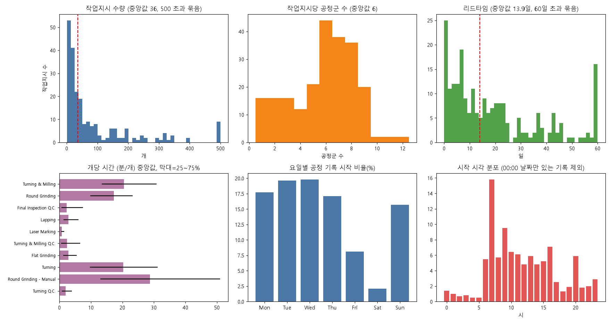
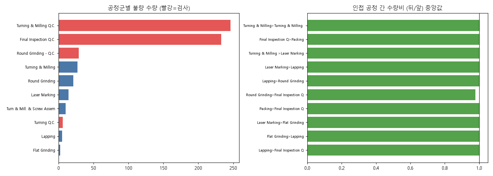
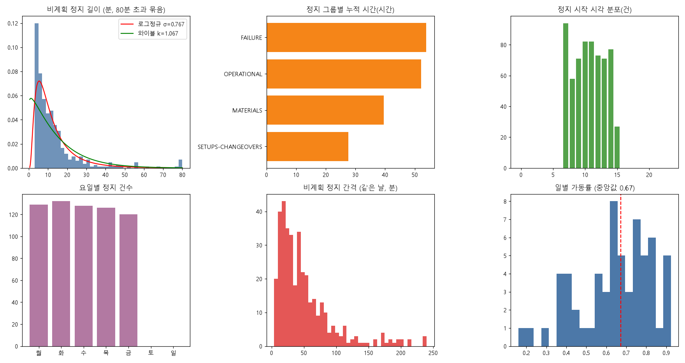
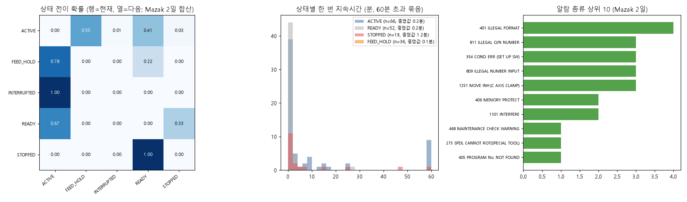
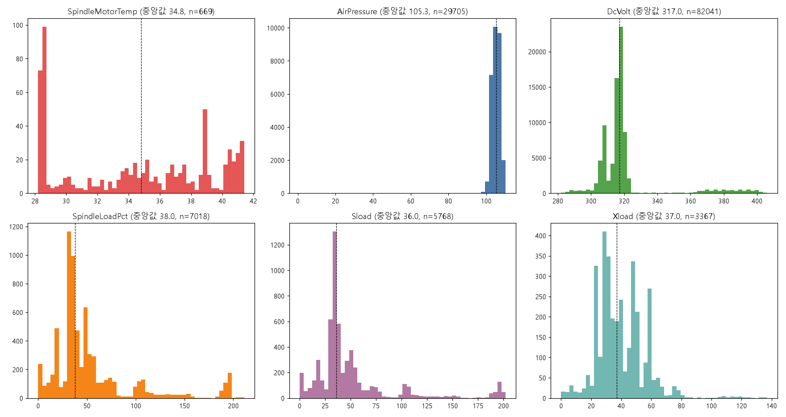

# 생산 파트 가상 데이터 기준 프로파일링 보고서

작성 목적: `AUTOMOTIVE_MACHINING_SYNTHETIC_DATA_PLAN.md`(이하 설계안)의 생산 파트 숫자를, 로컬 `data/`의 실제 공개 데이터에서 **직접 계산한 값**과 맞대어 확인한다.
모든 숫자는 `profiling/` 의 스크립트가 원본을 읽어 계산했다. 원본 `data/`는 수정하지 않았다. 기존 `analysis/` 결과(4TU 불량률 0.64%, NIST 상태 시간, Haas 항목 수 등)와 겹치는 분석은 하지 않고, 이번에 새로 뽑은 것(경로·수량 흐름·사이클·전이행렬·분포 적합 등)만 담았다.

## 0. 핵심 발견 요약

| # | 발견 | 설계안에 주는 의미 |
|---|---|---|
| 1 | 4TU 작업지시 수량 중앙값 36은 맞다. 그러나 분포는 매우 넓다(p25 15, p75 108, p90 256). 24~60개 범위에 든 지시는 **25.3%**뿐 | 중앙값은 유지. 범위 24~60은 "시연용 단순화"로 명시하거나 로그정규(σ 1.34)를 쓰는 안을 선택 |
| 2 | 작업지시당 공정군 수 중앙값 6(p25 4, p75 8). 경로가 다양해 상위 10개 경로가 전체의 27%뿐(고유 경로 158개). 지시의 75%가 "선삭·밀링 후 중간검사"를 거치고 79%가 최종검사를 거침 | 5공정(OP-10~50)은 타당. 중간검사 단계를 넣을지 선택 사항 |
| 3 | 불량은 검사 공정에서 **86.7%** 기록(중간검사 41.5% + 최종검사 39.3% + 기타검사 5.9%). 지시의 54.2%가 불량 1건 이상이고, 불량이 있는 지시의 중앙값은 2.5개(1.19%), p90 8.98% | 전체 0.5~1.0% 유지. 작업지시마다 편차를 주는 규칙(약 46% 무불량)을 추가 권고 |
| 4 | 4TU 보고유형 D/S/B는 데이터 패턴상 D=생산 실적, S=셋업(준비), B=수량 0의 비가동 보고(설비 공정에서만, 1.2%)로 추정된다 | 설계안의 "4TU와 같은 칸 구성"에 정의를 붙일 근거 |
| 5 | 벽돌 라인 비계획 정지 길이는 **로그정규**(σ 0.77, 중앙값 9.7분)가 와이블·지수보다 잘 맞는다(KS 0.069 대 0.174·0.197) | 주의 등급 정지 길이를 로그정규로 생성 |
| 6 | NIST Mazak의 `STOPPED`는 **수동(MANUAL) 모드 시간과 정확히 같다**(127.6분=127.6분, 88.0분=88.0분). 설비 고장 정지가 아니라 수동 조작·셋업 성격 | 설계안 DOWN(고장)이 아니라 SETUP/수동에 대응시키는 것이 맞다 |
| 7 | NIST 하루 상태 변화(중복 제거) 100회/76회, 근무창 내 ACTIVE 72.1%/76.1%(야간 대기 포함 시 Mazak03은 47.8%) | 설계안 60~120회, RUN 55~75% 유지. "근무창 기준" 단서만 추가 |
| 8 | NIST 경고 알람은 하루 10건/9건. 설계안 조작 안내 3~8건/일은 낮은 편 | 조작 안내 5~12건/일로 상향 권고 |
| 9 | Haas SHDR에는 PartCount가 없다. Mazak `PartCountAct`는 0 고정, Hurco02만 9회 증가(간격 중앙값 45분) | 생산 수량은 실제 데이터로 못 정한다. 공정 실적 합으로 가상 생성하는 설계안 방식 유지 |
| 10 | umich, kamp, mtconnect 데모는 생산 파트에 쓸모없음. `kamp/mirror_chakihwan`은 umich의 재료 라벨만 바꾼 사본 | 사용 금지 |

## 1. 실행 환경과 재현 방법

환경: Windows 11, Python 3.14.7, pandas 3.0.6, numpy 2.5.3, scipy 1.18.1, matplotlib 3.11.2, openpyxl 3.1.5. 처음에 scipy와 matplotlib이 없어 `python -m pip install scipy matplotlib`로 설치했다(`pip` 명령은 PATH에 없어 `python -m pip` 사용).

```powershell
cd 11_automotive\docs\production_extra\profiling
python -m pip install pandas numpy scipy matplotlib openpyxl
python p01_4tu_production.py          # A. 4TU            (수 초)
python p02_other_oee.py               # B. 벽돌 + 블로우   (수 초)
python p03_nist.py                    # C. NIST           (수십 초)
python p04_haas.py                    # D. Haas SHDR zip   (약 16초, 131MB 스트리밍)
python p05_umich_kamp_mtconnect.py    # E. 기타
```

| 스크립트 | 입력 | 주요 출력 |
|---|---|---|
| `common_prof.py` | (공통 경로·분위수 도우미) | — |
| `p01_4tu_production.py` | `data/4tu/data/Production_Data.csv` | `4tu_*.csv`, `4tu_summary.json`, `fig_4tu_overview.png`, `fig_4tu_reject_flow.png` |
| `p02_other_oee.py` | `data/other_oee/*` | `brick_*.csv`, `blow_*.csv`, `other_oee_summary.json`, `fig_brick_downtime.png` |
| `p03_nist.py` | `data/nist/raw/Mazak*`, `data/nist/tdp/*`, `raw/Hurco01` | `nist_*.csv`, `nist_summary.json`, `fig_nist_state.png` |
| `p04_haas.py` | `data/haas_ngc_mtconnect/*` | `haas_*.csv`, `haas_summary.json`, `fig_haas_sensors.png` |
| `p05_umich_kamp_mtconnect.py` | `data/umich`, `data/kamp`, `data/mtconnect` | `umich_experiments.csv`, `other_summary.json` |

표기: p05, p50, p95는 5%, 50%(중앙값), 95% 분위수다. n은 표본 수다.

## 2. A. 4TU Production_Data (225개 작업지시, 4,543행, 2012-01-02~03-31)

### 2.1 컬럼 정의 추정 (A1) — `4tu_columns.csv`, `4tu_report_type.csv`

| 컬럼 | 의미(추정) | 근거 |
|---|---|---|
| Case ID | 작업지시 번호(225개) | 지시마다 `Work Order Qty`가 하나뿐(수량이 둘 이상인 지시 0건) |
| Activity / Resource | 공정(55종) / 설비·검사대(31종) | Activity에서 "- Machine N"을 떼면 공정군 약 13종 |
| Start/Complete Timestamp | 보고 구간의 시작·끝 | 10.3%의 행은 시작이 00:00:00(날짜만 기록된 것으로 보임) |
| Span | 보고된 작업 시간(hhh:mm) | 경과 시간과 1분 이내로 일치하는 행 84.6%. 14.6%는 Span=0. 엑셀 날짜 오염 1건(`1899/12/31 01:49`) |
| Work Order Qty | 지시 수량 | 지시당 고정 |
| Report Type | D / S / B | 아래 표 |
| Qty Completed / Rejected / for MRB | 완료 / 불량 / 부적합품 심의(MRB) 보류 수량 | MRB 105개 중 76개가 선삭·밀링 중간검사 |
| Rework | 재작업 표시 | 32행만 Y(D 30행, S 2행). 선삭·밀링 7, 선삭 5, 최종검사 5, 중간검사 5 등 |

| Report Type | 행 수(비율) | Span 중앙값(p25~p75) | 수량>0 행 비율 | 불량 합 | 검사공정 비율 | 지시의 첫 행 | 직전 유형 |
|---|---|---|---|---|---|---|---|
| D | 3,785 (83.3%) | 95분 (19~254) | 71.5% | 593 | 30.6% | 1.6% | D 85.6%, S 11.8% |
| S | 705 (15.5%) | 157분 (79~300) | 37.2% | 0 | 5.1% | 22.7% | D 42.3%, S 33.0% |
| B | 53 (1.2%) | 98분 (60~279) | 0% (수량 0) | 0 | 0% | 5.7% | D 54.7%, S 35.8% |

추정 근거: ① 불량 593개는 전부 D에서만 나온다. D 완료 수량 합이 92,048개로 총 92,519개의 99.5%다. 그래서 D는 생산 실적이다. ② S는 지시의 첫 행이 되는 비율이 가장 높고(22.7%), 완료 수량이 작으며(합 471개), S 다음에 D가 오는 비율이 63.4%(같은 공정의 D가 이어지는 경우 46.4%)다. 그래서 S는 셋업(준비)이다. 또한 지시의 84.0%가 S 행을 가진다. ③ B는 수량이 항상 0이고 설비 공정에만 있으며(검사공정에는 없음) 53행뿐이다. 비가동 보고(휴식 또는 고장)로 보이나 데이터만으로 둘을 구분하지는 못한다.

### 2.2 작업지시당 공정 수와 경로 (A2) — `4tu_routes_core_top10.csv`, `4tu_summary.json`

| 지표 | n | p05 | p25 | 중앙값 | p75 | p90 | p95 | 비고 |
|---|---|---|---|---|---|---|---|---|
| 공정군 수(재작업·셋업 제외) | 225 | 1 | 4 | **6** | 7 | 8 | 9 | 평균 5.6 |
| 가공 공정군 수(검사·포장 제외) | 225 | 0 | 2 | 3 | 4 | 5 | 5 | |
| 지시당 보고 행 수 | 225 | 2 | 8 | 14 | 23 | 40.6 | 62.8 | 최대 175 |
| 지시당 작업자 수 | 225 | 1.2 | 5 | 7 | 9 | 11.6 | 14 | |

공정군은 Activity에서 "- Machine N"을 제거해 묶었다. 경로 순서는 공정군별 첫 시작 시각 순이다. 날짜만 있는 기록(00:00)이 있어 순서에 약간의 오차가 있을 수 있다.

| 순위 | 지시 수(비율) | 핵심 경로(공정군) |
|---|---|---|
| 1 | 18 (8.0%) | 선삭·밀링 > 선삭·밀링 검사 > 레이저 마킹 > 랩핑 > 원통연삭 > 최종검사 > 포장 |
| 2 | 11 (4.9%) | 선삭·밀링 > 선삭·밀링 검사 |
| 3 | 10 (4.4%) | 선삭·밀링 > 선삭·밀링 검사 > 레이저 마킹 > 랩핑 > 최종검사 > 포장 |
| 4 | 9 (4.0%) | 선삭·밀링 |
| 5 | 6 (2.7%) | 선삭·밀링 > 선삭·밀링 검사 > 레이저 마킹 |
| 6 | 5 (2.2%) | 선삭·밀링 > 검사 > 레이저 > 평면연삭 > 랩핑 > 원통연삭 > 최종검사 > 포장 |
| 7~8 | 각 4 (1.8%) | 선삭·밀링 > 검사 > 레이저 > 평면연삭 > 최종검사 > 포장 / 선삭·밀링 > 검사 > 레이저 > 원통연삭 > 최종검사 > 포장 |
| 9 | 4 (1.8%) | ... > 원통연삭 > 포장 > 최종검사 (순서 뒤바뀜) |
| 10 | 4 (1.8%) | 포장 > 최종검사 (선후가 뒤바뀐 기록) |

- 첫 공정은 선삭·밀링이 145건(64%), 선삭 18건, 선삭·밀링 검사 19건. 마지막이 포장인 지시는 48.4%, 최종검사를 거친 지시는 78.7%, 선삭·밀링 검사를 거친 지시는 약 75%(168/225).
- 원본 전체 경로(재작업 포함)는 고유 158개, 상위 10개 합이 27.1%(`4tu_routes_top10.csv`).

### 2.3 공정별 수량 흐름 (A3) — `4tu_qty_flow_pairs.csv`, `4tu_qty_vs_orderqty_by_family.csv`

인접한 두 공정(앞→뒤)의 D 완료 수량 합의 비율이다. n은 해당 경로를 거친 지시 수다(15건 이상만).

| 앞 공정 → 뒤 공정 | n | 비율 중앙값 | p25~p75 | 합산 비율(뒤/앞) |
|---|---|---|---|---|
| 선삭·밀링 → 선삭·밀링 검사 | 132 | 1.00 | 0.947~1.035 | 0.857 |
| 선삭·밀링 검사 → 레이저 마킹 | 95 | 1.00 | 1.00~1.00 | 0.965 |
| 레이저 마킹 → 랩핑 | 72 | 1.00 | 1.00~1.00 | 0.965 |
| 랩핑 → 원통연삭 | 63 | 1.00 | 0.967~1.00 | 0.976 |
| 원통연삭 → 최종검사 | 50 | 0.979 | 0.878~1.00 | 0.815 |
| 최종검사 → 포장 | 113 | 1.00 | 1.00~1.00 | 1.002 |
| 전체 인접쌍 | — | 1.00 | — | **0.948** |

- 인접쌍의 86.6%는 비율이 1 이하. 중앙값이 1.00인 이유는 대부분 수량을 그대로 넘기기 때문이고, 합산 비율이 낮은 쌍(선삭·밀링 → 검사 0.857, 연삭 → 최종검사 0.815)은 불량·일부 미보고·관측 기간 종료(2012-03-31 이후 미보고)가 섞여 있어 이 데이터만으로 원인을 나누지 못한다.
- 지시 수량 대비 완료 수량(공정군별 중앙값): 포장 0.947, 최종검사 0.939, 선삭·밀링 0.967, 중간검사 0.982, 레이저 0.984, 랩핑 0.98. 포장 수량/지시 수량은 p25 0.803, p50 0.947, p75 1.0.

### 2.4 개당 사이클타임 (A4) — `4tu_cycle_min_per_piece_by_family.csv`, `4tu_cycle_lognorm_fit.csv`

D 행 중 완료 수량>0, Span>0인 행의 "Span ÷ 완료 수량"(분/개)이다. 한 번의 보고가 여러 개를 묶으므로 순수 사이클이 아니라 대기·교대를 포함한 실효 시간이다.

| 공정군 | n | p05 | p25 | 중앙값 | p75 | p90 | p95 | 로그정규 σ |
|---|---|---|---|---|---|---|---|---|
| 선삭·밀링 | 738 | 6.02 | 13.40 | **20.52** | 30.81 | 61.17 | 95.17 | 0.96 |
| 원통연삭 | 378 | 4.49 | 9.81 | 17.29 | 23.26 | 31.39 | 43.15 | 0.75 |
| 선삭 | 64 | 2.72 | 9.73 | 20.25 | 31.17 | 47.64 | 67.45 | 1.25 |
| 평면연삭 | 80 | 0.09 | 1.22 | 2.82 | 5.56 | 10.96 | 13.37 | 1.58 |
| 랩핑 | 204 | 0.14 | 1.38 | 2.90 | 6.02 | 12.17 | 18.13 | 1.38 |
| 레이저 마킹 | 195 | 0.07 | 0.57 | 0.83 | 1.57 | 2.96 | 5.09 | 1.21 |
| 최종검사 | 206 | 0.02 | 0.69 | 2.32 | 7.50 | 17.50 | 35.75 | 2.23 |
| 선삭·밀링 검사 | 192 | 0.01 | 0.55 | 2.43 | 6.67 | 16.13 | 20.74 | 2.19 |
| 수동 원통연삭 | 43 | 6.81 | 13.05 | 28.75 | 51.0 | 83.61 | 103.88 | 0.91 |

- 가공 공정 전체(검사 제외) 중앙값 14.57분/개(p25 5.18, p75 24.36, p90 45.08), 검사 전체 2.38분/개.
- 한 번에 보고되는 완료 수량(D, 수량>0): 중앙값 17개(p25 9, p75 39, p90 83, p95 131).
- 셋업 시간(S 행, `4tu_setup_min_by_family.csv`): 전체 중앙값 157분(p25 79, p75 300, p90 438). 선삭·밀링 226.5분, 원통연삭 105.5분. 지시 하나의 셋업 합은 중앙값 580분(p25 350, p75 919).
- 지시 하나의 작업 시간 합(Span 합): 중앙값 31.3시간(p25 15.8, p75 63.8), 개당으로는 0.837시간.

### 2.5 작업지시 수량 분포 (A5) — `4tu_case_quantiles.csv`, `4tu_order_qty_by_part.csv`

| 지표 | p05 | p10 | p25 | 중앙값 | p75 | p90 | p95 | 평균 | 최대 |
|---|---|---|---|---|---|---|---|---|---|
| 지시 수량(개) | 5 | 9 | 15 | **36** | 108 | 256.4 | 350 | 92.9 | 720 |

- 로그정규 적합(위치 0): σ 1.337, 중앙값 40.1. 24~60개에 든 지시 비율 25.3%.
- 품목 43종, 상위 5개 품목이 지시의 68.4%. 품목별 중앙값 수량은 Ballnut 25.5(58건), Cable Head 33(50건), Spur Gear 24(26건), Bearing 73(11건).

### 2.6 불량·재작업 (A6) — `4tu_reject_by_family.csv`

| 공정군 | 보고 행 | 완료 | 불량 | 불량률 | 전체 불량 중 비율 | MRB |
|---|---|---|---|---|---|---|
| 선삭·밀링 검사 | 522 | 12,641 | 246 | 1.91% | 41.5% | 76 |
| 최종검사 | 550 | 12,053 | 233 | 1.90% | 39.3% | 26 |
| 원통연삭 검사 | 61 | 1,358 | 29 | 2.09% | 4.9% | 3 |
| 선삭·밀링 | 1,272 | 14,590 | 27 | 0.18% | 4.6% | 0 |
| 원통연삭 | 631 | 8,422 | 21 | 0.25% | 3.5% | 0 |
| 레이저 마킹 | 252 | 12,934 | 14 | 0.11% | 2.4% | 0 |
| 선삭·밀링·나사조립 | 35 | 282 | 10 | 3.42% | 1.7% | 0 |
| 선삭 검사 | 55 | 2,088 | 6 | 0.29% | 1.0% | 0 |
| 랩핑 | 370 | 9,178 | 5 | 0.05% | 0.8% | 0 |

- 전체 불량률 0.637%(593/(92,519+593)). 검사 공정만으로 계산한 불량률은 1.75%.
- 지시 단위: 불량이 1개 이상인 지시 54.2%(122건). 이 중 불량률 중앙값 1.19%(p25 0.52, p75 2.46, p90 8.98, p95 16.7), 불량 개수 중앙값 2.5개(p75 6, p90 10.9, 최대 35).
- 불량이 기록되는 행(231행)의 불량 개수: 중앙값 1, p75 3, p90 5, p95 7, 최대 28.
- 재작업 표시(Rework=Y)는 32행으로 적다. 별도 재작업 공정("Grinding Rework" 등)은 97행(완료 수량 합 72개).

### 2.7 작업자·설비 부하 (A7) — `4tu_worker_load.csv`, `4tu_resource_load.csv`

| 지표 | n | p25 | 중앙값 | p75 | p90 | 최대 |
|---|---|---|---|---|---|---|
| 작업자별 보고 행 수 | 49 | 4 | 25 | 161 | 240 | 431 |
| 작업자별 작업 시간(h) | 49 | 7.1 | 81.3 | 514.5 | 633.1 | 1,172 |
| 작업자별 담당 설비 수 | 49 | 1 | 3 | 5 | 8 | 11 |
| 작업자의 근무일당 작업 시간(h) | 49 | 3.55 | 7.56 | 9.06 | 11.05 | 16.05 |
| 설비별 작업 시간(h, 기계 26대) | 26 | 17.7 | 171.3 | 896.7 | 1,204 | 1,533 |
| 설비 1대당 작업자 수 | 26 | 2 | 4 | 9 | 11 | 15 |
| 설비 가동 비율(90일 달력 대비, %) | 26 | 0.82 | 7.93 | 41.5 | 55.8 | 71.0 |
| 설비의 가동일당 작업 시간(h) | 26 | 5.03 | 7.79 | 13.49 | 15.64 | 18.47 |

- 가동 상위 설비는 선삭·밀링 4, 5, 6번(달력 대비 71%, 67%, 61%). 소수의 설비에 부하가 몰린다. 검사대 1번은 지시 214건 중 거의 모든 건을 처리(9명이 병렬 작업, 달력 대비 89.7%는 병렬 작업 합산이라 100%를 넘는 값이 아님에 유의).
- 한 지시 안에서 작업자가 바뀌는 횟수 중앙값 9회(p90 29.6).

### 2.8 일별 완료·요일·시간대 (A8) — `4tu_daily.csv`, `4tu_weekday.csv`, `4tu_hour_start.csv`

| 지표 | n | p25 | 중앙값 | p75 | p90 | 평균 | 비고 |
|---|---|---|---|---|---|---|---|
| 일별 완료 지시 수(평일 65일) | 65 | 1 | 2 | 4 | 6.6 | 3.11 | 최대 25(자료 마지막 날 일괄 종료 영향) |
| 일별 완료 지시 수(달력 90일) | 90 | 0 | 2 | 3 | 6 | 2.5 | |
| 일별 보고 행 수 | 90 | 30.5 | 59 | 68 | 74 | 50.5 | |
| 일별 완료 수량(평일, 모든 공정 합) | 65 | 787 | 1,033 | 1,541 | 2,058 | 1,196 | 같은 부품이 공정마다 중복 집계됨 |

주당 17.5건(12.9주 동안 225건).

| 요일 | 월 | 화 | 수 | 목 | 금 | 토 | 일 |
|---|---|---|---|---|---|---|---|
| 보고 시작 비율(%) | 17.7 | 19.6 | 19.8 | 17.1 | 8.1 | 2.1 | 15.7 |

일요일 15.7%는 밤 근무 시작(일요일 저녁)으로 보인다. 시작 시각은 07시가 15.8%로 가장 크고, 09시 9.5%, 15시 7.1%, 10시 6.4%, 11시 6.1%다(날짜만 있는 00:00 기록 제외 4,076행 기준). 06~11시가 49.0%, 00~05시가 4.9%.

### 2.9 리드타임 (A9) — `4tu_case_quantiles.csv`

| 지표 | p05 | p25 | 중앙값 | p75 | p90 | p95 |
|---|---|---|---|---|---|---|
| 리드타임(일, 첫 시작~마지막 종료, n=225) | 0.42 | 5.49 | **13.9** | 28.9 | 47.3 | 72.0 |
| 포장으로 끝나는 지시만(n=109) | 3.1 | 7.04 | 15.2 | 28.8 | 43.1 | 63.0 |
| 공정군 사이 대기(시간, n=1,695) | 0.02 | 2.39 | 8.63 | 32.5 | 114 | 225.7 |
| 작업 시간/리드타임(%) | 0.95 | 5.98 | 10.7 | 21.8 | 48.7 | 64.9 |

리드타임은 소량 다품종 작업장 기준이다. 연속 흐름에 가까운 설계안 라인과는 성격이 달라 값을 직접 쓰면 안 된다(7장 참고).

그림:  

## 3. B. 벽돌 라인 정지 기록 (Zenodo 17855209, 다른 업종 참고용)

정지 기록 635건(2025-09-22~12-18, 데이터가 있는 날 62일, 평일만). 별도로 개선(LSS) 후 540건이 있으며 같은 방식으로 계산해 `brick_*_afterLSS.csv`에 있다. 아래는 개선 전 기준이다. 정지 하한이 약 3분이라 3.1분 이하는 기록되지 않는다(분포 왼쪽이 잘림).

### 3.1 정지 길이 분포 — `brick_by_group_before.csv`, `other_oee_summary.json`

| 구분 | 건수 | p05 | p25 | 중앙값 | p75 | p90 | p95 | 최대 |
|---|---|---|---|---|---|---|---|---|
| 전체 | 635 | 3.5 | 5.75 | 11.0 | 16.7 | 31.8 | 48.4 | 276.8 |
| 비계획 | 438 | 3.4 | 5.3 | **9.0** | 15.1 | 26.7 | 41.7 | 276.8 |
| 계획(OEE 포함) | 174 | 3.6 | 8.05 | 13.0 | 17.2 | 31.4 | 42.4 | 109.0 |
| 계획(OEE 제외) | 23 | 23.3 | 31.0 | 41.9 | 72.5 | 104 | 123.9 | 196.9 |
| 고장(FAILURE) | 222 | 3.4 | 4.75 | 8.25 | 13.7 | 26.7 | 45.7 | 276.8 |

### 3.2 분포 적합 (위치 0 고정, `scipy.stats`)

| 대상 | 로그정규 σ / 중앙값(분) | 로그정규 KS | 와이블 k / 척도 | 와이블 KS | 지수 평균 | 지수 KS |
|---|---|---|---|---|---|---|
| 비계획 정지 길이 | 0.767 / 9.69 | **0.069** | 1.067 / 14.59 | 0.174 | 14.12 | 0.197 |
| 고장 길이 | 0.815 / 9.13 | **0.093** | 0.965 / 14.25 | 0.205 | 14.57 | 0.192 |
| 비계획 정지 간격(같은 날, 분) | 0.822 / 36.7 | **0.039** | 1.257 / 55.26 | 0.067 | 51.0 | 0.143 |

로그정규의 AIC가 가장 낮다(비계획 길이 3003.7 대 와이블 3195.1, 지수 3197.4). 와이블 k가 1에 가까워 지수분포와 거의 같고, 둘 다 길이 분포에는 잘 안 맞는다.

### 3.3 그룹 비율, 시간대·요일, 도착률, 가동률

| 그룹 | 건수 비율 | 누적 시간 비율 | 길이 중앙값(분) | p90(분) | 주요 사유(건수, 중앙값 분) |
|---|---|---|---|---|---|
| FAILURE | 35.0% | 31.1% | 8.25 | 26.7 | 자동화 고장 131(8.5), 기계 고장 89(7.3) |
| MATERIALS | 29.8% | 22.8% | 10.2 | 25.0 | 수동 벽돌 취급 134(10.8) |
| OPERATIONAL | 20.0% | 30.1% | 13.9 | 60.4 | 청소 85(12.0), 생산 일정 없음 23(41.9) |
| SETUPS-CHANGEOVERS | 15.3% | 15.9% | 13.5 | 26.9 | 자재 교체 80(13.6) |

- 정지 유형: 비계획 69.0%, 계획(OEE 포함) 27.4%, 계획(OEE 제외) 3.6%. 비계획 중 고장 비율 50.7%.
- 위치: 건조 전 적치부(HACKING STATION) 28.5%, 압출기 26.6%, 건조기 12.3%, 절단기 10.1%.
- 시간대: 07~15시에만 기록(07시 14.8%, 10·11시 각 12.9%). 요일: 월~금 18.9~20.8%로 균등, 토·일 0.
- 비계획 정지 건수/일(데이터가 있는 날): 중앙값 7(p10 4, p90 10, 평균 7.1, 최대 16). 달력일 기준 4.98건. 비계획 정지 시간/일 중앙값 90.1분(p25 50, p75 139.3, p90 175.2).
- 비계획 정지 도착 간격(같은 날 안): 중앙값 39분(p25 21, p75 64, p90 101), 평균 51분, 변동계수 0.90. 같은 날 안 간격이므로 밤·주말 공백은 제외했다.
- 고장 도착 간격은 전체 기준 중앙값 76분이지만 p75가 1,013분(다음 날 이상)이라 "하루 안에 몰려 발생"하는 꼴이다.
- 일별 가동률(Availability, 62일): 중앙값 **0.672**(p05 0.359, p10 0.388, p25 0.553, p75 0.779, p90 0.832, 최소 0.161, 최대 0.924). 0.5 미만인 날 21.0%. 성능 중앙값 0.936, 품질 중앙값 0.989, OEE 중앙값 0.608. 일별 불량률 중앙값 1.10%(p90 3.30%). 비계획 정지가 계획시간에서 차지하는 비율 중앙값 18.9%.
- 개선 후(LSS) 비교(`brick_before_after.csv`): 가동률 중앙값 0.711, OEE 0.666, 정지 길이 중앙값 9분. 전체 건수 540.

그림: 

### 3.4 보조: 블로우 성형 라인 (Zenodo 17116973) — 생산 파트에 쓸 만한 항목

단일 설비(SBM001) 485개 교대 기록(2025-01-02~07-31, 하루 3교대 중앙값). 4TU에는 없는 "교대별 목표·실적·불량·사이클" 칸이 있다.

| 지표 | p05 | p25 | 중앙값 | p75 | p95 | 비고 |
|---|---|---|---|---|---|---|
| 사이클(초) | 8 | 11 | 12 | 13 | 14 | 6~16초 정수 값 |
| 교대 생산량(개) | 276 | 1,833 | 2,943 | 3,853 | 5,125 | 최대 7,772 |
| 교대 불량률(%) | 0.94 | 2.58 | 4.42 | 7.68 | 22.4 | 전체 4.9% |
| 가동률(교대) | 0.071 | 0.419 | 0.671 | 0.804 | 0.929 | 평균 0.595 |
| 교대 정지 시간(분) | 30 | 60 | 118 | 229 | 400 | |
| 정지 1건 길이(분, n=2,146) | 4 | 6 | 15 | 30 | 130 | 로그정규 σ 1.11, 중앙값 16.6 |

- 교대 계획 시간은 480분 또는 240분(p05가 240, p25부터 480). 일별 정지 건수 중앙값 13건(p05 7, p95 19). 정지 원인(6대 손실): 설비 고장 35.6%, 유휴·소정지 24.7%, 셋업 조정 12.9%, 속도 저하 11.6%, 공정 불량 9.3%, 시동 손실 5.8%. 셋업 조정의 길이 중앙값 100분, 시동 손실 71분, 나머지 10~11분.
- 이 데이터는 불량률이 4.9%로 높아(4TU 0.64%와 성격이 다르다) 불량률 기준으로 쓰지 않는다. 쓸 만한 것은 "교대 단위 보고 칸 구성"과 "정지 원인 6분류 및 길이 분포"다.

## 4. C. NIST 설비 상태 기록 (Mazak01 2017-01-11, Mazak03 2018-08-15, 두 날 합산)

`UNAVAILABLE`(통신 끊김) 값은 상태에서 제외하고, 같은 값이 이어지면 하나로 합쳐 상태 변화만 센다. 기존 `analysis/03` 결과와 같은 기준(그날 00:00 UTC 이후)이다.

### 4.1 상태 전이 확률 행렬 — `nist_transition_prob.csv` (행=현재 상태, 열=다음 상태)

| 현재 \ 다음 | ACTIVE | FEED_HOLD | INTERRUPTED | READY | STOPPED | 전이 수 |
|---|---|---|---|---|---|---|
| ACTIVE | 0 | 0.545 | 0.015 | 0.409 | 0.030 | 66 |
| FEED_HOLD | 0.778 | 0 | 0 | 0.222 | 0 | 36 |
| INTERRUPTED | 1.000 | 0 | 0 | 0 | 0 | 1 |
| READY | 0.673 | 0 | 0 | 0 | 0.327 | 52 |
| STOPPED | 0 | 0 | 0 | 1.000 | 0 | 19 |

- 파일별 행렬은 `nist_transition_prob_Mazak01-.csv`, `nist_transition_prob_Mazak03-.csv`. 두 설비는 ACTIVE→FEED_HOLD 비율이 0.415와 0.760으로 차이가 큰데, 설비별 운영 방식에 따라 달라지기 때문이다. 표본이 작다(전이 약 175회).
- STOPPED는 반드시 READY로만 돌아온다(19/19). STOPPED로 들어가는 직전 상태는 READY 17, ACTIVE 2.
- 설비의 `mode`와 비교하면 STOPPED 시간이 MANUAL 모드 시간과 같다(Mazak01 127.6분, Mazak03 88.0분). 즉 STOPPED는 수동 조작 구간이다.

### 4.2 상태별 한 번 지속시간 — `nist_state_duration_s.csv` (초)

| 상태 | 방문 수 | p05 | p25 | 중앙값 | p75 | p90 | p95 | 최대 | 누적(분) | 로그정규 σ |
|---|---|---|---|---|---|---|---|---|---|---|
| ACTIVE | 66 | 1.1 | 6.3 | 12.4 | 532 | 4,542 | 5,948 | 8,819 | 1,091.6 | 2.84 |
| READY | 52 | 1.1 | 2.5 | 10.1 | 56 | 184 | 511 | 5,306 | 158.4 | 2.04 |
| STOPPED | 19 | 3.4 | 34.7 | 70.1 | 358 | 1,822 | 3,212 | 6,208 | 215.6 | 2.18 |
| FEED_HOLD | 36 | 1.1 | 2.1 | 3.3 | 6.9 | 14.4 | 26.9 | 43.4 | 4.1 | 1.01 |
| INTERRUPTED | 1 | 4.2 | — | 4.2 | — | — | — | 4.2 | 0.1 | — |

ACTIVE는 "짧은 토막(중앙값 12초)과 긴 연속 가공(p75 이상 9분~2.4시간)"이 섞인 이중 구조라 하나의 로그정규(σ 2.84)로는 거칠다. 상태별 방문 비중은 ACTIVE 37.9%, READY 29.9%, FEED_HOLD 20.7%, STOPPED 10.9%이고 시간 비중은 ACTIVE 74.3%, STOPPED 14.7%, READY 10.8%다(근무창 기준 합산).

### 4.3 가동 시간 비율과 상태 변화 횟수 — `nist_summary.json`

| 설비 | 근무창 길이(h) | 상태 변화(중복 제거) | ACTIVE | READY | STOPPED | 야간 대기 포함 ACTIVE |
|---|---|---|---|---|---|---|
| Mazak01 | 11.17 | 100 | 72.1% | 8.7% | 19.0% | 72.1% (뒤 대기 0시간) |
| Mazak03 | 13.32 | 76 | 76.1% | 12.5% | 11.0% | 47.8% (뒤 READY 7.89시간 포함, 총 21.2시간) |

근무창은 첫 상태 변화부터 마지막 상태 변화까지이며, 그 뒤에 같은 상태로 이어진 시간(Mazak03은 READY 7.89시간)을 "야간 대기"로 따로 셌다. 시간당 상태 변화 7.1회(근무창 합산). 기존 분석에서 "ACTIVE 48~72%"로 보고된 값은 Mazak03의 밤새 대기 시간을 포함한 값이며, 이번 계산은 두 기준을 모두 확인했다.

### 4.4 알람 유형과 비율 — `nist_alarm_types.csv`, `nist_alarm_episodes.csv`

두 날 알람 에피소드 25건(Warning 19, Fault 6). Warning 76%, Fault 24%. 서로 다른 알람 번호 12종.

| 레벨 | 코드·내용 | 건수(비율) |
|---|---|---|
| Warning | 401 ILLEGAL FORMAT | 4 (16%) |
| Fault | 809 ILLEGAL NUMBER INPUT | 3 (12%) |
| Fault | 811 ILLEGAL O/N NUMBER | 3 (12%) |
| Warning | 1251 MOVE INH.(C AXIS CLAMP) | 3 (12%) |
| Warning | 354 COND. ERR (SET UP SW) | 3 (12%) |
| Warning | 1101 INTERFERE, 406 MEMORY PROTECT | 각 2 (8%) |
| Warning | 1242, 275, 146, 405, 468 | 각 1 (4%) |

- 하루 건수: Mazak01 Warning 10 + Fault 0, Mazak03 Warning 9 + Fault 6(Fault 6건은 모두 입력 오류 계열). 근무창 1시간당 0.90건/1.13건.
- 조건 지속시간(알람이 켜져 있던 시간): Warning 중앙값 3.8초(p90 12.7초, 최대 2,171초), Fault 중앙값 449.8초(p25 7.6초, p75 3,057초). Fault는 모두 `motion_cond`, Warning은 `system_cond` 11건, `logic_cond` 8건.
- 알람이 시작될 때의 실행 상태: STOPPED 13건, ACTIVE 7건, READY 5건. 알람 시작 전 1분~후 10분 안에 STOPPED로 전이한 알람이 56%.
- 알람 발생 시각(UTC)은 11시에 13건(Fault 4건 포함)이 몰리고 9시 5건이 뒤를 잇는다. 하루 안에서도 한두 시각에 몰려 발생한다.

### 4.5 부품 수와 사이클 추정 — `nist_summary.json`

| 설비 | PartCount 항목 | 값 | 사이클 추정 |
|---|---|---|---|
| Mazak01, 03 | `PartCountAct` | 0 한 값만(증가 없음) | 부품 수로는 사이클 추정 불가. Mazak의 `cut_time/auto_time` 카운터는 1초 단위로 보이지만(`total_time` 증가율이 경과 시간과 1.0배) 사이클 경계 정보는 없음 |
| Hurco02 (2017-02-01~02, 35.3시간) | `Part_Count` | 1909→1917 (9회 증가) | 증가 간격 중앙값 45.2분(p25 20.6, p75 172.4, 최소 11.0, 최대 1,511.6분) |
| Hurco02 `Program_Status` | ACTIVE→PROGRAM_COMPLETED | 8회 | 중앙값 17.7분(p25 6.1, p75 26.6, 최소 2.5, 최대 29.4) |

Hurco 값은 시험 프로그램(Test.NC, NIST BOX OP1 등)을 돌린 기록이라 양산 사이클이 아니다.

그림: 

## 5. D. Haas NGC SHDR (ST-40 선반, 2022-10-11 06:26~10:43, 4.27시간)

`shdr_1665494517.txt.zip`(131MB 텍스트)을 스트리밍으로 읽었다. 유효 레코드 1,228,416건(초당 평균 79.9건). 한 줄에 여러 레코드가 붙은 것은 제어문자 STX(0x02)로 나눴다.

### 5.1 샘플링 간격

- 레코드 간 간격: 중앙값 10ms, p25 3ms, p75 21ms, p95 30ms, 최대 156ms. 변화가 있을 때만 보내는 방식이라 항목별 갱신 간격은 크게 다르다.

| 센서 | 갱신 간격 중앙값(ms) | p95(ms) |
|---|---|---|
| DcVolt | 61 | 734 |
| SpindleLoadPct | 122 | 464 |
| Xload / Zload | 163.5 / 163 | 4,689 / 3,195 |
| AirPressure | 341 | 1,287 |
| SpindleMotorTemp | 1,554 | 54,622 |
| ElectronicsTemp | 10,095 | 80,719 |

### 5.2 센서별 분포 — `haas_sensor_quantiles.csv`, `haas_sensor_by_running.csv`

| 센서(단위) | n | p05 | p25 | 중앙값 | p75 | p95 | p99 | 최대 |
|---|---|---|---|---|---|---|---|---|
| SpindleMotorTemp (℃) | 669 | 28.3 | 28.7 | **34.8** | 38.9 | 41.1 | 41.3 | 41.4 |
| ElectronicsTemp (℃) | 651 | 30 | 36 | 42 | 45 | 46 | 47 | 48 |
| AirPressure (psi) | 29,705 | 101.9 | 103.6 | **105.3** | 106.9 | 108.3 | 109.0 | 110.3 |
| DcVolt (V) | 82,041 | 305 | 313 | **317** | 319 | 379 | 398 | 406 |
| SpindleLoadPct (%) | 7,018 | 10 | 32 | **38** | 57 | 185 | 196 | 211 |
| Sload (주축 부하 %) | 5,768 | 11 | 32 | 36 | 52 | 155 | 197 | 202 |
| Xload (%) | 3,367 | 19 | 30 | 37 | 49 | 64 | 93 | 137 |
| Zload (%) | 3,391 | 3 | 7 | 9 | 11 | 25 | 62 | 76 |
| ToolLoad (%) | 43 | 44 | 44 | 54 | 56 | 72 | 72.6 | 73 |
| CPU (비율) | 14,501 | 0.23 | 0.24 | 0.27 | 0.55 | 0.64 | 0.68 | 0.87 |

- 프로그램 실행 중(RunningFlag=RUNNING)과 아닐 때를 나누면 SpindleLoadPct 중앙값 38 대 36, p95 186 대 148, DcVolt 중앙값 310 대 317(실행 중 낮음), CPU 중앙값 0.37 대 0.25. 온도와 공기압은 두 상태에서 같다.
- 공기압 최소값 1.0은 센서 초기값으로 보이는 이상치다(p01 101.0). 주의: 이 표본은 선반이고 개인 저장소 출처다. 값의 크기만 참고한다. SpindleActualRPM 값은 단위를 확인할 수 없어(최대 15,025,767) 쓰지 않는다.

### 5.3 실행 상태·사이클·알람 관련 항목

| 항목 | 결과 |
|---|---|
| PartCount | **없음**(이름에 `part`가 든 항목은 `PARTS_CATCHER` 등 장치 신호뿐). probe XML 3종에도 PART_COUNT 유형 없음 |
| 사이클 관련 | `ThisCycle`(밀리초 단위: 초당 1,000 증가), `LastCycle`(1,000의 배수, 초 단위 정밀도), `TimeRemaining`, `FeedTime`/`TotalTime` |
| 실행 상태 | `RunningFlag`(RUNNING/PENDING_OFF/OFF/HELD), `BeaconStatus`, `ActiveIconsList`. 표준 `Execution`/`ControllerMode`는 probe·current XML에만 있고 SHDR에는 없음 |
| 프로그램 | `ProgramName` 4종(MDI 포함), `ToolHoleCount`, `ActiveTool`(공구 번호 6종, 변경 42회) |
| 알람 | `alarm0`(코드), `AlarmSafetyLevel`, `message` |

- RunningFlag 시간 비율: OFF 84.8%, RUNNING 14.85%, HELD 0.32%. 상태 변화 272회. RUNNING 구간 56개, 길이 중앙값 6.1초(p25 3.1, p75 16.7, p90 134, 최대 467초). 10초 이하 공백을 합친 연속 가공 35개는 중앙값 12.2초(p75 57.1, p90 274, 최대 467초). 구간 사이 공백 중앙값 22.9초.
- `ThisCycle`이 리셋된 32번의 직전 값(밀리초): 중앙값 10,310(p25 4,728, p75 24,952, p90 157,047, 최대 230,573). `LastCycle` 값은 0, 2,000~10,000이 대부분(29회 변경). 이 기록은 수동 시험 운전으로 보이며 양산 사이클 값은 아니다.
- 비콘 시간 비율: ALL_OFF 53.9%, GREEN_FLASH 32.9%, GREEN_SOLID 9.1%, YELLOW_FLASH 4.1%, RED_FLASH 0.1%(`haas_beacon.csv`).
- 알람: 4.27시간 동안 `alarm0`이 0이 아닌 값을 가진 경우 3회(코드 439, 8370, 310). `AlarmSafetyLevel` 값은 3과 6. 각 알람은 2~11초 만에 0으로 돌아간다. `message` 이벤트 153회(Chuck Is Unclamped 26, Reset In Progress 20, Not Available While Running 19).
- probe XML: ST-40/VF-6 3종 모두 데이터 항목 202~259개, 이 중 `EXECUTION` 1, `CONTROLLER_MODE` 1, `PROGRAM` 1, 알람용 `CONDITION` 1, PART_COUNT 0. current 예시: 3종 모두 Execution=STOPPED.

그림: 

## 6. E. 기타 데이터 판정

| 데이터 | 내용 | 생산 파트 쓸모 | 판정 |
|---|---|---|---|
| umich (SMART Lab 밀링) | 18회 실험, 48열, 100ms 샘플링. 공구 상태·이송 속도·클램프 압력별 센서 시계열. 작업지시·수량·알람 없음 | 실험 1회 길이 46~233초(중앙값 134초; 이송 3mm/s 226초, 6 → 130초, 15 → 74초, 20 → 60초). 완료 14/18(77.8%), 완료+육안 합격 10/18(55.6%)은 일부러 나쁜 조건을 섞은 값이라 불량률로 못 씀 | **쓸모없음** (이송 속도와 가공 시간 반비례 관계의 근거로만 참고 가능) |
| kamp/mirror_chakihwan | 25회 실험. 1~18번은 umich와 행 수 동일, X 위치 상관 1.0, 메타 값 동일하고 재료 라벨만 wax→aluminum. 불량 라벨 48%. KAMP 사이트 파일은 안내 HTML뿐이며 로컬에 실제 데이터 없음 | 없음 | **쓸모없음, 사용 금지** (개인 저장소에 있는 umich 변형 사본, 출처 설명 없음) |
| mtconnect (공개 데모·Mazak 시뮬레이터 스냅샷) | probe 6종(항목 86~244개, PART_COUNT 1~2, 알람 CONDITION 20~31), current 6종, 이벤트 샘플 2종(28분과 1.6분) | `PartCount` 현재값 125(5610·5611 같은 값), 나머지 UNAVAILABLE 또는 0. 데모 Execution ACTIVE 구간(17초, 199초, 652초…)은 시뮬레이터 시나리오 | **쓸모없음** (항목 이름 참고만) |

## 7. F. 설계안 가정값과 비교 — 유지/조정 권고

판정: **유지**(실측과 부합), **조정**(실측과 어긋나 값을 바꾸길 권고), **선택**(바꿔도 되고 두어도 되는 보강), **근거 없음**(실측으로 확인 불가, [가상] 유지).

### 7.1 작업지시·공정·불량

| 설계안 항목 | 설계안 값 | 실측(출처) | 판정 | 권고 |
|---|---|---|---|---|
| 작업지시 수량 중앙값 | 약 36개 | 36 (4TU, 225건) | 유지 | — |
| 작업지시 수량 범위 | 24~60개 | p25 15, p75 108, p90 256. 24~60에 든 비율 25.3% | 선택 | 시연 단순화로 두되 문서에 "중앙값만 실측"을 명시. 현실감을 원하면 로그정규(중앙 36, σ 1.34)를 [12, 120]으로 절단 |
| 하루 작업지시 건수 | 3~5건 | 평일 완료 평균 3.11, 중앙값 2, p75 4, p90 6.6. 주당 17.5건 | 유지 | — |
| 공정 수 | 5개 (OP-10~50) | 공정군 중앙값 6(p25 4, p75 8), 가공 공정 3 | 유지 | 지시의 약 75%가 선삭·밀링 직후 중간검사를 거침. 중간검사(OP-25 등)를 넣을지는 선택 |
| 공정 경로 | 모든 지시가 5공정을 순서대로 | 고유 경로 158개, 상위 10개가 27% | 선택 | 시연은 단일 경로 유지. 일부 지시(예: 10%)에 공정 생략·재작업 경로를 주면 현실에 가까움 |
| 전체 불량률 | 0.5~1.0% | 0.637% (593/93,112) | 유지 | — |
| 불량이 기록되는 곳 | OP-50 약 80%, 나머지 20% | 검사 공정 합 86.7%(최종 39.3, 중간 41.5, 기타 5.9) | 유지 | 80~87%로 상향 가능. 중간검사가 없으면 OP-50 쏠림이 실측보다 큼(실측은 중간검사와 최종검사가 거의 반반) |
| 지시별 불량 편차 | 규칙 없음 | 불량 있는 지시 54.2%. 그 중 불량률 중앙값 1.19%, p90 8.98%. 불량 개수 중앙값 2.5 | 조정 | 지시의 약 46%는 0건, 나머지는 1~3개가 대부분, 일부 지시(약 10%)는 수 % 이상이 되도록 편차 규칙 추가 |
| 불량 기록 1회 개수 | — | 중앙값 1, p75 3, p90 5 | 선택 | 불량 수량 생성에 사용 |
| 공정 사이클(기준) | OP-10 1.0, OP-20 3.5, OP-30 7.0(2대), OP-40 25분/30개, OP-50 2.5분 | 개당 중앙값: 레이저 0.83, 랩핑 2.9, 평면연삭 2.8, 최종검사 2.32, 선삭·밀링 20.5, 연삭 17.3 | 유지 | 설계안 OP-50 2.5분은 실측 최종검사 2.32분과 거의 같음. OP-20·30(3.5~7분)은 실측 선삭·밀링 20분보다 빠르나 양산 알루미늄 브래킷 전제라 타당 |
| 사이클 변동 | 기준 ±5~10% | 개당 시간 p25~p75 = 중앙값의 약 0.65~1.5배(선삭·밀링). 로그정규 σ 0.75~1.4 | 조정 | 정상 구간 ±10%는 두되 5~10% 확률로 1.5배 이상 지연(대기·교대·작은 정지)을 섞음. 실측 폭은 보고 단위가 넓어 과대이므로 σ 0.2~0.3 정도가 무난(이 수치는 실측이 아닌 판단) |
| 셋업 시간 | 15~40분 | S 보고 중앙값 157분(p25 79, p75 300). 선삭·밀링 226, 연삭 105. 지시의 84%가 셋업 행 보유 | 선택 | 4TU는 소량 다품종이라 더 길다. 양산 라인 전제로 15~40분 유지하되 근거를 "실측은 수 시간"으로 정정 |
| 현장 작업자 수 | 계정 6명(교대·공정별) | 4TU는 49명/설비 26대(설비 1대당 작업자 중앙값 4명, 지시당 7명). 작업자 근무일당 작업 시간 중앙값 7.56시간 | 선택 | 설계안은 설비 5대 라인이라 6명이면 충분. 4TU의 "지시 안에서 작업자가 자주 바뀜"(중앙값 9회)은 반영하지 않아도 됨 |
| 요일·시간 패턴 | 평일 2교대 | 월~목 균등, 금 8.1%, 토 2.1%, 일 15.7%(밤 근무 시작). 시작 07시 15.8% 피크, 00~05시 4.9% | 선택 | 토요일 소량·금요일 감소를 주고 싶다면 반영 |
| 리드타임 | 없음 | 중앙값 13.9일(p25 5.5, p75 28.9), 공정 간 대기 중앙값 8.6시간 | 근거 없음 | 설계안 라인은 연속 흐름이라 직접 적용 금지. "공정 간 대기" 개념만 참고 |

### 7.2 설비 상태·알람

| 설계안 항목 | 설계안 값 | 실측(출처) | 판정 | 권고 |
|---|---|---|---|---|
| 하루 상태 변화 횟수 | 60~120회 | 100회(11.2h), 76회(13.3h) (NIST, 중복 제거) | 유지 | 16시간 환산 시 약 114회 |
| RUN 비율 | 55~75% | ACTIVE 72.1%, 76.1%(근무창). 야간 대기 포함 47.8% | 유지 | "근무창 기준"이라고 명시 |
| DOWN 비율 | 평소 2~8% | STOPPED 11.0~19.0%(근무창)이나 STOPPED = MANUAL 모드 시간(127.6분, 88.0분). 벽돌 라인 비계획 정지/계획시간 중앙값 18.9% | 유지 | NIST의 STOPPED는 고장이 아니라 수동 조작이므로 SETUP/수동 상태의 목표(10~19%)로 보는 것이 맞고, DOWN은 [가상] 유지 |
| 전이 구조 | 정의 없음 | ACTIVE→(FEED_HOLD 0.545, READY 0.409, STOPPED 0.03). STOPPED→READY 1.0 | 선택 | 상태 생성기의 전이확률 초깃값으로 사용(표본이 작아 평활화 권고) |
| 상태 지속시간 | 정의 없음 | READY 중앙값 10초(p75 56초), STOPPED 70초(p75 358초, p90 1,822초), ACTIVE 12초(이중 구조) | 선택 | 짧은 토막과 긴 구간의 혼합분포로 생성 |
| 조작 안내 알람 | VF-2 1대당 하루 3~8건, 1~5분 IDLE | Warning 하루 10건, 9건. STOPPED 지속 중앙값 70초, p75 6분 | 조정 | 하루 5~12건으로 상향. 1~5분 IDLE은 STOPPED 지속 사분위(0.6~6분)와 부합해 유지 |
| 주의 알람 | 0~2건/일, 5~20분 정지 | NIST Fault 6건(하루, 모두 입력 오류), 지속 중앙값 7.5분(p25 7.6초, p75 51분). 벽돌 고장 중앙값 8.25분, p90 26.7분 | 유지 | — |
| 정지 알람 | 30일에 2~4건, 30~180분 DOWN | NIST에 설비 고장 0건, 벽돌 고장 p95 45.7분, 최대 276.8분(다른 업종) | 근거 없음 | [가상] 유지 |
| 알람 등급 비율 | 조작 안내 70% 이상 | NIST 25건 중 입력·조작·설정 계열(401, 809, 811, 354, 406, 146, 405) 17건 68%, 나머지는 간섭·클램프·유지보수 경고 | 유지 | 68%는 목표(70% 이상)와 거의 같음. 65~70% 허용 가능 |
| 비계획 정지 길이 | 중앙값 9분, p90 26.7분 (벽돌) | 중앙값 9.0, p90 26.73분 재확인. 로그정규 σ 0.767, 중앙값 9.69분(KS 0.069) | 유지 | 생성 분포로 **로그정규(σ 0.77, 중앙값 9.7분)** 사용 권고 |
| 비계획 정지 건수/일 | 하루 약 7건 | 데이터 있는 날 중앙값 7(p10 4, p90 10), 평균 7.1 | 유지 | — |
| 정지 도착 간격 | 정의 없음 | 같은 날 안 중앙값 39분, 로그정규 σ 0.82·중앙값 36.7분(KS 0.039), 변동계수 0.90 | 선택 | 도착 간격 생성 시 로그정규 또는 지수(평균 51분) |
| 일별 가동률 | 중앙값 0.67(0.16~0.92) | 중앙값 0.672, p10 0.388, p90 0.832, 최소 0.161, 최대 0.924 | 유지 | — |
| 정지 그룹 비율 | FAILURE/MATERIALS/SETUPS/OPERATIONAL 참고 | 건수 비율 35.0/29.8/15.3/20.0%, 시간 비율 31.1/22.8/15.9/30.1% | 유지 | — |

### 7.3 센서·수량 항목

| 설계안 항목 | 설계안 값 | 실측(Haas ST-40 표본) | 판정 | 권고 |
|---|---|---|---|---|
| 주축 모터 온도 | 28~42℃ | 28.2~41.4, 중앙값 34.8 | 유지 | — |
| 공기 압력 | 100~110 psi | p05~p95 101.9~108.3, 중앙값 105.3 | 유지 | 이상치(최소 1.0) 처리 주의 |
| 직류 버스 전압 | 300~330 V | p05~p75 305~319, 중앙값 317, p95 379 | 유지 | 실행 중 중앙값 310으로 내려가고 순간 상승(p95 379)도 있음 |
| 주축 부하 | 0~185%, 중앙값 38 | 중앙값 38, p95 185, 최대 211 | 유지 | — |
| X·Y·Z축 부하 | 0~65% | Xload 중앙값 37, p95 64(p99 93, 최대 137), Zload 중앙값 9, p95 25(최대 76). Y축 없음 | 유지 | 평상시 상한 65%는 맞음. 충돌 시나리오는 p99 이상(90~137%)을 사용 |
| 센서 샘플링 간격 | 정의 없음 | 항목별 61ms~10초(변화 시 전송) | 선택 | `sensor_sample`은 1초 또는 5초로 다운샘플해도 모양 유지 |
| 생산 수량 | 공정 실적 합으로 생성 | Haas SHDR에 PartCount 없음. Mazak PartCountAct 0 고정. Hurco02는 9회 증가(간격 중앙값 45분) | 유지 | 실제 부품 수 증가 패턴을 쓸 수 없으므로 작업지시·공정 실적에서 계산하는 방식 유지 |

## 8. 한계와 주의

- 4TU는 2012년 소량 다품종 정밀부품(볼너트, 케이블 헤드, 기어 등) 작업장 기록이다. 자동차 알루미늄 브래킷 양산 라인과 업종이 달라 수량·리드타임·셋업 길이를 그대로 쓰면 안 되고, 분포의 모양(편차, 불량 위치, 경로 다양성)만 참고한다.
- 4TU 시계열에는 날짜만 기록된 행(시작이 00:00:00, 10.3%)과 Span=0 행(14.6%)이 있어 순서와 시간 계산에 오차가 있다. 지시 중 일부는 관측 시작 전에 시작했거나 관측 종료 후에 끝난다(2012-01-02~03-31 구간으로 잘림).
- 개당 사이클타임은 한 번의 보고가 여러 개를 묶은 값을 개수로 나눈 실효 시간이라 설비 순수 사이클보다 크다. 특히 검사 공정은 개수가 많고 시간이 짧게 기록되어 로그정규 σ가 2 이상으로 크다.
- 보고유형 B의 의미(휴식/고장)는 데이터만으로 확정할 수 없다. D, S의 의미는 근거가 비교적 강하다.
- NIST 상태·알람은 사실상 2개 설비·2일(전이 약 175회, 알람 25건)이라 전이확률과 알람 비율은 초깃값이다. 설비 고장 정지는 표본에 없다.
- 벽돌·블로우 라인은 다른 업종이다. 정지 하한(약 3분)으로 잘려 있어 짧은 정지가 과소 기록되었을 수 있다. 분포 적합은 위치 0 고정 최대우도 추정이다.
- Haas 표본은 선반(ST-40), 개인 저장소, 시험 운전이다. SpindleActualRPM은 단위 불명으로 제외했다. 양산 사이클이나 부품 수 정보는 없다.
- `analysis/outputs`의 NIST 결과(ACTIVE 48%, 72%)와 이번 결과(근무창 72.1%, 76.1%)는 기준이 다를 뿐 모순이 아니다(4.3절).

## 9. 산출물 목록 (`production/research/profiling/`)

- 스크립트: `common_prof.py`, `p01_4tu_production.py`, `p02_other_oee.py`, `p03_nist.py`, `p04_haas.py`, `p05_umich_kamp_mtconnect.py`
- 요약 JSON: `4tu_summary.json`, `other_oee_summary.json`, `nist_summary.json`, `haas_summary.json`, `other_summary.json`
- 4TU CSV: `4tu_columns`, `4tu_report_type`, `4tu_report_type_next`, `4tu_routes_top10`, `4tu_routes_core_top10`, `4tu_qty_flow_pairs`, `4tu_qty_vs_orderqty_by_family`, `4tu_cycle_min_per_piece_by_family`, `4tu_cycle_lognorm_fit`, `4tu_setup_min_by_family`, `4tu_order_qty_by_part`, `4tu_reject_by_family`, `4tu_reject_by_part_top10`, `4tu_worker_load`, `4tu_resource_load`, `4tu_daily`, `4tu_weekday`, `4tu_hour_start`, `4tu_case_quantiles`, `4tu_cases`
- 벽돌·블로우 CSV: `brick_by_group_before/afterLSS`, `brick_hour_before/afterLSS`, `brick_top_stops_before/afterLSS`, `brick_daily_oee_before/afterLSS`, `brick_before_after`, `blow_downtime_by_loss`
- NIST CSV: `nist_state_intervals`, `nist_transition_counts`, `nist_transition_prob`(+파일별 2개), `nist_state_duration_s`, `nist_alarm_episodes`, `nist_alarm_types`
- Haas CSV: `haas_sensor_quantiles`, `haas_sensor_by_running`, `haas_beacon`, `haas_running_segments`
- 기타 CSV: `umich_experiments`
- 그림: `fig_4tu_overview.png`, `fig_4tu_reject_flow.png`, `fig_brick_downtime.png`, `fig_nist_state.png`, `fig_haas_sensors.png`
