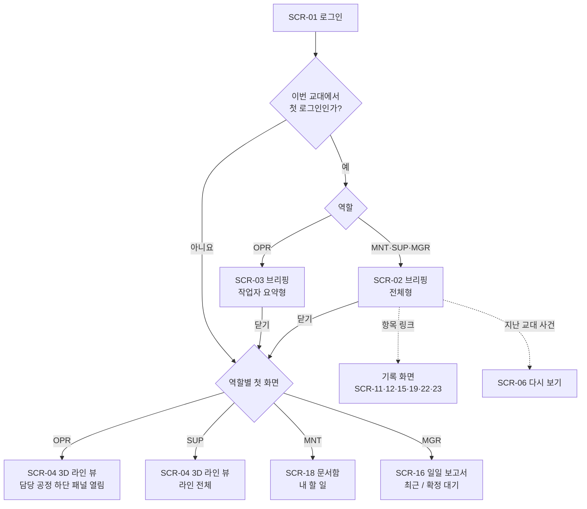
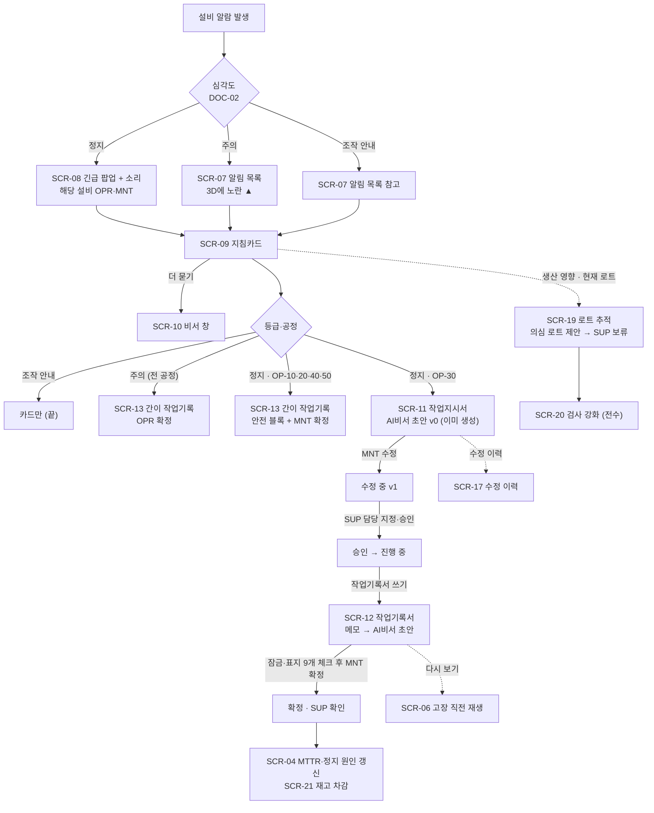
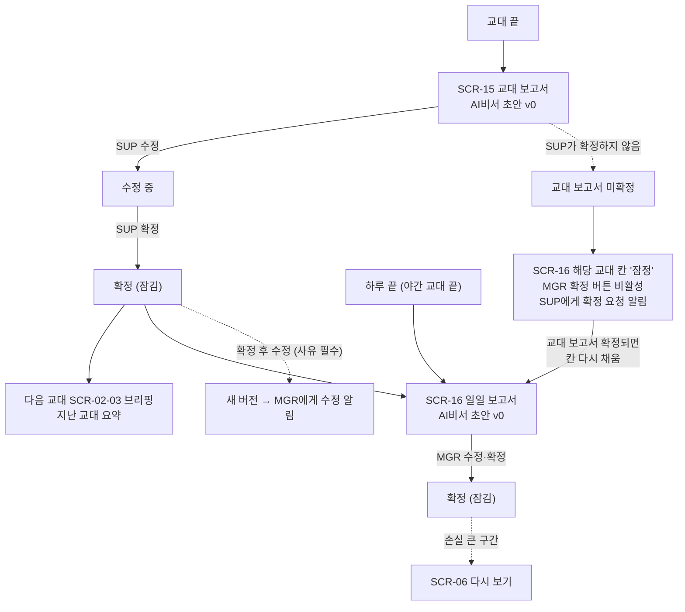

# AI 운영 비서 기반 자동차 부품 절삭가공 라인 운영 관리 플랫폼 — UI 설계서

> **이전 버전입니다.** 최종본: [UI설계서_최종본.md](UI설계서_최종본.md)

| 항목 | 내용 |
|---|---|
| 문서명 | UI 설계서 |
| 버전 | **v1** |
| 날짜 | 2026-10-05 |
| 상태 | **초안 — 기술 회의(2026-10-06) 뒤 글자 크기·장치·성능 값 확정** |
| 근거 문서 | [요구사항정의서_v1.md](요구사항정의서_v1.md) (요구사항 ID 277개, 같은 날 맞춤 뒤), [기획서_v4.md](기획서_v4.md) 3.2~3.3·4장·5장·6.1~6.2·9장·13장·15장·19장, [가상데이터설계서_v3.md](가상데이터설계서_v3.md) 15장, [가상사내문서/](가상사내문서/) DOC-02·05·06·07, [00_용어집.md](가상사내문서/00_용어집.md), `docs/production/화면_예시/` (HMI 지침·화면 예시) |
| 다음 문서 | 논리 ERD (같이 진행), API 명세서, 테스트 계획·요구사항 추적표 (기획서 18장) |
| 기술 | **정하지 않는다.** 화면 프레임워크 이름은 쓰지 않는다. 3D는 기획서 6.2의 팀원 시안(three.js, 단순한 도형, 호버 기능 제거) 수준으로만 적는다 |

> 이 문서는 요구사항 정의서의 요구사항을 **화면 하나하나의 요소**에 붙인 것이다. 화면 요소마다 요구사항 ID를 적는다. 요구사항 정의서가 "UI 설계에서 정한다"고 넘긴 [선택 필요] 9개는 9장에서 근거와 함께 정했다. 근거 문서가 없는 것은 **[제안]** 으로 정하고 이유를 적었다.

**표시 규칙:** **[실제]** 공개 문서·데이터 그대로 / **[가상]** 팀이 정한 값 / **[참고]** 다른 회사·산업 값의 모양만 빌림 / **[제안]** 팀 확정 전 제안 / **[선택 필요]** 아직 정하지 않음 (뒤에 정할 곳을 적음).

**와이어프레임 안의 숫자**는 기획서 15장·DOC-07 계산 예에 나온 **가상 예시 값**이다 (예: 지난 교대 84개, VF2-01 정지 48분 → 약 7개 손실). 화면의 실제 숫자는 프로그램이 DOC-07 식으로 계산한다.

---

## 목차

1. [목적과 범위](#1-목적과-범위)
2. [공통 규칙](#2-공통-규칙)
3. [화면 목록](#3-화면-목록)
4. [화면 흐름도](#4-화면-흐름도)
5. [화면별 상세](#5-화면별-상세)
6. [공통 부품](#6-공통-부품)
7. [시연 시나리오 화면 순서표](#7-시연-시나리오-화면-순서표)
8. [요구사항 ↔ 화면 추적표](#8-요구사항--화면-추적표)
9. [UI 설계로 넘어온 [선택 필요] 결정표](#9-ui-설계로-넘어온-선택-필요-결정표)
10. [남은 [선택 필요: 기술 회의]](#10-남은-선택-필요-기술-회의)
11. [개정 기록](#11-개정-기록)

---

## 1. 목적과 범위

### 1.1 목적

| 항목 | 내용 |
|---|---|
| 왜 만드나 | 프론트엔드 담당이 화면을 만들고, 백엔드·AI 비서 담당이 "어느 화면에 무엇이 나오는지"를 같은 그림으로 보게 한다 (기획서 18장 2번) |
| 누가 보나 | 팀 5명 (특히 프론트엔드 1, 백엔드·DB 1, AI 비서 2), 심사위원 |
| 무엇을 담나 | 공통 규칙(2장), 화면 목록(3장), 화면 흐름(4장), 화면별 와이어프레임·영역·상태·권한(5장), 공통 부품(6장), 시연 순서(7장), 추적표(8장), 결정표(9장) |
| 기준 | 요구사항 ID는 [요구사항정의서_v1.md](요구사항정의서_v1.md) 4장 규칙 그대로 쓴다. 화면 ID는 `SCR-두 자리`로 새로 붙인다. 한 번 붙인 화면 ID는 바꾸지 않는다 |

### 1.2 포함하는 것

| 영역 | 화면 | 근거 |
|---|---|---|
| 공통 | 로그인, 화면 틀(상단 바·메뉴·비서 창·범례), 알림 목록·긴급 알림 팝업 | 요구사항 3장·NFR-USE·NFR-SEC |
| 생산 | 3D 라인 뷰(3D 전경 + 하단 패널 + 지표·실적 패널 + 작업지시 진행 표), 2D 배치도, 다시 보기, 정지 사유 입력·확정, 교대 보고서, 일일 보고서, 로트 추적 | PRD-01~06 |
| 정비 | 지침카드, 작업지시서, 작업기록서, 간이 작업기록, 예방 정비 일정, 공구 수명 | MNT-02~05, ML-01 |
| AI 비서 | 교대 시작 브리핑(전체형·작업자 요약형), 비서 창(질문 답변), 수정 이력, 문서함 | AST-01~03, MNT-01 |
| 품질·재고 | 검사 기록·불량 집계, 재고 | QLT-01, INV-01 |
| 관리 | 사내 문서 보기(출처 열기·개정 승인), 설정(관리자) | FR-MNT-01-09, FR-AST-03-09, NFR-SEC-04 |

### 1.3 하지 않는 것

| 하지 않는 것 | 이유 | 근거 |
|---|---|---|
| 마우스 호버 말풍선 | 현장 터치 화면에서 쓸 수 없다. 모든 정보는 **눌러서** 하단 패널·상세 화면에 보인다 | FR-PRD-01-13, NFR-USE-04, 기획서 8.1 |
| 설비 조작 버튼 (켜기·끄기·설정 바꾸기) | 모니터링형까지만 만든다. 어느 화면에도 설비로 명령을 보내는 버튼이 없다 | FR-AST-COM-11, NFR-SAFE-01, 기획서 6.2 |
| "만약 ~했다면" 시뮬레이션 입력 | 다시 보기는 지난 기록 재생만 한다 | FR-PRD-06-08 |
| 사실적인 3D 모델 | 상자·원기둥 같은 단순한 도형만 쓴다 | FR-PRD-01-01 |
| 자유 SQL 질문 창, 자동 처리·되돌리기 버튼 | 정해진 조회 도구만 쓰고, 수정 이력으로 대신한다 | FR-AST-COM-12·14, 기획서 8.1 |
| 구매·발주 버튼 | 재고는 수량·사용·부족 알림까지 | FR-INV-01-10 |
| 비서가 승인·보류·확정하는 버튼 | "사람만" 등급의 일은 비서가 하지 않는다. 비서 창에서 요청해도 해당 화면으로 안내만 한다 | FR-AST-COM-10, NFR-SAFE-04 |
| 화면 기술(프레임워크·차트 라이브러리) 결정 | 기술 회의(2026-10-06)에서 정한다 | 기획서 18장 4번 |

### 1.4 화면을 쓰는 장치

| 장치 | 누가 | 이 문서의 가정 | 구분 |
|---|---|---|---|
| 현장 터치 화면 (라인 옆) | OPR, SUP | 마우스 없이 손가락으로 누른다. 호버 없음 | 기획서 6.2 [실제 결정] |
| 사무실 PC (마우스) | MNT, SUP, MGR | 같은 화면을 마우스로 누른다. 호버 정보는 여기서도 없다 | [제안] |
| 화면 크기·해상도 | — | 정하지 않았다 | [선택 필요: 기술 회의] |

---

## 2. 공통 규칙

### 2.1 화면 틀 (모든 화면 공통)

```text
┌──────────────────────────────────────────────────────────────────────────────────
│ [1][≡ 메뉴]  [2] 화면 이름      [3] 주간 08:00~17:00 · 10:42     [4] 반장(SUP) 김○○
│              [5] [🔔 미처리 3]  [6] [비서]   [7] [화면 설정]   (시연 모드) [8] [역할 바꿔 보기]
├──────────────────────────────────────────────────────────────────────────────────
│ [9] 알림 띠 (긴급 알림·폭주·연결 끊김이 있을 때만 나타남)
├──────────────────────────────────────────────────────────────────────────────────
│
│ [10] 본문 — 화면마다 다름 (5장)
│                                                 ┊ [11] 비서 창 (SCR-10)
│                                                 ┊      [비서]를 누르면 오른쪽에 열림
│                                                 ┊      닫아도 대화는 남음
│
├──────────────────────────────────────────────────────────────────────────────────
│ [12] 범례  가공 │ 대기 │ 🔧준비 │ ▨정비 │ ⚠고장 │ ⛔막힘 │ ▲주의 알람 │ 재공 주황 │ 병목
│            알림: ⚠긴급 │ ▲주의 │ ⓘ참고                               [13] 가상 운영 데이터
└──────────────────────────────────────────────────────────────────────────────────
```

| 번호 | 요소 | 내용·데이터 | 동작 | 요구사항 ID |
|---|---|---|---|---|
| 1 | 메뉴 버튼 | 역할별 메뉴 (2.2) | 누르면 왼쪽 메뉴가 열림 | NFR-USE-08, NFR-SEC-03 |
| 2 | 화면 이름 | "3D 라인 뷰" 등 메뉴 이름 그대로 | — | FR-PRD-01-01 |
| 3 | 교대·시각 | 지금 교대(주간 08:00~17:00 / 야간 20:00~05:00, DOC-07 4.1), 지금 시각. 시연 모드면 "시간 ×60" 같은 배속 표시 | — | NFR-DATA-10 |
| 4 | 사용자·역할 | 이름 + 역할 한국어 이름 + 코드 | 누르면 로그아웃 | NFR-SEC-01 |
| 5 | 알림 종 | 처리 안 된 알림 수 (긴급이 있으면 ⚠ 함께) | 누르면 알림 목록(SCR-07) | FR-AST-02-02, FR-AST-02-13 |
| 6 | 비서 버튼 | — | 누르면 비서 창(SCR-10)이 오른쪽에 열림 | FR-MNT-01-01, FR-PRD-01-25 |
| 7 | 화면 설정 | 3D 빛 효과 끄기, 소리 켜기·끄기(긴급 알림 소리는 끌 수 없음 [제안]) | 사용자마다 저장 | NFR-PERF-04 |
| 8 | 역할 바꿔 보기 | **시연 모드에서만** 보임. OPR·MNT·SUP·MGR 화면을 바꿔 가며 보여 준다 [제안] | 바꾸면 그 역할의 첫 화면으로 | NFR-DATA-10, NFR-DATA-12 |
| 9 | 알림 띠 | 긴급 알림, 알림 폭주, 연결 끊김, 다시 보기 중 표시 (2.6) | 누르면 해당 화면 | FR-AST-02-12, FR-PRD-06-01 |
| 10 | 본문 | 화면마다 다름 | — | — |
| 11 | 비서 창 | 질문 답변·차트 설명 | SCR-10 | FR-MNT-01-01 |
| 12 | 범례 | 상태 6개 + 주의 알람 ▲ + 재공 주황 + 병목 + 알림 중요도 3개. **모든 화면 아래에 항상** 보이고 접을 수 없다 | — | FR-PRD-01-24, NFR-USE-03 |
| 13 | 가상 표시 | "가상 운영 데이터" 글자 | — | NFR-USE-06, NFR-DATA-08 |

- 왼쪽 메뉴는 평소 접혀 있고, 3D 라인 뷰의 본문을 가리지 않는다 [제안].
- 비서 창은 본문 위에 겹치지 않고 본문 폭을 줄여 오른쪽에 붙는다. 3D 라인 뷰에서 비서 창을 열어도 6대가 한 화면에 보여야 한다 (FR-PRD-01-02) [제안].
- 근거 [참고]: 화면 계층(전체 개요 Level 1 → 영역 Level 2 → 상세)은 고성능 HMI 지침의 구성이다 — "Hierarchy begins with a Level 1 Process Area Overview" (`docs/production/화면_예시/HMI_설계지침/ISA_blog_the_high_performance_HMI.txt`). 이 문서에서 Level 1 = 3D 라인 뷰(SCR-04), Level 2 = 하단 패널·지침카드, 상세 = 문서 화면이다.

### 2.2 내비게이션 메뉴 (역할별)

○ = 메뉴에 보임, 보기 = 메뉴에 보이지만 읽기만, — = 메뉴에 없음 (화면 주소로 들어와도 서버가 막음, NFR-SEC-05).

| 메뉴 | 화면 | OPR | MNT | SUP | MGR | 근거 |
|---|---|---|---|---|---|---|
| 홈 (역할별 첫 화면) | 9장 결정 9 | ○ | ○ | ○ | ○ | NFR-USE-08 |
| 교대 시작 브리핑 | SCR-02 / SCR-03 | 요약형(SCR-03) | ○ | ○ | ○ | 기획서 13.2 "브리핑 받기" |
| 3D 라인 뷰 | SCR-04 (2D: SCR-05) | ○ | ○ | ○ | ○ | 기획서 13.2 |
| 다시 보기 | SCR-06 | ○ | ○ | ○ | ○ | 기획서 13.2 (전원 ○, 요구사항 3.4 각주) |
| 알림 | SCR-07 | ○ | ○ | ○ | ○ | 기획서 3.3 AST-02 전원 |
| 문서함 | SCR-18 | 보기 (일일 보고서 탭 없음) | ○ | ○ | ○ | 기획서 13.1 |
| 정지 사유 | SCR-14 | 입력 | 입력 | **확정** | 보기 | 기획서 13.2 |
| 로트 추적 | SCR-19 | 보기 | 보기 [제안] | ○ | ○ | 기획서 3.3, 13.2 (MNT 보기는 9.2 #2) |
| 검사 기록 | SCR-20 | 측정 입력 | — | ○ | 보기 | 요구사항 FR-QLT-01-01, 3.4 |
| 재고 | SCR-21 | 보기 + 공구 사용 | 사용·입고 | 보기 | 보기 + **설정** | 기획서 13.2 |
| 공구 수명 | SCR-22 | ○ | ○ | 보기 | 보기 | 기획서 3.3, 13.2 |
| 예방 정비 | SCR-23 | — | ○ | 보기 | 보기 | 기획서 13.2 |
| 사내 문서 | SCR-24 | 보기 | 보기 | 보기 | 보기 + **개정 승인** | 기획서 13.1 |
| 설정 | SCR-25 | — | — | — | ○ | 기획서 13.2, NFR-SEC-04 |

- 지침카드(SCR-09), 작업지시서(SCR-11), 작업기록서(SCR-12), 간이 작업기록(SCR-13), 교대·일일 보고서(SCR-15·16), 수정 이력(SCR-17)은 메뉴가 아니라 **알림·하단 패널·문서함·링크**로 들어간다.

### 2.3 상태 색 규칙 C (기획서 6.2 표 그대로)

**상태 색 규칙 (절충안 C, 2026-10-05 결정)** — 정상은 차분하게, 이상만 강한 색 + 아이콘·글자

| 상태 | 표시 | 뜻 |
|---|---|---|
| RUN 가공 중 | 진한 회색 + 옅은 초록 테두리 + "가공" | 정상 |
| IDLE 대기 | 밝은 회색 + "대기" | 정상 (앞 공정 대기, 로트 없음) |
| SETUP 준비 | 회색 + 🔧 + "준비" | 정상 (로트 교체, 공구 교체, 초품 검사) |
| MAINT 계획 정비 | 회색 빗금 + "정비" | 정상 (예방 정비) |
| **DOWN 고장 정지** | **빨강 + ⚠ + "고장"** | 이상 |
| **BLOCKED 막힘** | **주황 + ⛔ + "막힘"** | 이상 (뒤 재공이 한도에 참) |
| 주의 등급 알람 | 설비 위에 노란 ▲ (상태 색은 그대로) | 주의 |
| 재공 20개 초과 / 병목 | 재공 숫자 주황 / 병목 공정 주황 테두리 + "병목" | 흐름 이상 |

출처: 기획서 6.2, DOC-07 2.2. 요구사항 FR-PRD-01-04·05·07·08, NFR-USE-01.

**이 문서가 덧붙인 규칙**

| # | 규칙 | 근거 | 요구사항 ID |
|---|---|---|---|
| 1 | **색만으로 구분하지 않는다.** 모든 상태는 색 + 아이콘·모양(빗금·테두리) + 글자를 함께 쓴다. 흑백으로 바꿔도 글자로 6개 상태를 읽을 수 있다 | [참고] "color alone is not used as the sole discriminator of an important status condition", "Alarm conditions should be shown by a redundantly coded (shape, color, text) element" (ISA 블로그, `HMI_설계지침/ISA_blog_the_high_performance_HMI.txt`). Ignition 지침 "Accommodating Color Blind Viewers", "use of descriptive text with color" | NFR-USE-02 |
| 2 | **빨강·주황·노랑은 이상에만 쓴다.** 버튼·제목·그래프 선 같은 장식에 쓰지 않는다 | [참고] "The same colors designated for alarms must not also be used for other trivial purposes" (같은 ISA 글) | NFR-USE-01 |
| 3 | **범례는 모든 화면 아래에 항상** 있다 (2.1 [12]). 접거나 끌 수 없다 | 기획서 6.2. [참고] MachineMetrics 화면 예시도 같은 회사 그림 안에서 파랑의 뜻이 달라 범례 고정이 필요 (`화면_예시/_출처목록_20261005.md`) | FR-PRD-01-24, NFR-USE-03 |
| 4 | 알림 중요도는 상태 색과 같은 뜻으로 맞춘다: **긴급 = 빨강 + ⚠ + "긴급"**, **주의 = 노랑 + ▲ + "주의"**, **참고 = 회색 + ⓘ + "참고"** [제안] | 긴급 = 정지 등급 알람 = DOWN(빨강 ⚠), 주의 등급 알람 = 노란 ▲ (기획서 4.3·6.2). 같은 모양을 같은 뜻으로 써서 배울 것을 줄인다 | FR-AST-02-01, NFR-USE-02 |
| 5 | 정상 값은 꾸미지 않는다. 지표 카드의 주의 표시는 **기준을 넘었을 때만** 노란 ▲ + "주의" 글자를 붙인다 | [참고] "Bright colors are used to draw attention to abnormal situations, not show normal ones" (ISA 글) | FR-PRD-01-23 |
| 6 | 정비 중(MAINT)과 고장(DOWN)을 헷갈리지 않게, 빗금은 MAINT에만 쓴다 | [참고] Ignition 지침 "dark gray to signify a 'scheduled' state" — 계획된 상태를 회색 계열로 | FR-MNT-04-07 |
| 7 | 바탕은 밝은 회색 계열, 글자는 진한 회색. 색 값(코드)은 기술 회의 뒤 스타일 가이드에서 정한다 | [참고] "A gray background and muted colors minimize screen glare" (ISA 글), Emerson 백서 5쪽 "HMI 설계 철학 문서(색·선·글자 크기 규칙)" | NFR-USE-01, [선택 필요: 기술 회의] |

### 2.4 글자 크기·버튼 크기

근거 문서(`docs/`)에 글자·버튼 크기 **숫자**를 정한 자료가 없다. 그래서 크기의 **순서와 규칙**만 정하고 숫자는 장치를 정한 뒤 잰다.

| 항목 | 규칙 | 구분 | 요구사항 ID |
|---|---|---|---|
| 글자 단계 | 3단계만 쓴다: **큰 숫자**(실적/목표, 상태 글자 "고장"·"막힘", 지침카드 알람 번호) > **본문**(표·문장) > **보조**(출처·시각·[가상] 꼬리표) | [제안] — 단계를 줄이면 화면마다 크기가 흔들리지 않는다 (Emerson 백서 5쪽 "글자 크기 규칙을 문서로"는 [참고]) | NFR-USE-04 |
| 상태 글자 | 3D 전경 위의 "가공·대기·준비·정비·고장·막힘"은 **큰 숫자 단계**로, 3D를 고정 각도로 봤을 때 6대 모두 읽을 수 있어야 한다 | [제안] | FR-PRD-01-02, FR-PRD-01-04 |
| 글자 크기 숫자 | 정하지 않음. 화면 장치 크기를 정한 뒤 현장 거리에서 읽어 보고 정한다 | [선택 필요: 기술 회의] | NFR-USE-04 |
| 누르는 곳 크기 | 버튼·공정 블록·체크칸·알림 카드는 손가락으로 누를 수 있어야 한다. **최소 44 × 44 CSS 픽셀** | [참고] W3C WCAG 2.2 성공 기준 2.5.5 "목표 크기(강화)"의 값. **저장소에 원문이 아직 없다** → `docs/`에 받아 두고 확인한다 | NFR-USE-04 |
| 장갑 | 현장 작업자가 장갑을 끼고 누를 때 위 크기로 충분한지는 실제 장치에서 시험한다 | [선택 필요: 기술 회의 — 장치를 정한 뒤 실제 장치로 시험] | NFR-USE-04 |
| 버튼 사이 간격 | 확정·승인·보류처럼 되돌리기 어려운 버튼은 [취소]·[저장] 버튼과 붙여 두지 않는다 | [제안] — 잘못 누르기 방지 | NFR-REL-02 |
| 되돌리기 어려운 버튼 | **확정·승인·보류·해제·폐기 승인·개정 승인**은 누르면 확인 상자("확정하면 잠깁니다. 고치려면 사유가 필요합니다")가 한 번 더 뜬다 | [제안] — 확정 후 수정은 새 버전 + 사유가 필요하므로(FR-AST-03-06) 실수 확정을 줄인다 | FR-AST-03-05, NFR-REL-02, NFR-REL-03 |
| 끌기 동작 | 꼭 필요한 곳(다시 보기 시간 막대)만 쓴다. 3D 전경은 끌어서 돌리지 않는다 (9장 결정 1) | [제안] — 터치 화면에서 끌기와 누르기가 섞이면 설비를 잘못 누른다 | FR-PRD-01-02, FR-PRD-01-13 |

### 2.5 알림 표시 방식 (긴급·주의·참고, 묶기·폭주)

알릴지 말지와 중요도는 **규칙**이 정한다 (FR-AST-02-14). 화면은 아래처럼 보여 준다.

| 중요도 | 언제 (기획서 4.3, DOC-07 10장) | 화면 표시 | 소리 | 받는 사람 | 요구사항 ID |
|---|---|---|---|---|---|
| **긴급** ⚠ | 정지 등급 알람 | **팝업(SCR-08)** + 알림 띠(2.1 [9]) + 알림 목록 | 남 | 해당 설비 OPR·MNT에게 팝업. 다른 역할은 알림 목록·알림 띠에만 | FR-AST-02-01, FR-AST-02-02 |
| **주의** ▲ | 주의 등급 알람, 반복 알람, 병목 발생·이동, 재공 20개 초과, 목표 미달 위험, 로트 납기 지연 위험, 재고 부족, 기한 넘긴 예방 정비, 공구 수명 90%, 승인 대기 2시간, 관리도 이상 | 알림 목록 + 브리핑에 포함 + 해당 화면 표시(3D의 ▲, 지표 카드의 ▲) | 없음 | 알림 종류마다 정한 역할 (SCR-07 표) | FR-AST-02-03~10은 SCR-07 표 |
| **참고** ⓘ | 조작 안내 알람, 예방 정비 기한 하루 전, 승인 대기 30분, 문서 수정 알림 | 알림 목록, 브리핑·보고서 | 없음 | 해당 역할 | FR-AST-02-08, FR-AST-02-10, FR-AST-03-07 |

**묶기·폭주**

| 경우 | 기준 | 화면 | 요구사항 ID |
|---|---|---|---|
| 짧은 반복 묶기 | 같은 설비·같은 알람이 **1분 안에 3번 이상** | 알림 카드 1장 + "×3 (1분 안)" 꼬리표. 누르면 각 시각이 펼쳐진다 | FR-AST-02-11 |
| 알림 폭주 | 10분에 **10건 넘음** → 폭주, 10분에 **5건 아래** → 풀림 | 알림 띠에 "▲ 알림 폭주 — 최근 10분 N건" + 알림 목록 맨 위에 묶음 카드 1장. 풀리면 띠가 사라지고 카드가 따로 펼쳐진다 | FR-AST-02-12 |
| 폭주 중 긴급 [제안] | — | 묶음 카드 안에서도 **긴급 건수와 가장 최근 긴급 1건은 늘 보이게** 한다. 소리는 묶음당 1번만 난다 | FR-AST-02-02, FR-AST-02-12 |
| 오래된 알림 | **24시간 넘게** 처리 안 된 주의 알림 | 알림 카드에 "24시간 넘음" 꼬리표, 브리핑(SCR-02) 맨 위 | FR-AST-01-06 |

- 폭주 중 긴급을 따로 보이는 까닭 [제안]: 폭주를 묶는 목적은 "알림이 너무 많아 아무도 안 봄"을 막는 것이고(기획서 16장 위험 4), 정지 등급 알람이 묶음에 묻히면 안전 대응이 늦어진다. 기준 숫자(10건·5건)는 그대로 둔다.
- 비서가 꺼져 있어도 알림은 같은 조건에서 뜬다. 문장만 **기본 문구**(예: "VF2-01 알람 992 (정지)")로 나온다 (FR-AST-02-14).

### 2.6 AI비서 초안 표시와 확정 버튼

| 규칙 | 화면 | 요구사항 ID |
|---|---|---|
| 비서가 만든 문서(작업지시서, 작업기록서, 교대 보고서, 일일 보고서, 정지 사유 추천)는 맨 위에 **"AI비서 초안 v0" 띠**를 단다. 상자 테두리는 점선이다 (6.4 부품) | 모든 문서 화면 | FR-AST-COM-07 |
| 비서가 쓴 칸 옆에 **[AI]** 꼬리표, 사람이 고친 칸 옆에 **[수정: 이름 · 시각]** 꼬리표. 간이 작업기록(SCR-13)·예방 정비 실시 기록(SCR-23)은 AI비서 초안이 없어 [수정] 꼬리표만 쓴다 | SCR-11·12·13·14·15·16·23 | FR-AST-03-03 |
| 프로그램이 넣은 숫자 칸은 꼬리표 없이 보통 글자. 비서 문장 속 숫자도 프로그램 값이다 | 같은 곳 | FR-AST-COM-05 |
| 문서 상태 띠: `AI비서 초안(v0) → 수정 중(v1, v2 …) → 확정(잠김)` (작업지시서는 `→ 승인 → 진행 중 → 완료 / 취소`) | 문서 화면 위쪽 | FR-AST-03-05, FR-MNT-03-02 |
| **확정 버튼은 확정 권한이 있는 역할에만** 보인다. 권한은 있지만 조건이 안 맞으면 버튼은 보이되 **비활성 + 이유 글자** (예: "잠금·표지 체크 9개 중 7개 완료") | 2.9 | FR-PRD-02-11, FR-MNT-05-05 |
| 확정되면 🔒 + "확정 · 이름 · 시각"이 띠에 남고 입력 칸이 잠긴다. [확정 후 수정]은 **그 문서의 확정 권한자에게만** 보이고, 누르면 **사유 칸**이 먼저 나온다. 사유가 비면 [저장]이 비활성. 저장하면 새 버전이 바로 확정본(🔒)이 되고 **다시 확정하지 않는다** [제안]. 작업기록서는 SUP 확인 뒤 고치면 확인 표시가 풀린다 | 문서 화면 | FR-AST-03-06, NFR-REL-02 |
| 확정 전 문서는 다른 화면의 집계에 "확정본"으로 쓰지 않는다. 쓸 때는 "잠정" 꼬리표를 붙인다 | SCR-16, SCR-04 | FR-AST-COM-08 |
| 브리핑·지침카드의 비서 문장은 문서가 아니므로 "AI비서 초안" 띠 대신 **"비서 정리"** 꼬리표를 쓴다 (확정 버튼 없음) | SCR-02·03·09 | FR-AST-01-01, FR-AST-COM-09 |

### 2.7 출처 표시 방식

| 대상 | 형식 | 누르면 | 요구사항 ID |
|---|---|---|---|
| 사내 문서 근거 | `사내 고장 대응 매뉴얼 DOC-03 §2.1 ← 원문: Servo Amplifier – Troubleshooting Guide – NGC › Alarm 992` (보조 글자, 칸 바로 아래) | 사내 문서 보기(SCR-24) 해당 절. 원문 열기는 **팀 내부 시연 모드에서만** | FR-MNT-01-07, FR-MNT-01-09, FR-AST-COM-02, NFR-COPY-02 |
| 운영 기록 근거 | 기록 번호 꼬리표 `MR-0912` `MW-0901` `PO-2609-041` `LOT-2609-041-1` | 그 기록 화면 | FR-AST-01-05, FR-AST-COM-02 |
| 고정 서식 | 블록 끝 `출처: DOC-05 안전 작업 기준서 Rev.0 §2·§4·§5` | SCR-24 DOC-05 | FR-MNT-03-07 |
| 값의 성격 | 값 옆 꼬리표 **[가상]** · **[참고]** · **[실제]** (예: 공구 수명 한도 "400구멍 [참고]", 센서 정상 범위 "[참고]") | 누르면 근거 한 줄 | NFR-USE-06, NFR-DATA-09, FR-ML-01-02 |
| 추정치 | 숫자 뒤에 **"(추정)"** 글자 (예: "약 7개 손실(추정)") | — | FR-AST-COM-19, FR-PRD-01-16 |
| 출처 없는 문서 답 | 화면에 내보내지 않는다 (SCR-10 상태 표) | — | FR-AST-COM-02 |

### 2.8 빈 상태·오류·로딩

| 상황 | 화면 표시 | 요구사항 ID |
|---|---|---|
| 목록이 비었음 (인계 사항·브리핑 칸) | 칸을 지우지 않고 **"없음"** 이라고 쓴다 | FR-PRD-02-08, FR-AST-01-02 |
| 계산할 수 없음 | MTTR·MTBF 고장 0건 → **"—"**. Cpk 측정값 50개 미만 → **"계산 중 (n/50)"** | FR-PRD-01-22, FR-QLT-01-08 |
| 과거 기록 없음 | 지침카드 지난 기록 → **"기록 없음"** | FR-MNT-02-10 |
| 문서에 없는 질문 | 비서 답 → **"문서에 없음"** + 찾아본 문서 범위 | FR-MNT-01-06, FR-AST-COM-03 |
| 권장 기능을 줄였을 때 | 그 기능을 재료로 쓰는 칸은 "없음 (기능 제외)"으로 둔다 (예: 브리핑의 공구 수명 칸) | 요구사항 9.2 |
| 불러오는 중 | 칸 모양을 회색 막대로 먼저 그리고 "불러오는 중". 3D가 오래 걸리면 2D 배치도 버튼을 크게 보인다 | NFR-REL-04 |
| 3D를 그릴 수 없음 | 자동으로 **2D 배치도(SCR-05)** 로 바꾸고 알림 띠에 "3D를 열 수 없어 2D로 보여 줍니다" | NFR-REL-04, FR-PRD-01-10 |
| 서버 연결 끊김 | 알림 띠 "연결 끊김 — 마지막 갱신 10:42". 화면 숫자는 그대로 두되 회색 글자로 바꾸고, 확정·승인 버튼은 비활성 | NFR-PERF-02 [선택 필요: 기술 회의 — 다시 연결 방식] |
| 비서 응답 없음 | 비서 창 "비서가 응답하지 않습니다. 화면의 숫자·문서는 그대로 쓸 수 있습니다". 알림·지침카드는 기본 문구와 DOC-03 점검 순서 표로 대신 보인다 | FR-AST-02-14, FR-AST-COM-15 |
| 비서 문장 숫자가 표와 다름 | 처리 방법(다시 쓰기 / 문장 막기)은 [선택 필요: AI 비서 설계]. 화면은 두 경우 모두 그릴 수 있게 "비서 문장 확인 중" 자리와 "문장 없음 — 아래 표를 보세요" 자리를 둔다 | FR-PRD-02-10, NFR-AIQ-04 |
| 권한 없음 | 메뉴·버튼을 숨긴다. 주소로 직접 들어오면 "이 화면을 볼 권한이 없습니다 (역할: 작업자)" | NFR-SEC-02, NFR-SEC-03, NFR-SEC-05 |

### 2.9 권한별 숨김 / 비활성

| 경우 | 처리 | 예 | 요구사항 ID |
|---|---|---|---|
| 그 역할에 **권한이 없는** 메뉴·버튼 | **숨긴다** (요구사항 수용 기준이 "버튼이 없다"로 적혀 있음) | OPR 화면에 [확정](교대 보고서), [보류](로트), [승인](작업지시서)이 없다 | FR-PRD-01-19, FR-PRD-02-11, FR-MNT-03-14, FR-PRD-05-06, FR-PRD-04-09 |
| 권한은 있지만 **조건이 안 맞음** | 보이되 **비활성 + 이유 글자** | SUP [승인] — "담당자를 먼저 지정하세요" / MNT [확정] — "잠금·표지 체크 9개 중 7개" / MGR [확정](일일 보고서) — "교대 보고서 1개 미확정" | FR-MNT-03-14, FR-MNT-05-05, FR-PRD-04-01 |
| **아무도 지울 수 없는** 칸 | 편집 칸이 아니라 🔒 고정 블록으로 그린다. 삭제 버튼 자체가 없다 | 안전 블록 (6.5) | FR-MNT-03-07, NFR-SAFE-02 |
| 서버 확인 | 숨김·비활성은 화면 편의일 뿐이다. 서버도 같은 권한표로 거부한다 | 요청을 직접 보내도 거부 | NFR-SEC-05 |

---

## 3. 화면 목록

| 화면 ID | 화면명 | 주 사용자 | 기능 ID | 요구사항 ID (대표) | 진입 경로 |
|---|---|---|---|---|---|
| SCR-01 | 로그인 | 전원 | — (공통) | NFR-SEC-01, NFR-SEC-07, NFR-USE-08 | 첫 접속 |
| SCR-02 | 교대 시작 브리핑 (전체형) | SUP (조회 MNT·MGR) | AST-01 | FR-AST-01-01~06, NFR-USE-07 | 교대 시작 뒤 첫 로그인 때 자동, 메뉴 "교대 시작 브리핑" |
| SCR-03 | 교대 시작 브리핑 (작업자 요약형) | OPR | AST-01 | FR-AST-01-07 | OPR이 교대 시작 뒤 첫 로그인 때 자동, 메뉴 |
| SCR-04 | 3D 라인 뷰 (3D 전경 + 하단 패널 + 생산 패널) | SUP (조회 전원) | PRD-01, PRD-03 | FR-PRD-01-01~26, FR-PRD-03-01~04 | SUP·OPR 홈, 메뉴 "3D 라인 뷰" |
| SCR-05 | 2D 배치도 (3D 라인 뷰의 2D 전환) | 전원 | PRD-01 | FR-PRD-01-10, NFR-REL-04 | SCR-04 [2D 배치도로], 3D 실패 때 자동 |
| SCR-06 | 다시 보기 | MNT (조회 전원) | PRD-06 | FR-PRD-06-01~09, FR-MNT-05-14 | 메뉴, 작업기록서·브리핑·일일 보고서의 [다시 보기] |
| SCR-07 | 알림 목록 | 전원 | AST-02, AST-03 | FR-AST-02-01~17, FR-AST-03-07 | 상단 바 🔔, 메뉴 "알림" |
| SCR-08 | 긴급 알림 팝업 | 해당 설비 OPR·MNT | AST-02 | FR-AST-02-01·02 | 정지 등급 알람 발생 때 자동 |
| SCR-09 | 지침카드 | OPR (조회 MNT·SUP) | MNT-02 | FR-MNT-02-01~14 | 팝업 [지침카드 열기], 알림 카드, 하단 패널 "현재 알람" |
| SCR-10 | 비서 창 (질문 답변) | 전원 | MNT-01, AST-COM | FR-MNT-01-01~12, FR-AST-COM-01~20 | 상단 바 [비서], 지침카드 [더 묻기] |
| SCR-11 | 정비 작업지시서 | MNT 작성 / SUP 승인 (조회 MGR·OPR) | MNT-03 | FR-MNT-03-01~14 | 지침카드 [작업지시서 보기], 알림(승인 대기), 문서함 |
| SCR-12 | 작업기록서 | MNT (조회 SUP·MGR) | MNT-05 | FR-MNT-05-01~12·14 | 작업지시서 [작업기록서 쓰기], 문서함 |
| SCR-13 | 간이 작업기록 | OPR (주의 등급) / MNT (다른 공정 정지 등급) | MNT-05 | FR-MNT-05-13·15 | 지침카드 [간이 작업기록 쓰기], 알림, 문서함 |
| SCR-14 | 정지 사유 입력·확정 | OPR·MNT 입력 / SUP 확정 | PRD-01 | FR-PRD-01-18·19 | 하단 패널 "사유 미입력 N건", 메뉴 "정지 사유" |
| SCR-15 | 교대 보고서 | SUP (조회 MNT·MGR·OPR) | PRD-02 | FR-PRD-02-01~12 | 교대 끝 알림, 문서함, 브리핑 출처 |
| SCR-16 | 일일 보고서 | MGR (조회 SUP·MNT) | PRD-04 | FR-PRD-04-01~10 | MGR 홈, 하루 끝 알림, 문서함 |
| SCR-17 | 수정 이력 | 전원 (OPR은 자기 문서만) | AST-03 | FR-AST-03-01~09 | 모든 문서 화면의 [수정 이력] |
| SCR-18 | 문서함 | MNT (전원) | AST-03, MNT-03, MNT-05, PRD-02, PRD-04 | FR-MNT-05-11·12, FR-AST-03-01 | MNT 홈, 메뉴 "문서함" |
| SCR-19 | 로트 추적 | SUP (조회 MGR·OPR·MNT) | PRD-05 | FR-PRD-05-01~11 | 메뉴, 하단 패널 "현재 로트", 지침카드 생산 영향 [로트 추적] |
| SCR-20 | 검사 기록·불량 집계 | SUP (측정 입력 OPR, 조회 MGR) | QLT-01 | FR-QLT-01-01~13 | 메뉴, 로트 추적 [검사 기록] |
| SCR-21 | 재고 | MNT 사용·입고 / MGR 기준 (조회 SUP·OPR) | INV-01 | FR-INV-01-01~10 | 메뉴, 재고 부족 알림 |
| SCR-22 | 공구 수명 | OPR (조회 MNT·SUP·MGR) | ML-01 | FR-ML-01-01~08 | 메뉴, 하단 패널 "공구 수명", 공구 수명 알림 |
| SCR-23 | 예방 정비 일정 | MNT (조회 SUP·MGR) | MNT-04 | FR-MNT-04-01~10 | 메뉴, 예방 정비 기한 알림 |
| SCR-24 | 사내 문서 보기 | 전원 (개정 승인 MGR) | MNT-01, AST-03 | FR-MNT-01-09·10, FR-AST-03-09, NFR-COPY-02·03 | 모든 출처 꼬리표, 메뉴 "사내 문서" |
| SCR-25 | 설정 (관리자) | MGR | AST-02, INV-01 (공통) | FR-AST-02-16, FR-INV-01-06, NFR-SEC-04 | MGR 메뉴 "설정" |

**화면 25개.** 기능 17개가 모두 한 화면 이상에 있다 (PRD-03은 SCR-04 안의 작은 표, FR-PRD-03-02).

---

## 4. 화면 흐름도

### 4.1 로그인과 역할별 첫 화면



### 4.2 알람 → 지침카드 → 작업지시서 → 작업기록서



### 4.3 교대 보고서 → 일일 보고서 → 다음 교대 브리핑




---

## 5. 화면별 상세

화면마다 ① 와이어프레임 ② 영역 표 ③ 상태별 표시 ④ 권한을 적는다. 와이어프레임의 `[번호]`는 영역 표의 번호다. 상단 바·범례·가상 표시는 2.1 화면 틀과 같아서 대부분 줄였다. `○○`는 가상 데이터에서 계산될 자리다 (근거 있는 예시 값이 없는 곳).

### SCR-01 로그인

```text
┌──────────────────────────────────────────────────────────────
│  AI 운영 비서 · BRK-A100 절삭가공 라인                 가상 운영 데이터
│
│  [1] 사용자 고르기
│      ( ) 김○○  현장 작업자 OPR · 주간 · OP-30
│      ( ) 이○○  보전 담당자 MNT
│      ( ) 박○○  라인 반장 SUP · 주간
│      ( ) 최○○  공장 관리자 MGR
│  [2] 비밀번호 [__________]        (로그인 방식은 기술 회의 뒤)
│
│  [3] [로그인]
│
│  [4] 시연 모드 ● 켜짐 (시간 ×60)   ← 시연 모드일 때만 보임
└──────────────────────────────────────────────────────────────
```

| 번호 | 요소 | 내용·데이터 | 동작 | 요구사항 ID |
|---|---|---|---|---|
| 1 | 사용자 목록 | 가상 사용자 12명 (OPR 6, MNT 3, SUP 2, MGR 1)과 역할·교대·담당 공정 | 하나를 고름 | NFR-SEC-01 |
| 2 | 로그인 칸 | 비밀번호 또는 다른 방식 | — | NFR-SEC-07 [선택 필요: 기술 회의] |
| 3 | 로그인 버튼 | — | 이번 교대 첫 로그인이면 브리핑(SCR-02·03), 아니면 역할별 첫 화면 (4.1) | NFR-USE-08, FR-AST-01-01 |
| 4 | 시연 모드 표시 | 실시간 모드·배속 (평소 1초 = 1분, 1막 정비 구간 1초 = 3분) | 시연 모드에서만 보임 | NFR-DATA-10 |

| 상태 | 표시 |
|---|---|
| 정상 | 위 그림 |
| 경고 (로그인 실패) | "로그인하지 못했습니다" 한 줄. 몇 번 틀렸는지 등은 기술 회의 뒤 |
| 데이터 없음 | 사용자 목록이 비면 "가상 사용자 데이터가 없습니다 (생성기 확인)" |

권한: 누구나 볼 수 있다. 로그인 뒤 역할이 모든 화면의 권한을 정한다 (NFR-SEC-02, NFR-SEC-03).

---

### SCR-02 교대 시작 브리핑 (전체형)

주 사용자 SUP, 조회 MNT·MGR. **문서가 아니라 화면**이다 (확정·저장 없음, 수정 이력 대상 아님).

```text
┌──────────────────────────────────────────────────────────────────────────────────
│ [≡] 교대 시작 브리핑 — 10월 1일 주간 (08:00~17:00)          [1분 분량]  [닫기 → 홈]
├──────────────────────────────────────────────────────────────────────────────────
│ [1] ▲ 24시간 넘게 처리 안 된 주의 알림 1건
│     ▲ VF2-02 알람 2075 축 윤활유 저장소 비워짐 · 25시간 전 · 간이 작업기록 없음  [열기]
├──────────────────────────────────────────────────────────────────────────────────
│ [2] 지난 교대 요약 (9월 30일 야간)                          출처 [교대 보고서 9/30 야간]
│     생산 84개 (목표 90) · 불량 1개 · VF2-01 정지 2회 48분 (약 7개 손실, 추정)
│     [다시 보기: VF2-01 정지 구간]
├──────────────────────────────────────────────────────────────────────────────────
│ [3] 먼저 챙길 일 — 비서 정리 (숫자는 프로그램 값)
│     ① VF2-02 알람 2075 이번 주 3번째   지난 조치 [MR-0912] [MR-0918]
│     ② 축 윤활유 재고 부족 (안전 재고 이하)                          [재고]
│     ③ T05 공구 수명 92% (사용률)                                    [공구 수명]
├──────────────────────────────────────────────────────────────────────────────────
│ [4] 이번 교대
│     목표 90개 · 작업지시 [PO-2609-041] [PO-2609-042] [PO-2609-043] (이번 교대 로트 3개)
│     예방 정비 2건 · 10:30 VF2-02 예방 정비 90분                     [예방 정비]
├──────────────────────────────────────────────────────────────────────────────────
│ [5] ▸ 전체 목록 보기 (9가지 · 펼치면 1분 분량 밖)
│     미해결 알람 1 · 반복 알람 1 · 예방 정비 기한 2 · 공구 수명 90% 이상 1 · 재고 부족 1
│     승인 대기 문서 없음 · 진행 중 로트 ○ · 진행 중 작업지시 3 · 오늘 목표 90
└──────────────────────────────────────────────────────────────────────────────────
```

| 번호 | 요소 | 내용·데이터 | 동작 | 요구사항 ID |
|---|---|---|---|---|
| 1 | 오래된 알림 | 24시간 넘게 처리 안 된 주의 알림. **항상 맨 위** | [열기] → 알림 카드(SCR-07) | FR-AST-01-06 |
| 2 | 지난 교대 요약 | 지난 교대 보고서의 생산·불량·정지·손실 (확정본. 미확정이면 "잠정") | 출처 → SCR-15, [다시 보기] → SCR-06 그 시각 | FR-AST-01-03, FR-AST-01-05, FR-PRD-06-07, FR-AST-COM-08, FR-AST-COM-19 |
| 3 | 먼저 챙길 일 | 목록은 프로그램이 모으고, 비서가 **가장 먼저 챙길 3가지**를 문장으로 정리. 반복 알람에는 지난 작업기록서 번호 | 꼬리표 → 그 기록 화면 | FR-AST-01-04, FR-AST-01-05, FR-AST-02-03, FR-ML-01-04, FR-AST-COM-05 |
| 4 | 이번 교대 | 오늘 목표, 진행 중 작업지시·로트, 예방 정비 일정 | 꼬리표 → SCR-19·23 | FR-AST-01-03, FR-MNT-04-01 |
| 5 | 전체 목록 | 입력 9가지(지난 교대 보고서, 오늘 목표, 진행 중 로트·작업지시, 미해결 알람, 반복 알람, 예방 정비 기한, 공구 수명 90% 이상, 재고 부족, 승인 대기 문서). 기본은 접힘 | 펼치기 | FR-AST-01-02 |
| — | 출처 칸 | 각 줄 끝의 기록 번호 꼬리표가 출처 칸이다 | — | FR-AST-01-03, FR-AST-COM-02 |
| — | 1분 분량 | [1]~[4]만으로 1분 안에 읽힌다 (재는 법: 9장 결정 8) | — | NFR-USE-07 |

| 상태 | 표시 |
|---|---|
| 정상 | 위 그림. 교대 시작 시각 뒤 첫 로그인 때 자동으로 열린다 |
| 경고 | [1]이 있으면 ▲ 줄이 맨 위. 지난 교대 보고서가 확정 전이면 [2] 제목 옆에 "잠정 (교대 보고서 미확정)" |
| 데이터 없음 | 칸은 남기고 "없음" (예: "승인 대기 문서 없음"). 권장 기능을 줄였으면 "공구 수명: 없음 (기능 제외)" |
| 비서 응답 없음 | [3]을 문장 대신 프로그램 목록(우선순위: 오래된 알림 → 정지 등급 미해결 → 주의) 위 3줄로 보인다 [제안] |

권한: SUP·MNT·MGR 전체형. OPR은 SCR-03 (FR-AST-01-07). 수정·확정 버튼 없음 (FR-AST-01-01).

---

### SCR-03 교대 시작 브리핑 (작업자 요약형)

주 사용자 OPR. 범위는 9장 결정 3.

```text
┌──────────────────────────────────────────────────────────────────────────
│ [≡] 교대 시작 브리핑 — 10월 1일 주간 · 내 공정 OP-30         [닫기 → 3D 라인 뷰]
├──────────────────────────────────────────────────────────────────────────
│ [1] 🔒 잠금·표지 중인 설비   없음
│ [2] 지난 교대  생산 84개 (목표 90)
│ [3] 내 공정 알람 (처리 안 됨)
│     ▲ VF2-02 알람 2075 축 윤활유 저장소 비워짐            [지침카드]
│ [4] 공구 교체   T05 공구 수명 92% (사용률) — 교체 준비     [공구 수명]
│ [5] 이번 교대   목표 90개 · 10:30 VF2-02 예방 정비 90분 (그동안 VF2-02 정지)
└──────────────────────────────────────────────────────────────────────────
```

| 번호 | 요소 | 내용·데이터 | 동작 | 요구사항 ID |
|---|---|---|---|---|
| 1 | 잠금·표지 중인 설비 | 교대가 바뀔 때 잠금 중인 설비 (DOC-05 §2.3 "잠금 중인 설비를 맨 위에"). 없으면 "없음" | — | FR-AST-01-07, FR-PRD-02-09 |
| 2 | 지난 교대 한 줄 | 교대 실적 / 목표만 | — | FR-AST-01-07 |
| 3 | 내 공정 알람 | 담당 공정 설비의 처리 안 된 긴급·주의 알람 (24시간 넘은 것 먼저) | → SCR-09 | FR-AST-01-07, FR-AST-01-06 |
| 4 | 공구 교체 | 담당 공정의 공구 수명 90% 이상 (OP-30 담당만) | → SCR-22 | FR-AST-01-07, FR-AST-02-09, FR-ML-01-04 |
| 5 | 이번 교대 | 교대 목표, 담당 공정 설비의 예방 정비 시각 | — | FR-AST-01-07 |

| 상태 | 표시 |
|---|---|
| 정상 | 위 그림. SCR-02보다 짧다 |
| 경고 | [1]에 설비가 있으면 🔒 + 설비 이름 + "잠금 중 — 전원을 넣지 마세요" 고정 문구 [제안] |
| 데이터 없음 | 줄마다 "없음" |

권한: OPR만. 승인 대기 문서·재고 부족·반복 알람의 지난 조치·손실 수량은 **보이지 않는다** (9장 결정 3). 수정 버튼 없음.

---

### SCR-04 3D 라인 뷰

주 사용자 SUP, 조회 전원. 화면 위쪽 = **3D 라인 전경**, 아래쪽 = **2D 정보 패널** (기획서 6.2). 3D는 팀원 시안(three.js, 단순한 도형)을 바탕으로 **호버 기능을 빼고** 색 규칙 C로 바꾼다. AI는 이 화면에서 쓰지 않는다 (비서 창 차트 설명만).

**① 3D 전경 + 하단 패널 (시연 0:35 장면: VF2-02 예방 정비, OP-20 막힘)**

```text
┌────────────────────────────────────────────────────────────────────────────────────
│ [≡] 3D 라인 뷰       주간 08:00~17:00 · 10:50       반장(SUP) 박○○   [🔔 2]  [비서]
├────────────────────────────────────────────────────────────────────────────────────
│ [1] 3D 라인 전경 (고정 각도)   [2] [2D 배치도로]   [3] 시점 [전체][OP-30][위] [+][−][처음]
│
│        OP-10          OP-20           OP-30                  OP-40         OP-50
│      ┌────────┐     ┌────────┐     ┌────────┐┌────────┐     ┌────────┐    ┌────────┐
│      │ SAW-01 │ [4] │ MIL-01 │ [4] │ VF2-01 ││ VF2-02 │ [4] │ WSH-01 │[4] │ CMM-01 │
│      │  가공  │  6  │ ⛔막힘 │ 30  │  가공  ││  정비  │ 12  │  대기  │ 3  │  가공  │
│      └────────┘ ──▶ └────────┘ ──▶ └────────┘└////////┘ ──▶ └────────┘──▶ └────────┘
│                      (주황)    (재공 주황)  [5] ━━━━━━━━━━━━━━ 병목 (주황 테두리)
│      RUN = 진한 회색 + 옅은 초록 테두리 · MAINT = 회색 빗금 · 숫자는 공정 사이 재공
├─ [6] 하단 패널 — VF2-01 (OP-30) ── 설비를 누르면 그 설비로 바뀜 ─────────────────────
│ 상태          가공 (RUN) · 12분째            현재 로트   [LOT-2609-041-1] (PO-2609-041)
│ 오늘 실적/목표 OP-30 공정 ○○ / 90 (2대 합)   현재 알람   없음
│ 오늘 정지     ○○분 · 약 ○개 손실(추정)       정지 사유 미입력  0건  [정지 사유]
│ ── OP-30만 ──────────────────────────────────────────────────────────────────────
│ 센서 추세 (최근 60분 · 띠 = 정상 범위 [참고] · 알람 기준선 없음)
│   주축 부하 %          ▁▂▃▂▂▃▂▂▃▂   띠 0~185
│   주축 모터 온도 ℃     ▃▃▃▄▄▄▄▄▄▄   띠 28~42
│   공기 압력 psi (bar)  ▅▅▅▅▅▅▅▅▅▅   띠 100~110 (약 6.9~7.6 bar)
│ 공구 수명 (사용률)  T05 M6 탭 92% ▲ · 엔드밀 ○○% · 드릴 ○○%            [공구 수명]
│ 진행 중 작업지시서  없음
└────────────────────────────────────────────────────────────────────────────────────
```

**② 생산 패널 (하단 패널 아래, 스크롤 없이 보이는 것이 목표 [제안])**

```text
├─ [7] 목표 대비 실적 (라인 · 이번 교대) ─────────┬─ [8] 지표 카드 (VF2-01 · 이번 교대) ──
│  목표 90 ┄┄┄┄┄┄┄┄┄┄┄┄┄┄┄┄┄┄┄┄┄┄┄┄┄┄┄┄          │ 가동률 A 70.0%   성능 E 95.8%
│  실적  ▁▂▃▄▅▆▆ ┈┈┈┈┈┈┈┈┈┈┈ 예측 88개           │ 양품률 97.8%     OEE 65.6%
│  지금 40개 (240분 지남) · 최근 1시간 12개        │ MTTR (30일) ○○분  MTBF (30일) ○○시간
│  "이 속도면 목표보다 2개 부족" (추정)            │ 라인 OEE (OP-30 2대 합) ○○%
│  [9] 손실  고장 손실 약 ○개(추정) │ 속도 손실 약 ○개(추정)   ← 따로 보임
├─ [10] 정지 원인 순위 (오늘, 시간 긴 순) ─────────┼─ [11] 작업지시 진행 (작은 표) ───────────
│  1  VF2-01  F01 서보·앰프   ○○분  약 ○개(추정) │ 작업지시    목표 완료 불량 로트  공정  납기  상태
│  2  MIL-01  M03 뒤 공정 막힘 ○○분 (흐름 손실)   │ PO-2609-041  36  ○○  ○  -1,-2 OP-30 ○/○ 생산 중
│  3  VF2-02  P01 예방 정비   90분 (계획 정지)    │ PO-2609-042  ○○  ○○  ○  -1   OP-10 ○/○ ▲지연 위험
└──────────────────────────────────────────────────┴───────────────────────────────────────
```

| 번호 | 요소 | 내용·데이터 | 동작 | 요구사항 ID |
|---|---|---|---|---|
| 1 | 3D 라인 전경 | 6대 설비(SAW-01, MIL-01, VF2-01, VF2-02, WSH-01, CMM-01)를 상자·원기둥으로 OP-10 → 50 순서로. 3D 위에는 **상태 표시·재공 수·병목 표시만** 둔다 | 설비를 **누르면** 하단 패널이 그 설비로 바뀐다. 호버 말풍선 없음 | FR-PRD-01-01, FR-PRD-01-11, FR-PRD-01-13, NFR-USE-04 |
| 1a | 상태 표시 | 6개 상태를 색 규칙 C(2.3)대로: 색 + 아이콘·빗금 + 글자. 한 설비는 한 시점에 한 상태 | — | FR-PRD-01-03, FR-PRD-01-04, NFR-USE-01, NFR-USE-02, NFR-DATA-11 |
| 1b | 주의 알람 ▲ | 주의 등급 알람이 떠 있으면 설비 위에 노란 ▲. **상태 색은 그대로** (짧게 멈췄으면 "대기" + ▲) | ▲를 누르면 지침카드(SCR-09) | FR-PRD-01-05 |
| 2 | 2D 전환 버튼 | 버튼 하나로 SCR-05 | 누르면 바로 바뀜, 다시 누르면 3D | FR-PRD-01-10, NFR-REL-04 |
| 3 | 시점·확대 버튼 | 시점 3개(전체 / OP-30 가까이 / 위에서) + 확대 [+][−] + [처음] — **끌어서 돌리기 없음** (9장 결정 1) | 누르면 정해진 시점으로. [처음]은 고정 각도로 | FR-PRD-01-02, NFR-PERF-04 |
| 4 | 재공 수 | 공정 사이 4곳(10→20, 20→30, 30→40, 40→50). **20개 초과면 숫자 주황**, OP-30→40은 경고 없음. 측정 전 온도 맞춤 중인 부품은 40→50에 세지 않음 | 숫자를 누르면 최근 재공 추세(하단 패널) | FR-PRD-01-06, FR-PRD-01-07 |
| 5 | 병목 표시 | 병목 공정에 주황 테두리 + "병목" 글자. 판단은 프로그램(DOC-07 7.3). 병목이 바뀌면 표시가 옮겨 간다 | "병목"을 누르면 원인 번호(①~④ 또는 고장)·시작 시각 | FR-PRD-01-08, FR-PRD-01-09 |
| 6 | 하단 패널 | **모든 공정:** 상태(지속 시간), 오늘 실적/목표, 현재 로트, 현재 알람, 오늘 정지 시간·손실 수량(추정). **OP-30만:** 센서 3개 추세, 공구 수명, 진행 중 작업지시서. 처음 열면 SUP는 병목 공정, OPR은 담당 공정 [제안] | 로트 → SCR-19, 알람 → SCR-09, 공구 → SCR-22, 작업지시서 → SCR-11, [정지 사유] → SCR-14 | FR-PRD-01-12, FR-PRD-01-16, FR-AST-COM-19 |
| 6a | 실적/목표 | 공정 단위로 보인다 (OP-30은 2대 합). 목표는 교대 목표 90개 (DOC-07 4.1은 라인 목표만 있어 설비별 목표를 따로 만들지 않음) [제안] | — | FR-PRD-01-12, FR-PRD-01-15 |
| 6b | 센서 추세 | 주축 부하, 주축 모터 온도, 공기 압력. 정상 범위 띠 0~185 %, 28~42 ℃, 100~110 psi (약 6.9~7.6 bar) [참고]. **알람 기준선은 그리지 않는다.** 압력은 psi + bar 괄호 | — | FR-PRD-01-14, FR-AST-COM-06, FR-AST-COM-18, NFR-DATA-09 |
| 6c | 공구 수명 | "공구 수명 N%" = 사용률. 90% 이상이면 ▲ | → SCR-22 | FR-ML-01-03, FR-AST-02-09 |
| 7 | 목표 대비 실적 | 교대 목표 90 선, 시간대별 실적 곡선, 예측 점선. 예측 = 현재 실적 + 최근 1시간 속도 × 남은 시간 (시작 1시간 안은 평균 속도). "이 속도면 목표보다 N개 부족"(추정). 예측이 81개 미만이면 ▲ 주의 | 곡선을 누르면 그 시각 값 | FR-PRD-01-15, FR-AST-02-04, FR-AST-COM-05, FR-AST-COM-19 |
| 8 | 지표 카드 | 가동률 A, 성능 E, 양품률 QBR, OEE, MTTR(30일), MTBF(30일), 라인 OEE(OP-30 2대 합). 고장 0건이면 "—". 기준을 넘으면 ▲ "주의": 가동률 60% 미만·OEE 59% 미만(OP-30 2대·라인 OEE만), MTTR 120분 초과. **병목 아닌 공정에는 가동률·OEE 주의 없음** | 카드를 누르면 계산식과 값 (DOC-07 6.2) | FR-PRD-01-20, FR-PRD-01-21, FR-PRD-01-22, FR-PRD-01-23, NFR-DATA-06 |
| 8a | 지표 갱신 | 작업기록서가 확정되면 MTTR·정지 원인이 다시 계산되어 카드가 바뀐다. 바뀐 카드는 잠깐 테두리 강조 [제안] | — | FR-PRD-01-26, FR-MNT-05-10 |
| 9 | 손실 | 고장 손실 수량과 속도 손실 수량을 **따로** 두 칸. 둘 다 "(추정)" | 누르면 계산 근거(정지 시간 ÷ 기준 사이클, 병목 구간) | FR-PRD-01-16, FR-AST-COM-19 |
| 10 | 정지 원인 순위 | 오늘 정지 원인을 시간 긴 순으로, 정지 사유 코드와 손실 수량(추정). 계획 정지(P 그룹)는 "계획 정지", 흐름(M 그룹)은 "흐름 손실"로 글자 구분 | 줄을 누르면 그 정지 구간 (SCR-14) | FR-PRD-01-17, FR-PRD-01-18 |
| 11 | 작업지시 진행 표 | 생산 작업지시별 목표·완료·불량 수량, 나뉜 로트, 현재 공정, 납기, 지연 여부("지연" / "▲ 지연 위험", 9장 결정 6), 상태(대기 → 생산 중 → 완료 / 취소). 취소된 작업지시는 이미 투입한 로트만 보인다 (로트 수량 합 ≤ 작업지시 수량). **별도 화면이 아니라 이 화면 안의 작은 표** | 작업지시 → 로트 목록, 로트 → SCR-19 | FR-PRD-03-01, FR-PRD-03-02, FR-PRD-03-03, FR-PRD-03-04 |
| — | 범례 | 화면 아래 항상 (2.1 [12]) | — | FR-PRD-01-24, NFR-USE-03 |
| — | 차트 설명 | 비서 창에서 "이 차트 설명해 줘" → 이 화면의 프로그램 숫자로 답 | SCR-10 | FR-PRD-01-25 |

| 상태 | 표시 |
|---|---|
| 정상 | 6대 모두 회색 계열 + 글자. 재공 숫자 기본색. 병목 표시는 기준 병목 OP-30 |
| 경고 | DOWN 빨강 ⚠ "고장", BLOCKED 주황 ⛔ "막힘", 주의 알람 노란 ▲, 재공 주황, 병목 주황 테두리, 지표 카드 ▲ "주의". 긴급 알람이면 알림 띠 + 팝업(SCR-08, 해당 설비 OPR·MNT) |
| 데이터 없음 | 설비 상태 기록이 없으면 그 설비를 테두리만 그리고 "기록 없음". MTTR·MTBF "—". 센서 기록 없음 → "센서 기록 없음 (OP-30만 기록)" |
| 3D 실패·느림 | 2D 배치도(SCR-05)로 자동 전환 + 알림 띠. 빛 효과는 [화면 설정]에서 끈다 |

권한: 보기는 전원 (기획서 13.2). 이 화면에는 **설비 조작 버튼이 없다** (FR-AST-COM-11, NFR-SAFE-01). 정지 사유 확정은 SCR-14에서 SUP만.

---

### SCR-05 2D 배치도

3D 라인 뷰의 2D 전환. 3D가 느리거나 안 뜰 때, 현장 터치 화면에서 쓴다 (기획서 6.2). **하단 패널·생산 패널([6]~[11])은 SCR-04와 같다.**

```text
┌────────────────────────────────────────────────────────────────────────────────────
│ [≡] 3D 라인 뷰 · 2D 배치도        주간 · 10:50                           [1] [3D로]
├────────────────────────────────────────────────────────────────────────────────────
│ [2]  ┌ OP-10 ─┐      ┌ OP-20 ─┐      ┌ OP-30 ━━━━━━━━━━━━┓      ┌ OP-40 ─┐     ┌ OP-50 ─┐
│      │ SAW-01 │  6   │ MIL-01 │  30  ┃ VF2-01   VF2-02   ┃  12  │ WSH-01 │  3  │ CMM-01 │
│      │  가공  │ ───▶ │ ⛔막힘 │ ───▶ ┃  가공    정비//// ┃ ───▶ │  대기  │ ──▶ │  가공  │
│      └────────┘      └────────┘(주황)┗━━━━━━ 병목 ━━━━━━┛      └────────┘     └────────┘
│                                                                    [3] 선반: 온도 맞춤 ○개
├─ (SCR-04 [6] 하단 패널과 같음) ─────────────────────────────────────────────────────
├─ (SCR-04 [7]~[11] 생산 패널과 같음) ────────────────────────────────────────────────
│ 범례 …                                                              가상 운영 데이터
```

| 번호 | 요소 | 내용·데이터 | 동작 | 요구사항 ID |
|---|---|---|---|---|
| 1 | 3D로 버튼 | — | 누르면 SCR-04 | FR-PRD-01-10 |
| 2 | 2D 공정 블록 | 3D와 **같은** 상태(색 규칙 C)·재공·병목·주의 ▲. 블록을 누르면 하단 패널이 바뀐다 | 누르기 | FR-PRD-01-10, FR-PRD-01-04, FR-PRD-01-05, FR-PRD-01-06, FR-PRD-01-07, FR-PRD-01-08, FR-PRD-01-13 |
| 3 | 온도 맞춤 선반 | 측정 전 온도 맞춤 중인 부품 수 (재공에 세지 않음을 보이려고 따로 표시) [제안] | — | FR-PRD-01-06 |

| 상태 | 표시 |
|---|---|
| 정상 / 경고 / 데이터 없음 | SCR-04와 같다 |
| 자동 전환으로 열림 | 알림 띠 "3D를 열 수 없어 2D로 보여 줍니다" |

권한: 전원 보기.

---

### SCR-06 다시 보기

주 사용자 MNT, 조회 전원 (기획서 13.2). 지난 시간대를 3D 라인 뷰에서 블랙박스 영상처럼 재생한다. **새 데이터 없음** — 이미 있는 기록을 시각 순서로 다시 그린다.

```text
┌────────────────────────────────────────────────────────────────────────────────────
│ [≡] 다시 보기                                                    [1] [실시간으로 돌아가기]
├────────────────────────────────────────────────────────────────────────────────────
│ [2] ◀ 다시 보기 중 · 10월 1일 10:58:12 (실시간 아님) ▶            ← 알림 띠, 늘 보임
├────────────────────────────────────────────────────────────────────────────────────
│ [3] 3D 라인 전경 (SCR-04와 같은 그림) — VF2-01 ⚠고장 직전
│
├─ [4] 시간 막대 ──────────────────────────────────────────────────────────────────────
│   10:40          10:50             10:58  10:59               11:10
│   ├───────────────┼──────────────────●──────┼───────────────────┤
│               ◆병목 OP-30       ▲108 ▲994 ⚠992              ◆병목 OP-50
│ [5] 속도 [×1] [×20] [×60]    [6] [⏮ 10초 전] [▶ 재생] [⏸]
├─ [7] 하단 패널 (같은 시각) ─────────────────────────────────────────────────────────
│   VF2-01 축 부하 (1초 간격 구간) ▁▁▂▂▃▅▇█   주축 부하 ▁▂▂▃   재공 20→30: 9   알람 994
└────────────────────────────────────────────────────────────────────────────────────
```

| 번호 | 요소 | 내용·데이터 | 동작 | 요구사항 ID |
|---|---|---|---|---|
| 1 | 실시간으로 돌아가기 | — | SCR-04 | FR-PRD-06-01 |
| 2 | 다시 보기 표시 띠 | "다시 보기 중 · 시각 (실시간 아님)". 지금 상태와 헷갈리지 않게 늘 보인다 [제안] | — | FR-PRD-06-01 |
| 3 | 3D 전경 | 고른 시각의 상태 색·재공·병목을 그때 기록대로 | 설비 누르기 → [7] 바뀜 | FR-PRD-06-01, FR-PRD-06-05 |
| 4 | 시간 막대 | 끌어서 이동. 알람(▲·⚠)·병목 시작(◆) 지점 표시 | 끌기, 표시 누르기 → 그 시각으로 | FR-PRD-06-03, FR-PRD-06-04 |
| 5 | 재생 속도 | ×1 · ×20 · ×60 (요구사항 12장 #6: 9장 값) | 누르기 | FR-PRD-06-03, NFR-PERF-07 |
| 6 | 재생 단추 | 10초 전으로, 재생, 멈춤 | — | FR-PRD-06-09 |
| 7 | 하단 패널 | 센서 그래프·재공·알람이 **같은 시각**으로 움직인다. 센서는 평소 1분 평균, 알람·병목 전후 30분은 1초 | — | FR-PRD-06-02, FR-PRD-06-06, NFR-PERF-03 |
| — | 들어오는 곳 | 작업기록서 [다시 보기](고장 직전), 브리핑(지난 교대 사건), 일일 보고서(손실 큰 구간) → 그 시각에서 재생 시작 | — | FR-PRD-06-07, FR-MNT-05-14 |
| — | 하지 않는 것 | 조건 바꾸기 입력 없음 | — | FR-PRD-06-08 |

| 상태 | 표시 |
|---|---|
| 정상 | 위 그림 |
| 경고 | 그때 기록의 경고(빨강·주황·▲)를 그대로 그린다 (지금 경고가 아님을 [2] 띠로 구분) |
| 데이터 없음 | 기록 없는 시각 → "이 시각의 기록이 없습니다". 기능을 줄였을 때(9.2 순서 4)는 **S1 충돌 장면만** 고를 수 있고 나머지는 "없음 (기능 축소)" |

권한: 전원 보기. 편집 버튼 없음.

---

### SCR-07 알림 목록

주 사용자 전원. 알릴지 말지는 규칙, 비서는 문장과 "관련 정보 한 줄"만.

```text
┌────────────────────────────────────────────────────────────────────────────────────
│ [≡] 알림                                                       반장(SUP) 박○○
├────────────────────────────────────────────────────────────────────────────────────
│ [1] [처리 안 됨 ●] [전체]   중요도 [⚠긴급][▲주의][ⓘ참고]   설비 [전체 ▼]   종류 [전체 ▼]
├────────────────────────────────────────────────────────────────────────────────────
│ [2] ▲ 알림 폭주 — 최근 10분 12건 (긴급 1건 포함)                       [펼치기]
│     ⚠ 긴급 · VF2-01 알람 992 전류가 높은 증폭기 · 10:58
├────────────────────────────────────────────────────────────────────────────────────
│ [3] ⚠ 긴급 · 10:58 · VF2-01 · 알람 992 (정지)                              처리 안 됨
│     "VF2-01에서 992 알람. 충돌 의심입니다." — 관련: 바로 앞 108·994 (1분 안)
│     [지침카드] [작업지시서 MW-0○○○]                [4] 처리: 작업기록서 확정 때 자동
├────────────────────────────────────────────────────────────────────────────────────
│     ▲ 주의 · 11:02 · 라인 · 목표 미달 위험                                  처리 안 됨
│     "이 속도면 교대 목표보다 12개 부족합니다 (추정)." — 관련: VF2-01 정지 중
│     [3D 라인 뷰]                                                    [4] [처리]
├────────────────────────────────────────────────────────────────────────────────────
│     ▲ 주의 · 09:12 · VF2-02 · 반복 알람 2075 (7일 안 3번째) ×1           24시간 넘음
│     관련: 지난 조치 [MR-0912] [MR-0918]                       [4] [처리] (메모 필수)
├────────────────────────────────────────────────────────────────────────────────────
│     ⓘ 참고 · 08:05 · 작업지시서 MW-0○○○ 수정됨 (v1)                      읽음
└────────────────────────────────────────────────────────────────────────────────────
```

| 번호 | 요소 | 내용·데이터 | 동작 | 요구사항 ID |
|---|---|---|---|---|
| 1 | 거르기 | 처리 안 됨 / 전체, 중요도, 설비, 종류 | 누르기 | FR-AST-02-13 |
| 2 | 폭주 묶음 카드 | 10분 10건 넘으면 1장으로 묶고, 5건 아래로 내려가면 푼다. 긴급 건수와 최근 긴급 1건은 늘 보임 [제안] | [펼치기] | FR-AST-02-12 |
| 3 | 알림 카드 | 중요도 아이콘·글자, 시각, 설비, 종류, 비서 문장(비서가 꺼지면 기본 문구), 관련 정보 한 줄, 이동 버튼. 짧은 반복은 "×3 (1분 안)" | 버튼 → 해당 화면 | FR-AST-02-01, FR-AST-02-11, FR-AST-02-14, FR-AST-COM-15 |
| 4 | 처리 표시 | 처리 여부·처리 시각·처리한 사람. **누가 처리하나**는 아래 표 (9장 결정 4). [읽음]은 처리가 아니다 | [처리] / 자동 | FR-AST-02-13, NFR-REL-03 |

**알림 종류별 받는 사람과 처리** (조건은 DOC-07 10장, 받는 사람은 요구사항 "사용자" 칸)

| 알림 종류 | 중요도 | 받는 사람 | "처리"가 되는 때 | 요구사항 ID |
|---|---|---|---|---|
| 알람 발생 — 정지 | 긴급 | 해당 설비 OPR·MNT (팝업), SUP·MGR (목록) | OP-30: 작업기록서 확정 / 다른 공정: 간이 작업기록 확정 — **자동** | FR-AST-02-01, FR-AST-02-02 |
| 알람 발생 — 주의 | 주의 | 해당 설비 OPR, MNT, SUP | 간이 작업기록 확정 — **자동** | FR-AST-02-01 |
| 알람 발생 — 조작 안내 | 참고 | 해당 설비 OPR | 받은 OPR 또는 SUP가 [처리] | FR-AST-02-01 |
| 반복 알람 (7일 안 3번 이상) | 주의 | MNT, SUP | MNT 또는 SUP가 [처리] + 조치 계획 한 줄 (필수) | FR-AST-02-03 |
| 목표 미달 위험 (예측 81개 미만) | 주의 | SUP | SUP가 [처리] (메모 선택). 예측이 다시 81개 이상이 되어도 자동 처리하지 않는다 | FR-AST-02-04 |
| 병목 발생·이동 / 재공 20개 초과 | 주의 | SUP | SUP가 [처리] | FR-AST-02-05 |
| 로트 납기 지연 위험 | 주의 | SUP | SUP가 [처리] | FR-AST-02-06 |
| 재고 부족 (재고 ≤ 안전 재고) | 주의 | MNT, MGR | 입고 등록으로 재고가 안전 재고를 넘으면 **자동**, 또는 MGR이 [처리] | FR-AST-02-07, FR-INV-01-07 |
| 예방 정비 기한 (하루 전 / 넘김) | 참고 / 주의 | MNT | 실시 기록 저장 — **자동** | FR-AST-02-08, FR-MNT-04-04 |
| 공구 수명 90% | 주의 | OPR, MNT | 공구 교체 기록 — **자동** | FR-AST-02-09 |
| 승인 대기 (30분 / 2시간) | 참고 / 주의 | SUP | 승인 또는 취소 — **자동** | FR-AST-02-10 |
| 관리도 이상 (3σ 밖) | 주의 | SUP | 다음 부품 측정 기록 저장 — **자동** | FR-QLT-01-10 |
| 문서 수정 (작업지시서 → 담당 보전원, 보고서 → 관리자, 사내 문서 개정 → 관련 역할 전체) | 참고 | 해당 사람 | 받은 사람이 열면 처리 | FR-AST-03-07 |
| 교대 보고서 확정 요청 | 참고 | 해당 교대 SUP | 교대 보고서 확정 — **자동** | FR-AST-02-17, FR-PRD-04-01 |

| 상태 | 표시 |
|---|---|
| 정상 | 처리 안 된 알림이 위, 시각 최근 순 |
| 경고 | 폭주 묶음 카드 맨 위. 24시간 넘은 주의 알림에 "24시간 넘음" 꼬리표 |
| 데이터 없음 | "처리 안 된 알림이 없습니다" |

권한: 자기 역할이 받는 알림만 보인다. [처리] 버튼은 위 표의 사람에게만 보인다 (다른 사람에게는 숨김). 비서는 알림을 처리하지 않는다 (FR-AST-COM-10). 알림 **규칙**을 바꾸는 화면은 MGR의 SCR-25에만 있다 (FR-AST-02-16).

---

### SCR-08 긴급 알림 팝업

정지 등급 알람이 뜨면 **해당 설비의 OPR·MNT 화면**에 팝업과 소리가 난다. 주의·참고는 팝업이 없다.

```text
        ┌──────────────────────────────────────────────────────────┐
        │ [1] ⚠ 긴급 · 정지 등급 알람                    🔊 소리 남 │
        │                                                          │
        │ [2] VF2-01 (OP-30)                                       │
        │     992  전류가 높은 증폭기(AMPLIFIER OVER CURRENT)        │
        │ [3] 바로 앞: 108 → 994 → 992 (연쇄)                       │
        │ [4] 보전 담당자 호출                                       │
        │                                                          │
        │ [5] [지침카드 열기]                 [6] [확인 (소리 끄기)] │
        └──────────────────────────────────────────────────────────┘
```

| 번호 | 요소 | 내용·데이터 | 동작 | 요구사항 ID |
|---|---|---|---|---|
| 1 | 긴급 머리 | 빨강 + ⚠ + "긴급" 글자, 소리 | — | FR-AST-02-01, FR-AST-02-02, NFR-USE-02 |
| 2 | 알람 | 설비, 번호, 한국어 이름(영문 이름) 원문 그대로 | — | FR-MNT-02-03, FR-AST-COM-16 |
| 3 | 연쇄 알람 | 문서 순서와 맞으면 한 줄 | — | FR-MNT-02-14 |
| 4 | 누가 | DOC-02 "누가" 칸 | — | FR-MNT-02-06 |
| 5 | 지침카드 열기 | — | SCR-09 | FR-MNT-02-01 |
| 6 | 확인 | 소리를 끄고 팝업을 닫는다. **처리 표시는 아니다** | 닫기 | FR-AST-02-13 |

| 상태 | 표시 |
|---|---|
| 정상 | 위 그림 |
| 경고 (폭주 중) | 팝업은 1개만 띄우고 "외 긴급 N건"을 붙인다. 소리는 1번 [제안] |
| 데이터 없음 | 알람 코드집에 없는 번호 → "알람 코드집에 없는 알람입니다 (번호 ○○○)" + 보전 담당자 호출 |

권한: 팝업은 해당 설비 OPR·MNT에게만 (FR-AST-02-02). 시연 모드에서는 [역할 바꿔 보기]로 OPR 화면을 보여 준다.

---

### SCR-09 지침카드

주 사용자 OPR, 조회 MNT·SUP. 화면 표시이며 확정하지 않는다. 알람 번호로 알람 코드집을 **규칙으로** 조회한다 (검색 아님).

**① 정지 등급 (OP-30, 시연 1:20 · 992)**

```text
┌────────────────────────────────────────────────────────────────────────────────────
│ [≡] 지침카드 · VF2-01 (OP-30) · 10:58 발생                         가상 운영 데이터
├────────────────────────────────────────────────────────────────────────────────────
│ [1] 알람  992   전류가 높은 증폭기(AMPLIFIER OVER CURRENT)
│     출처: 사내 알람 코드집 DOC-02 §4.1 ← 원문: Haas NGC 알람 목록 › 992
│ [2] 심각도  ⚠ 정지                [3] 누가  보전 담당자 호출
│     출처: DOC-02 §2 [가상]             출처: DOC-02 §3 [가상]
│ [4] 연쇄 알람  108 → 994 → 992   "과부하 알람 뒤에 과전류 알람이 오면 충돌 신호"
│     출처: DOC-03 §2.1 ← 원문: Servo Amplifier – Troubleshooting Guide – NGC
├─ [5] 먼저 할 일 (비서 정리 · DOC-03 §2.1 점검 순서에서 3~5줄) ──────────────────────
│     1. 축을 움직이지 말고 알람 이력을 본다 (앞에 108·994가 있으면 충돌 신호)
│     2. 도어 밖에서 공구·고정구·공작물이 외함과 부딪혔는지 본다
│     3. 외함·주축·공구·고정구에 손상이 있는지 본다
│     4. 공구 상태와 프로그램의 속도·이송을 확인하고 보전 담당자를 부른다
│     출처: 사내 고장 대응 매뉴얼 DOC-03 §2.1 ← 원문: TG0125 Rev F Mechanical Blockage
├─ [6] 안전 ─────────────────────────────────────────────────────────────────────────
│     🔒 (6.5 고정 서식 블록 — 잠금·표지 6+3단계, 고전압 대기, 보호구 — 그대로)
├─ [7] 생산 영향 ──────────────────────────────────────────────────────────────────
│     현재 로트 [LOT-2609-041-1] · 정지 ○○분째 · 약 ○개 손실(추정)
│     의심 로트 제안 있음 → [로트 추적]
├─ [8] 지난 기록 ─────────────────────────────────────────────────────────────────
│     "이번 주 2번째, 지난번 원인: ○○" [MR-0○○○]   (없으면 "기록 없음")
├────────────────────────────────────────────────────────────────────────────────────
│ [9] [더 묻기]   [작업지시서 보기 — AI비서 초안 MW-0○○○ 이미 만들어짐]
└────────────────────────────────────────────────────────────────────────────────────
```

**② 주의 등급 (2075) — 바뀌는 곳만**

```text
│ [2] 심각도  ▲ 주의                 [3] 누가  작업자 조치 가능
├─ [6] 안전 ─────────────────────────────────────────────────────────────────────────
│     🔒 짧은 작업 판단 (DOC-05 §2.4 해당 줄 그대로 · AI 작성 아님)
│     축 윤활유 저장소 보충 (알람 2075) — 보충용 2점 잠금 (E1 + P1)
│     VF2-0x-E1·P1 자물쇠 + 표지 → 압력 해제 링 당김 → 공압 게이지 0 확인 → …
│     출처: DOC-05 안전 작업 기준서 Rev.0 §2.4
│ [9] [더 묻기]   [간이 작업기록 쓰기]
```

**③ 조작 안내 (314) — 바뀌는 곳만**: [2] "ⓘ 조작 안내", [6] "이 알람은 안전 작업 기준서 적용 대상이 아닙니다 (DOC-05 §1)", [9] [더 묻기]만.

**④ 다른 공정 정지 등급 (예: MIL-01 25050)**: [6]에 6.5 고정 서식 블록(고전압 줄 대신 "§3 저장 에너지 확인"), [9] [간이 작업기록 쓰기 — 보전 담당자 확정] (작업지시서 버튼 없음).

| 번호 | 요소 | 내용·데이터 | 동작 | 요구사항 ID |
|---|---|---|---|---|
| — | 자동 표시 | 알람이 뜨면 카드가 자동으로 뜬다. OP-30 알람 15개, 다른 공정 8개, 조작 안내 알람 | — | FR-MNT-02-01, FR-MNT-02-02, NFR-PERF-01 |
| 1 | 알람 칸 | 번호, 한국어 이름, 영문 이름 — 원문 그대로 | 출처 → SCR-24 | FR-MNT-02-03, FR-MNT-02-12, FR-AST-COM-16, NFR-DATA-07 |
| 2 | 심각도 칸 | 정지 / 주의 / 조작 안내 (색 + 아이콘 + 글자) | — | FR-MNT-02-04, FR-MNT-02-12 |
| 3 | 누가 칸 | 작업자 조치 가능 / 보전 담당자 호출 (DOC-02 "누가") | — | FR-MNT-02-06 |
| 4 | 연쇄 알람 | 문서에 적힌 순서와 맞을 때만 문장 + DOC-03 출처 | — | FR-MNT-02-14 |
| 5 | 먼저 할 일 | 비서가 DOC-03 해당 절에서 3~5줄 요약. 줄마다 DOC-03에 근거 | 출처 → SCR-24 | FR-MNT-02-05, FR-MNT-02-12, FR-AST-COM-02, FR-AST-COM-04, FR-AST-COM-17 |
| 6 | 안전 칸 | 정지 등급: DOC-05 §7 블록 **그대로**(6.5). 주의 보충 알람: DOC-05 §2.4 해당 줄 그대로. 비서 문장 안에 잠금 단계를 다시 쓰지 않는다 | 누를 곳 없음 (읽기 전용) | FR-MNT-02-07, FR-MNT-02-08, FR-MNT-02-12, FR-AST-COM-13, NFR-SAFE-02, NFR-SAFE-05 |
| 7 | 생산 영향 | 현재 로트, 정지 시간, 손실 수량(추정). 의심 로트 제안이 있으면 링크 | 로트 → SCR-19 | FR-MNT-02-09, FR-PRD-05-05, FR-AST-COM-19 |
| 8 | 지난 기록 | 같은 알람의 과거 기록 한 줄 또는 "기록 없음" | 기록 번호 → SCR-12 | FR-MNT-02-10 |
| 9 | 버튼 | [더 묻기] → SCR-10 (이 알람이 질문에 미리 들어감). [작업지시서 보기] → SCR-11 (OP-30 정지만). [간이 작업기록 쓰기] → SCR-13 (주의, 다른 공정) | 누르기 | FR-MNT-02-11, FR-MNT-02-13 |

| 상태 | 표시 |
|---|---|
| 정상 | 위 그림 (등급별 ①~④) |
| 경고 | 정지 등급이면 카드 머리 빨강 ⚠. 같은 알람 반복이면 [8]에 "이번 주 N번째" 강조 |
| 데이터 없음 | 지난 기록 "기록 없음". 코드집에 없는 알람 → [1]만 보이고 "알람 코드집에 없음 — 보전 담당자 호출" |
| 비서 응답 없음 | [5]를 요약 대신 DOC-03 점검 순서 표의 작업자(★) 줄을 그대로 보인다 [제안]. 안전 칸은 비서와 상관없이 늘 붙는다 |

권한: 전원 보기 (기획서 13.1 지침카드 "보기"). 고칠 수 있는 칸이 없다.

---

### SCR-10 비서 창 (질문 답변)

주 사용자 전원. 모든 화면 오른쪽에 열리는 창. 문서 질문은 **사내 문서 세트(DOC-01~07)만** 검색하고, 운영 질문은 정해진 조회 도구만 쓴다.

```text
┊ [≡] 비서                                             [닫기]
┊ [1] 지금 화면: 지침카드 · VF2-01 알람 992
┊ [2] 예시  [이 화면 설명해 줘] [992 뜨면 뭐부터 봐?] [어제 야간 VF2-01 몇 번 멈췄어?]
┊ ──────────────────────────────────────────────────────
┊  나: 모터 케이블 저항은 어떻게 재?
┊ [3] 비서:
┊   답   잠금·표지와 고전압 대기를 한 뒤, 축 파워 케이블을 앰프와 모터
┊        양쪽에서 분리하고 선과 선 사이, 선과 접지 사이 저항을 잽니다.
┊        정상은 개방(open)입니다. …
┊   출처 사내 고장 대응 매뉴얼 DOC-03 §2.1 ← 원문: 서보 앰프 안내 › 992   [열기]
┊   관련 이 알람은 이번 주 2번째입니다. [MR-0○○○]
┊ ──────────────────────────────────────────────────────
┊  나: 작업지시서 승인해 줘
┊ [4] 비서: 승인은 반장이 작업지시서 화면에서 합니다. [작업지시서 MW-0○○○ 열기]
┊ ──────────────────────────────────────────────────────
┊ [5] [질문을 입력하세요 ____________________________]  [보내기]
```

| 번호 | 요소 | 내용·데이터 | 동작 | 요구사항 ID |
|---|---|---|---|---|
| 1 | 지금 화면 | 비서 창을 연 화면과 고른 설비·알람 (질문의 배경으로 씀) | — | FR-PRD-01-25 |
| 2 | 예시 질문 | 화면마다 다른 예시 버튼 | 누르면 질문 입력 | FR-MNT-01-01 |
| 3 | 답 상자 | **답 + 출처 + 관련 정보** 세 부분. 알람 번호가 있으면 코드집 정확 일치 항목이 첫 근거. 운영 질문은 조회 도구 값 + 기록 번호. 섞인 질문은 둘 다 | 출처 [열기] → SCR-24 해당 절 (원문 열기는 내부 시연 모드만) | FR-MNT-01-01, FR-MNT-01-02, FR-MNT-01-03, FR-MNT-01-04, FR-MNT-01-05, FR-MNT-01-07, FR-MNT-01-08, FR-MNT-01-09, FR-AST-COM-01, FR-AST-COM-02, FR-AST-COM-04, FR-AST-COM-14, NFR-COPY-02 |
| 3a | 문장 규칙 | 원문 뜻 그대로(알람 이름·숫자), 용어집 표준어, psi(bar), 추정 표시, 가상 값 "가상" | — | FR-AST-COM-06, FR-AST-COM-16, FR-AST-COM-17, FR-AST-COM-18, FR-AST-COM-19, NFR-USE-05 |
| 4 | 사람만 하는 일 안내 | 승인·보류·확정·지정 요청에는 상태를 바꾸지 않고 해당 화면 링크만 | 링크 → 해당 화면 | FR-AST-COM-10, NFR-SAFE-04 |
| 5 | 질문 입력 | 한국어 문장. SQL 입력 칸 없음 | [보내기] | FR-MNT-01-01, FR-AST-COM-14 |

| 상태 | 표시 |
|---|---|
| 정상 | 위 그림 |
| 경고 — 문서에 없음 | 답 "문서에 없음 (찾아본 곳: DOC-01~07)". 찾은 조각 밖의 내용·지어낸 숫자 없음 (예: "254는 몇 ℃에서 떠?" → 기준 온도는 문서에 없음) — FR-MNT-01-06, FR-AST-COM-03, FR-AST-COM-06 |
| 경고 — 불량 원인 질문 | "불량 원인 안내는 근거 문서가 부족해 하지 않습니다" — FR-MNT-01-12, FR-AST-COM-20 |
| 경고 — 설비 조작 요청 | "플랫폼은 설비를 조작하지 않습니다" (FR-AST-COM-11) |
| 출처 없는 답 | 화면에 내보내지 않고 "근거를 찾지 못했습니다" |
| 데이터 없음 | 대화 없음 → 예시 질문만 |
| 응답 없음 | "비서가 응답하지 않습니다" (응답 시간 기준은 NFR-PERF-05 [선택 필요: 기술 회의]) |

권한: 전원 질문 가능 (기획서 13.2). 답의 운영 정보는 그 역할이 볼 수 있는 것만 (예: OPR에게 일일 보고서 내용 없음) [제안] (NFR-SEC-03).

---

### SCR-11 정비 작업지시서

주 사용자 MNT 작성 / SUP 담당 지정·승인, 조회 MGR·OPR. **OP-30 정지 등급 알람에서만** 만들어진다.

```text
┌────────────────────────────────────────────────────────────────────────────────────
│ [≡] 정비 작업지시서 MW-0○○○                                   [수정 이력] [인쇄]
├────────────────────────────────────────────────────────────────────────────────────
│ [1] ┄┄ AI비서 초안 v0 ┄┄   [AI비서 초안] → 수정 중 → 승인 → 진행 중 → 완료  (또는 취소)
│     승인 대기 32분 ⓘ                                   (2시간 넘으면 ▲ 주의)
├─ [2] 자동 칸 ────────────────────────────────────────────────────────────────────
│     번호 MW-0○○○ · 설비 VF2-01 · 알람 992 · 로트 LOT-2609-041-1 · 발생 10:58
├─ [3] 제목·증상 [AI] ───────────────────────────────────────────────────────────
│     제목  VF2-01 알람 992 (충돌 의심) 점검
│     증상  108 → 994 → 992 연쇄 알람 뒤 정지                       출처: 지침카드
├─ [4] 작업 순서 [AI] ──────────────────────────────────────────────────────────
│     1. 잠금·표지 후 볼스크류·리니어 가이드가 손으로 자유롭게 도는지 본다   DOC-03 §2.1-5
│     2. 충돌이 확인되면 볼스크류 커플링 정렬을 본다                         DOC-03 §2.1-6
│     3. 서보 모터 케이블·커넥터 오염을 보고 저항을 잰다                     DOC-03 §2.1-7
│     4. 이송을 낮춰 MDI로 해당 축 움직임 시험                               DOC-03 §2.1-8
├─ [5] 차단 지점·저장 에너지 (설비 정보 DOC-05 §3.3) ──────────────────────────────
│     VF2-01-E1 VF2-01 주 차단기 · VF2-01-P1 VF2-01 공압 주 밸브 · VF2-01-E2 공급 분전반 차단기
│     저장 에너지: 직류 버스(고전압 대기) · Z축 주축 헤드 중력 · 주축 회전 관성 · 공압 잔압 · 열
├─ [6] 안전 (고정 서식 · AI 작성 아님 · 지울 수 없음) ──────────────────────────────
│     🔒 6.5 고정 서식 블록 그대로 (작업 전 6단계 · 고전압 대기 · 보호구 · 작업 후 3단계)
│        출처: DOC-05 안전 작업 기준서 Rev.0 §2·§4·§5
├─ [7] 비슷한 과거 작업 ───────────────────────────────────────────────────────────
│     [MR-0○○○] 알람 992 · VF2-01 · ○월 ○일          (없으면 "기록 없음")
├─ [8] 예상 부품·공구 [AI 제안] ─────────────────────────────────────────────────
│     엔드밀 Ø10 — 지금 재고 ○개 (안전 재고 9)
├─ [9] 담당자 ──────────────────────────────────────────────────────────────────
│     [보전 담당자 고르기 ▼]   ← 반장만
├────────────────────────────────────────────────────────────────────────────────────
│ [10] MNT: [저장]           SUP: [담당자 지정] [승인 — 담당자를 먼저 지정하세요]
│      MGR: [대리 승인] [취소]      MNT (승인 뒤): [작업 시작] [작업기록서 쓰기]
└────────────────────────────────────────────────────────────────────────────────────
```

| 번호 | 요소 | 내용·데이터 | 동작 | 요구사항 ID |
|---|---|---|---|---|
| — | 자동 생성 | OP-30 정지 등급 알람 1건 = 작업지시서 1건이 AI비서 초안으로 이미 있다. 다른 공정 알람에는 없다 | — | FR-MNT-03-01, FR-MNT-02-13 |
| 1 | 상태 띠 | AI비서 초안 → 수정 중 → 승인 → 진행 중 → 완료 / 취소. 승인 전에는 [작업 시작]이 없다. 진행 중 = 담당 MNT [작업 시작], **완료 = 짝 작업기록서(SCR-12)가 확정되면 자동** ([완료] 버튼 없음) [제안]. 승인 대기 시간 (30분 ⓘ, 2시간 ▲) | — | FR-MNT-03-02, FR-AST-COM-07, FR-AST-03-05, FR-AST-02-10 |
| 2 | 자동 칸 | 번호(`MW-0901` 형식), 설비, 알람, 로트, 시각 — 비면 안 됨 | 로트 → SCR-19 | FR-MNT-03-03 |
| 3 | 제목·증상 | 비서가 지침카드에서 씀 [AI] | MNT가 고침 | FR-MNT-03-04, FR-AST-03-03 |
| 4 | 작업 순서 | 비서가 DOC-03 점검 순서를 단계로. 단계마다 DOC-03 절 출처 | 출처 → SCR-24 | FR-MNT-03-05, FR-AST-COM-02 |
| 5 | 차단 지점 | DOC-05 §3에서 프로그램이 가져옴 (차단 지점·저장 에너지) | — | FR-MNT-03-10 |
| 6 | 안전 블록 | KOSHA B-M-25-2026 원문 제목 그대로 6+3단계, 고전압 대기(OP-30만), 보호구 3줄, 블록 끝 "DOC-05 Rev.0". **어느 계정에도 지우기·고치기 없음** | 읽기 전용 | FR-MNT-03-06, FR-MNT-03-07, FR-MNT-03-08, FR-MNT-03-09, FR-AST-COM-13, NFR-SAFE-02, NFR-SAFE-05, NFR-COPY-03 |
| 7 | 비슷한 과거 작업 | 같은 알람의 작업기록서 링크 | → SCR-12 | FR-MNT-03-11 |
| 8 | 예상 부품·공구 | 비서 제안 + 현재 재고 수량 (INV-01을 줄이면 수량 칸 없음) | 품목 → SCR-21 | FR-MNT-03-12 |
| 9 | 담당자 | 반장이 지정. 비서는 지정하지 않는다 | 고르기 (SUP만) | FR-MNT-03-14, FR-AST-COM-10 |
| 10 | 버튼 | MNT [저장] / SUP [담당자 지정][승인] / MGR [대리 승인][취소] / MNT [작업 시작][작업기록서 쓰기]. 승인·취소는 확인 상자 (2.4) | 누르기 | FR-MNT-03-13, FR-MNT-03-14, NFR-REL-03 |
| — | 수정 이력 | v0 → v1 바뀐 칸 강조 | → SCR-17 | FR-AST-03-04 |

| 상태 | 표시 |
|---|---|
| 정상 (AI비서 초안 / 수정 중) | 점선 상자 + "AI비서 초안 v0" 또는 "수정 중 v1". AI 칸에 [AI], 고친 칸에 [수정: 이름·시각] |
| 경고 | 승인 대기 30분 ⓘ / 2시간 ▲. 담당자 비어 있음 → [승인] 비활성 + "담당자를 먼저 지정하세요" |
| 승인 뒤 | 내용 칸 잠김 🔒. 고치려면 [확정 후 수정] + 사유 (FR-AST-03-06) |
| 데이터 없음 | 비슷한 과거 작업 "기록 없음". 재고 기능을 줄였으면 [8]에 수량 없이 품목만 |

권한 (기획서 13.1): OPR 보기 / MNT 내용 작성·수정 / SUP 담당 지정·승인 (내용 칸은 못 고침) / MGR 보기·대리 승인·취소. OPR·MNT에 [승인] 없음. 안전 블록은 모두 읽기 전용.

---

### SCR-12 작업기록서

주 사용자 MNT, 조회 SUP·MGR. 작업지시서를 보고 **실제로 한 일**을 적는다.

```text
┌────────────────────────────────────────────────────────────────────────────────────
│ [≡] 작업기록서 MR-0○○○  ← 작업지시서 [MW-0○○○]          [수정 이력] [다시 보기]
├────────────────────────────────────────────────────────────────────────────────────
│ [1] ┄┄ AI비서 초안 v0 ┄┄   [AI비서 초안] → 수정 중 → 확정 (MNT) → 확인 (SUP)
├─ [2] 자동 칸 ────────────────────────────────────────────────────────────────────
│     작업지시서 MW-0○○○ · 설비 VF2-01 · 알람 992 · 로트 LOT-2609-041-1
├─ [3] 작업자 메모 ────────────────────────────────────────────────────────────────
│     "앰프 쪽 냄새남, 케이블 봤는데 절삭유 묻어있음"                  [비서로 정리]
├─ [4] 원인·조치·사용 부품 [AI — 메모 정리] ──────────────────────────────────────
│     원인   서보 앰프 쪽 냄새, 모터 케이블에 절삭유 묻음 (메모 내용)
│     조치   메모에 조치가 없습니다 — 보전 담당자가 채우세요
│     사용 부품·공구  [재고 품목에서 고르기 ▼]  엔드밀 Ø10 × 1
├─ [5] 수행 단계 체크 (작업지시서의 작업 순서) ────────────────────────────────────
│     ☑ 1  ☑ 2  ☑ 3  ☐ 4
├─ [6] 잠금·표지 체크 (DOC-05 §7 블록 그대로) ─────────────── 9개 중 7개 ───────────
│     ☑ 6.1 기기 등의 운전정지 준비   ☑ 6.2 기기 등의 운전정지   ☑ 6.3 기기 등의 차단
│     ☑ 6.4 잠금장치 또는 표지의 설치 ☑ 6.5 저장 또는 축적된 에너지의 관리 ☑ 6.6 차단 확인
│     ☑ 7.1 기기 등의 점검            ☐ 7.2 작업자 확인          ☐ 7.3 잠금장치·표지의 제거
├─ [7] 시각 ──────────────────────────────────────────────────────────────────────
│     시작 [__:__]  끝 [__:__]  수리 시간 ○○분 (DOWN 구간 ○○분과 비교)
├─ [8] 같은 사례 ─────────────────────────────────────────────────────────────────
│     [알람 992 · VF2-01 작업기록서 ○건]  [비슷한 문장 찾기 (여유가 있으면)]
├────────────────────────────────────────────────────────────────────────────────────
│ [9] MNT: [저장]  [확정 — 잠금·표지 9개 중 7개 (비활성)]        SUP: [확인]
└────────────────────────────────────────────────────────────────────────────────────
```

| 번호 | 요소 | 내용·데이터 | 동작 | 요구사항 ID |
|---|---|---|---|---|
| 1 | 상태 띠 | AI비서 초안 → 수정 중 → 확정(MNT) → 확인(SUP). 작업지시서 1건 = 작업기록서 1건 (`MR-0901` 형식) | — | FR-MNT-05-01, FR-AST-COM-07 |
| 2 | 자동 칸 | 작업지시서 번호, 설비, 알람, 로트 (작업지시서와 같은 값) | — | FR-MNT-05-03 |
| 3 | 메모 | 보전 담당자가 대충 쓴 메모 | [비서로 정리] → [4]를 채움 | FR-MNT-05-02 |
| 4 | 원인·조치·사용 부품 | 비서가 메모를 세 칸으로 정리 [AI]. 메모에 없는 내용은 지어내지 않고 "메모에 없음" | MNT가 고쳐서 확정 | FR-MNT-05-02, FR-MNT-05-06, FR-AST-COM-03 |
| 4a | 사용 부품·공구 | **재고 품목에서만** 고른다 (직접 입력 칸 없음) | 고르기 | FR-MNT-05-07 |
| 5 | 수행 단계 체크 | 작업지시서 작업 순서마다 체크칸 | 체크 | FR-MNT-05-04 |
| 6 | 잠금·표지 체크 | DOC-05 §7 블록의 9칸 그대로 (KOSHA 원문 제목). **9개가 다 체크돼야** [확정] 활성 | 체크 | FR-MNT-05-05, NFR-SAFE-03, NFR-COPY-03 |
| 7 | 시각 | 시작·끝 시각, 수리 시간 | 입력 | FR-MNT-05-08 |
| 8 | 같은 사례 | 알람 번호·설비로 같은 사례 / 비슷한 문장 찾기는 권장 | → SCR-18 (거르기 적용) | FR-MNT-05-11, FR-MNT-05-12 |
| 9 | 버튼 | MNT [저장][확정] / SUP [확인] (확정 뒤에만 보임) | 확정 → 확인 상자 → 잠김 | FR-MNT-05-09, FR-MNT-03-02, NFR-REL-03 |
| — | 확정 뒤 | 짝 작업지시서(SCR-11)가 "완료"로 바뀜. 정비 이력 저장 → MTTR·정지 원인 갱신(SCR-04), 사용 부품 재고 차감(SCR-21). 화면 아래에 "MTTR 갱신됨 · 엔드밀 Ø10 재고 −1" 한 줄 [제안] | — | FR-MNT-05-10, FR-INV-01-02, FR-PRD-01-26 |
| — | 다시 보기 | 고장 직전을 3D로 (알람 시각 10초 전부터 재생) | → SCR-06 | FR-MNT-05-14, FR-PRD-06-07 |

| 상태 | 표시 |
|---|---|
| 정상 | AI비서 초안 → 사람 수정 → 확정 |
| 경고 | 체크 미완 → [확정] 비활성 + "잠금·표지 9개 중 7개". 수리 시간과 DOWN 구간 길이가 크게 다르면 시각 칸 옆 ▲ "알람 정지 시간과 다름" [제안] |
| 데이터 없음 | 메모가 비면 [비서로 정리] 비활성. 같은 사례 0건 → "같은 사례 없음" |

권한 (기획서 13.1): MNT 작성·확정 / SUP 확인 / MGR 보기 / OPR 보기 (작업기록서는 간이 기록만 작성). 확정 후 수정은 새 버전 + 사유.

---

### SCR-13 간이 작업기록

주의 등급 알람(OP-30)과 OP-10·20·40·50 알람의 짧은 기록. 번호 `MR-S-0901` 형식. **AI비서 초안이 없다** — 작업자가 조치를 고르고 확정한다 (v0 = 사람이 처음 저장한 것, FR-MNT-05-13).

```text
┌────────────────────────────────────────────────────────────────────────────────────
│ [≡] 간이 작업기록 MR-S-0○○○                                          [수정 이력]
├────────────────────────────────────────────────────────────────────────────────────
│ [1] 자동 칸  설비 VF2-02 · 알람 2075 축 윤활유 저장소 비워짐 (주의) · 로트 ○○ · 09:12
│ [2] 한 조치 고르기 (DOC-03 §2.11의 조치에서)
│     (●) 축 윤활유 저장소 보충    ( ) 기타 → 메모
│ [3] 사용 소모품  [재고 품목에서 고르기 ▼]  축 윤활유 ○ L
│ [4] 🔒 짧은 작업 판단 (DOC-05 §2.4 그대로) — 보충용 2점 잠금 (E1 + P1)
│     잠금·표지 체크  ☑6.1 ☑6.2 ☑6.3 ☑6.4 ☑6.5 ☑6.6 ☑7.1 ☑7.2 ☑7.3   (9개 중 9개)
│ [5] 메모 [______________________________]
│ [6] OPR·MNT: [확정]
├─ (다른 공정 정지 등급일 때, 예: MIL-01 25050) ─────────────────────────────────────
│ [4'] 🔒 6.5 고정 서식 블록 (고전압 줄 대신 "§3 저장 에너지 확인") + 체크 9칸
│ [6'] OPR: [저장 (입력만)]    MNT: [확정]
└────────────────────────────────────────────────────────────────────────────────────
```

| 번호 | 요소 | 내용·데이터 | 동작 | 요구사항 ID |
|---|---|---|---|---|
| 1 | 자동 칸 | 설비, 알람(이름·심각도), 로트, 시각 | — | FR-MNT-05-13 |
| 2 | 조치 고르기 | 그 알람 DOC-03 절에 적힌 조치를 선택지로 + "기타(메모)" [제안] | 고르기 | FR-MNT-05-13 |
| 3 | 사용 소모품 | 재고 품목에서만 | 고르기 → 확정 때 재고 차감 | FR-MNT-05-07, FR-INV-01-02 |
| 4 | 안전 | 주의 보충 알람: DOC-05 §2.4 해당 줄 그대로 + 잠금·표지 체크 9칸 (보충용 2점 잠금도 6.1~7.3 단계를 그대로 하므로 [제안]). 다른 공정 정지 등급: DOC-05 §7 블록 그대로 | 체크 | FR-MNT-05-13, FR-MNT-05-15, FR-MNT-02-08, NFR-SAFE-02, NFR-SAFE-03, FR-AST-COM-13 |
| 5 | 메모 | 자유 글 | — | FR-MNT-05-13 |
| 6 | 확정 | 주의 등급: OPR(또는 MNT) 확정. **다른 공정 정지 등급: MNT만 확정**, OPR은 입력·저장만 (9장 결정 5) | 확인 상자 → 잠김 | FR-MNT-05-13, NFR-REL-03 |

| 상태 | 표시 |
|---|---|
| 정상 | 위 그림 |
| 경고 | 체크가 덜 됐으면 [확정] 비활성 + 개수 (FR-MNT-05-15) |
| 데이터 없음 | DOC-03에 조치가 없는 알람 → 선택지 없이 "기타(메모)"만 |

권한: 주의 등급 — OPR 작성·확정, MNT 작성·확정 / 다른 공정 정지 등급 — OPR 입력, MNT 확정 / SUP 보기·확인 / MGR 보기.

---

### SCR-14 정지 사유 입력·확정

설비가 RUN이 아닌 시간에 정지 사유 1개를 붙인다. OPR·MNT가 입력하고 SUP가 확정한다. 비서는 **추천**만 한다.

```text
┌────────────────────────────────────────────────────────────────────────────────────
│ [≡] 정지 사유                 [1] [미확정 ●] [전체]   설비 [전체 ▼]   교대 [주간 ▼]
├────────────────────────────────────────────────────────────────────────────────────
│ [2] 설비    구간           길이  상태     사유 (입력)         비서 추천 [AI비서 초안]  입력자
│  ☐ VF2-01  10:58~○○:○○   ○○분  ⚠고장    [F01 서보·앰프 ▼]   F01 서보·앰프          이○○ MNT
│  ☐ VF2-02  09:12~09:27   15분  대기 ▲   [F04 윤활 ▼]       F04 윤활               김○○ OPR
│  ☐ VF2-01  10:21~10:24    3분  대기     [O03 도어 열림 ▼]   O03 도어 열림 (순간 정지)  —
│  ☐ MIL-01  10:35~10:58   23분  ⛔막힘   M03 뒤 공정 막힘 (자동)
├────────────────────────────────────────────────────────────────────────────────────
│ [3] 사유 코드 고르기: 고장 F01~F06 · 자재·흐름 M01~M03 · 준비 S01~S03 · 조작 O01~O03 · 계획 P01~P03
│ [4] OPR·MNT: [저장]        SUP: [고른 줄 확정]
└────────────────────────────────────────────────────────────────────────────────────
```

| 번호 | 요소 | 내용·데이터 | 동작 | 요구사항 ID |
|---|---|---|---|---|
| 1 | 거르기 | 미확정 / 전체, 설비, 교대 | — | FR-PRD-01-19 |
| 2 | 정지 구간 표 | RUN이 아닌 모든 구간에 사유 1칸. 5분 미만은 순간 정지(조작 그룹), 5분 이상은 고장 정지로 자동 분류해 보인다. 주의 등급 알람 짧은 정지는 "대기 ▲" + F 코드 | 줄 누르기 → 그 시각 다시 보기 | FR-PRD-01-18, FR-PRD-01-05 |
| 2a | 비서 추천 | 사유 코드 추천. "AI비서 초안" 꼬리표 | 받아들이기 / 바꾸기 | FR-PRD-01-19, FR-AST-COM-07 |
| 3 | 코드 목록 | DOC-07 5.1 그룹·코드 | — | FR-PRD-01-18 |
| 4 | 버튼 | OPR·MNT [저장] / SUP [고른 줄 확정]. 확정은 사람만 (비서 아님) | 확인 상자 | FR-PRD-01-19, FR-AST-COM-10, NFR-REL-03 |

| 상태 | 표시 |
|---|---|
| 정상 | 위 그림 |
| 경고 | 사유가 빈 구간은 ▲ "사유 미입력" (3D 하단 패널에 건수) |
| 데이터 없음 | "미확정 정지 구간이 없습니다" |

권한 (기획서 13.2): OPR·MNT 입력 / **SUP 확정** / MGR 보기. OPR 계정에 [확정] 없음.

---

### SCR-15 교대 보고서

주 사용자 SUP(해당 교대 반장), 조회 MNT·MGR·OPR. 숫자는 프로그램, 문장은 비서.

```text
┌────────────────────────────────────────────────────────────────────────────────────
│ [≡] 교대 보고서 — 10월 1일 주간                                 [수정 이력] [인쇄]
├────────────────────────────────────────────────────────────────────────────────────
│ [1] ┄┄ AI비서 초안 v0 ┄┄   [AI비서 초안] → 수정 중 → 확정 (반장 박○○)
├─ [2] 생산 ──────────────────────────────────────────────────────────────────────
│     목표 90 · 실적 ○○ · 불량 ○ · 가동률 VF2-01 ○○% / VF2-02 ○○%
├─ [3] 로트 ──────────────────────────────────────────────────────────────────────
│     이 교대에 만든 로트 [LOT-2609-041-1] [LOT-2609-042-1] … · 완료 ○ · 진행 ○ · 보류 1
├─ [4] 정지 상위 3건 ─────────────────────────────────────────────────────────────
│     1 VF2-01 F01 서보·앰프 ○○분 약 7개(추정) · 2 … · 3 …
├─ [5] 병목 ──────────────────────────────────────────────────────────────────────
│     OP-30 ② 1대만 가동 10:30~12:00 · 속도 손실 약 13개(추정) · OP-50 ③ 검사 강화 ○○:○○~
├─ [6] 정비 ──────────────────────────────────────────────────────────────────────
│     [MW-0○○○] → [MR-0○○○] 알람 992 · 조치 ○○ · 간이 기록 [MR-S-0○○○] 2075
├─ [7] 특이 사항 [AI] (3~5문장) ─────────────────────────────────────────────────
│     오전 VF2-02 예방 정비 동안 OP-30이 1대로 돌아 속도 손실이 약 13개 생겼습니다. …
├─ [8] 인계 사항 [AI 문장 + 프로그램 목록] ─────────────────────────────────────────
│     🔒 잠금·표지 중인 설비: 없음                      ← 있으면 늘 맨 위
│     미해결 알람: 없음 · 진행 중 작업지시: [PO-2609-042] · 기한 임박 정비: ○○
│     교체할 공구: T05 (92%) · 재고 부족: 축 윤활유
├────────────────────────────────────────────────────────────────────────────────────
│ [9] SUP: [저장] [확정]       (확정 뒤) [확정 후 수정 — 사유 필수]
└────────────────────────────────────────────────────────────────────────────────────
```

| 번호 | 요소 | 내용·데이터 | 동작 | 요구사항 ID |
|---|---|---|---|---|
| 1 | 상태 띠 | 교대가 끝나면 AI비서 초안이 자동으로 생긴다 (교대 1개 = 보고서 1개) | — | FR-PRD-02-01, FR-AST-COM-07, FR-AST-03-05 |
| 2 | 생산 칸 | 목표·실적·불량·가동률 (3D 라인 뷰 같은 교대 값과 같음). 가동률은 **OP-30 설비별 2개 값** (VF2-01, VF2-02 — 가동률 주의를 거는 범위, DOC-07 10.1) | — | FR-PRD-02-02, FR-PRD-02-12 |
| 3 | 로트 칸 | 만든 로트, 완료·진행·보류 | 로트 → SCR-19 | FR-PRD-02-03 |
| 4 | 정지 상위 3건 | 설비·원인·시간·손실 수량(추정) | — | FR-PRD-02-04, FR-AST-COM-19 |
| 5 | 병목 칸 | 병목 공정·원인·시간, 속도 손실 수량(추정) | — | FR-PRD-02-05 |
| 6 | 정비 칸 | 작업지시서·작업기록서(간이 포함) 번호, 알람, 조치 | 번호 → 문서 | FR-PRD-02-06 |
| 7 | 특이 사항 | 비서 3~5문장 [AI]. 문장 속 숫자는 표와 대조 | SUP가 고침 | FR-PRD-02-07, FR-PRD-02-10, FR-AST-COM-05 |
| 8 | 인계 사항 | 미해결 알람, 진행 중 작업지시, 기한 임박 정비, 교체할 공구, 재고 부족 (없으면 "없음"). **잠금 중인 설비가 있으면 첫 줄** | — | FR-PRD-02-08, FR-PRD-02-09 |
| 9 | 버튼 | 해당 교대 SUP만 [저장][확정]. 확정 → 잠김. 확정 후 수정은 사유 필수 → 관리자에게 수정 알림 | 확인 상자 | FR-PRD-02-11, FR-AST-03-06, FR-AST-03-07, NFR-REL-02 |

| 상태 | 표시 |
|---|---|
| 정상 | 위 그림 |
| 경고 — 숫자 대조 불일치 | [7] 자리에 "비서 문장 확인 중" 또는 "문장 없음 — 위 표를 보세요" (처리 방법은 [선택 필요: AI 비서 설계]) |
| 초안 만드는 중 | 교대가 끝난 뒤 초안이 생기기 전에는 "AI비서 초안을 만드는 중" (걸리는 시간 기준은 NFR-PERF-06 [선택 필요: 기술 회의]) |
| 경고 — 미확정 | 다음 날 일일 보고서가 이 보고서를 기다리면 상태 띠에 ⓘ "일일 보고서가 확정을 기다립니다" + "교대 보고서 확정 요청" 참고 알림 (FR-AST-02-17) |
| 데이터 없음 | 칸마다 "없음" |

권한 (기획서 13.1): SUP 수정·확정 (해당 교대 반장) / MNT·MGR·OPR 보기. SUP가 아닌 계정에 수정·확정 버튼 없음.

---

### SCR-16 일일 보고서

주 사용자 MGR, 조회 SUP·MNT. **OPR 메뉴에는 없다.** 재료는 확정된 교대 보고서 2개 + 하루 집계.

```text
┌────────────────────────────────────────────────────────────────────────────────────
│ [≡] 일일 보고서 — 10월 1일                                      [수정 이력] [인쇄]
├────────────────────────────────────────────────────────────────────────────────────
│ [1] ┄┄ AI비서 초안 v0 ┄┄   재료: 교대 보고서 주간 🔒확정 · 야간 ⓘ미확정 (잠정)   [지난 확정본 보기]
├─ [2] 하루 생산 ─────────────────────────────────────────────────────────────────
│     목표 180 · 실적 ○○ · 불량 ○ · OEE ○○%      주간 ○○ / 야간 ○○ (잠정)
├─ [3] 손실 (둘 다 추정) ─────────────────────────────────────────────────────────
│     고장 손실  ███████          약 7개
│     속도 손실  █████████████    약 13개
│     가장 큰 손실 3건  1 OP-30 1대 가동 90분 [다시 보기] · 2 VF2-01 992 [다시 보기] · 3 …
├─ [4] 알람  정지 ○ · 주의 ○ · 조작 안내 ○ (합 ○) · 반복 알람 VF2-02 2075
├─ [5] 정비  [MW-0○○○] [MR-0○○○] [MR-S-0○○○] · MTTR (30일) ○○분
├─ [6] 로트  완료 ○ · 출하 가능 ○ · 보류 [LOT-2609-041-1]
├─ [7] 재고  오늘 사용 엔드밀 Ø10 1 · 축 윤활유 ○ L · 부족: 축 윤활유
├─ [8] 오늘 가장 중요한 3가지 [AI] ───────────────────────────────────────────────
│     ① … ② … ③ …
├────────────────────────────────────────────────────────────────────────────────────
│ [9] MGR: [저장] [확정 — 교대 보고서 1개 미확정 (비활성)]
└────────────────────────────────────────────────────────────────────────────────────
```

| 번호 | 요소 | 내용·데이터 | 동작 | 요구사항 ID |
|---|---|---|---|---|
| 1 | 상태 띠·재료 | 하루가 끝나면 AI비서 초안이 생긴다. 교대 보고서 2개의 확정 여부를 늘 보인다. 미확정이면 그 교대 값은 원기록 집계를 쓰고 **"잠정"** (9장 결정 2). 잠정일 때 **[지난 확정본 보기]** 로 지난 근무일의 확정 일일 보고서를 연다 | 교대 보고서 → SCR-15, [지난 확정본 보기] → 지난 근무일 SCR-16 | FR-PRD-04-01, FR-PRD-04-10, FR-AST-COM-07, FR-AST-COM-08 |
| 2 | 하루 생산 | 목표 180 / 실적 / 불량 / OEE, 교대별 비교 (하루 실적 = 교대 보고서 2개 합) | — | FR-PRD-04-02 |
| 3 | 손실 | 고장 손실 vs 속도(병목) 손실 막대 2개, 원인별 시간·손실 수량, 가장 큰 3건. "추정" | [다시 보기] → SCR-06 | FR-PRD-04-03, FR-PRD-06-07, FR-AST-COM-19 |
| 4 | 알람 | 등급별 건수(합 = 그날 알람 수), 반복 알람 | — | FR-PRD-04-04 |
| 5 | 정비 | 작업지시서·작업기록서 목록, MTTR | 번호 → 문서 | FR-PRD-04-05 |
| 6 | 로트 | 완료·출하 가능·보류 | → SCR-19 | FR-PRD-04-06 |
| 7 | 재고 | 오늘 사용량, 부족 품목 (재고 ≤ 안전 재고) | → SCR-21 | FR-PRD-04-07 |
| 8 | 비서 요약 | "오늘 가장 중요한 3가지" [AI], 숫자는 프로그램 대조 | MGR이 고침 | FR-PRD-04-08, FR-AST-COM-05 |
| 9 | 버튼 | MGR [저장][확정]. 교대 보고서가 다 확정돼야 [확정] 활성 | 확인 상자 | FR-PRD-04-09, FR-PRD-04-01, NFR-REL-02 |

| 상태 | 표시 |
|---|---|
| 정상 | 교대 보고서 2개 🔒확정 → 모든 칸 확정본 |
| 경고 — 교대 보고서 미확정 | [1] ⓘ "야간 교대 보고서 미확정 — 해당 칸은 잠정". [9] 비활성. 해당 SUP에게 "교대 보고서 확정 요청" 참고 알림 (FR-AST-02-17). 확정되면 그 칸을 프로그램이 다시 채우고 수정 이력에 "교대 보고서 확정으로 갱신"이 남는다 (FR-PRD-04-10) |
| 경고 — 숫자 대조 불일치 | SCR-15와 같음 |
| 데이터 없음 | 칸마다 "없음". INV-01을 줄였으면 [7] "없음 (기능 제외)" |

권한 (기획서 13.1): MGR 수정·확정 / SUP·MNT 보기 / **OPR 접근 없음** (메뉴·문서함 탭 모두 없음).

---

### SCR-17 수정 이력

모든 문서 화면의 [수정 이력] 버튼으로 연다.

```text
┌────────────────────────────────────────────────────────────────────────────────────
│ [≡] 수정 이력 — 정비 작업지시서 MW-0○○○
├─ [1] 버전 목록 ───────────────────────┬─ [2] 바뀐 부분 (v0 → v1) ──────────────────
│  v0  AI비서 초안   10:58  비서          │ 작업 순서 3
│  v1  수정          11:03  이○○ (MNT)    │   − 서보 모터 케이블 상태를 본다            [AI]
│       사유: 저항 측정 단계 추가          │   + 서보 모터 케이블·커넥터 오염을 보고     [수정]
│  ─   승인          11:06  박○○ (SUP)    │     저항을 잰다
│       담당: 이○○                        │ 담당자   (없음) → 이○○                     [수정]
│  [3] 🔒 확정·승인 표시                  │ [4] 범례: [AI] 비서가 쓴 부분 · [수정] 사람
└─────────────────────────────────────────┴─────────────────────────────────────────
```

| 번호 | 요소 | 내용·데이터 | 동작 | 요구사항 ID |
|---|---|---|---|---|
| 1 | 버전 목록 | 문서 번호, 버전(v0 = AI비서 초안. 간이 작업기록·예방 정비 실시 기록은 v0 = 사람이 처음 저장한 것), 수정한 사람, 시각, 사유. 대상: 작업지시서, 작업기록서(간이 포함), 교대 보고서, 일일 보고서, 사내 문서, **예방 정비 실시 기록** (SCR-23) | 버전 누르기 | FR-AST-03-01, FR-AST-03-02, NFR-REL-01 |
| 2 | 바뀐 부분 | 바뀐 칸의 전·후를 강조 (빼기 − / 더하기 +) | 두 버전 고르기 | FR-AST-03-04 |
| 3 | 확정 표시 | 확정·승인·확인한 사람·시각. 확정 뒤 버전은 사유가 꼭 있다 | — | FR-AST-03-05, FR-AST-03-06, NFR-REL-03 |
| 4 | AI·사람 구분 | [AI]와 [수정] 꼬리표로 다르게 보인다 (색만으로 하지 않음) | — | FR-AST-03-03, NFR-USE-02 |

| 상태 | 표시 |
|---|---|
| 정상 | 위 그림 |
| 경고 | — |
| 데이터 없음 | v0만 있으면 "아직 사람이 고치지 않았습니다" |

권한 (기획서 13.1): OPR은 **자기 문서**(자기가 쓴 간이 기록 등)의 이력만, MNT·SUP·MGR은 보기. OPR에게는 다른 사람 문서의 [수정 이력] 버튼이 없다 (FR-AST-03-08). "되돌리기" 버튼은 없다 — 비서가 대신 처리하고 되돌리는 기능 대신 이 수정 이력을 쓴다 (FR-AST-COM-12).

---

### SCR-18 문서함

MNT의 첫 화면. 작업지시서·작업기록서·보고서를 한곳에서 찾는다.

```text
┌────────────────────────────────────────────────────────────────────────────────────
│ [≡] 문서함                                                       보전(MNT) 이○○
├─ [1] 내 할 일 ─────────────────────────────────────────────────────────────────────
│   ▲ 승인됨 · 작업 시작 전  [MW-0○○○] VF2-01 992              → [작업 시작]
│   ⓘ 작성 중 작업기록서     [MR-0○○○] 잠금·표지 9개 중 7개
│   ⓘ 오늘 예방 정비         VF2-02 축 윤활 탱크 점검·보충 (매월) 10:30   [예방 정비]
├─ [2] [작업지시서] [작업기록서] [간이 작업기록] [교대 보고서] [일일 보고서] ─────────────
│ [3] 상태 [AI비서 초안][수정 중][승인][진행 중][확정]   설비 [전체 ▼]   알람 번호 [992__]
│     [비슷한 문장 찾기: "케이블 절삭유" ____] (여유가 있으면)
├─ [4] 목록 ──────────────────────────────────────────────────────────────────────────
│   MR-0○○○  VF2-01 · 992 · ○월 ○일 · 확정 · 원인: ○○
│   MR-0○○○  VF2-02 · 992 · ○월 ○일 · 확정 · 원인: ○○
└────────────────────────────────────────────────────────────────────────────────────
```

| 번호 | 요소 | 내용·데이터 | 동작 | 요구사항 ID |
|---|---|---|---|---|
| 1 | 내 할 일 | 역할별: MNT = 승인된 작업지시서·작성 중 작업기록서·오늘 예방 정비 / SUP = 승인 대기 작업지시서·확인 대기 작업기록서·미확정 교대 보고서 / MGR = 미확정 일일 보고서·개정 승인 대기 [제안] | 줄 → 문서 | NFR-USE-08, FR-AST-02-10 |
| 2 | 문서 종류 탭 | 작업지시서, 작업기록서, 간이 작업기록, 교대 보고서, 일일 보고서 (OPR에게 일일 보고서 탭 없음) | 탭 | FR-AST-03-01, FR-PRD-04-09 |
| 3 | 거르기·찾기 | 상태, 설비, **알람 번호**로 같은 사례 찾기. 비슷한 문장 찾기는 권장 (만들지 않으면 칸 숨김) | 입력 | FR-MNT-05-11, FR-MNT-05-12 |
| 4 | 목록 | 번호·설비·알람·날짜·상태·한 줄 요약 | 줄 → 문서 화면 | FR-AST-03-05 |

| 상태 | 표시 |
|---|---|
| 정상 | 위 그림 |
| 경고 | 승인 대기 2시간 넘음 ▲, 24시간 넘게 처리 안 된 일 ▲ |
| 데이터 없음 | "조건에 맞는 문서가 없습니다", 내 할 일 "없음" |

권한: 탭과 버튼은 문서별 권한(2.2, 기획서 13.1)을 따른다. OPR은 작업지시서·교대 보고서 보기, 자기 간이 작업기록만.

---

### SCR-19 로트 추적

주 사용자 SUP, 조회 MGR·OPR·MNT (OPR·MNT는 보기만, FR-PRD-05-01).

```text
┌────────────────────────────────────────────────────────────────────────────────────
│ [≡] 로트 추적        [1] 로트 [LOT-2609-041-1 ▼]   작업지시 PO-2609-041 · 주간 · 투입 ○○개
├─ [2] 한 줄 이력 ──────────────────────────────────────────────────────────────────
│  MAT-2609-01 ─▶ OP-10 SAW-01 ─▶ OP-20 MIL-01 ─▶ OP-30 VF2-01 ─▶ OP-40 ─▶ OP-50 ─▶ [보류]
│  원자재 로트     08:12~ 김○○     08:40~ ○○○     ⚠992 10:58       ○○:○○   강화(전수)
│                                                   공구 교체 T05
├─ [3] 비서 제안 ──────────────────────────────────────────────────────────────────
│  ┄ 의심 로트 제안 (비서) · 정지 등급 알람 992가 뜬 동안 가공된 로트입니다.
│    제안만으로 상태가 바뀌지 않습니다.                              출처: DOC-06 §4.2
├─ [4] 상태 ────────────────────────────────────────────────────────────────────────
│  생산 중 → 검사 대기 → (판정 대기) → 합격(출하 가능) / 보류 검토 / [보류] → 해제 / 폐기
│  보류 사유: 정지 등급 알람 992 중 가공 (박○○ SUP · 11:05)
├─ [5] 검사 결과  초품 합격 · 강화(전수) 진행 ○/○ · 불합격 ○           [검사 기록]
├─ [6] 관련 로트  같은 원자재 [MAT-2609-01]: ○개 · 같은 설비 VF2-01: ○개 · 같은 교대: ○개
├─ [7] 수량  투입 ○○ · 완료 ○○ (OP-50 양품 + 재작업 양품)
├────────────────────────────────────────────────────────────────────────────────────
│ [8] SUP·MGR: [보류 — 사유 필수] [해제]   SUP: [폐기 제안]   MGR: [폐기 승인]
└────────────────────────────────────────────────────────────────────────────────────
```

| 번호 | 요소 | 내용·데이터 | 동작 | 요구사항 ID |
|---|---|---|---|---|
| 1 | 로트 고르기 | 로트 번호 `LOT-2609-041-1` (작업지시 번호 + 순번), 작업지시, 교대, 투입 수량 | 고르기·찾기 | FR-PRD-05-01, FR-PRD-05-02 |
| 2 | 한 줄 이력 | 원자재 로트 → 공정별 시작·끝·설비·작업자 → 그동안의 알람·공구 교체 → 검사 결과 → 상태 | 칸 누르기 → 그 기록 | FR-PRD-05-01, FR-PRD-05-03 |
| 3 | 의심 로트 제안 | 정지 등급 알람·공구 수명 초과 중 가공된 로트를 비서가 **제안** (점선 상자, 문장만). 알림은 따로 없다 — 여기와 지침카드 [7]에만 보인다 | — | FR-PRD-05-05, FR-AST-COM-10 |
| 4 | 상태 흐름 | 생산 중 → 검사 대기 → (판정 대기: 온도 맞춤 중인 측정 부품이 남음) → 합격 / 보류 → 해제·폐기. 불합격 1개라도 있으면 "보류 검토" 표시 | — | FR-PRD-05-04 |
| 5 | 검사 결과 | 검사 방식과 결과. QLT-01을 줄이면 OP-50 실적의 불량 수량으로 보인다 | → SCR-20 | FR-PRD-05-07, FR-PRD-05-10, FR-QLT-01-05 |
| 6 | 관련 로트 | 같은 원자재 로트·같은 설비·같은 교대의 다른 로트 | → 그 로트 | FR-PRD-05-09 |
| 7 | 수량 | 투입, 완료(마지막 공정 양품 합) | — | FR-PRD-05-11 |
| 8 | 버튼 | [보류](사유 필수)·[해제]: SUP·MGR. [폐기 제안]: SUP → [폐기 승인]: MGR. 보류하면 이 로트와 다음 1~2개 로트가 검사 강화로 바뀐다는 안내 | 확인 상자 | FR-PRD-05-06, FR-PRD-05-07, FR-PRD-05-08, NFR-REL-03, NFR-SAFE-04 |

| 상태 | 표시 |
|---|---|
| 정상 | 위 그림 |
| 경고 | 보류는 🔒 + 진한 글자 "보류"로 표시한다. 주황은 흐름 이상 전용이라 쓰지 않는다 [제안] (9.2 #13). 보류 검토는 ▲ "보류 검토" |
| 데이터 없음 | 로트가 없으면 "로트를 고르세요". 검사 결과가 없으면 "검사 전" |

권한 (기획서 13.2, DOC-06 4.1): 보류·해제 SUP·MGR / 폐기 제안 SUP, 폐기 승인 MGR / OPR·MNT 보기만 (버튼 없음).

---

### SCR-20 검사 기록·불량 집계

주 사용자 SUP, 측정·입력 OPR, 조회 MGR. OP-50 측정 결과.

```text
┌────────────────────────────────────────────────────────────────────────────────────
│ [≡] 검사 기록       [1] 로트 [LOT-2609-041-1 ▼]  검사 방식: 강화 (전수 + 항목 확대) · 사유 보류
│                         OP-50 검사 시간: 평소 약 0.9분/개 → 강화 5.0분/개 (병목이 될 수 있음)
├─ [2] 측정 입력 (OPR) ──────────────────────────────────────────────────────────────
│  순번 항목                       기준            측정값    판정   측정기  측정자 시각  실온
│  1    부싱 압입 구멍 Ø45 H7 ★     +0.025 / 0 mm   [____]    —      CMM-01 김○○  ○○  ○○℃
│  1    전체 길이                   150 ± 0.5       [____]    —
│  …    M6 나사 통과·정지 게이지      통과·정지       [합격 ▼]
├─ [3] 로트 판정  측정 ○/○ · 불합격 0 → (모두 잰 뒤 판정)                 ▲ 보류 검토
├─ [4] 강화 상태  보류 로트 + 다음 2개 로트 (원인: 충돌·정지 등급 알람)
│     보통으로 돌아오기: ☑ 원인 조치 완료 [MR-0○○○]  ☐ 강화 로트 모두 합격   SUP: [확인]
├─ [5] 공정능력 (Cpk, I-MR)  Ø45 H7 (특별 특성, 기준 1.67) 계산 중 (○○/50) · 길이 (1.33) ○.○○
├─ [6] 관리도 (I-MR)  ·  ·  ·  ·  ● ← +3σ 밖 ▲ 다음 부품 바로 측정
├─ [7] 불량 집계  로트별 합격·불합격 · 불량 코드별 수량 (DOC-06 8장) · 추세
└────────────────────────────────────────────────────────────────────────────────────
```

| 번호 | 요소 | 내용·데이터 | 동작 | 요구사항 ID |
|---|---|---|---|---|
| 1 | 로트·검사 방식 | 초품/발췌/강화 + 강화 사유. OP-50 시간(평소 약 0.9분/개, 강화 5.0분/개) | — | FR-QLT-01-01, FR-QLT-01-13 |
| 2 | 측정 입력 | 칸: 로트, 부품 순번, 검사 방식, 항목, 측정값·판정, 측정기, 측정자, 시각, 측정실 온도. 측정 대상 부품은 표시(첫 부품 + 5개마다 1개, 강화면 모두). 측정 안 한 부품은 게이지·육안 합격·불합격만 | 입력 | FR-QLT-01-01, FR-QLT-01-02, FR-QLT-01-03, FR-QLT-01-04, FR-QLT-01-12 |
| 3 | 로트 판정 | 측정 부품을 모두 잰 뒤 판정. 1개라도 불합격 → "보류 검토" + 남은 부품 전수 | — | FR-QLT-01-06 |
| 4 | 강화 상태 | 강화 대상(보류 로트 + 다음 1~2개, 원인으로 개수 결정). 보통으로 돌아오는 두 조건 체크 표시 + 반장 확인 | SUP [확인] (두 조건이 맞을 때만 활성) | FR-QLT-01-05, FR-QLT-01-07 |
| 5 | 공정능력 | I-MR 방식 Cpk. 50개 미만 "계산 중". 기준 특별 1.67, 일반 1.33. 미달이면 ▲ + "전수 측정으로 바뀜" | — | FR-QLT-01-08, FR-QLT-01-09 |
| 6 | 관리도 | 점이 ±3σ 밖이면 ▲ + 반장 주의 알림 | — | FR-QLT-01-10 |
| 7 | 불량 집계 | 로트별 합격·불합격, 불량 코드별, 추세 | — | FR-QLT-01-11 |

| 상태 | 표시 |
|---|---|
| 정상 | 발췌 검사 중 |
| 경고 | 강화 중 띠, 보류 검토 ▲, Cpk 미달 ▲, 관리도 3σ 밖 ▲ |
| 데이터 없음 | Cpk "계산 중 (n/50)", 측정 없음 "측정 전" |

권한: OPR 측정 입력 / SUP 입력·확인 / MGR 보기 / MNT 메뉴 없음 (요구사항 3.4).

---

### SCR-21 재고

주 사용자 MNT(사용·입고) / MGR(안전 재고 설정), 조회 SUP·OPR. **구매·발주 버튼은 없다.**

```text
┌────────────────────────────────────────────────────────────────────────────────────
│ [≡] 재고                    [1] [부족만 ●] [전체]   종류 [공구][소모품][원자재]
├─ [2] 품목 ──────────────────────────────────────────────────────────────────────────
│  품목 번호 [가상] 품목                 단위   지금   안전 재고  상태
│  T-○○      M6 탭                       개     ○      8         
│  T-○○      엔드밀 Ø10                  개     ○      9         
│  C-○○      축 윤활유                   L      ○      4         ▲ 부족
│  C-○○      절삭유 원액 TRIM SC538      L      ○      20        
│  R-○○      6061-T6 봉재                개     ○      200       
├─ [3] 거래 기록 (입고 · 사용 · 조정) ──────────────────────────────────────────────────
│  10:58  사용  엔드밀 Ø10 −1   [MR-0○○○] 작업기록서 확정
│  08:00  사용  봉재 −36        [LOT-2609-041-1] 로트 투입
├────────────────────────────────────────────────────────────────────────────────────
│ [4] MNT: [입고 등록] [실사·조정]   OPR: [공구 사용 기록]   MGR: [안전 재고 설정]
│ [5] 차감 규칙 보기
└────────────────────────────────────────────────────────────────────────────────────
```

| 번호 | 요소 | 내용·데이터 | 동작 | 요구사항 ID |
|---|---|---|---|---|
| 1 | 거르기 | 부족만 / 전체, 종류 | — | FR-INV-01-07 |
| 2 | 품목 표 | 12개 품목(공구 5, 소모품 6, 원자재 1), 품목 번호 [가상], 수량, 안전 재고, **재고 ≤ 안전 재고면 ▲ "부족"** | 줄 → 거래 기록 | FR-INV-01-01, FR-INV-01-07, FR-AST-02-07 |
| 3 | 거래 기록 | 입고·사용·조정 세 종류. 사용은 원인 기록 번호(작업기록서·공구 교체·예방 정비·로트 투입) | 번호 → 그 기록 | FR-INV-01-02, FR-INV-01-08 |
| 4 | 버튼 | MNT [입고 등록][실사·조정] / OPR [공구 사용 기록] (→ SCR-22 교체 기록) / MGR [안전 재고 설정] (→ SCR-25). 발주 버튼 없음. **실사·조정 기록은 MNT** [제안]. 원자재 입고는 원자재 로트 번호·성적서 번호·로트 코드 대조를 함께 남긴다: 대조 전 "입고 검사 대기" → [사용 가능] / [입고 보류] (DOC-06 §7 순서 3·5). 사용 가능이 아닌 로트는 투입 목록에 나오지 않는다 [제안] | 입력 상자 | FR-INV-01-04, FR-INV-01-05, FR-INV-01-06, FR-INV-01-08, FR-INV-01-10 |
| 5 | 차감 규칙 | 품목별 차감 규칙 (공구 교체 1회 = 1개, 페이스밀 인서트 5개 등) | 펼치기 | FR-INV-01-03 |

| 상태 | 표시 |
|---|---|
| 정상 | 위 그림 |
| 경고 | 부족 품목 ▲ (알림과 같은 조건) |
| 데이터 없음 | 거래 기록 없음 → "기록 없음". INV-01을 줄이면 메뉴 자체가 없다 |

권한 (기획서 13.2): OPR 공구 사용 / MNT 사용·입고 / SUP 보기 / MGR 안전 재고 설정. OPR에게 [입고 등록] 없음.

---

### SCR-22 공구 수명

주 사용자 OPR, 조회 MNT·SUP·MGR. OP-30 VF-2 공구 대상.

```text
┌────────────────────────────────────────────────────────────────────────────────────
│ [≡] 공구 수명                     [1] [VF2-01] [VF2-02]
├─ [2] 공구 ────────────────────────────────────────────────────────────────────────────
│  공구          단위            누적 / 한도              사용률            알람   참고값 [3]
│  T05 M6 탭     구멍 수 HOLES   368 / 400 [참고]          ███████████▌ 92% ▲  —      ○○% (참고값)
│  T04 드릴 Ø5.0 구멍 수 HOLES   ○○ / 1,000 [가상]         ○○%                 
│  T03 보링 인서트 구멍 수 HOLES ○○ / 400 [가상]           ○○%
│  T02 엔드밀 Ø10 이송 시간 분   ○○ / 200 [참고]           ○○%                         ○○% (참고값)
│  T01 페이스밀 인서트 이송 시간 분 ○○ / 400 [가상]        ○○%
│  ※ "공구 수명 N%" = 사용률. 남은 수명은 "남은 수명 8%"처럼 따로 적는다
├────────────────────────────────────────────────────────────────────────────────────
│ [4] OPR·MNT: [공구 교체 기록]   → 사용률 0%, 재고 −1 (페이스밀 인서트 −5)
└────────────────────────────────────────────────────────────────────────────────────
```

| 번호 | 요소 | 내용·데이터 | 동작 | 요구사항 ID |
|---|---|---|---|---|
| 1 | 설비 탭 | VF2-01, VF2-02 | — | FR-ML-01-01 |
| 2 | 공구 표 | 공구 번호 T01~T05 [가상] (설계서 5.13), 단위(탭·드릴·보링 = 구멍 수, 엔드밀·페이스밀 = 이송 시간 분), 누적 사용량, 한도 + [가상]/[참고], 사용률 막대. **90%면 ▲ 주의**. 제어기 알람 362(한도 도달)·174(부하 급증)가 뜨면 그 공구 줄에 표시 | 줄 → 교체 이력 | FR-ML-01-01, FR-ML-01-02, FR-ML-01-03, FR-ML-01-04, FR-ML-01-05, FR-AST-02-09 |
| 3 | 참고값 | 실제 Haas 공구 수명 실험 데이터로 학습한 모델 결과. **"참고값 (실제 데이터로 한 예측 실험)"** 글자. 알림은 이 값으로 내지 않는다 | 눌러서 설명 | FR-ML-01-07, FR-ML-01-08 |
| 4 | 교체 기록 | OPR·MNT. 누적 0, 재고 차감 | 확인 상자 | FR-ML-01-06, FR-INV-01-05 |

| 상태 | 표시 |
|---|---|
| 정상 | 사용률 막대 회색 |
| 경고 | 90% 이상 ▲ "교체 준비", 362·174 알람 ⚠/▲ |
| 데이터 없음 | 참고값 모델이 없으면 칸에 "—". ML-01을 줄이면 메뉴 없음 |

권한 (기획서 13.2): 공구 교체 기록 OPR·MNT / SUP·MGR 보기.

---

### SCR-23 예방 정비 일정

주 사용자 MNT, 조회 SUP·MGR. OPR 메뉴에는 없다 (기획서 13.2 "—").

```text
┌────────────────────────────────────────────────────────────────────────────────────
│ [≡] 예방 정비     [1] [SAW-01][MIL-01][VF2-01][VF2-02][WSH-01][CMM-01]   [달력][목록]
├─ [2] 10월 첫 주 달력 (VF2-02) ─────────────────────────────────────────────────────
│   월 10/1 ⓘ 축 윤활 탱크 점검·보충(매월) 10:30   │ 화 …   │ 수 …
├─ [3] 항목 ──────────────────────────────────────────────────────────────────────────
│  부위   항목                         주기     근거        다음 기한   상태    잠금·표지
│  축 윤활 오일 탱크 양 점검·보충       매월     [실제]      10/1        ⓘ 하루 전 보충용 2점 잠금
│  외함   도어 인터록 작동 점검         매일     [실제]      10/1        —        ○○
│  절삭유 탱크 완전 청소, 절삭유 교체   6개월    [실제]      ○○          —        §2 전부
├────────────────────────────────────────────────────────────────────────────────────
│ [4] MNT: [정비 시작] (설비 "정비" 표시)  [정비 끝 · 실시 기록]   실시자 [고르기 ▼]   사용 소모품 [고르기 ▼]   [수정 이력]
│ [5] 제때 실시율 (라인 · 30일) ○○% [참고: NASA RCM 90% 이상 목표]
└────────────────────────────────────────────────────────────────────────────────────
```

| 번호 | 요소 | 내용·데이터 | 동작 | 요구사항 ID |
|---|---|---|---|---|
| 1 | 설비 탭 | 6대 각각의 달력 | — | FR-MNT-04-01 |
| 2 | 달력 | 기한이 된 항목을 날짜에 | 항목 → [3] | FR-MNT-04-01 |
| 3 | 항목 표 | VF-2 = DOC-04 2장 항목(기본 사양, 옵션 제외), 다른 공정 6개 항목. 근거 [실제]/[참고]/[가상]. 기한 하루 전 ⓘ, 넘김 ▲. **잠금·표지 판단**(DOC-05: §2 전부 / 보충용 2점 잠금 / 1점 잠금 / 플러그 뽑기 / 없음) 그대로 | — | FR-MNT-04-02, FR-MNT-04-03, FR-MNT-04-04, FR-MNT-04-09, FR-AST-COM-13 |
| 4 | 정비 시작·끝 | [정비 시작]을 누르면 그 설비가 MAINT(회색 빗금 "정비")로 기록되고 고장으로 세지 않는다. [정비 끝 · 실시 기록]에 쓴 소모품을 고르면 재고에서 뺀다. **설비를 켜고 끄는 버튼이 아니라 기록 버튼이다** [제안]. **실시자**: 기본은 로그인한 MNT. 작업자가 하는 항목(DOC-04 1장: 매일·매주 점검, 절삭유 보충)은 MNT가 저장하면서 실제로 한 OPR을 고른다 (기록자 MNT는 따로 남음) [제안]. 확정한 실시 기록을 고치면 [수정 이력](SCR-17)에 남는다 (DOC-04 5장) | MNT만 | FR-MNT-04-05, FR-MNT-04-06, FR-MNT-04-07, FR-MNT-04-10, FR-AST-COM-11, FR-AST-03-01 |
| 5 | 제때 실시율 | 기한 안에 한 항목 ÷ 기한이 온 항목 × 100 [참고] | — | FR-MNT-04-08 |

| 상태 | 표시 |
|---|---|
| 정상 | 위 그림 |
| 경고 | 기한 넘김 ▲ (알림과 같은 조건) |
| 데이터 없음 | 그 주 항목 없음 → "이번 주 예방 정비 없음" |

권한 (기획서 13.2): 실시 기록 MNT / SUP·MGR 보기 / OPR 메뉴 없음 (OPR이 한 항목도 MNT가 기록).

---

### SCR-24 사내 문서 보기

비서 답·지침카드·작업지시서의 **출처를 누르면** 열린다. 문서 근거는 DOC-01~07만.

```text
┌────────────────────────────────────────────────────────────────────────────────────
│ [≡] 사내 문서        [1] 00 용어집 · DOC-01 · DOC-02 · [DOC-03] · DOC-04 · DOC-05 · DOC-06 · DOC-07
├─ [2] 표지 ──────────────────────────────────────────────────────────────────────────
│  DOC-03 고장 대응 매뉴얼 · Rev.0 (2026-10-05) · 승인 MGR · 가상 사내 문서
├─ [3] 본문 — §2.1 알람 992 (출처에서 온 절을 강조) ──────────────────────────────────
│  ▌점검 순서  ★1 작업자 · 축을 움직이지 말고 알람 이력을 본다 … [실제: TG0125]
├────────────────────────────────────────────────────────────────────────────────────
│ [4] [원문 열기] ← 팀 내부 시연 모드에서만 보임          [5] [수정 이력]
│ [6] MGR: 개정안 Rev.1 승인 대기 [비교] [개정 승인]
└────────────────────────────────────────────────────────────────────────────────────
```

| 번호 | 요소 | 내용·데이터 | 동작 | 요구사항 ID |
|---|---|---|---|---|
| 1 | 문서 목록 | 용어집 + DOC-01~07 | — | FR-AST-COM-04, FR-MNT-01-03 |
| 2 | 표지 | 문서 번호·개정·승인·"가상 사내 문서" | — | NFR-COPY-04, NFR-USE-06 |
| 3 | 본문 | 출처의 절로 바로 이동해 강조. 잠금·표지 단계 제목 등 원문 인용은 그대로 | — | FR-MNT-01-09, NFR-COPY-03 |
| 4 | 원문 열기 | **팀 내부 시연 모드에서만**. 공개 배포본에는 버튼도 원문 파일도 없다 | 원문 쪽 열기 | NFR-COPY-02, NFR-COPY-01 |
| 5 | 수정 이력 | 사내 문서 개정 이력 | → SCR-17 | FR-AST-03-01 |
| 6 | 개정 승인 | 개정안이 올라오면 MGR이 비교하고 승인 → 개정 번호가 올라가고, 관련 역할 전체에 참고 알림, 검색 조각이 새로 만들어진다 | MGR만 | FR-AST-03-09, FR-AST-03-07, FR-MNT-01-10 |

| 상태 | 표시 |
|---|---|
| 정상 | 위 그림 |
| 경고 | 개정 승인 대기 ⓘ (MGR) |
| 데이터 없음 | 없는 절 → "이 절이 없습니다 (개정으로 바뀌었을 수 있음)" + 최신 Rev 링크 |

권한 (기획서 13.1): 전원 보기 / MGR 개정 승인.

---

### SCR-25 설정 (관리자)

MGR만. 설비·사용자·알림 규칙·목표 수량·안전 재고.

```text
┌────────────────────────────────────────────────────────────────────────────────────
│ [≡] 설정                   [1] [설비] [사용자] [알림 규칙] [목표 수량] [안전 재고]
├─ [2] 알림 규칙 ────────────────────────────────────────────────────────────────────────
│  규칙                    값              근거                         바꾼 사람·시각
│  반복 알람               7일 안 3번 이상  DOC-07 10.2 [가상]           —
│  짧은 반복 묶기          1분 안 3번 이상  DOC-07 10.2 [참고] 약함      —
│  알림 폭주               10분 10건 / 5건  DOC-07 10.3 [참고]           —
│  목표 미달 위험          목표의 90% 미만  DOC-07 8장 [가상]            —
├─ [3] 목표 수량  교대 90 · 하루 180  (DOC-07 4.1)                         [바꾸기]
├─ [4] 안전 재고  M6 탭 8 · 엔드밀 9 · … (식: 설비에 달린 수 + 하루 사용량 × 3일분 [참고])
└────────────────────────────────────────────────────────────────────────────────────
```

| 번호 | 요소 | 내용·데이터 | 동작 | 요구사항 ID |
|---|---|---|---|---|
| 1 | 탭 | 설비, 사용자(역할 4종), 알림 규칙, 목표 수량, 안전 재고 | — | NFR-SEC-04, NFR-SEC-01 |
| 2 | 알림 규칙 | 규칙 값과 근거(DOC-07 10장), [가상]/[참고] 꼬리표 | [바꾸기] → 확인 상자 → 누가·언제 기록 | FR-AST-02-16, NFR-REL-03 |
| 3 | 목표 수량 | 교대 90, 하루 180 | [바꾸기] | FR-AST-02-16 |
| 4 | 안전 재고 | 품목별 처음 값(설계서 15.5), 식 [참고] | [바꾸기] | FR-INV-01-06 |

| 상태 | 표시 |
|---|---|
| 정상 | 위 그림 |
| 경고 | 값을 바꾸면 "DOC-07과 다른 값입니다 — DOC-07 개정이 필요합니다" ⓘ [제안] |
| 데이터 없음 | — |

권한: **MGR만.** 다른 역할에게는 메뉴가 없고 주소로 들어와도 서버가 거부한다 (NFR-SEC-04, NFR-SEC-05).

---

## 6. 공통 부품

여러 화면에서 같은 모양으로 쓰는 부품이다. 부품을 고치면 쓰는 화면이 모두 같이 바뀐다.

### 6.1 지침카드 (부품)

```text
┌─ [머리] 심각도 아이콘·글자 · 설비 · 공정 · 발생 시각 ────────────────
│ 알람     번호 · 한국어 이름(영문 이름)                  출처
│ 심각도   ⚠ 정지 / ▲ 주의 / ⓘ 조작 안내                 출처
│ 누가     작업자 조치 가능 / 보전 담당자 호출            출처
│ (연쇄)   문서 순서와 맞을 때만
│ 먼저 할 일  비서 정리 3~5줄                            출처
│ 안전     🔒 6.5 고정 서식 블록 / DOC-05 §2.4 줄 / "적용 안 함"
│ 생산 영향 현재 로트 · 정지 시간 · 손실 수량(추정)
│ 지난 기록 한 줄 / "기록 없음"
└─ [더 묻기] [작업지시서 보기] 또는 [간이 작업기록 쓰기] ─────────────
```

| 규칙 | 내용 | 요구사항 ID |
|---|---|---|
| 칸 순서 | 알람 → 심각도 → 누가 → (연쇄) → 먼저 할 일 → 안전 → 생산 영향 → 지난 기록 → 버튼. 등급이 달라도 순서는 같고 내용만 바뀐다 | FR-MNT-02-03, FR-MNT-02-04, FR-MNT-02-06 |
| 등급별 변형 | 정지(OP-30): 안전 = 고정 서식 블록, 버튼 = 작업지시서 보기 / 정지(다른 공정): 안전 = 고정 서식 블록, 버튼 = 간이 작업기록 (MNT 확정) / 주의: 안전 = §2.4 줄(보충 알람) 또는 "§2 해당 없음", 버튼 = 간이 작업기록 / 조작 안내: 안전 = "적용 안 함", 버튼 = 더 묻기만 | FR-MNT-02-13, FR-MNT-02-07, FR-MNT-02-08 |
| 출처 | 알람·심각도·먼저 할 일·안전 네 칸에 출처 | FR-MNT-02-12 |
| 원문 그대로 | 알람 이름은 Haas·Siemens 한국어 원문 그대로 (용어집 1장 규칙 1) | FR-AST-COM-16 |
| 쓰는 화면 | SCR-09 (전체), SCR-08 (머리·알람·누가만), SCR-07 알림 카드의 [지침카드] | — |

### 6.2 알림 카드

```text
┌ ▲ 주의 · 11:02 · VF2-02 · 반복 알람 2075 ×3 (1분 안)            처리 안 됨 ┐
│ 비서 문장 (비서가 꺼지면 기본 문구)                                         │
│ 관련: 한 줄 (기록 번호 꼬리표)                                              │
│ [이동 버튼]                                     [처리] 또는 "자동 처리 조건" │
└───────────────────────────────────────────────── 24시간 넘음 (해당될 때) ┘
```

| 규칙 | 내용 | 요구사항 ID |
|---|---|---|
| 머리 | 중요도 아이콘 + 글자 (⚠ 긴급 / ▲ 주의 / ⓘ 참고), 시각, 설비, 종류 | FR-AST-02-01, NFR-USE-02 |
| 문장 | 비서 문장 + 관련 정보 한 줄. 알릴지 말지·중요도는 규칙 | FR-AST-02-14, FR-AST-COM-15 |
| 묶기 | "×N (1분 안)" 꼬리표, 누르면 각 시각 | FR-AST-02-11 |
| 처리 | 처리 여부·시각·사람. 버튼은 처리할 사람에게만 (SCR-07 표) | FR-AST-02-13 |
| 오래됨 | 24시간 넘은 주의 알림 꼬리표 | FR-AST-01-06 |
| 쓰는 화면 | SCR-07, SCR-02 [1], SCR-03 [3] | — |

### 6.3 지표 카드

```text
┌ 가동률 A (VF2-01 · 이번 교대) ┐   ┌ OEE (라인 · OP-30 2대 합) ▲ 주의 ┐
│ 70.0 %                          │   │ ○○ %   기준 59% 미만             │
│ 계획 480분 중 가공 336분         │   │                                   │
└─────────────────── [계산식] ┘   └──────────────────────── [계산식] ┘
```

| 규칙 | 내용 | 요구사항 ID |
|---|---|---|
| 값 | 큰 숫자 + 단위 + 계산 단위(설비·교대 / 30일). 계산할 수 없으면 "—" | FR-PRD-01-20, FR-PRD-01-22 |
| 주의 | 기준을 넘을 때만 ▲ "주의" + 기준 글자. 기준: 가동률 60% 미만(OP-30 설비별·교대), OEE 59% 미만(OP-30 2대·라인), MTTR 120분 초과(설비별·30일). 다른 공정 카드에는 가동률·OEE 주의가 없다 | FR-PRD-01-23, NFR-USE-01 |
| 계산식 | [계산식]을 누르면 DOC-07 6.2 식과 들어간 값 | FR-PRD-01-20, FR-PRD-01-21 |
| 갱신 | 작업기록서 확정 뒤 다시 계산 | FR-PRD-01-26 |
| 쓰는 화면 | SCR-04 [8], SCR-05, SCR-16 [2]·[5] | — |

### 6.4 AI비서 초안 상자

```text
┌┄┄┄┄┄┄┄┄┄┄┄┄┄┄┄┄┄┄┄┄┄┄┄┄┄┄┄┄┄┄┄┄┄┄┄┄┄┄┄┄┄┄┄┄┄┄┄┄┄┄┄┄┄┄┄┄┄┄┄┄┐
┊ AI비서 초안 v0 · 10:58 · 사람이 확정해야 공식 기록이 됩니다         ┊
┊ 상태: [AI비서 초안] → 수정 중 → 확정                                ┊
┊ 특이 사항 [AI]  오전 VF2-02 예방 정비 동안 …                         ┊
┊ 인계 사항 [수정: 박○○ · 17:05]  …                                   ┊
└┄┄┄┄┄┄┄┄┄┄┄┄┄┄┄┄┄┄┄┄┄┄┄┄┄┄┄┄┄┄┄┄┄┄┄┄┄┄┄┄┄┄┄┄┄┄┄┄┄┄┄┄┄┄┄┄┄┄┄┄┘
   확정되면 → 실선 상자 + 🔒 "확정 · 박○○ · 17:10"
```

| 규칙 | 내용 | 요구사항 ID |
|---|---|---|
| 이름 | 반드시 **"AI비서 초안"** (용어집 10장. "AI 초안"이라고 쓰지 않는다) | FR-AST-COM-07, FR-AST-COM-17 |
| 테두리 | 초안·수정 중 = 점선, 확정 = 실선 + 🔒 (색이 아니라 선 모양으로 구분) | FR-AST-03-05, NFR-USE-02 |
| 칸 꼬리표 | [AI] / [수정: 이름 · 시각] / 꼬리표 없음 = 프로그램 값 | FR-AST-03-03 |
| 확정 | 확정 권한자만 버튼. 확인 상자. 확정 후 수정은 사유 필수 | FR-AST-COM-08, FR-AST-03-06 |
| 쓰는 화면 | SCR-11, SCR-12, SCR-14(정지 사유 추천), SCR-15, SCR-16 | — |

### 6.5 고정 서식 블록 (잠금·표지·고전압·보호구)

**DOC-05 §7 블록을 글자 그대로 붙인다.** 잠금·표지 단계 제목은 **KOSHA GUIDE B-M-25-2026 원문 제목 그대로**이고, AI가 쓰거나 고치지 않는다. `{ }` 칸만 프로그램이 DOC-05 §3 설비 정보에서 채운다.

```text
━━━━━━━━━━ 안전 작업 (고정 서식 · AI 작성 아님) ━━━━━━━━━━
설비: {설비 ID}    차단 지점: {§3 차단 지점 목록}
저장 에너지: {§3 저장 에너지 목록}

[작업 전]  KOSHA GUIDE B-M-25-2026 6장
 □ 6.1 기기 등의 운전정지 준비
 □ 6.2 기기 등의 운전정지
 □ 6.3 기기 등의 차단
 □ 6.4 잠금장치 또는 표지의 설치
 □ 6.5 저장 또는 축적된 에너지의 관리
 □ 6.6 차단 확인

[고전압 대기]  (VF2-01·VF2-02 제어반 작업 때)
 □ 고전압 표시등이 꺼진 뒤 최소 5분 기다린 뒤 제어반 작업 시작
   (Haas 서보 앰프 고장 대응 안내 Electrical Safety)

[보호구]
 □ 보안경 · 안전화 · (소음 구역) 청력 보호구
 □ 회전체를 다룰 때 면장갑 금지 — 손에 밀착되는 장갑만 (법 제95조)
 □ 톱날·칩·공작물을 멈춘 상태에서 다룰 때 베임 방지 장갑

[작업 후]  KOSHA GUIDE B-M-25-2026 7장
 □ 7.1 기기 등의 점검
 □ 7.2 작업자 확인
 □ 7.3 잠금장치·표지의 제거

근거: 산업안전보건기준에 관한 규칙 제92조·제95조, KOSHA B-M-25-2026
출처: DOC-05 안전 작업 기준서 Rev.0 §2·§4·§5
━━━━━━━━━━━━━━━━━━━━━━━━━━━━━━━━━━━━━━━━━━━━━━━━━━━━━━━━━━━━
```

| 규칙 | 내용 | 근거 | 요구사항 ID |
|---|---|---|---|
| 글자 그대로 | 위 블록의 글자를 화면이 바꾸지 않는다. 비서 출력에 안전 블록 글자가 섞여 와도 화면은 DOC-05 블록을 붙인다 | DOC-05 §7, 기획서 2.1 원칙 5 | FR-AST-COM-13, FR-MNT-03-06, NFR-COPY-03 |
| 지울 수 없음 | 정지 등급이면 블록 전체가 붙는다. 반장·관리자도 지울 수 없다 (삭제 버튼 없음) | DOC-05 §7 서식 규칙 "빼기 금지" | FR-MNT-03-07, NFR-SAFE-02 |
| 고전압 줄 | OP-30 설비에만. 다른 설비는 그 자리에 "§3 저장 에너지 확인" | DOC-05 §7 서식 규칙 | FR-MNT-03-08 |
| 고전압 문구 더 보기 | 작업지시서(SCR-11)에서는 블록 아래에 DOC-05 §4.1 고정 문구("고전압 표시등이 꺼진 뒤 최소 5분" + 벡터 드라이브·EPFDM 표시등이 다 꺼졌는지 확인, 20분 이상 걸릴 수 있음)를 함께 붙인다 | DOC-05 §4.1, 기획서 MNT-03 | FR-MNT-03-08, NFR-SAFE-05 |
| 체크칸 | 작업기록서·간이 작업기록에서는 6.1~7.3 **9칸**이 눌리는 체크칸. 지침카드·작업지시서에서는 체크칸 모양만 보이고 누를 수 없다 [제안] (체크는 실제로 한 일을 적는 작업기록서의 일) | DOC-05 §7 "작업기록서의 잠금·표지 체크는 이 블록의 체크칸 9개를 그대로" | FR-MNT-05-05, NFR-SAFE-03 |
| 블록 끝 | "출처: DOC-05 안전 작업 기준서 Rev.0 §2·§4·§5" — DOC-05가 개정되면 Rev가 같이 바뀐다 | DOC-05 §7 | FR-MNT-03-07 |
| 머리 표시 | 🔒 + "고정 서식 · AI 작성 아님". 바탕은 다른 칸과 같은 회색 (강한 색을 쓰지 않음, 2.3 규칙 2) | [제안] | NFR-USE-01 |
| 짧은 작업 줄 | 보충 알람(예: 2075)은 블록 대신 DOC-05 §2.4 작업별 판단 표의 해당 줄을 그대로 (예: "보충용 2점 잠금", 할 일 칸 글자 그대로) | DOC-05 §2.4 | FR-MNT-02-08 |
| 쓰는 화면 | SCR-09(정지 등급), SCR-11, SCR-12(체크), SCR-13(다른 공정 정지 등급, 체크) | — | NFR-SAFE-02 |

### 6.6 설비 상태 블록 (3D 도형 / 2D 블록)

| 규칙 | 내용 | 요구사항 ID |
|---|---|---|
| 모양 | 3D: 상자·원기둥 (OP-40은 세척기 + 진동 바렐 두 도형 [제안]). 2D: 네모 블록 | FR-PRD-01-01, FR-PRD-01-10 |
| 표시 | 2.3 색 규칙 C 그대로. 글자는 늘 함께 ("가공", "대기" …) | FR-PRD-01-04, NFR-USE-02 |
| 겹침 | 주의 알람 ▲는 도형 위, 병목은 도형 테두리 | FR-PRD-01-05, FR-PRD-01-08 |
| 누르기 | 누르면 하단 패널이 그 설비로. 호버 반응 없음 | FR-PRD-01-12, FR-PRD-01-13 |
| 쓰는 화면 | SCR-04, SCR-05, SCR-06 | — |

### 6.7 출처 꼬리표

| 모양 | 예 | 누르면 | 요구사항 ID |
|---|---|---|---|
| 사내 문서 | `DOC-03 §2.1 ← TG0125 › 992` | SCR-24 | FR-MNT-01-07, FR-MNT-01-09 |
| 기록 번호 | `MR-0912` `MW-0901` `PO-2609-041` `LOT-2609-041-1` `MR-S-0901` | 그 기록 | FR-AST-01-05 |
| 값의 성격 | `[가상]` `[참고]` `[실제]` | 근거 한 줄 | NFR-USE-06, NFR-DATA-09 |
| 추정 | `(추정)` | — | FR-AST-COM-19 |

---

## 7. 시연 시나리오 화면 순서표

기획서 15장 (3분 30초). 사건 번호는 설계서 7장. 시연은 [역할 바꿔 보기](시연 모드)로 반장·작업자·보전 담당자·관리자 화면을 오간다.

| 시간 | 막 | 장면 | 화면 순서 | 보는 역할 | 요구사항 ID |
|---|---|---|---|---|---|
| 0:00 | 시작 | 교대 시작 브리핑 ("지난 교대 84개(목표 90), VF2-02 2075 이번 주 3회, 축 윤활유 재고 부족, T05 공구 92%, 10:30 VF2-02 예방 정비 90분") | SCR-01 → **SCR-02** | SUP | FR-AST-01-01, FR-AST-01-02, FR-AST-01-03, FR-AST-01-04, FR-AST-01-05, FR-AST-02-03, FR-AST-02-07, FR-ML-01-03, FR-ML-01-04, FR-MNT-04-01, NFR-USE-07 |
| 0:20 | 시작 | 3D 라인 뷰: 정상 설비는 차분한 회색, 재공, 목표 대비 실적 곡선(2D 패널), 병목 OP-30 | SCR-02 [닫기] → **SCR-04** | SUP | FR-PRD-01-01, FR-PRD-01-04, FR-PRD-01-06, FR-PRD-01-08, FR-PRD-01-11, FR-PRD-01-15, FR-PRD-01-24, NFR-USE-01, NFR-USE-02, NFR-USE-03 |
| 0:35 | 1막 병목 | VF2-02 예방 정비 시작(회색 빗금 "정비") → OP-20→30 재공 18 → 30개(주황), OP-20 "막힘", OP-40 "대기" (S6) | **SCR-04** [1] (필요하면 [2D 배치도로] → SCR-05 한 번 보여 줌) | SUP | FR-PRD-01-03, FR-PRD-01-04, FR-PRD-01-06, FR-PRD-01-07, FR-MNT-04-07, FR-PRD-01-10, NFR-DATA-10 |
| 0:55 | 1막 병목 | 병목 알림 "OP-30 처리 능력 절반, 12:00까지 약 13개 부족 예상(속도 손실)" + 목표 미달 예측 곡선 | 알림 띠 → **SCR-07** 카드 → SCR-04 [7] | SUP | FR-AST-02-04, FR-AST-02-05, FR-PRD-01-08, FR-PRD-01-15, FR-PRD-01-16, FR-AST-COM-05, FR-AST-COM-19 |
| 1:10 | 1막 병목 | 정비 완료 → 재공 감소, "고장이 아니라 속도 손실"로 기록 | SCR-23 [정비 끝 · 실시 기록] (MNT) → **SCR-04** [9]·[10] | MNT → SUP | FR-PRD-01-09, FR-PRD-01-16, FR-MNT-04-05 |
| 1:20 | 2막 고장 | VF2-01에 108 → 994 → 992, VF2-01만 빨강 ⚠, 지침카드 자동 표시 ("과부하 뒤 과전류는 충돌 신호", 고전압 5분, 잠금·표지 필요) | SCR-04 (빨강 ⚠) → [역할 바꿔 보기: OPR] → **SCR-08** 팝업 → **SCR-09** | SUP → OPR | FR-PRD-01-04, FR-PRD-01-05, FR-MNT-02-01, FR-MNT-02-02, FR-MNT-02-03, FR-MNT-02-04, FR-MNT-02-05, FR-MNT-02-06, FR-MNT-02-07, FR-MNT-02-12, FR-MNT-02-14, FR-AST-02-01, FR-AST-02-02, NFR-PERF-01, NFR-SAFE-02 |
| 1:35 | 2막 고장 | 고장의 생산 영향: "약 7개 손실(고장 손실)", "이 속도면 교대 목표 12개 부족" | SCR-09 [7] → SCR-07 (목표 미달 위험 카드) | OPR → SUP | FR-MNT-02-09, FR-PRD-01-15, FR-PRD-01-16, FR-AST-02-04 |
| 1:50 | 2막 고장 | 비서에게 "모터 케이블 저항은 어떻게 재?" → 답 + 출처 (DOC-03 ← 서보 앰프 안내 › 992) | SCR-09 [더 묻기] → **SCR-10** → 출처 [열기] → SCR-24 | MNT | FR-MNT-01-01, FR-MNT-01-02, FR-MNT-01-03, FR-MNT-01-06, FR-MNT-01-07, FR-MNT-01-08, FR-MNT-01-09, FR-AST-COM-02, FR-AST-COM-03, FR-AST-COM-04 |
| 2:05 | 2막 고장 | 로트 추적 → LOT-2609-041-1 의심 로트 제안 → 반장 보류 → 검사 발췌에서 전수로 | SCR-09 [7] [로트 추적] → **SCR-19** [3]·[8] 보류 → SCR-20 [1] | SUP | FR-PRD-05-01, FR-PRD-05-05, FR-PRD-05-06, FR-PRD-05-07, FR-QLT-01-05, FR-AST-COM-10 |
| 2:20 | 2막 병목 이동 | 전수 + 항목 확대 (0.9 → 5분/개), OP-40→50 재공 증가, 병목 OP-30 → OP-50 이동, 병목 이동 알림 | **SCR-04** [4]·[5] + 알림 띠 | SUP | FR-QLT-01-13, FR-PRD-01-06, FR-PRD-01-08, FR-PRD-01-09, FR-AST-02-05 |
| 2:35 | 2막 고장 | 작업지시서 AI비서 초안 → 보전 담당자 수정 → 반장 담당 지정·승인, 잠금·표지 6+3단계, 수정 이력 v0 → v1 | **SCR-11** (MNT 수정) → [역할: SUP] 담당 지정·승인 → **SCR-17** | MNT → SUP | FR-MNT-03-01, FR-MNT-03-02, FR-MNT-03-06, FR-MNT-03-07, FR-MNT-03-08, FR-MNT-03-13, FR-MNT-03-14, FR-AST-03-02, FR-AST-03-03, FR-AST-03-04, FR-AST-COM-07, FR-AST-COM-13 |
| 2:50 | 2막 고장 | 작업기록서 AI비서 초안(메모 정리) → 확정, [다시 보기]로 충돌 직전 10초 3D 재생, 재고 차감, 설비 회색 복귀, MTTR 갱신 | **SCR-12** [비서로 정리] → 체크 9개 → [확정] → [다시 보기] → **SCR-06** → SCR-04 [8] | MNT | FR-MNT-05-01, FR-MNT-05-02, FR-MNT-05-05, FR-MNT-05-09, FR-MNT-05-10, FR-MNT-05-14, FR-PRD-06-01, FR-PRD-06-06, FR-PRD-06-07, FR-PRD-06-09, FR-INV-01-02, FR-PRD-01-26 |
| 3:05 | 마무리 | 교대 보고서 AI비서 초안 → 반장 확정, 일일 보고서 화면: 고장 손실 7개 vs 속도 손실 13개, 로트, 인계 사항 | **SCR-15** [확정] → [역할: MGR] → **SCR-16** [3] | SUP → MGR | FR-PRD-02-01, FR-PRD-02-07, FR-PRD-02-08, FR-PRD-02-11, FR-PRD-04-01, FR-PRD-04-03, FR-AST-COM-08 |
| 3:20 | 마무리 | 정리: "멈춰서 잃은 것과 느려서 잃은 것을 나눠 보여 주고, 둘 다 다음 할 일로 이어 준다" | **SCR-16** [3] | MGR | FR-PRD-01-16, FR-PRD-04-03 |

- 시연에서 직접 재는 것: 알람 → 지침카드 표시 시간(NFR-PERF-01, 1:20 장면에서 SCR-08이 뜨는 시각과 SCR-09가 뜨는 시각), 손으로 쓴 시간 vs AI비서 초안 확인·확정 시간(NFR-AIQ-06, 2:35·3:05 장면).
- 3:05 장면은 시연 하루 안에서 야간 교대 보고서가 아직 없으므로 일일 보고서가 **"잠정"** 으로 보인다 (9장 결정 2). 시연용으로는 지난 근무일의 확정된 일일 보고서를 함께 보여 줄 수 있다 [제안].
- 화면 순서가 끊기지 않게 SCR-09 → SCR-19, SCR-11 → SCR-17, SCR-12 → SCR-06 링크를 모두 한 번 누름으로 간다.

---

## 8. 요구사항 ↔ 화면 추적표

요구사항 정의서의 요구사항 **277개**를 화면에 붙였다. 표는 5장 화면별 영역·상태 표와 2장 공통 규칙·6장 공통 부품에 적힌 요구사항 ID를 모아 만들었다 (5장을 고치면 이 표도 다시 만든다). "2장 공통"은 모든 화면에 적용되는 규칙이다.

| 구분 | 수 |
|---|---|
| 화면에 나타나는 요구사항 | **260** |
| 화면 없음 (서버·데이터·평가) | **17** (8.2) |
| 합계 | **277** |

### 8.1 화면에 나타나는 요구사항

**PRD-01 모니터링형 디지털 트윈(3D 라인 뷰)·가동 현황 (필수)**

| 요구사항 ID | 요구사항 | 화면 |
|---|---|---|
| FR-PRD-01-01 | 3D 라인 전경 표시 | SCR-04, 2장 공통, 6장 부품 |
| FR-PRD-01-02 | 화면 각도 | SCR-04, 2장 공통 |
| FR-PRD-01-03 | 설비 상태 판정 | SCR-04 |
| FR-PRD-01-04 | 상태 색 규칙 C 적용 | SCR-04, SCR-05, 2장 공통, 6장 부품 |
| FR-PRD-01-05 | 주의 등급 알람 겹침 표시 | SCR-04, SCR-05, SCR-14, 6장 부품 |
| FR-PRD-01-06 | 공정 사이 재공 표시 | SCR-04, SCR-05 |
| FR-PRD-01-07 | 재공 경고 | SCR-04, SCR-05 |
| FR-PRD-01-08 | 병목 판단과 표시 | SCR-04, SCR-05, 6장 부품 |
| FR-PRD-01-09 | 병목 기록 | SCR-04 |
| FR-PRD-01-10 | 2D 배치도 전환 | SCR-04, SCR-05, 2장 공통, 6장 부품 |
| FR-PRD-01-11 | 숫자는 2D 패널에 | SCR-04 |
| FR-PRD-01-12 | 하단 패널 (설비를 누르면 바뀜) | SCR-04, 6장 부품 |
| FR-PRD-01-13 | 호버 대신 누르기 | SCR-04, SCR-05, 2장 공통, 6장 부품 |
| FR-PRD-01-14 | 센서 정상 범위 추세 | SCR-04 |
| FR-PRD-01-15 | 목표 대비 실적과 예측 | SCR-04 |
| FR-PRD-01-16 | 손실 수량 환산 | SCR-04, 2장 공통 |
| FR-PRD-01-17 | 정지 원인 순위 | SCR-04 |
| FR-PRD-01-18 | 정지 사유 코드 | SCR-04, SCR-14 |
| FR-PRD-01-19 | 정지 사유 입력·확정 | SCR-14, 2장 공통 |
| FR-PRD-01-20 | 지표 카드 | SCR-04, 6장 부품 |
| FR-PRD-01-21 | 라인 OEE | SCR-04, 6장 부품 |
| FR-PRD-01-22 | MTTR·MTBF 계산 범위 | SCR-04, 2장 공통, 6장 부품 |
| FR-PRD-01-23 | 지표 경고 | SCR-04, 2장 공통, 6장 부품 |
| FR-PRD-01-24 | 색 범례 항상 표시 | SCR-04, 2장 공통 |
| FR-PRD-01-25 | 차트 설명 질문 | SCR-04, SCR-10, 2장 공통 |
| FR-PRD-01-26 | 지표 갱신 | SCR-04, SCR-12, 6장 부품 |

**PRD-02 교대 보고서 (필수)**

| 요구사항 ID | 요구사항 | 화면 |
|---|---|---|
| FR-PRD-02-01 | 교대 끝 AI비서 초안 자동 생성 | SCR-15 |
| FR-PRD-02-02 | 생산 칸 | SCR-15 |
| FR-PRD-02-03 | 로트 칸 | SCR-15 |
| FR-PRD-02-04 | 정지 상위 3건 칸 | SCR-15 |
| FR-PRD-02-05 | 병목 칸 | SCR-15 |
| FR-PRD-02-06 | 정비 칸 | SCR-15 |
| FR-PRD-02-07 | 특이 사항 문장 | SCR-15 |
| FR-PRD-02-08 | 인계 사항 | SCR-15, 2장 공통 |
| FR-PRD-02-09 | 잠금 중인 설비 맨 위 | SCR-03, SCR-15 |
| FR-PRD-02-10 | 문장 속 숫자 대조 | SCR-15, 2장 공통 |
| FR-PRD-02-11 | 반장 수정·확정 | SCR-15, 2장 공통 |
| FR-PRD-02-12 | 보고서 숫자 정합 | SCR-15 |

**PRD-04 일일 보고서 (필수)**

| 요구사항 ID | 요구사항 | 화면 |
|---|---|---|
| FR-PRD-04-01 | 하루 끝 AI비서 초안 자동 생성 | SCR-07, SCR-16, 2장 공통 |
| FR-PRD-04-02 | 하루 생산 칸 | SCR-16 |
| FR-PRD-04-03 | 손실 칸 | SCR-16 |
| FR-PRD-04-04 | 알람 칸 | SCR-16 |
| FR-PRD-04-05 | 정비 칸 | SCR-16 |
| FR-PRD-04-06 | 로트 칸 | SCR-16 |
| FR-PRD-04-07 | 재고 칸 | SCR-16 |
| FR-PRD-04-08 | 비서 요약 | SCR-16 |
| FR-PRD-04-09 | 관리자 수정·확정 | SCR-16, SCR-18, 2장 공통 |
| FR-PRD-04-10 | 잠정 표시와 지난 확정본 | SCR-16 |

**AST-01 교대 시작 브리핑 (필수)**

| 요구사항 ID | 요구사항 | 화면 |
|---|---|---|
| FR-AST-01-01 | 교대 시작 때 브리핑 화면 | SCR-01, SCR-02, 2장 공통 |
| FR-AST-01-02 | 입력 모으기 | SCR-02, 2장 공통 |
| FR-AST-01-03 | 칸 구성 | SCR-02 |
| FR-AST-01-04 | 가장 먼저 챙길 3가지 | SCR-02 |
| FR-AST-01-05 | 항목마다 기록 링크 | SCR-02, 2장 공통, 6장 부품 |
| FR-AST-01-06 | 오래된 알림 맨 위 | SCR-02, SCR-03, 2장 공통, 6장 부품 |
| FR-AST-01-07 | 작업자는 요약만 | SCR-02, SCR-03 |

**AST-02 먼저 알리기 (필수)**

| 요구사항 ID | 요구사항 | 화면 |
|---|---|---|
| FR-AST-02-01 | 알람 발생 알림 | SCR-07, SCR-08, 2장 공통, 6장 부품 |
| FR-AST-02-02 | 중요도별 전달 방식 | SCR-07, SCR-08, 2장 공통 |
| FR-AST-02-03 | 반복 알람 | SCR-02, SCR-07, 2장 공통 |
| FR-AST-02-04 | 목표 미달 위험 | SCR-04, SCR-07 |
| FR-AST-02-05 | 병목 발생·이동 | SCR-07 |
| FR-AST-02-06 | 로트 납기 지연 위험 | SCR-07 |
| FR-AST-02-07 | 재고 부족 | SCR-07, SCR-21 |
| FR-AST-02-08 | 예방 정비 기한 | SCR-07, 2장 공통 |
| FR-AST-02-09 | 공구 수명 | SCR-03, SCR-04, SCR-07, SCR-22 |
| FR-AST-02-10 | 승인 대기 | SCR-07, SCR-11, SCR-18, 2장 공통 |
| FR-AST-02-11 | 짧은 반복 묶기 | SCR-07, 2장 공통, 6장 부품 |
| FR-AST-02-12 | 알림 폭주 | SCR-07, 2장 공통 |
| FR-AST-02-13 | 알림 처리 표시 | SCR-07, SCR-08, 2장 공통, 6장 부품 |
| FR-AST-02-14 | 규칙이 정하고 비서는 문장만 | SCR-07, 2장 공통, 6장 부품 |
| FR-AST-02-16 | 알림 규칙 설정 권한 | SCR-07, SCR-25 |
| FR-AST-02-17 | 교대 보고서 확정 요청 | SCR-07, SCR-15, SCR-16 |

**AST-03 문서 수정 이력·알림 (필수)**

| 요구사항 ID | 요구사항 | 화면 |
|---|---|---|
| FR-AST-03-01 | 대상 문서 | SCR-17, SCR-18, SCR-23, SCR-24 |
| FR-AST-03-02 | 저장 항목 | SCR-17 |
| FR-AST-03-03 | AI 부분과 사람 부분 구분 | SCR-11, SCR-17, 2장 공통, 6장 부품 |
| FR-AST-03-04 | 수정 이력 화면 | SCR-11, SCR-17 |
| FR-AST-03-05 | 문서 상태 흐름 | SCR-11, SCR-15, SCR-17, SCR-18, 2장 공통, 6장 부품 |
| FR-AST-03-06 | 확정 후 수정 규칙 | SCR-11, SCR-15, SCR-17, 2장 공통, 6장 부품 |
| FR-AST-03-07 | 수정 알림 | SCR-07, SCR-15, SCR-24, 2장 공통 |
| FR-AST-03-08 | 수정 이력 보기 권한 | SCR-17 |
| FR-AST-03-09 | 사내 문서 개정 관리 | SCR-24 |

**MNT-01 질문 답변 (필수)**

| 요구사항 ID | 요구사항 | 화면 |
|---|---|---|
| FR-MNT-01-01 | 한국어 질문 답변 | SCR-10, 2장 공통 |
| FR-MNT-01-02 | 알람 번호 정확 일치 먼저 | SCR-10 |
| FR-MNT-01-03 | 문서 질문 | SCR-10, SCR-24 |
| FR-MNT-01-04 | 운영 질문 | SCR-10 |
| FR-MNT-01-05 | 섞인 질문 | SCR-10 |
| FR-MNT-01-06 | 찾은 것만으로 답 | SCR-10, 2장 공통 |
| FR-MNT-01-07 | 출처 표시 형식 | SCR-10, 2장 공통, 6장 부품 |
| FR-MNT-01-08 | 관련 정보 덧붙이기 | SCR-10 |
| FR-MNT-01-09 | 출처 눌러 보기 | SCR-10, SCR-24, 2장 공통, 6장 부품 |
| FR-MNT-01-10 | 문서 조각 다시 만들기 | SCR-24 |
| FR-MNT-01-12 | 불량 원인 질문 | SCR-10 |

**MNT-02 알람 대응 지침카드 (필수)**

| 요구사항 ID | 요구사항 | 화면 |
|---|---|---|
| FR-MNT-02-01 | 알람 발생 시 자동 표시 | SCR-08, SCR-09 |
| FR-MNT-02-02 | 알람 코드집 조회는 규칙 | SCR-09 |
| FR-MNT-02-03 | 알람 칸 | SCR-08, SCR-09, 6장 부품 |
| FR-MNT-02-04 | 심각도 칸 | SCR-09, 6장 부품 |
| FR-MNT-02-05 | 먼저 할 일 요약 | SCR-09 |
| FR-MNT-02-06 | 누가 칸 | SCR-08, SCR-09, 6장 부품 |
| FR-MNT-02-07 | 안전 칸 (고정 서식) | SCR-09, 6장 부품 |
| FR-MNT-02-08 | 짧은 보충 작업 안전 | SCR-09, SCR-13, 6장 부품 |
| FR-MNT-02-09 | 생산 영향 칸 | SCR-09 |
| FR-MNT-02-10 | 지난 기록 한 줄 | SCR-09, 2장 공통 |
| FR-MNT-02-11 | 버튼 | SCR-09 |
| FR-MNT-02-12 | 칸마다 출처 | SCR-09, 6장 부품 |
| FR-MNT-02-13 | 등급별 문서 흐름 | SCR-09, SCR-11, 6장 부품 |
| FR-MNT-02-14 | 연쇄 알람 안내 | SCR-08, SCR-09 |

**MNT-03 정비 작업지시서 (필수)**

| 요구사항 ID | 요구사항 | 화면 |
|---|---|---|
| FR-MNT-03-01 | 정지 등급 알람이면 초안 자동 생성 | SCR-11 |
| FR-MNT-03-02 | 상태 흐름 | SCR-11, SCR-12, 2장 공통 |
| FR-MNT-03-03 | 자동 칸 | SCR-11 |
| FR-MNT-03-04 | 제목·증상 | SCR-11 |
| FR-MNT-03-05 | 작업 순서 | SCR-11 |
| FR-MNT-03-06 | 작업 전 6단계 / 작업 후 3단계 고정 서식 | SCR-11, 6장 부품 |
| FR-MNT-03-07 | 고정 서식 빼기 금지 | SCR-11, 2장 공통, 6장 부품 |
| FR-MNT-03-08 | 고전압 대기 고정 문구 | SCR-11, 6장 부품 |
| FR-MNT-03-09 | 보호구 고정 문구 | SCR-11 |
| FR-MNT-03-10 | 차단 지점 | SCR-11 |
| FR-MNT-03-11 | 비슷한 과거 작업 | SCR-11 |
| FR-MNT-03-12 | 예상 부품·공구 | SCR-11 |
| FR-MNT-03-13 | 작성·수정 | SCR-11 |
| FR-MNT-03-14 | 담당 지정·승인 | SCR-11, 2장 공통 |

**MNT-05 작업기록서 (필수)**

| 요구사항 ID | 요구사항 | 화면 |
|---|---|---|
| FR-MNT-05-01 | 실제로 한 일 기록 | SCR-12 |
| FR-MNT-05-02 | 메모 정리 | SCR-12 |
| FR-MNT-05-03 | 자동 칸 | SCR-12 |
| FR-MNT-05-04 | 수행 단계 체크 | SCR-12 |
| FR-MNT-05-05 | 잠금·표지 체크 | SCR-12, 2장 공통, 6장 부품 |
| FR-MNT-05-06 | 원인·조치 | SCR-12 |
| FR-MNT-05-07 | 사용 부품·공구 | SCR-12, SCR-13 |
| FR-MNT-05-08 | 시각과 수리 시간 | SCR-12 |
| FR-MNT-05-09 | 확정과 확인 | SCR-12 |
| FR-MNT-05-10 | 확정되면 갱신 | SCR-04, SCR-12 |
| FR-MNT-05-11 | 같은 사례 찾기 | SCR-12, SCR-18 |
| FR-MNT-05-12 | 비슷한 문장 찾기 | SCR-12, SCR-18 |
| FR-MNT-05-13 | 간이 작업기록 | SCR-13 |
| FR-MNT-05-14 | 다시 보기 링크 | SCR-06, SCR-12 |
| FR-MNT-05-15 | 간이 작업기록 잠금·표지 체크 | SCR-13, 6장 부품 |

**PRD-05 로트 추적 (권장)**

| 요구사항 ID | 요구사항 | 화면 |
|---|---|---|
| FR-PRD-05-01 | 로트 이력 한 줄 보기 | SCR-19 |
| FR-PRD-05-02 | 생산 로트 단위 | SCR-19 |
| FR-PRD-05-03 | 보여 주는 내용 | SCR-19 |
| FR-PRD-05-04 | 로트 상태 흐름 | SCR-19 |
| FR-PRD-05-05 | 의심 로트 제안 | SCR-09, SCR-19 |
| FR-PRD-05-06 | 보류·해제는 사람이 | SCR-19, 2장 공통 |
| FR-PRD-05-07 | 보류 → 검사 강화 | SCR-19 |
| FR-PRD-05-08 | 폐기 승인 | SCR-19 |
| FR-PRD-05-09 | 관련 로트 보기 | SCR-19 |
| FR-PRD-05-10 | QLT-01을 줄였을 때 | SCR-19 |
| FR-PRD-05-11 | 로트 수량 정합 | SCR-19 |

**INV-01 재고 (권장)**

| 요구사항 ID | 요구사항 | 화면 |
|---|---|---|
| FR-INV-01-01 | 재고 품목 | SCR-21 |
| FR-INV-01-02 | 자동 차감 | SCR-12, SCR-13, SCR-21 |
| FR-INV-01-03 | 차감 규칙 | SCR-21 |
| FR-INV-01-04 | 입고 등록 | SCR-21 |
| FR-INV-01-05 | 공구 사용 기록 | SCR-21, SCR-22 |
| FR-INV-01-06 | 안전 재고 설정 | SCR-21, SCR-25 |
| FR-INV-01-07 | 부족 알림 | SCR-07, SCR-21 |
| FR-INV-01-08 | 입출고 기록과 실사 | SCR-21 |
| FR-INV-01-10 | 하지 않는 것 | SCR-21 |

**ML-01 공구 수명 관리·교체 알림 (권장)**

| 요구사항 ID | 요구사항 | 화면 |
|---|---|---|
| FR-ML-01-01 | 공구별 사용량 | SCR-22 |
| FR-ML-01-02 | 수명 한도 | SCR-22, 2장 공통 |
| FR-ML-01-03 | 사용률과 남은 수명 | SCR-04, SCR-22 |
| FR-ML-01-04 | 교체 알림 | SCR-02, SCR-03, SCR-22 |
| FR-ML-01-05 | 제어기 알람 연결 | SCR-22 |
| FR-ML-01-06 | 공구 교체 기록 | SCR-22 |
| FR-ML-01-07 | 예측 모델 참고값 | SCR-22 |
| FR-ML-01-08 | 알림 기준은 사용량 | SCR-22 |

**MNT-04 예방 정비 일정 (권장)**

| 요구사항 ID | 요구사항 | 화면 |
|---|---|---|
| FR-MNT-04-01 | 설비별 달력 | SCR-02, SCR-23 |
| FR-MNT-04-02 | VF-2 항목 | SCR-23 |
| FR-MNT-04-03 | 다른 공정 항목 | SCR-23 |
| FR-MNT-04-04 | 기한 알림 | SCR-07, SCR-23 |
| FR-MNT-04-05 | 실시 기록 | SCR-23 |
| FR-MNT-04-06 | 소모품 차감 | SCR-23 |
| FR-MNT-04-07 | 정비 중 상태 | SCR-23, 2장 공통 |
| FR-MNT-04-08 | 제때 실시율 | SCR-23 |
| FR-MNT-04-09 | 잠금·표지 판단 표시 | SCR-23 |
| FR-MNT-04-10 | 정비 시작·끝 기록 | SCR-23 |

**PRD-03 작업지시 진행 현황 (권장)**

| 요구사항 ID | 요구사항 | 화면 |
|---|---|---|
| FR-PRD-03-01 | 작업지시별 현황 | SCR-04 |
| FR-PRD-03-02 | PRD-01 화면 안 작은 표 | SCR-04 |
| FR-PRD-03-03 | 작업지시 상태 | SCR-04 |
| FR-PRD-03-04 | 지연 표시 기준 | SCR-04 |

**QLT-01 검사 기록·불량 집계 (권장)**

| 요구사항 ID | 요구사항 | 화면 |
|---|---|---|
| FR-QLT-01-01 | 측정 결과 저장 | SCR-20, 2장 공통 |
| FR-QLT-01-02 | 검사 항목·기준 | SCR-20 |
| FR-QLT-01-03 | 보통 검사 (발췌) | SCR-20 |
| FR-QLT-01-04 | 초품 검사 | SCR-20 |
| FR-QLT-01-05 | 검사 강화 (전수) | SCR-19, SCR-20 |
| FR-QLT-01-06 | 로트 판정 | SCR-20 |
| FR-QLT-01-07 | 보통으로 돌아오기 | SCR-20 |
| FR-QLT-01-08 | 공정능력(Cpk) | SCR-20, 2장 공통 |
| FR-QLT-01-09 | Cpk 미달 시 | SCR-20 |
| FR-QLT-01-10 | 관리도 이상 | SCR-07, SCR-20 |
| FR-QLT-01-11 | 불량 집계·추세 | SCR-20 |
| FR-QLT-01-12 | 측정한 부품만 측정값 | SCR-20 |
| FR-QLT-01-13 | 검사 시간과 병목 | SCR-20 |

**PRD-06 다시 보기 (권장)**

| 요구사항 ID | 요구사항 | 화면 |
|---|---|---|
| FR-PRD-06-01 | 지난 시간대 3D 재생 | SCR-06, 2장 공통 |
| FR-PRD-06-02 | 하단 패널 동기화 | SCR-06 |
| FR-PRD-06-03 | 시간 막대와 재생 속도 | SCR-06 |
| FR-PRD-06-04 | 사건 표시 | SCR-06 |
| FR-PRD-06-05 | 새 데이터 없음 | SCR-06 |
| FR-PRD-06-06 | 기록 간격 | SCR-06 |
| FR-PRD-06-07 | 쓰는 곳 링크 | SCR-02, SCR-06, SCR-12, SCR-16 |
| FR-PRD-06-08 | 시뮬레이션 안 함 | SCR-06 |
| FR-PRD-06-09 | 줄일 때 | SCR-06 |

**AI 비서 공통 요구사항**

| 요구사항 ID | 요구사항 | 화면 |
|---|---|---|
| FR-AST-COM-01 | 다섯 가지 일 | SCR-10 |
| FR-AST-COM-02 | 출처 표시 | SCR-02, SCR-09, SCR-10, SCR-11, 2장 공통 |
| FR-AST-COM-03 | 모르면 모른다고 답함 | SCR-10, SCR-12, 2장 공통 |
| FR-AST-COM-04 | 근거는 사내 문서 세트만 | SCR-09, SCR-10, SCR-24 |
| FR-AST-COM-05 | 계산은 프로그램, 문장은 비서 | SCR-02, SCR-04, SCR-15, SCR-16, 2장 공통 |
| FR-AST-COM-06 | 숫자를 지어내지 않음 | SCR-04, SCR-10 |
| FR-AST-COM-07 | "AI비서 초안" 표시 | SCR-11, SCR-12, SCR-14, SCR-15, SCR-16, 2장 공통, 6장 부품 |
| FR-AST-COM-08 | 사람이 확정 | SCR-02, SCR-16, 2장 공통, 6장 부품 |
| FR-AST-COM-09 | 행동 범위 — 자동 | 2장 공통 |
| FR-AST-COM-10 | 행동 범위 — 사람만 | SCR-07, SCR-10, SCR-11, SCR-14, SCR-19 |
| FR-AST-COM-11 | 설비 제어 금지 | SCR-04, SCR-10, SCR-23 |
| FR-AST-COM-12 | 자동 처리·되돌리기 없음 | SCR-17 |
| FR-AST-COM-13 | 고정 서식은 AI가 바꾸지 않음 | SCR-09, SCR-11, SCR-13, SCR-23, 6장 부품 |
| FR-AST-COM-14 | 정해진 조회 도구만 | SCR-10 |
| FR-AST-COM-15 | 알릴지 말지는 규칙 | SCR-07, 2장 공통, 6장 부품 |
| FR-AST-COM-16 | 원문 뜻 그대로 | SCR-08, SCR-09, SCR-10, 6장 부품 |
| FR-AST-COM-17 | 용어집 표준어 | SCR-09, SCR-10, 6장 부품 |
| FR-AST-COM-18 | 단위 함께 적기 | SCR-04, SCR-10 |
| FR-AST-COM-19 | 추정 표시 | SCR-02, SCR-04, SCR-09, SCR-10, SCR-15, SCR-16, 2장 공통, 6장 부품 |
| FR-AST-COM-20 | 불량 원인 안내 안 함 | SCR-10 |

**성능 (PERF)**

| 요구사항 ID | 요구사항 | 화면 |
|---|---|---|
| NFR-PERF-01 | 알람 → 지침카드 표시 시간 | SCR-09 |
| NFR-PERF-02 | 상태·알람 화면 반영 주기 | 2장 공통 |
| NFR-PERF-03 | 데이터 기록 간격 | SCR-06 |
| NFR-PERF-04 | 3D 화면 부담 줄이기 | SCR-04, 2장 공통 |
| NFR-PERF-05 | 비서 답변 응답 시간 | SCR-10 |
| NFR-PERF-06 | AI비서 초안 생성 시간 | SCR-15 |
| NFR-PERF-07 | 다시 보기 재생 | SCR-06 |

**사용성 (USE)**

| 요구사항 ID | 요구사항 | 화면 |
|---|---|---|
| NFR-USE-01 | 색 규칙 C | SCR-04, 2장 공통, 6장 부품 |
| NFR-USE-02 | 색만으로 구분하지 않음 | SCR-04, SCR-08, SCR-17, 2장 공통, 6장 부품 |
| NFR-USE-03 | 범례 항상 표시 | SCR-04, 2장 공통 |
| NFR-USE-04 | 터치 화면 사용 | SCR-04, 2장 공통 |
| NFR-USE-05 | 쉬운 한국어 | SCR-10 |
| NFR-USE-06 | 가상 표시 | SCR-24, 2장 공통, 6장 부품 |
| NFR-USE-07 | 브리핑 분량 | SCR-02 |
| NFR-USE-08 | 역할별 첫 화면 | SCR-01, SCR-18, 2장 공통 |

**보안·권한 (SEC)**

| 요구사항 ID | 요구사항 | 화면 |
|---|---|---|
| NFR-SEC-01 | 역할 4종 | SCR-01, SCR-25, 2장 공통 |
| NFR-SEC-02 | 문서별 권한 | SCR-01, 2장 공통 |
| NFR-SEC-03 | 기능별 권한 | SCR-01, SCR-10, 2장 공통 |
| NFR-SEC-04 | 설정은 관리자만 | SCR-25, 2장 공통 |
| NFR-SEC-05 | 화면만이 아니라 서버도 막기 | SCR-25, 2장 공통 |
| NFR-SEC-07 | 로그인 방식 | SCR-01 |

**데이터 (DATA)**

| 요구사항 ID | 요구사항 | 화면 |
|---|---|---|
| NFR-DATA-06 | 지표 교차 확인 | SCR-04 |
| NFR-DATA-07 | 실제 번호만 | SCR-09 |
| NFR-DATA-08 | 가상 표시 | 2장 공통 |
| NFR-DATA-09 | 빌려 온 값의 출처 | SCR-04, 2장 공통, 6장 부품 |
| NFR-DATA-10 | 실시간 모드와 사건 넣기 | SCR-01, 2장 공통 |
| NFR-DATA-11 | 실제 설비 수집 방식에 맞춘 구조 | SCR-04 |
| NFR-DATA-12 | 시연 모드 역할 바꿔 보기 | 2장 공통 (2.1 [8]) |

**안전 (SAFE)**

| 요구사항 ID | 요구사항 | 화면 |
|---|---|---|
| NFR-SAFE-01 | 한 방향 (모니터링형) | SCR-04 |
| NFR-SAFE-02 | 안전 블록 강제 | SCR-09, SCR-11, SCR-13, 2장 공통, 6장 부품 |
| NFR-SAFE-03 | 잠금·표지 체크 없이 확정 불가 | SCR-12, SCR-13, 6장 부품 |
| NFR-SAFE-04 | 사람만 하는 일은 자동 실행 없음 | SCR-10, SCR-19 |
| NFR-SAFE-05 | 더 엄격한 쪽 | SCR-09, SCR-11, 6장 부품 |

**신뢰성·감사 (REL)**

| 요구사항 ID | 요구사항 | 화면 |
|---|---|---|
| NFR-REL-01 | 모든 버전 저장 | SCR-17 |
| NFR-REL-02 | 확정 잠금 | SCR-15, SCR-16, 2장 공통 |
| NFR-REL-03 | 누가·언제·무엇 | SCR-07, SCR-11, SCR-12, SCR-13, SCR-14, SCR-17, SCR-19, SCR-25, 2장 공통 |
| NFR-REL-04 | 3D가 안 될 때 | SCR-04, 2장 공통 |

**저작권·자료 이용 (COPY)**

| 요구사항 ID | 요구사항 | 화면 |
|---|---|---|
| NFR-COPY-01 | 원문·번역본 공개 저장소 금지 | SCR-24 |
| NFR-COPY-02 | 원문 화면 표시는 내부 시연만 | SCR-10, SCR-24, 2장 공통 |
| NFR-COPY-03 | KOSHA 자료 | SCR-11, SCR-12, SCR-24, 6장 부품 |
| NFR-COPY-04 | 법령·가상 데이터 | SCR-24 |

**AI 품질 (AIQ)**

| 요구사항 ID | 요구사항 | 화면 |
|---|---|---|
| NFR-AIQ-04 | 문장 속 숫자 대조 | 2장 공통 |

### 8.2 화면 없음 (서버)

| 요구사항 ID | 요구사항 | 화면이 없는 이유 |
|---|---|---|
| FR-AST-02-15 | 알림 양 점검 | 알림 양 점검 (데이터·ML 담당이 30일 데이터로 확인하는 기준, 막는 규칙이 아님). 화면은 폭주 표시만 (SCR-07) |
| FR-MNT-01-11 | 평가 질문 세트 | AI 비서 ① 평가 작업 (질문-정답 세트와 측정 결과표). 화면 기능이 아니다 |
| FR-INV-01-09 | 재고 수량 정합 | 서버 계산·데이터 점검 (재고 = 입고 − 사용 ± 조정, 음수 없음). 화면은 결과 수량만 보인다 (SCR-21) |
| NFR-SEC-06 | 비밀 정보 | 비밀 정보는 서버 환경 설정 파일에만. 화면에 나오지 않는다 |
| NFR-DATA-01 | 가상 데이터 30일 | 가상 데이터 생성기 (30일·교대 52개) |
| NFR-DATA-02 | 데이터 규모 | 가상 데이터 생성기 (데이터 규모) |
| NFR-DATA-03 | 재현성 | 가상 데이터 생성기 (seed·설정 파일) |
| NFR-DATA-04 | 점검 기준 통과 | 가상 데이터 생성 뒤 자동 점검 |
| NFR-DATA-05 | 서로 맞음 | 가상 데이터 정합 점검 (화면 숫자는 이 결과를 그대로 보임) |
| NFR-REL-05 | 연결 시험 기간 | 일정 규칙 (3주차 마지막 2일 연결 시험) |
| NFR-AIQ-01 | 질문 답변 정답률 | 평가 세트 정답률 측정 |
| NFR-AIQ-02 | 출처 일치율 | 평가 세트 출처 일치율 측정 |
| NFR-AIQ-03 | "문서에 없음" 평가 | 평가 세트 "문서에 없음" 문항 (화면 표시는 SCR-10 "문서에 없음"으로 확인) |
| NFR-AIQ-05 | 한국어 검색·도구 호출 시험 | LLM·임베딩 모델 고르기 시험 |
| NFR-AIQ-06 | 문서 작성 효율 측정 | 시연 중 직접 잰다 (7장 각주). 시간 기록 화면은 만들지 않는다 |
| NFR-AIQ-07 | 번역 검수 | 사내 문서 번역 검수 기록 |
| NFR-AIQ-08 | 제어기 세대 | 사내 문서·답의 제어기 세대 점검 |

### 8.3 화면별 요구사항 수

| 화면 ID | 붙은 요구사항 수 |
|---|---|
| SCR-01 | 7 |
| SCR-02 | 16 |
| SCR-03 | 5 |
| SCR-04 | 48 |
| SCR-05 | 7 |
| SCR-06 | 12 |
| SCR-07 | 24 |
| SCR-08 | 9 |
| SCR-09 | 25 |
| SCR-10 | 29 |
| SCR-11 | 28 |
| SCR-12 | 22 |
| SCR-13 | 9 |
| SCR-14 | 6 |
| SCR-15 | 21 |
| SCR-16 | 17 |
| SCR-17 | 11 |
| SCR-18 | 7 |
| SCR-19 | 15 |
| SCR-20 | 13 |
| SCR-21 | 10 |
| SCR-22 | 10 |
| SCR-23 | 13 |
| SCR-24 | 12 |
| SCR-25 | 6 |

---

## 9. UI 설계로 넘어온 [선택 필요] 결정표

요구사항 정의서가 "[선택 필요: UI 설계]"로 넘긴 9개를 정했다. 근거 문서가 있으면 그 근거를, 없으면 **[제안]** 과 이유를 적었다.

### 9.1 결정 9개

| # | 요구사항 ID | 넘어온 질문 | 결정 | 근거 | 구분 |
|---|---|---|---|---|---|
| 1 | FR-PRD-01-02 | 3D 화면 돌리기·확대를 할까 | **자유 돌리기(끌기)는 하지 않는다.** 정해진 시점 버튼 3개(전체 / OP-30 가까이 / 위에서) + 확대·축소 [+][−] + [처음]만 둔다. 처음 열면 늘 고정 각도로 6대가 한 화면에 보인다 | ① 기획서 6.2 "화면 각도는 고정이 기본" ② 현장 터치 화면에서 끌기와 설비 누르기가 섞이면 잘못 누른다 (FR-PRD-01-13 "누르면 하단 패널") ③ 3D는 "라인 구조와 이상 위치를 한눈에 보는 용도"(기획서 17.2)라 아무 각도나 볼 필요가 적다 ④ 시연 중 각도가 틀어지면 되돌리기 어렵다 — [처음] 버튼 | [제안] |
| 2 | FR-PRD-04-01 | 하루 끝에 교대 보고서가 확정되지 않았으면 일일 보고서를 어떻게 하나 | 하루 끝에 일일 보고서 AI비서 초안은 **만든다** (근무일마다 1개). 미확정 교대 칸은 원기록 집계로 채우고 **"잠정"** 꼬리표를 붙인다. MGR의 [확정]은 교대 보고서 2개가 모두 확정될 때까지 **비활성** + 이유 글자. 해당 SUP에게 "교대 보고서 확정 요청"(참고) 알림. 교대 보고서가 확정되면 그 칸을 프로그램이 다시 채우고 수정 이력에 남긴다 | ① 요구사항 FR-PRD-04-01 수용 기준 "근무일마다 1개" → 만들기는 해야 한다 ② 기획서 9장 PRD-04 "재료: 확정된 교대 보고서 2개" ③ FR-AST-COM-08 "확정 전 문서는 집계에 확정본으로 쓰이지 않는다" → 확정본 표시 대신 "잠정" ④ 확정을 막아야 확정 안 된 숫자가 공식 기록이 되지 않는다 | 근거 ①~③ + [제안] (알림·다시 채우기) |
| 3 | FR-AST-01-07 | 작업자(OPR)에게 보이는 브리핑 요약의 범위 | **5줄:** ① 잠금·표지 중인 설비 ② 지난 교대 실적/목표 한 줄 ③ 담당 공정의 처리 안 된 긴급·주의 알람 ④ 담당 공정 공구 수명 90% 이상 ⑤ 이번 교대 목표와 담당 설비 예방 정비 시각. **빼는 것:** 승인 대기 문서, 재고 부족, 반복 알람의 지난 조치, 정지 원인·손실 수량, 다른 공정 일 | ① 기획서 3.2 OPR에게 비서가 해 주는 일 = "지침카드, 작업자 조치/보전 호출 구분, 공구 교체 알림" ② 알림 받는 사람: 공구 수명 = OPR·MNT(FR-AST-02-09), 재고 부족 = MNT·MGR(FR-AST-02-07), 승인 대기 = SUP(FR-AST-02-10), 반복 알람 = MNT·SUP(FR-AST-02-03) ③ DOC-05 §2.3 "교대 인수인계에 잠금 중인 설비를 맨 위에" — 전원을 넣는 사람이 작업자라 꼭 알아야 함 ④ 가상 사용자 OPR 6명은 "교대·공정별"(설계서 5.17) → 담당 공정으로 거른다 | 근거 ①~④ + [제안] (5줄 구성) |
| 4 | FR-AST-02-13 | 알림 처리 표시를 누가 할 수 있나 | **"처리" = 그 알림이 요구한 일이 기록으로 남은 것.** 기록으로 끝나는 알림은 **자동 처리**(알람 → 작업기록서·간이 작업기록 확정, 공구 수명 → 교체 기록, 예방 정비 → 실시 기록, 승인 대기 → 승인·취소, 재고 부족 → 입고로 안전 재고 넘음, 관리도 → 다음 측정). 판단이 필요한 알림은 **책임 역할만 [처리]**(목표 미달·병목·납기 → SUP, 반복 알람 → MNT·SUP + 조치 계획 한 줄 필수, 조작 안내 → 해당 OPR·SUP). **[읽음]은 처리가 아니다.** 비서는 처리하지 않는다. 표는 SCR-07 | ① FR-AST-02-13 "24시간 규칙에 필요" → 읽기만 해도 처리되면 24시간 규칙(FR-AST-01-06)이 쓸모없어진다 ② 기획서 4.4 "책임자가 필요한 일은 사람만" ③ 받는 역할은 요구사항 5.5 "사용자" 칸을 따름 ④ 처리마다 누가·언제를 남긴다 (NFR-REL-03) | 근거 ①~④ + [제안] (종류별 표) |
| 5 | FR-MNT-05-13 | OP-10·20·40·50 **정지 등급** 알람의 간이 작업기록은 누가 확정하나 | **보전 담당자(MNT)가 확정한다.** OPR은 입력·저장만 할 수 있다. 주의 등급 간이 기록은 그대로 OPR(또는 MNT)이 확정 | ① DOC-02 3장 "누가" 칸: 6302·25050·WSH-01·MP-170 = **보전 담당자** ② DOC-05 §1 승인작업자(잠금·표지를 직접 하는 사람) = MNT. OPR은 청소·보충용 2점 잠금에 한해서만 ③ 이 간이 기록에는 DOC-05 §7 블록(잠금·표지 9단계)이 붙는다 → 잠금·표지를 한 사람이 확정해야 맞다 ④ 기획서 13.1 작업기록서 "MNT 작성·확정" | 근거 ①~④ |
| 6 | FR-PRD-03-04 | 작업지시 진행 표의 "지연 여부"를 무엇으로 보나 | **둘 다 보인다, 이름을 다르게.** 납기가 지났는데 완료가 아니면 **"지연"**, 아직 납기 전이지만 예상 완료 > 납기면 **"▲ 지연 위험"** (AST-02 로트 납기 지연 위험과 같은 조건). 작업지시의 예상 완료는 그 작업지시 로트들의 예상 완료 중 가장 늦은 것 [제안] | ① 두 기준 모두 이미 정의된 조건이라 새 숫자가 필요 없다 (DOC-07 8장 "로트 예상 완료 시각 > 납기") ② 반장에게 필요한 정보가 다르다: "지연" = 이미 늦음(고객 연락), "지연 위험" = 아직 손쓸 수 있음 ③ 알림(FR-AST-02-06)과 표의 기준이 같아야 헷갈리지 않는다 | [제안] |
| 7 | NFR-USE-04 | 터치 화면 기준 — 화면 크기·버튼 크기 | 누르는 곳은 **최소 44 × 44 CSS 픽셀** [참고]. 호버 정보 없음. 되돌리기 어려운 버튼은 확인 상자 + 다른 버튼과 떨어뜨림. 화면 크기·글자 크기 숫자·장갑 사용은 정하지 않음 | 숫자 근거는 W3C WCAG 2.2 성공 기준 2.5.5 "목표 크기(강화)" [참고 — 저장소에 원문이 아직 없어 `docs/`에 받아 두어야 함]. `docs/production/화면_예시/` HMI 지침에는 크기 숫자가 없다 (색·계층·추이 원칙만) | [참고] + [선택 필요: 기술 회의 — 장치·글자 크기] |
| 8 | NFR-USE-07 | 브리핑 "1분 분량"을 어떻게 재나 | **읽는 시간으로 잰다.** 브리핑의 기본 보기(SCR-02 [1]~[4], 접힌 상태)를 팀원이 소리 내어 읽어 스톱워치로 잰다. 시연 데이터의 여러 교대 브리핑에서 모두 60초 안이면 합격. 화면 구성으로도 막는다: "먼저 챙길 일" 3개, 칸마다 한두 줄, 나머지는 [전체 목록]에 접어 둠. **글자 수 상한은 두지 않는다** — 재서 60초를 넘는 교대가 있으면 칸별 줄 수를 줄인다 (같은 날 맞춤) | 기획서 9장 AST-01 "1분 분량"은 시간 기준이다. 한국어 읽기 속도의 글자 수 근거가 `docs/`에 없어 글자 수로 정하면 근거 없는 숫자가 된다. 기획서 7.2도 효율을 "시연에서 직접 잰다" | [제안] |
| 9 | NFR-USE-08 | 역할별 첫 화면 | 교대 시작 뒤 **첫 로그인**: 브리핑 먼저 (OPR = SCR-03 요약형, 나머지 = SCR-02). 그 밖의 로그인·[홈]: **OPR = SCR-04 3D 라인 뷰(담당 공정 하단 패널 열림) / SUP = SCR-04 3D 라인 뷰(라인 전체, 병목 공정 패널) / MNT = SCR-18 문서함 "내 할 일" / MGR = SCR-16 일일 보고서(확정 대기가 있으면 그것, 없으면 가장 최근)** | 요구사항 3.4 주 기능: SUP = PRD-01, MGR = PRD-04, MNT = MNT-03 작성·MNT-04·MNT-05·PRD-06, OPR = MNT-02·ML-01. OPR의 지침카드는 알람이 떠야 생기는 화면이라 평소에는 담당 설비 상태(3D)와 공구 수명(하단 패널)이 보이는 SCR-04로. MNT는 주 기능이 여러 개라 할 일을 모은 문서함으로 [제안]. 브리핑 먼저: FR-AST-01-01 "교대 시작 시각에 브리핑이 열린다" | 근거 + [제안] (MNT·OPR 화면 고른 것) |

### 9.2 그 밖의 결정 (요구사항 정의서에 없던 것, 모두 [제안])

| # | 결정 | 이유 | 관련 요구사항 |
|---|---|---|---|
| 1 | 시연 모드에서만 상단 바에 **[역할 바꿔 보기]** | 긴급 팝업은 해당 설비 OPR·MNT에게만 뜨므로(FR-AST-02-02), 한 화면으로 3분 30초 시연을 하려면 역할을 바꿔 보여야 한다 | NFR-DATA-10, NFR-DATA-12 |
| 2 | **MNT도 로트 추적을 볼 수 있다** (버튼 없음) | 요구사항 3.4 조회자에는 MNT가 없지만, 작업지시서·작업기록서 자동 칸에 로트가 있어 눌러 볼 수 있어야 한다. 보류·해제 버튼은 없다 (FR-PRD-05-06) | FR-PRD-05-01 |
| 3 | 알림 폭주 중에도 **긴급 건수와 최근 긴급 1건은 늘 보이고**, 소리는 묶음당 1번 | 정지 등급 알람이 묶음에 묻히면 안전 대응이 늦어진다 | FR-AST-02-12, FR-AST-02-02 |
| 4 | 확정·승인·보류·해제·폐기 승인·개정 승인에 **확인 상자** | 확정 후 수정은 새 버전 + 사유가 필요해 실수 확정의 비용이 크다 | FR-AST-03-06, NFR-REL-03 |
| 5 | 다시 보기 중에는 **"다시 보기 중 (실시간 아님)" 띠**가 늘 보인다 | 지난 장면의 빨강·주황을 지금 상태로 오해하지 않게 | FR-PRD-06-01 |
| 6 | **교대 보고서 확정 요청** 알림 (참고) 추가 | 9.1 결정 2를 실제로 풀리게 하려면 SUP가 알아야 한다 | FR-PRD-04-01, FR-AST-02-17 |
| 7 | 보충용 2점 잠금 간이 기록(예: 2075)에도 **잠금·표지 체크 9칸** | DOC-05 §2.4 "§2.1~2.2의 단계(6.1~7.3)는 그대로 하되 차단 지점만 두 곳" | FR-MNT-05-13, FR-MNT-05-15, FR-MNT-02-08 |
| 8 | 하단 패널 "오늘 실적/목표"는 **공정 단위**(OP-30은 2대 합)와 교대 목표 90 | DOC-07 4.1은 라인 목표만 정했고 설비별 목표가 없다. 새 숫자를 만들지 않는다 | FR-PRD-01-12 |
| 9 | 예방 정비 **[정비 시작]·[정비 끝 · 실시 기록]** 은 MNT의 기록 버튼 (MAINT 상태의 시작·끝) | MAINT 상태는 "정비 작업 진행 기록"으로 정해지므로 누군가 시작·끝을 남겨야 한다. 설비 조작 버튼이 아님을 화면에 적는다 | FR-MNT-04-05, FR-MNT-04-07, FR-MNT-04-10, FR-AST-COM-11 |
| 10 | 비서가 꺼지면 **대신 보기**: 브리핑 = 프로그램 목록 위 3줄, 지침카드 먼저 할 일 = DOC-03 점검 순서 표의 작업자(★) 줄 그대로 | "알림은 비서가 꺼져도 뜬다"(FR-AST-02-14)와 같은 생각. 안전 칸은 원래 비서와 상관없음 | FR-AST-02-14, FR-MNT-02-05 |
| 11 | 긴급 알림 소리는 [화면 설정]에서 **끌 수 없다** | 정지 등급 알람 대응이 늦어지지 않게 | FR-AST-02-02 |
| 12 | 비서 답의 운영 정보는 **그 역할이 볼 수 있는 것만** | 화면 권한(기획서 13장)을 비서 창으로 우회하지 않게 | NFR-SEC-03, NFR-SEC-05 |
| 13 | 로트 "보류"는 🔒 + 진한 글자 "보류"로 표시하고 **주황을 쓰지 않는다** | 주황은 흐름 이상(막힘·재공·병목) 전용이다 (2.3 규칙 2) | FR-PRD-05-04, NFR-USE-01 |
| 14 | 지침카드·작업지시서의 안전 블록 체크칸은 **모양만**, 실제 체크는 작업기록서·간이 작업기록에서 | 체크는 "실제로 한 일" 기록이다 (기획서 5.1) | FR-MNT-05-05 |

### 9.3 논리 ERD와 맞추며 정한 것 (2026-10-05 같은 날 맞춤)

논리 ERD가 "UI 설계"로 넘긴 [선택 필요]를 정하고 해당 화면에 넣었다.

| # | 질문 | 결정 | 근거 | 구분 | 화면 | 요구사항 |
|---|---|---|---|---|---|---|
| 1 | 원자재 입고 검사 전 상태 | 따로 둔다: **"입고 검사 대기"** → 사용 가능 / 입고 보류. 사용 가능이 아니면 OP-10 투입 목록에 안 나옴 | DOC-06 §7 순서 3 "생산 흐름에 내보내기 전에 끝낸다", 순서 5 "합격하면 사용 가능으로" | [제안] | SCR-21 [4] | FR-INV-01-04 |
| 2 | 확정 후 수정의 다시 확정 | **다시 확정 단계 없음.** 확정 권한자만 [확정 후 수정], 사유와 함께 저장하면 새 버전이 바로 확정본. 작업기록서는 SUP 확인이 풀림 | 기획서 4.5 흐름이 "확정 후 수정: 새 버전 + 사유"에서 끝남. 수정 알림(FR-AST-03-07)이 따로 있음 | [제안] | 2.6, SCR-15 [9] | FR-AST-03-06 |
| 3 | 작업지시서 완료 계기 | **짝 작업기록서 확정 때 자동** ([완료] 버튼 없음). 진행 중 = MNT [작업 시작] | 작업지시서 1 : 작업기록서 1 (FR-MNT-05-01), SCR-11 [10] 버튼에 [완료]가 없음 | [제안] | SCR-11 [1], SCR-12 | FR-MNT-03-02 |
| 4 | 간이 작업기록의 AI비서 초안·확정자 | **AI비서 초안 없음** (조치를 고름, v0 = 사람 첫 저장). 확정: 주의 등급 OPR(또는 MNT), 다른 공정 정지 등급 MNT | 기획서 5.2 "작업자가 조치를 골라 확정", 9장 결정 5 | 근거 | SCR-13 | FR-MNT-05-13 |
| 5 | 교대 보고서 가동률의 대상 설비 | **OP-30 설비별 2개 값** (VF2-01, VF2-02) | DOC-07 10.1 가동률 주의 = "설비별 · 교대, OP-30 2대에만" | 근거 | SCR-15 [2] | FR-PRD-02-02 |
| 6 | 재고 조정 기록자 | **MNT** ([실사·조정]) | SCR-21 [4] MNT 버튼, 기획서 13.2 재고 입고·사용 = MNT | [제안] | SCR-21 [4] | FR-INV-01-08 |
| 7 | 작업자가 하는 예방 정비의 기록 | **MNT가 저장하고 실시자 칸에 그 OPR을 고른다** (실시자·기록자 따로 남김) | 기획서 13.2 OPR "—" ↔ DOC-04 1장 "매일·매주 점검과 절삭유 보충은 작업자" | [제안] | SCR-23 [4] | FR-MNT-04-05 |
| 8 | 취소된 작업지시의 로트 수량 | 이미 투입한 로트만 남는다 (로트 수량 합 ≤ 작업지시 수량) | 로트는 OP-10 투입 때 생김 (FR-PRD-05-02) | [제안] | SCR-04 [11] | FR-PRD-05-02 |
| 9 | 예방 정비 실시 기록의 수정 이력 | **대상에 넣는다** (문서 6종) | 기획서 4.5 "모든 문서에 버전…", DOC-04 5장 "고친 기록은 수정 이력(AST-03)에 남는다", 확정 때 재고가 빠지는 기록 | [제안] | SCR-17 [1], SCR-23 [4] | FR-AST-03-01 |

---

## 10. 남은 [선택 필요: 기술 회의]

| # | 항목 | 요구사항 ID | 이 문서에서 비워 둔 것 | 정할 곳 |
|---|---|---|---|---|
| 1 | 화면 장치 크기·해상도 | NFR-USE-04 | 현장 터치 화면·사무실 PC의 크기 (1.4) | 기술 회의 (2026-10-06) |
| 2 | 글자 크기 숫자, 색 값(코드), 스타일 가이드 | NFR-USE-01, NFR-USE-04 | 3단계 순서만 정함 (2.4), 색은 규칙 C의 이름만 (2.3) | 기술 회의 뒤 프론트엔드 |
| 3 | 장갑을 낀 손으로 누르기 | NFR-USE-04 | 44 × 44 CSS 픽셀로 충분한지 | 기술 회의 (장치 결정 뒤 실제 장치 시험) |
| 4 | WCAG 2.2 원문 확인 | NFR-USE-04 | 2.5.5 값의 원문을 `docs/`에 받아 두기 | 프론트엔드 (1주차) |
| 5 | 화면 프레임워크, 차트 그리는 방식, 2D 배치도 그리는 방식 | — | 정하지 않음. 3D는 팀원 시안(three.js) 바탕, 2D 배치도는 기획서 6.2에 SVG [제안] | 기술 회의 |
| 6 | 알람 → 지침카드 표시 목표 시간 | NFR-PERF-01 | 시연에서 재는 자리만 (7장) | 기술 회의 |
| 7 | 상태·알림 화면 반영 주기, 연결이 끊긴 뒤 다시 잇는 방식 | NFR-PERF-02 | "연결 끊김" 띠만 (2.8) | 기술 회의 (실시간 전송 방식은 기획서 12.1 SSE [제안]) |
| 8 | 3D 목표 화면 속도(프레임) | NFR-PERF-04 | 빛 효과 끄기 설정·2D 자동 전환만 | 기술 회의 |
| 9 | 비서 답변 응답 시간 | NFR-PERF-05 | 기다림 표시를 언제부터 "응답 없음"으로 바꿀지 | 기술 회의 (LLM 결정 뒤) |
| 10 | AI비서 초안 생성 시간 | NFR-PERF-06 | 초안이 생기기 전 문서 화면의 "만드는 중" 표시 시간 | 기술 회의 |
| 11 | 다시 보기 끊김 기준 | NFR-PERF-07 | ×1·×20·×60 버튼만 | 기술 회의 |
| 12 | 로그인 방식 | NFR-SEC-07 | 로그인 칸 자리만 (SCR-01) | 기술 회의 |
| 13 | 긴급 알림 소리를 내는 방식 | FR-AST-02-02 | 화면 장치·브라우저에서 소리가 바로 나는지 | 기술 회의 |
| 14 | 원문 열기를 "팀 내부 시연 모드"에서만 켜는 방법 | NFR-COPY-02 | 버튼을 숨기는 규칙만 (SCR-24) | 기술 회의 (배포본 나누기) |
| 15 | 비서 문장 숫자가 표와 다를 때 처리 (다시 쓰기 / 문장 막기) | FR-PRD-02-10, NFR-AIQ-04 | 두 경우의 화면 자리만 준비 (2.8, SCR-15) | **[선택 필요: AI 비서 설계]** |

- 브리핑 글자 수 상한(옛 16번)은 두지 않기로 했다 (9장 결정 8, 같은 날 맞춤).

---

## 11. 개정 기록

| 버전 | 날짜 | 내용 | 작성 |
|---|---|---|---|
| v1 | 2026-10-05 | 처음 작성. 요구사항정의서_v1 기준. 화면 25개, 화면 흐름 3개, 공통 부품 7개, 시연 순서표, 요구사항 ↔ 화면 추적표, UI 설계로 넘어온 [선택 필요] 9개 결정 + 그 밖의 결정 14개([제안]) | 팀 |
| v1 (같은 날 맞춤) | 2026-10-05 | 요구사항정의서_v1(277개)·논리ERD_v1과 맞춤. 새 요구사항 5개(FR-PRD-04-10, FR-AST-02-17, FR-MNT-04-10, FR-MNT-05-15, NFR-DATA-12)를 화면·추적표에 넣음. 9.3 "논리 ERD와 맞추며 정한 것" 9개 추가(SCR-04·11·12·13·15·17·19·21·23 칸 고침). SCR-16 [지난 확정본 보기], SCR-19 판정 대기, SCR-22 공구 번호 T01~T05. 9장 결정 8 글자 수 상한 두지 않음(10장 16번 지움). 8.3 화면별 수 다시 셈 | 팀 |

**요구사항 정의서와 다른 점·덧붙인 점** (2026-10-05 같은 날 요구사항정의서에 모두 반영함 — 오른쪽 칸)

| # | 내용 | 이 문서의 선택 | 요구사항정의서 반영 |
|---|---|---|---|
| 1 | 요구사항 3.4 로트 추적 조회자에 MNT가 없다 | MNT 보기 허용 (9.2 #2) | 3.4, 5.11 머리, FR-PRD-05-01 사용자에 MNT |
| 2 | 알림 종류에 "교대 보고서 확정 요청"이 없다 | 참고 알림으로 추가 (9.2 #6) | **FR-AST-02-17** 새로 |
| 3 | 시연 모드 "역할 바꿔 보기"가 요구사항에 없다 | 시연 모드 전용으로 추가 (9.2 #1) | **NFR-DATA-12** 새로 |
| 4 | 예방 정비의 MAINT 시작·끝을 누가 기록하는지 없다 | MNT [정비 시작]·[정비 끝] (9.2 #9) | **FR-MNT-04-10** 새로 |
| 5 | 보충용 2점 잠금 간이 기록의 잠금·표지 체크가 요구사항에 없다 (FR-MNT-05-05는 작업기록서만) | 9칸 체크 (9.2 #7) | **FR-MNT-05-15** 새로, NFR-SAFE-03 |
| 6 | 의심 로트 제안이 알림인지 화면 표시인지 정하지 않았다 | 알림을 새로 만들지 않고 지침카드 생산 영향·로트 추적 화면에 표시 (SCR-09 [7], SCR-19 [3]) | FR-PRD-05-05 설명·수용 기준 |
| 7 | 시연 3:05의 일일 보고서는 같은 날 야간 교대 보고서가 없어 "잠정"이 된다 | 7장 각주처럼 지난 근무일의 확정 일일 보고서를 함께 보여 줄 수 있음 → SCR-16 [지난 확정본 보기] | **FR-PRD-04-10** 새로 |
