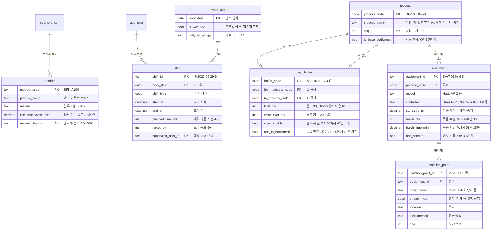
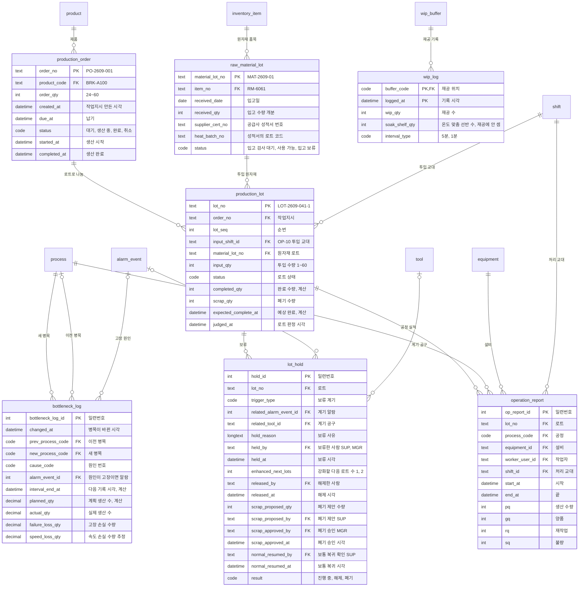
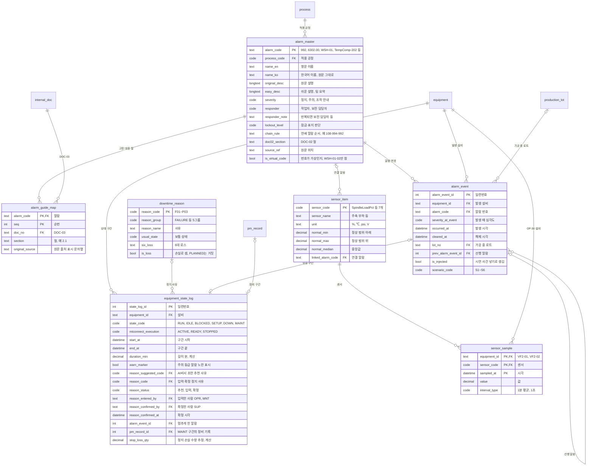
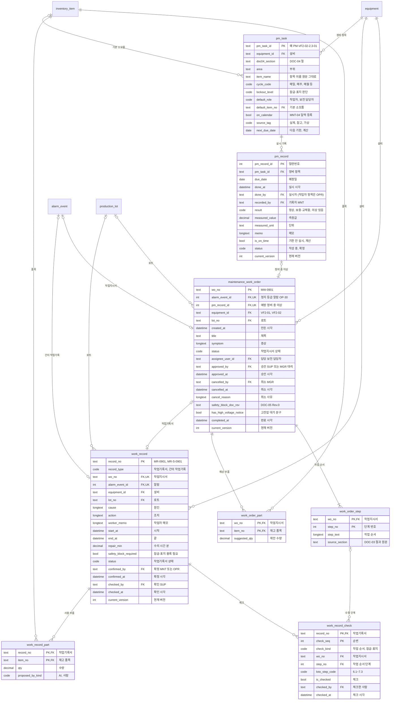
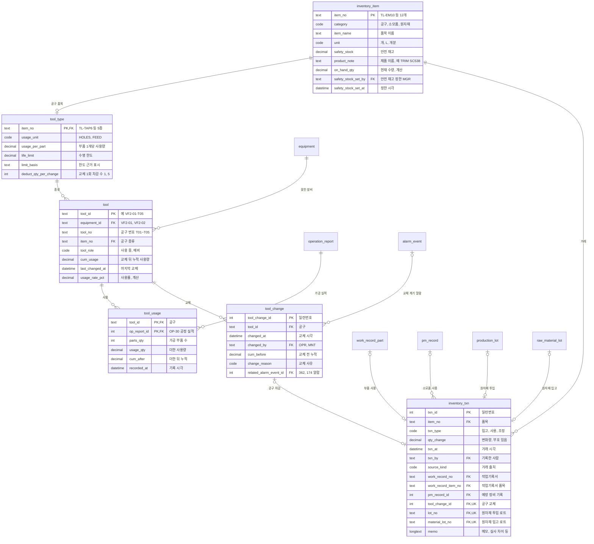
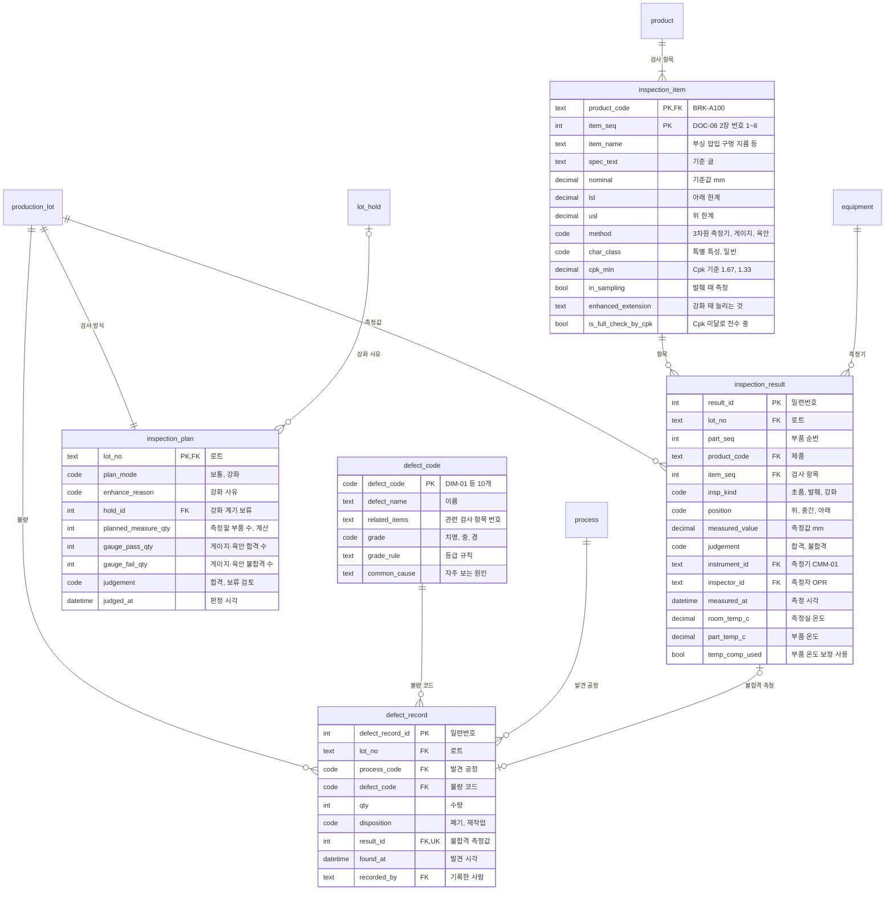
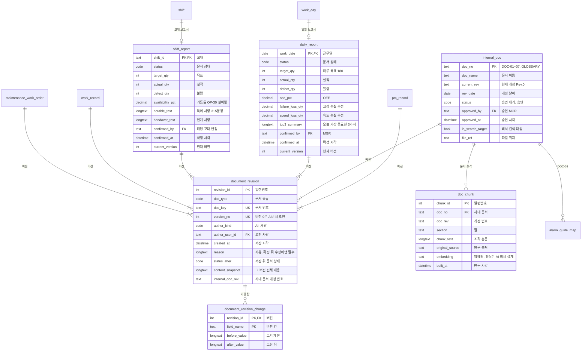
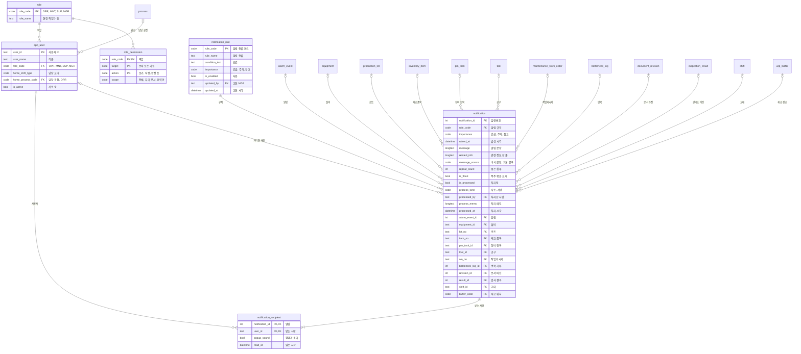

# AI 운영 비서 기반 자동차 부품 절삭가공 라인 운영 관리 플랫폼 — 논리 ERD

> **이전 버전입니다.** 최종본: [논리ERD_최종본.md](논리ERD_최종본.md)

| 항목 | 내용 |
|---|---|
| 문서명 | 논리 ERD (논리 데이터 모델) |
| 버전 | **v1** |
| 날짜 | 2026-10-05 |
| 상태 | **초안 — 기술 회의(2026-10-06) 뒤 물리 ERD로 넘김** |
| 근거 문서 | [가상데이터설계서_v3.md](가상데이터설계서_v3.md) 5장·9장, [기획서_v4.md](기획서_v4.md) 4.3·4.4·4.5·5장·12.4·13장·19장, [요구사항정의서_v1.md](요구사항정의서_v1.md), [가상사내문서/](가상사내문서/) DOC-01·02·04·05·06·07, [00_용어집.md](가상사내문서/00_용어집.md) |
| 다음 문서 | 물리 ERD, API 명세서, AI 비서 설계 (기획서 18장 7·8·9번) |
| 엔터티 수 | **52개** (8개 주제 영역) |

> 이 문서는 **논리 모델만** 다룬다: 엔터티, 속성, 키(PK/FK), 관계, 카디널리티, 필수 여부, 값의 뜻, 코드 목록. DB 제품·물리 자료형·인덱스·파티션은 정하지 않는다 → **물리 ERD에서 [선택 필요: 기술 회의]**.
> 기획서 12.4와 설계서 5장의 이름이 다르면 **설계서 5장 이름**을 쓰고 10장 대응표에 적는다.

---

## 목차

1. [목적과 범위](#1-목적과-범위)
2. [표기법](#2-표기법)
3. [주제 영역 묶음표](#3-주제-영역-묶음표)
4. [ERD 그림](#4-erd-그림)
5. [엔터티 정의서](#5-엔터티-정의서)
6. [코드 목록](#6-코드-목록)
7. [관계 정의표](#7-관계-정의표)
8. [무결성·업무 규칙](#8-무결성업무-규칙)
9. [요구사항 ↔ 엔터티 추적표](#9-요구사항--엔터티-추적표)
10. [기획서 12.4 ↔ 이 문서 이름 대응표](#10-기획서-124--이-문서-이름-대응표)
11. [물리 ERD로 넘기는 것](#11-물리-erd로-넘기는-것)
12. [개정 기록](#12-개정-기록)

---

## 1. 목적과 범위

### 1.1 목적

| 항목 | 내용 |
|---|---|
| 왜 만드나 | 요구사항 정의서의 요구사항을 **어떤 데이터로 지키는지** 정한다. 물리 ERD·API 명세서·가상 데이터 생성기가 이 문서의 엔터티 이름과 규칙을 같이 쓴다 |
| 누가 보나 | 백엔드·DB 담당 (물리 ERD), 데이터·ML 담당 (생성기), AI 비서 담당 (조회 도구), 프론트엔드 (화면 칸), 심사위원 |
| 무엇을 담나 | 52개 엔터티의 속성·키·관계, 코드 목록, 무결성 규칙 (설계서 9장 점검 기준 + 문서 흐름 규칙), 요구사항 추적 |

### 1.2 논리 모델과 물리 모델의 구분

| 구분 | 논리 ERD (이 문서) | 물리 ERD (다음 문서) |
|---|---|---|
| 이름 | 엔터티·속성 이름 (영어 snake_case + 한국어 이름) | 테이블·칼럼 이름 (보통 같게 씀) |
| 형식 | 쉬운 말: 문자, 긴 문자, 정수, 소수, 날짜, 날짜시각, 참·거짓, 코드 | DB 자료형 (예: 문자 길이, 소수 자리), 시간대 |
| 키 | PK, FK, UK(겹치면 안 되는 묶음) | 기본 키 생성 방식 (일련번호 등), 외래 키 제약 이름 |
| 관계 | 1:1, 1:N, 선택·필수 | 삭제·변경 때 동작 (함께 지움 등) |
| 성능 | 다루지 않음 | 인덱스, 파티션 (예: 1초 간격 센서 값), 보관 기간 |
| 계산 값 | "계산" 표시만 (저장할지 안 할지는 정하지 않음) | 저장 칼럼 / 뷰 / 화면 계산 중 선택 |
| DB 제품 | 정하지 않음 | **[선택 필요: 기술 회의]** (기획서 12.2 [제안]) |

### 1.3 범위

| 포함 | 제외 (까닭) |
|---|---|
| BRK-A100 라인 5개 공정 6대 설비의 운영 데이터 (설계서 5장 전체) | 구매·발주, ERP 연동 (기획서 8.1) |
| 문서 흐름: 작업지시서 → 작업기록서 → 교대 보고서 → 일일 보고서, 수정 이력 (기획서 5장, 4.5) | 지침카드·교대 시작 브리핑의 **저장** — 둘 다 화면이고 확정하지 않는다 (기획서 5.1, FR-AST-01-01). 화면은 다른 엔터티를 모아 만든다 |
| 알림·권한·사용자 (기획서 4.3, 13장) | 설비로 보내는 명령 (FR-AST-COM-11, NFR-SAFE-01) — 데이터는 설비 → 플랫폼 한 방향 |
| AI 비서 문서 검색 저장소 (사내 문서 조각) — **엔터티 이름과 칸만** | 문서 나누기 방식, 임베딩 모델·차원, 검색 방식 → **AI 비서 설계에서 [선택 필요: 기술 회의]** |
| 다시 보기(PRD-06) — 새 엔터티 없이 기존 기록을 다시 그림 (설계서 5.19, FR-PRD-06-05) | 다시 보기 전용 테이블 (FR-PRD-06-05 "다시 보기만을 위한 테이블이 없다") |
| — | 공구 수명 예측 모델의 학습 데이터 (실제 VF-1 실험 CSV, 설계서 5.13) — 운영 DB 밖 |

---

## 2. 표기법

### 2.1 표시 규칙 (CLAUDE.md)

| 표시 | 뜻 |
|---|---|
| **[실제]** | 공개 문서·데이터 그대로 |
| **[가상]** | 팀이 정한 값 |
| **[참고]** | 다른 회사·산업 값의 모양만 빌림 |
| **[제안]** | 이 문서가 처음 제안하는 것 (팀 확정 전) |
| **[선택 필요]** | 아직 정하지 않음. 뒤에 정할 곳을 적는다 |

- 숫자는 설계서·기획서·DOC에 있는 값만 쓴다. 근거 없는 숫자는 만들지 않는다.
- 엔터티 정의서의 "출처" 칸은 절까지 적는다. 예: "설계서 5.5", "DOC-07 2.2", "[제안]".

### 2.2 이름 규칙

| 대상 | 규칙 | 예 |
|---|---|---|
| 엔터티 | 영어 **snake_case 단수형** + 한국어 이름 | `production_lot` 생산 로트 |
| 속성 | 영어 snake_case. 수량은 `_qty`, 분은 `_min`, 시각은 `_at`, 날짜는 `_date`, 비율은 `_pct`, 참·거짓은 `is_` / `has_` | `input_qty`, `repair_min`, `occurred_at` |
| 외래 키 | 가리키는 엔터티의 키 이름을 그대로 쓴다. 같은 엔터티를 두 번 가리키면 앞에 뜻을 붙인다 | `prev_process_code`, `new_process_code` |
| 사용자를 가리키는 칸 | `~_by` (누가) + `~_at` (언제) 짝 | `confirmed_by`, `confirmed_at` |
| 코드 값 | 6장의 코드. 영어 대문자 코드는 [제안], 한국어 이름은 출처 문서 그대로 | `STOP` = 정지 (DOC-02 2장) |
| 업무 번호 | 출처 문서의 번호 형식을 그대로 키로 쓴다 | `PO-2609-001`, `LOT-2609-041-1`, `MAT-2609-01`, `MW-0901`, `MR-0901`, `MR-S-0901` |

### 2.3 키 표시

| 표시 | 뜻 |
|---|---|
| **PK** | 기본 키. 한 줄을 하나로 정한다. 둘 이상 칸이면 묶어서 PK |
| **FK** | 외래 키. 다른 엔터티의 PK를 가리킨다 |
| **UK** | 겹치면 안 되는 칸 (또는 묶음). PK는 아니지만 업무상 하나여야 함 |
| **PK, FK** | 기본 키이면서 외래 키 (부모에 딸린 엔터티) |

### 2.4 논리 형식

| 논리 형식 | 뜻 | mermaid 그림의 형식 이름 |
|---|---|---|
| 문자 | 짧은 글자 (이름, 번호) | `text` |
| 긴 문자 | 문장·문단 (원인, 메모, 원문 설명) | `longtext` |
| 정수 | 개수 (수량, 순번) | `int` |
| 소수 | 측정값, 분, 비율 | `decimal` |
| 날짜 | 날짜만 | `date` |
| 날짜시각 | 날짜 + 시각 | `datetime` |
| 참·거짓 | 예 / 아니오 | `bool` |
| 코드 | 6장 코드 목록 중 하나 | `code` |

- mermaid 그림은 영어 형식 이름만 받으므로 위 표처럼 바꿔 적는다. 물리 자료형이 아니다.
- **계산** 표시가 있는 속성은 다른 기록에서 계산되는 값이다. 저장할지 화면에서 계산할지는 물리 ERD에서 정한다.

### 2.5 카디널리티 기호 (mermaid erDiagram)

| 기호 | 뜻 | 예 |
|---|---|---|
| `\|\|--\|\|` | 1 : 정확히 1 | 생산 로트 1 : 검사 방식 1 |
| `\|\|--o\|` | 1 : 0 또는 1 | 교대 1 : 교대 보고서 0..1 |
| `\|\|--o{` | 1 : 0 이상 | 설비 1 : 알람 이벤트 0..N |
| `\|\|--\|{` | 1 : 1 이상 | 작업지시 1 : 생산 로트 1..N |
| `\|o--o{` | 0 또는 1 : 0 이상 (자식의 FK가 비어도 됨) | 정지 사유 0..1 : 상태 구간 0..N |
| `\|o--o\|` | 0 또는 1 : 0 또는 1 | 알람 이벤트 0..1 : 작업지시서 0..1 |

- 왼쪽이 부모(PK 쪽), 오른쪽이 자식(FK 쪽)이다. 7장 표의 카디널리티도 "부모 : 자식"으로 적는다.

### 2.6 필수 표시

| 표시 | 뜻 |
|---|---|
| ○ | 늘 값이 있어야 함 |
| — | 비어도 됨 |
| 조건 | 조건에 따라 필수 (값·규칙 칸에 조건을 적음) |

---

## 3. 주제 영역 묶음표

| # | 영역 | 엔터티 (한국어 이름) | 수 | 주로 쓰는 기능 |
|---|---|---|---|---|
| A | **기준 정보** | `process` 공정, `equipment` 설비, `isolation_point` 차단 지점, `product` 제품, `work_day` 근무일, `shift` 교대, `wip_buffer` 재공 위치 | 7 | 전체 |
| B | **생산** | `raw_material_lot` 원자재 로트, `production_order` 생산 작업지시, `production_lot` 생산 로트, `operation_report` 공정 실적, `wip_log` 재공 기록, `bottleneck_log` 병목 기록, `lot_hold` 로트 보류 기록 | 7 | PRD-01·02·03·04·05 |
| C | **설비·알람** | `alarm_master` 알람 코드집, `alarm_guide_map` 알람-고장 대응 연결, `alarm_event` 알람 이벤트, `equipment_state_log` 설비 상태 기록, `downtime_reason` 정지 사유 코드, `sensor_item` 센서 항목, `sensor_sample` 센서 값 | 7 | PRD-01·06, MNT-01·02, AST-02 |
| D | **정비** | `maintenance_work_order` 정비 작업지시서, `work_order_step` 작업지시서 작업 순서, `work_order_part` 작업지시서 예상 부품, `work_record` 작업기록서, `work_record_check` 작업기록서 체크, `work_record_part` 작업기록서 사용 부품, `pm_task` 예방 정비 항목, `pm_record` 예방 정비 실시 기록 | 8 | MNT-03·04·05 |
| E | **공구·재고** | `tool_type` 공구 종류, `tool` 공구, `tool_usage` 공구 사용 기록, `tool_change` 공구 교체 기록, `inventory_item` 재고 품목, `inventory_txn` 입출고 거래 | 6 | ML-01, INV-01 |
| F | **품질** | `inspection_item` 검사 항목, `defect_code` 불량 코드, `inspection_plan` 검사 방식, `inspection_result` 검사 결과, `defect_record` 불량 기록 | 5 | QLT-01, PRD-05 |
| G | **문서·AI 비서** | `shift_report` 교대 보고서, `daily_report` 일일 보고서, `document_revision` 문서 버전, `document_revision_change` 버전 변경 칸, `internal_doc` 사내 문서, `doc_chunk` 사내 문서 조각 | 6 | PRD-02·04, AST-03, MNT-01 |
| H | **사용자·권한·알림** | `app_user` 사용자, `role` 역할, `role_permission` 역할별 권한, `notification` 알림, `notification_recipient` 알림 받는 사람, `notification_rule` 알림 규칙 | 6 | AST-01·02·03, 권한 |
| | **합계** | | **52** | |

---

## 4. ERD 그림

### 4.0 전체 ERD (엔터티와 관계만)

- 그림을 읽기 쉽게 하려고 **`app_user`와의 관계(작성자·확정자·승인자 등 `~_by` 칸)와 `notification`의 선택 연결**은 뺐다. 모두 7장 관계 정의표에 있다.
- `document_revision`은 여섯 종류 문서 중 **하나만** 가리킨다 (8장 R-35).

```mermaid
erDiagram
    process ||--|{ equipment : "속한 설비"
    process ||--o| wip_buffer : "앞 공정"
    process ||--o| wip_buffer : "뒤 공정"
    equipment ||--|{ isolation_point : "차단 지점"
    work_day ||--o{ shift : "교대"
    product ||--o{ production_order : "제품"
    product ||--|{ inspection_item : "검사 항목"
    inventory_item ||--o{ product : "원자재 품목"
    inventory_item ||--o{ raw_material_lot : "원자재 품목"
    production_order ||--o{ production_lot : "로트로 나눔"
    raw_material_lot ||--o{ production_lot : "투입 원자재"
    shift ||--o{ production_lot : "투입 교대"
    production_lot ||--o{ operation_report : "공정 실적"
    process ||--o{ operation_report : "공정"
    equipment ||--o{ operation_report : "설비"
    shift ||--o{ operation_report : "처리 교대"
    wip_buffer ||--o{ wip_log : "재공 기록"
    process ||--o{ bottleneck_log : "새 병목"
    process |o--o{ bottleneck_log : "이전 병목"
    alarm_event |o--o{ bottleneck_log : "고장 원인"
    production_lot ||--o{ lot_hold : "보류"
    alarm_event |o--o{ lot_hold : "보류 계기 알람"
    tool |o--o{ lot_hold : "보류 계기 공구"
    process ||--o{ alarm_master : "적용 공정"
    alarm_master ||--o{ alarm_guide_map : "고장 대응 절"
    internal_doc ||--o{ alarm_guide_map : "DOC-03"
    alarm_master ||--o{ alarm_event : "알람 번호"
    equipment ||--o{ alarm_event : "발생 설비"
    production_lot |o--o{ alarm_event : "가공 중 로트"
    alarm_event |o--o{ alarm_event : "선행 알람"
    equipment ||--o{ equipment_state_log : "상태 구간"
    downtime_reason |o--o{ equipment_state_log : "정지 사유"
    alarm_event |o--o| equipment_state_log : "멈춘 구간"
    pm_record |o--o| equipment_state_log : "정비 구간"
    alarm_master |o--o{ sensor_item : "연결 알람"
    sensor_item ||--o{ sensor_sample : "센서"
    equipment ||--o{ sensor_sample : "OP-30 설비"
    alarm_event |o--o| maintenance_work_order : "작업지시서"
    pm_record |o--o| maintenance_work_order : "정비 중 이상"
    equipment ||--o{ maintenance_work_order : "설비"
    production_lot |o--o{ maintenance_work_order : "로트"
    maintenance_work_order ||--|{ work_order_step : "작업 순서"
    maintenance_work_order ||--o{ work_order_part : "예상 부품"
    inventory_item ||--o{ work_order_part : "품목"
    maintenance_work_order |o--o| work_record : "작업기록서"
    alarm_event |o--o| work_record : "간이 작업기록"
    equipment ||--o{ work_record : "설비"
    production_lot |o--o{ work_record : "로트"
    work_record ||--o{ work_record_check : "체크"
    work_order_step |o--o{ work_record_check : "수행 단계"
    work_record ||--o{ work_record_part : "사용 부품"
    inventory_item ||--o{ work_record_part : "품목"
    equipment ||--o{ pm_task : "정비 항목"
    inventory_item |o--o{ pm_task : "기본 소모품"
    pm_task ||--o{ pm_record : "실시 기록"
    inventory_item ||--o| tool_type : "공구 품목"
    tool_type ||--o{ tool : "종류"
    equipment ||--o{ tool : "꽂힌 설비"
    tool ||--o{ tool_usage : "사용"
    operation_report ||--o{ tool_usage : "가공 실적"
    tool ||--o{ tool_change : "교체"
    alarm_event |o--o{ tool_change : "교체 계기 알람"
    inventory_item ||--o{ inventory_txn : "거래"
    work_record_part |o--o| inventory_txn : "부품 사용"
    pm_record |o--o{ inventory_txn : "소모품 사용"
    tool_change |o--o| inventory_txn : "공구 차감"
    production_lot |o--o| inventory_txn : "원자재 투입"
    raw_material_lot |o--o| inventory_txn : "원자재 입고"
    production_lot ||--|| inspection_plan : "검사 방식"
    lot_hold |o--o{ inspection_plan : "강화 사유"
    production_lot ||--o{ inspection_result : "측정값"
    inspection_item ||--o{ inspection_result : "항목"
    equipment ||--o{ inspection_result : "측정기"
    production_lot ||--o{ defect_record : "불량"
    defect_code ||--o{ defect_record : "불량 코드"
    process ||--o{ defect_record : "발견 공정"
    inspection_result |o--o| defect_record : "불합격 측정"
    shift ||--o| shift_report : "교대 보고서"
    work_day ||--o| daily_report : "일일 보고서"
    maintenance_work_order ||--|{ document_revision : "버전"
    work_record ||--|{ document_revision : "버전"
    shift_report ||--|{ document_revision : "버전"
    daily_report ||--|{ document_revision : "버전"
    internal_doc ||--|{ document_revision : "버전"
    pm_record ||--|{ document_revision : "버전"
    document_revision ||--o{ document_revision_change : "바뀐 칸"
    internal_doc ||--o{ doc_chunk : "문서 조각"
    role ||--o{ app_user : "역할"
    role ||--o{ role_permission : "권한"
    notification_rule ||--o{ notification : "규칙"
    notification ||--|{ notification_recipient : "받는 사람"
    app_user ||--o{ notification_recipient : "사용자"
```

### 4.1 A 기준 정보

### 4.2 B 생산

### 4.3 C 설비·알람

### 4.4 D 정비

### 4.5 E 공구·재고

### 4.6 F 품질

### 4.7 G 문서·AI 비서

### 4.8 H 사용자·권한·알림

---

## 5. 엔터티 정의서

- 표의 칸: **속성(영문) | 한국어 이름 | 논리 형식 | 키 | 필수 | 값·규칙 | 출처**.
- "대략 건수(30일)"는 **설계서·DOC에 있는 값만** 적는다. 없으면 "값 없음"이라고 적고 만들지 않는다.
- 사람을 가리키는 칸(`~_by`, `~_user_id`)은 모두 `app_user.user_id`를 가리킨다. 역할 제한은 값·규칙 칸에 적는다.

### 5.A 기준 정보

#### 5.A.1 `process` 공정

| 항목 | 내용 |
|---|---|
| 설명 | 라인의 5개 공정. 공정 순서, 재공 위치, 병목 판단의 단위 |
| 쓰는 요구사항 | FR-PRD-01-01·06·08, FR-PRD-05-03, FR-MNT-02-13, NFR-DATA-01 |
| 대략 건수 | 5행 (OP-10~OP-50) |
| 출처 | 설계서 5.1, DOC-07 2.1. 엔터티 자체는 [제안] (설계서·기획서 12.4에 테이블 이름 없음) |

| 속성(영문) | 한국어 이름 | 논리 형식 | 키 | 필수 | 값·규칙 | 출처 |
|---|---|---|---|---|---|---|
| process_code | 공정 코드 | 코드 | PK | ○ | OP-10, OP-20, OP-30, OP-40, OP-50 | 설계서 5.1 |
| process_name | 공정 이름 | 문자 | | ○ | 절단, 황삭, 정밀 가공, 세척·디버링, 측정 | 설계서 5.1 |
| seq | 공정 순서 | 정수 | UK | ○ | 1~5. 부품은 이 순서로만 흐른다 | 설계서 5.5 |
| is_base_bottleneck | 기준 병목 여부 | 참·거짓 | | ○ | OP-30만 참. 병목 조건에 맞는 공정이 없을 때 표시 | DOC-07 7.3 ④ |

#### 5.A.2 `equipment` 설비

| 항목 | 내용 |
|---|---|
| 설명 | 라인 설비 6대. 기준 사이클 시간은 성능(E)과 고장 손실 수량 계산에 쓴다 |
| 쓰는 요구사항 | FR-PRD-01-01·03·12·16·20·21, FR-MNT-03-10, FR-PRD-05-03, NFR-DATA-01, NFR-SEC-04 |
| 대략 건수 | 6행 |
| 출처 | 설계서 5.1, DOC-07 2.1, 기획서 12.4 `equipment` |

| 속성(영문) | 한국어 이름 | 논리 형식 | 키 | 필수 | 값·규칙 | 출처 |
|---|---|---|---|---|---|---|
| equipment_id | 설비 ID | 문자 | PK | ○ | SAW-01, MIL-01, VF2-01, VF2-02, WSH-01, CMM-01 | 설계서 5.1 |
| process_code | 공정 | 코드 | FK | ○ | → process. OP-30만 2대 | 설계서 5.1 |
| model | 모델 | 문자 | | ○ | Haas HCS-80, 3축 머시닝센터, Haas VF-2, 초음파 세척기 + 텀블러, 3차원 측정기 | 설계서 5.1 (모델 [실제]/[가상]) |
| controller | 제어기 | 문자 | | — | Haas, Siemens 840D sl, Haas NGC. WSH-01·CMM-01은 비움 | 설계서 5.1 |
| std_cycle_min | 기준 사이클 시간 | 소수 | | 조건 | 분/개. SAW-01 1.0, MIL-01 3.5, VF2-01·02 7.0, CMM-01 평소 0.9 (강화 5.0은 검사 방식 코드 6.32). WSH-01은 비움 | 설계서 5.1, DOC-07 2.1 [가상] |
| batch_qty | 묶음 수량 | 정수 | | 조건 | WSH-01만 30 | 설계서 5.1 |
| batch_time_min | 묶음 시간 | 소수 | | 조건 | WSH-01만 25분 | 설계서 5.1 |
| has_sensor | 센서 기록 여부 | 참·거짓 | | ○ | VF2-01·02만 참 | DOC-07 3장 |

#### 5.A.3 `isolation_point` 차단 지점

| 항목 | 내용 |
|---|---|
| 설명 | 설비마다 잠금·표지를 거는 에너지 차단 지점. 작업지시서·지침카드 안전 칸이 여기서 가져온다 |
| 쓰는 요구사항 | FR-MNT-03-10, FR-MNT-02-07·08, FR-MNT-04-09, NFR-SAFE-02 |
| 대략 건수 | 15행 (SAW-01 2, MIL-01 3, VF2-01 3, VF2-02 3, WSH-01 2, CMM-01 2 — DOC-05 §3) |
| 출처 | 설계서 5.1 "차단 지점 2~3개", DOC-05 §3 [가상]. 기획서 12.4는 `equipment` 안 칸으로 둠 → 분리 [제안] |

| 속성(영문) | 한국어 이름 | 논리 형식 | 키 | 필수 | 값·규칙 | 출처 |
|---|---|---|---|---|---|---|
| isolation_point_id | 차단 지점 번호 | 문자 | PK | ○ | `{설비 ID}-E1`, `-E2`, `-P1` 형식 (예: VF2-01-E1) | DOC-05 §3 [가상] |
| equipment_id | 설비 | 문자 | FK | ○ | → equipment | DOC-05 §3 |
| point_name | 차단 지점 이름 | 문자 | | ○ | 예: "VF2-01 주 차단기", "VF2-01 공압 주 밸브" | 설계서 5.1, DOC-05 §3 |
| energy_type | 에너지 종류 | 코드 | | ○ | 6.21 (전기 / 전기(공급원) / 공압) | DOC-05 §3 |
| location | 위치 | 문자 | | ○ | 예: "기계 뒤쪽 제어반의 오른쪽 위" | DOC-05 §3 |
| lock_method | 잠금 방법 | 문자 | | ○ | 예: "밸브를 닫고 잠금 + 잔압 빼기" | DOC-05 §3 |
| seq | 차단 순서 | 정수 | | ○ | 주 차단기 → 공압 주 밸브 → 공급 분전반 차단기 순 | DOC-05 §2.1 6.3 |

#### 5.A.4 `product` 제품

| 항목 | 내용 |
|---|---|
| 설명 | 라인이 만드는 제품. 1종뿐이지만 검사 항목·작업지시가 가리킨다 |
| 쓰는 요구사항 | FR-PRD-05-02, FR-QLT-01-02, FR-PRD-01-15 |
| 대략 건수 | 1행 (BRK-A100) |
| 출처 | 설계서 5.3. 엔터티 이름은 [제안] (설계서에 테이블 이름 없음) |

| 속성(영문) | 한국어 이름 | 논리 형식 | 키 | 필수 | 값·규칙 | 출처 |
|---|---|---|---|---|---|---|
| product_code | 제품 코드 | 문자 | PK | ○ | BRK-A100 | 설계서 5.3 [가상] |
| product_name | 제품 이름 | 문자 | | ○ | 엔진 마운트 브래킷 | 설계서 5.3 |
| material | 재질 | 문자 | | ○ | 알루미늄 6061-T6 | 설계서 5.3 (재질은 실제 규격) |
| line_base_cycle_min | 라인 기준 속도 | 소수 | | ○ | 3.5분/개 (OP-30 7.0 ÷ 2대). 계획 생산 수 계산에 씀 | 설계서 5.3, DOC-07 5.3 |
| material_item_no | 원자재 품목 | 문자 | FK | ○ | → inventory_item (RM-6061) | 설계서 5.14 |

#### 5.A.5 `work_day` 근무일

| 항목 | 내용 |
|---|---|
| 설명 | 달력 날짜. 근무일이면 교대 2개와 일일 보고서 1개가 붙는다 |
| 쓰는 요구사항 | FR-PRD-04-01·02, FR-AST-02-16, NFR-DATA-01 |
| 대략 건수 | 30행 (2026-09-01~09-30), 그중 근무일 26 |
| 출처 | 설계서 5.2. 기획서 12.4 `shift_target`의 하루 목표를 여기에 둠 [제안] |

| 속성(영문) | 한국어 이름 | 논리 형식 | 키 | 필수 | 값·규칙 | 출처 |
|---|---|---|---|---|---|---|
| work_date | 날짜 | 날짜 | PK | ○ | 2026-09-01 ~ 09-30 | 설계서 5.2 |
| is_workday | 근무일 여부 | 참·거짓 | | ○ | 월~토 참, 일요일(6·13·20·27일) 거짓 | 설계서 5.2 [가상] |
| daily_target_qty | 하루 목표 | 정수 | | 조건 | 근무일이면 180. MGR만 정함 | 설계서 5.3, 기획서 13.2 |

#### 5.A.6 `shift` 교대

| 항목 | 내용 |
|---|---|
| 설명 | 교대 1회 (주간 또는 야간). 목표·계획 가동 시간·담당 반장을 가진다. 교대 보고서·로트 투입·공정 실적이 가리킨다 |
| 쓰는 요구사항 | FR-PRD-01-15, FR-PRD-02-01·11, FR-AST-01-01, FR-AST-02-04·16, FR-PRD-05-02, NFR-DATA-01 |
| 대략 건수 | 52행 |
| 출처 | 설계서 5.2·5.3, DOC-07 4.1, 기획서 12.4 `shift_target` |

| 속성(영문) | 한국어 이름 | 논리 형식 | 키 | 필수 | 값·규칙 | 출처 |
|---|---|---|---|---|---|---|
| shift_id | 교대 ID | 문자 | PK | ○ | `{날짜}-D` (주간) / `{날짜}-N` (야간). 예: 2026-09-29-D | [제안] |
| work_date | 근무일 | 날짜 | FK | ○ | → work_day. 야간이 다음 날 05:00에 끝나도 시작한 날짜 | 설계서 5.2 |
| shift_type | 교대 구분 | 코드 | | ○ | 6.10 (주간 / 야간). (work_date, shift_type)은 UK | 설계서 5.2 |
| start_at | 시작 시각 | 날짜시각 | | ○ | 주간 08:00, 야간 20:00 | 설계서 5.2 [가상] |
| end_at | 끝 시각 | 날짜시각 | | ○ | 주간 17:00, 야간 다음 날 05:00 (휴식 1시간 포함) | 설계서 5.2 [가상] |
| planned_time_min | 계획 가동 시간 | 정수 | | ○ | 480분 (휴식 제외) | 설계서 5.2, DOC-07 4.1 |
| target_qty | 교대 목표 | 정수 | | ○ | 90개. MGR만 정함 | 설계서 5.3, FR-AST-02-16 |
| supervisor_user_id | 담당 반장 | 문자 | FK | ○ | → app_user, 역할 SUP. 교대 보고서를 확정할 사람 | 설계서 5.16·5.17 |

#### 5.A.7 `wip_buffer` 재공 위치

| 항목 | 내용 |
|---|---|
| 설명 | 공정 사이 재공을 두는 4곳과 그 한도·경고 기준. BLOCKED 판단, 재공 경고, 병목 판단이 쓴다 |
| 쓰는 요구사항 | FR-PRD-01-03·06·07·08, FR-AST-02-05 |
| 대략 건수 | 4행 |
| 출처 | 설계서 5.6, DOC-07 7.1·7.2, 기획서 19장. 엔터티는 [제안] (설계서에는 `wip_log`만 있음) |

| 속성(영문) | 한국어 이름 | 논리 형식 | 키 | 필수 | 값·규칙 | 출처 |
|---|---|---|---|---|---|---|
| buffer_code | 재공 위치 코드 | 코드 | PK | ○ | WIP-10-20, WIP-20-30, WIP-30-40, WIP-40-50 (6.39) | [제안] |
| from_process_code | 앞 공정 | 코드 | FK, UK | ○ | → process | 설계서 5.6 |
| to_process_code | 뒤 공정 | 코드 | FK, UK | ○ | → process. 앞 공정 seq + 1 | 설계서 5.6 |
| limit_qty | 재공 한도 | 정수 | | ○ | 30개 (대차 1대분). **WIP-30-40만 60개** (대차 2대분) | 설계서 5.6, 기획서 19장 [가상] |
| warn_over_qty | 경고 기준 | 정수 | | 조건 | 20개 **초과**면 경고. WIP-30-40은 비움 | 설계서 5.6, DOC-07 7.2 [가상] |
| warn_enabled | 경고 사용 | 참·거짓 | | ○ | WIP-30-40만 거짓 (묶음 대기) | DOC-07 7.2 |
| use_in_bottleneck | 병목 판단 사용 | 참·거짓 | | ○ | WIP-30-40만 거짓 | DOC-07 7.3 ⑤ |

### 5.B 생산

#### 5.B.1 `raw_material_lot` 원자재 로트

| 항목 | 내용 |
|---|---|
| 설명 | 입고된 봉재 묶음. 원자재 로트 1개 → 생산 로트 여러 개 |
| 쓰는 요구사항 | FR-PRD-05-01·02·03·09, FR-INV-01-03·04 |
| 대략 건수 | 주 3회 입고, 1회 약 360개분 (30일 건수는 설계서에 없음) |
| 출처 | 설계서 5.4, DOC-06 §7, 기획서 12.4 `raw_material_lot` |

| 속성(영문) | 한국어 이름 | 논리 형식 | 키 | 필수 | 값·규칙 | 출처 |
|---|---|---|---|---|---|---|
| material_lot_no | 원자재 로트 번호 | 문자 | PK | ○ | `MAT-2609-01` 형식 | 설계서 5.4 [가상] |
| item_no | 품목 | 문자 | FK | ○ | → inventory_item (RM-6061 6061-T6 봉재) | 설계서 5.14 |
| received_date | 입고일 | 날짜 | | ○ | 주 3회 | 설계서 5.4 |
| received_qty | 입고 수량 | 정수 | | ○ | 개분. 1회 약 360개분 | 설계서 5.4 [가상] |
| supplier_cert_no | 공급사 성적서 번호 | 문자 | | ○ | 가상 번호. 성적서 종류는 EN 10204 3.1. 성분·강도 값은 만들지 않음 | 설계서 5.4, DOC-06 §7 |
| heat_batch_no | 성적서 로트 코드 | 문자 | | — | 성적서의 히트·배치 번호. 입고품 표시와 대조 | DOC-06 §7 순서 3 [제안: 칸] |
| status | 원자재 로트 상태 | 코드 | | ○ | 6.9 (입고 검사 대기 / 사용 가능 / 입고 보류). **사용 가능일 때만** 생산 로트에 쓸 수 있다 | DOC-06 §7 순서 3·5 |

#### 5.B.2 `production_order` 생산 작업지시

| 항목 | 내용 |
|---|---|
| 설명 | 무엇을 몇 개 만들지 정한 지시. 교대·원자재 로트가 바뀌면 생산 로트 여러 개로 나뉜다 |
| 쓰는 요구사항 | FR-PRD-03-01·03·04, FR-PRD-05-02, FR-AST-01-02, FR-AST-02-06, FR-PRD-02-08 |
| 대략 건수 | 30일 약 110~130건 (하루 4~5건) |
| 출처 | 설계서 5.5, DOC-07 4.2, 기획서 12.4 `production_order` |

| 속성(영문) | 한국어 이름 | 논리 형식 | 키 | 필수 | 값·규칙 | 출처 |
|---|---|---|---|---|---|---|
| order_no | 작업지시 번호 | 문자 | PK | ○ | `PO-2609-001` 형식 | 설계서 5.5 |
| product_code | 제품 | 문자 | FK | ○ | → product (BRK-A100) | 설계서 5.5 |
| order_qty | 수량 | 정수 | | ○ | 24~60개, 중앙값 약 36개 | 설계서 5.5 (4TU [실제] 모양) |
| created_at | 만든 시각 | 날짜시각 | | ○ | — | [제안] |
| due_at | 납기 | 날짜시각 | | ○ | 투입 후 1~2일 | 설계서 5.5 [가상] |
| status | 상태 | 코드 | | ○ | 6.7 (대기 → 생산 중 → 완료 / 취소) | 설계서 5.5, DOC-07 4.2 |
| started_at | 생산 시작 | 날짜시각 | | 조건 | 첫 로트의 OP-10 투입 시각. "생산 중"부터 필수 | [제안] |
| completed_at | 생산 완료 | 날짜시각 | | 조건 | "완료"면 필수 | [제안] |

#### 5.B.3 `production_lot` 생산 로트

| 항목 | 내용 |
|---|---|
| 설명 | 작업지시를 **OP-10 투입 기준**으로 ① 교대가 바뀌거나 ② 원자재 로트가 바뀌면 나눈 단위. 추적·보류·검사의 단위. 부품 일련번호는 없다 |
| 쓰는 요구사항 | FR-PRD-05-01~11, FR-PRD-02-03, FR-PRD-04-06, FR-AST-02-06, FR-MNT-02-09, FR-QLT-01-06 |
| 대략 건수 | 30일 약 130~160개 |
| 출처 | 설계서 5.5, DOC-07 4.2, DOC-06 4.1, DOC-01 (로트 번호 예), 기획서 12.4 `production_lot` |

| 속성(영문) | 한국어 이름 | 논리 형식 | 키 | 필수 | 값·규칙 | 출처 |
|---|---|---|---|---|---|---|
| lot_no | 로트 번호 | 문자 | PK | ○ | `LOT-2609-041-1` = 작업지시 번호 뒷부분 + `-순번` | 설계서 5.5, DOC-01 |
| order_no | 작업지시 | 문자 | FK | ○ | → production_order. 작업지시 1 : 로트 1..N | 설계서 5.5 |
| lot_seq | 순번 | 정수 | | ○ | 1, 2 … (order_no, lot_seq)은 UK | 설계서 5.5 |
| input_shift_id | 투입 교대 | 문자 | FK | ○ | → shift. OP-10 투입이 모두 이 교대 안 (R-07) | 설계서 5.5·9장 |
| material_lot_no | 원자재 로트 | 문자 | FK | ○ | → raw_material_lot. 1개만 | 설계서 5.5, IATF FAQ [참고] |
| input_qty | 투입 수량 | 정수 | | ○ | 1~60. 같은 작업지시의 합 = 작업지시 수량 (취소된 작업지시는 ≤, R-08) | 설계서 5.5 |
| status | 로트 상태 | 코드 | | ○ | 6.8 (생산 중, 검사 대기, 판정 대기, 보류 검토, 합격, 보류, 해제, 폐기) | 설계서 5.5·5.15, DOC-06 4.1 |
| completed_qty | 완료 수량 | 정수 | | 조건 | **계산**: OP-50 공정 실적의 양품 + 재작업(GQ + RQ) 합 (R-05) | 설계서 5.5·9장, DOC-07 4.3 |
| scrap_qty | 폐기 수량 | 정수 | | — | 폐기 승인된 부품 수 | 설계서 5.5 "폐기 수량 일부" |
| expected_complete_at | 예상 완료 시각 | 날짜시각 | | — | **계산**. 납기보다 늦으면 로트 납기 지연 위험 알림. 계산 방법은 [선택 필요: 기술 회의] | DOC-07 8장, FR-AST-02-06 |
| judged_at | 판정 시각 | 날짜시각 | | 조건 | 측정 부품을 모두 잰 뒤 (R-25). 합격·보류 검토가 되면 필수 | 설계서 5.15 |

#### 5.B.4 `operation_report` 공정 실적

| 항목 | 내용 |
|---|---|
| 설명 | 로트·공정·설비·작업자·교대마다 시작·끝과 수량을 남긴 기록. 지표·교대 실적·로트 추적의 바탕 |
| 쓰는 요구사항 | FR-PRD-01-15·20·21, FR-PRD-02-02, FR-PRD-03-01, FR-PRD-05-03·10·11, FR-ML-01-01 |
| 대략 건수 | 값 없음 (설계서에 건수 없음) |
| 출처 | 설계서 5.5 (4TU 칸 구성 [참고]), DOC-07 4.3, 기획서 12.4 `operation_report` |

| 속성(영문) | 한국어 이름 | 논리 형식 | 키 | 필수 | 값·규칙 | 출처 |
|---|---|---|---|---|---|---|
| op_report_id | 공정 실적 번호 | 정수 | PK | ○ | 일련번호 | [제안] |
| lot_no | 로트 | 문자 | FK | ○ | → production_lot | 설계서 5.5 |
| process_code | 공정 | 코드 | FK | ○ | → process | 설계서 5.5 |
| equipment_id | 설비 | 문자 | FK | ○ | → equipment. 그 공정의 설비여야 함 | 설계서 5.5 |
| worker_user_id | 작업자 | 문자 | FK | ○ | → app_user (OPR) | 설계서 5.5 |
| shift_id | 처리 교대 | 문자 | FK | ○ | → shift. 그 공정을 처리한 교대 (로트의 투입 교대와 다를 수 있음). (lot_no, process_code, equipment_id, shift_id)는 UK [제안] | 설계서 5.5 |
| start_at | 시작 | 날짜시각 | | ○ | — | 설계서 5.5 |
| end_at | 끝 | 날짜시각 | | 조건 | 진행 중이면 비움. 시작보다 늦음 | 설계서 5.5 |
| pq | 생산 수량 | 정수 | | ○ | 양품 + 재작업 + 불량 (R-19) | DOC-07 4.3 [실제: ISO 22400 PQ] |
| gq | 양품 | 정수 | | ○ | 처음부터 기준에 맞은 부품 | DOC-07 4.3 |
| rq | 재작업 | 정수 | | ○ | 고쳐서 합격한 부품 | DOC-07 4.3 |
| sq | 불량 | 정수 | | ○ | 폐기한 부품. 약 80%는 OP-50에서 기록 | 설계서 5.5, DOC-07 4.3 |

#### 5.B.5 `wip_log` 재공 기록

| 항목 | 내용 |
|---|---|
| 설명 | 공정 사이 재공 수를 일정 간격으로 남긴 기록. 재공 표시·경고·병목 판단·다시 보기에 쓴다 |
| 쓰는 요구사항 | FR-PRD-01-03·06·07·08, FR-PRD-06-01·06, NFR-PERF-03 |
| 대략 건수 | 4곳 × 5분 간격 (시연 사건 전후 30분은 1분) |
| 출처 | 설계서 5.6·5.19, DOC-07 7.1, 기획서 12.4 `wip_log` |

| 속성(영문) | 한국어 이름 | 논리 형식 | 키 | 필수 | 값·규칙 | 출처 |
|---|---|---|---|---|---|---|
| buffer_code | 재공 위치 | 코드 | PK, FK | ○ | → wip_buffer | 설계서 5.6 |
| logged_at | 기록 시각 | 날짜시각 | PK | ○ | — | 설계서 5.6 |
| wip_qty | 재공 수 | 정수 | | ○ | 앞 공정 완료 수 − 다음 공정 투입 수. 0 이상, 한도 이하 (R-13) | 설계서 5.6, DOC-07 7.1 |
| soak_shelf_qty | 온도 맞춤 선반 수 | 정수 | | 조건 | WIP-40-50만. **재공(wip_qty)에 세지 않는다** | 설계서 5.15, DOC-06 §6 [가상] |
| interval_type | 기록 간격 | 코드 | | ○ | 5분 / 1분 (사건 전후 30분) | 설계서 5.19 |

#### 5.B.6 `bottleneck_log` 병목 기록

| 항목 | 내용 |
|---|---|
| 설명 | 병목 공정이 바뀐 때마다 1행. 다음 행까지를 한 병목 구간으로 보고 속도 손실 수량을 남긴다 |
| 쓰는 요구사항 | FR-PRD-01-08·09·16, FR-PRD-02-05, FR-PRD-04-03, FR-AST-02-05, FR-PRD-06-04 |
| 대략 건수 | 값 없음. 고장이 아닌 원인 ①~④가 30일에 5.18 빈도만큼 (① 주 1~2회, ② 4~6회, ③ 2~3회, ④ 매일) |
| 출처 | 설계서 5.10·5.18, DOC-07 5.3·7.3·7.4, 기획서 12.4 `bottleneck_log` |

| 속성(영문) | 한국어 이름 | 논리 형식 | 키 | 필수 | 값·규칙 | 출처 |
|---|---|---|---|---|---|---|
| bottleneck_log_id | 병목 기록 번호 | 정수 | PK | ○ | 일련번호 | [제안] |
| changed_at | 바뀐 시각 | 날짜시각 | | ○ | — | 설계서 5.18 |
| prev_process_code | 이전 병목 | 코드 | FK | — | → process. 첫 기록이면 비움 | 설계서 5.18 |
| new_process_code | 새 병목 | 코드 | FK | ○ | → process. 이전 병목과 달라야 함 | 설계서 5.18 |
| cause_code | 원인 번호 | 코드 | | ○ | 6.11 (① ② ③ ④ / 고장 / 기준 병목 복귀 [제안]) | 설계서 5.18, DOC-07 7.3 ⑥ |
| alarm_event_id | 고장 알람 | 정수 | FK | 조건 | 원인이 "고장"이면 필수. → alarm_event | [제안] |
| interval_end_at | 구간 끝 | 날짜시각 | | — | **계산**: 다음 병목 기록의 changed_at | [제안] |
| planned_qty | 계획 생산 수 | 소수 | | — | **계산**: 구간 시간 ÷ 3.5분 | DOC-07 5.3 |
| actual_qty | 실제 생산 수 | 소수 | | — | 구간 동안 OP-50 교대 실적과 같은 기준 | DOC-07 5.3 |
| failure_loss_qty | 고장 손실 수량 | 소수 | | — | 구간 안 정지의 고장 손실 합 | DOC-07 5.3 |
| speed_loss_qty | 속도 손실 수량 (추정) | 소수 | | — | **계산**: 계획 − 실제 − 고장 손실. 화면에 "추정" 표시 | 설계서 5.10, DOC-07 5.3 |

#### 5.B.7 `lot_hold` 로트 보류 기록

| 항목 | 내용 |
|---|---|
| 설명 | 로트 보류·해제·폐기의 사람 결정 기록 (누가·언제·왜). 보류는 검사 강화의 계기다 |
| 쓰는 요구사항 | FR-PRD-05-05·06·07·08, FR-QLT-01-05·07, FR-AST-COM-10, NFR-REL-03 |
| 대략 건수 | 30일 보류 2~3건, 해제 1~2건 |
| 출처 | 설계서 5.5 "로트 보류 기록", DOC-06 4.1·4.2·3.3. 기획서 12.4는 `production_lot` 안 칸 → 분리 [제안] |

| 속성(영문) | 한국어 이름 | 논리 형식 | 키 | 필수 | 값·규칙 | 출처 |
|---|---|---|---|---|---|---|
| hold_id | 보류 번호 | 정수 | PK | ○ | 일련번호 | [제안] |
| lot_no | 로트 | 문자 | FK | ○ | → production_lot | DOC-06 4.2 |
| trigger_type | 보류 계기 | 코드 | | ○ | 6.12 (AI 의심 로트 제안 / 검사 보류 검토 / 반장 판단) | DOC-06 3.3·4.2 |
| related_alarm_event_id | 계기 알람 | 정수 | FK | — | → alarm_event (정지 등급 알람 중 가공) | DOC-06 4.2 |
| related_tool_id | 계기 공구 | 문자 | FK | — | → tool (공구 수명 초과 중 가공) | DOC-06 4.2 |
| hold_reason | 보류 사유 | 긴 문자 | | ○ | 비면 보류 안 됨 | FR-PRD-05-06 |
| held_by | 보류한 사람 | 문자 | FK | ○ | → app_user, SUP 또는 MGR만. 비서는 안 됨 | 기획서 4.4·13.2 |
| held_at | 보류 시각 | 날짜시각 | | ○ | — | NFR-REL-03 |
| enhanced_next_lots | 강화할 다음 로트 수 | 정수 | | ○ | 원인이 공구이고 교체 완료면 1, 충돌·정지 등급·원인 모름이면 2 | DOC-06 3.3 [가상] |
| released_by | 해제한 사람 | 문자 | FK | 조건 | SUP 또는 MGR. 해제면 필수 | DOC-06 4.1 |
| released_at | 해제 시각 | 날짜시각 | | 조건 | 해제면 필수 | DOC-06 4.1 |
| scrap_proposed_qty | 폐기 제안 수량 | 정수 | | — | — | DOC-06 4.1 |
| scrap_proposed_by | 폐기 제안한 사람 | 문자 | FK | 조건 | SUP | DOC-06 4.1 |
| scrap_approved_by | 폐기 승인한 사람 | 문자 | FK | 조건 | **MGR만**. 승인 없으면 폐기 상태가 되지 않음 | DOC-06 4.1, FR-PRD-05-08 |
| scrap_approved_at | 폐기 승인 시각 | 날짜시각 | | 조건 | — | DOC-06 4.1 |
| normal_resumed_by | 보통 복귀 확인 | 문자 | FK | 조건 | SUP. 원인 조치 완료 + 강화 로트 모두 합격일 때 | DOC-06 3.3 |
| normal_resumed_at | 보통 복귀 시각 | 날짜시각 | | 조건 | — | DOC-06 3.3 |
| result | 결과 | 코드 | | ○ | 진행 중 / 해제 / 폐기 | DOC-06 4.1 |

### 5.C 설비·알람

#### 5.C.1 `alarm_master` 알람 코드집

| 항목 | 내용 |
|---|---|
| 설명 | 라인에서 쓰는 알람의 번호·이름·뜻·심각도·조치 담당. 지침카드와 질문 답변이 **번호로 정확히** 찾는다 |
| 쓰는 요구사항 | FR-MNT-02-01·02·03·04·06·07·08·13·14, FR-MNT-01-02, FR-AST-02-01, FR-AST-COM-16, NFR-DATA-07 |
| 대략 건수 | 31행 (OP-30 15 + 다른 공정 8 + OP-30 조작 안내 8 — DOC-02 3장) |
| 출처 | DOC-02, 설계서 5.8, 기획서 12.4 `alarm_master` |

| 속성(영문) | 한국어 이름 | 논리 형식 | 키 | 필수 | 값·규칙 | 출처 |
|---|---|---|---|---|---|---|
| alarm_code | 알람 번호 | 문자 | PK | ○ | 예: 992, 2075, 6302.00, 25050, WSH-01, MP-170, TempComp-202. 숫자가 아닌 것도 있어 문자. **WSH-01(알람)은 설비 ID WSH-01과 이름만 같다** | DOC-02 3장 |
| process_code | 적용 공정 | 코드 | FK | ○ | → process | DOC-02 3장 |
| name_en | 영문 이름 | 문자 | | — | 예: AMPLIFIER OVER CURRENT | DOC-02 4장 [실제] |
| name_ko | 한국어 이름 | 문자 | | ○ | **원문 그대로** (Haas 한국어 알람 목록, Siemens 한국어 매뉴얼). 예: "전류가 높은 증폭기(AMPLIFIER OVER CURRENT)" | DOC-02 1장, 용어집 1장 [실제] |
| original_desc | 원문 설명 | 긴 문자 | | — | 고치지 않고 옮김 | DOC-02 4장 [실제] |
| easy_desc | 쉬운 설명 | 긴 문자 | | — | 팀이 쓴 요약 | DOC-02 4장 |
| severity | 심각도 | 코드 | | ○ | 6.3 (정지 / 주의 / 조작 안내) | DOC-02 2장 [가상] |
| responder | 조치 담당 | 코드 | | ○ | 6.4 (작업자 / 보전 담당자) | DOC-02 3장 "누가" |
| responder_note | 조치 담당 보충 | 문자 | | — | 예: "작업자 (반복되면 보전 담당자)" (108), "작업자 → 계속되면 보전 담당자" (120) | DOC-02 3장 |
| lockout_level | 잠금·표지 판단 | 코드 | | ○ | 6.20. 정지 등급 = §2 전부, 2075 = 보충용 2점 잠금, 5303.00 = 1점 잠금 등 | DOC-05 §1·§2.4 |
| chain_rule | 연쇄 알람 순서 | 문자 | | — | 예: 992에 "108 → 994 → 992" (과부하 뒤 과전류는 충돌 신호) | 설계서 5.8, DOC-03 |
| doc02_section | DOC-02 절 | 문자 | | ○ | 예: §4.1 | DOC-02 |
| source_ref | 원문 위치 | 문자 | | — | 예: "Haas 알람 목록 CSV 1016행" | DOC-02 4장 |
| is_virtual_code | 가상 번호 여부 | 참·거짓 | | ○ | WSH-01·WSH-02만 참 | DOC-02 3장, 설계서 9장 |

#### 5.C.2 `alarm_guide_map` 알람-고장 대응 연결

| 항목 | 내용 |
|---|---|
| 설명 | 알람 → 고장 대응 매뉴얼(DOC-03) 절 + 원문 출처. 지침카드 "먼저 할 일"과 출처 표시의 근거 |
| 쓰는 요구사항 | FR-MNT-02-05·12, FR-MNT-01-07, FR-MNT-03-05 |
| 대략 건수 | 알람마다 1행 이상 (DOC-02 3장 "고장 대응" 칸 31개) |
| 출처 | DOC-02 3장, 기획서 12.4 `alarm_guide_map` |

| 속성(영문) | 한국어 이름 | 논리 형식 | 키 | 필수 | 값·규칙 | 출처 |
|---|---|---|---|---|---|---|
| alarm_code | 알람 | 문자 | PK, FK | ○ | → alarm_master | DOC-02 3장 |
| seq | 순번 | 정수 | PK | ○ | 1부터. 한 알람에 원문 안내가 둘 이상일 수 있음 (예: 993 = 서보 앰프 + 축 서보 모터·케이블) | DOC-02 4.4 |
| doc_no | 사내 문서 | 문자 | FK | ○ | → internal_doc (DOC-03) | DOC-02 3장 |
| section | 절 | 문자 | | ○ | 예: §2.1, §3.5, §4 | DOC-02 3장 |
| original_source | 원문 출처 | 문자 | | ○ | 표시 형식 "원문 이름 › 항목". 예: "Servo Amplifier – Troubleshooting Guide – NGC › Alarm 992" | 기획서 MNT-01, FR-MNT-01-07 |

#### 5.C.3 `alarm_event` 알람 이벤트

| 항목 | 내용 |
|---|---|
| 설명 | 설비에서 알람이 난 기록 1건. 상태 구간, 작업지시서, 간이 작업기록, 알림, 의심 로트의 출발점 |
| 쓰는 요구사항 | FR-MNT-02-01·09·10·13·14, FR-AST-02-01·03·11, FR-PRD-01-05, FR-PRD-04-04, FR-PRD-05-03·05, FR-PRD-06-04, FR-MNT-01-08, FR-MNT-03-01 |
| 대략 건수 | VF-2 1대당 조작 안내 하루 3~8건, 주의 하루 0~2건, 정지 30일 2~4건. 다른 공정은 공정당 30일 0~4건 (설계서 5.8 표). 반복 2075는 VF2-02 9월 마지막 주 3번 + 9월 초 1번 |
| 출처 | 설계서 5.8, 기획서 12.4 `alarm_event` |

| 속성(영문) | 한국어 이름 | 논리 형식 | 키 | 필수 | 값·규칙 | 출처 |
|---|---|---|---|---|---|---|
| alarm_event_id | 알람 이벤트 번호 | 정수 | PK | ○ | 일련번호 | [제안] |
| equipment_id | 발생 설비 | 문자 | FK | ○ | → equipment. 알람의 적용 공정 설비여야 함 | 설계서 5.8 |
| alarm_code | 알람 번호 | 문자 | FK | ○ | → alarm_master | 설계서 5.8 |
| severity_at_event | 발생 때 심각도 | 코드 | | ○ | 발생 순간의 alarm_master.severity를 옮겨 둔다 (코드집이 개정돼도 과거 기록이 바뀌지 않게) | [제안] |
| occurred_at | 발생 시각 | 날짜시각 | | ○ | — | 설계서 5.8 |
| cleared_at | 해제 시각 | 날짜시각 | | — | 정지 등급이면 DOWN 구간 끝과 같음 | 설계서 5.7 |
| lot_no | 가공 중 로트 | 문자 | FK | — | → production_lot. 지침카드 "생산 영향", 의심 로트 제안에 씀 | 설계서 5.11, FR-MNT-02-09 |
| prev_alarm_event_id | 선행 알람 | 정수 | FK | — | → alarm_event (자기 참조). 예: 992의 선행 = 994, 994의 선행 = 108 | 설계서 5.8 |
| is_injected | 사건 넣기 여부 | 참·거짓 | | ○ | 시연 실시간 모드에서 넣은 알람이면 참 | 설계서 7장, NFR-DATA-10 |
| scenario_code | 시연 사건 | 코드 | | 조건 | 6.40 (S1~S6). is_injected 참이면 필수 | 설계서 7장 |

#### 5.C.4 `equipment_state_log` 설비 상태 기록

| 항목 | 내용 |
|---|---|
| 설명 | 설비 상태가 바뀔 때마다 1행 (구간). RUN이 아닌 구간에는 정지 사유가 붙는다. 가동률·MTTR·손실·3D 색의 바탕 |
| 쓰는 요구사항 | FR-PRD-01-03·04·05·16·17·18·19·20·22·26, FR-MNT-04-07, FR-PRD-02-02·04, FR-PRD-06-01, NFR-DATA-05·11 |
| 대략 건수 | VF-2 하루 상태 변화 60~120회 (설계서 5.7, NIST 98~101회 [실제]) |
| 출처 | 설계서 5.7·5.10, DOC-07 2.2·5.1·5.3, 기획서 12.4 `equipment_state_log` |

| 속성(영문) | 한국어 이름 | 논리 형식 | 키 | 필수 | 값·규칙 | 출처 |
|---|---|---|---|---|---|---|
| state_log_id | 상태 기록 번호 | 정수 | PK | ○ | 일련번호 | [제안] |
| equipment_id | 설비 | 문자 | FK | ○ | → equipment. 한 설비의 구간끼리 겹치지 않음 (R-04) | 설계서 9장 |
| state_code | 상태 | 코드 | | ○ | 6.1 (RUN, IDLE, BLOCKED, SETUP, DOWN, MAINT) | DOC-07 2.2 |
| mtconnect_execution | 실제 데이터 값 | 코드 | | — | 6.2 (ACTIVE / READY / STOPPED). SETUP·MAINT는 비움 (작업자 입력·정비 기록) | DOC-07 2.2 [실제] |
| start_at | 구간 시작 | 날짜시각 | | ○ | — | 설계서 5.7 |
| end_at | 구간 끝 | 날짜시각 | | 조건 | 지금 구간이면 비움 | 설계서 5.7 |
| duration_min | 구간 길이 | 소수 | | — | **계산**: end_at − start_at (분) | [제안] |
| warn_marker | 주의 표시 (▲) | 참·거짓 | | ○ | 주의 등급 알람이 떠 있으면 참. 상태 색은 그대로 | DOC-07 2.2, FR-PRD-01-05 |
| reason_suggested_code | 추천 정지 사유 | 코드 | FK | — | → downtime_reason. 비서의 추천 (AI비서 초안) | 기획서 4.4, FR-PRD-01-19 |
| reason_code | 정지 사유 | 코드 | FK | 조건 | → downtime_reason. **RUN이면 비움, 아니면 사유 1개** (R-21). 확정 전에는 입력값 | DOC-07 5.1, FR-PRD-01-18 |
| reason_status | 사유 상태 | 코드 | | 조건 | 6.6 (추천 / 입력 / 확정). RUN이면 비움 | 기획서 13.2 [제안: 코드] |
| reason_entered_by | 사유 입력자 | 문자 | FK | — | → app_user, OPR 또는 MNT | 기획서 13.2 |
| reason_confirmed_by | 사유 확정자 | 문자 | FK | 조건 | → app_user, **SUP만**. 확정이면 필수 | 기획서 13.2, FR-PRD-01-19 |
| reason_confirmed_at | 사유 확정 시각 | 날짜시각 | | 조건 | — | NFR-REL-03 |
| alarm_event_id | 멈추게 한 알람 | 정수 | FK, UK | 조건 | → alarm_event. **DOWN이면 필수** (정지 등급 알람 1건 = DOWN 1구간). 주의 등급으로 멈춘 IDLE + ▲에도 넣음 | 설계서 9장, DOC-07 2.2 |
| pm_record_id | 정비 기록 | 정수 | FK, UK | 조건 | → pm_record. MAINT면 필수 | 설계서 5.7 |
| stop_loss_qty | 정지 손실 수량 (추정) | 소수 | | — | **계산**: 구간 길이 ÷ 그 설비 기준 사이클 시간. 계획(PLANNED) 그룹은 계산하지 않음. FAILURE 그룹의 합이 "고장 손실" | 설계서 5.10, DOC-07 5.3 |

#### 5.C.5 `downtime_reason` 정지 사유 코드

| 항목 | 내용 |
|---|---|
| 설명 | RUN이 아닌 시간에 붙이는 사유. 5개 그룹 18개 코드 |
| 쓰는 요구사항 | FR-PRD-01-05·17·18·19, FR-PRD-04-03 |
| 대략 건수 | 18행 (DOC-07 5.1). 하루 건수(라인): 고장 1~3, 자재·흐름 3~6, 준비 4~6, 조작 3~8 (설계서 5.10) |
| 출처 | 설계서 5.10, DOC-07 5.1 (코드 번호 [가상]), 기획서 12.4 `downtime_reason` |

| 속성(영문) | 한국어 이름 | 논리 형식 | 키 | 필수 | 값·규칙 | 출처 |
|---|---|---|---|---|---|---|
| reason_code | 사유 코드 | 코드 | PK | ○ | F01~F06, M01~M03, S01~S03, O01~O03, P01~P03 (6.5) | DOC-07 5.1 [가상] |
| reason_group | 그룹 | 코드 | | ○ | FAILURE 고장 / MATERIALS 자재·흐름 / SETUP 준비 / OPERATION 조작 / PLANNED 계획 | DOC-07 5.1 [참고: 벽돌 라인] |
| reason_name | 사유 | 문자 | | ○ | 예: 서보·앰프, 뒤 공정 막힘, 작업지시 교체 (로트 교체) | DOC-07 5.1 |
| usual_state | 보통 상태 | 코드 | | ○ | 6.1의 상태 (F04·F05는 주의 등급이면 IDLE + ▲) | DOC-07 5.1 |
| six_loss | 6대 로스 | 문자 | | — | 예: 고장 정지 로스, 준비 교체 로스, 순간 정지 로스 | DOC-07 5.1·5.2 [참고: NCS] |
| is_loss | 손실로 셈 | 참·거짓 | | ○ | PLANNED 그룹(P01~P03)만 거짓 | DOC-07 5.1 "손실로 보지 않음" |

#### 5.C.6 `sensor_item` 센서 항목

| 항목 | 내용 |
|---|---|
| 설명 | OP-30에서 기록하는 센서 항목과 [참고] 정상 범위. **알람 기준값 칸은 두지 않는다** |
| 쓰는 요구사항 | FR-PRD-01-12·14, NFR-DATA-09, FR-AST-COM-06 |
| 대략 건수 | 7행 (DOC-07 3장의 5종, X·Y·Z축 부하를 따로 셈) |
| 출처 | 설계서 5.9, DOC-07 3장. 엔터티는 [제안] |

| 속성(영문) | 한국어 이름 | 논리 형식 | 키 | 필수 | 값·규칙 | 출처 |
|---|---|---|---|---|---|---|
| sensor_code | 센서 코드 | 코드 | PK | ○ | SpindleLoadPct, SpindleMotorTemp, AirPressure, Xload, Yload, Zload, DcVolt (6.38) | DOC-07 3장 [실제: Haas 원시 표본 이름] |
| sensor_name | 센서 이름 | 문자 | | ○ | 주축 부하, 주축 모터 온도, 공기 압력, X·Y·Z축 부하, 직류 버스 전압 | DOC-07 3장 |
| unit | 단위 | 문자 | | ○ | %, ℃, psi, V. 공기 압력은 화면에 "psi (bar)" | DOC-07 3장, 용어집 규칙 5 |
| normal_min | 정상 범위 아래 | 소수 | | ○ | 예: 주축 모터 온도 28 | DOC-07 3장 [참고] |
| normal_max | 정상 범위 위 | 소수 | | ○ | 예: 주축 모터 온도 42 | DOC-07 3장 [참고] |
| normal_median | 중앙값 | 소수 | | — | 주축 부하 38, 공기 압력 105.3, 직류 버스 전압 317 | DOC-07 3장 [참고] |
| linked_alarm_code | 연결 알람 | 문자 | FK | — | → alarm_master. 174, 254, 120, 108 (축 부하). 직류 버스 전압은 비움 | DOC-07 3장 |

#### 5.C.7 `sensor_sample` 센서 값

| 항목 | 내용 |
|---|---|
| 설명 | OP-30 설비의 센서 값. 하단 패널 추세와 다시 보기에 쓴다 |
| 쓰는 요구사항 | FR-PRD-01-12·14, FR-PRD-06-02·06, NFR-PERF-03 |
| 대략 건수 | 평소 1분 평균, 알람·병목 전후 30분은 1초 간격 (30일 전부를 1초로 만들지 않음) |
| 출처 | 설계서 5.9·5.19, DOC-07 3장 |

| 속성(영문) | 한국어 이름 | 논리 형식 | 키 | 필수 | 값·규칙 | 출처 |
|---|---|---|---|---|---|---|
| equipment_id | 설비 | 문자 | PK, FK | ○ | → equipment. VF2-01·02만 (has_sensor 참) | DOC-07 3장 |
| sensor_code | 센서 | 코드 | PK, FK | ○ | → sensor_item | DOC-07 3장 |
| sampled_at | 시각 | 날짜시각 | PK | ○ | — | 설계서 5.19 |
| value | 값 | 소수 | | ○ | sensor_item 단위 | 설계서 5.9 |
| interval_type | 기록 간격 | 코드 | | ○ | 1분 평균 / 1초 | 설계서 5.19 |

### 5.D 정비

#### 5.D.1 `maintenance_work_order` 정비 작업지시서

| 항목 | 내용 |
|---|---|
| 설명 | 해야 할 정비 일을 작업 순서·안전 절차·담당으로 문서화한 것. **OP-30에서만** 만든다. AI비서 초안 → MNT 수정 → SUP 담당 지정·승인 |
| 쓰는 요구사항 | FR-MNT-03-01~14, FR-MNT-02-11, FR-AST-02-10, FR-AST-03-01·07, FR-PRD-02-06, FR-PRD-04-05, FR-AST-01-02 |
| 대략 건수 | 30일 약 15~25건 (작업기록서와 같은 수) |
| 출처 | 설계서 5.11, 기획서 MNT-03·5.1·5.2, DOC-05 §7, 기획서 12.4 `maintenance_work_order` |

| 속성(영문) | 한국어 이름 | 논리 형식 | 키 | 필수 | 값·규칙 | 출처 |
|---|---|---|---|---|---|---|
| wo_no | 작업지시서 번호 | 문자 | PK | ○ | `MW-0901` 형식 | 설계서 5.11 |
| alarm_event_id | 알람 | 정수 | FK, UK | 조건 | → alarm_event. OP-30 **정지 등급** 알람만, 알람 1건에 1건 (R-02). pm_record_id와 둘 중 하나는 필수 | 설계서 5.11, 기획서 5.2 |
| pm_record_id | 예방 정비 기록 | 정수 | FK, UK | 조건 | → pm_record. 정비 중 "이상 있음"으로 만든 경우 | DOC-04 5장 |
| equipment_id | 설비 | 문자 | FK | ○ | → equipment. VF2-01·VF2-02만 | 기획서 5.2 |
| lot_no | 로트 | 문자 | FK | — | → production_lot | 설계서 5.11 |
| created_at | 만든 시각 | 날짜시각 | | ○ | 자동 | FR-MNT-03-03 |
| title | 제목 | 문자 | | ○ | 비서가 지침카드에서 씀 | FR-MNT-03-04 |
| symptom | 증상 | 긴 문자 | | ○ | 비서가 지침카드에서 씀 | FR-MNT-03-04 |
| status | 상태 | 코드 | | ○ | 6.13 (AI비서 초안 → 수정 중 → 승인 → 진행 중 → 완료 / 취소). 과거 기록은 모두 완료 | 기획서 MNT-03, 설계서 5.11 |
| assignee_user_id | 담당 보전 담당자 | 문자 | FK | 조건 | → app_user, MNT. **반장이 지정**. 비면 승인 안 됨 | FR-MNT-03-14 |
| approved_by | 승인자 | 문자 | FK | 조건 | → app_user, SUP (MGR 대리 승인 가능). 비서는 안 됨 | 기획서 13.1, FR-MNT-03-14 |
| approved_at | 승인 시각 | 날짜시각 | | 조건 | 승인 대기 시간(30분 참고 / 2시간 주의 알림) 계산의 끝 | FR-AST-02-10 |
| cancelled_by | 취소한 사람 | 문자 | FK | 조건 | → app_user, MGR | 기획서 13.1 |
| cancelled_at | 취소 시각 | 날짜시각 | | 조건 | — | 기획서 13.1 |
| cancel_reason | 취소 사유 | 긴 문자 | | 조건 | 취소면 필수 [제안] | NFR-REL-03 |
| safety_block_doc_rev | 안전 블록 문서·개정 | 문자 | | ○ | 예: "DOC-05 Rev.0". 6+3단계·보호구 고정 서식이 붙었다는 표시. 누구도 지울 수 없음 | DOC-05 §7, FR-MNT-03-07 |
| has_high_voltage_notice | 고전압 대기 문구 | 참·거짓 | | ○ | OP-30 설비면 참 (고정 문구) | FR-MNT-03-08, DOC-05 §4 |
| completed_at | 완료 시각 | 날짜시각 | | 조건 | 완료면 필수 | [제안] |
| current_version | 현재 버전 | 정수 | | ○ | 0 = AI비서 초안. document_revision의 가장 큰 version_no | 기획서 4.5 |

- 차단 지점은 `equipment_id` → `isolation_point`에서 가져온다. 문서를 확정한 뒤 차단 지점 표가 바뀌어도 그 문서 내용은 `document_revision.content_snapshot`에 남는다.

#### 5.D.2 `work_order_step` 작업지시서 작업 순서

| 항목 | 내용 |
|---|---|
| 설명 | 작업지시서의 작업 순서 단계. 비서가 DOC-03 점검 순서로 정리하고, 작업기록서에서 단계마다 체크한다 |
| 쓰는 요구사항 | FR-MNT-03-05, FR-MNT-05-04 |
| 대략 건수 | 값 없음 (작업지시서마다 여러 단계) |
| 출처 | 기획서 MNT-03 "작업 순서", 설계서 5.11. 엔터티는 [제안] |

| 속성(영문) | 한국어 이름 | 논리 형식 | 키 | 필수 | 값·규칙 | 출처 |
|---|---|---|---|---|---|---|
| wo_no | 작업지시서 | 문자 | PK, FK | ○ | → maintenance_work_order | — |
| step_no | 단계 번호 | 정수 | PK | ○ | 1부터 | [제안] |
| step_text | 작업 순서 | 긴 문자 | | ○ | DOC-03 점검 순서 [실제]를 단계로 정리 | 설계서 5.11 |
| source_section | 출처 | 문자 | | ○ | 단계마다 DOC-03 절 (← 원문) | FR-MNT-03-05 |

- 잠금·표지 6+3단계는 이 엔터티에 넣지 않는다. 고정 서식이라 코드 목록 6.19로 둔다 (FR-AST-COM-13).

#### 5.D.3 `work_order_part` 작업지시서 예상 부품

| 항목 | 내용 |
|---|---|
| 설명 | 비서가 제안한 예상 부품·공구. 화면에는 현재 재고 수량을 함께 보인다 |
| 쓰는 요구사항 | FR-MNT-03-12 |
| 대략 건수 | 값 없음 |
| 출처 | 기획서 MNT-03 "예상 부품·공구". 엔터티는 [제안] |

| 속성(영문) | 한국어 이름 | 논리 형식 | 키 | 필수 | 값·규칙 | 출처 |
|---|---|---|---|---|---|---|
| wo_no | 작업지시서 | 문자 | PK, FK | ○ | → maintenance_work_order | — |
| item_no | 재고 품목 | 문자 | PK, FK | ○ | → inventory_item. 재고 품목에 없는 이름은 넣을 수 없음 | FR-MNT-05-07 |
| suggested_qty | 제안 수량 | 소수 | | ○ | 0보다 큼 | [제안] |

#### 5.D.4 `work_record` 작업기록서

| 항목 | 내용 |
|---|---|
| 설명 | 실제로 한 정비 기록. **작업기록서**(작업지시서 1건마다 1건)와 **간이 작업기록**(주의 등급 알람, 다른 공정 알람마다 1건) 두 종류 |
| 쓰는 요구사항 | FR-MNT-05-01~13, FR-PRD-01-22·26, FR-MNT-02-10, FR-MNT-03-11, FR-AST-02-03, FR-AST-03-01, FR-PRD-02-06, FR-PRD-04-05 |
| 대략 건수 | 작업기록서 30일 약 15~25건. 간이 작업기록은 주의 등급 알람 수만큼 (설계서 5.8 빈도) |
| 출처 | 설계서 5.11, 기획서 MNT-05·5.2, 기획서 12.4 `work_record` |

| 속성(영문) | 한국어 이름 | 논리 형식 | 키 | 필수 | 값·규칙 | 출처 |
|---|---|---|---|---|---|---|
| record_no | 기록 번호 | 문자 | PK | ○ | 작업기록서 `MR-0901`, 간이 작업기록 `MR-S-0901` | 설계서 5.11 |
| record_type | 종류 | 코드 | | ○ | 6.14 (작업기록서 / 간이 작업기록) | 설계서 5.11 |
| wo_no | 작업지시서 | 문자 | FK, UK | 조건 | → maintenance_work_order. **작업기록서면 필수**, 간이면 비움 | 설계서 5.11 |
| alarm_event_id | 알람 | 정수 | FK, UK | 조건 | → alarm_event. **간이면 필수**. 작업기록서는 작업지시서의 알람과 같음 | 기획서 5.2 |
| equipment_id | 설비 | 문자 | FK | ○ | → equipment. 작업지시서·알람과 같음 | FR-MNT-05-03 |
| lot_no | 로트 | 문자 | FK | — | → production_lot | FR-MNT-05-03 |
| cause | 원인 | 긴 문자 | | 조건 | 고장 대응 안내에 **적힌 원인** 중에서. AI비서 초안 → MNT 확정. 작업기록서 확정 때 필수 | 설계서 5.11 [실제 원인] |
| action | 조치 | 긴 문자 | | ○ | 같은 안내의 조치 문장. 간이는 작업자가 고른 조치 | 설계서 5.11 |
| worker_memo | 작업자 메모 | 긴 문자 | | — | 일부러 대충 쓴 말투 (AI비서 초안 정리 시험용) | 설계서 5.11 |
| start_at | 시작 시각 | 날짜시각 | | ○ | — | FR-MNT-05-08 |
| end_at | 끝 시각 | 날짜시각 | | 조건 | 확정 때 필수 | FR-MNT-05-08 |
| repair_min | 수리 시간 | 소수 | | 조건 | 분. 작업기록서는 **DOWN 구간 길이와 같음 (오차 1분 이내)**, 30~180분 | 설계서 5.11·9장 |
| safety_block_required | 잠금·표지 블록 필요 | 참·거짓 | | ○ | 작업기록서, 다른 공정 정지 등급의 간이 기록, DOC-05 §2.4 "보충용 2점 잠금" 줄이 붙는 간이 기록(예: 2075)이면 참 → 9개 체크 필수 | FR-MNT-05-05·13·15, DOC-05 §2.4·§7 |
| status | 상태 | 코드 | | ○ | 6.15. 과거 기록은 모두 확정 | 기획서 5.1, 설계서 5.16 |
| confirmed_by | 확정자 | 문자 | FK | 조건 | 작업기록서 = MNT. 간이: 주의 등급 = OPR 또는 MNT, **다른 공정 정지 등급 = MNT만** (OPR은 입력·저장만) | 기획서 13.1, FR-MNT-05-13, UI설계서 9장 #5, DOC-02 3장 "누가" |
| confirmed_at | 확정 시각 | 날짜시각 | | 조건 | 확정 뒤 MTTR·정지 원인 다시 계산, 재고 차감 | FR-MNT-05-10 |
| checked_by | 확인자 | 문자 | FK | — | SUP만 (작업기록서) | FR-MNT-05-09 |
| checked_at | 확인 시각 | 날짜시각 | | — | — | FR-MNT-05-09 |
| current_version | 현재 버전 | 정수 | | ○ | 0 = AI비서 초안 (간이 작업기록은 AI비서 초안이 없어 0 = 사람이 처음 저장한 것) | 기획서 4.5, FR-AST-03-02 |

#### 5.D.5 `work_record_check` 작업기록서 체크

| 항목 | 내용 |
|---|---|
| 설명 | 작업기록서(잠금·표지를 하는 간이 작업기록 포함)의 체크칸: 작업 순서 단계 체크, 잠금·표지 9단계 체크 |
| 쓰는 요구사항 | FR-MNT-05-04·05·15, FR-MNT-03-06, FR-PRD-02-09, NFR-SAFE-03 |
| 대략 건수 | 작업기록서마다 작업 순서 단계 수 + 9 |
| 출처 | 기획서 MNT-05, 설계서 5.11 "작업 전 6단계, 해제 3단계 모두 체크", DOC-05 §2·§7. 엔터티는 [제안] |

| 속성(영문) | 한국어 이름 | 논리 형식 | 키 | 필수 | 값·규칙 | 출처 |
|---|---|---|---|---|---|---|
| record_no | 작업기록서 | 문자 | PK, FK | ○ | → work_record | — |
| check_seq | 순번 | 정수 | PK | ○ | 1부터 | [제안] |
| check_kind | 체크 종류 | 코드 | | ○ | STEP 작업 순서 / LOTO 잠금·표지 | [제안] |
| wo_no | 작업지시서 | 문자 | FK | 조건 | STEP이면 필수. (wo_no, step_no) → work_order_step | FR-MNT-05-04 |
| step_no | 작업 순서 단계 | 정수 | FK | 조건 | STEP이면 필수 | FR-MNT-05-04 |
| loto_step_code | 잠금·표지 단계 | 코드 | | 조건 | LOTO면 필수. 6.19 (6.1~6.6, 7.1~7.3). 한 기록에 단계마다 1행 | DOC-05 §2.1·2.2 [실제 제목] |
| is_checked | 체크 | 참·거짓 | | ○ | — | — |
| checked_by | 체크한 사람 | 문자 | FK | 조건 | 체크면 필수 | NFR-REL-03 |
| checked_at | 체크 시각 | 날짜시각 | | 조건 | 6.4 체크 뒤 7.3 체크 전이면 "잠금 중" (인계 사항 맨 위, R-53) | DOC-05 §2.3 |

#### 5.D.6 `work_record_part` 작업기록서 사용 부품

| 항목 | 내용 |
|---|---|
| 설명 | 정비에 쓴 부품·공구. 작업기록서 확정 때 재고 사용 거래가 생긴다 |
| 쓰는 요구사항 | FR-MNT-05-02·07·10, FR-INV-01-02 |
| 대략 건수 | 값 없음 |
| 출처 | 설계서 5.11 "사용 부품: 재고 품목에서 고름", 기획서 MNT-05. 엔터티는 [제안] |

| 속성(영문) | 한국어 이름 | 논리 형식 | 키 | 필수 | 값·규칙 | 출처 |
|---|---|---|---|---|---|---|
| record_no | 작업기록서 | 문자 | PK, FK | ○ | → work_record | — |
| item_no | 재고 품목 | 문자 | PK, FK | ○ | → inventory_item. 재고 품목에 없는 이름은 넣을 수 없음 | FR-MNT-05-07 |
| qty | 수량 | 소수 | | ○ | 0보다 큼. 품목 단위 (개, L) | 설계서 5.14 |
| proposed_by_kind | 작성 주체 | 코드 | | ○ | 6.18 (AI / 사람). 메모 정리로 비서가 넣었는지 | FR-MNT-05-02 |

#### 5.D.7 `pm_task` 예방 정비 항목

| 항목 | 내용 |
|---|---|
| 설명 | 설비별 예방 정비 항목과 주기. MNT-04 달력이 이것으로 만들어진다 |
| 쓰는 요구사항 | FR-MNT-04-01·02·03·04·09, FR-AST-02-08, FR-AST-01-02 |
| 대략 건수 | VF-2 한 대당 24항목 (Haas 정비 일정 58항목 중 기본 사양), 다른 공정은 공정당 1~2항목 (DOC-04 2장·3장) |
| 출처 | 설계서 5.12, DOC-04 2장·3장·5장, 기획서 12.4 `pm_task` |

| 속성(영문) | 한국어 이름 | 논리 형식 | 키 | 필수 | 값·규칙 | 출처 |
|---|---|---|---|---|---|---|
| pm_task_id | 정비 항목 ID | 문자 | PK | ○ | `PM-{설비 ID}-{DOC-04 절}-{두 자리 순번}` (예: PM-VF2-02-2.3-01). 순번은 그 절 표의 위에서부터. **[가상] 팀 확정** — DOC-04 5장 "항목 코드" 줄에 같은 규칙을 넣음 | [가상] DOC-04 5장 |
| equipment_id | 설비 | 문자 | FK | ○ | → equipment | DOC-04 5장 |
| doc04_section | DOC-04 절 | 문자 | | ○ | 예: 2.3 (매월), 3.1 | DOC-04 5장 "절 번호 함께" |
| area | 부위 | 문자 | | — | 예: 축 윤활, 공구 교환장치 | DOC-04 2장 |
| item_name | 항목 이름 | 문자 | | ○ | 원문을 그대로 옮긴 이름. 예: "윤활유 저장소 양 점검·보충" | DOC-04 2장 [실제] |
| cycle_code | 주기 | 코드 | | ○ | 6.22 (매일, 매주, 매월, 6개월, 1년, 필요할 때, 8시간 사용마다) | DOC-04 |
| lockout_level | 잠금·표지 판단 | 코드 | | ○ | 6.20. 예: 축 윤활유 보충 = 보충용 2점 잠금 | DOC-05 §2.4, FR-MNT-04-09 |
| default_role | 하는 사람 | 코드 | | ○ | 매일·매주·절삭유 보충 = 작업자, 잠금·표지 ○ 작업과 매월 이상 = 보전 담당자 | DOC-04 1장 [가상] |
| default_item_no | 기본 소모품 | 문자 | FK | — | → inventory_item. 예: CS-WLUB | DOC-04 2장 "쓰는 소모품" |
| on_calendar | 달력 등록 | 참·거짓 | | ○ | 교대 시작 점검표 줄은 거짓 (매일 표에서 RD0080 2개만 달력) | DOC-04 2.1 |
| source_tag | 근거 구분 | 코드 | | ○ | 6.41 ([실제] / [참고] / [가상]). 다른 공정 항목은 반드시 표시 | FR-MNT-04-03 |
| next_due_date | 다음 기한 | 날짜 | | ○ | **계산**: 마지막 실시일 + 주기. 하루 전 참고, 넘기면 주의 알림 | DOC-04 5장 |

#### 5.D.8 `pm_record` 예방 정비 실시 기록

| 항목 | 내용 |
|---|---|
| 설명 | 예방 정비를 한 기록. 확정하면 쓴 소모품이 재고에서 빠진다. MAINT 상태 구간과 이어진다 |
| 쓰는 요구사항 | FR-MNT-04-05·06·07·08·10, FR-INV-01-02, FR-AST-03-01 |
| 대략 건수 | 매일·매주 항목 90~95% 제때 실시, 매월 일부 늦음. 시연용 기한 넘긴 항목 2~3개 (건수 자체는 값 없음) |
| 출처 | 설계서 5.12, DOC-04 5장, 기획서 12.4 `pm_record` |

| 속성(영문) | 한국어 이름 | 논리 형식 | 키 | 필수 | 값·규칙 | 출처 |
|---|---|---|---|---|---|---|
| pm_record_id | 실시 기록 번호 | 정수 | PK | ○ | 일련번호 | [제안] |
| pm_task_id | 정비 항목 | 문자 | FK | ○ | → pm_task | DOC-04 5장 |
| due_date | 예정일 | 날짜 | | ○ | 달력 기한 (자동) | DOC-04 5장 |
| done_at | 실시 시각 | 날짜시각 | | ○ | — | DOC-04 5장 |
| done_by | 실시자 | 문자 | FK | ○ | → app_user. 실제로 한 사람. 기본은 기록자와 같음. **작업자가 하는 항목**(DOC-04 1장: 매일·매주 점검, 절삭유 보충)은 OPR [제안] | DOC-04 1장·5장, FR-MNT-04-05, UI설계서 9.3 #7 |
| recorded_by | 기록자 | 문자 | FK | ○ | → app_user, **MNT만** (기록 저장은 MNT, 기획서 13.2 OPR "—") [제안] | 기획서 13.2, FR-MNT-04-05 |
| result | 결과 | 코드 | | ○ | 6.23 (정상 / 보충·교체함 / 이상 있음) | DOC-04 5장 |
| measured_value | 측정값 | 소수 | | — | 잰 값이 있는 항목만 (절삭유 농도 %, 공기 압력 등) | DOC-04 5장 |
| measured_unit | 측정 단위 | 문자 | | 조건 | 측정값이 있으면 필수 | DOC-04 5장 |
| memo | 메모 | 긴 문자 | | — | 이상 내용, 사진(사진 저장은 [선택 필요: 기술 회의]) | DOC-04 5장 |
| is_on_time | 기한 안 실시 | 참·거짓 | | ○ | **계산**: 실시일 ≤ 예정일. 제때 실시율 계산에 씀 | DOC-07 6.2, FR-MNT-04-08 |
| status | 상태 | 코드 | | ○ | 작성 중 / 확정 (확정 뒤 고치면 새 버전 + 사유, 다시 확정 없음 — R-35) | DOC-04 5장 "확정한다" |
| current_version | 현재 버전 | 정수 | | ○ | 0 = 사람이 처음 저장한 것 (AI비서 초안 없음). **수정 이력 대상** (문서 종류 PM_RECORD, 6.17) [제안] | DOC-04 5장 "고친 기록은 수정 이력(AST-03)에 남는다", FR-AST-03-01 |

### 5.E 공구·재고

#### 5.E.1 `tool_type` 공구 종류

| 항목 | 내용 |
|---|---|
| 설명 | OP-30 공구 5종의 사용량 단위·부품당 사용량·수명 한도. 공구 품목(재고)과 1:1 |
| 쓰는 요구사항 | FR-ML-01-01·02, FR-INV-01-03 |
| 대략 건수 | 5행 |
| 출처 | 설계서 5.13, DOC-07 9장. 엔터티는 [제안] (기획서 12.4 `tool` 안 칸을 분리) |

| 속성(영문) | 한국어 이름 | 논리 형식 | 키 | 필수 | 값·규칙 | 출처 |
|---|---|---|---|---|---|---|
| item_no | 공구 품목 | 문자 | PK, FK | ○ | → inventory_item. TL-TAP6, TL-DR50, TL-BB45, TL-EM10, TL-FM50 | 설계서 5.14 |
| usage_unit | 사용량 단위 | 코드 | | ○ | 6.24 (HOLES 구멍 수 / FEED 이송 시간 분) | 설계서 5.13 [실제: Haas ATM] |
| usage_per_part | 부품 1개당 사용량 | 소수 | | ○ | 탭 4, 드릴 4, 보링 1 (구멍) / 엔드밀 2.5, 페이스밀 0.5 (분) | 설계서 5.13 [가상] |
| life_limit | 수명 한도 | 소수 | | ○ | 탭 400, 드릴 1,000, 보링 400 (구멍) / 엔드밀 200, 페이스밀 400 (분) | 설계서 5.13, DOC-07 9장 |
| limit_basis | 한도 근거 | 문자 | | ○ | [참고] 탭·엔드밀, [가상] 드릴·보링·페이스밀 | 설계서 5.13 |
| deduct_qty_per_change | 교체 1회 차감 수 | 정수 | | ○ | 1개. 페이스밀 인서트만 5개 | 설계서 5.13 |

#### 5.E.2 `tool` 공구

| 항목 | 내용 |
|---|---|
| 설명 | VF-2에 꽂힌 공구 (공구 번호 자리). 교체하면 누적 사용량이 0이 된다 |
| 쓰는 요구사항 | FR-ML-01-03·04·05, FR-AST-02-09, FR-PRD-01-12, FR-PRD-02-08, FR-AST-01-02 |
| 대략 건수 | VF-2 한 대당 5종 + 예비 (8~12개) |
| 출처 | 설계서 5.13, 기획서 12.4 `tool` |

| 속성(영문) | 한국어 이름 | 논리 형식 | 키 | 필수 | 값·규칙 | 출처 |
|---|---|---|---|---|---|---|
| tool_id | 공구 ID | 문자 | PK | ○ | `{설비 ID}-{공구 번호}` (예: VF2-01-T05) | [제안] |
| equipment_id | 설비 | 문자 | FK | ○ | → equipment. VF2-01·02만 | 설계서 5.13 |
| tool_no | 공구 번호 | 문자 | | ○ | 사용 중 5종은 6.25: T01 페이스밀 인서트, T02 엔드밀 Ø10, T03 보링바 인서트, T04 드릴 Ø5.0, T05 M6 탭 [가상] (두 대 같음). 예비는 남은 자리 T06~T20 [가상]. 공구 교환기 20개 자리 [실제] | 설계서 5.13, 7장 S3 |
| item_no | 공구 종류 | 문자 | FK | ○ | → tool_type | 설계서 5.13 |
| tool_role | 쓰임 | 코드 | | ○ | 사용 중 / 예비 [제안] | 설계서 5.13 "+ 예비" |
| cum_usage | 누적 사용량 | 소수 | | ○ | 교체 뒤 가공한 부품마다 부품당 사용량을 더함. 교체 때 0 (R-10) | 설계서 5.13 |
| last_changed_at | 마지막 교체 | 날짜시각 | | — | — | [제안] |
| usage_rate_pct | 공구 수명 (사용률) | 소수 | | — | **계산**: 누적 ÷ 한도 × 100. 화면의 "공구 수명 N%" = 사용률. 남은 수명은 100 − 사용률이고 "남은 수명"이라고 적음 | DOC-07 9장 |

#### 5.E.3 `tool_usage` 공구 사용 기록

| 항목 | 내용 |
|---|---|
| 설명 | OP-30 공정 실적마다 공구에 더한 사용량. 로트 추적(공구 상태)과 누적 사용량의 근거 |
| 쓰는 요구사항 | FR-ML-01-01·03, FR-PRD-05-03 |
| 대략 건수 | 값 없음 |
| 출처 | 설계서 5.13 "사용 기록", 기획서 12.4 `tool_usage` |

| 속성(영문) | 한국어 이름 | 논리 형식 | 키 | 필수 | 값·규칙 | 출처 |
|---|---|---|---|---|---|---|
| tool_id | 공구 | 문자 | PK, FK | ○ | → tool | — |
| op_report_id | 공정 실적 | 정수 | PK, FK | ○ | → operation_report. OP-30, 같은 설비 | 설계서 5.13 |
| parts_qty | 가공 부품 수 | 정수 | | ○ | 그 실적의 생산 수량(PQ) | 설계서 5.13 |
| usage_qty | 더한 사용량 | 소수 | | ○ | 가공 부품 수 × 부품당 사용량 | 설계서 5.13 |
| cum_after | 더한 뒤 누적 | 소수 | | ○ | 직전 누적 + usage_qty | 설계서 9장 |
| recorded_at | 기록 시각 | 날짜시각 | | ○ | — | [제안] |

- 부품 1개 단위로 쌓을지 공정 실적 단위로 쌓을지는 물리 ERD에서 정한다 [선택 필요: 기술 회의]. 논리 규칙(R-10)은 같다.

#### 5.E.4 `tool_change` 공구 교체 기록

| 항목 | 내용 |
|---|---|
| 설명 | 공구를 바꾼 기록. 누적 사용량을 0으로 하고 재고에서 뺀다 (OPR·MNT가 기록) |
| 쓰는 요구사항 | FR-ML-01-06, FR-INV-01-03·05, FR-PRD-05-03, FR-QLT-01-04 |
| 대략 건수 | 30일 2대 합: 탭 약 47회, 드릴 약 19회, 보링 인서트 약 12회, 엔드밀 약 58회, 페이스밀 약 6회 |
| 출처 | 설계서 5.13. 엔터티는 [제안] |

| 속성(영문) | 한국어 이름 | 논리 형식 | 키 | 필수 | 값·규칙 | 출처 |
|---|---|---|---|---|---|---|
| tool_change_id | 교체 번호 | 정수 | PK | ○ | 일련번호 | [제안] |
| tool_id | 공구 | 문자 | FK | ○ | → tool | — |
| changed_at | 교체 시각 | 날짜시각 | | ○ | 공구 교체 SETUP 구간(3~8분)과 겹침 | 설계서 5.7 |
| changed_by | 교체한 사람 | 문자 | FK | ○ | → app_user, OPR 또는 MNT | 기획서 13.2 |
| cum_before | 교체 전 누적 | 소수 | | ○ | 수명 편차 분석에 씀 | 설계서 5.13 |
| change_reason | 교체 사유 | 코드 | | ○ | 6.26 [제안] | 설계서 5.13 |
| related_alarm_event_id | 계기 알람 | 정수 | FK | — | → alarm_event (362, 174) | 설계서 5.13 |

#### 5.E.5 `inventory_item` 재고 품목

| 항목 | 내용 |
|---|---|
| 설명 | 공구·소모품·원자재 품목과 안전 재고. 현재 수량은 거래에서 계산 |
| 쓰는 요구사항 | FR-INV-01-01·06·07, FR-AST-02-07, FR-MNT-05-07, FR-MNT-03-12, FR-PRD-04-07 |
| 대략 건수 | 12행 |
| 출처 | 설계서 5.14·15.5, DOC-04 4장, 기획서 12.4 `inventory_item` |

| 속성(영문) | 한국어 이름 | 논리 형식 | 키 | 필수 | 값·규칙 | 출처 |
|---|---|---|---|---|---|---|
| item_no | 품목 번호 | 문자 | PK | ○ | 6.27 (TL-EM10 등). Haas 실제 부품 번호를 쓰지 않음 | 설계서 5.14 [가상] |
| category | 구분 | 코드 | | ○ | 공구 / 소모품 / 원자재 | 설계서 5.14 |
| item_name | 품목 이름 | 문자 | | ○ | 예: M6 탭, 축 윤활유 | 설계서 5.14 |
| unit | 단위 | 코드 | | ○ | 개 / L / 개분 | 설계서 5.14 |
| safety_stock | 안전 재고 | 소수 | | ○ | 처음 값 6.27. 식 [참고]: 설비에 달린 수 + 하루 사용량 × 3일분. **MGR만 바꿈** | 설계서 5.14·15.5, 기획서 13.2 |
| product_note | 제품 이름 | 문자 | | — | 예: TRIM SC538, Mobil 1 0W-20, Mobil Grease XHP 222 | 설계서 5.14 |
| on_hand_qty | 현재 수량 | 소수 | | ○ | **계산**: 입고 − 사용 ± 조정. 음수 없음 (R-11) | 설계서 9장 |
| safety_stock_set_by | 안전 재고 정한 사람 | 문자 | FK | — | → app_user, MGR | FR-INV-01-06 |
| safety_stock_set_at | 정한 시각 | 날짜시각 | | — | — | NFR-REL-03 |

#### 5.E.6 `inventory_txn` 입출고 거래

| 항목 | 내용 |
|---|---|
| 설명 | 입고·사용·조정 1건. 어디서 생긴 거래인지 출처 기록을 하나 가리킨다 |
| 쓰는 요구사항 | FR-INV-01-02·03·04·05·08·09, FR-PRD-04-07, FR-MNT-05-10, FR-MNT-04-06 |
| 대략 건수 | 값 없음. 입고: 공구·소모품 주 1회, 원자재 주 3회. 조정: 월말 1~2건 |
| 출처 | 설계서 5.14, 기획서 12.4 `inventory_txn`, NCS 수불대장 [참고] |

| 속성(영문) | 한국어 이름 | 논리 형식 | 키 | 필수 | 값·규칙 | 출처 |
|---|---|---|---|---|---|---|
| txn_id | 거래 번호 | 정수 | PK | ○ | 일련번호 | [제안] |
| item_no | 품목 | 문자 | FK | ○ | → inventory_item | 설계서 5.14 |
| txn_type | 거래 종류 | 코드 | | ○ | 6.28 (입고 / 사용 / 조정) | 설계서 5.14 |
| qty_change | 변화량 | 소수 | | ○ | 부호 있음: 입고 +, 사용 −, 조정 ±. 0이 아님 | [제안] |
| txn_at | 거래 시각 | 날짜시각 | | ○ | — | 설계서 5.14 |
| txn_by | 기록한 사람 | 문자 | FK | ○ | → app_user. 입고 = MNT, 공구 사용 = OPR·MNT, **조정(월말 실사) = MNT** [제안] | 기획서 13.2, UI설계서 SCR-21 [4]·9.3 #6, FR-INV-01-08 |
| source_kind | 거래 출처 | 코드 | | ○ | 6.28 (입고 등록 / 원자재 입고 / 작업기록서 / 예방 정비 / 공구 교체 / 로트 투입 / 월말 실사) | 설계서 5.14 |
| work_record_no | 작업기록서 | 문자 | FK | 조건 | 출처가 작업기록서면 필수. (work_record_no, work_record_item_no) → work_record_part | FR-MNT-05-10 |
| work_record_item_no | 작업기록서 품목 | 문자 | FK | 조건 | 위와 같음. item_no와 같아야 함 | — |
| pm_record_id | 예방 정비 기록 | 정수 | FK | 조건 | 출처가 예방 정비면 필수 | FR-MNT-04-06 |
| tool_change_id | 공구 교체 | 정수 | FK, UK | 조건 | 출처가 공구 교체면 필수. 교체 1회 = 거래 1건 | 설계서 5.13 |
| lot_no | 원자재 투입 로트 | 문자 | FK, UK | 조건 | 출처가 로트 투입이면 필수. 수량 = 로트 투입 수량 | FR-INV-01-03 |
| material_lot_no | 원자재 입고 로트 | 문자 | FK, UK | 조건 | 출처가 원자재 입고면 필수 | 설계서 5.4 |
| memo | 메모 | 긴 문자 | | — | 실사 차이 사유 등 | NCS [참고] |

### 5.F 품질

#### 5.F.1 `inspection_item` 검사 항목

| 항목 | 내용 |
|---|---|
| 설명 | BRK-A100 검사 항목과 기준 (가상 도면). 판정과 Cpk 기준의 출처 |
| 쓰는 요구사항 | FR-QLT-01-02·03·08·09 |
| 대략 건수 | 8행 (DOC-06 §2) |
| 출처 | 설계서 5.15, DOC-06 §2·§5.2. 엔터티는 [제안] |

| 속성(영문) | 한국어 이름 | 논리 형식 | 키 | 필수 | 값·규칙 | 출처 |
|---|---|---|---|---|---|---|
| product_code | 제품 | 문자 | PK, FK | ○ | → product | — |
| item_seq | 항목 번호 | 정수 | PK | ○ | DOC-06 §2 번호 1~8 (6.29) | DOC-06 §2 |
| item_name | 항목 이름 | 문자 | | ○ | 예: 부싱 압입 구멍 지름 | DOC-06 §2 |
| spec_text | 기준 | 문자 | | ○ | 예: Ø45 H7 (+0.025 / 0 mm) | DOC-06 §2 |
| nominal | 기준값 | 소수 | | 조건 | 치수 항목만 (mm) | DOC-06 §2 [가상 치수] |
| lsl | 아래 한계 | 소수 | | 조건 | 치수 항목만. 평면도는 비움 (위 한계만) | DOC-06 §2 |
| usl | 위 한계 | 소수 | | 조건 | 치수 항목만 | DOC-06 §2 |
| method | 측정 방법 | 코드 | | ○ | 6.31 (3차원 측정기 / 게이지 / 육안) | DOC-06 §2 |
| char_class | 특성 구분 | 코드 | | ○ | 6.30 (특별 특성 ◆ / 일반) | DOC-06 §2 [가상] |
| cpk_min | Cpk 기준 | 소수 | | 조건 | 특별 1.67, 일반 1.33. 게이지·육안은 비움 | DOC-06 §5.2 [실제: Nemak] |
| in_sampling | 발췌 측정 항목 | 참·거짓 | | ○ | 1~6번, 8번 참. 7번(외관) 거짓 | DOC-06 §3.2 |
| enhanced_extension | 강화 때 늘리는 것 | 문자 | | — | 예: 부싱 구멍 위·중간·아래 3단 측정 (기록만) | DOC-06 §3.3 |
| is_full_check_by_cpk | Cpk 미달 전수 중 | 참·거짓 | | ○ | Cpk 기준 미만이면 참 → 그 항목 전수. 관리자 승인 뒤 거짓 | DOC-06 §5.2 |

#### 5.F.2 `defect_code` 불량 코드

| 항목 | 내용 |
|---|---|
| 설명 | 불량 코드와 결함 등급. 불량 집계의 단위 |
| 쓰는 요구사항 | FR-QLT-01-11 |
| 대략 건수 | 10행 (DOC-06 §8.2) |
| 출처 | DOC-06 §8.1·8.2 [가상]. 엔터티는 [제안] |

| 속성(영문) | 한국어 이름 | 논리 형식 | 키 | 필수 | 값·규칙 | 출처 |
|---|---|---|---|---|---|---|
| defect_code | 불량 코드 | 코드 | PK | ○ | 6.34 (DIM-01~04, THR-01~02, SUR-01~03, MAT-01) | DOC-06 §8.2 |
| defect_name | 이름 | 문자 | | ○ | 예: 치수 큼 (상한 넘음) | DOC-06 §8.2 |
| related_items | 관련 검사 항목 | 문자 | | ○ | 예: "1~3, 8" (항목 번호 글). 여러 항목이라 글로 둠 | DOC-06 §8.2 |
| grade | 결함 등급 | 코드 | | ○ | 6.34 (치명 / 중 / 경) | DOC-06 §8.1 |
| grade_rule | 등급 규칙 | 문자 | | — | 예: "1번은 치명, 나머지 중", "경 (치수에 영향 있으면 중)" | DOC-06 §8.2 |
| common_cause | 자주 보는 원인 | 문자 | | — | 비서가 **불량 원인 안내에 쓰지 않는다** (FR-MNT-01-12) | DOC-06 §8.2 |

#### 5.F.3 `inspection_plan` 검사 방식

| 항목 | 내용 |
|---|---|
| 설명 | 로트마다 검사 방식 (보통 발췌 / 강화 전수)과 로트 판정. 게이지·육안 부품의 합격·불합격 수량도 여기에 둔다 |
| 쓰는 요구사항 | FR-QLT-01-03·05·06·07·12·13, FR-PRD-05-04·07 |
| 대략 건수 | 로트 수와 같음 (30일 약 130~160). 강화는 2~3회 (보류 로트와 다음 1~2개) |
| 출처 | 설계서 5.15·5.18 ③, DOC-06 §3, 기획서 12.4 `inspection_plan` |

| 속성(영문) | 한국어 이름 | 논리 형식 | 키 | 필수 | 값·규칙 | 출처 |
|---|---|---|---|---|---|---|
| lot_no | 로트 | 문자 | PK, FK | ○ | → production_lot. 로트 1 : 검사 방식 1 | 설계서 5.15 |
| plan_mode | 검사 방식 | 코드 | | ○ | 6.32 (보통 / 강화). 처음 값 보통 | DOC-06 §3 |
| enhance_reason | 강화 사유 | 코드 | | 조건 | 강화면 필수. 6.32 (보류 로트 / 보류 다음 로트) | DOC-06 §3.3 |
| hold_id | 강화 계기 보류 | 정수 | FK | 조건 | 강화면 필수. → lot_hold. 다음 로트도 같은 보류를 가리킴 | DOC-06 §3.3 |
| planned_measure_qty | 측정할 부품 수 | 정수 | | ○ | **계산**: 보통 = 1 + (투입 수량 ÷ 5의 몫) (36개 → 8개), 강화 = 투입 수량 전부 | DOC-06 §3.2·3.3, 설계서 9장 |
| gauge_pass_qty | 게이지·육안 합격 수 | 정수 | | — | 측정하지 않은 부품 (측정값을 남기지 않음) | DOC-06 §3.5 |
| gauge_fail_qty | 게이지·육안 불합격 수 | 정수 | | — | 위와 같음 | DOC-06 §3.5 |
| judgement | 로트 판정 | 코드 | | — | 합격 / 보류 검토. **측정 부품을 모두 잰 뒤**에만 넣음 (R-25) | 설계서 5.15, DOC-06 4.1 |
| judged_at | 판정 시각 | 날짜시각 | | 조건 | 판정이 있으면 필수 | 설계서 5.15 |

#### 5.F.4 `inspection_result` 검사 결과

| 항목 | 내용 |
|---|---|
| 설명 | **측정한 부품만** 남기는 항목별 측정값과 판정. Cpk·관리도의 데이터 |
| 쓰는 요구사항 | FR-QLT-01-01·04·06·08·10·12, FR-PRD-05-03 |
| 대략 건수 | 값 없음 (발췌 로트는 측정 부품 수 × 측정 항목 수) |
| 출처 | 설계서 5.15, DOC-06 §3.5·§6, 기획서 12.4 `inspection_result` |

| 속성(영문) | 한국어 이름 | 논리 형식 | 키 | 필수 | 값·규칙 | 출처 |
|---|---|---|---|---|---|---|
| result_id | 결과 번호 | 정수 | PK | ○ | 일련번호 | [제안] |
| lot_no | 로트 | 문자 | FK | ○ | → production_lot | DOC-06 §3.5 |
| part_seq | 부품 순번 | 정수 | | ○ | 1 ~ 로트 투입 수량. 발췌는 1번과 5의 배수 번째 | DOC-06 §3.2·3.5 |
| product_code | 제품 | 문자 | FK | ○ | (product_code, item_seq) → inspection_item | — |
| item_seq | 검사 항목 | 정수 | FK | ○ | 위와 같음 | DOC-06 §3.5 |
| insp_kind | 검사 구분 | 코드 | | ○ | 6.32 (초품 / 발췌 / 강화). 초품은 발췌 측정 1개로 셈 | DOC-06 §3.1·3.5 |
| position | 측정 위치 | 코드 | | — | 위 / 중간 / 아래 (강화 때 부싱 구멍 3단). (lot_no, part_seq, item_seq, insp_kind, position)은 UK | DOC-06 §3.3 |
| measured_value | 측정값 | 소수 | | 조건 | mm. 3차원 측정기 항목이면 필수. 게이지 항목은 비움 | DOC-06 §3.5 |
| judgement | 판정 | 코드 | | ○ | 6.33 (합격 / 불합격). 게이지는 통과·정지 결과로 판정 | DOC-06 §3.5 |
| instrument_id | 측정기 | 문자 | FK | ○ | → equipment (CMM-01) | DOC-06 §3.5 |
| inspector_id | 측정자 | 문자 | FK | ○ | → app_user, OPR | DOC-06 1장 |
| measured_at | 측정 시각 | 날짜시각 | | ○ | 발췌 측정 부품은 **세척 완료 + 온도 맞춤 대기 뒤** (R-25) | 설계서 5.15 |
| room_temp_c | 측정실 온도 | 소수 | | ○ | ℃ | DOC-06 §3.5 |
| part_temp_c | 부품 온도 | 소수 | | — | ℃. 보정 측정이면 16~26 ℃ 확인 [제안: 칸] | DOC-06 §6 |
| temp_comp_used | 부품 온도 보정 사용 | 참·거짓 | | — | 보정을 못 쓰면 140분 이상 대기 [제안: 칸] | DOC-06 §6 |

#### 5.F.5 `defect_record` 불량 기록

| 항목 | 내용 |
|---|---|
| 설명 | 로트·공정·불량 코드별 불량 수량. 불량 코드별 집계와 재작업·폐기 처리 |
| 쓰는 요구사항 | FR-QLT-01-11, FR-PRD-05-10 |
| 대략 건수 | 값 없음. 전체 불량률 0.5~1.0%, OP-50 약 80% |
| 출처 | 설계서 5.5, DOC-06 §8. 엔터티는 [제안] |

| 속성(영문) | 한국어 이름 | 논리 형식 | 키 | 필수 | 값·규칙 | 출처 |
|---|---|---|---|---|---|---|
| defect_record_id | 불량 기록 번호 | 정수 | PK | ○ | 일련번호 | [제안] |
| lot_no | 로트 | 문자 | FK | ○ | → production_lot | — |
| process_code | 발견 공정 | 코드 | FK | ○ | → process | 설계서 5.5 |
| defect_code | 불량 코드 | 코드 | FK | ○ | → defect_code | DOC-06 §8.2 |
| qty | 수량 | 정수 | | ○ | 1 이상 | — |
| disposition | 처리 | 코드 | | ○ | 폐기 / 재작업 (경결함은 OP-40 다시 디버링 후 재검사) | DOC-06 §8.1 |
| result_id | 불합격 측정값 | 정수 | FK, UK | — | → inspection_result (측정 불합격에서 나온 경우) | — |
| found_at | 발견 시각 | 날짜시각 | | ○ | — | — |
| recorded_by | 기록한 사람 | 문자 | FK | ○ | → app_user | — |

### 5.G 문서·AI 비서

#### 5.G.1 `shift_report` 교대 보고서

| 항목 | 내용 |
|---|---|
| 설명 | 교대 근무자 사이 인수인계 문서. 숫자 칸은 프로그램, 특이 사항·인계 문장은 비서. **해당 교대 반장**이 확정 |
| 쓰는 요구사항 | FR-PRD-02-01~12, FR-AST-01-02, FR-PRD-04-01, FR-AST-03-01 |
| 대략 건수 | 52행 (교대마다 1개) |
| 출처 | 설계서 5.16, 기획서 PRD-02·5.1, 기획서 12.4 `shift_report` |

| 속성(영문) | 한국어 이름 | 논리 형식 | 키 | 필수 | 값·규칙 | 출처 |
|---|---|---|---|---|---|---|
| shift_id | 교대 | 문자 | PK, FK | ○ | → shift. 교대 1 : 보고서 0..1 (교대가 끝나면 1) | 설계서 5.16 |
| status | 상태 | 코드 | | ○ | 6.16. 과거 52개는 모두 확정 | 설계서 5.16 |
| target_qty | 목표 | 정수 | | ○ | 교대 목표 (90) | 기획서 PRD-02 |
| actual_qty | 실적 | 정수 | | ○ | 그 교대 OP-50 GQ + RQ (R-46). 3D 라인 뷰 값과 같음 | DOC-07 4.3, FR-PRD-02-02 |
| defect_qty | 불량 | 정수 | | ○ | 그 교대 SQ | 기획서 PRD-02 |
| availability_pct | 가동률 | 소수 | | ○ | **OP-30 설비별 2개 값 (VF2-01, VF2-02)** — 가동률 주의를 거는 범위와 같다. **계산**: 그 교대 equipment_state_log에서 (R-45). 확정 때 값은 content_snapshot에 남음 | 기획서 PRD-02, DOC-07 10.1, UI설계서 9.3 #5, FR-PRD-02-02 |
| notable_text | 특이 사항 | 긴 문자 | | ○ | 비서가 3~5문장. 문장 속 숫자는 표와 대조 | FR-PRD-02-07·10 |
| handover_text | 인계 사항 | 긴 문자 | | ○ | 미해결 알람, 진행 중 작업지시, 기한 임박 정비, 교체할 공구, 재고 부족 (없으면 "없음"). 잠금 중 설비는 맨 위 | FR-PRD-02-08·09 |
| confirmed_by | 확정자 | 문자 | FK | 조건 | → app_user. **shift.supervisor_user_id와 같아야 함** | 설계서 5.16, FR-PRD-02-11 |
| confirmed_at | 확정 시각 | 날짜시각 | | 조건 | — | — |
| current_version | 현재 버전 | 정수 | | ○ | 0 = AI비서 초안 | 기획서 4.5 |

- 로트·정지 상위 3건·병목·정비 칸은 기록에서 계산해 보인다. 확정한 순간의 전체 내용은 `document_revision.content_snapshot`에 남는다.

#### 5.G.2 `daily_report` 일일 보고서

| 항목 | 내용 |
|---|---|
| 설명 | 2교대 하루 운영 보고서. 재료는 확정된 교대 보고서 2개 + 하루 집계. **MGR이 확정** |
| 쓰는 요구사항 | FR-PRD-04-01~09, FR-AST-03-01 |
| 대략 건수 | 26행 (근무일마다 1개) |
| 출처 | 설계서 5.16, 기획서 PRD-04·5.1, 기획서 12.4 `daily_report` |

| 속성(영문) | 한국어 이름 | 논리 형식 | 키 | 필수 | 값·규칙 | 출처 |
|---|---|---|---|---|---|---|
| work_date | 근무일 | 날짜 | PK, FK | ○ | → work_day (근무일만) | 설계서 5.16 |
| status | 상태 | 코드 | | ○ | 6.16 | 설계서 5.16 |
| target_qty | 하루 목표 | 정수 | | ○ | 180 | 기획서 PRD-04 |
| actual_qty | 실적 | 정수 | | ○ | 교대 보고서 2개 실적 합 (R-12) | 설계서 9장 |
| defect_qty | 불량 | 정수 | | ○ | — | 기획서 PRD-04 |
| oee_pct | OEE | 소수 | | ○ | 라인 OEE (OP-30 2대 합) | DOC-07 6.2 |
| failure_loss_qty | 고장 손실 (추정) | 소수 | | ○ | 하루 FAILURE 그룹 정지 손실 합 | DOC-07 5.3 |
| speed_loss_qty | 속도 손실 (추정) | 소수 | | ○ | 하루 병목 구간 속도 손실 합 | DOC-07 5.3 |
| top3_summary | 오늘 가장 중요한 3가지 | 긴 문자 | | ○ | 비서 문장, 항목 3개. 숫자는 표와 대조 | FR-PRD-04-08 |
| confirmed_by | 확정자 | 문자 | FK | 조건 | → app_user, **MGR만** | FR-PRD-04-09 |
| confirmed_at | 확정 시각 | 날짜시각 | | 조건 | — | — |
| current_version | 현재 버전 | 정수 | | ○ | 0 = AI비서 초안 | 기획서 4.5 |

#### 5.G.3 `document_revision` 문서 버전

| 항목 | 내용 |
|---|---|
| 설명 | 여섯 종류 문서(작업지시서, 작업기록서(간이 포함), 교대 보고서, 일일 보고서, 사내 문서, 예방 정비 실시 기록)의 모든 버전. v0 = AI비서 초안 (간이 작업기록·예방 정비 실시 기록은 사람이 처음 저장한 것) |
| 쓰는 요구사항 | FR-AST-03-01~09, FR-AST-COM-07·08, NFR-REL-01·02·03 |
| 대략 건수 | 문서마다 1~3버전. 약 60%는 사람이 고친 v1·v2가 있음 |
| 출처 | 설계서 5.16, 기획서 4.5·AST-03, 기획서 12.4 `document_revision` |

| 속성(영문) | 한국어 이름 | 논리 형식 | 키 | 필수 | 값·규칙 | 출처 |
|---|---|---|---|---|---|---|
| revision_id | 버전 번호 | 정수 | PK | ○ | 일련번호 | [제안] |
| doc_type | 문서 종류 | 코드 | UK | ○ | 6.17 (작업지시서 / 작업기록서 / 교대 보고서 / 일일 보고서 / 사내 문서 / 예방 정비 실시 기록) | FR-AST-03-01 |
| doc_key | 문서 번호 | 문자 | UK | ○ | doc_type에 따라 가리키는 키: MW-…, MR-… / MR-S-…, shift_id, 근무일 날짜, DOC-…, pm_record_id (R-35) | FR-AST-03-02 |
| version_no | 버전 | 정수 | UK | ○ | 0부터. (doc_type, doc_key, version_no)는 UK. 0 = AI비서 초안 (사내 문서는 Rev.0 원본, 간이 작업기록·예방 정비 실시 기록은 사람이 처음 저장한 것) | 기획서 4.5, FR-AST-03-02 |
| author_kind | 작성 주체 | 코드 | | ○ | 6.18 (AI / 사람). v0만 AI일 수 있음 | FR-AST-03-03 |
| author_user_id | 고친 사람 | 문자 | FK | 조건 | → app_user. 사람이면 필수, AI면 비움 | FR-AST-03-02 |
| created_at | 저장 시각 | 날짜시각 | | ○ | — | FR-AST-03-02 |
| reason | 사유 | 긴 문자 | | 조건 | **확정 뒤 고친 버전이면 필수** (비면 저장 안 됨) | FR-AST-03-06 |
| status_after | 저장 뒤 상태 | 코드 | | ○ | 그 문서 종류의 상태 코드 (6.13·6.15·6.16) | 기획서 4.5 |
| content_snapshot | 전체 내용 | 긴 문자 | | ○ | 그 버전의 모든 칸. 저장 형식은 [선택 필요: 기술 회의] | [제안] |
| internal_doc_rev | 사내 문서 개정 | 문자 | | 조건 | 사내 문서면 필수 (예: Rev.1) | FR-AST-03-09 |

#### 5.G.4 `document_revision_change` 버전 변경 칸

| 항목 | 내용 |
|---|---|
| 설명 | 한 버전에서 바뀐 칸의 전·후. 수정 이력 화면의 "바뀐 부분 강조"에 쓴다 |
| 쓰는 요구사항 | FR-AST-03-02·03·04 |
| 대략 건수 | 사람이 고친 버전마다 1~2곳 (설계서 5.16 "1~2곳 고친 v1·v2") |
| 출처 | 기획서 4.5 "바뀐 내용(전·후)". 엔터티는 [제안] |

| 속성(영문) | 한국어 이름 | 논리 형식 | 키 | 필수 | 값·규칙 | 출처 |
|---|---|---|---|---|---|---|
| revision_id | 버전 | 정수 | PK, FK | ○ | → document_revision | — |
| field_name | 바뀐 칸 | 문자 | PK | ○ | 예: 특이 사항, 원인, 작업 순서 3단계 | 설계서 5.16 |
| before_value | 고치기 전 | 긴 문자 | | — | 새로 넣은 칸이면 비움 | 기획서 4.5 |
| after_value | 고친 뒤 | 긴 문자 | | — | 지운 칸이면 비움 | 기획서 4.5 |

- v0(AI비서 초안)은 바뀐 칸이 없다. 고정 서식 블록(잠금·표지, 고전압, 보호구)은 바뀐 칸이 될 수 없다 (R-33).

#### 5.G.5 `internal_doc` 사내 문서

| 항목 | 내용 |
|---|---|
| 설명 | 가상 사내 문서 세트(DOC-01~07)와 용어집. 개정은 MGR 승인 뒤 반영 |
| 쓰는 요구사항 | FR-AST-03-01·09, FR-MNT-01-03·09, FR-AST-COM-04, FR-MNT-02-12 |
| 대략 건수 | 8행 (GLOSSARY + DOC-01~07, 모두 Rev.0) |
| 출처 | 설계서 13.6, 기획서 10장, 기획서 12.4 `internal_doc` |

| 속성(영문) | 한국어 이름 | 논리 형식 | 키 | 필수 | 값·규칙 | 출처 |
|---|---|---|---|---|---|---|
| doc_no | 문서 번호 | 문자 | PK | ○ | DOC-01 ~ DOC-07, GLOSSARY | 각 문서 표지 |
| doc_name | 문서 이름 | 문자 | | ○ | 예: 알람 코드집 | 각 문서 표지 |
| current_rev | 현재 개정 | 문자 | | ○ | Rev.0 (2026-10-05) | 각 문서 표지 |
| rev_date | 개정 날짜 | 날짜 | | ○ | — | 각 문서 표지 |
| status | 상태 | 코드 | | ○ | 승인 대기 / 승인 [제안]. 승인 뒤에만 비서 검색에 반영 | FR-AST-03-09 |
| approved_by | 승인자 | 문자 | FK | 조건 | → app_user, MGR | 기획서 13.1 |
| approved_at | 승인 시각 | 날짜시각 | | 조건 | — | — |
| is_search_target | 비서 검색 대상 | 참·거짓 | | ○ | DOC-01~07 참. GLOSSARY는 [선택 필요: AI 비서 설계] (FR-MNT-01-03은 DOC-01~07만 적음) | FR-MNT-01-03 |
| file_ref | 파일 위치 | 문자 | | ○ | 예: 가상사내문서/DOC-02_알람코드집.md | — |

#### 5.G.6 `doc_chunk` 사내 문서 조각

| 항목 | 내용 |
|---|---|
| 설명 | 비서 검색용 사내 문서 조각. **엔터티 이름과 칸만 둔다.** 나누는 방법·임베딩 형식·검색 방식은 AI 비서 설계에서 [선택 필요: 기술 회의] |
| 쓰는 요구사항 | FR-MNT-01-03·06·07·10, FR-AST-COM-02·03·04 |
| 대략 건수 | 값 없음 |
| 출처 | 기획서 12.4 `doc_chunk`, 설계서 13.6 |

| 속성(영문) | 한국어 이름 | 논리 형식 | 키 | 필수 | 값·규칙 | 출처 |
|---|---|---|---|---|---|---|
| chunk_id | 조각 번호 | 정수 | PK | ○ | 일련번호 | [제안] |
| doc_no | 사내 문서 | 문자 | FK | ○ | → internal_doc | FR-MNT-01-10 |
| doc_rev | 개정 번호 | 문자 | | ○ | 조각을 만든 개정 (출처 표시에 나옴) | FR-MNT-01-10 |
| section | 절 | 문자 | | ○ | 예: §2.1 | FR-MNT-01-07 |
| chunk_text | 조각 본문 | 긴 문자 | | ○ | — | — |
| original_source | 원문 출처 | 문자 | | — | "원문 이름 › 항목" | FR-MNT-01-07 |
| embedding | 임베딩 | 문자 | | — | 형식·차원은 [선택 필요: 기술 회의] (논리 형식 "문자"는 자리만 잡은 것) | NFR-AIQ-05 |
| built_at | 만든 시각 | 날짜시각 | | ○ | 개정되면 다시 만든다 | FR-MNT-01-10 |

### 5.H 사용자·권한·알림

#### 5.H.1 `app_user` 사용자

| 항목 | 내용 |
|---|---|
| 설명 | 플랫폼 사용자. 역할 1개를 가진다 |
| 쓰는 요구사항 | NFR-SEC-01·07, FR-AST-02-02, FR-AST-03-07·08, 모든 `~_by` 칸 |
| 대략 건수 | 12행 (OPR 6, MNT 3, SUP 2, MGR 1) |
| 출처 | 설계서 5.17, 기획서 13장, 기획서 12.4 `app_user` |

| 속성(영문) | 한국어 이름 | 논리 형식 | 키 | 필수 | 값·규칙 | 출처 |
|---|---|---|---|---|---|---|
| user_id | 사용자 ID | 문자 | PK | ○ | 형식은 [선택 필요: 기술 회의] (로그인 방식과 함께, NFR-SEC-07) | — |
| user_name | 이름 | 문자 | | ○ | 가상 이름 | 설계서 5.17 |
| role_code | 역할 | 코드 | FK | ○ | → role | 설계서 5.17 |
| home_shift_type | 담당 교대 | 코드 | | — | 주간 / 야간. SUP는 2명이 주간·야간 하나씩 | 설계서 5.17 |
| home_process_code | 담당 공정 | 코드 | FK | — | → process. OPR은 "교대·공정별" (긴급 알림의 "해당 설비 작업자") | 설계서 5.17, 기획서 4.3 |
| is_active | 사용 중 | 참·거짓 | | ○ | — | [제안] |

- 로그인 칸(비밀번호 등)은 넣지 않는다 → [선택 필요: 기술 회의] (NFR-SEC-07).

#### 5.H.2 `role` 역할

| 항목 | 내용 |
|---|---|
| 설명 | 계정 역할 4종 |
| 쓰는 요구사항 | NFR-SEC-01·02·03 |
| 대략 건수 | 4행 |
| 출처 | 기획서 3.2·13장, 설계서 5.17. 엔터티는 [제안] |

| 속성(영문) | 한국어 이름 | 논리 형식 | 키 | 필수 | 값·규칙 | 출처 |
|---|---|---|---|---|---|---|
| role_code | 역할 코드 | 코드 | PK | ○ | OPR, MNT, SUP, MGR (6.37) | 기획서 13장 |
| role_name | 역할 이름 | 문자 | | ○ | 현장 작업자, 보전 담당자, 라인 반장, 공장 관리자 | 설계서 5.17 |

#### 5.H.3 `role_permission` 역할별 권한

| 항목 | 내용 |
|---|---|
| 설명 | 기획서 13.1(문서별)·13.2(기능별) 권한표를 데이터로 둔 것. 서버도 이 표로 막는다 |
| 쓰는 요구사항 | NFR-SEC-02·03·04·05, FR-AST-03-08, FR-AST-01-07 |
| 대략 건수 | 값 없음 (13.1·13.2 표의 칸 수만큼) |
| 출처 | 기획서 13.1·13.2. 엔터티는 [제안]. 표로 둘지 코드에 넣을지는 [선택 필요: 기술 회의] |

| 속성(영문) | 한국어 이름 | 논리 형식 | 키 | 필수 | 값·규칙 | 출처 |
|---|---|---|---|---|---|---|
| role_code | 역할 | 코드 | PK, FK | ○ | → role | — |
| target | 대상 | 코드 | PK | ○ | 문서 종류(6.17 + 지침카드) 또는 기능 (정지 사유, 로트 보류·해제, 재고 입고, 안전 재고 설정, 예방 정비 기록, 공구 교체, 설정 등) | 기획서 13.1·13.2 |
| action | 동작 | 코드 | PK | ○ | 보기 / 작성 / 수정 / 확정 / 승인 / 확인 / 담당 지정 / 취소 / 입력 / 설정 | 기획서 13.1·13.2 |
| scope | 범위 | 코드 | | ○ | 전체 / 자기 문서만 (OPR 수정 이력) / 요약만 (OPR 브리핑) / 대리 (MGR 승인) | 기획서 13.1·13.2 |

#### 5.H.4 `notification_rule` 알림 규칙

| 항목 | 내용 |
|---|---|
| 설명 | 알릴지 말지와 중요도를 정하는 규칙. **규칙이 정하고 비서는 문장만** 붙인다. MGR만 바꾼다 |
| 쓰는 요구사항 | FR-AST-02-01~12·14·16·17, FR-AST-COM-15, FR-AST-03-07, FR-QLT-01-10 |
| 대략 건수 | 6.36 표의 행 수 |
| 출처 | 기획서 4.3·AST-02, DOC-07 10장. 엔터티는 [제안] |

| 속성(영문) | 한국어 이름 | 논리 형식 | 키 | 필수 | 값·규칙 | 출처 |
|---|---|---|---|---|---|---|
| rule_code | 규칙 코드 | 코드 | PK | ○ | 6.36 (예: ALARM_STOP, REPEAT_ALARM, TARGET_RISK) [제안] | — |
| rule_name | 알림 종류 | 문자 | | ○ | 예: 반복 알람 | DOC-07 10장 |
| condition_text | 조건 | 문자 | | ○ | 예: "같은 설비·같은 알람이 7일 안에 3번 이상". 기준 숫자는 DOC-07 10장 값만 | DOC-07 10장 |
| importance | 중요도 | 코드 | | ○ | 6.35 (긴급 / 주의 / 참고) | 기획서 4.3 |
| is_enabled | 사용 | 참·거짓 | | ○ | — | FR-AST-02-16 |
| updated_by | 고친 사람 | 문자 | FK | — | → app_user, **MGR만** | FR-AST-02-16 |
| updated_at | 고친 시각 | 날짜시각 | | — | — | — |

- 기준 숫자(7일·3번 등)를 따로 칸으로 나눌지는 [선택 필요: 기술 회의]. 숫자는 DOC-07 10장 값만 쓴다.

#### 5.H.5 `notification` 알림

| 항목 | 내용 |
|---|---|
| 설명 | 규칙이 낸 알림 1건. 관련 기록을 하나 이상 가리킨다. 처리 여부는 24시간 규칙에 쓴다 |
| 쓰는 요구사항 | FR-AST-02-01~15·17, FR-AST-01-02·06, FR-AST-03-07, FR-QLT-01-10, FR-INV-01-07, FR-ML-01-04, FR-MNT-04-04 |
| 대략 건수 | 값 없음. 점검 목표: 평소 운전원 1명당 긴급+주의 10분에 1건 미만, 중요도 비율 긴급 약 5%·주의 약 15%·참고 약 80% [참고] |
| 출처 | 기획서 4.3·AST-02, DOC-07 10장, 기획서 12.4 `notification` |

| 속성(영문) | 한국어 이름 | 논리 형식 | 키 | 필수 | 값·규칙 | 출처 |
|---|---|---|---|---|---|---|
| notification_id | 알림 번호 | 정수 | PK | ○ | 일련번호 | [제안] |
| rule_code | 알림 규칙 | 코드 | FK | ○ | → notification_rule | — |
| importance | 중요도 | 코드 | | ○ | 규칙의 중요도를 옮겨 둠 (규칙이 바뀌어도 과거 알림은 그대로) | 기획서 4.3 |
| raised_at | 발생 시각 | 날짜시각 | | ○ | — | — |
| message | 알림 문장 | 긴 문자 | | ○ | 비서가 쓰거나, 비서가 꺼져 있으면 기본 문구 | FR-AST-02-14 |
| related_info | 관련 정보 한 줄 | 긴 문자 | | — | 예: 지난 조치 작업기록서 번호 | FR-AST-02-03 |
| message_source | 문장 출처 | 코드 | | ○ | 비서 문장 / 기본 문구 [제안] | FR-AST-02-14 |
| repeat_count | 묶은 횟수 | 정수 | | ○ | 1부터. 같은 설비·같은 알람이 1분 안에 3번 이상이면 1건으로 묶고 횟수만 올림 | FR-AST-02-11 |
| is_flood | 폭주 묶음 | 참·거짓 | | ○ | 10분에 10건 넘으면 참, 10분에 5건 아래로 내려가면 풀림 | FR-AST-02-12 |
| is_processed | 처리됨 | 참·거짓 | | ○ | 24시간 넘게 거짓인 주의 알림은 브리핑 맨 위 | FR-AST-02-13, FR-AST-01-06 |
| process_kind | 처리 방법 | 코드 | | 조건 | 처리됨이면 필수. AUTO 자동 (알림이 요구한 기록이 생김) / MANUAL 사람 [처리]. 종류별로 6.36 아래 "알림 종류별 처리" 표 [제안] | FR-AST-02-13, UI설계서 9장 #4 |
| processed_by | 처리한 사람 | 문자 | FK | 조건 | → app_user. MANUAL이면 필수 — 그 알림 종류의 **책임 역할만** (6.36 아래 "알림 종류별 처리" 표). AUTO면 그 기록을 남긴 사람. 비서는 안 됨. [읽음]은 처리가 아님 (read_at은 notification_recipient) | FR-AST-02-13, UI설계서 9장 #4·SCR-07, 기획서 4.4 |
| process_memo | 처리 메모 | 긴 문자 | | 조건 | 반복 알람을 사람이 처리하면 **조치 계획 한 줄 필수**, 그 밖은 선택 | UI설계서 SCR-07 [4] |
| processed_at | 처리 시각 | 날짜시각 | | 조건 | 처리됨이면 필수 | FR-AST-02-13 |
| alarm_event_id | 알람 | 정수 | FK | — | → alarm_event | — |
| equipment_id | 설비 | 문자 | FK | — | → equipment | — |
| lot_no | 로트 | 문자 | FK | — | → production_lot (납기 지연 위험) | — |
| item_no | 재고 품목 | 문자 | FK | — | → inventory_item (재고 부족) | — |
| pm_task_id | 정비 항목 | 문자 | FK | — | → pm_task (기한) | — |
| tool_id | 공구 | 문자 | FK | — | → tool (수명 90%) | — |
| wo_no | 작업지시서 | 문자 | FK | — | → maintenance_work_order (승인 대기, 수정) | — |
| bottleneck_log_id | 병목 기록 | 정수 | FK | — | → bottleneck_log | — |
| revision_id | 문서 버전 | 정수 | FK | — | → document_revision (수정 알림) | — |
| result_id | 검사 결과 | 정수 | FK | — | → inspection_result (관리도 이상) | DOC-06 5.3 |
| shift_id | 교대 | 문자 | FK | — | → shift (목표 미달 위험) | — |
| buffer_code | 재공 위치 | 코드 | FK | — | → wip_buffer (재공 경고) | DOC-07 10.1 |

- 관련 FK는 알림 종류에 따라 최소 1개가 있어야 한다 (8장 R-38). 어떤 FK가 필수인지는 6.36 표의 "가리키는 기록" 칸.

#### 5.H.6 `notification_recipient` 알림 받는 사람

| 항목 | 내용 |
|---|---|
| 설명 | 알림을 누구에게 보냈는지. 긴급은 해당 설비 작업자·보전 담당자에게 팝업 + 소리 |
| 쓰는 요구사항 | FR-AST-02-02, FR-AST-03-07 |
| 대략 건수 | 값 없음 |
| 출처 | 기획서 4.3·4.5. 엔터티는 [제안] |

| 속성(영문) | 한국어 이름 | 논리 형식 | 키 | 필수 | 값·규칙 | 출처 |
|---|---|---|---|---|---|---|
| notification_id | 알림 | 정수 | PK, FK | ○ | → notification | — |
| user_id | 받는 사람 | 문자 | PK, FK | ○ | → app_user | 기획서 4.3 |
| popup_sound | 팝업과 소리 | 참·거짓 | | ○ | 긴급만 참 | 기획서 4.3, FR-AST-02-02 |
| read_at | 읽은 시각 | 날짜시각 | | — | — | [제안] |

---

## 6. 코드 목록

- **한국어 이름은 출처 문서 값 그대로** 쓴다. 영어 대문자 코드는 [제안] (물리 ERD에서 그대로 쓰거나 바꿀 수 있음). 이미 실제 값이 있는 코드(RUN, ACTIVE, F01, OP-10 등)는 그대로 쓴다.
- 코드 목록을 별도 표(엔터티)로 둘지, 값 제약으로 둘지는 물리 ERD에서 정한다 [선택 필요: 기술 회의]. 이 문서에서 엔터티로 둔 것: 공정, 정지 사유, 알람, 센서, 재고 품목, 공구 종류, 검사 항목, 불량 코드, 역할, 알림 규칙.

### 6.1 설비 상태 (`equipment_state_log.state_code`)

| 코드 | 이름 | 실제 데이터 값 | 판단 조건 | 화면 표시 (색 규칙 C) | 출처 |
|---|---|---|---|---|---|
| RUN | 가공 중 | ACTIVE (Q500 BUSY) | 로트가 있고 알람이 없음 | 진한 회색 + 옅은 초록 테두리 + "가공" | DOC-07 2.2 |
| IDLE | 대기 | READY (Q500 IDLE) | 앞 재공 0 (앞 공정 대기) 또는 로트 없음. 주의 등급 알람으로 멈춘 시간도 IDLE + ▲ | 밝은 회색 + "대기" | DOC-07 2.2 |
| BLOCKED | 막힘 | READY | 뒤 재공이 한도에 참 (30개, WIP-30-40만 60개) | 주황 + ⛔ + "막힘" | DOC-07 2.2·7.2 |
| SETUP | 셋업(준비) | (작업자 입력) | 작업지시 교체 10~20분, 공구 교체 3~8분 | 회색 + 🔧 + "준비" | DOC-07 2.2 |
| DOWN | 고장 정지 | STOPPED + 정지 등급 알람 | 정지 등급 알람으로 멈춘 때부터 다시 가공할 때까지 | 빨강 + ⚠ + "고장" | DOC-07 2.2, 기획서 19장 |
| MAINT | 계획 정비 | (정비 작업 진행 기록) | 예방 정비 시간 | 회색 빗금 + "정비" | DOC-07 2.2 |

- 상태 이름 6개와 판단 조건은 [가상], 실제 데이터 값(ACTIVE·READY·STOPPED)은 [실제: Haas MTConnect `Execution`].

### 6.2 실제 데이터 값 (`mtconnect_execution`)

| 코드 | 뜻 | 대응 상태 | 출처 |
|---|---|---|---|
| ACTIVE | 실행 중 | RUN | DOC-07 2.2 [실제] |
| READY | 준비됨 (실행 안 함) | IDLE, BLOCKED | DOC-07 2.2 [실제] |
| STOPPED | 멈춤 | DOWN | DOC-07 2.2 [실제] |
| (비움) | 작업자 입력 또는 정비 기록 | SETUP, MAINT | DOC-07 2.2 |

### 6.3 알람 심각도 (`alarm_master.severity`)

| 코드 | 이름 | 판단 규칙 | 설비 상태 | 문서 흐름 (OP-30) | 알림 중요도 | 출처 |
|---|---|---|---|---|---|---|
| STOP | 정지 | 축 정지·서보 꺼짐·충돌·단락·과전류, 제어반을 열거나 차단기를 다시 올려야 함, 식을 때까지 기다려야 함 | DOWN | 지침카드 → 작업지시서 → 작업기록서 | 긴급 | DOC-02 2장 [가상] |
| WARN | 주의 | 작업자가 보충·조건 조정·공구 교체로 바로 다시 돌릴 수 있음 | 짧은 정지 5~25분 (IDLE + ▲) | 지침카드 + 간이 작업기록 | 주의 | DOC-02 2장 [가상] |
| GUIDE | 조작 안내 | 프로그램·설정·모드 오류 | 대기 1~5분 (IDLE) | 지침카드만 | 참고 | DOC-02 2장 [가상] |

- OP-10·20·40·50은 정지 등급이어도 **지침카드 + 간이 작업기록**까지만 (작업지시서는 OP-30만).

### 6.4 조치 담당 (`alarm_master.responder`, `pm_task.default_role`)

| 코드 | 이름 | 출처 |
|---|---|---|
| OPR | 작업자 | DOC-02 3장 "누가" |
| MNT | 보전 담당자 | DOC-02 3장 |

### 6.5 정지 사유 (`downtime_reason`, 18개)

| 그룹 | 코드 | 사유 | 보통 상태 | 6대 로스 [참고: NCS] |
|---|---|---|---|---|
| 고장 (FAILURE) | F01 | 서보·앰프 | DOWN | 고장 정지 로스 |
| | F02 | 주축 | DOWN | 고장 정지 로스 |
| | F03 | 공구 교환장치 | DOWN | 고장 정지 로스 |
| | F04 | 윤활 | DOWN (주의 등급이면 IDLE + ▲) | 고장 정지 로스 |
| | F05 | 공압 | DOWN (주의 등급이면 IDLE + ▲) | 고장 정지 로스 |
| | F06 | 절삭유 | DOWN | 고장 정지 로스 |
| 자재·흐름 (MATERIALS) | M01 | 소재 대기 | IDLE | (설비 밖 원인) |
| | M02 | 앞 공정 대기 | IDLE | (흐름 손실) |
| | M03 | 뒤 공정 막힘 | BLOCKED | (흐름 손실) |
| 준비 (SETUP) | S01 | 작업지시 교체 (로트 교체) | SETUP | 준비 교체 로스 |
| | S02 | 공구 교체 | SETUP | 준비 교체 로스 |
| | S03 | 초품 검사 | SETUP | 준비 교체 로스 |
| 조작 (OPERATION) | O01 | 프로그램 오류 | IDLE (1~5분) | 순간 정지 로스 |
| | O02 | 모드 오류 | IDLE (1~5분) | 순간 정지 로스 |
| | O03 | 도어 열림 | IDLE (1~5분) | 순간 정지 로스 |
| 계획 (PLANNED) | P01 | 예방 정비 | MAINT | (계획 정지 — 손실 아님) |
| | P02 | 휴식 | — | (계획 가동 시간 밖) |
| | P03 | 계획 없음 | — | (계획 가동 시간 밖) |

출처: DOC-07 5.1 (코드 번호 [가상], 그룹 [참고: 벽돌 라인 정지 기록]).

### 6.6 정지 사유 상태 (`equipment_state_log.reason_status`)

| 코드 | 이름 | 누가 | 출처 |
|---|---|---|---|
| SUGGESTED | 추천 (AI비서 초안) | 비서 | 기획서 4.4 [제안: 코드] |
| ENTERED | 입력 | OPR, MNT | 기획서 13.2 |
| CONFIRMED | 확정 | SUP | 기획서 13.2 |

### 6.7 생산 작업지시 상태 (`production_order.status`)

| 코드 | 이름 | 다음 | 출처 |
|---|---|---|---|
| WAITING | 대기 | 생산 중, 취소 | 설계서 5.5, DOC-07 4.2 |
| IN_PROGRESS | 생산 중 | 완료, 취소 | 같음 |
| DONE | 완료 | — | 같음 |
| CANCELLED | 취소 | — | 같음 |

### 6.8 생산 로트 상태 (`production_lot.status`)

| 코드 | 이름 | 뜻 | 누가 바꾸나 | 다음 상태 | 출처 |
|---|---|---|---|---|---|
| IN_PROCESS | 생산 중 | OP-10~40 진행 중 | 시스템 | 검사 대기 | DOC-06 4.1 |
| WAIT_INSPECTION | 검사 대기 | OP-50 도착, 검사 전 | 시스템 | 판정 대기, 보류 | DOC-06 4.1 |
| WAIT_JUDGEMENT | **판정 대기** | 게이지·육안은 끝났고, 온도 맞춤 중인 측정 부품이 남음 | 시스템 | 합격, 보류 검토 | **설계서 5.15**, DOC-06 4.1 (같은 날 줄 추가, 12장 #1) |
| HOLD_REVIEW | 보류 검토 | 측정한 부품 중 1개라도 불합격. 남은 부품은 전수 | 시스템이 표시 | 보류, 합격 (반장이 측정 오류로 확인) | DOC-06 4.1, 설계서 5.15 |
| PASSED | 합격 (출하 가능) | 측정·게이지·육안 모두 합격 | 시스템 | — | DOC-06 4.1 |
| ON_HOLD | 보류 | 출하·다음 공정 이동 금지. 검사 강화 대상 | **SUP** (MGR) | 해제, 폐기 | DOC-06 4.1, 기획서 13.2 |
| RELEASED | 해제 | 전수 검사로 불량을 골라낸 뒤 나머지를 출하 가능으로 | **SUP** (MGR) | 합격 | DOC-06 4.1 |
| SCRAPPED | 폐기 | 로트 전체 폐기 (부분 폐기는 `scrap_qty`만 늘고 해제로 감) | 반장 제안 → **MGR 승인** | — | DOC-06 4.1 |

- 상태 흐름: 생산 중 → 검사 대기 → (판정 대기) → 합격 / 보류 검토 → 보류 → 해제·폐기. 이 순서로만 바뀐다 (FR-PRD-05-04).
- 의심 로트는 **상태가 아니다.** 비서의 제안이고 상태를 바꾸지 않는다. 알림 종류도 아니다 — 지침카드 생산 영향 칸과 로트 추적 화면에만 보인다 (FR-PRD-05-05, UI설계서 SCR-09 [7]·SCR-19 [3]). 저장하는 엔터티는 없고, 반장이 보류하면 `lot_hold.trigger_type` = AI_SUSPECT로 남는다.

### 6.9 원자재 로트 상태 (`raw_material_lot.status`)

| 코드 | 이름 | 출처 |
|---|---|---|
| WAIT_RECEIPT_CHECK | 입고 검사 대기 | DOC-06 §7 순서 3 "생산 흐름에 내보내기 전에 끝낸다" → [제안] |
| AVAILABLE | 사용 가능 | DOC-06 §7 순서 5 |
| RECEIPT_HOLD | 입고 보류 | DOC-06 §7 순서 5 |

- 입고 검사 전 상태를 **따로 둔다** [제안]: 입고 등록(MNT) → 입고 검사 대기 → 성적서 대조 결과로 사용 가능 / 입고 보류. 사용 가능이 아닌 원자재 로트는 생산 로트(OP-10 투입)에 쓸 수 없다 (R-06a). 근거: DOC-06 §7 순서 3·5, UI설계서 9.3 #1, FR-INV-01-04. 과거 생성 데이터는 모두 사용 가능.

### 6.10 교대 구분 (`shift.shift_type`)

| 코드 | 이름 | 시간 | 출처 |
|---|---|---|---|
| DAY | 주간 | 08:00~17:00 | 설계서 5.2 [가상] |
| NIGHT | 야간 | 20:00~다음 날 05:00 | 설계서 5.2 [가상] |

### 6.11 병목 원인 (`bottleneck_log.cause_code`)

| 코드 | 번호 | 원인 | 병목 위치 | 손실 | 출처 |
|---|---|---|---|---|---|
| C1 | ① | 사이클 시간 증가 (공구 수명 80% 넘음, 7.0 → 8.0~8.5분) | OP-30 | 속도 손실 | 설계서 5.18, DOC-07 7.4 |
| C2 | ② | 설비 1대만 가동 (예방 정비·긴 셋업) | OP-30 | 속도 손실 | 같음 |
| C3 | ③ | 검사 강화 (0.9 → 5.0분/개) | OP-50 | 속도 손실 | 같음 |
| C4 | ④ | 묶음 대기 (OP-40 30개 묶음) — **병목 판단에서 제외** | OP-30→40 사이 | — | 같음 |
| FAILURE | (고장) | 설비 DOWN | 멈춘 공정 | 고장 손실 | 같음 |
| BASE | — | 조건에 맞는 공정이 없어 기준 병목 OP-30으로 돌아옴 | OP-30 | — | DOC-07 7.3 ④ (코드는 [제안]) |

### 6.12 보류 계기 (`lot_hold.trigger_type`)

| 코드 | 이름 | 출처 |
|---|---|---|
| AI_SUSPECT | AI 비서 의심 로트 제안 (정지 등급 알람·공구 수명 초과 중 가공) → 반장 보류 | DOC-06 3.3 ②·4.2 |
| INSPECTION_FAIL | 측정 불합격 → 보류 검토 → 반장 보류 | DOC-06 3.3 ① |
| SUPERVISOR | 반장 판단 (그 밖) | [제안] |

### 6.13 작업지시서 상태 (`maintenance_work_order.status`)

| 코드 | 이름 | 누가 바꾸나 | 다음 | 출처 |
|---|---|---|---|---|
| AI_DRAFT | AI비서 초안 | 시스템 (OP-30 정지 등급 알람이면 자동) | 수정 중, 취소 | 기획서 MNT-03 |
| EDITING | 수정 중 | MNT | 승인, 취소 | 같음 |
| APPROVED | 승인 | SUP (MGR 대리) — 담당자가 있어야 함 | 진행 중, 취소 | 같음, 기획서 13.1 |
| IN_PROGRESS | 진행 중 | MNT ([작업 시작]) | 완료 | 같음, UI설계서 SCR-11 |
| DONE | 완료 | 시스템 (짝 작업기록서 확정 때 자동) [제안] | — | 같음, UI설계서 9.3 #3 |
| CANCELLED | 취소 | MGR | — | 기획서 13.1 |

- 승인 전에는 진행 중으로 바꿀 수 없다 (FR-MNT-03-02). **완료 계기 = 짝 작업기록서(work_record.wo_no) 확정** — [완료] 버튼은 없다 (작업지시서 1 : 작업기록서 1, FR-MNT-05-01, UI설계서 SCR-11 [1]).

### 6.14 작업기록서 종류 (`work_record.record_type`)

| 코드 | 이름 | 번호 형식 | 언제 | 출처 |
|---|---|---|---|---|
| FULL | 작업기록서 | MR-0901 | OP-30 정지 등급 알람의 작업지시서 1건마다 | 설계서 5.11 |
| SIMPLE | 간이 작업기록 | MR-S-0901 | OP-30 주의 등급 알람, OP-10·20·40·50의 정지·주의 등급 알람마다 | 설계서 5.11, 기획서 5.2 |

### 6.15 작업기록서 상태 (`work_record.status`)

| 코드 | 이름 | 누가 | 작업기록서 | 간이 작업기록 | 출처 |
|---|---|---|---|---|---|
| AI_DRAFT | AI비서 초안 | 비서 (작업지시서 + 메모 정리) | ○ | — (조치를 고름) | 기획서 MNT-05 |
| EDITING | 수정 중 | MNT / 간이는 OPR·MNT | ○ | ○ | 같음 |
| CONFIRMED | 확정 | MNT / 간이: 주의 등급 OPR·MNT, 다른 공정 정지 등급 MNT만 | ○ | ○ | 기획서 13.1, UI설계서 9장 #5 |
| CHECKED | 확인 | SUP | ○ | — | 기획서 5.1·13.1 |

- 간이 작업기록에는 **AI비서 초안 단계를 두지 않는다** — 작업자가 DOC-03 조치 선택지에서 골라 확정한다 (기획서 5.2, UI설계서 SCR-13, FR-MNT-05-13). 첫 저장 버전이 v0(사람).
- 작업기록서가 확인(CHECKED) 뒤 확정 후 수정되면 확인 표시가 풀려 SUP가 다시 확인한다 [제안] (FR-AST-03-06).

### 6.16 보고서 상태 (`shift_report.status`, `daily_report.status`)

| 코드 | 이름 | 뜻 | 출처 |
|---|---|---|---|
| AI_DRAFT | AI비서 초안 | v0. 교대 끝 / 하루 끝에 자동 생성 | 기획서 4.5 |
| EDITING | 수정 중 | 사람이 고침 (v1, v2 …) | 기획서 4.5 |
| CONFIRMED | 확정 | 잠김. 고칠 수 없음 | 기획서 4.5 |
| REVISED | 확정 후 수정 | 확정 뒤 고친 새 버전 (사유 필수). **다시 확정 절차 없음** — 확정 권한자만 고칠 수 있고, 저장하면 그 버전이 바로 확정본(잠김) [제안] | 기획서 4.5, FR-AST-03-06, UI설계서 2.6·9.3 #2 |

### 6.17 문서 종류 (`document_revision.doc_type`)

| 코드 | 이름 | doc_key가 가리키는 것 | 출처 |
|---|---|---|---|
| WORK_ORDER | 작업지시서 | maintenance_work_order.wo_no | FR-AST-03-01 |
| WORK_RECORD | 작업기록서 (간이 포함) | work_record.record_no | 같음 |
| SHIFT_REPORT | 교대 보고서 | shift_report.shift_id | 같음 |
| DAILY_REPORT | 일일 보고서 | daily_report.work_date | 같음 |
| INTERNAL_DOC | 사내 문서 | internal_doc.doc_no | 같음 |
| PM_RECORD | 예방 정비 실시 기록 | pm_record.pm_record_id | FR-AST-03-01 (같은 날 추가), DOC-04 5장 |

- 지침카드(화면)는 문서 종류가 아니다 (확정하지 않음).
- 예방 정비 실시 기록을 **넣었다** [제안]: 기획서 4.5 "모든 문서에 버전, 수정한 사람, 시각, 바뀐 내용, 사유가 남는다", DOC-04 5장 "확정한 기록을 고치면 수정 이력(AST-03)에 남는다", 확정하면 재고가 빠지는 기록이라 고친 내역이 필요하다 (NFR-REL-02·03). 기획서 9장 AST-03 표와 13.1 문서표에는 아직 다섯 종류만 있다 (12장 #6). 보기 권한은 13.1 "수정 이력" 줄을 따른다.

### 6.18 작성 주체 (`author_kind`, `proposed_by_kind`)

| 코드 | 이름 | 출처 |
|---|---|---|
| AI | AI 비서 (AI비서 초안) | 기획서 4.5 |
| HUMAN | 사람 | 기획서 4.5 |

### 6.19 잠금·표지 단계 (`work_record_check.loto_step_code`) — 고정 서식

| 코드 | 원문 제목 [실제] | 구분 |
|---|---|---|
| 6.1 | 기기 등의 운전정지 준비 | 작업 전 |
| 6.2 | 기기 등의 운전정지 | 작업 전 |
| 6.3 | 기기 등의 차단 | 작업 전 |
| 6.4 | 잠금장치 또는 표지의 설치 | 작업 전 |
| 6.5 | 저장 또는 축적된 에너지의 관리 | 작업 전 |
| 6.6 | 차단 확인 | 작업 전 |
| 7.1 | 기기 등의 점검 | 작업 후 |
| 7.2 | 작업자 확인 | 작업 후 |
| 7.3 | 잠금장치·표지의 제거 | 작업 후 |

출처: KOSHA GUIDE B-M-25-2026 (DOC-05 §2.1·2.2, 기획서 MNT-03). **글자를 바꾸지 않는다** (공공누리 변경금지, NFR-COPY-03).

### 6.20 잠금·표지 판단 (`lockout_level`)

| 코드 | 이름 | 예 | 출처 |
|---|---|---|---|
| FULL | §2 전부 (6+3단계 + 설비 차단 지점 전부) | 정지 등급 알람 조치, 절삭유 탱크 교체 | DOC-05 §1·§2.4 |
| TWO_POINT | 보충용 2점 잠금 (주 차단기 E1 + 공압 주 밸브 P1) | 축 윤활유 보충 (2075), 주축 윤활유 보충 | DOC-05 §2.4 |
| ONE_POINT | 1점 잠금 | SAW-01 가이드 레일 윤활유 보충 (SAW-01-E1), WSH-01 텀블러 그리스 (WSH-01-E2) | DOC-05 §2.4 |
| UNPLUG | 플러그 뽑기 (자물쇠 없음) | WSH-01 세척액 보충·교체 | DOC-05 §2.4 |
| NONE | 없음 | 탱크 수위 확인만, 절삭유 보충 | DOC-05 §2.4 |

### 6.21 에너지 종류 (`isolation_point.energy_type`)

| 코드 | 이름 | 출처 |
|---|---|---|
| ELEC | 전기 | DOC-05 §3 |
| ELEC_SUPPLY | 전기 (공급원) — 공급 분전반 차단기 | DOC-05 §3 |
| AIR | 공압 | DOC-05 §3 |

### 6.22 예방 정비 주기 (`pm_task.cycle_code`)

| 코드 | 이름 | 출처 |
|---|---|---|
| DAILY | 매일 | DOC-04 2.1·3장 |
| WEEKLY | 매주 | DOC-04 2.2·3장 |
| MONTHLY | 매월 | DOC-04 2.3·3.1 |
| HALF_YEAR | 6개월 | DOC-04 2.5 |
| YEARLY | 1년 | DOC-04 2.6·3.1 |
| AS_REQUIRED | 필요할 때 | DOC-04 2.7 |
| EVERY_8H_USE | 8시간 사용마다 | DOC-04 3.3 (OP-40 텀블러) |

- 3개월은 VF-2 표준 사양에 해당 항목이 없어 코드를 두지 않는다 (DOC-04 2.4).

### 6.23 예방 정비 결과 (`pm_record.result`)

| 코드 | 이름 | 출처 |
|---|---|---|
| NORMAL | 정상 | DOC-04 5장 |
| REFILLED | 보충·교체함 | DOC-04 5장 |
| ABNORMAL | 이상 있음 (OP-30은 작업지시서, 다른 공정은 간이 작업기록) | DOC-04 5장 |

### 6.24 공구 사용량 단위 (`tool_type.usage_unit`)

| 코드 | 이름 | 쓰는 공구 | 출처 |
|---|---|---|---|
| HOLES | 구멍 수 | M6 탭, 드릴, 보링바 인서트 | DOC-07 9장 [실제: Haas ATM] |
| FEED | 이송 시간 (분) | 엔드밀, 페이스밀 인서트 | 같음 |

- Haas ATM의 USAGE(호출 횟수)는 쓰지 않는다. LIFE(남은 수명 비율)는 "남은 수명"으로 계산한다.

### 6.25 공구 종류 (`tool_type`, 5개)

| 품목 번호 | 공구 | 공구 번호 [가상] | 단위 | 부품 1개당 [가상] | 수명 한도 | 한도 근거 | 교체 1회 차감 |
|---|---|---|---|---|---|---|---|
| TL-FM50 | 페이스밀 인서트 | T01 | 이송 시간 | 0.5분 | 400분 (약 부품 800개) | [가상] | 5 |
| TL-EM10 | 엔드밀 Ø10 | T02 | 이송 시간 | 2.5분 | 200분 (약 부품 80개) | [참고] | 1 |
| TL-BB45 | 보링바 인서트 (Ø45 H7) | T03 | 구멍 수 | 1 | 400구멍 (약 부품 400개) | [가상] | 1 |
| TL-DR50 | 드릴 Ø5.0 | T04 | 구멍 수 | 4 | 1,000구멍 (약 부품 250개) | [가상] | 1 |
| TL-TAP6 | M6 탭 | T05 | 구멍 수 | 4 | 400구멍 (약 부품 100개) | [참고] | 1 |

출처: 설계서 5.13·5.14, DOC-07 9장, DOC-01 7.1. 공구 번호는 [가상]: T05(M6 탭)만 설계서 7장 S3에 먼저 있었고, 나머지는 가공 순서(면 → 외곽·포켓 → 압입 구멍 보링 → M6 아랫구멍 → 나사)로 같은 날 정했다. 두 대(VF2-01·02)가 같은 번호를 쓴다.

### 6.26 공구 쓰임·교체 사유 (`tool.tool_role`, `tool_change.change_reason`) [제안]

| 칸 | 코드 | 이름 | 근거 |
|---|---|---|---|
| tool_role | IN_USE | 사용 중 | 설계서 5.13 |
| tool_role | SPARE | 예비 | 설계서 5.13 "+ 예비" |
| change_reason | LIFE_90 | 수명 90% 교체 알림을 보고 교체 | DOC-07 9장 |
| change_reason | ALARM_362 | 알람 362 공구 수명 한계 도달 | 설계서 5.13 |
| change_reason | ALARM_174 | 알람 174 공구 부하가 초과됨 | 설계서 5.13 |
| change_reason | BROKEN | 파손 ("일부는 일찍 파손") | 설계서 5.13 |
| change_reason | OTHER | 기타 | — |

### 6.27 재고 품목 (`inventory_item`, 12개)

| 구분 | 품목 번호 | 품목 | 단위 | 안전 재고 (처음 값) |
|---|---|---|---|---|
| 공구 | TL-EM10 | 엔드밀 Ø10 | 개 | 9 |
| 공구 | TL-DR50 | 드릴 Ø5.0 (M6 탭 아랫구멍) | 개 | 5 |
| 공구 | TL-TAP6 | M6 탭 | 개 | 8 |
| 공구 | TL-BB45 | 보링바 인서트 | 개 | 4 |
| 공구 | TL-FM50 | 페이스밀 인서트 | 개 | 14 |
| 소모품 | CS-WLUB | 축 윤활유 | L | 4 |
| 소모품 | CS-COOL | 절삭유 원액 (TRIM SC538) | L | 20 |
| 소모품 | CS-CFLT | 절삭유 필터 | 개 | 2 |
| 소모품 | CS-AFLT | 공기 필터 | 개 | 2 |
| 소모품 | CS-SLUB | 주축 윤활유 (Mobil 1 0W-20) | L | 4 |
| 소모품 | CS-GRS | 그리스 (Mobil Grease XHP 222, 14 oz 카트리지) | 개 | 2 |
| 원자재 | RM-6061 | 6061-T6 봉재 | 개분 | 200 |

출처: 설계서 5.14·15.5 (품목 번호·안전 재고 [가상], 식 [참고: NCS]). 세척액(OP-40)·다른 공정 윤활유는 품목이 아니다 (DOC-04 4.6).

### 6.28 거래 종류·출처 (`inventory_txn`)

| 칸 | 코드 | 이름 | 생기는 조건 | 출처 |
|---|---|---|---|---|
| txn_type | IN | 입고 | 공구·소모품 주 1회, 원자재 주 3회 | 설계서 5.14 |
| txn_type | USE | 사용 | 공구 교체, 작업기록서 사용 부품, 예방 정비 소모품, 로트 투입 | 설계서 5.14 |
| txn_type | ADJUST | 조정 | 월말 실사 차이 1~2건 | 설계서 5.14 |
| source_kind | RECEIPT | 입고 등록 (공구·소모품) | MNT가 등록 | FR-INV-01-04 |
| source_kind | MATERIAL_RECEIPT | 원자재 입고 | raw_material_lot 1건 | 설계서 5.4 |
| source_kind | WORK_RECORD | 작업기록서 | 확정 때 사용 부품마다 | FR-MNT-05-10 |
| source_kind | PM_RECORD | 예방 정비 | 확정 때 쓴 소모품 (절삭유 보충 = 보충량 × 약 3%) | FR-MNT-04-06, DOC-04 4.2 |
| source_kind | TOOL_CHANGE | 공구 교체 | 교체 1회 = 1개 (페이스밀 5개) | 설계서 5.13 |
| source_kind | LOT_INPUT | 로트 투입 | 로트 투입 수량만큼 RM-6061 | FR-INV-01-03 |
| source_kind | STOCKTAKE | 월말 실사 | 조정 | 설계서 5.14 |

### 6.29 검사 항목 (`inspection_item`, 8개)

| 번호 | 항목 | 기준 | 측정 방법 | 특성 | Cpk 기준 | 발췌 측정 |
|---|---|---|---|---|---|---|
| 1 | 부싱 압입 구멍 지름 | Ø45 H7 = +0.025 / 0 mm (45.000~45.025) | 3차원 측정기 | 특별 특성 ◆ | 1.67 | ○ |
| 2 | 전체 길이 | 150 ± 0.5 mm | 3차원 측정기 | 일반 | 1.33 | ○ |
| 3 | 두께 | 12 ± 0.2 mm | 3차원 측정기 | 일반 | 1.33 | ○ |
| 4 | 구멍 간 거리 | ± 0.1 mm | 3차원 측정기 | 일반 | 1.33 | ○ |
| 5 | 평면도 (부착면) | 0.05 mm 이하 | 3차원 측정기 | 일반 | 1.33 | ○ |
| 6 | M6 나사 (6H) | 통과 게이지 끝까지, 정지 게이지 2회전 넘게 안 들어감 | 나사 통과·정지 게이지 | 일반 | — | ○ (나머지 부품도 게이지) |
| 7 | 외관 | 버·찍힘·구성인선 흔적 없음 | 육안 | 일반 | — | — (전 부품 육안) |
| 8 | 폭 | 55 ± 0.3 mm | 3차원 측정기 | 일반 | 1.33 | ○ |

출처: DOC-06 §2·§3.2·§5.2, 설계서 5.15 (등급 [실제], 치수 [가상]).

### 6.30 특성 구분 (`inspection_item.char_class`)

| 코드 | 이름 | 출처 |
|---|---|---|
| SPECIAL | 특별 특성 ◆ | DOC-06 §2 [가상] |
| GENERAL | 일반 | DOC-06 §2 |

### 6.31 측정 방법 (`inspection_item.method`)

| 코드 | 이름 | 출처 |
|---|---|---|
| CMM | 3차원 측정기 | DOC-06 §2 |
| GAUGE | 나사 통과·정지 게이지 | DOC-06 §2 |
| VISUAL | 육안 | DOC-06 §2 |

### 6.32 검사 구분·검사 방식·강화 사유

| 칸 | 코드 | 이름 | 뜻 | OP-50 시간 [가상] | 출처 |
|---|---|---|---|---|---|
| insp_kind (부품) | FIRST | 초품 | 작업지시 교체·새 로트·공구 교체 뒤·정지 등급 알람 뒤 첫 부품, 전 항목 | — | DOC-06 §3.1 |
| insp_kind (부품) | SAMPLE | 발췌 | 첫 부품 + 5개마다 1개 | 측정 2.5분/개 | DOC-06 §3.2·3.4 |
| insp_kind (부품) | ENHANCED | 강화 | 모든 부품 + 항목 확대 | 5.0분/개 | DOC-06 §3.3·3.4 |
| plan_mode (로트) | NORMAL | 보통 (발췌) | 평소 | 평균 약 0.9분/개 | DOC-06 §3 |
| plan_mode (로트) | ENHANCED | 검사 강화 (전수 + 항목 확대) | 보류 로트와 다음 1~2개 | 5.0분/개 | DOC-06 §3.3 |
| enhance_reason | HOLD_LOT | 보류 로트 | 반장이 보류한 로트 | — | DOC-06 §3.3 ① |
| enhance_reason | NEXT_LOT | 보류 다음 로트 | 다음 1개 (공구 원인·교체 완료) 또는 2개 (충돌·정지 등급·원인 모름) | — | DOC-06 §3.3 ② |

- Cpk 미달 전수는 로트 단위가 아니라 **항목 단위**라서 `inspection_item.is_full_check_by_cpk`에 둔다 (DOC-06 §5.2).

### 6.33 판정 (`judgement`)

| 칸 | 코드 | 이름 | 출처 |
|---|---|---|---|
| inspection_result | PASS | 합격 | DOC-06 §3.5 |
| inspection_result | FAIL | 불합격 | DOC-06 §3.5 |
| inspection_plan | PASS | 합격 | DOC-06 4.1 |
| inspection_plan | HOLD_REVIEW | 보류 검토 | DOC-06 4.1 |

### 6.34 불량 코드와 결함 등급 (`defect_code`, 10개)

| 코드 | 이름 | 항목 (§2) | 등급 | 자주 보는 원인 |
|---|---|---|---|---|
| DIM-01 | 치수 큼 (상한 넘음) | 1~3, 8 | 1번은 치명, 나머지 중 | 공구 마모, 공구 오프셋 |
| DIM-02 | 치수 작음 (하한 밑) | 1~3, 8 | 1번은 치명, 나머지 중 | 공구 오프셋, 충돌 뒤 위치 틀어짐 |
| DIM-03 | 구멍 간 거리 벗어남 | 4 | 중 | 공작물 오프셋, 고정 불량 |
| DIM-04 | 평면도 벗어남 | 5 | 중 | 고정 변형, 떨림 |
| THR-01 | 나사 통과 게이지 안 들어감 | 6 | 중 | 탭 마모·파손, 기초 구멍 작음 |
| THR-02 | 나사 정지 게이지 2회전 넘게 들어감 | 6 | 중 | 탭 크기·흔들림 |
| SUR-01 | 버 남음 | 7 | 경 | OP-40 디버링 부족 |
| SUR-02 | 구성인선 흔적 (뜯긴 면) | 7 | 경 (치수에 영향 있으면 중) | 알루미늄이 날 끝에 붙는 구성인선 |
| SUR-03 | 찍힘·긁힘 | 7 | 경 | 운반·세척 중 부딪힘 |
| MAT-01 | 원자재 성적서 불일치 | §7 | 중 | 로트 코드·성분 불일치 |

| 결함 등급 코드 | 이름 | 처리 [가상] | 출처 |
|---|---|---|---|
| CRITICAL | 치명결함 | 로트 보류 + 검사 강화, 불합격 부품 폐기 (관리자 승인) | DOC-06 §8.1 [실제 정의] |
| MAJOR | 중결함 | 보류 검토 → 반장 판단, 불합격 부품 폐기 | DOC-06 §8.1 |
| MINOR | 경결함 | 재작업 (OP-40 다시 디버링) 후 재검사 | DOC-06 §8.1 |

출처: DOC-06 §8 (코드 [가상], 모양 [참고: Fabrico]).

### 6.35 알림 중요도 (`importance`)

| 코드 | 이름 | 보내는 방식 | 예 | 출처 |
|---|---|---|---|---|
| URGENT | 긴급 | 화면 팝업 + 소리, 해당 설비 작업자·보전 담당자 | 정지 등급 알람 | 기획서 4.3 |
| CAUTION | 주의 | 알림 목록 + 브리핑에 포함 | 주의 등급 알람, 반복 알람, 병목, 목표 미달 위험, 재고 부족 등 | 기획서 4.3 |
| INFO | 참고 | 알림 목록, 브리핑·보고서 | 조작 안내 알람, 문서 수정 알림 | 기획서 4.3 |

### 6.36 알림 종류 (`notification_rule` 처음 값)

| 규칙 코드 [제안] | 알림 종류 | 조건 | 중요도 | 가리키는 기록 (notification FK) | 출처 |
|---|---|---|---|---|---|
| ALARM_STOP | 알람 발생 (정지) | 정지 등급 알람 발생 | 긴급 | alarm_event, equipment | DOC-07 10.2, DOC-02 2장 |
| ALARM_WARN | 알람 발생 (주의) | 주의 등급 알람 발생 | 주의 | alarm_event, equipment | 같음 |
| ALARM_GUIDE | 알람 발생 (조작 안내) | 조작 안내 등급 알람 발생 | 참고 | alarm_event, equipment | 같음 |
| REPEAT_ALARM | 반복 알람 | 같은 설비·같은 알람이 7일 안에 3번 이상 | 주의 | alarm_event (지난 조치 작업기록서 번호는 관련 정보) | DOC-07 10.2 |
| TARGET_RISK | 목표 미달 위험 | 예측 실적 < 교대 목표의 90% (81개) | 주의 | shift | DOC-07 8장·10.1 |
| BOTTLENECK_MOVE | 병목 발생·이동 | 병목 공정이 바뀜 | 주의 | bottleneck_log | DOC-07 10.1 |
| WIP_WARN | 재공 경고 | 공정 사이 재공 20개 초과 (WIP-30-40 제외) | 주의 | buffer_code | DOC-07 10.1 |
| LOT_DUE_RISK | 로트 납기 지연 위험 | 로트 예상 완료 시각 > 납기 | 주의 | production_lot | DOC-07 10.1 |
| STOCK_LOW | 재고 부족 | 재고 수량 ≤ 안전 재고 | 주의 | inventory_item | DOC-07 10.2 |
| PM_DUE_SOON | 예방 정비 기한 하루 전 | 기한 하루 전 | 참고 | pm_task | DOC-07 10.2 |
| PM_OVERDUE | 예방 정비 기한 넘김 | 기한 넘김 | 주의 | pm_task | DOC-07 10.2 |
| TOOL_LIFE_90 | 공구 수명 | 사용률 90% | 주의 | tool | DOC-07 9장·10.2 |
| APPROVAL_WAIT_30M | 승인 대기 | 작업지시서 승인 대기 30분 이상 | 참고 | maintenance_work_order | DOC-07 10.2 |
| APPROVAL_WAIT_2H | 승인 대기 | 작업지시서 승인 대기 2시간 이상 | 주의 | maintenance_work_order | DOC-07 10.2 |
| DOC_REVISED | 문서 수정 | 작업지시서 수정 → 담당 보전원, 보고서 수정 → 관리자, 사내 문서 개정 → 관련 역할 전체 | 참고 | document_revision | 기획서 4.5, FR-AST-03-07 |
| SPC_OUT | 관리도 이상 | 점 1개가 +3σ 위 또는 −3σ 아래 → 반장 | 주의 | inspection_result | DOC-06 5.3 |
| SHIFT_REPORT_PENDING | 교대 보고서 확정 요청 | 하루 끝 일일 보고서 초안을 만들 때 그 날 교대 보고서가 미확정 → 그 교대 반장 | 참고 | shift | FR-AST-02-17, UI설계서 9장 #2 [제안] |

- **묶기 규칙**(새 알림 종류가 아님): 같은 설비·같은 알람이 1분 안에 3번 이상 → 1건으로 묶고 `repeat_count`를 올린다. 10분에 10건 넘으면 `is_flood` 참, 10분에 5건 아래로 내려가면 푼다 (DOC-07 10.2·10.3).
- **오래된 알림**: 24시간 넘게 처리 안 된 주의 알림은 새 알림을 만들지 않고 브리핑 맨 위에 올린다 (DOC-07 10.2).
- 지표 카드 주의(가동률 60% 미만 등)는 화면 표시이고 알림 규칙이 아니다 (DOC-07 10.1 "지표 카드 주의").
- 의심 로트 제안은 알림 종류가 아니다 (6.8 아래, FR-PRD-05-05).

**알림 종류별 처리** (`notification.process_kind`·`processed_by`, UI설계서 9장 #4·SCR-07 표) [제안]

| 규칙 코드 | 처리 방법 | 처리되는 때 / 처리할 수 있는 역할 |
|---|---|---|
| ALARM_STOP | 자동 | OP-30: 작업기록서 확정 / 다른 공정: 간이 작업기록 확정 |
| ALARM_WARN | 자동 | 간이 작업기록 확정 |
| ALARM_GUIDE | 사람 | 받은 OPR 또는 SUP |
| REPEAT_ALARM | 사람 | MNT 또는 SUP, process_memo(조치 계획 한 줄) 필수 |
| TARGET_RISK, BOTTLENECK_MOVE, WIP_WARN, LOT_DUE_RISK | 사람 | SUP (예측이 다시 올라가도 자동 처리하지 않음) |
| STOCK_LOW | 자동 또는 사람 | 입고로 재고가 안전 재고를 넘으면 자동, 또는 MGR |
| PM_DUE_SOON, PM_OVERDUE | 자동 | 실시 기록 저장 |
| TOOL_LIFE_90 | 자동 | 공구 교체 기록 |
| APPROVAL_WAIT_30M, APPROVAL_WAIT_2H | 자동 | 승인 또는 취소 |
| SPC_OUT | 자동 | 다음 부품 측정 기록 저장 |
| DOC_REVISED | 자동 | 받은 사람이 열면 |
| SHIFT_REPORT_PENDING | 자동 | 그 교대 보고서 확정 |

### 6.37 역할 (`role`)

| 코드 | 이름 | 인원 | 출처 |
|---|---|---|---|
| OPR | 현장 작업자 | 6 (교대·공정별) | 설계서 5.17 |
| MNT | 보전 담당자 | 3 | 설계서 5.17 |
| SUP | 라인 반장 | 2 (주간·야간) | 설계서 5.17 |
| MGR | 공장 관리자 | 1 | 설계서 5.17 |

### 6.38 센서 항목 (`sensor_item`, 7개)

| 코드 [실제 이름] | 이름 | 단위 | 정상 범위 [참고] | 연결 알람 |
|---|---|---|---|---|
| SpindleLoadPct | 주축 부하 | % | 0~185 (중앙값 38) | 174 |
| SpindleMotorTemp | 주축 모터 온도 | ℃ | 28~42 | 254 (온도 기준값 없음) |
| AirPressure | 공기 압력 | psi (bar) | 100~110 (약 6.9~7.6 bar) | 120 |
| Xload | X축 부하 | % | 0~65 | 108 → 994 → 992 |
| Yload | Y축 부하 | % | 0~65 | 108 → 994 → 992 |
| Zload | Z축 부하 | % | 0~65 | 108 → 994 → 992 |
| DcVolt | 직류 버스 전압 | V | 300~330 (중앙값 317) | (전원 관련, 선택) |

출처: DOC-07 3장, 설계서 5.9. **알람 기준값은 만들지 않는다.**

### 6.39 재공 위치 (`wip_buffer`, 4곳)

| 코드 [제안] | 위치 | 한도 | 경고 | 병목 판단 |
|---|---|---|---|---|
| WIP-10-20 | OP-10 → OP-20 | 30 | 20 초과 | 씀 |
| WIP-20-30 | OP-20 → OP-30 | 30 | 20 초과 | 씀 |
| WIP-30-40 | OP-30 → OP-40 | **60** | 경고 안 함 | 안 씀 |
| WIP-40-50 | OP-40 → OP-50 | 30 (온도 맞춤 선반 부품은 안 셈) | 20 초과 | 씀 |

출처: 설계서 5.6·5.15, DOC-07 7.2, 기획서 19장.

### 6.40 시연 사건 (`alarm_event.scenario_code`)

| 코드 | 이름 | 출처 |
|---|---|---|
| S1 | 충돌 의심 (메인, 고장) — VF2-01 108 → 994 → 992, LOT-2609-041-1 보류 | 설계서 7장 |
| S2 | 축 윤활 부족 — 2075 반복 | 설계서 7장 |
| S3 | 공구 수명 — T05 360구멍(90%) | 설계서 7장 |
| S4 | 공기 압력 저하 — 120 | 설계서 7장 |
| S5 | 조작 오류 — 314 | 설계서 7장 |
| S6 | 병목 (고장 아님) — VF2-02 예방 정비 90분 | 설계서 7장 |

### 6.41 근거 구분 (`pm_task.source_tag`)

| 코드 | 이름 | 출처 |
|---|---|---|
| REAL | [실제] | CLAUDE.md |
| REFERENCE | [참고] | CLAUDE.md |
| VIRTUAL | [가상] | CLAUDE.md |

---

## 7. 관계 정의표

- 카디널리티는 **부모 : 자식**. "1 : 0..N"은 부모 1개에 자식이 없거나 여러 개. 자식 쪽 FK가 비어도 되면 부모를 "0..1"로 적는다.

| # | 관계 | 부모 | 자식 (FK) | 카디널리티 | 규칙 |
|---|---|---|---|---|---|
| 1 | 공정에 속한 설비 | process | equipment (process_code) | 1 : 1..N | OP-30만 2대 |
| 2 | 설비의 차단 지점 | equipment | isolation_point (equipment_id) | 1 : 1..N | 설비마다 2~3개 |
| 3 | 재공 위치의 앞 공정 | process | wip_buffer (from_process_code) | 1 : 0..1 | OP-50은 앞 공정인 위치가 없음 |
| 4 | 재공 위치의 뒤 공정 | process | wip_buffer (to_process_code) | 1 : 0..1 | OP-10은 뒤 공정인 위치가 없음 |
| 5 | 근무일의 교대 | work_day | shift (work_date) | 1 : 0..N | 근무일 2개, 휴무일 0개 |
| 6 | 교대 담당 반장 | app_user | shift (supervisor_user_id) | 1 : 0..N | 역할 SUP |
| 7 | 제품의 원자재 품목 | inventory_item | product (material_item_no) | 1 : 0..N | 원자재 구분 품목만 |
| 8 | 제품의 작업지시 | product | production_order (product_code) | 1 : 0..N | — |
| 9 | 작업지시의 로트 | production_order | production_lot (order_no) | 1 : 0..N | 로트 수량 합 = 작업지시 수량 (취소면 ≤, R-08) |
| 10 | 로트의 원자재 로트 | raw_material_lot | production_lot (material_lot_no) | 1 : 0..N | 로트마다 정확히 1개 (R-06) |
| 11 | 로트의 투입 교대 | shift | production_lot (input_shift_id) | 1 : 0..N | OP-10 투입이 모두 이 교대 안 (R-07) |
| 12 | 원자재 로트의 품목 | inventory_item | raw_material_lot (item_no) | 1 : 0..N | RM-6061 |
| 13 | 로트의 공정 실적 | production_lot | operation_report (lot_no) | 1 : 0..N | 완료되면 5개 공정 모두 있음 |
| 14 | 공정 실적의 공정 | process | operation_report (process_code) | 1 : 0..N | — |
| 15 | 공정 실적의 설비 | equipment | operation_report (equipment_id) | 1 : 0..N | 설비의 공정 = 실적의 공정 |
| 16 | 공정 실적의 처리 교대 | shift | operation_report (shift_id) | 1 : 0..N | — |
| 17 | 공정 실적의 작업자 | app_user | operation_report (worker_user_id) | 1 : 0..N | 역할 OPR |
| 18 | 재공 위치의 기록 | wip_buffer | wip_log (buffer_code) | 1 : 0..N | 5분 간격 (사건 전후 1분) |
| 19 | 새 병목 공정 | process | bottleneck_log (new_process_code) | 1 : 0..N | — |
| 20 | 이전 병목 공정 | process | bottleneck_log (prev_process_code) | 0..1 : 0..N | 첫 기록은 비움 |
| 21 | 병목의 고장 원인 | alarm_event | bottleneck_log (alarm_event_id) | 0..1 : 0..N | 원인 = 고장이면 필수 |
| 22 | 로트의 보류 | production_lot | lot_hold (lot_no) | 1 : 0..N | — |
| 23 | 보류 계기 알람 | alarm_event | lot_hold (related_alarm_event_id) | 0..1 : 0..N | — |
| 24 | 보류 계기 공구 | tool | lot_hold (related_tool_id) | 0..1 : 0..N | — |
| 25 | 보류·해제·폐기한 사람 | app_user | lot_hold (held_by, released_by, scrap_proposed_by, scrap_approved_by, normal_resumed_by) | 1 : 0..N (각 칸) | held_by·released_by = SUP·MGR, scrap_approved_by = MGR |
| 26 | 알람의 적용 공정 | process | alarm_master (process_code) | 1 : 0..N | — |
| 27 | 알람의 고장 대응 절 | alarm_master | alarm_guide_map (alarm_code) | 1 : 0..N | 고장 대응 칸이 있는 알람은 1..N |
| 28 | 고장 대응 문서 | internal_doc | alarm_guide_map (doc_no) | 1 : 0..N | DOC-03 |
| 29 | 알람 번호 | alarm_master | alarm_event (alarm_code) | 1 : 0..N | — |
| 30 | 알람 발생 설비 | equipment | alarm_event (equipment_id) | 1 : 0..N | 설비 공정 = 알람 적용 공정 |
| 31 | 알람 때 가공 중 로트 | production_lot | alarm_event (lot_no) | 0..1 : 0..N | — |
| 32 | 선행 알람 (자기 참조) | alarm_event | alarm_event (prev_alarm_event_id) | 0..1 : 0..N | 같은 설비, 선행이 먼저 발생 |
| 33 | 설비의 상태 구간 | equipment | equipment_state_log (equipment_id) | 1 : 0..N | 구간끼리 겹치지 않음 (R-04) |
| 34 | 상태 구간의 정지 사유 | downtime_reason | equipment_state_log (reason_code, reason_suggested_code) | 0..1 : 0..N | RUN이면 비움, 아니면 1개 (R-21) |
| 35 | 상태 구간을 만든 알람 | alarm_event | equipment_state_log (alarm_event_id) | 0..1 : 0..1 | **정지 등급 알람 1 : DOWN 구간 1** (R-01) |
| 36 | MAINT 구간의 정비 기록 | pm_record | equipment_state_log (pm_record_id) | 0..1 : 0..1 | MAINT면 필수 |
| 37 | 정지 사유 입력·확정한 사람 | app_user | equipment_state_log (reason_entered_by, reason_confirmed_by) | 1 : 0..N | 확정 = SUP |
| 38 | 센서의 연결 알람 | alarm_master | sensor_item (linked_alarm_code) | 0..1 : 0..N | — |
| 39 | 센서 값의 센서 | sensor_item | sensor_sample (sensor_code) | 1 : 0..N | — |
| 40 | 센서 값의 설비 | equipment | sensor_sample (equipment_id) | 1 : 0..N | has_sensor 참인 설비만 (VF2-01·02) |
| 41 | 알람의 작업지시서 | alarm_event | maintenance_work_order (alarm_event_id) | 0..1 : 0..1 | **OP-30 정지 등급 알람 1 : 작업지시서 1** (R-02) |
| 42 | 정비 중 이상의 작업지시서 | pm_record | maintenance_work_order (pm_record_id) | 0..1 : 0..1 | 결과 "이상 있음"인 OP-30 기록만 |
| 43 | 작업지시서의 설비 | equipment | maintenance_work_order (equipment_id) | 1 : 0..N | VF2-01·02만 |
| 44 | 작업지시서의 로트 | production_lot | maintenance_work_order (lot_no) | 0..1 : 0..N | — |
| 45 | 작업지시서 담당·승인·취소 | app_user | maintenance_work_order (assignee_user_id, approved_by, cancelled_by) | 1 : 0..N (각 칸) | 담당 = MNT, 승인 = SUP·MGR, 취소 = MGR |
| 46 | 작업지시서의 작업 순서 | maintenance_work_order | work_order_step (wo_no) | 1 : 1..N | 단계마다 DOC-03 출처 |
| 47 | 작업지시서의 예상 부품 | maintenance_work_order | work_order_part (wo_no) | 1 : 0..N | — |
| 48 | 예상 부품의 품목 | inventory_item | work_order_part (item_no) | 1 : 0..N | — |
| 49 | 작업지시서의 작업기록서 | maintenance_work_order | work_record (wo_no) | 0..1 : 0..1 | 작업기록서(FULL)는 작업지시서 1개에 정확히 1개 (완료 뒤) |
| 50 | 알람의 간이 작업기록 | alarm_event | work_record (alarm_event_id) | 0..1 : 0..1 | 간이(SIMPLE)는 알람 1개에 정확히 1개 |
| 51 | 작업기록서의 설비 | equipment | work_record (equipment_id) | 1 : 0..N | — |
| 52 | 작업기록서의 로트 | production_lot | work_record (lot_no) | 0..1 : 0..N | — |
| 53 | 작업기록서 확정·확인 | app_user | work_record (confirmed_by, checked_by) | 1 : 0..N (각 칸) | 확정 = MNT (간이 = OPR), 확인 = SUP |
| 54 | 작업기록서의 체크 | work_record | work_record_check (record_no) | 1 : 0..N | 잠금·표지 블록이 필요하면 LOTO 9행 (R-32) |
| 55 | 체크의 작업 순서 단계 | work_order_step | work_record_check (wo_no, step_no) | 0..1 : 0..N | 같은 작업지시서의 단계만 |
| 56 | 작업기록서의 사용 부품 | work_record | work_record_part (record_no) | 1 : 0..N | — |
| 57 | 사용 부품의 품목 | inventory_item | work_record_part (item_no) | 1 : 0..N | — |
| 58 | 설비의 정비 항목 | equipment | pm_task (equipment_id) | 1 : 0..N | VF-2는 24항목 |
| 59 | 정비 항목의 기본 소모품 | inventory_item | pm_task (default_item_no) | 0..1 : 0..N | — |
| 60 | 정비 항목의 실시 기록 | pm_task | pm_record (pm_task_id) | 1 : 0..N | — |
| 61 | 정비 실시자·기록자 | app_user | pm_record (done_by, recorded_by) | 1 : 0..N (각 칸) | 기록자 = MNT, 실시자 = 실제로 한 사람 (작업자 항목은 OPR) |
| 62 | 공구 품목의 공구 종류 | inventory_item | tool_type (item_no) | 1 : 0..1 | 구분이 공구인 품목만 1 |
| 63 | 공구 종류의 공구 | tool_type | tool (item_no) | 1 : 0..N | — |
| 64 | 공구가 꽂힌 설비 | equipment | tool (equipment_id) | 1 : 0..N | VF2-01·02만 |
| 65 | 공구의 사용 기록 | tool | tool_usage (tool_id) | 1 : 0..N | — |
| 66 | 사용 기록의 공정 실적 | operation_report | tool_usage (op_report_id) | 1 : 0..N | OP-30 실적, 공구와 같은 설비 |
| 67 | 공구의 교체 기록 | tool | tool_change (tool_id) | 1 : 0..N | — |
| 68 | 교체 계기 알람 | alarm_event | tool_change (related_alarm_event_id) | 0..1 : 0..N | 362, 174 |
| 69 | 공구 교체한 사람 | app_user | tool_change (changed_by) | 1 : 0..N | OPR, MNT |
| 70 | 품목의 거래 | inventory_item | inventory_txn (item_no) | 1 : 0..N | — |
| 71 | 사용 부품의 거래 | work_record_part | inventory_txn (work_record_no, work_record_item_no) | 0..1 : 0..1 | 작업기록서 확정 때 1건 |
| 72 | 예방 정비의 거래 | pm_record | inventory_txn (pm_record_id) | 0..1 : 0..N | 소모품마다 1건 |
| 73 | 공구 교체의 거래 | tool_change | inventory_txn (tool_change_id) | 0..1 : 0..1 | 교체 1회 = 1건 (R-41) |
| 74 | 로트 투입의 거래 | production_lot | inventory_txn (lot_no) | 0..1 : 0..1 | 수량 = 투입 수량 (R-42) |
| 75 | 원자재 입고의 거래 | raw_material_lot | inventory_txn (material_lot_no) | 0..1 : 0..1 | 수량 = 입고 수량 |
| 76 | 거래 기록한 사람 | app_user | inventory_txn (txn_by) | 1 : 0..N | — |
| 77 | 안전 재고 정한 사람 | app_user | inventory_item (safety_stock_set_by) | 0..1 : 0..N | MGR |
| 78 | 제품의 검사 항목 | product | inspection_item (product_code) | 1 : 1..N | 8개 |
| 79 | 로트의 검사 방식 | production_lot | inspection_plan (lot_no) | 1 : 1 | 로트를 만들 때 보통으로 생김 |
| 80 | 검사 강화의 계기 보류 | lot_hold | inspection_plan (hold_id) | 0..1 : 0..N | 보류 로트 + 다음 1~2개 (R-28) |
| 81 | 로트의 측정값 | production_lot | inspection_result (lot_no) | 1 : 0..N | 측정한 부품만 (R-26) |
| 82 | 측정값의 항목 | inspection_item | inspection_result (product_code, item_seq) | 1 : 0..N | — |
| 83 | 측정기 | equipment | inspection_result (instrument_id) | 1 : 0..N | CMM-01 |
| 84 | 측정자 | app_user | inspection_result (inspector_id) | 1 : 0..N | OPR |
| 85 | 로트의 불량 | production_lot | defect_record (lot_no) | 1 : 0..N | — |
| 86 | 불량 코드 | defect_code | defect_record (defect_code) | 1 : 0..N | — |
| 87 | 불량 발견 공정 | process | defect_record (process_code) | 1 : 0..N | — |
| 88 | 불합격 측정의 불량 | inspection_result | defect_record (result_id) | 0..1 : 0..1 | 판정이 불합격인 측정값만 |
| 89 | 교대의 교대 보고서 | shift | shift_report (shift_id) | 1 : 0..1 | 교대가 끝나면 1 |
| 90 | 교대 보고서 확정자 | app_user | shift_report (confirmed_by) | 0..1 : 0..N | = 그 교대 담당 반장 |
| 91 | 근무일의 일일 보고서 | work_day | daily_report (work_date) | 1 : 0..1 | 근무일만 1 |
| 92 | 일일 보고서 확정자 | app_user | daily_report (confirmed_by) | 0..1 : 0..N | MGR |
| 93 | 문서의 버전 (6종) | maintenance_work_order / work_record / shift_report / daily_report / internal_doc / pm_record | document_revision (doc_type + doc_key) | 1 : 1..N | 버전은 여섯 중 **하나만** 가리킴 (R-35) |
| 94 | 버전을 고친 사람 | app_user | document_revision (author_user_id) | 0..1 : 0..N | AI면 비움 |
| 95 | 버전의 바뀐 칸 | document_revision | document_revision_change (revision_id) | 1 : 0..N | v0은 0 |
| 96 | 사내 문서의 조각 | internal_doc | doc_chunk (doc_no) | 1 : 0..N | 승인된 개정만 |
| 97 | 사내 문서 승인자 | app_user | internal_doc (approved_by) | 0..1 : 0..N | MGR |
| 98 | 역할의 사용자 | role | app_user (role_code) | 1 : 0..N | 사용자마다 역할 1개 |
| 99 | 사용자의 담당 공정 | process | app_user (home_process_code) | 0..1 : 0..N | OPR |
| 100 | 역할의 권한 | role | role_permission (role_code) | 1 : 0..N | 기획서 13장 |
| 101 | 알림 규칙의 알림 | notification_rule | notification (rule_code) | 1 : 0..N | — |
| 102 | 알림 규칙 고친 사람 | app_user | notification_rule (updated_by) | 0..1 : 0..N | MGR |
| 103 | 알림의 받는 사람 | notification | notification_recipient (notification_id) | 1 : 1..N | — |
| 104 | 받는 사용자 | app_user | notification_recipient (user_id) | 1 : 0..N | — |
| 105 | 알림 처리한 사람 | app_user | notification (processed_by) | 0..1 : 0..N | — |
| 106 | 알림의 관련 기록 | alarm_event, equipment, production_lot, inventory_item, pm_task, tool, maintenance_work_order, bottleneck_log, document_revision, inspection_result, shift, wip_buffer | notification (각 FK) | 0..1 : 0..N (각 칸) | 알림 종류마다 6.36의 기록이 있어야 함 (R-38) |

---

## 8. 무결성·업무 규칙

- **지키는 곳** 칸: 이 규칙을 지키는 데 필요한 엔터티·속성. 규칙을 DB 제약·서버 코드·생성기 점검 중 어디서 지킬지는 물리 ERD·API 명세에서 정한다 [선택 필요: 기술 회의].
- 설계서 9장의 점검은 **생성기가 만든 데이터를 확인하는 기준**이면서, 플랫폼이 운영 중에 지켜야 할 규칙이다. 범위 점검(비율·개수)은 8.6에 따로 모았다.

### 8.1 알람·상태·문서 흐름

| # | 규칙 | 지키는 곳 | 출처 |
|---|---|---|---|
| R-01 | **정지 등급 알람 1건 ↔ DOWN 구간 1개.** DOWN 구간은 반드시 정지 등급 알람을 가리킨다 (alarm_event_id 필수, 알람 1개에 구간 1개). 주의 등급 알람으로 멈춘 시간은 DOWN이 아니라 **IDLE + ▲** (warn_marker 참) + FAILURE 그룹 사유 | equipment_state_log.alarm_event_id (UK), state_code, warn_marker | 설계서 9장, DOC-07 2.2, 기획서 19장 |
| R-02 | **OP-30 정지 등급 알람만 작업지시서 1건 → 작업기록서 1건.** OP-30 주의 등급과 OP-10·20·40·50의 정지·주의 등급은 **간이 작업기록 1건**만 (작업지시서 없음). 조작 안내는 지침카드만 (기록 없음) | maintenance_work_order.alarm_event_id (UK), work_record.record_type·wo_no·alarm_event_id | 기획서 5.2, 설계서 9장 (19장 결정 반영), FR-MNT-02-13, FR-MNT-03-01 |
| R-03 | **작업기록서 수리 시간 = 그 알람의 DOWN 구간 길이** (오차 1분 이내) | work_record.repair_min ↔ equipment_state_log.duration_min | 설계서 9장, FR-MNT-05-08 |
| R-04 | 한 설비의 상태 구간은 서로 겹치지 않는다. 한 시점에 상태는 하나 | equipment_state_log (equipment_id, start_at, end_at) | 설계서 9장, DOC-07 2.2 |
| R-05 | 로트 완료 수량 = 마지막 공정(OP-50) 공정 실적의 양품 + 재작업 합 | production_lot.completed_qty ↔ operation_report | 설계서 9장, DOC-07 4.3 |
| R-06 | 모든 생산 로트에 원자재 로트가 정확히 1개 | production_lot.material_lot_no (필수) | 설계서 9장 |
| R-06a | 생산 로트의 원자재 로트는 투입 때 **사용 가능** 상태여야 한다 (입고 검사 대기·입고 보류는 투입 불가) [제안] | raw_material_lot.status, production_lot.material_lot_no | DOC-06 §7 순서 3·5, FR-INV-01-04 |
| R-07 | 한 생산 로트의 OP-10 투입(공정 실적)은 모두 로트의 투입 교대 안 | operation_report (OP-10).shift_id = production_lot.input_shift_id | 설계서 9장, FR-PRD-05-02 |
| R-08 | 작업지시마다 로트 투입 수량 합 = 작업지시 수량. **취소된 작업지시는 이미 투입한 로트까지만 남아 합 ≤ 작업지시 수량** (대기 중 취소면 로트 0개, 취소 뒤 새 로트 없음) [제안: 로트는 OP-10 투입 때 생김] | production_lot.input_qty ↔ production_order.order_qty·status | 설계서 9장, FR-PRD-05-02, UI설계서 9.3 #8 |
| R-19 | 공정 실적: 생산 수량(PQ) = 양품(GQ) + 재작업(RQ) + 불량(SQ) | operation_report | DOC-07 4.3 |
| R-21 | RUN이 아닌 구간마다 정지 사유 1개. 멈춘 시간 5분 미만은 순간 정지(조작 그룹), 5분 이상은 고장 정지. 사유 확정은 SUP만, 비서는 추천만 | equipment_state_log.reason_code·reason_status·reason_confirmed_by | DOC-07 2.2·5.1, FR-PRD-01-18·19 |
| R-22 | DOWN은 정지 등급 알람 전용. MTTR·MTBF의 고장 횟수·수리 시간은 **정지 등급 DOWN만** 센다. SETUP·MAINT·BLOCKED·IDLE은 고장이 아니다 | equipment_state_log, alarm_event.severity_at_event | DOC-07 2.2·6.2, FR-PRD-01-22 |
| R-23 | MAINT 구간은 예방 정비 기록을 가리킨다. MAINT는 고장으로 세지 않는다 | equipment_state_log.pm_record_id | 설계서 5.7, FR-MNT-04-07 |
| R-24 | 알람은 그 알람의 적용 공정 설비에서만 난다. 센서 값은 OP-30 설비만 | alarm_event.equipment_id ↔ alarm_master.process_code, sensor_sample ↔ equipment.has_sensor | DOC-02, DOC-07 3장 |

### 8.2 재공·병목

| # | 규칙 | 지키는 곳 | 출처 |
|---|---|---|---|
| R-13 | **재공 = 앞 공정 완료 수 − 다음 공정 투입 수**, 0 이상, 한도 이하. 한도는 **30개, WIP-30-40만 60개**. **온도 맞춤 선반의 부품은 WIP-40-50 재공에 세지 않는다** (soak_shelf_qty에 따로) | wip_log.wip_qty·soak_shelf_qty, wip_buffer.limit_qty | 설계서 5.6·5.15·9장, 기획서 19장, DOC-06 §6 |
| R-14 | BLOCKED 구간마다 그 시각의 뒤 재공이 한도에 차 있다 | equipment_state_log (BLOCKED) ↔ wip_log | 설계서 9장, FR-PRD-01-03 |
| R-15 | 병목 판단: 최근 30분 동안 바로 앞 재공이 늘고, 앞 공정이 BLOCKED **이거나** 뒤 공정이 IDLE(앞 공정 대기)인 공정. 여럿이면 앞 재공이 가장 많은 공정, 없으면 기준 병목 OP-30. WIP-30-40 증가는 쓰지 않음. **생성기의 병목 기록 = 플랫폼 판단 결과** | bottleneck_log, wip_buffer.use_in_bottleneck, process.is_base_bottleneck | 설계서 5.18·9장, DOC-07 7.3 |
| R-49 | 병목 공정이 바뀌면 병목 기록 1건 (시각, 이전·새 병목, 원인 번호) + "병목 이동" 알림 | bottleneck_log, notification (BOTTLENECK_MOVE) | DOC-07 7.3 ⑥, FR-PRD-01-09 |
| R-56 | 재공 경고: 20개 초과 (WIP-30-40 제외) | wip_buffer.warn_over_qty·warn_enabled | DOC-07 7.2·10.1 |

### 8.3 로트·검사·품질

| # | 규칙 | 지키는 곳 | 출처 |
|---|---|---|---|
| R-09 | 발췌(보통) 로트의 측정 부품 = 첫 부품 + 5개마다 1개 (1 + 투입 수량 ÷ 5의 몫, 36개 → 8개). 강화 로트는 전부 | inspection_plan.planned_measure_qty, inspection_result.part_seq | 설계서 9장, DOC-06 §3.2 |
| R-24a | 로트 상태는 6.8 순서로만 바뀐다. 의심 로트 제안은 상태를 바꾸지 않는다 | production_lot.status | FR-PRD-05-04·05 |
| R-25 | **로트 판정은 그 로트의 측정 부품을 모두 잰 뒤**. 그 전에는 "판정 대기". 발췌 측정 부품의 측정 시각 ≥ 세척 완료 + 온도 맞춤 대기 (보정 사용 90분 이상, 보정 못 쓰면 140분 이상, 초품 약 17분) | inspection_plan.judgement·judged_at, inspection_result.measured_at | 설계서 5.15, DOC-06 §6.1 |
| R-26 | 측정값은 **측정한 부품만** 남긴다. 게이지·육안 부품은 합격·불합격 수량만 (inspection_plan.gauge_pass_qty·gauge_fail_qty). 발췌 로트의 측정값 부품 수 = 측정 부품 수 | inspection_result, inspection_plan | 설계서 5.15, FR-QLT-01-12 |
| R-27 | 측정한 부품 중 1개라도 불합격 → 로트 "보류 검토", 남은 부품 전수. 보류·해제는 SUP·MGR만, 보류 사유 필수. 폐기는 SUP 제안 → MGR 승인 | production_lot.status, lot_hold | DOC-06 4.1, FR-PRD-05-06·08 |
| R-28 | 보류되면 그 로트 + 다음 1~2개 로트의 검사 방식이 강화로 바뀐다 (공구 원인·교체 완료 1개, 충돌·정지 등급·원인 모름 2개) | lot_hold.enhanced_next_lots, inspection_plan.plan_mode·hold_id | DOC-06 3.3, FR-QLT-01-05 |
| R-29 | 강화 → 보통: 원인 조치 완료(작업기록서·공구 교체 기록) **그리고** 강화한 로트가 모두 합격 → 반장 확인 | lot_hold.normal_resumed_by, work_record, tool_change | DOC-06 3.3, FR-QLT-01-07 |
| R-30 | Cpk는 특성마다 측정값 50개 이상으로 계산, 50개 미만이면 "계산 중". 기준(특별 1.67, 일반 1.33) 미만이면 그 항목 전수, 다시 채우면 관리자 승인 뒤 보통 | inspection_item.cpk_min·is_full_check_by_cpk | DOC-06 §5, FR-QLT-01-08·09 |
| R-31 | 관리도 점 1개가 ±3σ 밖이면 반장에게 주의 알림 | notification (SPC_OUT) | DOC-06 5.3, FR-QLT-01-10 |
| R-57 | QLT-01을 줄이면 로트 합격·불합격은 OP-50 공정 실적의 불량 수량으로 보여 준다 (검사 엔터티 없이도 로트 상태가 나옴) | operation_report.sq, production_lot.status | FR-PRD-05-10 |

### 8.4 정비·안전

| # | 규칙 | 지키는 곳 | 출처 |
|---|---|---|---|
| R-32 | 작업기록서(그리고 다른 공정 정지 등급·"보충용 2점 잠금" 줄의 간이 기록)는 **잠금·표지 9개 체크가 모두 끝나야 확정**. 확정 = MNT (간이: 주의 등급 OPR·MNT, 다른 공정 정지 등급 MNT만), 확인 = SUP. 작업기록서가 확정되면 짝 작업지시서가 완료 (6.13) | work_record.safety_block_required·status·confirmed_by, work_record_check (LOTO 9행), maintenance_work_order.status | FR-MNT-05-05·09·13·15, FR-MNT-03-02, NFR-SAFE-03 |
| R-33 | 정지 등급의 지침카드·작업지시서·(다른 공정) 간이 작업기록에는 DOC-05 §7 블록(6+3단계, 고전압 대기, 보호구)이 반드시 붙고 **누구도 지울 수 없다**. 고전압 대기 문구는 OP-30 설비만. 블록은 AI가 쓰거나 고치지 않는다 | maintenance_work_order.safety_block_doc_rev·has_high_voltage_notice, 6.19 | DOC-05 §7, FR-MNT-03-06~08, FR-AST-COM-13, NFR-SAFE-02 |
| R-34 | 작업기록서 확정 → 사용 부품만큼 재고 사용 거래 생성, MTTR·정지 원인 다시 계산 | inventory_txn (WORK_RECORD), work_record.confirmed_at | FR-MNT-05-10, FR-PRD-01-26 |
| R-31a | 작업지시서 상태는 6.13 순서로. 담당자가 비면 승인 안 됨. 승인 전 진행 중 불가. 승인은 SUP (MGR 대리), 비서는 지정·승인 안 함 | maintenance_work_order.status·assignee_user_id·approved_by | FR-MNT-03-02·14, FR-AST-COM-10 |
| R-43 | 예방 정비 다음 기한 = 실시일 + 주기. 기한 하루 전 참고, 넘기면 주의 알림. 제때 실시율 = 기한 안 실시 ÷ 기한이 온 항목 (목표 90%) | pm_task.next_due_date, pm_record.is_on_time | DOC-04 1장·5장, DOC-07 6.2 |
| R-17 | VF-2 예방 정비 항목은 Haas 정비 일정(RD0080, 기본 사양 24항목)에 있는 것만. 다른 공정 항목은 [실제]/[참고]/[가상] 표시로 허용 | pm_task.source_tag | 설계서 9장, 요구사항정의서 12장 #3 |
| R-53 | **잠금 중인 설비**: 어떤 작업기록서의 LOTO 6.4가 체크되고 7.3이 아직 체크되지 않았으면 그 설비는 잠금 중 → 교대 보고서 인계 사항 맨 위 | work_record_check | DOC-05 §2.3, FR-PRD-02-09 |

### 8.5 공구·재고

| # | 규칙 | 지키는 곳 | 출처 |
|---|---|---|---|
| R-10 | 공구 누적 사용량 = 교체 뒤 가공 부품 수 × 부품당 사용량. 교체 때 0 | tool.cum_usage, tool_usage, tool_change | 설계서 9장 |
| R-11 | 재고 수량 = 입고 − 사용 ± 조정, **음수 없음** | inventory_item.on_hand_qty, inventory_txn.qty_change | 설계서 9장, FR-INV-01-09 |
| R-39 | 재고 부족 = 재고 수량 ≤ 안전 재고 → 주의 알림 | inventory_item.safety_stock, notification (STOCK_LOW) | DOC-07 10.2 |
| R-40 | 공구 사용률 90% → 교체 알림 (주의). 알림 기준은 **사용량**이고 예측 모델 값이 아니다 | tool.usage_rate_pct, notification (TOOL_LIFE_90) | DOC-07 9장, FR-ML-01-08 |
| R-41 | 공구 교체 1회 = 재고 1개 차감 (페이스밀 인서트 5개) | tool_change ↔ inventory_txn (UK) | 설계서 5.13 |
| R-42 | 로트 투입 = 투입 수량만큼 RM-6061 사용 거래 1건 | production_lot ↔ inventory_txn (UK) | FR-INV-01-03 |
| R-55 | 거래는 출처 기록을 정확히 하나 가리킨다 (source_kind에 맞는 FK 하나만 채움. 입고 등록·월말 실사는 FK 없음) | inventory_txn | [제안] |

### 8.6 생성 데이터 범위 점검 (설계서 9장 "범위·지표" 줄)

| # | 점검 | 기준 | 보는 엔터티 | 출처 |
|---|---|---|---|---|
| R-60 | VF-2 하루 상태 변화 횟수 | 60~120 | equipment_state_log | 설계서 9장 |
| R-61 | VF-2 RUN 비율 (30일 평균) | 55~75% | equipment_state_log | 설계서 9장 |
| R-62 | 전체 불량률 | 0.5~1.0% | operation_report | 설계서 9장 |
| R-63 | 알람 중 조작 안내 등급 비율 | 70% 이상 | alarm_event | 설계서 9장 |
| R-64 | 교대 실적 | 대부분 75~100개 (목표 90) | operation_report | 설계서 9장 |
| R-65 | 고장이 아닌 병목 원인 ①~④가 30일 안에 5.18 빈도만큼 | 모두 있음 | bottleneck_log | 설계서 9장 |
| R-16 | OP-30 알람 번호는 Haas NGC 목록에, 다른 공정 알람은 각 매뉴얼 목록에 (WSH-01·02만 [가상] 번호) | 100% | alarm_master.is_virtual_code | 설계서 9장 |
| R-18 | 생성기가 계산한 가동률·MTTR·손실 수량 = 플랫폼 계산 값 | 일치 | 8.7 계산 규칙 전부 | 설계서 9장 |
| R-66 | 알림 양: 평소 운전원 1명당 긴급+주의 10분에 1건 미만, 큰 고장 직후 10분 10건 미만, 중요도 비율 약 5·15·80% | 확인 기준 (막는 규칙 아님, 넘으면 점검 결과에 표시) | notification | DOC-07 10.3, FR-AST-02-15 |

### 8.7 계산 규칙 (계산 표시 속성)

| # | 계산 | 식 | 출처 |
|---|---|---|---|
| R-44 | 계획 가동 시간 (PBT) | 설비별: 480분 − 그 설비 MAINT 시간. 라인 OEE: 480분 × 2대 (한 대의 예방 정비는 빼지 않음) | DOC-07 6.1·6.2 |
| R-45 | 가동률 A / 성능 E / 양품률 QBR / OEE | A = RUN 시간 ÷ PBT, E = 기준 사이클 × PQ ÷ RUN 시간, QBR = (GQ + RQ) ÷ PQ, OEE = A × E × QBR | DOC-07 6.2 [실제: ISO 22400] |
| R-45a | MTTR / MTBF | MTTR = 정지 등급 DOWN 수리 시간 합 ÷ 고장 횟수, MTBF = 고장 간격 합 ÷ 고장 횟수 (30일, 설비별). 고장 0건이면 "—" | DOC-07 6.2 |
| R-46 | 교대 실적 | 그 교대에 OP-50을 마친 GQ + RQ | 설계서 5.3, DOC-07 4.3 |
| R-47 | 손실 수량 (추정) | 정지 손실 = 정지 시간 ÷ 그 설비 기준 사이클 시간 (정지 1건마다, PLANNED 제외). 속도 손실 = 계획 생산 수(구간 ÷ 3.5분) − 실제 − 고장 손실 (병목 구간마다). 화면에 "추정" | 설계서 5.10, DOC-07 5.3 |
| R-48 | 예측 실적 | 현재 실적 + 최근 1시간 생산 속도 × 남은 시간 (교대 시작 1시간 전에는 시작부터의 평균 속도). 예측 < 목표의 90% → 목표 미달 위험 | DOC-07 8장 |
| R-12 | 교대 보고서 2개의 실적 합 = 일일 보고서 실적 | shift_report.actual_qty ↔ daily_report.actual_qty | 설계서 9장 |
| R-54 | 보고서 숫자 = 상태 기록·실적에서 계산한 값. 비서 문장 속 숫자는 표 값과 대조 | shift_report, daily_report | 설계서 5.16, FR-PRD-02-10·12, FR-AST-COM-05 |

### 8.8 문서·AI 비서·권한

| # | 규칙 | 지키는 곳 | 출처 |
|---|---|---|---|
| R-35 | 문서 버전: v0 = AI비서 초안 (author_kind AI. 간이 작업기록·예방 정비 실시 기록은 사람). 사람 수정마다 새 버전 (v1, v2 …). 확정된 버전은 고칠 수 없고, **확정 뒤 고치면 새 버전 + 사유 필수**. 확정 뒤 수정은 그 문서의 확정 권한자만 하고, 저장한 버전이 바로 확정본이다 (다시 확정 없음) [제안]. 한 버전은 여섯 종류 문서 중 하나만 가리키고, (doc_type, doc_key)는 실제로 있는 문서여야 한다 | document_revision | 기획서 4.5, FR-AST-03-05·06 |
| R-36 | 교대 보고서는 교대마다 1개, **해당 교대 반장**이 확정 (confirmed_by = shift.supervisor_user_id). 일일 보고서는 근무일마다 1개, MGR이 확정. 일일 보고서 초안의 재료는 **확정된** 교대 보고서 2개 | shift_report, daily_report | 설계서 5.16, FR-PRD-02-11, FR-PRD-04-01·09, FR-AST-COM-08 |
| R-37 | (생성 데이터) 과거 문서는 모두 확정. 시연 중 새로 생기는 문서만 AI비서 초안에서 시작. 문서마다 1~3버전, 약 60%는 사람이 1~2곳 고친 버전이 있음 | document_revision, 각 문서 status | 설계서 5.16 |
| R-50 | 권한은 기획서 13.1·13.2 표를 따른다 (role_permission 처음 값). 버튼을 숨기는 것만이 아니라 서버에서도 확인 | role_permission | NFR-SEC-02·03·05 |
| R-51 | "사람만" 하는 일(작업지시서 승인, 담당자 지정, 정지 사유 확정, 로트 보류·해제, 잠금·표지, 정비)의 기록 칸에는 **사람 사용자**가 들어가야 한다. 비서는 제안까지만 (reason_suggested_code, 의심 로트 제안 화면 표시) | approved_by, assignee_user_id, reason_confirmed_by, held_by, released_by, checked_by | 기획서 4.4, FR-AST-COM-10, NFR-SAFE-04 |
| R-52 | 사내 문서 개정은 MGR 승인 뒤 반영. 개정되면 문서 조각을 다시 만들고, 조각마다 문서 번호·개정 번호·절·원문 출처를 붙인다 | internal_doc.status·approved_by, doc_chunk | FR-AST-03-09, FR-MNT-01-10 |
| R-38 | 알림 여부·중요도는 규칙(notification_rule)이 정하고 비서는 문장만. 알림마다 6.36의 관련 기록이 있어야 함. 1분 안 3번 묶기, 10분 10건 폭주, 24시간 미처리 주의 → 브리핑 맨 위 | notification, notification_rule | 기획서 4.3, FR-AST-02-11~14 |
| R-58 | 설정(설비·사용자·알림 규칙·목표 수량·안전 재고)은 MGR만 | notification_rule.updated_by, inventory_item.safety_stock_set_by, shift.target_qty | 기획서 13.2, NFR-SEC-04 |
| R-59 | 모든 운영 데이터는 가상이다. 화면에 "가상 운영 데이터" 표시. 데이터 묶음 단위로 가상 표시를 둘지 줄마다 둘지는 [선택 필요: 기술 회의] | (전체) | NFR-DATA-08, NFR-USE-06 |

---

## 9. 요구사항 ↔ 엔터티 추적표

- 기능마다 **주로 쓰는 엔터티**(데이터를 만들거나 바꿈)와 **읽기만 하는 엔터티**를 나눴다. 요구사항 ID는 요구사항정의서_v1 기준.

| 기능 | 요구사항 | 주로 쓰는 엔터티 | 읽기만 하는 엔터티 |
|---|---|---|---|
| PRD-01 3D 라인 뷰·가동 현황 | FR-PRD-01-01~26 | equipment_state_log, wip_log, bottleneck_log | process, equipment, wip_buffer, shift, operation_report, alarm_event, alarm_master, downtime_reason, sensor_item, sensor_sample, tool, production_lot, maintenance_work_order |
| PRD-02 교대 보고서 | FR-PRD-02-01~12 | shift_report, document_revision, document_revision_change | shift, operation_report, equipment_state_log, production_lot, bottleneck_log, maintenance_work_order, work_record, work_record_check, alarm_event, pm_task, tool, inventory_item |
| PRD-03 작업지시 진행 현황 | FR-PRD-03-01~04 | production_order | production_lot, operation_report, process |
| PRD-04 일일 보고서 | FR-PRD-04-01~10 | daily_report, document_revision | work_day, shift_report, equipment_state_log, bottleneck_log, alarm_event, maintenance_work_order, work_record, production_lot, inventory_txn, inventory_item |
| PRD-05 로트 추적 | FR-PRD-05-01~11 | production_lot, lot_hold | raw_material_lot, production_order, operation_report, alarm_event, tool_usage, tool_change, inspection_plan, inspection_result, defect_record |
| PRD-06 다시 보기 | FR-PRD-06-01~09 | (새 엔터티 없음) | equipment_state_log, wip_log, sensor_sample, alarm_event, bottleneck_log |
| AST-01 교대 시작 브리핑 | FR-AST-01-01~07 | (저장 안 함 — 화면) | shift_report, shift, production_lot, production_order, alarm_event, notification, pm_task, tool, inventory_item, maintenance_work_order, document_revision |
| AST-02 먼저 알리기 | FR-AST-02-01~17 | notification, notification_recipient, notification_rule | alarm_event, shift, shift_report, bottleneck_log, wip_log, production_lot, inventory_item, pm_task, tool, maintenance_work_order, app_user |
| AST-03 문서 수정 이력·알림 | FR-AST-03-01~09 | document_revision, document_revision_change, internal_doc, notification | maintenance_work_order, work_record, shift_report, daily_report, pm_record, role_permission |
| MNT-01 질문 답변 | FR-MNT-01-01~12 | (질문 기록 저장 안 함) | doc_chunk, internal_doc, alarm_master, alarm_guide_map, 조회 도구 대상 엔터티 (equipment_state_log, alarm_event, 지표, operation_report, production_lot, production_order, work_record, pm_task, tool, inventory_item) |
| MNT-02 지침카드 | FR-MNT-02-01~14 | (저장 안 함 — 화면) | alarm_event, alarm_master, alarm_guide_map, isolation_point, production_lot, equipment_state_log, work_record |
| MNT-03 정비 작업지시서 | FR-MNT-03-01~14 | maintenance_work_order, work_order_step, work_order_part, document_revision | alarm_event, isolation_point, equipment, work_record, inventory_item, app_user |
| MNT-04 예방 정비 일정 | FR-MNT-04-01~10 | pm_record, pm_task, inventory_txn, equipment_state_log (MAINT 구간), document_revision | equipment, inventory_item, app_user |
| MNT-05 작업기록서 | FR-MNT-05-01~15 | work_record, work_record_check, work_record_part, inventory_txn, document_revision | maintenance_work_order, work_order_step, alarm_event, inventory_item, equipment_state_log |
| INV-01 재고 | FR-INV-01-01~10 | inventory_item, inventory_txn, raw_material_lot (원자재 입고·입고 검사 상태) | work_record_part, pm_record, tool_change, production_lot |
| ML-01 공구 수명 | FR-ML-01-01~08 | tool, tool_usage, tool_change | tool_type, operation_report, alarm_event (362·174) |
| QLT-01 검사 기록·불량 집계 | FR-QLT-01-01~13 | inspection_plan, inspection_result, defect_record, inspection_item (Cpk 전수 표시) | production_lot, lot_hold, defect_code, equipment (CMM-01) |
| AI 비서 공통 | FR-AST-COM-01~20 | (규칙) document_revision.author_kind, equipment_state_log.reason_suggested_code | doc_chunk, internal_doc, alarm_master, notification_rule |
| 비기능: 데이터 | NFR-DATA-01~12 | 생성기가 모든 엔터티를 만든다 (NFR-DATA-12 역할 바꿔 보기는 화면 기능 — 새 엔터티 없음, app_user·role만 읽음) | 8장 R-01~R-66 |
| 비기능: 보안·권한 | NFR-SEC-01~07 | app_user, role, role_permission | 모든 `~_by` 칸 |
| 비기능: 안전 | NFR-SAFE-01~05 | work_record_check, maintenance_work_order.safety_block_doc_rev | isolation_point, alarm_master.lockout_level, pm_task.lockout_level |
| 비기능: 신뢰성·감사 | NFR-REL-01~03 | document_revision, `~_by`·`~_at` 칸 | — |
| 비기능: 성능 (기록 간격) | NFR-PERF-03 | wip_log.interval_type, sensor_sample.interval_type | — |

**엔터티 → 요구사항 (빠짐 점검)**

| 엔터티 | 요구사항 (대표) | 엔터티 | 요구사항 (대표) |
|---|---|---|---|
| process | FR-PRD-01-01·08 | maintenance_work_order | FR-MNT-03-01~14 |
| equipment | FR-PRD-01-01·20 | work_order_step | FR-MNT-03-05, FR-MNT-05-04 |
| isolation_point | FR-MNT-03-10 | work_order_part | FR-MNT-03-12 |
| product | FR-PRD-05-02, FR-QLT-01-02 | work_record | FR-MNT-05-01~13·15 |
| work_day | FR-PRD-04-01·02 | work_record_check | FR-MNT-05-04·05 |
| shift | FR-PRD-01-15, FR-PRD-02-01 | work_record_part | FR-MNT-05-07·10 |
| wip_buffer | FR-PRD-01-06·07 | pm_task | FR-MNT-04-01~04 |
| raw_material_lot | FR-PRD-05-01·02, FR-INV-01-04 | pm_record | FR-MNT-04-05~08·10 |
| production_order | FR-PRD-03-01·03 | tool_type | FR-ML-01-01·02 |
| production_lot | FR-PRD-05-01~11 | tool | FR-ML-01-03·04 |
| operation_report | FR-PRD-01-20, FR-PRD-05-03 | tool_usage | FR-ML-01-01·03 |
| wip_log | FR-PRD-01-06, FR-PRD-06-06 | tool_change | FR-ML-01-06 |
| bottleneck_log | FR-PRD-01-08·09 | inventory_item | FR-INV-01-01·06 |
| lot_hold | FR-PRD-05-06·08 | inventory_txn | FR-INV-01-02·08·09 |
| alarm_master | FR-MNT-02-02~04 | inspection_item | FR-QLT-01-02·08 |
| alarm_guide_map | FR-MNT-02-05, FR-MNT-01-07 | defect_code | FR-QLT-01-11 |
| alarm_event | FR-MNT-02-01, FR-AST-02-01 | inspection_plan | FR-QLT-01-03·05·06 |
| equipment_state_log | FR-PRD-01-03·18 | inspection_result | FR-QLT-01-01·12 |
| downtime_reason | FR-PRD-01-18 | defect_record | FR-QLT-01-11 |
| sensor_item | FR-PRD-01-14 | shift_report | FR-PRD-02-01~12 |
| sensor_sample | FR-PRD-01-12, FR-PRD-06-06 | daily_report | FR-PRD-04-01~09 |
| app_user | NFR-SEC-01 | document_revision | FR-AST-03-01~06 |
| role | NFR-SEC-01 | document_revision_change | FR-AST-03-02·04 |
| role_permission | NFR-SEC-02·03 | internal_doc | FR-AST-03-09 |
| notification_rule | FR-AST-02-14·16 | doc_chunk | FR-MNT-01-03·10 |
| notification | FR-AST-02-01~15 | notification_recipient | FR-AST-02-02 |

- 요구사항이 없는 엔터티: **없음** (52개 모두 위 표에 있음).

---

## 10. 기획서 12.4 ↔ 이 문서 이름 대응표

| 기획서 12.4 [제안] | 설계서 5장 | 이 문서 | 바뀐 점 |
|---|---|---|---|
| equipment | equipment (5.1) | `equipment` + **`isolation_point`** | 차단 지점을 따로 뺌 (설비마다 2~3개라 한 칸에 넣을 수 없음) |
| equipment_state_log | equipment_state_log (5.7) | `equipment_state_log` | 정지 사유·추천·확정 칸을 여기에 붙임 |
| downtime_reason | downtime_reason (5.10) | `downtime_reason` | 코드표로 둠. 정지 1건의 기록은 상태 구간에 |
| alarm_master / alarm_guide_map | (5.8, 이름 없음) | `alarm_master`, `alarm_guide_map` | 같음 |
| alarm_event | alarm_event (5.8) | `alarm_event` | 같음 |
| — | sensor_sample (5.9) | `sensor_sample` + **`sensor_item`** | **기획서 12.4에 없음** → 설계서 이름을 씀. 센서 항목 표를 더함 |
| raw_material_lot | raw_material_lot (5.4) | `raw_material_lot` | 같음 |
| production_order | production_order (5.5) | `production_order` | 같음 |
| production_lot | production_lot (5.5) | `production_lot` + **`lot_hold`** | 보류·해제·폐기의 누가·언제를 따로 뺌 (NFR-REL-03) |
| operation_report | operation_report (5.5) | `operation_report` | 수량을 DOC-07 PQ·GQ·RQ·SQ로 나눔 |
| wip_log | wip_log (5.6) | `wip_log` + **`wip_buffer`** | 위치별 한도·경고 기준을 따로 뺌 |
| bottleneck_log | bottleneck_log (5.18) | `bottleneck_log` | 속도 손실 칸을 더함 (설계서 5.10 "병목 구간마다 저장") |
| shift_target | (5.2·5.3, 이름 없음) | **`shift`** (target_qty), **`work_day`** (daily_target_qty) | 교대 목표를 교대 엔터티 칸으로 넣음 |
| — | (5.3 제품, 이름 없음) | **`product`**, **`process`** | 새로 둠 |
| maintenance_work_order | maintenance_work_order (5.11) | `maintenance_work_order` + **`work_order_step`**, **`work_order_part`** | 작업 순서·예상 부품을 여러 줄로 뺌 |
| work_record | work_record (5.11) | `work_record` + **`work_record_check`**, **`work_record_part`** | 체크칸·사용 부품을 여러 줄로 뺌 |
| pm_task / pm_record | pm_task, pm_record (5.12) | `pm_task`, `pm_record` | 같음 |
| tool / tool_usage | tool, tool_usage (5.13) | `tool`, `tool_usage` + **`tool_type`**, **`tool_change`** | 종류별 단위·한도와 교체 기록을 따로 뺌 |
| inventory_item / inventory_txn | inventory_item, inventory_txn (5.14) | `inventory_item`, `inventory_txn` | 같음 |
| inspection_plan / inspection_result | inspection_result (5.15), inspection_plan (5.15) | `inspection_plan`, `inspection_result` + **`inspection_item`**, **`defect_code`**, **`defect_record`** | 검사 항목·불량 코드·불량 기록을 더함 |
| shift_report / daily_report | shift_report, daily_report (5.16) | `shift_report`, `daily_report` | 같음 |
| document_revision | document_revision (5.16) | `document_revision` + **`document_revision_change`** | 바뀐 칸 전·후를 여러 줄로 뺌 |
| notification | (없음) | `notification` + **`notification_recipient`**, **`notification_rule`** | 받는 사람과 규칙을 따로 뺌 |
| internal_doc / doc_chunk | (13장, 이름 없음) | `internal_doc`, `doc_chunk` | doc_chunk는 칸만 (세부는 AI 비서 설계) |
| app_user | app_user (5.17) | `app_user` + **`role`**, **`role_permission`** | 13장 권한표를 데이터로 둠 |

- 기획서 12.4와 설계서 5장의 **이름이 서로 다른 것은 없었다.** 다른 점은 ① 기획서 12.4에 `sensor_sample`이 빠짐 ② 설계서에 이름이 없는 것(제품, 달력·교대, 알람 코드집, 알림, 사내 문서)이었다. ①은 설계서 이름을 쓰고, ②는 기획서 12.4 이름을 쓰거나 새로 [제안]했다.
- 새로 둔 엔터티 **21개**: `process`, `product`, `work_day`, `isolation_point`, `wip_buffer`, `sensor_item`, `lot_hold`, `work_order_step`, `work_order_part`, `work_record_check`, `work_record_part`, `tool_type`, `tool_change`, `inspection_item`, `defect_code`, `defect_record`, `document_revision_change`, `notification_recipient`, `notification_rule`, `role`, `role_permission`. `shift`는 12.4의 `shift_target`을 바꾼 것, `sensor_sample`은 설계서에서 가져온 것.
- 개수 맞추기: 기획서 12.4 30개 (`shift_target` → `shift`) + `sensor_sample` 1개 + 새 엔터티 21개 = **52개**.

---

## 11. 물리 ERD로 넘기는 것

| # | 넘기는 것 | 이 문서에서 한 것 | 물리 ERD에서 정할 것 |
|---|---|---|---|
| 1 | DB 제품 | 정하지 않음 | **[선택 필요: 기술 회의]** (기획서 12.2 [제안]) |
| 2 | 물리 자료형 | 쉬운 논리 형식만 (2.4) | 문자 길이, 소수 자리, 날짜시각 정밀도(초·밀리초), **시간대** (야간 교대가 자정을 넘음) |
| 3 | 기본 키 만들기 | "일련번호"·업무 번호 표시만 | 일련번호 방식, 업무 번호(PO-, LOT-, MW-, MR-) 자동 매기기 규칙 |
| 4 | 인덱스 | 다루지 않음 | 시각 범위 조회 (상태·재공·센서·알람), 알람 번호·설비로 같은 사례 찾기 (FR-MNT-05-11) |
| 5 | 파티션·보관 | 다루지 않음 | `sensor_sample` 1초 구간, `wip_log`, `equipment_state_log`의 크기와 보관 기간 |
| 6 | 계산 속성 | "계산" 표시 (completed_qty, on_hand_qty, usage_rate_pct, next_due_date, stop_loss_qty 등) | 저장 칼럼 / 뷰 / 서버 계산 중 선택, 다시 계산 시점 |
| 7 | 여러 엔터티를 가리키는 칸 | `document_revision`(doc_type + doc_key), `notification`(선택 FK 여럿), `inventory_txn`(출처 FK 여럿) | 칼럼 설계(공통 문서 표, 출처별 칼럼, 연결 표 등)와 제약 |
| 8 | 코드 목록 | 6장 값 | 코드 표 / 값 제약 / 애플리케이션 상수 중 선택, 영어 코드 확정 |
| 9 | 문서 내용 저장 | `content_snapshot` (그 버전 전체 내용) | 저장 형식 (구조화 문서 등) |
| 10 | 사내 문서 조각·임베딩 | `doc_chunk` 칸만 | 나누는 방법, 임베딩 모델·차원, 검색 저장소 → **AI 비서 설계에서 [선택 필요: 기술 회의]** |
| 11 | 로그인·세션 | 넣지 않음 | 로그인 칸, 비밀번호 저장 방식 (NFR-SEC-07) |
| 12 | 삭제·변경 동작 | 다루지 않음 | 부모를 지울 때 동작. 확정 문서·기록은 지우지 않는 것을 기본으로 [제안] |
| 13 | 권한 저장 | `role_permission` 엔터티 | 표로 둘지 코드로 둘지 |
| 14 | 가상 데이터 표시 | 묶음 단위인지 줄 단위인지 정하지 않음 (R-59) | 표시 방법 |
| 15 | 사진 첨부 | 메모 칸만 (pm_record.memo) | 파일 저장 방식 |
| 16 | 공구 사용 기록 단위 | 공정 실적 단위 | 부품 1개 단위로 쌓을지 |
| 17 | 생성기 설정 | 다루지 않음 (설계서 10장 `config.yaml`) | 운영 DB와 분리 |

---

## 12. 개정 기록

| 버전 | 날짜 | 내용 | 작성 |
|---|---|---|---|
| v1 | 2026-10-05 | 처음 작성. 설계서_v3 5장·9장, 기획서_v4 4.3·4.5·5장·12.4·13장·19장, 요구사항정의서_v1, DOC-01·02·04·05·06·07 기준. 엔터티 52개 (8개 영역), 코드 목록 41개, 관계 106개, 규칙 R-01~R-66 | 팀 |
| v1 (같은 날 맞춤) | 2026-10-05 | 요구사항정의서_v1(277개)·UI설계서_v1과 맞춤. "UI 설계" [선택 필요] 9개를 UI설계서 9장·9.3으로 채움: 6.9 입고 검사 대기 + R-06a, 6.13 완료 계기, 6.15 간이 기록 초안 없음·확정자, 6.16 다시 확정 없음, shift_report.availability_pct, inventory_txn.txn_by, pm_record.done_by + **recorded_by·current_version 새 속성**, notification **process_kind·process_memo 새 속성** + 6.36 SHIFT_REPORT_PENDING·처리 표, R-08. 팀 확정 3개: pm_task_id [가상] 확정, 예방 정비 기록을 수정 이력 대상(6.17 PM_RECORD, 관계 93 6종), DOC-06 4.1 판정 대기. 공구 번호 T01~T05 [가상] (6.25, tool.tool_no). 9장 추적표에 새 요구사항 5개 범위 반영. 엔터티 수 52개 그대로 | 팀 |

**문서끼리 다르던 점과 이 문서의 선택**

| # | 다른 점 | 이 문서의 선택 |
|---|---|---|
| 1 | 로트 상태 "판정 대기": 설계서 5.15에는 있고 DOC-06 4.1 상태 표에는 없음 | 설계서를 따라 **넣음** (WAIT_JUDGEMENT, 검사 대기와 합격·보류 검토 사이). → 같은 날 **DOC-06 4.1에 "판정 대기" 줄 추가** (해결) |
| 2 | 설계서 9장 "정지 등급 알람 1건마다 작업지시서 1건" ↔ 기획서 5.2 "작업지시서는 OP-30만" | 기획서 5.2 (19장 결정): **OP-30 정지 등급만** (R-02). 요구사항정의서 12장 #2와 같음 |
| 3 | 설계서 9장 재공 한도 "30개" ↔ 기획서 19장 "OP-30→40만 60개" | 19장: `wip_buffer.limit_qty` 30 / WIP-30-40만 60 (R-13) |
| 4 | 설계서 5.5 공정 실적 "완료, 불량, 재작업 수량" ↔ DOC-07 4.3 PQ·GQ·RQ·SQ | DOC-07 (더 자세함): 생산 수량·양품·재작업·불량 4개 (R-19) |
| 5 | DOC-04에 예방 정비 **항목 코드가 없음** (절 번호 + 항목 이름만) | `pm_task_id` 형식 `PM-{설비}-{절}-{순번}`을 **[가상]으로 확정**하고 DOC-04 5장 "항목 코드" 줄에 같은 규칙을 넣음 (해결) |
| 6 | DOC-04 5장 "확정한 실시 기록을 고치면 수정 이력(AST-03)에 남는다" ↔ FR-AST-03-01 대상 문서 5종에 예방 정비 기록이 없음 | **대상에 넣음** [제안] (기획서 4.5 "모든 문서", 5장 흐름도 "모든 문서의 수정은 AST-03 수정 이력에 남음", 재고가 빠지는 확정 기록): 6.17 PM_RECORD, pm_record.current_version, FR-AST-03-01 "여섯 종류"로 고침. 기획서 9장 AST-03 표·13.1에는 아직 5종 (기획서 19장에서 반영할 것) |
| 7 | 기획서 12.4 `production_lot`에 "상태·보류" 칸 ↔ DOC-06 4.1·4.2 보류·해제·폐기 승인(누가·언제) | `lot_hold`로 분리 (NFR-REL-03 "사람 결정마다 누가·언제") |
| 8 | 기획서 12.4 `equipment`에 "차단 지점" 칸 ↔ DOC-05 §3 설비마다 2~3개 | `isolation_point`로 분리 |
| 9 | 기획서 12.4 `shift_target` ↔ 설계서 5.2·5.3 달력·교대 (테이블 이름 없음) | `shift.target_qty`, `work_day.daily_target_qty`로 넣음 |
| 10 | 기획서 12.4에 `sensor_sample` 없음 ↔ 설계서 5.9 | 설계서 이름 `sensor_sample` |
| 11 | 알람 번호 "WSH-01"·"WSH-02"(DOC-02 [가상 번호]) ↔ 설비 ID "WSH-01" (설계서 5.1) | 서로 다른 엔터티의 키라 그대로 둠. 화면에서 헷갈리지 않게 알람은 "알람 WSH-01"로 표시 [제안] |
| 12 | 공구 번호: 설계서는 M6 탭 T05만 적음 | T01 페이스밀 인서트, T02 엔드밀 Ø10, T03 보링바 인서트, T04 드릴 Ø5.0, T05 M6 탭으로 **[가상] 확정** (6.25). 설계서 5.13, DOC-01 7.1, DOC-07 9장 표에도 같은 번호를 넣음 (해결) |
| 13 | 간이 작업기록의 AI비서 초안 여부, 다른 공정 정지 등급 간이 기록의 확정자 | AI비서 초안 **없음**, 다른 공정 정지 등급 확정자 = **MNT** (UI설계서 9장 #5, 9.3 #4) (해결) |
| 14 | UI 설계로 넘긴 나머지 8개 (원자재 입고 검사 전 상태, 다시 확정 절차, 작업지시서 완료 계기, 교대 보고서 가동률 대상, 재고 조정 기록자, 작업자 예방 정비 기록, 알림 처리 권한, 취소 작업지시의 로트 수량) | UI설계서 9장 #4·9.3 #1~3·5~8로 정함: 6.9 WAIT_RECEIPT_CHECK + R-06a, 6.16 REVISED·R-35, 6.13 DONE, shift_report.availability_pct, inventory_txn.txn_by, pm_record.done_by·recorded_by, notification.process_kind·processed_by·process_memo + 6.36 처리 표, R-08 (해결) |

**남긴 [선택 필요]**

| 정할 곳 | 항목 |
|---|---|
| 기술 회의 | DB 제품, 물리 자료형·인덱스·파티션 (11장), 사용자 ID·로그인, 여러 엔터티를 가리키는 칸의 물리 설계, 문서 내용 저장 형식, 예상 완료 시각 계산 방법, 알림 규칙의 기준 숫자를 칸으로 나눌지, 코드 목록 저장 방식, 권한 저장 방식, 가상 표시 방법, 사진 저장, 공구 사용 기록 단위 |
| AI 비서 설계 (기술 회의 뒤) | `doc_chunk` 나누기·임베딩·검색 방식, 용어집(GLOSSARY)을 검색 대상에 넣을지 |

- UI 설계·팀 확정·데이터 생성 때로 넘겼던 항목은 같은 날 맞춤에서 모두 정했다 (위 #1·5·6·12·13·14).
